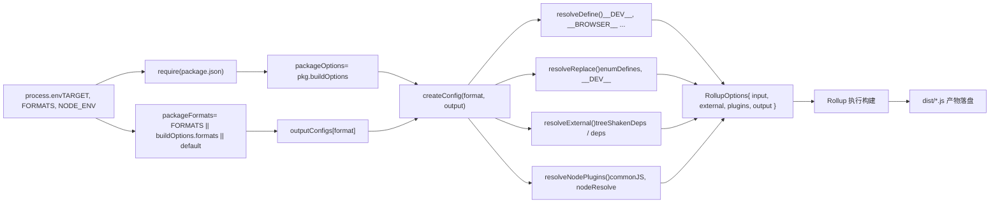

# Chapter 02: Build Closed-Loop: End-to-End Call Chain of a Build

上一章我们厘清了 core 仓库作为工程化母体的定位，以及 pnpm workspace 与根级配置如何统一约束所有子包。现在，我们深入构建系统的核心，追踪一条命令如何驱动整个构建流程。`node scripts/build.js vue` 看似简单，却是所有产物——esm-bundler、cjs、global——的唯一入口。理解它如何将用户意图翻译成可执行的构建任务，是掌握 Vue 构建机制的关键一步。

`build.js` 通过 `exec` 启动 Rollup 后，控制权转移到 `rollup.config.js`。这个文件是构建系统的「大脑」——它读取环境变量，动态生成 Rollup 配置对象数组。

## 环境变量校验与包定位

[FACT:rollup.config.js:27-29]

如果 `TARGET` 未设置，直接抛错。这是防御性编程：Rollup 配置可能被直接调用（如 `rollup -c`），此时没有 `build.js` 注入环境变量，必须快速失败。

[FACT:rollup.config.js:32-44]

这里重复了 `build.js` 中的私有包判断逻辑——因为 `rollup.config.js` 是独立进程，无法共享 `build.js` 的内存状态。`resolve` 函数把相对路径解析为包目录下的绝对路径，`pkg` 是目标包的 `package.json` 内容，`packageOptions` 是其中的 `buildOptions` 字段，`name` 是产物文件名前缀（优先用 `buildOptions.filename`，否则用目录名）。

## 格式映射表：`outputConfigs`

[FACT:rollup.config.js:58-88]

这张表定义了 7 种格式到输出配置的映射。关键观察：

- `esm-bundler`、`esm-browser`、`esm-bundler-runtime`、`esm-browser-runtime` 都是 `format: 'es'`，区别只在文件名。
- `cjs` 是 `format: 'cjs'`。
- `global` 和 `global-runtime` 是 `format: 'iife'`（立即执行函数表达式），适合 `<script>` 标签直接引入。
- `runtime` 后缀的格式只对主 `vue` 包有意义——它们不包含编译器，体积更小。

## 格式选择：三层优先级

[FACT:rollup.config.js:91-92]

格式选择遵循三层优先级：命令行 `FORMATS` 环境变量 > 包的 `buildOptions.formats` > 默认 `['esm-bundler', 'cjs']`。`PROD_ONLY` 环境变量控制是否跳过基础配置——如果只构建生产版本，基础配置数组为空，后续只推入生产配置。

## 生产配置的追加逻辑

[FACT:rollup.config.js:97-114]

当 `NODE_ENV === 'production'` 时，对每个格式：

- 如果 `packageOptions.prod === false`，跳过（该包不需要生产版本）。
- 如果是 `cjs`，追加 `createProductionConfig`——生成 `.prod.js` 文件。
- 如果匹配 `/^(global|esm-browser)(-runtime)?/`，追加 `createMinifiedConfig`——生成压缩版。

> **〔Design Inference & Architectural Trade-offs〕**
> 为什么 `cjs` 用 `createProductionConfig` 而 `global`/`esm-browser` 用 `createMinifiedConfig`？因为 CJS 是给 Node 用的，Node 环境不需要压缩（用户自己会处理），但需要区分 dev/prod 分支；而浏览器直接引入的产物必须压缩以减小体积。这个差异体现在两个工厂函数的实现上。

## `createConfig`：配置生成的核心

`createConfig` 是最大的函数，它接收格式和输出配置，返回完整的 Rollup 配置对象。

[FACT:rollup.config.js:125-142]

开头是一系列布尔标志位的计算：

- `isProductionBuild`：通过 `__DEV__` 环境变量或文件名是否含 `.prod.js` 判断。
- `isBundlerESMBuild`、`isBrowserESMBuild`、`isCJSBuild`、`isGlobalBuild`：通过格式名正则匹配。
- `isServerRenderer`：包名是否为 `server-renderer`。
- `isCompatPackage`、`isCompatBuild`：Vue 2 兼容构建相关。
- `isBrowserBuild`：全局构建或浏览器 ESM 构建，且未启用非浏览器分支。

这些标志位在后续的 `resolveDefine`、`resolveReplace`、`resolveExternal` 中被反复使用，是配置差异化的核心依据。

[FACT:rollup.config.js:144-157]

输出配置的基础设置：banner 版权头、`exports` 模式（compat 包用 `auto`，其余用 `named`）、CJS 构建启用 `esModule` 互操作、sourcemap 由环境变量控制、`externalLiveBindings: false` 和 `reexportProtoFromExternal: false` 是 Rollup 4 的兼容性设置。全局构建额外设置 `output.name`，即挂载到 `window` 上的变量名。

## 入口文件选择

[FACT:rollup.config.js:159-168]

默认入口是 `src/index.ts`，但 `runtime` 后缀的格式用 `src/runtime.ts`。compat 包的 ESM 构建需要同时导出 default 和 named，所以用单独的 `esm-index.ts` / `esm-runtime.ts` 入口。

## 宏定义：`resolveDefine`

[FACT:rollup.config.js:170-218]

`resolveDefine` 返回一个替换表，把源码中的 `__COMMIT__`、`__VERSION__`、`__BROWSER__` 等宏替换为字面量。这些宏在源码中用于条件编译——例如 `if (__DEV__) { ... }` 在生产构建中会被替换为 `if (false) { ... }`，进而被 Tree-shaking 移除。

关键设计：`__FEATURE_OPTIONS_API__`、`__FEATURE_PROD_DEVTOOLS__` 等特性开关在 `esm-bundler` 构建中保留为 `__VUE_OPTIONS_API__` 这样的标识符，让最终用户可以通过打包器配置覆盖；而在其他构建中直接硬编码为 `true` 或 `false`。

[FACT:rollup.config.js:203-206]

非 `esm-bundler` 构建硬编码 `__DEV__`，因为它们的 dev/prod 分支在构建时就已确定。

[FACT:rollup.config.js:210-216]

最后一步允许环境变量覆盖任何宏定义，支持 `__RUNTIME_COMPILE__=true pnpm build runtime-core` 这样的内联覆盖。

## 替换插件：`resolveReplace`

[FACT:rollup.config.js:222-255]

`resolveReplace` 在 `resolveDefine` 之外处理 esbuild 无法处理的替换：

- 合并 `enumDefines`（来自 `inlineEnums` 的枚举内联定义）。
- 生产浏览器构建中，给错误创建函数加 `/*@__PURE__*/` 注解，帮助 Tree-shaking。
- `esm-bundler` 构建中，`__DEV__` 替换为 `!!(process.env.NODE_ENV !== 'production')`，让打包器决定。
- 浏览器 ESM 构建中，把 `process.env` 替换为空对象，避免浏览器报错。

## 外部依赖：`resolveExternal`

[FACT:rollup.config.js:257-283]

这是上一章结尾思考题的核心。浏览器构建只返回 `treeShakenDeps` 作为 external——这些依赖虽然被 import，但在浏览器分支中不会被实际执行，列在这里只是为了抑制 Rollup 的警告。Node/ESM-bundler 构建则 externalize 所有 `dependencies` 和 `peerDependencies`，以及 `path`、`url`、`stream` 等 Node 内置模块。

## 最终配置对象

[FACT:rollup.config.js:319-352]

返回的配置对象包含：

- `input`：入口文件绝对路径。
- `external`：外部依赖列表。
- `plugins`：插件数组，顺序为 json → alias → enumPlugin → replace → esbuild → nodePlugins。
- `output`：输出配置。
- `onwarn`：过滤掉 `CIRCULAR_DEPENDENCY` 警告（Vue 源码中存在循环依赖，但运行时无害）。
- `treeshake.moduleSideEffects: false`：告诉 Rollup 所有模块都没有副作用，激进 Tree-shaking。

下图展示了从环境变量到最终配置的数据流：

## `exec` 的进程管理

`build.js` 通过 `exec` 启动 Rollup 子进程：

[FACT:scripts/utils.js:64-114]

`exec` 封装了 `spawn`，返回一个 Promise。关键设计：

- `stdio` 默认是 `['ignore', 'pipe', 'pipe']`——stdin 忽略，stdout/stderr 管道捕获。
- `shell: process.platform === 'win32'`——Windows 上需要 shell 才能正确解析命令。
- 通过 `stderrChunks` 和 `stdoutChunks` 数组收集输出，在 `exit` 事件中拼接。
- 退出码为 0 时 resolve，否则 reject 并附带 stderr 内容。

> **〔Design Inference & Architectural Trade-offs〕**
> 注意 `build.js` 调用 `exec` 时传了 `{ stdio: 'inherit' }`，这会覆盖默认的管道配置，让 Rollup 的输出直接透传到终端。这是构建工具的正确行为——用户需要实时看到构建进度。

## 体积检查：`checkAllSizes`

[FACT:scripts/build.js:206-215]

体积检查有两个跳过条件：`devOnly` 为真，或指定了格式但不含 `global`。因为体积检查只针对全局构建产物——那是最终用户直接引入的文件，体积最敏感。

[FACT:scripts/build.js:222-228]

`checkSize` 检查两个文件：`${target}.global.prod.js` 和 `${target}.runtime.global.prod.js`（后者仅在未指定格式或指定了 `global-runtime` 时检查）。

[FACT:scripts/build.js:235-264]

`checkFileSize` 读取文件，用 `gzipSync` 和 `brotliCompressSync` 计算压缩后大小，用 `prettyBytes` 格式化输出。如果 `writeSize` 为真，把结果写入 `temp/size/${fileName}.json`——这是 CI 中体积预算检查的数据来源。

## 类型声明构建

[FACT:scripts/build.js:94-108]

如果 `buildTypes` 为真，调用 `pnpm run build-dts`，并通过 `--environment TARGETS:...` 传递目标列表。这确保只为实际构建的包生成类型声明。

**为什么用 `--environment` 而不是直接传参？** Rollup 的 `--environment` 是唯一能在配置文件中通过 `process.env` 读取的传参方式。直接传 `--config` 参数需要解析 `process.argv`，而 `--environment` 提供了结构化的键值对解析。

**`fuzzyMatchTarget` 的正则陷阱。** `target.match(partialTarget)` 中 `partialTarget` 是用户输入。如果用户输入 `runtime-core`，`-` 在正则中是字面量，没问题；但如果输入 `runtime.core`，`.` 会匹配任意字符，可能匹配到意外目标。这是模糊匹配的固有风险，但 Vue 的包名不含正则特殊字符，实际不会触发。

**并发构建的资源竞争。** `runParallel` 用 `cpus().length` 作为并发上限，但每个 Rollup 进程本身也会启动 worker。在 CI 的低核数容器中，这可能导致内存溢出。生产环境中如果遇到 OOM，可以通过 `--max-old-space-size` 或减少并发数缓解。

**`scanEnums` 的缓存生命周期。** `removeCache` 在 `finally` 中调用，但如果 `scanEnums` 本身抛错，`removeCache` 不会被赋值，`finally` 中的调用会失败。实际上 `scanEnums` 返回的函数在 `try` 之前就已确定，所以这个风险不存在——但这是阅读时需要确认的时序细节。

**`resolveExternal` 的遗漏风险。** 上一章的思考题已经指出：如果给 `runtime-core` 添加新依赖但忘记更新 `resolveExternal`，浏览器构建会把该依赖打包进去（因为不在 external 列表中），导致体积膨胀。这是「白名单 external」策略的固有代价。

一次 `node scripts/build.js vue` 的完整旅程：

1. `parseArgs` 解析命令行，`commit` 同步获取。

2. `run()` 调用 `scanEnums` 生成枚举缓存，解析目标（`fuzzyMatchTarget` 或 `allTargets`）。

3. `buildAll` 通过 `runParallel` 并发调度 `build`。

4. `build` 定位包目录、读取 `package.json`、过滤私有包、清理 `dist`、拼装 `--environment` 参数、调用 `exec` 启动 Rollup。

5. `rollup.config.js` 读取环境变量，通过 `createConfig` 生成配置数组，`resolveDefine`/`resolveReplace`/`resolveExternal` 分别处理宏、替换和外部依赖。

6. Rollup 执行构建，产物落盘到 `dist/`。

7. `checkAllSizes` 计算 gzip/brotli 体积，可选写入 `temp/size/`。

8. 如果 `--withTypes`，调用 `build-dts` 生成类型声明。

Q1: 在 `build.js` 的 `build` 函数中，`if (!formats && fs.existsSync(...))` 这个条件决定了是否删除 `dist` 目录。如果去掉 `!formats` 这个条件（即无论是否指定格式都删除 `dist`），在 `pnpm build-all-cjs` 这样的脚本中会发生什么？

**参考解析**：

[FACT:scripts/build.js:172-175]

`pnpm build-all-cjs` 对应 `node scripts/build.js vue runtime compiler reactivity shared -af cjs`（见 [FACT:package.json:40]）。它指定了 `-f cjs`，所以 `formats` 为 `'cjs'`，`!formats` 为假，当前逻辑不会删除 `dist`。

如果去掉 `!formats`，每次构建都会删除 `dist`。但 `build-all-cjs` 只构建 `cjs` 格式，删除后 `dist` 中只剩 `cjs` 产物，之前构建的 `esm-bundler`、`global` 等格式全部丢失。更严重的是，`build-runtime-esm`、`build-browser-esm` 等脚本会依次执行（见 [FACT:package.json:39] 的 `build-sfc-playground` 脚本），每个脚本都会删除前一个脚本的产物，导致最终 `dist` 中只有最后一个脚本的格式。这会破坏 SFC Playground 的构建——它需要同时存在多种格式的产物。

Q2: `runParallel` 中 `if (maxConcurrency <= source.length)` 这个条件的作用是什么？如果去掉它，在构建单个包（`targets.length === 1`）时会发生什么？

**参考解析**：

[FACT:scripts/build.js:131-151]

这个条件控制是否启用并发限流。当 `maxConcurrency > source.length` 时，不需要限流——所有任务可以同时启动。如果去掉这个条件，即使只有一个任务，也会创建 `executing` 数组并执行 `await Promise.race(executing)`。

对于单个任务，`executing` 中只有一个 Promise `e`，`Promise.race` 会等待它完成。这不会导致错误，但会引入不必要的 Promise 链和微任务调度开销。更重要的是，`executing.splice(executing.indexOf(e), 1)` 在单任务场景下仍然正确工作，所以功能上无差异，只是性能上的微小损失。

真正的风险在于：如果 `maxConcurrency` 为 0（理论上不可能，因为 `cpus().length` 至少为 1），`executing.length >= 0` 永远为真，`Promise.race([])` 会永远挂起。但 `cpus().length` 保证了这个边界不会触发。

Q3: `resolveExternal` 中，浏览器构建返回 `treeShakenDeps` 作为 external，但这些依赖在浏览器分支中不会被实际执行。如果把它们从 external 列表中移除（即让 Rollup 尝试打包它们），会发生什么？

**参考解析**：

[FACT:rollup.config.js:257-283]

`treeShakenDeps` 包含 `source-map-js`、`@babel/parser`、`estree-walker`、`entities/decode`。这些是 `compiler-sfc` 等包的依赖，在浏览器构建中通过 `__BROWSER__` 宏被条件编译排除。

如果从 external 中移除，Rollup 会尝试解析并打包这些依赖。由于 `treeshake.moduleSideEffects: false`（[FACT:rollup.config.js:355-355]），且这些依赖的导入语句位于 `if (!__BROWSER__)` 分支中，esbuild 的 define 会把 `__BROWSER__` 替换为 `true`，导致分支被标记为死代码。Rollup 的 Tree-shaking 会移除这些导入，最终产物中不会包含这些依赖的代码。

但问题在于：Rollup 在 Tree-shaking 之前需要先解析模块。如果这些依赖没有安装（例如在精简的 CI 环境中），Rollup 会报「无法解析模块」的错误。把它们列为 external 是一种防御措施——即使依赖不存在，Rollup 也不会尝试解析，只是发出警告（而 `onwarn` 会过滤掉非循环依赖的警告）。

至此，我们完整走过了从命令解析到 Rollup 调用的构建旅程，揭示了并发调度、私有包过滤等核心机制。然而，生产构建只是故事的一半。下一章，我们将转向开发态链路，看 `scripts/dev.js` 如何与 SFC 预编译协作，实现毫秒级的开发反馈循环。