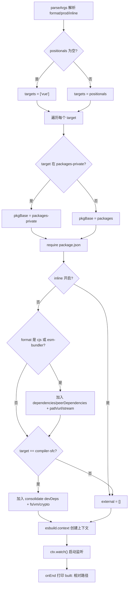
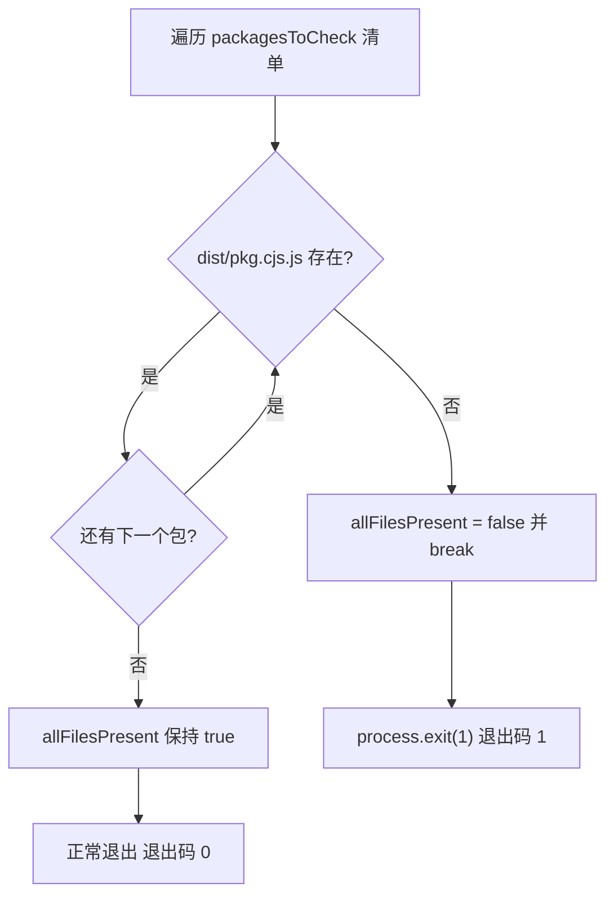
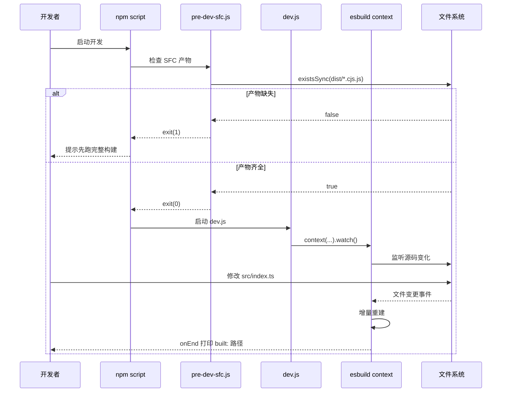

# Back to top ↑

Book progress: Chapter 3 / 14`scripts/dev.js`Verification status: FACT line numbers are truly anchored`scripts/pre-dev-sfc.js`In the previous chapter, we traced the complete pipeline of production builds from argument parsing to multi-format artifact output, a pipeline that pursues completeness and standardization of artifacts. But the core demand of development mode is only one thing: change one line of code, and immediately see the effect in the browser. The production build pipeline of "parse arguments → generate config → full bundle → write to disk" often takes tens of seconds and cannot satisfy this demand at all. The Vue core repository maintains an independent development-time pipeline for this:

# uses esbuild's watch mode for incremental builds,

## and precompiles the SFC compiler before the main build. This chapter breaks down the collaboration mechanism between the two.

3.1 dev.js: An Incremental Builder That Trades Speed with esbuild[FACT:scripts/dev.js:3-5]

Intuitive Model

## Production builds are like "formal typesetting and printing at a printing factory"—quality first, slower is okay; development builds are like "pencil sketches on scratch paper"—not seeking refinement, only seeking immediate appearance. Vue chooses esbuild instead of Rollup to draw this sketch, and the reason is written in the comments at the beginning of the file: Rollup artifacts are smaller and Tree-shaking is better, but esbuild is much faster.

Without this script, developers would have to run a full production build for every change, and the feedback loop would degrade from milliseconds to minutes, completely losing the hot update experience.`parseArgs`Argument Parsing and Format Inference`format`The script entry uses Node's built-in`global`）、`prod`to parse three options:`false`）、`inline`(default`false`）。[FACT:scripts/dev.js:18-40]positional arguments are collected as`targets`, if empty then defaults to`['vue']`。[FACT:scripts/dev.js:42-53]

> **[Design Inference & Architectural Trade-offs]**
> There is an easily overlooked detail here:`rawFormat`and`format`are two separate assignments.`parseArgs`'s`default: 'global'`already guarantees that`rawFormat`has a value, but the script still writes`const format = rawFormat || 'global'`as a fallback.[FACT:scripts/dev.js:42]This is a defensive pattern, avoiding`parseArgs`behavior changes or downstream`format.startsWith`throwing errors when an empty string is explicitly passed in.

`format`The mapping to esbuild output format is a three-way branch: starting with`global`maps to`iife`, equal to`cjs`maps to`cjs`, everything else defaults to`esm`。[FACT:scripts/dev.js:42-53]The artifact filename suffix is handled separately by the`-runtime`suffix:`global-runtime`becomes`runtime.global`, the rest remain unchanged.[FACT:scripts/dev.js:42-53]

## Target Package Location and Output Path

The script first reads the`packages-private`directory listing, used to determine whether the target package is a public or private package.[FACT:scripts/dev.js:56]For each target, decide whether the package base path is`packages`or`packages-private`, then`require`its`package.json`to get`version`and`buildOptions`。[FACT:scripts/dev.js:58-63]

There is a special case for output filenames:`vue-compat`targets are renamed to`vue`, avoiding artifacts named`vue-compat.global.js`。[FACT:scripts/dev.js:64-69]The final path looks like`packages/vue/dist/vue.global.js`，`prod`When true, insert`prod.`segment.

## external resolution: avoiding bundling dependencies into artifacts

`external`The array determines which modules are not bundled. The logic is split into two layers:

First layer, when`inline`is not enabled and the format is`cjs`or contains`esm-bundler`, add all keys of`dependencies`、`peerDependencies`to external, and hardcode`path`、`url`、`stream`three Node built-in modules.[FACT:scripts/dev.js:76-88]The comment explicitly states these three are for`@vue/compiler-sfc`and`server-renderer`.

Second layer, for the`compiler-sfc`target, additionally resolve`@vue/consolidate`'s`devDependencies`, and externalize them along with`fs`、`vm`、`crypto`etc.[FACT:scripts/dev.js:90-112]The code also hardcodes`react-dom/server`、`teacup/lib/express`、`arc-templates/dist/es5`、`then-pug`、`then-jade`and other template engine paths—these are template engines supported by consolidate, which are optional dependencies and cannot be force-installed.

> **[Design Inference & Architectural Trade-offs]**
> This logic is highly duplicated with`rollup.config.js`, and the source comments acknowledge this (`TODO this logic is largely duplicated from rollup.config.js`). The reason no shared function was extracted is that dev and prod external strategies have subtle differences (dev externalizes more aggressively to speed up builds), and forcing unification would instead increase coupling.

## Plugins and define injection

The plugin array defaults to only one`log-rebuild`, which prints the relative path of build artifacts in the`onEnd`hook.[FACT:scripts/dev.js:115-124]This is the only feedback signal for developers to perceive "changes have taken effect".

> **[Design Inference & Architectural Trade-offs]**
> The second plugin is conditional: when the format is not`cjs`and the package's`buildOptions.enableNonBrowserBranches`is true, mount`polyfillNode()`。[FACT:scripts/dev.js:126-128]Packages like`compiler-sfc`still go through the Node branch in browser builds, requiring polyfills for Node built-in modules to run in the browser environment.

`define`The block is the most information-dense part of this chapter.[FACT:scripts/dev.js:141-159]It replaces all`__XXX__`macros in the source code with literals:

- `__COMMIT__`is fixed to`"dev"`，`__VERSION__`takes the package version;
- `__DEV__`is determined by the`prod`flag,`__TEST__`is always`false`；
- `__BROWSER__`The derivation of is the most subtle:`format !== 'cjs' && !pkg.buildOptions?.enableNonBrowserBranches`。[FACT:scripts/dev.js:146-148]That is, only "non-cjs and the package does not support non-browser branches" is marked as browser environment;
- `__SSR__`is`format !== 'global'`, i.e., global builds do not enable the SSR branch;
- `__COMPAT__`is determined by whether the target is`vue-compat`;
- Three feature flags (`__FEATURE_SUSPENSE__`、`__FEATURE_OPTIONS_API__`、`__FEATURE_PROD_DEVTOOLS__`、`__FEATURE_PROD_HYDRATION_MISMATCH_DETAILS__`) are all hardcoded in dev mode.

These macros correspond one-to-one with the`vitest.config.ts`in`define`block.[FACT:vitest.config.ts:6-21]The test environment sets`__TEST__`to`true`、`__DEV__`and sets`true`, and the difference from dev builds is precisely the distinction between "test vs development" runtime states.

## watch mode startup

The last step is`esbuild.context(...).then(ctx => ctx.watch())`。[FACT:scripts/dev.js:130-161] `context`creating a build context but not executing immediately,`watch()`actually starts file watching. After that, esbuild internally maintains a dependency graph, and any change to a depended-upon file triggers incremental rebuild, with the rebuild completion callback`onEnd`printing logs.

# 3.2 pre-dev-sfc.js: A pre-compilation sentinel to break circular dependencies

## Intuitive model

Imagine a "chicken-and-egg" dilemma:`compiler-sfc`'s source code imports`compiler-core`, while`compiler-core`in development mode needs`compiler-sfc`to process`.vue`files. If both rely on esbuild watch for real-time compilation, whoever compiles first gets stuck.`pre-dev-sfc.js`'s role is to "hatch the egg first, then raise the chicken"—before the main build starts, ensure the CJS artifacts of these packages already exist.

## Checklist and short-circuit logic

The script maintains a fixed checklist:`compiler-sfc`、`compiler-core`、`compiler-dom`、`compiler-ssr`、`shared`。[FACT:scripts/pre-dev-sfc.js:4-10]For each package, check whether`packages/${pkg}/dist/${pkg}.cjs.js`exists.[FACT:scripts/pre-dev-sfc.js:4-23]

As long as one is missing,`allFilesPresent`is set to`false`and immediately`break`, without checking the remaining packages.[FACT:scripts/pre-dev-sfc.js:20-21]Finally, if`allFilesPresent`is false,`process.exit(1)`exits with a non-zero code.[FACT:scripts/pre-dev-sfc.js:25-27]

## Semantics of exit codes

This script itself does not perform any compilation; it only does "existence assertions".`exit(1)`is a signal for upper-level callers (usually the npm script's`&&`chain or CI scripts): artifacts are incomplete, a full build needs to be run first. If all exist, it exits normally (exit code 0), and the main build continues.

# 3.3 aliases.js and vitest.config.ts: The other half of the development-time pipeline

`scripts/dev.js`solves "how to quickly generate artifacts", but during development there is another path: running tests.`scripts/aliases.js`provides shared path aliases for vitest and rollup.[FACT:scripts/aliases.js:7-7]

## Alias generation logic

`resolveEntryForPkg`maps package names to`packages/${p}/src/index.ts`。[FACT:scripts/aliases.js:7-7]The base entries hardcode four special mappings:`vue`、`vue/compiler-sfc`、`vue/server-renderer`、`@vue/compat`。[FACT:scripts/aliases.js:16-21]

Then iterate through`packages`all subdirectories under the directory, skipping`vue`itself, skipping`nonSrcPackages`（`sfc-playground`、`template-explorer`、`dts-test`), skipping existing keys, and only if it is a directory, add it to the`@vue/${dir}`mapping.[FACT:scripts/aliases.js:23-35]

> **[Design Inference & Architectural Trade-offs]**
> This strategy of "hardcoded special items + dynamic scanning of general items" is to allow new packages to be added without manually modifying the alias file—as long as the directory name follows the convention, vitest can automatically resolve it.`nonSrcPackages`The exclusion list is because these three packages have no`src/index.ts`entry point, and forcing a mapping would cause parsing to fail.

## Vitest's define and alias consumption

`vitest.config.ts`directly import`entries`as`resolve.alias`。[FACT:vitest.config.ts:3][FACT:vitest.config.ts:22-24]its`define`blocks contrast with the macro injection in dev.js: the test environment`__DEV__: true`、`__TEST__: true`、`__BROWSER__: false`、`__CJS__: true`。[FACT:vitest.config.ts:6-21]

tests are split into five projects:`unit`、`unit-gc`、`unit-jsdom`、`e2e`、`e2e-browser`。[FACT:vitest.config.ts:51-118]among them`unit-gc`uses`pool: 'forks'`and passes`--expose-gc`specifically to run SSR tests that require manually triggering GC.[FACT:vitest.config.ts:65-76] `e2e-browser`enables Playwright's Chromium instance to run Transition-related tests.[FACT:vitest.config.ts:99-117]

# Design considerations

**Why use esbuild for dev and Rollup for prod?**This is not an arbitrary technical choice, but rather because the constraints of the two scenarios differ. In development, bundle size is not sensitive, while feedback latency is extremely sensitive; in production, the opposite is true. esbuild is written in Go and is highly parallelized, making cold starts and incremental builds an order of magnitude faster, but its tree-shaking and code-splitting capabilities are weaker than Rollup's.[FACT:scripts/dev.js:3-5]Using two sets of tools to serve two scenarios separately is a pragmatic engineering trade-off.

> **[Design Inference & Architectural Trade-offs]**
> **Why does pre-dev-sfc only check and not compile?**If it triggered compilation itself, it would reintroduce the circular dependency—it needs to compile`compiler-sfc`, and the compilation process itself may depend on`compiler-sfc`'s output. So it can only perform an "assertion," exposing the fact of "missing output" to the upper layer, which then decides whether to run a full build or report an error and exit. This is a kind of "sentinel pattern": it does not solve the problem, it only reports it.

**Is the duplication in the external list technical debt?**The external logic in dev.js and rollup.config.js is duplicated, and the source comments acknowledge this.[FACT:scripts/dev.js:73]However, the external sets of the two are not completely identical—dev externalizes more aggressively for speed. Forcibly extracting a shared function would require introducing a parameterized difference switch, which would instead make both pieces of logic harder to read. This is a typical trade-off of "duplication over the wrong abstraction."

# Chapter summary

This chapter breaks down the three pieces of the Vue core development-mode pipeline:

1. **`scripts/dev.js`**: use esbuild's`context().watch()`to implement incremental builds, through`parseArgs`parse formats and flags, dynamically`require`target package`package.json`locate the output path, inject`__DEV__`、`__BROWSER__`and other macros to control conditional compilation, and use`log-rebuild`plugin to print feedback after each rebuild.

2. **`scripts/pre-dev-sfc.js`**: before the main build, check whether the CJS outputs of the five core packages exist; if missing, short-circuit with exit code 1 to avoid build deadlock caused by circular dependencies.

3. **`scripts/aliases.js` + `vitest.config.ts`**: provide shared path aliases for the test pipeline, with hardcoded special entries plus dynamic scanning of general entries, combined with multi-project configuration to cover five test scenarios: unit, GC, jsdom, e2e, and browser e2e.

# Chapter review and self-test

Q1: If you remove`scripts/pre-dev-sfc.js`from`break`(that is, check all packages before deciding to exit), in what scenarios would the developer experience worsen? Why did the source author choose to "short-circuit upon finding the first missing one"?

**Reference analysis**：

[FACT:scripts/pre-dev-sfc.js:4-23]

`break`is located in`if (!fs.existsSync(...))`branch, and once a package output is found to be missing, it immediately breaks out of the loop.

If you remove`break`, the script will continue checking the remaining packages, and ultimately`allFilesPresent`is still`false`, the exit code is still 1,**functionally equivalent**. But the difference lies in:

1. **Performance**: the five`existsSync`calls themselves are fast, but if the manifest expands to dozens of packages, short-circuiting can save a large number of unnecessary stat system calls.

2. **Semantics**: short-circuiting expresses "if even one is missing, the whole is incomplete"—this is a Boolean assertion, and there is no need to know exactly how many are missing. Continuing to check produces no additional information.

3. **Developer experience**: what actually worsens is the "error message." The current script does not print which package is missing; the developer only sees exit code 1. If you remove`break`and add logging, it could instead tell the developer "compiler-core and shared are missing"—but this requires extra code. The author chose the simplest implementation, leaving the diagnosis of "which one is missing" to the upper-level build script's error reporting.

So`break`'s core motivation is "assertion semantics + performance," not experience optimization.

Q2: `scripts/dev.js`In`__BROWSER__`the derivation of`format !== 'cjs' && !pkg.buildOptions?.enableNonBrowserBranches`is`buildOptions.enableNonBrowserBranches`. Suppose some package's`true`is`-f global`, and the developer uses`__BROWSER__`to build; at this time`false`is`true`. What consequences would this cause? What if it were mistakenly changed to

**?**：

[FACT:scripts/dev.js:146-148]

Reference analysis`format = 'global'`When`enableNonBrowserBranches = true`and

- `format !== 'cjs'`:`true`
- `!pkg.buildOptions?.enableNonBrowserBranches`is`false`
- is`__BROWSER__ = false`

overall`if (__BROWSER__)`This means that all`if (false)`branches in the source code are replaced by esbuild's define with

**, browser-specific code is removed by tree-shaking, and non-browser branches (Node-specific logic) are retained.**Consequence`fs`、`path`: the global build output is supposed to run in the browser, but it includes Node-specific branches. If these branches reference`enableNonBrowserBranches`and other Node built-in modules, the browser will report "module undefined" when loading. This is exactly why packages for which`compiler-sfc`is true (such as`polyfillNode()`) are usually not used for global builds, or require[FACT:scripts/dev.js:126-128]

**plugin as a fallback.`true`**：`__BROWSER__ = true`If mistakenly changed to`compiler-sfc`, the browser branch is retained and the Node branch is removed. For

Q3: `scripts/aliases.js`, a package that must run SFC compilation in a Node environment, this would cause core functionality (reading files, calling Node APIs) to be tree-shaken away, and the output would report "function undefined" when run in Node.`packages`In`nonSrcPackages`（`sfc-playground`、`template-explorer`、`dts-test`, when dynamically scanning the`packages`directory, it skips`src/index.ts`, and has not been added to`nonSrcPackages`, what happens? At which stage will vitest throw an error at runtime?

**Reference analysis**：

[FACT:scripts/aliases.js:23-35]

The dynamic scanning logic is: for each directory, if`dir !== 'vue'`, not in`nonSrcPackages`, the key does not exist, and it is a directory, then add it to`entries['@vue/${dir}'] = resolveEntryForPkg(dir)`。

`resolveEntryForPkg`returns the path of`packages/${p}/src/index.ts`.[FACT:scripts/aliases.js:7-7]Note that it**does not check whether the file exists**, it only concatenates paths.

**Consequence**: the alias will be registered, but it points to a nonexistent file. When vitest resolves an import, if some test file imports this package, Vite's resolve plugin will try to load that path and report "cannot resolve module" or "file does not exist."

**Error stage**: not when`aliases.js`executes (it only does string concatenation), but after vitest starts, the first time that import is resolved. If no test imports this package, no error will occur—the alias just sits in the`entries`object.

**Workaround**: add such packages without`src/index.ts`to`nonSrcPackages`, or ensure the new package has a standard entry point. This is also why`nonSrcPackages`needs to be maintained manually—it is the exception list to "convention over configuration."

The boundaries of the collaboration among the three are very clear:`pre-dev-sfc`manages "whether the artifact is ready,"`dev.js`manages "how the artifact is quickly updated,"`aliases`manages "how tests resolve source code." The development-time pipeline solves the speed problem, but there is another, more hidden type of optimization during the build phase—transformations that are completed before the code is executed by the browser. The next chapter will enter compile-time magic and look at how enum inlining and the Tree-shaking verification mechanism replace TypeScript enums with literals during the build phase, and ensure that the promise of on-demand imports is not broken.
