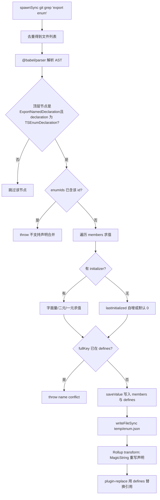
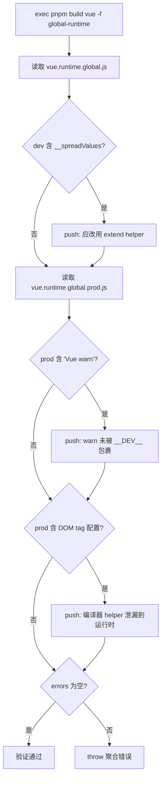

# Chapter 4: Compile-Time Magic: Enum Inlining and Tree-shaking Verification Mechanism

In the previous chapter, we saw how the development-time pipeline uses file watching and incremental builds to trade for the speed of "change one line and it takes effect immediately." But beyond speed, Vue has another more hidden constraint: the size of the published artifact must be controllable. One of the enemies of this constraint is TypeScript's enum—at runtime it is a real object and will break Tree-shaking. This chapter enters the compile phase to see how scripts/inline-enums.js "dissolves" enums into literals before the code is executed by the browser; then see how scripts/verify-treeshaking.js, after the build, uses artifact strings to reverse-verify that the promise of "on-demand imports" has not been quietly broken.

# 4.1 Enum Inlining: Dissolving Runtime Objects into Literals

## Intuitive model

Imagine you write a recipe in which "a pinch of salt" appears repeatedly. If every time you cook you have to flip to the appendix to look up "a pinch = 3 grams," it is both slow and takes up space. What enum inlining does is, before printing, directly replace every "a pinch of salt" in the book with "3 grams of salt," and then tear out that appendix page. For the reader (the runtime), the result is exactly the same, but the book is thinner.

If it did not exist, what disaster would the system face? An ordinary TypeScript`enum`compiles into a real object literal and has a bidirectional mapping (`Enum[Enum.A] === 'A'`). This object is**a module-level declaration with side effects**, and Rollup cannot prove that it is unused, so it can only keep it—even if you import only one member, the entire enum object together with the reverse mapping will be packed into the artifact.[FACT:scripts/inline-enums.js:3-9]The comments in`const enum`say it very directly: they once used

## , but because of issue #1228 switched to a normal enum, and therefore used this script to "manually recover the zero-cost benefit of const enum."

Data structures and memory layout[FACT:scripts/inline-enums.js:33-36]

- `EnumMember`：`{ name, value }`The core of the script is three type definitions; understanding them means understanding the entire data flow.
- `EnumDeclaration`：`{ id, range: [start, end], members }`。`range`, the name of a single enum member and the evaluated literal.**is**the source byte offset`export enum X { ... }`, pointing to the start and end positions of the entire
- `EnumData`：`{ declarations, defines }`。`declarations`declaration in the file—this is the anchor for the subsequent precise replacement by MagicString.`defines`Indexed by file path, recording the replacement ranges of all enum declarations in that file;` `is a flat mapping whose key is the literal after `` `` 形式的字符串，值是 `${enumName}.${memberName}

JSON.stringify`.`defines`There is a key design here:**the key of**。[FACT:scripts/inline-enums.js:98-103]does not include the file path`ErrorCodes`. The comments explain the reason—`@vue/compiler-core`can exist simultaneously in`@vue/runtime-core`and`ErrorCodes.__EXTEND_POINT__`, so enums with the same name are allowed to exist across files; but the same`fullKey in defines`is not allowed to repeat in two enums with the same name, otherwise`name conflict`is hit and

is thrown directly. This is a constraint of "globally unique by member name," not "globally unique by enum name."`temp/enum.json`。[FACT:scripts/inline-enums.js:33-36]The cache is stored in`scanEnums()`Why is persistence to disk needed? Because**is called only once at the build entry, while Rollup will start**。[FACT:scripts/inline-enums.js:39-41]independent processes`inlineEnums()`for each package and each format. The comments point out: the data must be shared across concurrent Rollup processes, so it must be serialized to disk and read back by each process's

## .

**Step-by-Step: From grep to literal replacement`export enum`Step 1: grep out all files containing**[FACT:scripts/inline-enums.js:51-61].`spawnSync('git', ['grep', 'export enum'])`uses`path:line:content`, and the output looks like`:`, then split out the first segment (the file path) by`Set`, and use`git grep`instead of traversing the file system—it naturally only scans files tracked by Git, automatically excluding`node_modules`and build artifacts.

**Step 2: Babel parses and collects enum information.**[FACT:scripts/inline-enums.js:64-70]For each file, use`@babel/parser`with the`typescript`plugin,`sourceType: 'module'`parse into an AST, then only traverse`ast.program.body`top-level nodes.[FACT:scripts/inline-enums.js:74-79]Only recognize`ExportNamedDeclaration`nodes where`declaration.type === 'TSEnumDeclaration'`—that is,**non-exported enums will not be processed.**。

For each enum declaration, the script evaluates members one by one. Member evaluation has three paths:

1. **Literal initialization**：`StringLiteral`or`NumericLiteral`directly take`init.value`。[FACT:scripts/inline-enums.js:114-119]

2. **Binary expression**: such as`1 << 2`. Recursively`resolveValue`process the left and right operands; operands can be literals or`MemberExpression`(i.e., referencing previously defined enum members).[FACT:scripts/inline-enums.js:121-151]The key is in the`MemberExpression`branch: it uses`content.slice(node.start, node.end)`to extract the expression string from**the original source text**(such as`ErrorCodes.FOO`), then look up`defines`. If not found, throw`unhandled enum initialization expression`。[FACT:scripts/inline-enums.js:132-141]This explains why`defines`must be a global flat map—when referencing across enums, the referenced member may come from another file, but the key only recognizes`枚举名.成员名`。

3. **Unary expression**: such as`-1`, concatenate into a`-1`string and then use`evaluate`to evaluate.[FACT:scripts/inline-enums.js:152-163]

The evaluation itself uses`new Function('return ' + exp)()`。[FACT:scripts/inline-enums.js:39-41]This is a**controlled eval**: the input comes from already-parsed AST fragments in the source code, not arbitrary user input, so the safety boundary is controllable.

**Step 3: Handle members without initializers (auto-increment semantics).**[FACT:scripts/inline-enums.js:171-183]If a member has no`initializer`: the first member defaults to`0`; for subsequent members, if`lastInitialized`is a number then`++`; if it is a string then throw`wrong enum initialization sequence`—because string enum members do not allow implicit auto-increment. This is exactly the semantics of TypeScript enums.

**Step 4: Write cache and return a cleanup function.**[FACT:scripts/inline-enums.js:200-213] `scanEnums()`Return a closure; calling it`rmSync`deletes the cache file.`build.js`Use it in`try/finally`.[FACT:scripts/build.js:81-112]This ensures that even if an error is thrown midway through the build, the cache will be cleaned up and will not pollute the next build.

**Step 5: Rollup transform phase replacement.** `inlineEnums()`Read back the cache and construct a Rollup plugin.[FACT:scripts/inline-enums.js:219-234]In`transform(code, id)`, if`id`hits`enumData.declarations`, use MagicString to replace`[start, end]`this declaration with an object literal.[FACT:scripts/inline-enums.js:242-274]

The replaced form is`export const X = { ... }`. Note that it**does not simply delete the enum**, but rewrites it into an object literal, and additionally generates reverse mappings for numeric members:`JSON.stringify(value.toString()) + ': ' + JSON.stringify(name)`。[FACT:scripts/inline-enums.js:257-270]The comment references the reverse-mappings rule in the official TypeScript documentation: string enum members do not generate reverse mappings, numeric members do. This ensures that the runtime behavior after replacement is exactly the same as the original enum.

What truly eliminates runtime overhead is that`defines`is handed to`@rollup/plugin-replace`。[FACT:rollup.config.js:222-223]all references to`X.Member`'s**references**are directly replaced with literals in the replacement plugin, so if that rewritten object literal is unused, it can be tree-shaken away.

The following flowchart depicts the complete decision path from grep to replacement:

## Design considerations and pitfalls

**Why use MagicString instead of regenerating the entire file?**Because`s.update(start, end, ...)`only replaces the enum declaration segment, leaving all other source bytes completely untouched,`s.generateMap()`and can still generate precise sourcemaps.[FACT:scripts/inline-enums.js:277-281]If Babel were used to reprint the entire AST, the original formatting and comments would be lost, and sourcemap quality would degrade.

**`range`Why is it`node.start/node.end`rather than`declaration.start`？**[FACT:scripts/inline-enums.js:189-193]asserts`node.start`(i.e.,`ExportNamedDeclaration`node), and the replacement range covers`export enum X {...}`the entire segment, including the`export`keyword. The replacement text starts with`export const`, which connects exactly.

**Pitfalls:`defines`The global uniqueness constraint of**If two different files each have a`ErrorCodes`, and both define`__EXTEND_POINT__`, the build will fail directly.[FACT:scripts/inline-enums.js:101-103]This is not a bug, but a deliberate design—because`defines`is a global replacement table and cannot distinguish file origins. In production, when adding new enum members, if the name conflicts with an existing enum member, it will blow up here.

**Pitfall:`new Function`The evaluation timing of**Binary expression evaluation occurs during the`scanEnums`phase, at which point`defines`may not yet contain the referenced member (if the reference order is reversed).[FACT:scripts/inline-enums.js:136-140]will throw`unhandled enum initialization expression`. This requires that references to enum members must follow the source order of "define first, reference later."

# 4.2 Tree-shaking verification: using artifact strings to prove the promise in reverse

## Intuitive model

Enum inlining is an "ahead-of-time optimization," but does the optimization actually take effect? If some helper is accidentally retained due to improper coding style, the bundle size will quietly inflate, and the developer will be completely unaware.`verify-treeshaking.js`It is that "post-mortem quality inspector": it builds the artifact, then examines the artifact like an autopsy to check whether things that**should not appear do appear**. Without it, Vue's on-demand import promise might silently break after some refactor, only to be discovered when users complain that the package got bigger.

## Data structures and check items

This script has no complex data structures; the core is a`errors`array and three`includes`checks.[FACT:scripts/verify-treeshaking.js:6-6]It first builds the`global-runtime`format, then reads the dev and prod artifacts separately.

The three check items correspond to three types of "Tree-shaking failures":

1. **The dev artifact contains`__spreadValues`**。[FACT:scripts/verify-treeshaking.js:13-19]This is the helper generated by esbuild for`{ ...obj }`object spread syntax. If it appears, it means object spread was used in the runtime code, whereas Vue's convention is to use the`extend`helper instead to avoid extra code.

2. **The prod artifact contains`Vue warn`**。[FACT:scripts/verify-treeshaking.js:26-31]This indicates there is a`warn()`call not wrapped by the`__DEV__`condition, causing warning code to leak into the production bundle.

3. **The prod artifact contains the DOM tag configuration list**。[FACT:scripts/verify-treeshaking.js:33-42]such as`html,body,base`、`svg,animate,animateMotion`、`annotation,annotation-xml,maction`. These are`isHTMLTag()`Data inside helpers like these should only exist in the compiler and be shaken out by the runtime. If it appears in runtime artifacts, it means the runtime path mistakenly used a compiler-only helper.

## Step-by-Step: Verification Process

[FACT:scripts/verify-treeshaking.js:5-5]First`exec('pnpm', ['build', 'vue', '-f', 'global-runtime'])`, only build`vue`package's`global-runtime`format—this is the minimal runtime artifact, best suited for exposing leaks. After the build completes, read both files synchronously, check each`includes`one by one, and on a hit push a message with an explanation into`errors`. Finally, if`errors.length`is non-zero, throw an aggregated error.[FACT:scripts/verify-treeshaking.js:44-48]

## Design Thinking and Pitfalls

> **[Design Inference & Architectural Trade-offs]**
> **Why use string`includes`instead of AST analysis?**Because this is a "sentinel check" rather than "precise analysis." It does not pursue completeness; it only sets up low-cost alarms for three types of regressions that have actually occurred historically. String matching has zero dependencies, zero parsing overhead, and remains effective on minified artifacts—AST analysis actually becomes harder after minify.

> **[Design Inference & Architectural Trade-offs]**
> **Why only verify`global-runtime`？**This format inlines all dependencies (`external`is empty), making it the artifact most sensitive to size and most easily polluted by mistake. If it is clean, other formats are usually clean too. At the same time, it builds quickly, making it suitable for frequent runs in CI.

> **[Design Inference & Architectural Trade-offs]**
> **Pitfall: The check items are a "blacklist" and will become ineffective as the code evolves.**If one day`isHTMLTag`'s data structure changes,`html,body,base`this string no longer appears, and the check becomes useless. This requires maintainers to update the sentinel strings here in sync when changing related helpers. This is the inherent cost of blacklist-style verification.

# 4.3 Collaboration with Rollup: Plugin Order and define Injection

Enum inlining does not run in isolation; it is embedded in Rollup's plugin pipeline. Only by understanding its position in the pipeline can you understand why`defines`should be handed to`replace`rather than`esbuild`。

[FACT:rollup.config.js:47-50]calling`inlineEnums()`at the top level of the config module, destructuring out`[enumPlugin, enumDefines]`. Note that this is**executed when each Rollup process starts**, reading the cache written by`scanEnums`.

The order of the plugin array is:`json` → `alias` → `enumPlugin` → `...resolveReplace()` → `esbuild`。[FACT:rollup.config.js:324-339] `enumPlugin`is placed before`replace`, meaning enum declaration rewriting happens first, and then`replace`uses`defines`to replace references. And`esbuild`is placed last, responsible for TS transpilation.

Why`defines`goes through`replace`instead of`esbuild`'s`define`？[FACT:rollup.config.js:220-221]comment gives the answer: esbuild's define is "a bit strict, only allowing literal JSON or identifiers." But enum member names like`ErrorCodes.__EXTEND_POINT__`are dotted member expressions, and esbuild's define cannot directly handle such keys. So`@rollup/plugin-replace`must be used, as it supports replacement of arbitrary string keys.[FACT:rollup.config.js:250-251]and sets`preventAssignment: true`, avoiding replacing the left-hand side of assignment statements as well.

`resolveReplace()`In`const replacements = { ...enumDefines }`is the first step.[FACT:rollup.config.js:222-223]Only afterward are production-environment`/*@__PURE__*/`annotations,`__DEV__`and other replacements layered on. This order ensures that enum literal replacement always takes effect.

# Design Thinking

**The essence of enum inlining is "trading build-time complexity for runtime size."**It fully reproduces TypeScript's type system semantics (enum evaluation, auto-increment, reverse mapping) at build time—`scanEnums`the evaluation logic in is almost a subset of the TS compiler's enum evaluation.[FACT:scripts/inline-enums.js:110-183]This brings maintenance cost: if TS adds new enum syntax (such as more complex constant expressions), this must keep up, otherwise it throws`unhandled`an error. But the benefit is clear: zero enum objects at runtime, and Tree-shaking can be thorough.

> **[Design Inference & Architectural Trade-offs]**
> **The verification script and the inline script are a pair of "promise and fulfillment."**The inline script promises "enums do not take up runtime size," and the verification script checks "other code has not secretly taken up size either." Together they guard Vue's size budget. This paired design of "optimization + verification" is a typical pattern in engineering large frontend libraries: any optimization needs an automated check to prevent regression.

**Cross-process caching is a necessity for concurrent builds.** `scanEnums`The pattern of single execution and`inlineEnums`multiple reads[FACT:scripts/inline-enums.js:39-41]solves the problem of "one scan, N processes consuming." Without caching, every Rollup process would have to grep + parse again, wasting a large amount of IO and CPU.

# Chapter Summary

# Chapter Review and Self-Test

Q1: If you delete`scanEnums`in`saveValue`'s`if (fullKey in defines)`conflict check, in what scenarios would it cause errors in the build artifacts?

**Reference Analysis**：

`defines`is a global flat mapping, with keys as`枚举名.成员名`, not including file paths.[FACT:scripts/inline-enums.js:98-103]After deleting the conflict check, if two different files each have an enum with the same name and define a member with the same name (such as`@vue/compiler-core`and`@vue/runtime-core`both having`ErrorCodes.__EXTEND_POINT__`), the later writer will overwrite the earlier writer.

Consequences:`defines['ErrorCodes.__EXTEND_POINT__']`only one value remains, and`plugin-replace`cannot distinguish the file source during replacement, so it will replace**all**files'`ErrorCodes.__EXTEND_POINT__`with the same value.[FACT:rollup.config.js:222-223]As a result, one package's enum member value is silently tampered with, causing incorrect runtime behavior that is extremely hard to troubleshoot—because the source code looks completely correct.

This is exactly why the comment emphasizes "same-name enums across files are allowed, but same-name members are not."[FACT:scripts/inline-enums.js:98-100]The conflict check is the gatekeeper preventing the global replacement table from being polluted.

Q2: If you swap the order of`rollup.config.js`in`enumPlugin`'s plugin array with`...resolveReplace()`, what will happen?

**Reference Analysis**：

The current order is`enumPlugin`first,`replace`later.[FACT:rollup.config.js:331-332]Rollup's`transform`hook executes in plugin array order.

If swapped,`replace`will run first, and at this point the enum declaration is still in its original`export enum X { ... }`form.`replace`uses`defines`to replace`X.Member`references—but at this point the references are still there, so the replacement can take effect. The problem occurs when`enumPlugin`subsequently runs: it uses`s.update(start, end, ...)`to rewrite the declaration section.[FACT:scripts/inline-enums.js:250-273]But`replace`has already modified`code`, and`enumPlugin`receives`code`is`replace`The output's byte offsets have already been compared with`scanEnums`recorded in`range`(based on the original source code)**no longer correspond**。

Consequence: MagicString will cut at the wrong offsets, and the output's syntax will be corrupted. This reveals an implicit contract of the plugin pipeline:**Transformations based on source offsets must be executed first**so that subsequent transformations can safely continue on its output.

Q3: `verify-treeshaking.js`only checks three string sentinels. If some refactor changes`isHTMLTag`internal data from`'html,body,base'`to array form`['html','body','base']`what would the verification script do? What design flaw does this expose?

**Reference analysis**：

The verification script uses`prodBuild.includes('html,body,base')`to check.[FACT:scripts/verify-treeshaking.js:33-37]If the data is changed to an array, the comma-joined string will no longer appear in the minified output,`includes`returns`false`and the check**silently passes**— even if`isHTMLTag`really leaked into the runtime output.

This exposes the inherent flaw of blacklist-style string verification:**sentinel strings are coupled to the source implementation; once the implementation changes, the verification becomes invalid**. It cannot detect "unknown leaks"; it can only detect "known leaks whose string form has not changed."

> **[Design Inference & Architectural Trade-offs]**
> Improvement direction: You could instead check for more stable identifiers (such as the function name`isHTMLTag`), or use lint rules at the source level to prohibit runtime imports of compiler helpers, rather than relying on output strings. But under the current cost constraints, string sentinels are a "good enough and cheap" compromise.

Enum inlining solves "how to eliminate runtime overhead at build time," and the verification script solves "how to confirm that the optimization has not been broken." But build outputs include more than JS; there is another type of artifact that also requires pipeline processing — type declaration files. The next chapter will enter the type artifact pipeline and see how Vue generates a release-grade type package from source`.d.ts`and how`dts-test`uses type contract tests to guard the type shape of the public API.

This chapter dismantled two key scripts in the compilation phase. inline-enums.js uses git grep to locate enums, Babel to parse the AST, new Function to evaluate members, and MagicString to precisely rewrite declarations, ultimately turning enum references into literals through the defines global replacement table, allowing the enum object to be tree-shaken away. verify-treeshaking.js then uses string sentinels to check the build output, ensuring that three known types of Tree-shaking leaks do not regress. One is responsible for "optimization," and the other for "verifying that the optimization has not been broken," together safeguarding Vue's size commitment. Next, we will shift from the compilation phase to the generation pipeline of type artifacts, and see how Vue ensures strict consistency between source types and published types.
