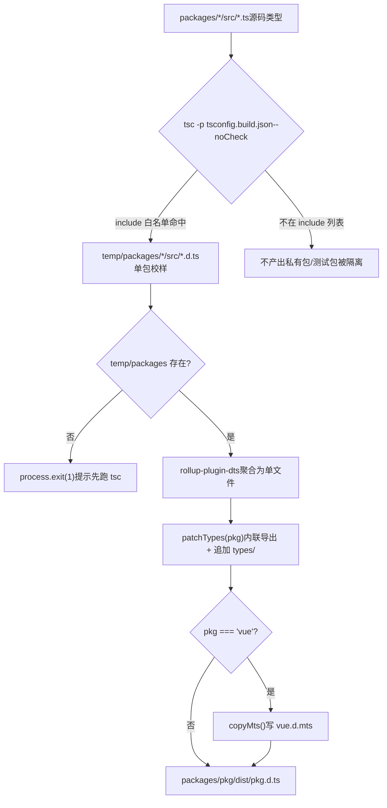
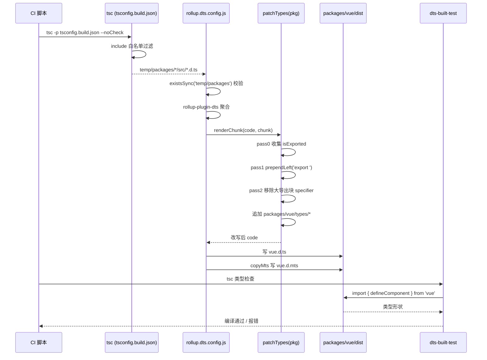

# Chapter 5: Type Artifact Pipeline: From Source .d.ts to Release-Grade Type Package

In the previous chapter, we dismantled`inline-enums.js`and`verify-treeshaking.js`: one is responsible for replacing enum references with literals so that the enum object can be tree-shaken away, and the other is responsible for using string sentinels after the build to confirm that three known leaks have not regressed. Together they safeguard Vue's runtime size commitment. But build outputs are not only JS. When users`import { ref } from 'vue'`the type hints shown by the editor,`tsc`type checking of user code, all depend on another type of artifact —`.d.ts`declaration files. If the JS output is wrong, it errors at runtime; if the type output is wrong, it errors on the user side at compile time, or worse: the types silently drift, user code can compile, but the type shape does not match the real runtime behavior. This chapter traces how Vue aggregates source types scattered across each subpackage`src`into a release-grade type package, and uses`dts-built-test`to perform type smoke tests on the real build output.

# 5.1 Two-stage type pipeline: tsc produces output, rollup aggregates

## Intuitive model

Imagine a printing pipeline: in the first stage, each subpackage lays out its own manuscript (`.ts`source) into single-page proofs (`.d.ts`); in the second stage, dozens of proofs are bound into a book in directory order (release-grade`.d.ts`), with unified headers and footers (export declarations).

Without this pipeline, Vue would have to manually maintain a release type file, and any source change would require synchronized manual edits — a breeding ground for type drift. Vue's approach is:**Type artifacts are generated entirely from source, never handwritten**。

## Stage one: tsconfig.build.json defines the output scope

`tsconfig.build.json`is the first-stage configuration of this pipeline. It inherits the root`tsconfig.json`and only covers build-related options.

[FACT:tsconfig.build.json:3-9]

Key options broken down one by one:

- `declaration: true`: have tsc generate a corresponding`.d.ts`。
- `emitDeclarationOnly: true`：**for each source file, outputting only types, not JS**. JS is handled by Rollup; here tsc is purely a type extractor.
- `stripInternal: true`: any declaration marked`@internal`is removed from`.d.ts`. This is Vue's first gate for controlling the public API surface — even if internal implementation details are`export`, as long as they are marked`@internal`they will not leak into the published types.
- `composite: false`: disable the incremental build mode of project references. Vue does not need cross-package incrementality here; turning it off avoids the extra state brought by`.tsbuildinfo`.

`include`The list precisely defines which directories participate in output:

[FACT:tsconfig.build.json:10-23]

Note that here**only 12 directories are listed**, not the entire`packages/`。`packages-private/`、`packages/dts-test/`、`packages/sfc-playground/`etc. are not included. This means: the types of private packages and test packages**will never**Enter the release artifacts. This is a physical isolation—not by convention, but by configuration.

> **[Design Inference & Architectural Trade-offs]**
> Why use a whitelist instead of a blacklist? Because adding new sub-packages in a monorepo is the norm. If using a`exclude`blacklist, when a new private package is added and someone forgets to add it to exclude, its types will silently leak into the release artifacts. A whitelist is the opposite: new packages by default do not participate in the build and must be explicitly added, conforming to the "secure by default" principle.

After executing`tsc -p tsconfig.build.json --noCheck`, the artifacts land in`temp/packages/<pkg>/src/*.d.ts`. Note`--noCheck`: skip type checking, only emit. Type checking is handled by a separate`tsc --noEmit`, and the build phase does not repeat the check, saving time.

## Phase Two: rollup.dts.config.js aggregation

Phase two is driven by`rollup.dts.config.js`. Its entry point first performs a pre-check:

[FACT:rollup.dts.config.js:15-22]

If`temp/packages`does not exist, it means phase one did not run, and the script directly`process.exit(1)`and prompts to run`tsc`first. This is the pipeline's**ordering contract**: the rollup phase strongly depends on the tsc phase's artifacts, and neither can be missing.

Next, it reads all sub-package directories and supports the`TARGETS`environment variable for subset builds:

[FACT:rollup.dts.config.js:15-22]

`TARGETS`The mechanism allows rebuilding types for only a few packages, significantly shortening the feedback loop during development and debugging.

The core is`targetPackages.map(...)`generating a Rollup config for each package:

[FACT:rollup.dts.config.js:23-42]

Field-by-field breakdown:

- `input: ./temp/packages/${pkg}/src/index.d.ts`: the entry is the type file produced in phase one, not the source code`.ts`。
- `output.file: packages/${pkg}/dist/${pkg}.d.ts`: artifacts land in each package's own`dist`directory, with filenames matching package names (e.g.,`vue.d.ts`）。
- `format: 'es'`: type files uniformly use ES module format.
- `plugins: [dts(), patchTypes(pkg), ...(pkg === 'vue' ? [copyMts()] : [])]`: three plugins, the first two apply to all packages,`copyMts`only applies to the`vue`package.

`onwarn`The hook is worth discussing separately:

[FACT:rollup.dts.config.js:23-42]

During the dts rollup process, all non-relative-path imports are externalized by default. This causes Rollup to report`UNRESOLVED_IMPORT`warnings. But this is**expected behavior**—the`import { X } from 'some-pkg'`in type files should remain as external references and should not be bundled in. So the script directly`return`swallows warnings for "unresolved imports with non-relative paths," and only passes unresolved imports with relative paths to the default`warn`。

> **[Design Inference & Architectural Trade-offs]**
> There is a subtlety here:`!warning.exporter?.startsWith('.')`checks whether the exporter starts with`.`. If a relative-path import is unresolved, it means phase one's artifacts are missing—a real problem that must be flagged. This distinction minimizes warning noise while not letting real errors slip through.

## Pipeline Overview

This diagram anchors the two-phase control flow:`tsc`'s whitelist determines who can enter the pipeline,`rollup`'s`check`determines whether it can continue,`patchTypes`is a mandatory step,`copyMts`is the`vue`package-specific branch.

# 5.2 patchTypes: Rewriting aggregated artifacts into release-grade shape

## Intuitive Model

`rollup-plugin-dts`After merging dozens of`.d.ts`into a single file, the resulting shape is "declare a bunch of types first, then export them all through one giant`export { A, B, C, ... }`." This is unfriendly for human reading, and for some toolchains (such as VitePress's`defineComponent`call) it can also trigger the error "inferred type cannot be named without a reference."

`patchTypes`is this**post-processing shaping step**: change "centralized export" to "inline export in place," then append package-specific type augmentations.

## Data Structures: Two Sets and Three Passes

`patchTypes`returns a Rollup plugin, with the core logic in the`renderChunk`hook. It maintains two collections:

[FACT:rollup.dts.config.js:87-88]

- `isExported`: records all**type names that were originally exported**(from`export { ... }`declarations).
- `shouldRemoveExport`: records all**type names that need to be removed from the big export block**(because they have already been inlined and exported).

The processing flow is divided into three passes (pass 0 / pass 1 / pass 2), a typical "collect first, rewrite next, clean up last" pattern.

## Step-by-Step Walkthrough

**Pass 0: Collect all exported type names.**

[FACT:rollup.dts.config.js:90-100]

Traverse the AST top-level nodes; for any`ExportNamedDeclaration`that**does not have a source**(i.e., is not a`export ... from '...'`re-export), add the specifier's local name to`isExported`。

**Pass 1: Add the`export`prefix in place for declaration nodes.**

[FACT:rollup.dts.config.js:102-125]

Traverse top-level nodes, and for`VariableDeclaration`、`TSTypeAliasDeclaration`、`TSInterfaceDeclaration`、`TSDeclareFunction`、`TSEnumDeclaration`、`ClassDeclaration`six kinds of declarations, call`processDeclaration`。

`processDeclaration`'s logic:

[FACT:rollup.dts.config.js:70-85]

Three steps:

1. If there is no`id`, return directly (e.g., anonymous declarations).

2. If the name starts with`_`, skip it—this is the**convention**: types with an underscore prefix are internal helper types and are not exported.

3. Add the name to`shouldRemoveExport`; if the name is in`isExported`(i.e., it was originally exported), then at the declaration's start position`prependLeft`a`export `string.

Note that the`VariableDeclaration`branch has an extra assertion:

[FACT:rollup.dts.config.js:104-115]

If a`declare const`declares multiple declarators (e.g.,`declare const a, b`), throw an error directly. Because`processDeclaration`only handles`declarations[0]`, multiple declarators would cause missed processing. Here,**fail fast**is chosen rather than silent error, reflecting defensive programming.

**Pass 2: Remove inlined types from the big export block.**

[FACT:rollup.dts.config.js:127-171]

Traverse`ExportNamedDeclaration`, and for each specifier:

- If its local name is in`shouldRemoveExport`, and`exported === local`(excluding the`export { Foo as Bar }`renaming case), remove that specifier.
- When removing, use MagicString for precise deletion: if there are more specifiers after it, delete up to the start of the next specifier; if it is the last one, delete up to the end of the previous one or its own start.
- If all specifiers of the entire export block are removed, delete the entire`ExportNamedDeclaration`node.

**Final step: Append package-specific types.**

[FACT:rollup.dts.config.js:172-183]

`code = s.toString()`After obtaining the rewritten code, check whether the`packages/${pkg}/types`directory exists. If it exists, read the contents of all files in the directory, concatenate them with newlines, and append them to the end of the code.

> **[Design Inference & Architectural Trade-offs]**
> This`types/`directory is**a manually maintained type augmentation**entry point, used to hold types that cannot be automatically generated from source code (such as JSX global augmentations, macro type declarations). It is merged in the same file as automatically generated types, but the sources are clearly separated—automatically generated ones on top, manually augmented ones below.

## Why must exports be inlined?

The comment gives the direct reason:

[FACT:rollup.dts.config.js:45-51]

The original text says: change all types to inline exports and remove them from the large export block, otherwise in VitePress's`defineComponent`call, it will report "the inferred type cannot be named without a reference".

> **[Design Inference & Architectural Trade-offs]**
> The essence of this error is: when TypeScript generates types, if a type can only be named by "referencing an export from another module" and that reference is not visible on the consumer side, it will report an error. A centralized export block separates the type name from the declaration location, exacerbating this problem. Inline exports make each type visible at its declaration site, eliminating this indirection layer.

## copyMts: providing types for Node ESM/CJS dual mode

`copyMts`The plugin only takes effect for the`vue`package:

[FACT:rollup.dts.config.js:196-204]

In the`writeBundle`hook, it writes the contents of`vue.d.ts`as-is to`vue.d.mts`。

The comment explains the reason:

[FACT:rollup.dts.config.js:188-192]

According to TypeScript 4.7's`package.json`exports specification, to correctly provide types for both Node ESM and CJS,**there must be two independent declaration files**. So during the build, copy`vue.d.ts`as`vue.d.mts`。

> **[Design Inference & Architectural Trade-offs]**
> Why copy rather than regenerate? Because the type shapes of ESM and CJS are completely identical; the only differences are the file extension and`package.json`'s`exports`mapping. Copying is the cheapest solution, avoiding running rollup again.

# 5.3 dts-built-test: type smoke testing on real artifacts

## Intuitive model

The previous two sections ensured that type artifacts can be generated and have the correct shape. But "can be generated" does not equal "generated correctly." If`patchTypes`has a bug in one of its traversal passes and accidentally deletes an export, the artifact can still be generated, but users`import`will discover missing types.

`dts-built-test`is**a type smoke test run on real build artifacts**: it does not test source types, but rather`import`the published`vue`package, verifying that key type shapes have not regressed.

## Data structure: a minimal type assertion

The core of the entire test package is just one file:

[FACT:packages-private/dts-built-test/src/index.ts:3-6]

Line-by-line interpretation:

- L1: from`vue`import`defineComponent`. Note that what is imported here is the**package name**, not a relative path—it consumes`packages/vue/dist/vue.d.ts`this real artifact.
- L3-6: define a component`_CustomPropsNotErased`, with empty props and empty setup.
- L8: comment`// #8376`, pointing to a specific issue.
- L9-12: export`CustomPropsNotErased`, with type`_CustomPropsNotErased`intersected with`{ foo: string }`.

What this test verifies is:**`defineComponent`'s return type, after being intersected with`{ foo: string }`,`foo`the property will not be erased**。

> **[Design Inference & Architectural Trade-offs]**
> Background speculation for issue #8376:`defineComponent`'s return type may undergo some conditional type or mapped type processing, causing extra properties in the intersection type to be "erased." This test locks down this behavior with a minimal reproduction; once it regresses, it will error during the type-checking phase.

## Package configuration: workspace dependency points to the real artifact

[FACT:packages-private/dts-built-test/package.json:1-11]

Key fields:

- `private: true`: not published to npm.
- `types: dist/index.d.ts`: type entry points to the build artifact.
- `dependencies`In`workspace:*`three`@vue/shared`、`@vue/reactivity`、`vue`。

> **[Design Inference & Architectural Trade-offs]**
> [Design Inference and Architectural Trade-offs]`@vue/shared`Why depend on`@vue/reactivity`and`vue`? Because`types`'s types may reference the types of these two packages. In workspace mode, pnpm will symlink these dependencies to local packages, and the local packages'`dist`fields point to the artifacts under their respective**. In this way, the entire test chain consumes**build artifacts

## , not source code.

`dts-built-test`How the test runs`src/index.ts`itself has no test script; its`tsc`is the test case. The way to run it is: in CI, execute`tsc`to type-check this package. If the type shape regresses,

> **[Design Inference & Architectural Trade-offs]**
> [Design Inference and Architectural Trade-offs]**The cleverness of this design is that it encodes the "type contract" as**compilable code`tsc`. No additional assertion library is needed, no runtime is needed,

## itself is the test runner. If the types are correct, it compiles; if the types are wrong, compilation fails.

Division of labor with dts-test`dts-built-test`Note that this chapter's`dts-test`and the next chapter's

- `dts-built-test`are two different things:**(this chapter): consumes**build artifacts
- `dts-test`, verifying release-level type shapes.**(next chapter): consumes**source types

> **[Design Inference & Architectural Trade-offs]**
> [Design Inference and Architectural Trade-offs]`patchTypes`Why are two layers needed? Because source types and artifact types may be inconsistent.`stripInternal`'s AST rewriting,`types/`'s removal,`dts-built-test`directory appending, may all introduce artifact-level bugs even when source types are correct.

## specifically guards this last mile.

copy`patchTypes`This sequence diagram anchors cross-module collaboration: CI drives the two stages of tsc and Rollup,`dts-built-test`'s three traversal passes are the core processing,

# consumes the artifact at the end for verification.

## Design thinking, error recovery, and production pitfalls

`patchTypes`Why use MagicString instead of string replacement?`code.replace(...)`uses MagicString throughout for precise rewriting, rather than

1. **. There are two reasons:**Precise positioning`start`/`end`: AST nodes carry their own

2. **offsets, and MagicString operates by offset, so it will not accidentally affect identifiers with the same name.**MagicString can generate mappings, allowing the rewritten type files to still be traced back to the source code. Although the sourcemap use of type files is limited, maintaining consistency is good practice.

## Fail fast vs. silently tolerate

`patchTypes`Used in multiple places`assert`：

[FACT:rollup.dts.config.js:74-74]

[FACT:rollup.dts.config.js:107-108]

[FACT:rollup.dts.config.js:147-148]

These assertions throw immediately when encountering unexpected AST shapes. Compare`onwarn`where`UNRESOLVED_IMPORT`is silently swallowed—**Expected noise is swallowed, unexpected shapes fail fast**This is the correct posture for a build script: better for the build to fail than to produce type files with the wrong shape.

## Production pitfalls:`_`Prefix convention

`processDeclaration`Skip`_`Types beginning with:

[FACT:rollup.dts.config.js:76-78]

This means that any exported type in the source code beginning with`_`will not be inlined and exported. If a type should be public but is skipped because its name begins with`_`users will encounter a "type does not exist" error.

> **[Design Inference & Architectural Trade-offs]**
> The approach to troubleshooting this kind of problem: first check whether the type is still in the large export block in the build output`vue.d.ts`then check whether the type name in the source code begins with`_`This is an implicit coupling between naming conventions and tool behavior, and it is easy to fall into this pitfall.

## Production pitfall: multiple declarator assertion

[FACT:rollup.dts.config.js:106-115]

If a certain`.d.ts`contains`declare const a, b`the build throws an error directly. This is rare in handwritten types, but it will be triggered if a type file generated by some tool uses this form. The error message will print the problematic code snippet for easier localization.

# Chapter summary

This chapter traced the complete pipeline of Vue type artifacts:

1. **First stage (tsc)**：`tsconfig.build.json`Use`include`whitelist to precisely define the output scope,`emitDeclarationOnly`output only types,`stripInternal`remove internal declarations. The artifacts land in`temp/packages/`。

2. **Second stage (rollup)**：`rollup.dts.config.js`Use`rollup-plugin-dts`to aggregate the types of each package,`patchTypes`rewrite centralized exports into inline exports through three AST traversal passes, and append`types/`manual enhancements for the directory.`copyMts`For`vue`package additionally generate`.d.mts`。

3. **Verification stage (dts-built-test)**Perform type smoke tests on real build artifacts, using compilable code to lock down key type shapes and prevent type drift.

# Chapter review and self-test

Q1: If`tsconfig.build.json`'s`include`whitelist is changed to`["packages"]`(that is, including the entire packages directory), what will happen? In what scenarios would this cause published type pollution?

**Reference analysis**：

`include`After changing from 12 precise directories to`["packages"]`all subpackages (including`packages-private`all`packages/*`outside of it) will participate in tsc output.[FACT:tsconfig.build.json:10-23]

Consequence chain:

1. `temp/packages/`There will be many additional packages under`.d.ts`。

2. `rollup.dts.config.js`'s`readdirSync('temp/packages')`will read these extra packages.[FACT:rollup.dts.config.js:15-22]

3. `targetPackages`By default equals all packages, so it will generate for each package`packages/<pkg>/dist/<pkg>.d.ts`。[FACT:rollup.dts.config.js:15-22]

Pollution scenario: if a package should not be published (such as an internal tool package), its type artifacts will appear under`dist`If that package's`package.json`does not have`private: true`the publish script may publish it to npm as well, causing internal types to leak.

This is exactly the value of the whitelist design: newly added packages do not participate by default and must be explicitly added, conforming to secure defaults.

Q2: `patchTypes`In pass 1 of`processDeclaration`directly`_`types beginning with`return`If the type of a public API happens to begin with`_`(such as`_InternalType`being accidentally exported), what will users see? How should it be troubleshooted?

**Reference analysis**：

`processDeclaration`When encountering`_`it returns directly at the beginning, neither adding`shouldRemoveExport`nor prepending`export `。[FACT:rollup.dts.config.js:76-78]

Consequences:

1. The type will not receive inline`export`。

2. It also will not be removed from the large export block (because it is not in`shouldRemoveExport`).

3. So it**is still in the large export block**and can theoretically still be imported.

But the problem is: the`export { _InternalType }`in the large export block references the declaration location. If that declaration is removed for some reason (such as`stripInternal`), the export block will reference a nonexistent name, causing`tsc`to report an error.

Troubleshooting approach:

1. Check whether the type in the build output`vue.d.ts`neither has`export`at the declaration site nor is referenced in the large export block.

2. Check whether the type name in the source code begins with`_`.

3. If it is confirmed to be a naming issue, rename it to remove the underscore prefix.

This exposes the implicit coupling between naming conventions and tool behavior:`_`The prefix is intended to mean "internal," but the tool treats it as "not exported," and the two semantics are not fully consistent.

Q3: `dts-built-test`'s`src/index.ts`uses the intersection type`typeof _CustomPropsNotErased & { foo: string }`to verify`foo`is not erased. If the intersection type is changed to`Omit<typeof _CustomPropsNotErased, never> & { foo: string }`can the test still catch the regression of #8376? Why?

**Reference analysis**：

`Omit<T, never>`will create a new mapped type, which will**recompute**all properties of T. If the bug in #8376 is "extra properties in the intersection type are erased," then:

- Original form`T & { foo: string }`: direct intersection,`foo`is part of the intersection type. If`defineComponent`'s return type handling logic erases extra properties in the intersection,`foo`will be lost.
- `Omit`Form:`Omit`first map`T`then intersect with`{ foo: string }`.`Omit`The mapping process may change the type structure so that the bug's trigger condition no longer holds—even if the bug exists, the test may still pass.

[FACT:packages-private/dts-built-test/src/index.ts:9-12]

Therefore, the test case's**minimality**is crucial: it must precisely reproduce the bug's trigger path. Any additional type transformation (such as`Omit`、`Pick`) may mask the bug. This is also why the test uses the most plain intersection type rather than a more "elegant" form.

> **[Design Inference & Architectural Trade-offs]**
> Improvement direction: multiple forms can be kept at the same time to cover different type transformation paths and improve regression capture rate. But this increases maintenance cost and requires trade-offs.

The type pipeline solves "how to generate publish-level types from source code,"`dts-built-test`and solves "how to verify the artifact type shape." But the type contract is not limited to "whether the shape is correct"; it also includes "whether the API surface matches expectations"—which types should be exported, which should not, and whether generic constraints are precise. The next chapter will enter`dts-test`, see how Vue uses type contract tests to guard the public API surface.

Together, the three form a closed loop of "generate → shape → verify," ensuring that source types and published types are strictly consistent. However, the type package itself being correct does not mean the type shape of the public API is locked down. In the next chapter, we will dive into`packages-private/dts-test`, and see how more than 20`.test-d.ts`files use`expectType`and other tools to turn "types as API contracts" into regression-testable automated tests.
