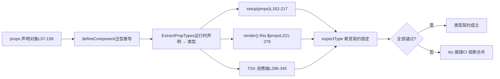

# Chapter 06: Modular Monorepo: Decoupling Public packages & packages-private


上一章我们追踪了类型声明的生成链路，看到 Vue 如何通过构建配置与冒烟测试保证「源码类型」与「发布类型」严格一致。但类型契约不止于「形状对不对」，更关键的是「API 表面是否符合预期」——哪些类型该导出、哪些不该、泛型约束是否精确。本章进入 `packages-private/dts-test`，看 Vue 如何用 20 余个 `.test-d.ts` 文件把「类型即 API 契约」落地为可回归的自动化测试。


`dts-test` 目录里的文件有一个反直觉的特征：它们**几乎不产生任何运行时行为**。打开 `defineComponent.test-d.tsx`，你会看到大量 `defineComponent({...})` 调用，但它们从不在测试运行时被真正执行——这些文件只被 `tsc`/`vue-tsc` 做类型检查，`noEmit: true` 保证不产出任何 JS。

[FACT:packages-private/dts-test/tsconfig.test.json:1-11](https://github.com/vuejs/core/blob/4ab865a848a1da3d10fb674f857e5fff13094644/packages-private/dts-test/tsconfig.test.json#L1-L11)

这份配置是整个契约体系的「运行环境」：`noEmit` 关闭产物输出，`jsx: preserve` 让 TSX 语法保留给类型系统解析，`strict` 打开全部严格检查，`moduleResolution: bundler` 匹配现代打包语义，`lib` 同时引入 `esnext` 与 `dom`。**若没有这套配置，`.test-d.tsx` 里的 JSX 会被当作运行时 JSX 处理，类型断言就失去意义**。

> **〔Design Inference & Architectural Trade-offs〕**
> 把类型测试独立成一个 `packages-private` 子包而非塞进 `packages/vue` 的 `__tests__`，动机有三：其一，类型测试的依赖是 `vue` 的**发布级类型**（`vue/jsx`、`vue` 的 `.d.ts`），而非源码内部模块，物理隔离能强制走公开入口；其二，`tsc` 检查类型测试的耗时远高于运行时单测，独立目录便于 CI 单独调度；其三，`.test-d.tsx` 文件不会被 Vitest 的运行时收集器误执行。

生活类比：普通单元测试像「把机器通电跑一遍看会不会冒烟」，而类型契约测试像「签合同前逐条核对条款」——不实际交易，只确认「甲方应付款项」写的是「人民币」而不是「美元」。合同条款错了，机器跑得再顺也没用。

`utils.d.ts` 提供了这套「合同核对」的全部工具：

[FACT:packages-private/dts-test/utils.d.ts:7-21](https://github.com/vuejs/core/blob/4ab865a848a1da3d10fb674f857e5fff13094644/packages-private/dts-test/utils.d.ts#L7-L21)

关键工具只有四个：`expectType<T>(value: T)` 断言 `value` 的类型恰好是 `T`；`expectAssignable<T, T2 extends T>` 断言 `T2` 可赋值给 `T`；`IsUnion<T>` 判断 `T` 是否为联合类型；`IsAny<T>` 判断 `T` 是否为 `any`。注意 L5 的 `import 'vue/jsx'`——它注册了全局 JSX 命名空间，让 TSX 里的 `<MyComponent />` 能被类型系统识别为 `JSX.Element`。

[FACT:packages-private/dts-test/utils.d.ts:7-21](https://github.com/vuejs/core/blob/4ab865a848a1da3d10fb674f857e5fff13094644/packages-private/dts-test/utils.d.ts#L7-L21)

`IsUnion` 的实现值得细看：`T extends any ? (U extends T ? false : true) : never` 利用分布式条件类型，若 `T` 是联合类型，每个成员会独立求值，最终 `extends false` 判断是否所有分支都返回 `false`。这是**类型层面的存在性证明**——用来锁定「`props.jjj` 必须是联合类型而非被合并成单一签名」这类契约。


`defineComponent.test-d.tsx` 有 2260 行，是契约体系的核心。我们代入一个具象场景：**用户写下 `defineComponent({ props: {...}, setup(props) {...} })`，Vue 的类型系统需要从 `props` 运行时声明推导出 `setup` 里 `props` 参数的精确类型**。这条链路是 Vue 类型系统最复杂的部分。

## 第一步：构造「期望类型」作为契约基准

测试文件先定义 `ExpectedProps` 接口，把每种 props 声明方式应该推导出的类型**显式写死**：

[FACT:packages-private/dts-test/defineComponent.test-d.tsx:21-53](https://github.com/vuejs/core/blob/4ab865a848a1da3d10fb674f857e5fff13094644/packages-private/dts-test/defineComponent.test-d.tsx#L21-L53)

这个接口是「合同条款」的书面版本。注意几个微妙的类型：`a?: number | undefined`（可选 props 带 `undefined`）、`aa: number`（有 default 所以非可选）、`aaa: number | null`（`PropType<number | null>` 显式声明）、`aaaa: number | undefined`（`required: true as const` 但类型含 `undefined`）。这些差异不是随意写的，每一种对应 `props` 声明里一个特定分支。

## 第二步：用各种声明方式「喂」给 `defineComponent`

[FACT:packages-private/dts-test/defineComponent.test-d.tsx:57-158](https://github.com/vuejs/core/blob/4ab865a848a1da3d10fb674f857e5fff13094644/packages-private/dts-test/defineComponent.test-d.tsx#L57-L158)

这段 `props` 对象是**声明方式的穷举矩阵**，覆盖了 Vue props 的所有写法：

- `a: Number` —— 构造函数简写，推导为 `number | undefined`
- `aa: { type: Number as PropType<number | undefined>, default: 1 }` —— 有 default，推导为非可选 `number`
- `aaaa: { type: Number, required: true as const }` —— `as const` 防止 `true` 被拓宽为 `boolean`，保留字面量类型
- `b: { type: String, required: true as true }` —— `required: true` 让属性非 void
- `bb: { default: 'hello' }` —— 无 `type`，仅靠 default 推导类型
- `cc: Array as PropType<string[]>` —— 显式类型转换
- `l: [Date]` —— 数组语法，推导为 `Date | undefined`
- `ll: [Date, Number]` —— 多类型数组，推导为 `Date | number | undefined`
- `lll: [String, Number]` —— 同上

> **〔Design Inference & Architectural Trade-offs〕**
> `required: true as const`（L70）与 `required: true as true`（L75）两种写法并存，是历史演进痕迹：早期用 `as true`，后来发现 `as const` 更通用（能同时锁定对象里其他字面量），但旧写法保留以验证向后兼容。这是契约测试的典型价值——**它同时锁定了「新写法可用」和「旧写法不回归」**。

## 第三步：在 `setup` / `render` / `this` 三个位置断言

这是契约测试最精妙的设计：**同一个 props 类型，必须在三个不同的消费位置都推导正确**。

[FACT:packages-private/dts-test/defineComponent.test-d.tsx:160-217](https://github.com/vuejs/core/blob/4ab865a848a1da3d10fb674f857e5fff13094644/packages-private/dts-test/defineComponent.test-d.tsx#L160-L217)

`setup(props)` 里对每个 prop 做 `expectType<ExpectedProps['x']>(props.x)`。注意 L168-170 的特殊处理：

[FACT:packages-private/dts-test/defineComponent.test-d.tsx:168-170](https://github.com/vuejs/core/blob/4ab865a848a1da3d10fb674f857e5fff13094644/packages-private/dts-test/defineComponent.test-d.tsx#L168-L170)

`// @ts-expect-error should included 'undefined'` 配合 `expectType<number>(props.aaaa)`——**故意写一个会报错的断言，用 `@ts-expect-error` 吞掉错误**。这验证了 `props.aaaa` 的类型**不是** `number`（否则这行不会报错，`@ts-expect-error` 反而会因「无错误可吞」而失败）。这是类型测试的「反向断言」技巧。

[FACT:packages-private/dts-test/defineComponent.test-d.tsx:204-205](https://github.com/vuejs/core/blob/4ab865a848a1da3d10fb674f857e5fff13094644/packages-private/dts-test/defineComponent.test-d.tsx#L204-L205)

`// @ts-expect-error props should be readonly` 配合 `props.a = 1`——验证 props 在 `setup` 里是只读的。若某次重构不小心让 props 变成可变，这行不再报错，`@ts-expect-error` 就会失败。

`render()` 里则通过 `this.$props` 和 `this.x` 两个路径断言：

[FACT:packages-private/dts-test/defineComponent.test-d.tsx:221-279](https://github.com/vuejs/core/blob/4ab865a848a1da3d10fb674f857e5fff13094644/packages-private/dts-test/defineComponent.test-d.tsx#L221-L279)

L252-276 验证「声明的 props 也要暴露在 `this` 上」，L278-279 验证 `this.a = 1` 报错（`this` 上的 props 也只读）。L281-287 验证 setup 返回值的解包：`this.c` 是 `number`（`ref(1)` 被解包）、`this.d.e.value` 是 `string`（嵌套 ref 保留 `.value`）、`this.f.g` 是 `GT`（`reactive` 里的 branded 类型不被解包）。

## 第四步：TSX 消费端的类型校验

类型契约的最后一环是「用户怎么用这个组件」。TSX 里 `<MyComponent />` 的 props 校验是独立的类型路径：

[FACT:packages-private/dts-test/defineComponent.test-d.tsx:296-322](https://github.com/vuejs/core/blob/4ab865a848a1da3d10fb674f857e5fff13094644/packages-private/dts-test/defineComponent.test-d.tsx#L296-L322)

这里验证了 `<MyComponent>` 接受所有声明的 props，以及 `class`/`style`/`key`/`ref`/`ref_for` 这些内置属性。然后是**反向校验**：

[FACT:packages-private/dts-test/defineComponent.test-d.tsx:337-345](https://github.com/vuejs/core/blob/4ab865a848a1da3d10fb674f857e5fff13094644/packages-private/dts-test/defineComponent.test-d.tsx#L337-L345)

`// @ts-expect-error missing required props` 验证缺必填 props 报错；`wrong prop types` 验证类型不匹配报错；L342 验证 `ggg="baz"` 报错（`ggg` 只接受 `'foo' | 'bar'`）。

整条链路可以用一张数据流图概括：



这张图的关键在于：**同一个 `props` 声明，必须同时满足三个消费位置的类型期望**。任何一处推导偏差都会让 `tsc` 报错。


`defineComponent` 的类型推导有个根本限制：**运行时 props 声明无法表达「条件类型」**。比如「当 `color='white'` 时 `appearance` 必须是 `'outline'`」这种约束，运行时对象语法写不出来。Vue 为此提供了 `__typeProps` 等「类型后门」。

## `__typeProps`：条件 props 的类型逃生舱

[FACT:packages-private/dts-test/defineComponent.test-d.tsx:1803-1836](https://github.com/vuejs/core/blob/4ab865a848a1da3d10fb674f857e5fff13094644/packages-private/dts-test/defineComponent.test-d.tsx#L1803-L1836)

`ConditionalProps` 是一个联合类型：要么 `color` 和 `appearance` 都可选，要么 `color: 'white'` 且 `appearance: 'outline'`。测试验证：

- L1823-1824：`<Comp color="white" />` 报错——单独给 `color: 'white'` 不满足任一分支
- L1825-1826：`<Comp color="white" appearance="normal" />` 报错——`appearance` 必须是 `'outline'`
- L1827：`<Comp color="white" appearance="outline" />` 通过

> **〔Design Inference & Architectural Trade-offs〕**
> `__typeProps` 的设计动机是「让类型系统表达运行时无法表达的约束」。它不参与运行时 props 解析，纯类型层面的覆盖。代价是用户需要手动维护类型与运行时声明的一致性——这也是为什么它叫「backdoor」而非正式 API。

## `__typeEmits`：两种 emits 语法的等价性

`__typeEmits` 支持两种语法，测试**同时锁定两者**：

[FACT:packages-private/dts-test/defineComponent.test-d.tsx:1838-1885](https://github.com/vuejs/core/blob/4ab865a848a1da3d10fb674f857e5fff13094644/packages-private/dts-test/defineComponent.test-d.tsx#L1838-L1885)

对象语法 `{ change: [id: number], update: [value: string] }` 用命名元组表达参数。测试验证 `this.$props.onChange?.(123)` 通过、`onChange?.('123')` 报错。

[FACT:packages-private/dts-test/defineComponent.test-d.tsx:1887-1934](https://github.com/vuejs/core/blob/4ab865a848a1da3d10fb674f857e5fff13094644/packages-private/dts-test/defineComponent.test-d.tsx#L1887-L1934)

调用签名语法 `{ (e: 'change', id: number): void; (e: 'update', value: string): void }` 用重载表达。**两种语法的测试体几乎逐行相同**——这是刻意的：契约要求两种写法产生**完全等价**的类型行为。

> **〔Design Inference & Architectural Trade-offs〕**
> 为什么保留两种语法？对象语法更接近 `defineEmits` 的写法，调用签名语法更接近传统 TS 事件类型。Vue 需要同时支持，且保证行为一致。测试的「逐行镜像」结构是最强的等价性证明。

## `__typeRefs` 与 `__typeEl`：跨组件引用与宿主节点类型

[FACT:packages-private/dts-test/defineComponent.test-d.tsx:1936-1952](https://github.com/vuejs/core/blob/4ab865a848a1da3d10fb674f857e5fff13094644/packages-private/dts-test/defineComponent.test-d.tsx#L1936-L1952)

`__typeRefs` 让父组件能精确知道子组件 ref 的类型。`Parent` 声明 `__typeRefs: { child: ComponentInstance<typeof Child> }`，于是 `refs.child.$refs.foo` 能推导为 `number`。

[FACT:packages-private/dts-test/defineComponent.test-d.tsx:1963-1977](https://github.com/vuejs/core/blob/4ab865a848a1da3d10fb674f857e5fff13094644/packages-private/dts-test/defineComponent.test-d.tsx#L1963-L1977)

`__typeEl` 更微妙。L1963-1977 的测试注释点明了设计意图：**自定义渲染器（TUI、canvas、native）的宿主节点不是 DOM `Element`**，所以 `TypeEl` 不能被约束为 `Element`。测试用 `CustomElement` 接口验证 `$el` 能接受任意宿主类型。

> **〔Design Inference & Architectural Trade-offs〕**
> 这是 Vue 3 支持自定义渲染器的类型层面保障。若 `TypeEl` 被硬约束为 `Element`，`@vue/runtime-test` 这类非 DOM 渲染器的用户就无法正确推导 `$el` 类型。契约测试在这里守护的是「渲染器无关性」。

## 泛型组件与运行时 props 的互斥约束

`function syntax w/ runtime props` 一节锁定了一条重要规则：**泛型组件不能与对象运行时 props 共存**。

[FACT:packages-private/dts-test/defineComponent.test-d.tsx:1501-1545](https://github.com/vuejs/core/blob/4ab865a848a1da3d10fb674f857e5fff13094644/packages-private/dts-test/defineComponent.test-d.tsx#L1501-L1545)

L1501 的注释 `generics aren't supported with object runtime props` 是契约声明。L1525-1535 验证泛型 setup + 对象 props 报错；L1538-1539 验证 `<Comp3<string>>` 报错。而数组 props 则允许泛型（L1464-1499）。

> **〔Design Inference & Architectural Trade-offs〕**
> 这条约束的根因是类型推导顺序：对象 props 需要 `ExtractPropTypes` 先确定类型，而泛型需要在实例化时才能确定，两者冲突。数组 props 不参与类型提取，所以不冲突。契约测试把这条「类型系统限制」固化为可回归的断言。


## `@ts-expect-error` 的双刃剑

`@ts-expect-error` 是类型契约测试的核心工具，但它有个致命陷阱：**当它下面的代码不再报错时，`@ts-expect-error` 本身会报错**。这看似是保护，实则要求测试作者精确控制「错误发生的位置」。

[FACT:packages-private/dts-test/defineComponent.test-d.tsx:1354-1362](https://github.com/vuejs/core/blob/4ab865a848a1da3d10fb674f857e5fff13094644/packages-private/dts-test/defineComponent.test-d.tsx#L1354-L1362)

看这段：`// @ts-expect-error missing prop` 被放在 `<Comp msg={123} />` 的**上一行**，但整个表达式被包在 `expectType<JSX.Element>(...)` 里。若 `@ts-expect-error` 的位置偏移一行，或错误实际发生在 `expectType` 调用而非 JSX 上，测试就会失败。

> **〔Design Inference & Architectural Trade-offs〕**
> 生产踩坑点：当 TypeScript 版本升级导致错误位置微调时，大量 `@ts-expect-error` 可能集体失效。Vue 的应对策略是**把 `@ts-expect-error` 紧贴被断言代码**，并在 CI 里锁定 TypeScript 版本。任何 TS 升级都需要重新验证全部类型测试。

## `IsAny` 与 `IsUnion`：类型层面的「存在性证明」

[FACT:packages-private/dts-test/defineComponent.test-d.tsx:1991-1993](https://github.com/vuejs/core/blob/4ab865a848a1da3d10fb674f857e5fff13094644/packages-private/dts-test/defineComponent.test-d.tsx#L1991-L1993)

`expectType<IsAny<typeof props.foo>>(false)` 验证 `props.foo` 不是 `any`。这是**反向契约**：不仅要求类型正确，还要求类型「不能退化为 `any`」。`any` 是类型系统的黑洞，任何 `any` 都会让后续断言失去意义。

[FACT:packages-private/dts-test/defineComponent.test-d.tsx:195-196](https://github.com/vuejs/core/blob/4ab865a848a1da3d10fb674f857e5fff13094644/packages-private/dts-test/defineComponent.test-d.tsx#L195-L196)

`expectType<IsUnion<typeof props.jjj>>(true)` 验证 `jjj` 是联合类型。`jjj` 声明为 `((arg1: string) => string) | ((arg1: string, arg2: string) => string)`，若类型系统把它合并成单一签名，`IsUnion` 会返回 `false`，测试失败。

> **〔Design Inference & Architectural Trade-offs〕**
> 这两个工具守护的是「类型的精确性」而非「类型的正确性」。一个退化为 `any` 或联合被合并的类型，在大多数使用场景下「看起来能用」，但会丢失 IDE 提示和编译期检查。契约测试必须锁定这种精确性。

## 声明顺序的隐式契约

[FACT:packages-private/dts-test/defineComponent.test-d.tsx:1784-1801](https://github.com/vuejs/core/blob/4ab865a848a1da3d10fb674f857e5fff13094644/packages-private/dts-test/defineComponent.test-d.tsx#L1784-L1801)

这段注释极其关键：`code generated by tsc / vue-tsc, make sure this continues to work so we don't accidentally change the args order of DefineComponent`。`DefineComponent` 有 13 个泛型参数，顺序是**公开契约**——`vue-tsc` 生成的组件类型依赖这个顺序。测试用 `declare const MyButton: DefineComponent<...>` 显式写出全部 13 个参数，锁定顺序。

> **〔Design Inference & Architectural Trade-offs〕**
> 这是最容易被忽视的契约：泛型参数顺序不是「实现细节」，而是「生成代码的 ABI」。任何调整顺序的 PR 都会让 `vue-tsc` 生成的 `.d.ts` 与运行时类型不兼容。契约测试在这里扮演「ABI 兼容性守卫」。

## 跨文件契约：`componentInstance.test-d.tsx` 的补充

`componentInstance.test-d.tsx` 只有 154 行，但覆盖了 `ComponentInstance` 工具类型的所有输入形态：

[FACT:packages-private/dts-test/componentInstance.test-d.tsx:10-40](https://github.com/vuejs/core/blob/4ab865a848a1da3d10fb674f857e5fff13094644/packages-private/dts-test/componentInstance.test-d.tsx#L10-L40)

`ComponentInstance<typeof CompSetup>` 从 `defineComponent` 结果提取实例类型；`ComponentInstance<typeof CompFunctional>` 从函数式组件提取；`ComponentInstance<typeof CompFunction>` 从裸函数提取。三者都必须推导出 `ComponentPublicInstance` 基类。

[FACT:packages-private/dts-test/componentInstance.test-d.tsx:71-116](https://github.com/vuejs/core/blob/4ab865a848a1da3d10fb674f857e5fff13094644/packages-private/dts-test/componentInstance.test-d.tsx#L71-L116)

更极端的是「无 `defineComponent` 包裹的裸对象」：`CompObjectSetup`、`CompObjectData`、`CompObjectNoProps` 三种形态都要能被 `ComponentInstance` 正确提取。L113-114 尤其反直觉：`CompObjectNoProps` 没有 `props` 声明，但 `compObjectNoProps.test` 仍推导为 `string | undefined`——这是 `ComponentPublicInstance` 基类提供的兜底。

[FACT:packages-private/dts-test/componentInstance.test-d.tsx:143-147](https://github.com/vuejs/core/blob/4ab865a848a1da3d10fb674f857e5fff13094644/packages-private/dts-test/componentInstance.test-d.tsx#L143-L147)

L141 的 `#12751` 测试锁定了一个边界：`__typeEmits` 声明的 `'update:visible'` 事件，在实例上应暴露为 `comp['onUpdate:visible']`（带冒号的字符串键），且 `$props` 类型为 `{ 'onUpdate:visible'?: (value?: boolean) => any }`。L152-153 验证 `comp['$props']['$props']` 报错——防止类型递归自引用。


`dts-test` 目录用 20 余个 `.test-d.ts` 文件，把「类型即 API 契约」落地为可回归的自动化测试。核心机制有三层：

1. **工具层**：`expectType`、`expectAssignable`、`IsUnion`、`IsAny` 提供类型断言原语，`@ts-expect-error` 提供反向断言能力。

2. **契约层**：`ExpectedProps` 接口把「应该推导出什么类型」显式写死，`props` 声明矩阵穷举所有写法，三个消费位置（`setup`/`render`/TSX）交叉验证。

3. **后门层**：`__typeProps`、`__typeEmits`、`__typeRefs`、`__typeEl` 为运行时无法表达的类型约束提供逃生舱，同时锁定两种 emits 语法的等价性。


Q1: 若把 `defineComponent.test-d.tsx` L168-170 的 `@ts-expect-error` 删掉，只保留 `expectType<number>(props.aaaa)`，会发生什么？为什么这个测试会「静默失效」？

**参考解析**：

`props.aaaa` 声明为 `{ type: Number as PropType<number | undefined>, required: true as const }`，其推导类型是 `number | undefined`（因为 `PropType<number | undefined>` 显式包含了 `undefined`）。

`expectType<number>(props.aaaa)` 要求 `props.aaaa` 恰好是 `number`。由于实际类型是 `number | undefined`，这行**本身就会报错**。`@ts-expect-error` 的作用是「预期这里会报错，吞掉它」。

若删掉 `@ts-expect-error`，这行会直接报错，测试失败——看起来是「更严格」了。但问题在于：**如果某次重构让 `props.aaaa` 真的变成 `number`（bug 修复或行为变更），这行不再报错，而删掉 `@ts-expect-error` 后测试会通过**——此时测试无法区分「类型正确」和「类型错误但恰好不报错」。

保留 `@ts-expect-error` 的写法是**双向锁定**：既要求「当前类型是 `number | undefined`」（通过 `@ts-expect-error` 吞掉 `expectType<number>` 的错误），又要求「类型不能是 `number`」（若变成 `number`，`@ts-expect-error` 会因无错误可吞而失败）。这是类型契约测试的核心技巧——**用「预期报错」来锁定「类型必须包含某成分」**。

[FACT:packages-private/dts-test/defineComponent.test-d.tsx:168-170](https://github.com/vuejs/core/blob/4ab865a848a1da3d10fb674f857e5fff13094644/packages-private/dts-test/defineComponent.test-d.tsx#L168-L170)

Q2: `__typeProps` 后门测试（L1803-1836）验证了条件联合类型的约束。若把 `ConditionalProps` 从联合类型改成 `{ color?: 'normal' | 'primary' | 'secondary' | 'white'; appearance?: 'normal' | 'outline' | 'text' }`（即把所有选项拍平），测试会怎样失败？这说明了 `__typeProps` 的什么设计约束？

**参考解析**：

拍平后的类型允许任意 `color` 与 `appearance` 组合，包括 `color: 'white'` + `appearance: 'normal'`。但测试 L1825-1826 明确要求这个组合**报错**：

```
// @ts-expect-error
;
```

若类型被拍平，这行不再报错，`@ts-expect-error` 因「无错误可吞」而失败。同时 L1823-1824 的 `<Comp color="white" />` 也会从「报错」变成「通过」，同样让 `@ts-expect-error` 失败。

这说明 `__typeProps` 的设计约束是：**它必须保留联合类型的「分支互斥」语义**。`__typeProps` 不是简单的「类型覆盖」，而是「用类型系统表达运行时 props 无法表达的条件约束」。若实现时把 `Props` 做了 `Prettify` 或 `Omit` 之类的映射变换，可能破坏联合分支的判别性，导致约束失效。

> **〔Design Inference & Architectural Trade-offs〕**
> 这也是为什么 `__typeProps` 的测试用例用最朴素的 `CommonProps & ConditionalProps` 交叉，而非更「优雅」的映射类型——任何额外的类型变换都可能掩盖 bug。

Q3: `DefineComponent` 的 13 个泛型参数顺序被 L1784-1801 显式锁定。若某次重构把第 9 个参数（`VNodeProps & AllowedComponentProps & ComponentCustomProps`）与第 10 个参数（`Readonly<ExtractPropTypes<{}>>`）交换，哪些下游会受影响？为什么契约测试必须锁定这个顺序？

**参考解析**：

`DefineComponent` 的泛型参数顺序是 `vue-tsc` 生成组件类型时的「ABI」。当用户在 `<script setup>` 里写 `defineProps` / `defineEmits`，`vue-tsc` 会生成类似 L1999-2116 的 `CreateComponentPublicInstance<...>` 类型，其中泛型参数的**位置**决定了每个类型参数的含义。

若交换第 9、10 个参数：

1. `vue-tsc` 生成的 `.d.ts` 会按旧顺序填充参数，但 `DefineComponent` 按新顺序解释——`VNodeProps & AllowedComponentProps & ComponentCustomProps` 会被当作 props 类型，`Readonly<ExtractPropTypes<{}>>` 会被当作 VNode 属性。结果是**用户组件的 props 类型全部错位**。

2. L1786-1800 的 `declare const MyButton: DefineComponent<...>` 会直接报错——因为 `{}` 与 `VNodeProps & ...` 不兼容。

3. L1999-2116 的 `ErrorMessage` 类型（模拟 `vue-tsc` 生成结果）也会报错。

契约测试锁定顺序的价值在于：**它把「泛型参数顺序」从「实现细节」提升为「公开契约」**。任何调整顺序的 PR 都会让 L1786-1800 立即失败，阻止不兼容变更进入发布。

[FACT:packages-private/dts-test/defineComponent.test-d.tsx:1784-1801](https://github.com/vuejs/core/blob/4ab865a848a1da3d10fb674f857e5fff13094644/packages-private/dts-test/defineComponent.test-d.tsx#L1784-L1801)

> **〔Design Inference & Architectural Trade-offs〕**
> 这是类型契约测试最容易被低估的价值：它守护的不是「类型对不对」，而是「类型系统的接口稳定性」。泛型参数顺序、`@ts-expect-error` 的位置、`IsAny` 的返回值，都是「类型 ABI」的组成部分。

类型契约测试解决了「API 表面是否符合预期」。但类型只是 Vue 工程化的一半——另一半是「用户如何在浏览器里实时验证这些 API 的行为」。下一章将进入 SFC Playground，看 Vue 如何把编译器、运行时、类型系统打包进一个浏览器内的实时调试环境，让用户在改代码的瞬间看到编译产物与运行结果。

契约测试守护的不只是「类型对不对」，还包括「类型精不精确」（`IsAny`/`IsUnion`）、「泛型参数顺序稳不稳定」（`DefineComponent` 13 参数）、「渲染器无关性」（`__typeEl` 不约束为 `Element`）。这些约束一旦被打破，用户侧的 IDE 提示、`vue-tsc` 生成的类型都会漂移。而类型契约的稳定性，最终要服务于开发者日常的调试体验——下一章我们将走进 `packages-private/sfc-playground`，看一个纯前端 Playground 如何在浏览器内完成 SFC 编译与实时预览的闭环。