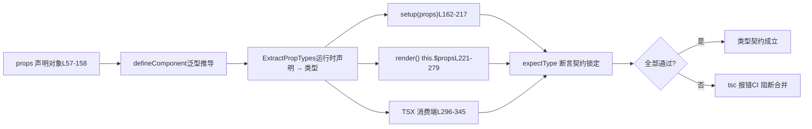

# Chapter 6: Type Contract Testing: How dts-test Guards the API Surface

In the previous chapter, we traced the generation pipeline for type declarations and saw how Vue uses build configuration and smoke tests to ensure that "source types" and "published types" are strictly consistent. But type contracts are not just about whether the shape is correct; more critically, they are about whether the API surface matches expectations—which types should be exported, which should not, and whether generic constraints are precise. This chapter enters`packages-private/dts-test`, and see how Vue uses more than 20`.test-d.ts`files to turn "types as API contracts" into regression-testable automated tests.

# The cognitive model of type contract testing: turning a "specification" into an "executable contract"

`dts-test`The files in the directory have a counterintuitive characteristic: they**produce almost no runtime behavior at all**. Open`defineComponent.test-d.tsx`, and you will see a large number of`defineComponent({...})`calls, but they are never actually executed when the tests run—these files are only`tsc`/`vue-tsc`type-checked,`noEmit: true`ensuring that no JS is produced.

[FACT:packages-private/dts-test/tsconfig.test.json:1-11]

This configuration is the "runtime environment" of the entire contract system:`noEmit`disables emit output,`jsx: preserve`leaves TSX syntax to be parsed by the type system,`strict`turns on all strict checks,`moduleResolution: bundler`matches modern bundler semantics,`lib`and also brings in`esnext`and`dom`。**Without this configuration,`.test-d.tsx`the JSX in would be treated as runtime JSX, and type assertions would lose their meaning**。

> **[Design Inference & Architectural Trade-offs]**
> Making type tests a separate`packages-private`subpackage rather than stuffing them into`packages/vue`'s`__tests__`has three motivations: first, the dependencies of type tests are`vue`'s**publish-level types**（`vue/jsx`、`vue`'s`.d.ts`), rather than internal source modules, and physical isolation can force the use of public entry points; second,`tsc`checking type tests takes far longer than runtime unit tests, and a separate directory makes it easier for CI to schedule them independently; third,`.test-d.tsx`files will not be mistakenly executed by Vitest's runtime collector.

Everyday analogy: ordinary unit tests are like "powering on the machine and running it once to see whether it smokes," while type contract tests are like "checking the terms one by one before signing a contract"—there is no actual transaction, only confirmation that "the amount payable by Party A" is written as "RMB" rather than "USD." If the contract terms are wrong, it does not matter how smoothly the machine runs.

`utils.d.ts`provides all the tools for this "contract checking":

[FACT:packages-private/dts-test/utils.d.ts:7-21]

There are only four key tools:`expectType<T>(value: T)`asserts that`value`is exactly of type`T`；`expectAssignable<T, T2 extends T>`asserts that`T2`is assignable to`T`；`IsUnion<T>`determines whether`T`is a union type;`IsAny<T>`determines whether`T`is`any`. Note L5's`import 'vue/jsx'`—it registers the global JSX namespace so that`<MyComponent />`in TSX can be recognized by the type system as`JSX.Element`。

[FACT:packages-private/dts-test/utils.d.ts:7-21]

`IsUnion`'s implementation is worth a closer look:`T extends any ? (U extends T ? false : true) : never`uses distributive conditional types; if`T`is a union type, each member is evaluated independently, and finally`extends false`determines whether all branches return`false`. This is**an existence proof at the type level**—used to lock down contracts such as "`props.jjj`must be a union type rather than being merged into a single signature."

# Scenario-driven Walkthrough:`defineComponent`The full chain of props type inference in

`defineComponent.test-d.tsx`has 2260 lines and is the core of the contract system. Let us put ourselves in a concrete scenario:**The user writes`defineComponent({ props: {...}, setup(props) {...} })`, and Vue's type system needs to infer from`props`runtime declaration the precise type of the`setup`parameter in`props`. This chain is the most complex part of Vue's type system.**Step 1: Construct the "expected type" as the contract baseline

## The test file first defines the

interface, explicitly hard-coding the type that each props declaration style should infer`ExpectedProps`**This interface is the written version of the "contract terms." Note several subtle types:**：

[FACT:packages-private/dts-test/defineComponent.test-d.tsx:21-53]

(optional props with`a?: number | undefined`(has default, so non-optional),`undefined`）、`aa: number`explicitly declared),`aaa: number | null`（`PropType<number | null>`but the type contains`aaaa: number | undefined`（`required: true as const`). These differences are not written arbitrarily; each corresponds to a specific branch in the`undefined`declaration.`props`Step 2: "Feed" various declaration styles into

## This`defineComponent`

[FACT:packages-private/dts-test/defineComponent.test-d.tsx:57-158]

object is`props`an exhaustive matrix of declaration styles**, covering all ways of writing Vue props:**— constructor shorthand, inferred as

- `a: Number`— has default, inferred as non-optional`number | undefined`
- `aa: { type: Number as PropType<number | undefined>, default: 1 }`prevents`number`
- `aaaa: { type: Number, required: true as const }` —— `as const`from being widened to`true`, preserving the literal type`boolean`makes the property non-void
- `b: { type: String, required: true as true }` —— `required: true`— no
- `bb: { default: 'hello' }`, inferring the type solely from default`type`— explicit type cast
- `cc: Array as PropType<string[]>`— array syntax, inferred as
- `l: [Date]`— multi-type array, inferred as`Date | undefined`
- `ll: [Date, Number]`— same as above`Date | number | undefined`
- `lll: [String, Number]`[Design inference and architectural trade-offs]

> **[Design Inference & Architectural Trade-offs]**
> `required: true as const`(L75) coexisting is a trace of historical evolution: early on,`required: true as true`was used, and later it was discovered that`as true`is more general (it can simultaneously lock down other literals in the object), but the old form is retained to verify backward compatibility. This is the typical value of contract testing—`as const`it simultaneously locks down "the new form works" and "the old form does not regress"**Step 3: Assert in the three positions**。

## `setup` / `render` / `this`This is the most ingenious design of contract testing:

the same props type must infer correctly in three different consumption positions**performs**。

[FACT:packages-private/dts-test/defineComponent.test-d.tsx:160-217]

`setup(props)`on each prop. Note the special handling at L168-170:`expectType<ExpectedProps['x']>(props.x)`。注意 L168-170 的特殊处理：

[FACT:packages-private/dts-test/defineComponent.test-d.tsx:168-170]

`// @ts-expect-error should included 'undefined'`combined with`expectType<number>(props.aaaa)`——**deliberately write an assertion that will throw an error, using`@ts-expect-error`to swallow the error**. This verifies that`props.aaaa`'s type**is not** `number`(otherwise this line would not throw an error,`@ts-expect-error`but would instead fail because "there is no error to swallow"). This is the "reverse assertion" technique of type testing.

[FACT:packages-private/dts-test/defineComponent.test-d.tsx:204-205]

`// @ts-expect-error props should be readonly`combined with`props.a = 1`— verifies that props are readonly in`setup`. If some refactor accidentally makes props mutable, this line no longer throws an error,`@ts-expect-error`will fail.

`render()`In, assertions are made through two paths,`this.$props`and`this.x`:

[FACT:packages-private/dts-test/defineComponent.test-d.tsx:221-279]

L252-276 verifies that "declared props must also be exposed on`this`", and L278-279 verifies that`this.a = 1`throws an error (`this`props on are also readonly). L281-287 verifies the unwrapping of the setup return value:`this.c`is`number`（`ref(1)`is unwrapped),`this.d.e.value`is`string`(nested refs preserve`.value`）、`this.f.g`is`GT`（`reactive`branded types in are not unwrapped).

## Step 4: Type validation on the TSX consumer side

The final link in the type contract is "how users use this component". In TSX,`<MyComponent />`'s props validation is an independent type path:

[FACT:packages-private/dts-test/defineComponent.test-d.tsx:296-322]

Here it verifies that`<MyComponent>`accepts all declared props, as well as`class`/`style`/`key`/`ref`/`ref_for`these built-in attributes. Then comes**reverse validation**：

[FACT:packages-private/dts-test/defineComponent.test-d.tsx:337-345]

`// @ts-expect-error missing required props`verifies that missing required props throws an error;`wrong prop types`verifies that type mismatch throws an error; L342 verifies that`ggg="baz"`throws an error (`ggg`only accepts`'foo' | 'bar'`）。

The entire chain can be summarized with a data flow diagram:



The key to this diagram is:**the same`props`declaration must simultaneously satisfy the type expectations of three consumption positions**. Any inference deviation in any one place will cause`tsc`to throw an error.

# Boundaries and backdoors:`__typeProps`、`__typeEmits`and conditional type contracts

`defineComponent`There is a fundamental limitation in type inference:**runtime props declarations cannot express "conditional types"**. For example, "when`color='white'`,`appearance`must be`'outline'`" cannot be written with runtime object syntax. Vue provides`__typeProps`and other "type backdoors" for this.

## `__typeProps`: the type escape hatch for conditional props

[FACT:packages-private/dts-test/defineComponent.test-d.tsx:1803-1836]

`ConditionalProps`is a union type: either`color`and`appearance`are both optional, or`color: 'white'`and`appearance: 'outline'`. Tests verify:

- L1823-1824：`<Comp color="white" />`throws an error — providing`color: 'white'`alone does not satisfy either branch
- L1825-1826：`<Comp color="white" appearance="normal" />`throws an error —`appearance`must be`'outline'`
- L1827：`<Comp color="white" appearance="outline" />`passes

> **[Design Inference & Architectural Trade-offs]**
> `__typeProps`The design motivation of is "to let the type system express constraints that runtime cannot express". It does not participate in runtime props parsing; it is purely a type-level override. The cost is that users need to manually maintain consistency between types and runtime declarations — this is also why it is called a "backdoor" rather than a formal API.

## `__typeEmits`: equivalence of the two emits syntaxes

`__typeEmits`supports two syntaxes, and the tests**lock down both at the same time**：

[FACT:packages-private/dts-test/defineComponent.test-d.tsx:1838-1885]

Object syntax`{ change: [id: number], update: [value: string] }`uses named tuples to express parameters. Tests verify that`this.$props.onChange?.(123)`passes and`onChange?.('123')`throws an error.

[FACT:packages-private/dts-test/defineComponent.test-d.tsx:1887-1934]

Call signature syntax`{ (e: 'change', id: number): void; (e: 'update', value: string): void }`uses overloads to express it.**The test bodies for the two syntaxes are almost line-by-line identical**— this is intentional: the contract requires both forms to produce**completely equivalent**type behavior.

> **[Design Inference & Architectural Trade-offs]**
> Why keep both syntaxes? Object syntax is closer to`defineEmits`'s style, while call signature syntax is closer to traditional TS event types. Vue needs to support both and guarantee consistent behavior. The "line-by-line mirror" structure of the tests is the strongest proof of equivalence.

## `__typeRefs`and`__typeEl`: cross-component references and host node types

[FACT:packages-private/dts-test/defineComponent.test-d.tsx:1936-1952]

`__typeRefs`lets parent components know precisely the type of a child component ref.`Parent`declares`__typeRefs: { child: ComponentInstance<typeof Child> }`, so`refs.child.$refs.foo`can be inferred as`number`。

[FACT:packages-private/dts-test/defineComponent.test-d.tsx:1963-1977]

`__typeEl`is more subtle. The test comments at L1963-1977 point out the design intent:**The host nodes of custom renderers (TUI, canvas, native) are not DOM`Element`**, so`TypeEl`cannot be constrained to`Element`. The tests use the`CustomElement`interface to verify that`$el`can accept any host type.

> **[Design Inference & Architectural Trade-offs]**
> This is the type-level guarantee for Vue 3's support of custom renderers. If`TypeEl`were hard-constrained to`Element`，`@vue/runtime-test`, users of non-DOM renderers like this would not be able to correctly infer`$el`types. What the contract tests guard here is "renderer agnosticism".

## Mutually exclusive constraints between generic components and runtime props

`function syntax w/ runtime props`The section locks down an important rule:**Generic components cannot coexist with object runtime props**。

[FACT:packages-private/dts-test/defineComponent.test-d.tsx:1501-1545]

The comment at L1501`generics aren't supported with object runtime props`is a contract declaration. L1525-1535 verifies that generic setup + object props throws an error; L1538-1539 verifies that`<Comp3<string>>`throws an error. Array props, however, allow generics (L1464-1499).

> **[Design Inference & Architectural Trade-offs]**
> The root cause of this constraint is the order of type inference: object props require`ExtractPropTypes`to determine the type first, while generics can only be determined at instantiation time, so the two conflict. Array props do not participate in type extraction, so there is no conflict. Contract tests solidify this "type system limitation" into regressable assertions.

# Design thinking, error recovery, and production pitfalls

## `@ts-expect-error`The double-edged sword of

`@ts-expect-error`is the core tool of type contract testing, but it has a fatal trap:**when the code below it no longer throws an error,`@ts-expect-error`itself will throw an error**. This seems like protection, but in reality it requires test authors to precisely control "where the error occurs".

[FACT:packages-private/dts-test/defineComponent.test-d.tsx:1354-1362]

Look at this snippet:`// @ts-expect-error missing prop`is placed on`<Comp msg={123} />`'s**previous line**, but the entire expression is wrapped in`expectType<JSX.Element>(...)`. If`@ts-expect-error`'s position shifts by one line, or the error actually occurs in the`expectType`call rather than in the JSX, the test will fail.

> **[Design Inference & Architectural Trade-offs]**
> Production pitfall: when TypeScript version upgrades cause slight adjustments in error locations, a large number of`@ts-expect-error`may fail collectively. Vue's strategy is**to place`@ts-expect-error`tightly against the asserted code**, and to lock the TypeScript version in CI. Any TS upgrade requires revalidating all type tests.

## `IsAny`and`IsUnion`: Type-level "proof of existence"

[FACT:packages-private/dts-test/defineComponent.test-d.tsx:1991-1993]

`expectType<IsAny<typeof props.foo>>(false)`Verify`props.foo`is not`any`. This is**reverse contract**: not only requires the type to be correct, but also requires the type to "not degrade into`any`」。`any`is a black hole in the type system; any`any`will make subsequent assertions meaningless.

[FACT:packages-private/dts-test/defineComponent.test-d.tsx:195-196]

`expectType<IsUnion<typeof props.jjj>>(true)`Verify`jjj`is a union type.`jjj`Declared as`((arg1: string) => string) | ((arg1: string, arg2: string) => string)`, if the type system merges it into a single signature,`IsUnion`will return`false`, and the test fails.

> **[Design Inference & Architectural Trade-offs]**
> These two tools guard "type precision" rather than "type correctness." A type that degrades into`any`or whose union is merged "looks usable" in most usage scenarios, but loses IDE hints and compile-time checks. Contract tests must lock down this precision.

## Implicit contract of declaration order

[FACT:packages-private/dts-test/defineComponent.test-d.tsx:1784-1801]

This comment is extremely critical:`code generated by tsc / vue-tsc, make sure this continues to work so we don't accidentally change the args order of DefineComponent`。`DefineComponent`has 13 generic parameters, and the order is**public contract**——`vue-tsc`The generated component type depends on this order. The test uses`declare const MyButton: DefineComponent<...>`to explicitly write out all 13 parameters, locking the order.

> **[Design Inference & Architectural Trade-offs]**
> This is the most easily overlooked contract: the order of generic parameters is not an "implementation detail," but the "ABI of generated code." Any PR that adjusts the order will make`vue-tsc`generated`.d.ts`incompatible with the runtime type. Contract tests here act as an "ABI compatibility guard."

## Cross-file contract:`componentInstance.test-d.tsx`supplement to

`componentInstance.test-d.tsx`is only 154 lines, but covers`ComponentInstance`all input forms of the utility type:

[FACT:packages-private/dts-test/componentInstance.test-d.tsx:10-40]

`ComponentInstance<typeof CompSetup>`extract the instance type from the`defineComponent`result;`ComponentInstance<typeof CompFunctional>`extract from a functional component;`ComponentInstance<typeof CompFunction>`extract from a bare function. All three must infer the`ComponentPublicInstance`base class.

[FACT:packages-private/dts-test/componentInstance.test-d.tsx:71-116]

Even more extreme is the "bare object without`defineComponent`wrapper":`CompObjectSetup`、`CompObjectData`、`CompObjectNoProps`all three forms must be correctly extracted by`ComponentInstance`. L113-114 is especially counterintuitive:`CompObjectNoProps`has no`props`declaration, but`compObjectNoProps.test`is still inferred as`string | undefined`—this is the fallback provided by the`ComponentPublicInstance`base class.

[FACT:packages-private/dts-test/componentInstance.test-d.tsx:143-147]

The`#12751`test at L141 locks down a boundary:`__typeEmits`the declared`'update:visible'`event should be exposed on the instance as`comp['onUpdate:visible']`(a string key with a colon), and`$props`has type`{ 'onUpdate:visible'?: (value?: boolean) => any }`. L152-153 verifies that`comp['$props']['$props']`reports an error—preventing recursive self-reference of the type.

# Chapter summary

`dts-test`The directory uses more than 20`.test-d.ts`files to turn "types are API contracts" into regression-ready automated tests. The core mechanism has three layers:

1. **Tool layer**：`expectType`、`expectAssignable`、`IsUnion`、`IsAny`provides type assertion primitives,`@ts-expect-error`provides reverse assertion capability.

2. **Contract layer**：`ExpectedProps`The interface explicitly hard-codes "what type should be inferred,"`props`the declaration matrix exhaustively enumerates all writing styles, and the three consumption positions (`setup`/`render`/TSX) cross-validate.

3. **Backdoor layer**：`__typeProps`、`__typeEmits`、`__typeRefs`、`__typeEl`provides an escape hatch for type constraints that cannot be expressed at runtime, while locking down the equivalence of the two emits syntaxes.

# Chapter reflection and self-test

Q1: If you remove`defineComponent.test-d.tsx`the`@ts-expect-error`at L168-170 and keep only`expectType<number>(props.aaaa)`, what happens? Why would this test "silently fail"?

**Reference analysis**：

`props.aaaa`is declared as`{ type: Number as PropType<number | undefined>, required: true as const }`, and its inferred type is`number | undefined`(because`PropType<number | undefined>`explicitly includes`undefined`）。

`expectType<number>(props.aaaa)`requires`props.aaaa`to be exactly`number`. Since the actual type is`number | undefined`, this line**itself will report an error**。`@ts-expect-error`Its role is to "expect an error here and swallow it."

If you remove`@ts-expect-error`, this line will directly report an error and the test will fail—which looks "stricter." But the problem is:**if some refactor makes`props.aaaa`actually become`number`(bug fix or behavior change), this line no longer reports an error, and after removing`@ts-expect-error`the test will pass**—at that point the test cannot distinguish between "the type is correct" and "the type is wrong but happens not to report an error."

Keeping`@ts-expect-error`is**bidirectional locking**: it requires both "the current type is`number | undefined`" (by having`@ts-expect-error`swallow`expectType<number>`'s error), and "the type cannot be`number`" (if it becomes`number`，`@ts-expect-error`, it will fail because there is no error to swallow). This is the core technique of type contract testing—**using "expected error" to lock down "the type must contain a certain component"**。

[FACT:packages-private/dts-test/defineComponent.test-d.tsx:168-170]

Q2: `__typeProps`The backdoor test (L1803-1836) verifies the constraints of the conditional union type. If you change`ConditionalProps`from a union type to`{ color?: 'normal' | 'primary' | 'secondary' | 'white'; appearance?: 'normal' | 'outline' | 'text' }`(that is, flatten all options), how will the test fail? What design constraint of`__typeProps`does this illustrate?

**Reference analysis**：

The flattened type allows any`color`and`appearance`combination, including`color: 'white'` + `appearance: 'normal'`. But test L1825-1826 explicitly requires this combination to**report an error**：

```
// @ts-expect-error
;
```

If the type is flattened, this line no longer reports an error, and`@ts-expect-error`fails because "there is no error to swallow." At the same time, the`<Comp color="white" />`at L1823-1824 will also change from "reporting an error" to "passing," likewise causing`@ts-expect-error`to fail.

This shows that the design constraint of`__typeProps`is:**it must preserve the "branch mutual exclusivity" semantics of the union type**。`__typeProps`It is not a simple "type override," but "using the type system to express conditional constraints that runtime props cannot express." If during implementation`Props`is subjected to a mapping transformation such as`Prettify`or`Omit`, it may break the discriminability of the union branches and cause the constraints to fail.

> **[Design Inference & Architectural Trade-offs]**
> This is also why`__typeProps`the test cases use the most plain`CommonProps & ConditionalProps`intersection rather than a more "elegant" mapped type—any additional type transformation may mask bugs.

Q3: `DefineComponent`The order of the 13 generic parameters of`VNodeProps & AllowedComponentProps & ComponentCustomProps`is explicitly locked by L1784-1801. If some refactor swaps the 9th parameter (`Readonly<ExtractPropTypes<{}>>`) with the 10th parameter (

**), which downstream parts will be affected? Why must contract tests lock down this order?**：

`DefineComponent`Reference analysis`vue-tsc`The generic parameter order of`<script setup>`is the "ABI" when`defineProps` / `defineEmits`，`vue-tsc`generates the component type. When the user writes`CreateComponentPublicInstance<...>`in**, it generates a**type similar to L1999-2116, where the

position

1. `vue-tsc`of the generic parameters determines the meaning of each type parameter.`.d.ts`If the 9th and 10th parameters are swapped:`DefineComponent`the generated`VNodeProps & AllowedComponentProps & ComponentCustomProps`will fill parameters in the old order, but`Readonly<ExtractPropTypes<{}>>`interprets them in the new order—**All props types of the user component are misaligned**。

2. L1786-1800's`declare const MyButton: DefineComponent<...>`will directly throw an error—because`{}`and`VNodeProps & ...`are incompatible.

3. L1999-2116's`ErrorMessage`type (simulating`vue-tsc`generated result) will also throw an error.

The value of contract tests locking down order lies in:**It elevates "generic parameter order" from an "implementation detail" to a "public contract"**. Any PR that adjusts the order will immediately fail L1786-1800, preventing incompatible changes from entering a release.

[FACT:packages-private/dts-test/defineComponent.test-d.tsx:1784-1801]

> **[Design Inference & Architectural Trade-offs]**
> This is the most easily underestimated value of type contract tests: what they guard is not "whether the types are correct," but "the interface stability of the type system." Generic parameter order,`@ts-expect-error`'s position,`IsAny`'s return value, are all components of the "type ABI."

Type contract tests solve "whether the API surface meets expectations." But types are only half of Vue engineering—the other half is "how users verify these APIs' behavior in real time in the browser." The next chapter will enter SFC Playground to see how Vue packages the compiler, runtime, and type system into an in-browser real-time debugging environment, letting users see compilation output and runtime results the moment they change code.

What contract tests guard is not only "whether the types are correct," but also "whether the types are precise" (`IsAny`/`IsUnion`), "whether generic parameter order is stable" (`DefineComponent`13 parameters), "renderer agnosticism" (`__typeEl`not constrained to`Element`). Once these constraints are broken, user-side IDE hints,`vue-tsc`generated types will drift. And the stability of type contracts must ultimately serve developers' daily debugging experience—in the next chapter we will walk into`packages-private/sfc-playground`, to see how a pure frontend Playground completes the closed loop of SFC compilation and real-time preview within the browser.
