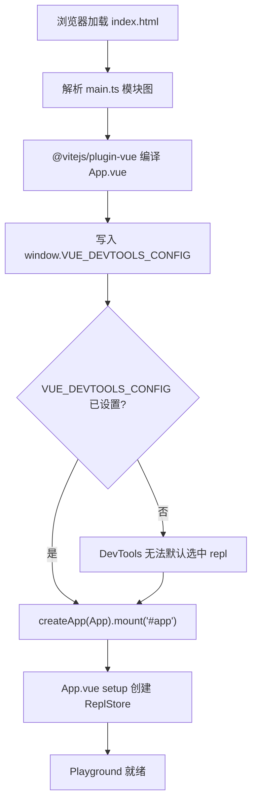
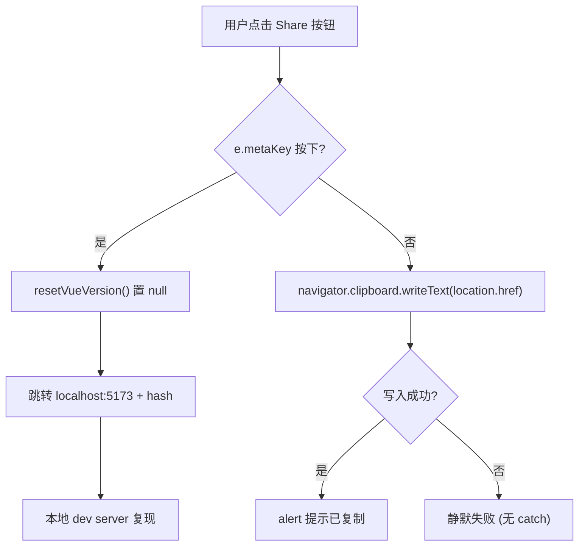
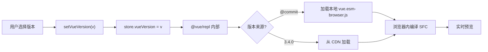

# Chapter 7: SFC Playground: The In-Browser Real-Time Compilation and Debugging Subsystem

In the previous chapter we used more than 20`.test-d.ts`files to nail "types as API contracts" into CI. But type contracts only answer "what the API surface looks like"; they cannot answer "what this SFC actually compiles into" or "whether rendering results are consistent in SSR mode." To answer the latter two questions, the Vue team needed a sandbox that could run the full compilation pipeline in the browser—this is`packages-private/sfc-playground`. It is fundamentally different from the public packages under`packages/`:`package.json`in`"private": true`and`"version": "0.0.0"` [FACT:packages-private/sfc-playground/package.json:2-4], meaning it is never published to npm and is only an official debugging tool. Among its dependencies,`vue`points to`workspace:*` [FACT:packages-private/sfc-playground/package.json:19], that is, the local source build artifact rather than the stable version on npm—this naturally makes the Playground a "living demo of the current commit." This chapter focuses on three questions: how the entry initializes, how the Header drives state switching, and how build-time constants are injected.

# 1. The minimalism of the entry: the initialization contract of main.ts and ReplStore

## Intuitive model

`main.ts`has only 9 lines, like a "power-on self-test script": before the Vue app mounts, it first puts a global configuration onto`window`, telling Vue DevTools "which app is selected by default." Without this step, when DevTools opens it will face multiple app instances (the Playground itself + the code running in the user's REPL) and cannot automatically focus, degrading the debugging experience to manual switching.

## Data structures and global side effects

`main.ts`The core of`createApp`is not`window`, but the polluting write to

[FACT:packages-private/sfc-playground/src/main.ts:4-7]

```ts
// @ts-expect-error Custom window property
window.VUE_DEVTOOLS_CONFIG = {
  defaultSelectedAppId: 'repl',
}
```

There are two engineering details worth noting here:

> **[Design Inference & Architectural Trade-offs]**
> 1. **`@ts-expect-error`rather than`@ts-ignore`**：`window`'s standard type`Window & typeof globalThis`does not have the`VUE_DEVTOOLS_CONFIG`field. Using`@ts-expect-error`means "I know this will error here, and I require it to error"—if in the future some`@types/*`adds this field,`@ts-expect-error`will inversely error due to "not producing an error," thereby reminding the author to remove that annotation. This is in the same vein as the type contract testing approach from the previous chapter:**Use the type system to guard intent, not to conceal problems**。

> **[Design Inference & Architectural Trade-offs]**
> 2. **`defaultSelectedAppId: 'repl'`'s string convention**: this`'repl'`must exactly match the id used when`@vue/repl`internally creates the app. It is a cross-package literal contract with no type constraint protection—once`@vue/repl`changes the id, the Playground's DevTools default selection will silently fail.

## Step-by-Step: From HTML to Mounting

The execution flow is extremely short, but every step has implicit constraints:

1. The browser loads`index.html`, which contains`<div id="app">`(not provided in this material, but`mount('#app')`can be inferred from it).

2. Module graph resolution:`main.ts`at the top of`import App from './App.vue'` [FACT:packages-private/sfc-playground/src/main.ts:2]triggers`@vitejs/plugin-vue`'s SFC compilation.

> **[Design Inference & Architectural Trade-offs]**
> 3. **Key order**：`window.VUE_DEVTOOLS_CONFIG`must be written before`createApp(App).mount('#app')` [FACT:packages-private/sfc-playground/src/main.ts:9]. Because DevTools' hook is registered inside`createApp`, writing the configuration later than mount will not affect the initial selection.

4. `mount('#app')`triggers`App.vue`'s setup, thereby creating`ReplStore`(in`App.vue`, not included in this material).



## Design thinking and pitfalls

`main.ts`The minimalism of**is deliberate:`App.vue`push all complexity down into`ReplStore`**The entry point only handles two things: "global side-effect injection + mounting." No business logic should appear here. This is a trade-off of Playground being a "debugging tool" rather than a "product"—it doesn't need SSR compatibility, multiple entry points, or lazy loading.

> **[Design Inference & Architectural Trade-offs]**
> Production pitfalls:`window.VUE_DEVTOOLS_CONFIG`is**global singleton**. If Playground is embedded in another page that also uses DevTools (such as an iframe scenario), the later writer will overwrite the former. Since Playground is typically deployed independently, this risk is accepted.

---

# II. Header.vue: computed derived state and emit unidirectional data flow

## Intuitive model

`Header.vue`is Playground's "control panel"—version selection, PROD/DEV toggle, SSR toggle, theme toggle, share, download. It itself**does not hold any business state**, all state comes from`props.store`and boolean props, all changes are reported to the parent component through`emit`. Without this "dumb component + event bubbling" constraint, Header would become a disaster zone of scattered state, and the side effects of version switching and SSR toggling would be impossible to manage centrally.

## Data structure and field analysis

Header's props definition is the key to understanding its responsibilities:

[FACT:packages-private/sfc-playground/src/Header.vue:13-19]

```ts
const props = defineProps()
```

The five props fall into two categories:

- **`store: ReplStore`**: the unique state container reference, from`@vue/repl`. Header reads through it`store.loading`、`store.vueVersion`、`store.typescriptVersion`, and directly writes`store.vueVersion`。
- **four boolean/literal props**：`prod`、`ssr`、`autoSave`、`theme`. They are**controlled state**, Header is read-only and does not write, changes must`emit`。

corresponding emit list[FACT:packages-private/sfc-playground/src/Header.vue:20-28]：

```ts
const emit = defineEmits([
  'toggle-theme',
  'toggle-ssr',
  'toggle-prod',
  'toggle-autosave',
  'reload-page',
])
```

Note`toggle-theme`although internally by`toggleDark()``emit`, but`toggle-ssr`/`toggle-prod`/`toggle-autosave`is directly in the template`$emit`of[FACT:packages-private/sfc-playground/src/Header.vue:102-118]. This mixing is a common style in Vue 3`<script setup>`:**use function emit when side effects are needed, use template when pure forwarding`$emit`**。

## Step-by-Step: Version display and switching

Scenario: User opens Playground, Header needs to display the current Vue version.

**Step 1: computed derived display text**

[FACT:packages-private/sfc-playground/src/Header.vue:30-37]

```ts
const vueVersion = computed(() => {
  if (store.loading) {
    return 'loading...'
  }
  return store.vueVersion || `@${__COMMIT__}`
})
```

There are three levels of priority here:`loading`state →`'loading...'`; user explicitly selected a version →`store.vueVersion`; otherwise →`@${__COMMIT__}`(current commit short hash).`__COMMIT__`is a build-time injected constant, detailed in the next section.

**Step 2: VersionSelect two-way binding**

[FACT:packages-private/sfc-playground/src/Header.vue:88-88]

```html

```

Note here**does not use`v-model`**, but explicitly splits into`:model-value` + `@update:model-value`. The reason is that`vueVersion`is computed (read-only), cannot be directly two-way bound; must write through`setVueVersion`this setter function`store.vueVersion`：

[FACT:packages-private/sfc-playground/src/Header.vue:39-41]

```ts
async function setVueVersion(v: string) {
  store.vueVersion = v
}

function resetVueVersion() {
  store.vueVersion = null
}
```

> **[Design Inference & Architectural Trade-offs]**
> `setVueVersion`declared as`async`but internally has no`await`—is this legacy or intentional? Presumably to align with`VersionSelect`'s async loading semantics (switching versions triggers remote loading), maintaining interface consistency.

**Step 3: TypeScript version comparison**

[FACT:packages-private/sfc-playground/src/Header.vue:76-80]

```html

```

The TypeScript version uses`v-model`, because`store.typescriptVersion`is a writable normal property, no computed wrapper needed.**The same component uses two binding methods in the same template**, which is a direct manifestation of "controlled vs uncontrolled."

## Theme switching: combination of side effects and emit

[FACT:packages-private/sfc-playground/src/Header.vue:58-66]

```ts
function toggleDark() {
  const cls = document.documentElement.classList
  cls.toggle('dark')
  localStorage.setItem(
    'vue-sfc-playground-prefer-dark',
    String(cls.contains('dark')),
  )
  emit('toggle-theme', cls.contains('dark'))
}
```

This function does three things: manipulate DOM class, persist to localStorage, emit to notify parent component.**Note it does not directly modify`props.theme`**—because props are read-only, the parent component only updates after receiving`toggle-theme`, which then drives the template's`theme`text`:title`[FACT:packages-private/sfc-playground/src/Header.vue:123]。

> **[Design Inference & Architectural Trade-offs]**
> There is a subtle design here:**DOM class manipulation and Vue reactive state are two independent paths**。`document.documentElement.classList.toggle('dark')`directly modifies DOM, while`theme`prop is updated through Vue. If the two are out of sync (e.g., parent component refuses to update), the UI will show inconsistency where "class has switched but title text hasn't changed." In practice, the parent component always accepts the emit, so the problem doesn't manifest.

## Hidden logic: copyLink's metaKey branch

[FACT:packages-private/sfc-playground/src/Header.vue:47-56]

```ts
async function copyLink(e: MouseEvent) {
  if (e.metaKey) {
    resetVueVersion()
    // hidden logic for going to local debug from play.vuejs.org
    window.location.href = 'http://localhost:5173/' + window.location.hash
    return
  }
  await navigator.clipboard.writeText(location.href)
  alert('Sharable URL has been copied to clipboard.')
}
```

This is a**developer backdoor**: holding Cmd on`play.vuejs.org`and clicking the share button will navigate to`localhost:5173`(local dev server), and carry the current URL hash over. The hash encodes the complete REPL state (source code, version, options), so local debugging can reproduce online issues. The comment`// hidden logic for going to local debug from play.vuejs.org` [FACT:packages-private/sfc-playground/src/Header.vue:47-56]explicitly marks this as an intentionally hidden feature.

> **[Design Inference & Architectural Trade-offs]**
> `resetVueVersion()`is called before navigation, setting`store.vueVersion`to`null`, ensuring local debugging uses the current commit rather than the online selected version.



## Design thinking and pitfalls

> **[Design Inference & Architectural Trade-offs]**
> **Pitfall 1:`navigator.clipboard`'s permissions and secure context**。`copyLink`has no try/catch[FACT:packages-private/sfc-playground/src/Header.vue:47-56]. On non-HTTPS or when the user denies clipboard permission,`writeText`will reject, causing an uncaught Promise rejection. Playground is deployed on HTTPS, the risk is accepted, but this is a typical "production environment trap."

> **[Design Inference & Architectural Trade-offs]**
> **Pitfall 2:`toggleDark`'s localStorage key hardcoded**。`'vue-sfc-playground-prefer-dark'`is a string literal, no constant extraction. If the key needs to be changed in the future, a global search is required.

**Pitfall 3:`currentCommit`and`vueVersion`comparison**. In the template`:class="{ active: vueVersion === \`@${currentCommit}\` }"` [FACT:packages-private/sfc-playground/src/Header.vue:88-88]Compare using string concatenation. If`__COMMIT__`injection fails (becomes`undefined`), here it becomes`'@undefined'`, never matching. The reliability of build-time constant injection directly determines UI correctness—this is exactly the topic of the next section.

---

# III. Build-time Constant Injection: The Dual Responsibilities of __COMMIT__ and copyVuePlugin

## Intuitive Model

`vite.config.ts`is the Playground's "assembly workshop": at build time it executes`git rev-parse`to get the commit hash, and through`define`turns it into a global constant`__COMMIT__`; at the same time, through a custom plugin, it copies the ESM browser artifacts under`packages/vue/dist/`to the Playground's output directory. Without this step, the Playground cannot load "the Vue runtime of the current commit" in the browser—it can only rely on the stable version on npm, losing the meaning of a "live demo."

## Data Structures and Build-time Constants

[FACT:packages-private/sfc-playground/vite.config.ts:7-9]

```ts
const commit = spawnSync('git', ['rev-parse', '--short=7', 'HEAD'])
  .stdout.toString()
  .trim()
```

`spawnSync`synchronously executes the git command,`--short=7`taking the 7-character short hash. Synchronous execution is deliberate:**the config file needs the value of`commit`at module load time**, and async would disrupt Vite's config resolution timing.

[FACT:packages-private/sfc-playground/vite.config.ts:23-26]

```ts
define: {
  __COMMIT__: JSON.stringify(commit),
  __VUE_PROD_DEVTOOLS__: JSON.stringify(true),
},
```

`define`is Vite's**text replacement**mechanism: all`__COMMIT__`in the source code are replaced with`JSON.stringify(commit)`'s result (i.e., a quoted string literal).`JSON.stringify`is necessary—if you write`commit`directly, after replacement it becomes the bare identifier`abc1234`, treated as a variable name rather than a string.

> **[Design Inference & Architectural Trade-offs]**
> `__VUE_PROD_DEVTOOLS__: true`is another key constant: it makes Vue's**production build**also retain DevTools support. By default, production builds strip the DevTools hook to reduce size, but the Playground needs to debug user code, so it is forcibly enabled.

## Step-by-Step: copyVuePlugin's Artifact Transfer

[FACT:packages-private/sfc-playground/vite.config.ts:32-63]

```ts
function copyVuePlugin(): Plugin {
  return {
    name: 'copy-vue',
    generateBundle() {
      const copyFile = (file: string) => {
        const filePath = path.resolve(
          import.meta.dirname,
          '../../packages',
          file,
        )
        const basename = path.basename(file)
        if (!fs.existsSync(filePath)) {
          throw new Error(
            `${basename} not built. ` +
              `Run "nr build vue -f esm-browser" first.`,
          )
        }
        this.emitFile({
          type: 'asset',
          fileName: basename,
          source: fs.readFileSync(filePath, 'utf-8'),
        })
      }

      copyFile(`vue/dist/vue.esm-browser.js`)
      copyFile(`vue/dist/vue.esm-browser.prod.js`)
      copyFile(`vue/dist/vue.runtime.esm-browser.js`)
      copyFile(`vue/dist/vue.runtime.esm-browser.prod.js`)
      copyFile(`server-renderer/dist/server-renderer.esm-browser.js`)
    },
  }
}
```

Key points analyzed one by one:

1. **`generateBundle`hook**: executes after Rollup generates the bundle and before writing to disk. At this point you can`emitFile`stuff extra files into the output.

2. **`import.meta.dirname`**: the ESM version of`__dirname`provided by Node 20.11+. The path`../../packages`goes up from`packages-private/sfc-playground/`to the repository root, then into`packages/`。

3. **Existence check + explicit error**: if`vue.esm-browser.js`does not exist, throw an error with repair instructions`Run "nr build vue -f esm-browser" first.`. This is a model of**developer experience**—the error message directly tells you how to fix it.

4. **Five artifacts**：`vue`'s full build/runtime build × dev/prod, plus`server-renderer`. These five files are exactly the candidate set that the Playground dynamically imports in the browser, corresponding to the version switching and SSR toggle in the Header.

> **[Design Inference & Architectural Trade-offs]**
> **Why these five?**The full build (with compiler) is used for "runtime compilation" scenarios; the runtime build is used for "precompilation" scenarios; dev/prod correspond to the Header's PROD/DEV toggle; server-renderer corresponds to the SSR toggle. These five files constitute the Playground's "Vue runtime matrix."

## The Complete Data Flow of Version Switching

Connecting the Header's`setVueVersion`with copyVuePlugin's artifacts:



Note the special value`@${__COMMIT__}`: it corresponds to the local artifacts copied by copyVuePlugin, not the CDN. This is why the Playground must copy Vue's browser build artifacts in—**the "This Commit" option needs local files**。

## Design Reflections and Pitfalls

> **[Design Inference & Architectural Trade-offs]**
> **Pitfall 1:`spawnSync`'s failure handling**. If the current directory is not a git repository (e.g., extracted from a tarball),`spawnSync`returns a non-zero exit code,`stdout`is empty,`commit`becomes an empty string. At this point`__COMMIT__`is replaced with`""`, and in the Header`@${currentCommit}`becomes`'@'`. There is no explicit error handling.

> **[Design Inference & Architectural Trade-offs]**
> **Pitfall 2:`optimizeDeps.exclude: ['@vue/repl']`** [FACT:packages-private/sfc-playground/vite.config.ts:27-29]. Vite by default pre-bundles dependencies to speed up cold start, but`@vue/repl`is excluded. The reason is that`@vue/repl`internally uses dynamic import and workers, and pre-bundling would break these mechanisms. This is a common "pre-bundling vs. dynamic loading conflict" problem in the Vite ecosystem.

> **[Design Inference & Architectural Trade-offs]**
> **Pitfall 3:`script.fs`configuration** [FACT:packages-private/sfc-playground/vite.config.ts:13-19]。`@vitejs/plugin-vue`'s`script.fs`option allows SFC's`<script>`block to read files through`fs`. Here`fs.existsSync`and`fs.readFileSync`are passed in to support parsing of`import`statements in SFCs (e.g.,`import x from './foo'`needs to check whether a file exists).**This is the key to the Playground being able to simulate complete module resolution in the browser**—it injects Node's fs capability into the compiler's resolution phase.

---

# Design Reflections: The Playground's Architectural Trade-offs

Looking at the three subsections together, the Playground's architecture follows a clear principle:**Separate "state" from "side effects," and separate "build time" from "runtime"**。

- `main.ts`only performs global side-effect injection and does not touch business state.
- `Header.vue`is a pure presentational component, with state flowing in through props and out through emit.
- `vite.config.ts`solidifies the build-time information "current commit" into a constant, read-only at runtime.

> **[Design Inference & Architectural Trade-offs]**
> This separation brings a direct benefit:**the Playground can be embedded into any Vue application**(e.g., an inline example in a documentation site), as long as you provide`store`and four boolean props.

The cost is**State is scattered**：`store`In`@vue/repl`, the boolean state is in the parent component, the DOM class is on`document.documentElement`, and there is another copy in localStorage. Four places of state need to be manually synchronized, and any one out of sync will cause UI inconsistency.

> **[Design Inference & Architectural Trade-offs]**
> Another trade-off is**giving up SSR compatibility**。`main.ts`directly accessing`window`，`Header.vue`'s`toggleDark`directly accessing`document`. Playground is a pure CSR application and does not need to consider server-side rendering.

---

# Chapter summary

This chapter analyzed`packages-private/sfc-playground`'s three core files:

1. **`main.ts`**: a 9-line entry point, whose core is the injection order of`window.VUE_DEVTOOLS_CONFIG`—it must come before`mount`.

2. **`Header.vue`**: derives`computed`through`vueVersion`, and reports all state changes through`emit`.`copyLink`'s`metaKey`branch is a hidden local debugging backdoor.

3. **`vite.config.ts`**：`spawnSync`gets the commit hash,`define`injects`__COMMIT__`，`copyVuePlugin`to copy the five Vue browser build artifacts into the Playground output directory.

The main thread running through all three is**the boundary between build-time constants and runtime state**：`__COMMIT__`is a read-only build-time fact,`store.vueVersion`is a mutable runtime choice, and Header's`vueVersion`computed unifies the two into a single display string.

# Chapter review and self-test

Q1: If the assignment of`main.ts`in`window.VUE_DEVTOOLS_CONFIG`is moved to after`createApp(App).mount('#app')`, what will happen? Why?

**Reference analysis**：`window.VUE_DEVTOOLS_CONFIG`is the configuration read by Vue DevTools when registering the hook inside`createApp`. It will immediately register[FACT:packages-private/sfc-playground/src/main.ts:4-9]。`createApp`, and at this point DevTools will read`__VUE_DEVTOOLS_GLOBAL_HOOK__`to decide which app is selected by default. If the assignment happens later than`defaultSelectedAppId`, DevTools has already completed the first app selection, the configuration will not take effect, and the user needs to manually switch to the`mount`app in DevTools. More subtly: because`repl`also creates an app internally, a late assignment may cause DevTools to select Playground itself by default instead of the user's REPL, so debugging user code requires manual switching. This reflects the importance of "global side-effect injection order" in debugging tools.`@vue/repl`'s

Q2: `Header.vue`simultaneously operates on the DOM class, localStorage, and emit, but does not directly modify`toggleDark()`. If the parent component receives the`props.theme`event and refuses to update the`toggle-theme`prop, what UI inconsistency will occur? How can it be located at the source-code level?`theme`Reference analysis

**In**：`toggleDark()`,[FACT:packages-private/sfc-playground/src/Header.vue:58-66]is called directly, which immediately changes the`document.documentElement.classList.toggle('dark')`class on the DOM and triggers the CSS variable switch (see`dark`'s[FACT:packages-private/sfc-playground/src/Header.vue:186-186]rule). But the`.dark nav`text in the template`:title`depends on[FACT:packages-private/sfc-playground/src/Header.vue:123]. If the parent component does not update it, the title will remain at the old value. Location method: check in the browser DevTools whether the class of`props.theme`contradicts the button's title attribute. The root cause is that "DOM side effects" and "Vue reactive state" follow two independent paths, with no single source of truth.`<html>`In

Q3: `copyVuePlugin`, perform a`generateBundle`check on each file, and throw an error with repair instructions when it is missing. If this check is removed and`fs.existsSync`is called directly, what will happen in a CI environment (without building vue first)? How will the error message mislead developers?`fs.readFileSync`Reference analysis

**: after removing the check,**will throw`fs.readFileSync`. This error only tells the developer "the file does not exist," but does not tell the developer "you need to run`ENOENT: no such file or directory, open '.../packages/vue/dist/vue.esm-browser.js'` [FACT:packages-private/sfc-playground/vite.config.ts:32-63]first." In a CI environment, developers may mistakenly think it is a path configuration error, a permissions issue, or an uninitialized git submodule, wasting a lot of time troubleshooting. The original code's`nr build vue -f esm-browser`binds the "symptom" with the "repair action," which is a key detail of developer experience design. This also explains why the Playground build script must have a clear dependency order with the Vue core build script.`throw new Error(\`${basename} not built. Run "nr build vue -f esm-browser" first.\`)`The next chapter will enter

---

and see how Vue visualizes the compiler's intermediate products (AST, transformation results, code generation), allowing developers to observe step by step every transformation from template to render function. Unlike Playground's "end-to-end black box," Template Explorer is a "white-box probe."`packages-private/template-explorer`At this point, we have seen clearly how SFC Playground moves the compilation pipeline into the browser: entry initialization, Header state switching, and build-time constant injection together form a sandbox that can be debugged in real time. But Playground's perspective is always "the compilation and execution of the entire SFC," and it does not directly answer "what transformation the compiler actually performs on a given template expression." The next chapter will enter Template Explorer and see how it lays out the compilation results of

and`@vue/compiler-dom`line by line, using SourceMapConsumer to establish a mapping between source code and output, thereby turning the compiler's internal behavior into an observable and inferable probe.`@vue/compiler-ssr`← Previous chapter: Chapter 6
