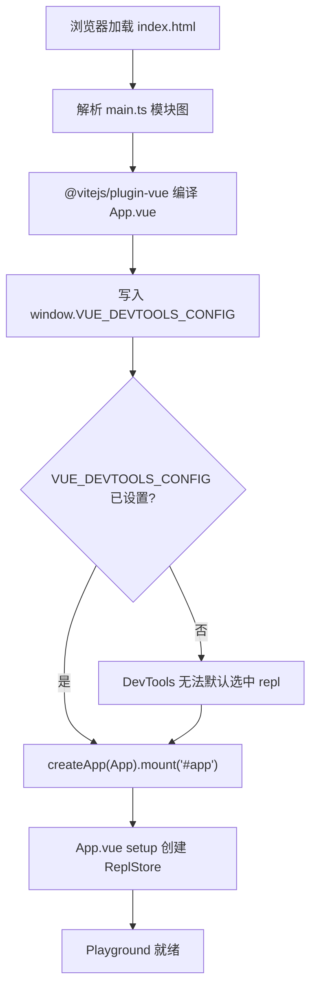
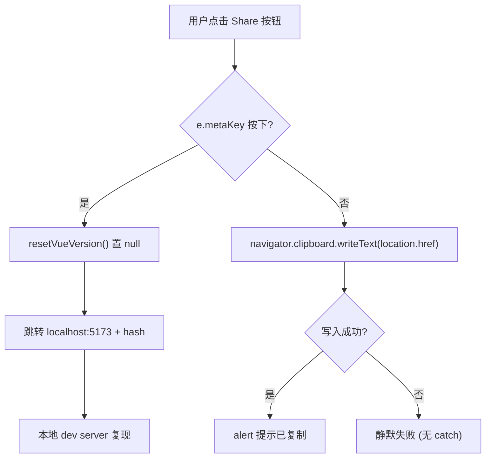
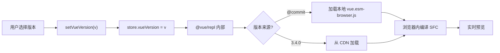

# Chapter 07: Core Reactivity Subsystem: Two-way Binding & Scheduler in @vue/reactivity


上一章我们用 20 余个 `.test-d.ts` 文件把「类型即 API 契约」钉死在 CI 里。但类型契约只回答「API 表面长什么样」，它无法回答「这段 SFC 编译出来到底长什么样」「SSR 模式下渲染结果是否一致」。要回答后两个问题，Vue 团队需要一个能在浏览器里跑完整编译管线的沙箱——这就是 `packages-private/sfc-playground`。它和 `packages/` 下的公开包有本质区别：`package.json` 里 `"private": true` 且 `"version": "0.0.0"` [FACT:packages-private/sfc-playground/package.json:2-4]，意味着它永不发布到 npm，只是官方调试工具。它的依赖里 `vue` 指向 `workspace:*` [FACT:packages-private/sfc-playground/package.json:19]，也就是本地源码构建产物，而非 npm 上的稳定版——这让 Playground 天然成为「当前 commit 的活体演示」。本章聚焦三个问题：入口如何初始化、Header 如何驱动状态切换、构建期常量如何注入。


## Intuitive Architectural Model

`main.ts` 只有 9 行，像一个「开机自检脚本」：在 Vue 应用挂载之前，先往 `window` 上塞一个全局配置，告诉 Vue DevTools「默认选中哪个 app」。若没有这一步，DevTools 打开时会面对多个 app 实例（Playground 自身 + 用户 REPL 里运行的代码）而无法自动聚焦，调试体验会退化成手动切换。

## 数据结构与全局副作用

`main.ts` 的核心不是 `createApp`，而是对 `window` 的污染式写入：

[FACT:packages-private/sfc-playground/src/main.ts:4-7]

```ts
// @ts-expect-error Custom window property
window.VUE_DEVTOOLS_CONFIG = {
  defaultSelectedAppId: 'repl',
}
```

这里有两个值得注意的工程细节：

> **〔Design Inference & Architectural Trade-offs〕**
> 1. **`@ts-expect-error` 而非 `@ts-ignore`**：`window` 的标准类型 `Window & typeof globalThis` 上并没有 `VUE_DEVTOOLS_CONFIG` 字段。用 `@ts-expect-error` 意味着「我知道这里会报错，且我要求它必须报错」——如果未来某个 `@types/*` 补上了这个字段，`@ts-expect-error` 会因「未产生错误」而反向报错，从而提醒作者移除该注释。这与上一章类型契约测试的思路一脉相承：**用类型系统守护意图，而非掩盖问题**。

> **〔Design Inference & Architectural Trade-offs〕**
> 2. **`defaultSelectedAppId: 'repl'` 的字符串约定**：这个 `'repl'` 必须与 `@vue/repl` 内部创建 app 时使用的 id 完全一致。它是一个跨包的字面量契约，没有任何类型约束保护——一旦 `@vue/repl` 改了 id，Playground 的 DevTools 默认选中就会静默失效。

## Step-by-Step：从 HTML 到挂载

执行流极短，但每一步都有隐含约束：

1. 浏览器加载 `index.html`，其中包含 `<div id="app">`（本材料未提供，但 `mount('#app')` 反推可知）。

2. 模块图解析：`main.ts` 顶部 `import App from './App.vue'` [FACT:packages-private/sfc-playground/src/main.ts:2] 触发 `@vitejs/plugin-vue` 的 SFC 编译。

> **〔Design Inference & Architectural Trade-offs〕**
> 3. **关键顺序**：`window.VUE_DEVTOOLS_CONFIG` 必须在 `createApp(App).mount('#app')` [FACT:packages-private/sfc-playground/src/main.ts:9] 之前写入。因为 DevTools 的 hook 是在 `createApp` 内部注册的，晚于 mount 写入配置将无法影响首次选中。

4. `mount('#app')` 触发 `App.vue` 的 setup，进而创建 `ReplStore`（在 `App.vue` 中，本材料未含）。



## 设计思考与踩坑

`main.ts` 的极简是刻意的：**把复杂度全部下沉到 `App.vue` 与 `ReplStore`**。入口只承担「全局副作用注入 + 挂载」两件事，任何业务逻辑都不应出现在这里。这是 Playground 作为「调试工具」而非「产品」的取舍——它不需要 SSR 兼容、不需要多入口、不需要懒加载。

> **〔Design Inference & Architectural Trade-offs〕**
> 生产踩坑点：`window.VUE_DEVTOOLS_CONFIG` 是**全局单例**。如果 Playground 被嵌入到另一个也使用 DevTools 的页面（如 iframe 场景），后写入者会覆盖前者。由于 Playground 通常独立部署，这个风险被接受。

---


## Intuitive Architectural Model

`Header.vue` 是 Playground 的「控制面板」——版本选择、PROD/DEV 切换、SSR 开关、主题切换、分享、下载。它本身**不持有任何业务状态**，所有状态都来自 `props.store` 与布尔 props，所有变更都通过 `emit` 上报给父组件。若没有这种「哑组件 + 事件冒泡」的约束，Header 会变成状态散落的重灾区，版本切换与 SSR 切换的副作用将无法集中管理。

## 数据结构与字段剖析

Header 的 props 定义是理解其职责的钥匙：

[FACT:packages-private/sfc-playground/src/Header.vue:13-19]

```ts
const props = defineProps()
```

五个 props 分成两类：

- **`store: ReplStore`**：唯一的状态容器引用，来自 `@vue/repl`。Header 通过它读取 `store.loading`、`store.vueVersion`、`store.typescriptVersion`，并直接写入 `store.vueVersion`。
- **四个布尔/字面量 props**：`prod`、`ssr`、`autoSave`、`theme`。它们是**受控状态**，Header 只读不写，变更必须 `emit`。

对应的 emit 列表 [FACT:packages-private/sfc-playground/src/Header.vue:20-28]：

```ts
const emit = defineEmits([
  'toggle-theme',
  'toggle-ssr',
  'toggle-prod',
  'toggle-autosave',
  'reload-page',
])
```

注意 `toggle-theme` 虽然由 `toggleDark()` 内部 `emit`，但 `toggle-ssr`/`toggle-prod`/`toggle-autosave` 是模板里直接 `$emit` 的 [FACT:packages-private/sfc-playground/src/Header.vue:102-118]。这种混用是 Vue 3 `<script setup>` 的常见风格：**需要副作用时用函数 emit，纯转发时用模板 `$emit`**。

## Step-by-Step：版本显示与切换

代入场景：用户打开 Playground，Header 需要显示当前 Vue 版本。

**步骤 1：computed 派生显示文本**

[FACT:packages-private/sfc-playground/src/Header.vue:30-37]

```ts
const vueVersion = computed(() => {
  if (store.loading) {
    return 'loading...'
  }
  return store.vueVersion || `@${__COMMIT__}`
})
```

这里有三层优先级：`loading` 态 → `'loading...'`；用户显式选了版本 → `store.vueVersion`；否则 → `@${__COMMIT__}`（当前 commit 短哈希）。`__COMMIT__` 是构建期注入的常量，下一节详述。

**步骤 2：VersionSelect 双向绑定**

[FACT:packages-private/sfc-playground/src/Header.vue:88-88]

```html

```

注意这里**没有用 `v-model`**，而是显式拆成 `:model-value` + `@update:model-value`。原因在于 `vueVersion` 是 computed（只读），不能直接双向绑定；必须通过 `setVueVersion` 这个 setter 函数写入 `store.vueVersion`：

[FACT:packages-private/sfc-playground/src/Header.vue:39-41]

```ts
async function setVueVersion(v: string) {
  store.vueVersion = v
}

function resetVueVersion() {
  store.vueVersion = null
}
```

> **〔Design Inference & Architectural Trade-offs〕**
> `setVueVersion` 声明为 `async` 但内部无 `await`——这是历史遗留还是有意为之？ 推测是为了与 `VersionSelect` 的异步加载语义对齐（切换版本会触发远程加载），保持接口一致。

**步骤 3：TypeScript 版本的对比**

[FACT:packages-private/sfc-playground/src/Header.vue:76-80]

```html

```

TypeScript 版本用了 `v-model`，因为 `store.typescriptVersion` 是可写的普通属性，不需要 computed 包装。**同一个组件在同一个模板里用两种绑定方式**，正是「受控 vs 非受控」的直观体现。

## 主题切换：副作用与 emit 的组合

[FACT:packages-private/sfc-playground/src/Header.vue:58-66]

```ts
function toggleDark() {
  const cls = document.documentElement.classList
  cls.toggle('dark')
  localStorage.setItem(
    'vue-sfc-playground-prefer-dark',
    String(cls.contains('dark')),
  )
  emit('toggle-theme', cls.contains('dark'))
}
```

这个函数做了三件事：操作 DOM class、持久化到 localStorage、emit 通知父组件。**注意它没有直接改 `props.theme`**——因为 props 只读，父组件收到 `toggle-theme` 后才会更新 `theme`，进而驱动模板里的 `:title` 文案 [FACT:packages-private/sfc-playground/src/Header.vue:123]。

> **〔Design Inference & Architectural Trade-offs〕**
> 这里有一个微妙的设计：**DOM class 操作与 Vue 响应式状态是两条独立路径**。`document.documentElement.classList.toggle('dark')` 直接改 DOM，而 `theme` prop 通过 Vue 更新。如果两者不同步（例如父组件拒绝更新），UI 会出现「class 已切换但 title 文案未变」的不一致。 实际中父组件总是接受 emit，所以问题不显现。

## 隐藏逻辑：copyLink 的 metaKey 分支

[FACT:packages-private/sfc-playground/src/Header.vue:47-56]

```ts
async function copyLink(e: MouseEvent) {
  if (e.metaKey) {
    resetVueVersion()
    // hidden logic for going to local debug from play.vuejs.org
    window.location.href = 'http://localhost:5173/' + window.location.hash
    return
  }
  await navigator.clipboard.writeText(location.href)
  alert('Sharable URL has been copied to clipboard.')
}
```

这是一个**开发者后门**：在 `play.vuejs.org` 上按住 Cmd 点击分享按钮，会跳转到 `localhost:5173`（本地 dev server），并把当前 URL hash 带过去。hash 里编码了完整的 REPL 状态（源码、版本、选项），因此本地调试能复现线上问题。注释 `// hidden logic for going to local debug from play.vuejs.org` [FACT:packages-private/sfc-playground/src/Header.vue:47-56] 明确标注了这是有意隐藏的功能。

> **〔Design Inference & Architectural Trade-offs〕**
> `resetVueVersion()` 在跳转前被调用，把 `store.vueVersion` 置为 `null`，确保本地调试用的是当前 commit 而非线上选定的版本。



## 设计思考与踩坑

> **〔Design Inference & Architectural Trade-offs〕**
> **踩坑 1：`navigator.clipboard` 的权限与安全上下文**。`copyLink` 没有 try/catch [FACT:packages-private/sfc-playground/src/Header.vue:47-56]。在非 HTTPS 或用户拒绝剪贴板权限时，`writeText` 会 reject，导致未捕获的 Promise rejection。Playground 部署在 HTTPS 上，风险被接受，但这是典型的「生产环境陷阱」。

> **〔Design Inference & Architectural Trade-offs〕**
> **踩坑 2：`toggleDark` 的 localStorage key 硬编码**。`'vue-sfc-playground-prefer-dark'` 是字符串字面量，没有常量抽取。如果未来要改 key，需要全局搜索。

**踩坑 3：`currentCommit` 与 `vueVersion` 的比较**。模板里 `:class="{ active: vueVersion === \`@${currentCommit}\` }"` [FACT:packages-private/sfc-playground/src/Header.vue:88-88] 用字符串拼接比较。如果 `__COMMIT__` 注入失败（变成 `undefined`），这里会变成 `'@undefined'`，永远不匹配。构建期常量注入的可靠性直接决定了 UI 正确性——这正是下一节的主题。

---


## Intuitive Architectural Model

`vite.config.ts` 是 Playground 的「装配车间」：它在构建时执行 `git rev-parse` 拿到 commit 哈希，通过 `define` 把它变成全局常量 `__COMMIT__`；同时通过自定义插件把 `packages/vue/dist/` 下的 ESM 浏览器产物复制到 Playground 的产物目录。若没有这一步，Playground 就无法在浏览器里加载「当前 commit 的 Vue 运行时」——它只能依赖 npm 上的稳定版，失去「活体演示」的意义。

## 数据结构与构建期常量

[FACT:packages-private/sfc-playground/vite.config.ts:7-9]

```ts
const commit = spawnSync('git', ['rev-parse', '--short=7', 'HEAD'])
  .stdout.toString()
  .trim()
```

`spawnSync` 同步执行 git 命令，`--short=7` 取 7 位短哈希。同步执行是刻意的：**配置文件在模块加载期就需要 `commit` 的值**，异步会打乱 Vite 的配置解析时序。

[FACT:packages-private/sfc-playground/vite.config.ts:23-26]

```ts
define: {
  __COMMIT__: JSON.stringify(commit),
  __VUE_PROD_DEVTOOLS__: JSON.stringify(true),
},
```

`define` 是 Vite 的**文本替换**机制：源码里所有 `__COMMIT__` 会被替换成 `JSON.stringify(commit)` 的结果（即带引号的字符串字面量）。`JSON.stringify` 是必需的——如果直接写 `commit`，替换后会变成裸标识符 `abc1234`，被当作变量名而非字符串。

> **〔Design Inference & Architectural Trade-offs〕**
> `__VUE_PROD_DEVTOOLS__: true` 是另一个关键常量：它让 Vue 的**生产构建**也保留 DevTools 支持。默认情况下生产构建会剥离 DevTools hook 以减小体积，但 Playground 需要调试用户代码，所以强制开启。

## Step-by-Step：copyVuePlugin 的产物搬运

[FACT:packages-private/sfc-playground/vite.config.ts:32-63]

```ts
function copyVuePlugin(): Plugin {
  return {
    name: 'copy-vue',
    generateBundle() {
      const copyFile = (file: string) => {
        const filePath = path.resolve(
          import.meta.dirname,
          '../../packages',
          file,
        )
        const basename = path.basename(file)
        if (!fs.existsSync(filePath)) {
          throw new Error(
            `${basename} not built. ` +
              `Run "nr build vue -f esm-browser" first.`,
          )
        }
        this.emitFile({
          type: 'asset',
          fileName: basename,
          source: fs.readFileSync(filePath, 'utf-8'),
        })
      }

      copyFile(`vue/dist/vue.esm-browser.js`)
      copyFile(`vue/dist/vue.esm-browser.prod.js`)
      copyFile(`vue/dist/vue.runtime.esm-browser.js`)
      copyFile(`vue/dist/vue.runtime.esm-browser.prod.js`)
      copyFile(`server-renderer/dist/server-renderer.esm-browser.js`)
    },
  }
}
```

关键点逐一解析：

1. **`generateBundle` 钩子**：在 Rollup 生成 bundle 之后、写入磁盘之前执行。此时可以 `emitFile` 往产物里塞额外文件。

2. **`import.meta.dirname`**：Node 20.11+ 提供的 ESM 版 `__dirname`。路径 `../../packages` 从 `packages-private/sfc-playground/` 上溯到仓库根，再进入 `packages/`。

3. **存在性检查 + 明确报错**：如果 `vue.esm-browser.js` 不存在，抛出带修复指令的错误 `Run "nr build vue -f esm-browser" first.`。这是**开发者体验**的典范——错误信息直接告诉你怎么修。

4. **五个产物**：`vue` 的完整版/运行时版 × dev/prod，加上 `server-renderer`。这五个文件正是 Playground 在浏览器里动态 import 的候选集，对应 Header 里的版本切换与 SSR 开关。

> **〔Design Inference & Architectural Trade-offs〕**
> **为什么是这五个？**  完整版（含编译器）用于「运行时编译」场景；运行时版用于「预编译」场景；dev/prod 对应 Header 的 PROD/DEV 切换；server-renderer 对应 SSR 开关。这五个文件构成了 Playground 的「Vue 运行时矩阵」。

## 版本切换的完整数据流

把 Header 的 `setVueVersion` 与 copyVuePlugin 的产物连起来看：



注意 `@${__COMMIT__}` 这个特殊值：它对应 copyVuePlugin 复制的本地产物，而非 CDN。这就是为什么 Playground 必须把 Vue 的浏览器构建产物复制进来——**「This Commit」选项需要本地文件**。

## 设计思考与踩坑

> **〔Design Inference & Architectural Trade-offs〕**
> **踩坑 1：`spawnSync` 的失败处理**。如果当前目录不是 git 仓库（例如从 tarball 解压），`spawnSync` 会返回非零退出码，`stdout` 为空，`commit` 变成空字符串。此时 `__COMMIT__` 被替换成 `""`，Header 里 `@${currentCommit}` 变成 `'@'`。没有显式错误处理。

> **〔Design Inference & Architectural Trade-offs〕**
> **踩坑 2：`optimizeDeps.exclude: ['@vue/repl']`** [FACT:packages-private/sfc-playground/vite.config.ts:27-29]。Vite 默认会预打包依赖以加速冷启动，但 `@vue/repl` 被排除。原因是 `@vue/repl` 内部使用了动态 import 与 worker，预打包会破坏这些机制。 这是 Vite 生态里常见的「预打包与动态加载冲突」问题。

> **〔Design Inference & Architectural Trade-offs〕**
> **踩坑 3：`script.fs` 配置** [FACT:packages-private/sfc-playground/vite.config.ts:13-19]。`@vitejs/plugin-vue` 的 `script.fs` 选项允许 SFC 的 `<script>` 块通过 `fs` 读取文件。这里传入 `fs.existsSync` 与 `fs.readFileSync`，是为了支持 SFC 里的 `import` 语句解析（例如 `import x from './foo'` 需要检查文件是否存在）。**这是 Playground 能在浏览器里模拟完整模块解析的关键**——它把 Node 的 fs 能力注入到编译器的解析阶段。

---


把三个小节串起来看，Playground 的架构遵循一条清晰的原则：**把「状态」与「副作用」分离，把「构建期」与「运行期」分离**。

- `main.ts` 只做全局副作用注入，不碰业务状态。
- `Header.vue` 是纯展示组件，状态通过 props 流入、通过 emit 流出。
- `vite.config.ts` 把「当前 commit」这个构建期信息固化为常量，运行期只读。

> **〔Design Inference & Architectural Trade-offs〕**
> 这种分离带来一个直接好处：**Playground 可以被嵌入到任何 Vue 应用里**（例如文档站的内嵌示例），只要提供 `store` 与四个布尔 props 即可。

代价是**状态分散**：`store` 在 `@vue/repl` 里，布尔状态在父组件里，DOM class 在 `document.documentElement` 上，localStorage 里还有一份。四处状态需要手动同步，任何一处不同步都会导致 UI 不一致。

> **〔Design Inference & Architectural Trade-offs〕**
> 另一个取舍是**放弃 SSR 兼容**。`main.ts` 直接访问 `window`，`Header.vue` 的 `toggleDark` 直接访问 `document`。Playground 是纯 CSR 应用，不需要考虑服务端渲染。

---


本章剖析了 `packages-private/sfc-playground` 的三个核心文件：

1. **`main.ts`**：9 行入口，核心是 `window.VUE_DEVTOOLS_CONFIG` 的注入顺序——必须在 `mount` 之前。

2. **`Header.vue`**：通过 `computed` 派生 `vueVersion`，通过 `emit` 上报所有状态变更。`copyLink` 的 `metaKey` 分支是隐藏的本地调试后门。

3. **`vite.config.ts`**：`spawnSync` 拿 commit 哈希，`define` 注入 `__COMMIT__`，`copyVuePlugin` 把五个 Vue 浏览器产物搬运到 Playground 产物目录。

贯穿三者的主线是**构建期常量与运行期状态的边界**：`__COMMIT__` 是只读的构建期事实，`store.vueVersion` 是可变的运行期选择，Header 的 `vueVersion` computed 把两者统一成一个显示字符串。


Q1: 如果把 `main.ts` 中 `window.VUE_DEVTOOLS_CONFIG` 的赋值移到 `createApp(App).mount('#app')` 之后，会发生什么？为什么？

**参考解析**：`window.VUE_DEVTOOLS_CONFIG` 是 Vue DevTools 在 `createApp` 内部注册 hook 时读取的配置 [FACT:packages-private/sfc-playground/src/main.ts:4-9]。`createApp` 会立即注册 `__VUE_DEVTOOLS_GLOBAL_HOOK__`，此时 DevTools 会读取 `defaultSelectedAppId` 来决定默认选中哪个 app。如果赋值晚于 `mount`，DevTools 已经完成了首次 app 选择，配置将不会生效，用户需要手动在 DevTools 里切换到 `repl` app。更隐蔽的是：由于 `@vue/repl` 内部也会创建 app，晚赋值可能导致 DevTools 默认选中 Playground 自身而非用户 REPL，调试用户代码时需要手动切换。这体现了「全局副作用注入顺序」在调试工具中的重要性。

Q2: `Header.vue` 的 `toggleDark()` 同时操作了 DOM class、localStorage 和 emit，但没有直接修改 `props.theme`。如果父组件收到 `toggle-theme` 事件后拒绝更新 `theme` prop，会出现什么 UI 不一致？如何从源码层面定位？

**参考解析**：`toggleDark()` 在 [FACT:packages-private/sfc-playground/src/Header.vue:58-66] 直接调用 `document.documentElement.classList.toggle('dark')`，这会立即改变 DOM 上的 `dark` class，触发 CSS 变量切换（见 [FACT:packages-private/sfc-playground/src/Header.vue:186-186] 的 `.dark nav` 规则）。但模板里的 `:title` 文案 [FACT:packages-private/sfc-playground/src/Header.vue:123] 依赖 `props.theme`，如果父组件不更新，title 会停留在旧值。定位方法：在浏览器 DevTools 里检查 `<html>` 的 class 与按钮的 title 属性是否矛盾。根因是「DOM 副作用」与「Vue 响应式状态」走了两条独立路径，没有单一数据源。

Q3: `copyVuePlugin` 在 `generateBundle` 里对每个文件做 `fs.existsSync` 检查，缺失时抛出带修复指令的错误。如果去掉这个检查，直接 `fs.readFileSync`，在 CI 环境（未先构建 vue）下会发生什么？错误信息会如何误导开发者？

**参考解析**：去掉检查后，`fs.readFileSync` 会抛出 `ENOENT: no such file or directory, open '.../packages/vue/dist/vue.esm-browser.js'` [FACT:packages-private/sfc-playground/vite.config.ts:32-63]。这个错误只告诉开发者「文件不存在」，但不会告诉开发者「需要先运行 `nr build vue -f esm-browser`」。在 CI 环境下，开发者可能误以为是路径配置错误、权限问题或 git 子模块未初始化，浪费大量时间排查。原代码的 `throw new Error(\`${basename} not built. Run "nr build vue -f esm-browser" first.\`)` 把「症状」与「修复动作」绑定在一起，是开发者体验设计的关键细节。这也解释了为什么 Playground 的构建脚本必须与 Vue 核心构建脚本有明确的依赖顺序。

---

下一章将进入 `packages-private/template-explorer`，看 Vue 如何把编译器的中间产物（AST、转换结果、代码生成）可视化，让开发者能逐步观察模板到渲染函数的每一步变换。与 Playground 的「端到端黑盒」不同，Template Explorer 是「白盒探针」。

至此，我们看清了 SFC Playground 如何把编译管线搬进浏览器：入口初始化、Header 状态切换与构建期常量注入共同构成了一个可实时调试的沙箱。但 Playground 的视角始终是「整段 SFC 的编译与运行」，它并不直接回答「编译器对某个模板表达式究竟做了什么变换」。下一章将走进 Template Explorer，看它如何把 `@vue/compiler-dom` 与 `@vue/compiler-ssr` 的编译结果逐行摊开，用 SourceMapConsumer 建立源码与产物的映射，从而把编译器的内部行为变成可观察、可反推的探针。