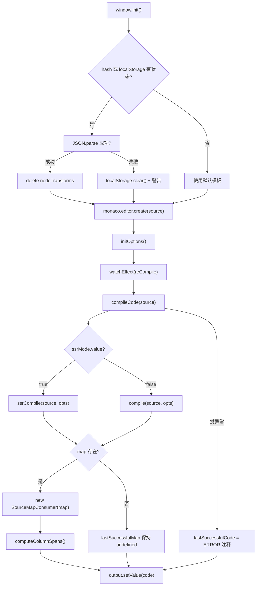
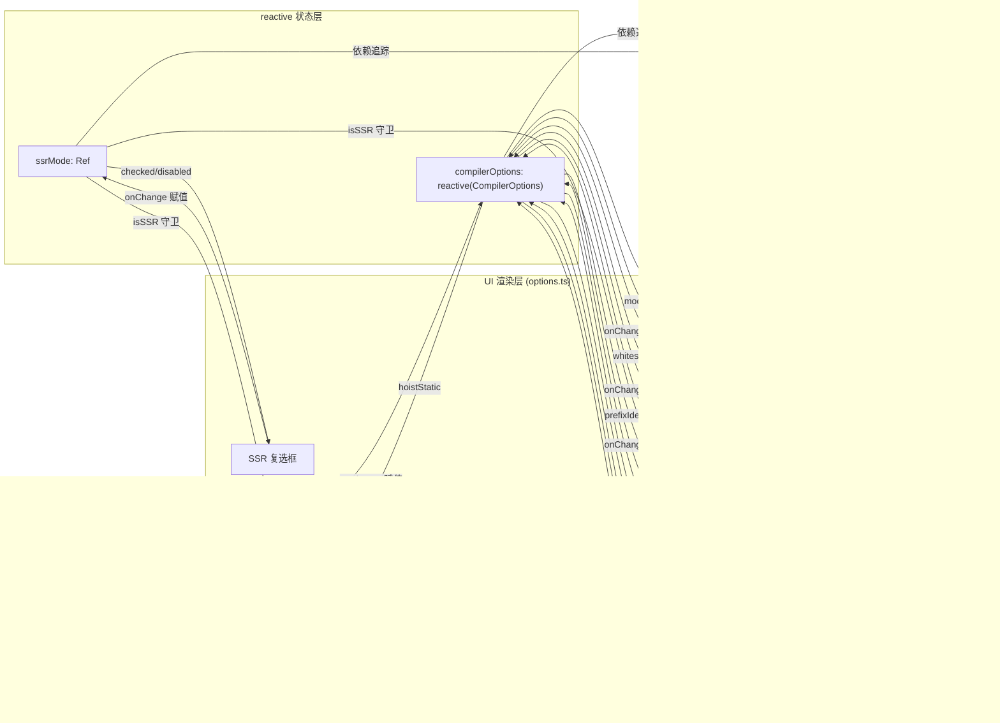

# Project: vuejs/core

In the previous chapter, we saw how SFC Playground encapsulates the entire chain of "input SFC → in-browser compilation → real-time preview" into a black box: developers see the final rendered result but cannot see what the compiler does in between. When a custom directive is written in the template, or when hoistStatic is enabled and the output suddenly contains a bunch of _hoisted_1 variables, Playground cannot answer "why the compiler generates it this way." Template Explorer's positioning is exactly the opposite: it lays out the compilation output of @vue/compiler-dom and @vue/compiler-ssr, the AST, error markers, and the position mapping from source code to output. Its core is not "running," but "observing." This chapter unfolds around three files: index.ts is responsible for compilation invocation and bidirectional SourceMap mapping, options.ts uses reactive to manage dozens of CompilerOptions and drive the UI, and theme.ts customizes the Monaco editor theme.

# 1. Compilation invocation and bidirectional SourceMap mapping: index.ts

## Intuitive model

Template Explorer's`index.ts`is like a "bidirectional translation machine": the template is input on the left, and the render function is output on the right. But it has one more capability than a translation machine—when you place the cursor on a certain line on the left, the corresponding output on the right is highlighted; conversely, when you place the cursor on the right, the corresponding template on the left is highlighted. Without SourceMap mapping, this tool would degenerate into two side-by-side text boxes, and developers could only compare by eye, unable to establish the causal chain of "which line of the template → which line of the output."

## Data structures and memory layout

`index.ts`There are no complex Structs in it, but there are several key module-level state variables that determine the behavior of the entire tool:

`lastSuccessfulCode`and`lastSuccessfulMap`are the cache of the compilation result[FACT:packages-private/template-explorer/src/index.ts:74-75]. The former is a string, and the latter is`SourceMapConsumer | undefined`. Note that`lastSuccessfulMap`is initially`undefined`, and is assigned only when compilation succeeds and`map`exists[FACT:packages-private/template-explorer/src/index.ts:99-100]. This`undefined`state is the guard condition for all subsequent cursor mapping logic—if compilation fails, the mapping feature automatically fails silently instead of throwing an exception.

`PersistedState`The interface defines the state shape persisted to localStorage and the URL hash[FACT:packages-private/template-explorer/src/index.ts:26-30]：`src`(template source code),`ssr`(whether SSR mode is enabled),`options`(compiler options). There is a key design here:`options`'s type is the complete`CompilerOptions`, but during actual persistence only "items different from the default values" are saved, and this pruning logic is completed in`reCompile`.

`sharedEditorOptions`are the construction options shared by the two editors[FACT:packages-private/template-explorer/src/index.ts:26-30]：`fontSize: 14`、`scrollBeyondLastLine: false`、`renderWhitespace: 'selection'`、`minimap.enabled: false`. The minimap is disabled because templates and output are usually only a few dozen lines, and the minimap instead takes up horizontal space.

## Step-by-Step Walkthrough

**Scenario: the user opens the page, inputs`
{{ msg }}
`, and then moves the cursor.**

**Step 1: Initialization and state restoration.** `window.init`is the global entry point[FACT:packages-private/template-explorer/src/index.ts:41]. It first registers and activates the custom theme[FACT:packages-private/template-explorer/src/index.ts:44-45], and then tries to restore state from the URL hash or localStorage[FACT:packages-private/template-explorer/src/index.ts:49-56]. Note the decoding order here: first`atob`then`escape`, and then`decodeURIComponent`. If hash parsing fails, it falls back to`localStorage.getItem('state')`, and then falls back to`{}`. If the entire JSON.parse fails, it clears localStorage and prints a warning[FACT:packages-private/template-explorer/src/index.ts:57-64]。

After restoring state, there is a detail that is easy to overlook:`delete persistedState.options?.nodeTransforms` [FACT:packages-private/template-explorer/src/index.ts:69]. The comment explains the reason—functions cannot be serialized, so during persistence`nodeTransforms`is lost, and if an empty object remains during restoration, it will cause abnormal compiler behavior. This is the classic trap of "persisting non-serializable fields."

**Step 2: Compilation core`compileCode`。**This is the heart of the entire tool[FACT:packages-private/template-explorer/src/index.ts:76-106]. It first`console.clear()`, and then selects`ssrMode.value`according to`ssrCompile`or`compile` [FACT:packages-private/template-explorer/src/index.ts:80]. Note the call parameters of`compileFn`: spread`compilerOptions`, force`filename: 'ExampleTemplate.vue'`、`sourceMap: true`, and inject the`onError`callback to collect errors[FACT:packages-private/template-explorer/src/index.ts:82-89]。

There is a design decision here:`filename`is hardcoded as`'ExampleTemplate.vue'`. This value must exactly match`generatedPositionFor`in the subsequent[FACT:packages-private/template-explorer/src/index.ts:189]call, otherwise the SourceMap query will return empty results. This is an implicit contract—the strings in the two places must be consistent, but no type system guarantees it.

After compilation is complete, errors are converted to Monaco's marker format and set on the editor[FACT:packages-private/template-explorer/src/index.ts:91-95]。`formatError`converts`CompilerError`'s`loc`to Monaco's`startLineNumber/startColumn/endLineNumber/endColumn` [FACT:packages-private/template-explorer/src/index.ts:108-119]. Note`errors.filter(e => e.loc)`—only errors with position information are marked; errors without`loc`(such as global configuration errors) are only output to the console.

**Step 3: Establishment of the SourceMap.**After successful compilation,`lastSuccessfulMap = new SourceMapConsumer(map!)` [FACT:packages-private/template-explorer/src/index.ts:99], and then`computeColumnSpans()` [FACT:packages-private/template-explorer/src/index.ts:100]。`computeColumnSpans`is called. It is a key API of`source-map-js`: it precomputes the column span of each mapping segment, making the`generatedPositionFor`field returned by`lastColumn`available. Without this step, reverse mapping can only locate the starting column and cannot highlight the entire token range.

**Step 4: Bidirectional cursor mapping.**When the user is in the**source editor**and moves the cursor,`editor.onDidChangeCursorPosition` [FACT:packages-private/template-explorer/src/index.ts:184]is triggered. After a 100ms debounce, the callback calls`lastSuccessfulMap.generatedPositionFor({ source: 'ExampleTemplate.vue', line, column: column - 1 })` [FACT:packages-private/template-explorer/src/index.ts:188-192]. Note`column - 1`: Monaco's column numbers start from 1, while SourceMap's column numbers start from 0. If the returned`pos`has`line`and`column`, create a decorator on the output editor to highlight the corresponding range[FACT:packages-private/template-explorer/src/index.ts:194-206], and scroll to that position[FACT:packages-private/template-explorer/src/index.ts:207-210]。

Reverse mapping is in`output.onDidChangeCursorPosition`[FACT:packages-private/template-explorer/src/index.ts:223]. It calls`originalPositionFor` [FACT:packages-private/template-explorer/src/index.ts:227-230], but with an extra guard: ignore`pos.line === 1 && pos.column === 0`'s "mock location"[FACT:packages-private/template-explorer/src/index.ts:231-237]. This guard is crucial—some code generated by the compiler (such as`import`statements or helper functions) has no corresponding template position, and SourceMap will return`{ line: 1, column: 0 }`as a placeholder. If not ignored, placing the cursor on these lines will incorrectly highlight the first line of the template.

**Step 5: State persistence.** `reCompile`not only triggers compilation, but is also responsible for writing the current state to localStorage and the URL hash[FACT:packages-private/template-explorer/src/index.ts:121-146]. During persistence there is a trimming logic: iterate over`compilerOptions`, and only save items that are "not objects and not equal to the default value"[FACT:packages-private/template-explorer/src/index.ts:125-133]. This explains why`bindingMetadata`options of this object type are not persisted—it is too complex, and the default value is already sufficient for demonstration.

## Design thinking and production pitfalls

**Why use`source-map-js`instead of`source-map`？** `source-map`is Mozilla's original library, which is large and depends on WASM (newer versions).`source-map-js`is a pure JS implementation, small in size, and suitable for browser environments. As a pure frontend tool, Template Explorer choosing`source-map-js`is reasonable[FACT:packages-private/template-explorer/package.json:15]。

**debounce delay choice.**The source code editor's debounce defaults to 300ms[FACT:packages-private/template-explorer/src/index.ts:271], while the cursor movement debounce is 100ms[FACT:packages-private/template-explorer/src/index.ts:215]. This difference is intentional: compilation is a heavy operation, and 300ms avoids frequent triggering; cursor movement is a light operation, and 100ms ensures responsiveness. But 100ms can still cause highlight flicker when moving the cursor quickly—this is an acceptable tradeoff.

**`window.init`'s global mounting.**Note that`window.init`and`window.monaco`are both mounted on the global[FACT:packages-private/template-explorer/src/index.ts:19-23]. This is because the Monaco editor is asynchronously loaded via the CDN's`loader.js`, and after loading completes it calls`window.init`. This "global callback" pattern is Monaco's standard usage in non-modular environments, but it is incompatible with modern ESM build approaches.

---

# II. Reactive-driven options panel: options.ts

## Intuitive model

`options.ts`is like a "console panel": there are more than a dozen switches and radio buttons on it, each corresponding to a compiler behavior. Toggle any switch, and the compiled output on the right changes immediately. Without this module, developers could only modify the`compile`call parameters in the source code and recompile, and could not compare the effects of different options in real time.

## Data structures and memory layout

`options.ts`'s core consists of three exports:

`ssrMode`is a`ref(false)` [FACT:packages-private/template-explorer/src/options.ts:5]. It is independent of`compilerOptions`, because SSR mode switches the compile function itself (`compile` vs `ssrCompile`), not the compile options.

`defaultOptions`is a complete`CompilerOptions`object[FACT:packages-private/template-explorer/src/options.ts:5-27]. It defines the default values for all options, including`mode: 'module'`、`prefixIdentifiers: false`、`hoistStatic: false`、`cacheHandlers: false`、`scopeId: null`、`inline: false`、`ssrCssVars: '{ color }'`、`compatConfig: { MODE: 3 }`、`whitespace: 'condense'`, as well as a`bindingMetadata` [FACT:packages-private/template-explorer/src/options.ts:18-26]。

`compilerOptions`containing 7 binding types`reactive(Object.assign({}, defaultOptions))` [FACT:packages-private/template-explorer/src/options.ts:29-31]is`Object.assign({}, ...)`. Note that`reactive(defaultOptions)`is used here for a shallow copy—if you directly`compilerOptions`, modifying`defaultOptions`will pollute`reCompile`, causing the "compare with default value" logic in

## Step-by-Step Walkthrough

**to fail.**

**Scenario: the user clicks the "hoistStatic" checkbox.** `App`Step 1: UI rendering.`setup`The component's[FACT:packages-private/template-explorer/src/options.ts:33-35]returns a render function`ssrMode.value`、`compilerOptions.mode`、`compilerOptions.prefixIdentifiers`. This render function reads reactive state such as[FACT:packages-private/template-explorer/src/options.ts:36-39], so when these states change, the entire UI re-renders.

**Step 2: The checkbox's checked binding.** `hoistStatic`The checkbox's`checked`attribute is`compilerOptions.hoistStatic && !isSSR` [FACT:packages-private/template-explorer/src/options.ts:150]. There is a logic here: in SSR mode,`hoistStatic`is forced to display as unchecked, because SSR compilation does not support static hoisting. At the same time,`disabled: isSSR` [FACT:packages-private/template-explorer/src/options.ts:151]ensures that the user cannot toggle it in SSR mode.

**Step 3: onChange handling.**When the user clicks the checkbox,`onChange`triggers[FACT:packages-private/template-explorer/src/options.ts:152-156], directly assigning`e.target.checked`to`compilerOptions.hoistStatic`. Since`compilerOptions`is`reactive`, this assignment triggers dependency tracking, which in turn triggers`watchEffect(reCompile)` [FACT:packages-private/template-explorer/src/index.ts:266], and finally recompiles.

**Step 4: Linkage between options.**Note that`cacheHandlers`'s`checked`is`usePrefix && compilerOptions.cacheHandlers && !isSSR` [FACT:packages-private/template-explorer/src/options.ts:166]，`disabled`is`!usePrefix || isSSR` [FACT:packages-private/template-explorer/src/options.ts:167]. This means that`cacheHandlers`depends on`prefixIdentifiers`or`mode === 'module'`. This linkage relationship is manifested in the UI as: when`prefixIdentifiers`is not enabled and the mode is`function`,`cacheHandlers`the checkbox is disabled.

`scopeId`'s linkage is more complex:`disabled: !isModule` [FACT:packages-private/template-explorer/src/options.ts:182]，`checked: isModule && compilerOptions.scopeId` [FACT:packages-private/template-explorer/src/options.ts:183]. scopeId can only be set in module mode, and on change, if`isModule`is false, it will be forcibly set to`null` [FACT:packages-private/template-explorer/src/options.ts:184-189]。

**Step 5: Mounting.** `initOptions`calls`createApp(App).mount(document.getElementById('header')!)` [FACT:packages-private/template-explorer/src/options.ts:232-234]. Note that here it uses`vue`from the`createApp`package`@vue/runtime-dom`, rather than`options.ts`—because`vue`is application-layer code and can directly depend on the full

## Copy

**Design thinking and production pitfalls`reactive`Why use`ref`？** `compilerOptions`instead of`reactive`is an object containing more than a dozen fields, and using`compilerOptions.hoistStatic = true`allows direct`compilerOptions.value.hoistStatic = true`, without needing`reactive`. This is more concise in UI code. But the cost of`compilerOptions.xxx`is that destructuring loses reactivity—there is no destructuring in the source code, and everything is accessed through

**`bindingMetadata`, which is the correct usage.**'s default value design.[FACT:packages-private/template-explorer/src/options.ts:18-26]The default value contains 7 bindings`SETUP_CONST`、`SETUP_REF`、`SETUP_LET`、`SETUP_MAYBE_REF`、`PROPS`, covering`prefixIdentifiers`five types. This is to allow developers, after opening`$setup`, to immediately see the impact of different binding types on the way`prefixIdentifiers`is accessed in the output. Without this default value,

**`compatConfig`'s effect would be very monotonous.** `compilerOptions.compatConfig!.MODE = 2` [FACT:packages-private/template-explorer/src/options.ts:216-220]'s nested reactivity.`reactive`This kind of nested assignment is reactive under`reactive`, because`compatConfig`recursively proxies nested objects. But note that`CompatConfig | undefined`'s type is`!`, so a`compatConfig`assertion is used. If the default value does not contain

**`ssrMode`, this will crash at runtime.`compilerOptions`Separation of responsibilities between** `ssrMode`and`ref`，`compilerOptions`.`reactive`is`ssr`is`compilerOptions`. Why not put`ssr`into`CompilerOptions`? Because

---

# is not a field of

## —it determines which compile function to use, not the parameters passed to the compile function. This separation of "control-flow state" and "configuration state" is a clear design.

`theme.ts`Like giving the editor "a new skin": it defines the color and font style for each syntax token. Without this module, Monaco will use the default`vs-dark`theme. Although it works, HTML tags, expressions, and directives in Vue templates will lack visual distinction, making it difficult for developers to quickly locate key parts.

## Data Structures and Memory Layout

`theme.ts`Export an object that conforms to the Monaco`IStandaloneThemeData`interface[FACT:packages-private/template-explorer/src/theme.ts:1-244]. It has three top-level fields:

`base: 'vs-dark'`Specifies the base theme[FACT:packages-private/template-explorer/src/theme.ts:2]，`inherit: true`Represents rules that inherit from the base theme[FACT:packages-private/template-explorer/src/theme.ts:3]. This means only the differences need to be defined, and undefined tokens will fall back to`vs-dark`。

`rules`is an array, where each element contains`token`(Monaco's token name) and`foreground`/`background`/`fontStyle` [FACT:packages-private/template-explorer/src/theme.ts:4-235]. This array has more than 50 entries, covering token types such as number, comment, keyword, string, variable, entity.name.tag, etc.

`colors`Defines the colors of the editor UI[FACT:packages-private/template-explorer/src/theme.ts:236-243]：`editor.foreground`、`editor.background`、`editor.selectionBackground`、`editor.lineHighlightBackground`、`editorCursor.foreground`、`editorWhitespace.foreground`。

## Step-by-Step Walkthrough

**Scenario: Register the theme when the page loads.**

**Step 1: Define the theme.** `monaco.editor.defineTheme('my-theme', theme)` [FACT:packages-private/template-explorer/src/index.ts:44]. This call registers`theme.ts`'s exported object into Monaco's theme registry, with the key name`'my-theme'`。

**Step 2: Activate the theme.** `monaco.editor.setTheme('my-theme')` [FACT:packages-private/template-explorer/src/index.ts:45]. This line of code must be called after`defineTheme`, otherwise it will throw a "theme is not defined" error.

**Step 3: Token matching.**When Monaco renders template code, it uses the HTML language service to tokenize the code, and then looks up rules in`rules`by token name. For example,`
`in`div`will be marked as`entity.name.tag`, matched to`foreground: 'cc6666'` [FACT:packages-private/template-explorer/src/theme.ts:41-44], and displayed in red.

## Design Considerations and Production Pitfalls

**Why use`inherit: true`？**If not inherited, all token colors would need to be defined, including those that do not appear in templates (such as`markup.heading`、`meta.diff`). Inheritance allows the theme file to focus only on tokens that actually appear in templates and JS output.

**Hierarchical matching of token names.**Monaco's token matching is prefix-based:`entity.name.tag`will match`entity.name.tag.html`、`entity.name.tag.css`, etc. The source code defines both`entity.name.tag` [FACT:packages-private/template-explorer/src/theme.ts:41-44]and`entity.name.tag.css` [FACT:packages-private/template-explorer/src/theme.ts:169-172], and the latter overrides the former in CSS-specific scenarios.

**`colors`The division of labor between`rules`and** `rules`controls the color of code text,`colors`controls the color of the editor UI (background, cursor, selected line). The two are independent but need to be visually coordinated. In the source code,`editor.background: '#1D1F21'`is close to the default background of`base: 'vs-dark'`, in order to maintain visual consistency.

---

# Design Considerations: Engineering Trade-offs of a Visual Probe

The core difference between Template Explorer and SFC Playground lies in the "granularity of observation." Playground observes "whether the entire SFC can run after compilation," while Template Explorer observes "what a single template expression is compiled into." This difference determines the technical choices of the two tools:

**The introduction of SourceMapConsumer is inevitable.**Without it, developers can only compare source code and output by eye, and cannot establish a precise "line X -> line Y" mapping. However, the SourceMapConsumer API is asynchronous (newer versions return a Promise), while the source code uses the synchronous version`source-map-js`, in order to simplify the calling logic.

**`reactive`Managing options is a natural choice in the Vue ecosystem.**If native DOM events were used to manually manage state synchronization for a dozen options, the amount of code would double.`reactive`'s dependency tracking automates the chain from "option change -> recompilation,"`watchEffect(reCompile)`and a single line of code completes the subscription.

**Monaco's global loading mode is historical baggage.** `window.monaco`The global mounting approach of`window.init`and

---

# originates from Monaco's AMD loader design. In modern ESM builds, this seems out of place, but Monaco's size (about 5MB) still makes on-demand loading necessary.

Chapter Summary`index.ts`Template Explorer is a "white-box probe": it does not run the compiled output, but only displays the compilation process.`compileCode`Through`@vue/compiler-dom`calls`@vue/compiler-ssr`or`SourceMapConsumer`, uses`options.ts`to establish a bidirectional mapping between source code and output, and implements cursor-linked highlighting through Monaco's decorator API.`reactive`Uses`CompilerOptions`to manage`watchEffect`, drives recompilation through`hoistStatic`, and the linkage relationships between options (such as SSR disabling`theme.ts`) are explicitly encoded at the UI layer.

Customize the Monaco theme so that the syntax tokens of templates and output have clear visual distinctions.`hoistStatic`The core value of this tool lies in "using tools to infer compiler behavior": when you are unsure what

# did to a certain template, open Template Explorer, switch options, and observe changes in the output. This is more intuitive than reading compiler source code and more reliable than guessing.

Chapter Reflections and Self-Test`index.ts`Q1: If`originalPositionFor`in`pos.line === 1 && pos.column === 0`is removed, in what scenarios would it cause incorrect highlighting? Why does the compiler generate`{ line: 1, column: 0 }`such a mapping?

**Reference Analysis**: The guard is located at[FACT:packages-private/template-explorer/src/index.ts:231-237]. When generating output, the compiler inserts some code that has no corresponding template location, such as`import { createElementVNode as _createElementVNode } from 'vue'`helper import statements like this, or`export function render(_ctx, _cache) { ... }`function signatures like this. These pieces of code have no original location in the SourceMap,`source-map-js`will return`{ line: 1, column: 0 }`as a placeholder. If the guard is removed, when the user places the cursor on these lines,`originalPositionFor`returns`{ line: 1, column: 0 }`, the code will consider this a valid position and create a highlight decorator at the first row and first column of the source editor. The result is: when the user clicks the`import`line of the artifact, the first line of the source editor is incorrectly highlighted, causing misleading behavior. The essence of this guard is "distinguishing real mappings from placeholder mappings," and`{ line: 1, column: 0 }`is the`source-map-js`agreed-upon "no mapping" sentinel value.

Q2: `reCompile`when persisting options in , the condition`typeof val !== 'object' && val !== defaultOptions[key]`skips all options of object type. If`bindingMetadata`is modified by the user (for example, through the console), this modification will be lost after refreshing the page. Is this a bug or intentional design? If support for`bindingMetadata`is to be added in persistence, what problems need to be solved?

**Reference analysis**: the condition is located at[FACT:packages-private/template-explorer/src/index.ts:129]. This is intentional design, for three reasons: first,`bindingMetadata`'s value is a`BindingTypes`enum, which becomes a number after serialization, and during deserialization it is impossible to distinguish between "the user explicitly set it to 0" and "the default value"; second,`compatConfig`is a nested object, and`val !== defaultOptions[key]`compares references, so it is always true, which would cause all object options to be persisted; third,`nodeTransforms`contains functions and cannot be serialized, and the source code already handles`delete persistedState.options?.nodeTransforms`. If support for[FACT:packages-private/template-explorer/src/index.ts:69]through`bindingMetadata`is to be added, deep comparison (rather than reference comparison) needs to be implemented, and serialization/deserialization of enum values needs to be handled. A more fundamental issue is:`bindingMetadata`has no editing entry in the UI, so users can only modify it through the console, and such modifications themselves should not be persisted.

Q3: `options.ts`in`compilerOptions`is created with`reactive(Object.assign({}, defaultOptions))`. If`Object.assign({}, defaultOptions)`is changed to directly`reactive(defaultOptions)`, what will happen after the user switches the option and refreshes the page? Why?

**Reference analysis**：`Object.assign({}, defaultOptions)`is a shallow copy, located at[FACT:packages-private/template-explorer/src/options.ts:29-31]. If changed to`reactive(defaultOptions)`，`compilerOptions`and`defaultOptions`will point to the same object. When the user switches`hoistStatic`to true,`compilerOptions.hoistStatic`becomes true, and at the same time`defaultOptions.hoistStatic`also becomes true. Then the persistence logic`reCompile`will compare[FACT:packages-private/template-explorer/src/index.ts:129]in`val !== defaultOptions[key]`; at this point both`val`and`defaultOptions[key]`are true, the condition is false, and the option will not be saved to localStorage. After refreshing the page,`defaultOptions`is reinitialized to`hoistStatic: false`, and the user's modification is lost. More seriously, after`defaultOptions`is polluted, all subsequent logic that "compares with the default value" will fail, causing the persistence feature to completely break. The insidiousness of this bug is that everything works normally within a single session, and it can only be discovered after refreshing.

---

The next chapter will enter`scripts/release.js`, to see how Vue uses an interactive state machine to orchestrate the entire process of version number updates, builds, tests, Git commits, tagging, and npm publish. Unlike Template Explorer's "observation," release.js is "execution" - it needs to maintain state across multiple steps, handle failure rollback, and strike a balance between interactive confirmation and automation.

Through Template Explorer, we have learned how to turn the compiler's internal state - AST, compilation output, SourceMap - into interactive visual probes, thereby turning "why the compiler generates it this way" from guesswork into observation. This precise control and orchestration of internal state is also reflected in Vue's release process: the next chapter will go deep into scripts/release.js to see how a state machine of more than 500 lines uses parseArgs to parse more than ten flags, interactively confirms the version number through enquirer, and sequentially triggers builds, tests, Git commits, tagging, and npm publish, revealing the complete state flow and failure rollback strategy behind a formal release.
