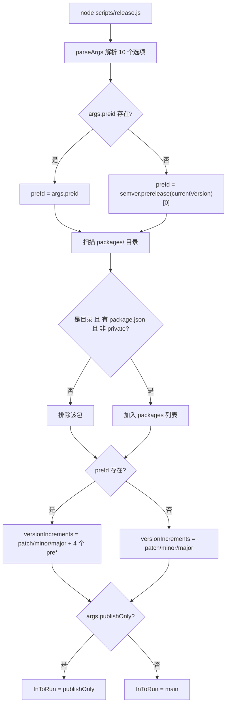
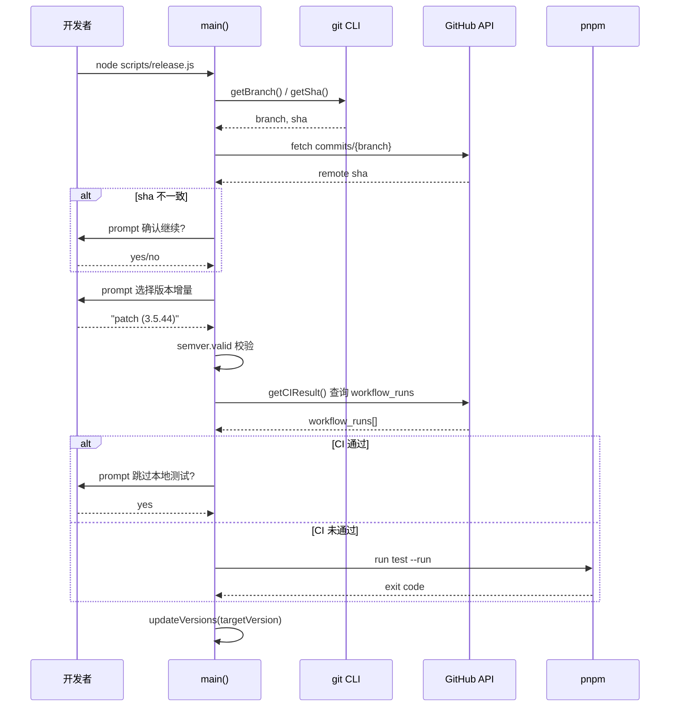
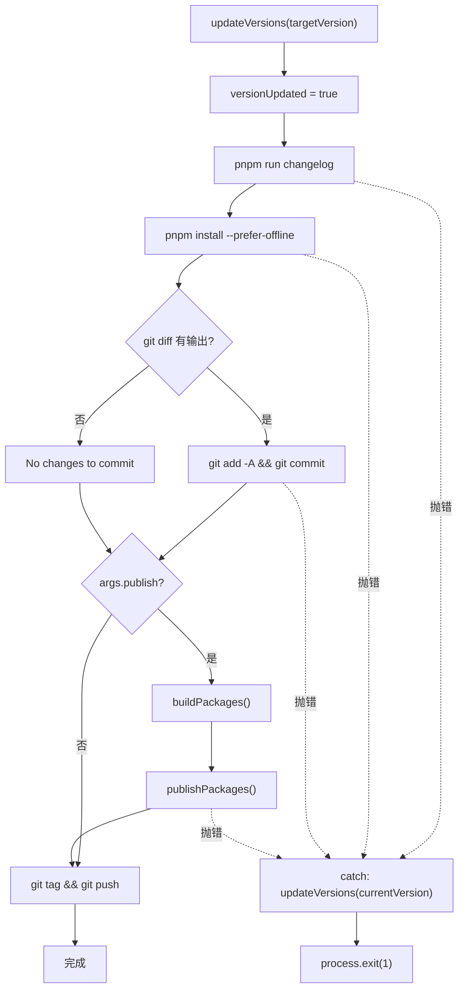

# Chapter 9: Release Automation: release.js's State Machine and Interactive Orchestration

In the previous chapter, with the help of template-explorer, we reverse-engineered compiler behavior and mastered the methodology of using tools to observe internal mechanisms. Now, we shift our attention from compile time to release time - this is the most dangerous moment for every open source project: it simultaneously touches four irreversible external systems: version numbers, build artifacts, Git history, and the npm registry. A mistaken npm publish cannot be undone, and a mistaken tag push will pollute dependency resolution for all downstream users. Vue core uses a 537-line scripts/release.js to tame this danger - it is neither a purely automated script nor a purely manual checklist, but an interactive state machine: stopping to ask a human at key nodes, fully automating predictable nodes, and rolling the version number back to the starting point if any step fails. This chapter will break down the three core mechanisms of this orchestrator: argument parsing and state initialization, interactive version decision-making and CI gating, and release order and failure rollback.

# Argument Parsing and Global State Initialization

## Intuitive model

Think of`release.js`as the control panel of an old-fashioned washing machine: the knob (`parseArgs`) determines which mode to use, the indicator lights (global variables) record which stage is currently active, and the "cancel" button (error handling) must be able to restore the machine to the state before water intake. Without this initialization logic, the script would lose control over the question "what version does the user actually want to release" - either releasing the wrong version number, or getting stuck in CI waiting for a keyboard input that will never come.

## Memory layout of flags and global state

> **[Design Inference & Architectural Trade-offs]**
> The first thing the script does after startup is parse the command-line arguments into a structured object. This uses Node's built-in`parseArgs`, rather than`yargs`or`commander`— this is to eliminate third-party dependencies, because the release script itself must be able to run in any environment, even if`node_modules`is half-installed.

[FACT:scripts/release.js:27-62]defines 10 options, which can be divided into four categories:

- **Version semantics category**：`preid`(prerelease identifier, such as`alpha`/`beta`/`rc`）、`tag`（npm dist-tag）
- **Skip category**：`skipBuild`、`skipTests`、`skipGit`、`skipPrompts`— these four boolean switches form the adjustment knobs for the "degree of automation"
- **Execution mode category**：`dry`(dry run),`publish`(whether to publish directly locally),`publishOnly`(publish only without updating the version)
- **Target category**：`registry`(custom registry address)

Note that`publish`'s default value is`false` [FACT:scripts/release.js:51-54], while the other boolean items have no default value (i.e.,`undefined`). This asymmetry is intentional:`publish`'s semantics are "whether to execute npm publish locally"; by default it does not publish, leaving the publish action to GitHub Actions; while`skipXxx`defaults to`undefined`meaning "unspecified", and subsequent logic will distinguish between "the user explicitly passed`--skipTests`" and "the user did not pass it".

After parsing is complete, the script flattens the arguments onto a set of module-level variables[FACT:scripts/release.js:64-66]：

```js
const preId = args.preid || semver.prerelease(currentVersion)?.[0]
const isDryRun = args.dry
let skipTests = args.skipTests
const skipBuild = args.skipBuild
const skipPrompts = args.skipPrompts
const skipGit = args.skipGit
```

There are two design points worth pondering here. First,`preId`'s value priority is "explicit command-line specification > inferred from the current version number"[FACT:scripts/release.js:64-66]. If the current`package.json`version is`3.5.0-beta.1`, then`semver.prerelease`will return`['beta', 1]`, and taking`[0]`yields`'beta'`. This means that when continuously releasing on the beta branch, there is no need to type`--preid beta`every time. Second,`skipTests`is declared with`let`while the others use`const` [FACT:scripts/release.js:64-66], because it will be dynamically overwritten in`runTestsIfNeeded`by the CI result — this is a "deferred decision" state bit.

Next is the package discovery logic[FACT:scripts/release.js:68-83]: read the`packages/`directory, filter out non-directory entries, entries without`package.json`, and packages with`private: true`. Note that what is read here is`packages/`rather than`packages-private/`— the latter is an internal debugging package and is never published.

## Sorting algorithm for publish order

[FACT:scripts/release.js:85-85]defines a function that looks simple but is crucial:

```js
const sortPackagesForPublishing = (packageNames) => [
  ...packageNames.filter(p => p !== 'vue'),
  ...packageNames.filter(p => p === 'vue'),
]
```

It places`vue`, the entry package, last. The comment[FACT:scripts/release.js:85-85]explains the reason: if`vue`is published first, users can install the new version of`@vue/runtime-core`before internal packages such as`vue`are online, and npm will error because it cannot find matching internal dependencies. This is a compromise for "publish atomicity" in the npm ecosystem — npm has no cross-package transactions, so order is the only way to approximate atomicity.

## Dynamic construction of the version increment candidate set

[FACT:scripts/release.js:111-116]constructs the candidates for the interactive menu:

```js
const versionIncrements = [
  'patch', 'minor', 'major',
  ...(preId ? ['prepatch', 'preminor', 'premajor', 'prerelease'] : []),
]
```

This is a conditional spread: only when`preId`exists (i.e., currently in the prerelease channel, or the user explicitly specified`--preid`) are the prerelease-related increment types added to the menu. If the current version is stable`3.5.43`and`preid`is not specified, the menu only has`patch/minor/major`three items — avoiding the user mistakenly turning a stable version into a half-baked prerelease version like`3.5.44-0`. Function

`inc`[FACT:scripts/release.js:120-120]wraps`semver.inc`, passing`preId`as the third argument. There is a type guard here:`typeof preId === 'string' ? preId : undefined`— because`preId`may be`string | undefined`, while`semver.inc`expects`string | undefined`, this ternary expression is to satisfy TS type narrowing.

## Execution primitives: the dual-track system of run and dryRun

[FACT:scripts/release.js:122-123]is one of the most ingenious designs in this chapter:

```js
const run = async (bin, args, opts = {}) =>
  exec(bin, args, { stdio: 'inherit', ...opts })
const dryRun = async (bin, args, opts = {}) =>
  console.log(pico.blue(`[dryrun] ${bin} ${args.join(' ')}`), opts)
const runIfNotDry = isDryRun ? dryRun : run
```

`run`sets the subprocess's stdio to`inherit`, allowing the build/test output to pass through directly to the terminal — this is crucial for long-running builds, as users can see real-time progress.`dryRun`only prints the command without executing it.`runIfNotDry`is a "strategy selection": at module load time, the function pointer is bound to`dryRun`or`run`, and all subsequent call sites no longer need to check`isDryRun`。

> **[Design Inference & Architectural Trade-offs]**
> This pattern of "deciding the strategy at initialization" is less error-prone than "checking at every call site": if some call site forgets to check`isDryRun`, then in dry run mode it will actually execute side effects. But`runIfNotDry`centralizes the check in one place, eliminating the possibility of such omissions.



---

# Interactive version decision and CI gate

## Intuitive model

This stage is like airport security: first verify your boarding pass (whether the local commit is synchronized with the remote), then confirm where you are going (version number), and finally check whether you have passed security (whether CI has passed). If any step fails, the entire process stops. Without this gate, an unpushed local commit could be tagged and published, causing the source code corresponding to the version on npm to not exist at all on GitHub — this is the most difficult release accident to troubleshoot.

## Sync check and version selection

`main`The first thing the`isInSyncWithRemote()` [FACT:scripts/release.js:141-141]function does is[FACT:scripts/release.js:337-363]. The logic of this function`git rev-parse HEAD`is: get the current branch name, request the GitHub API to obtain the latest commit SHA of that branch, and compare it with the local[FACT:scripts/release.js:348-355]. If they do not match, pop up a red warning confirmation box`false`, letting the user decide whether to continue. If the API request fails (network problem, no token), directly return[FACT:scripts/release.js:365-367]。

> **[Design Inference & Architectural Trade-offs]**
> [Design Inference and Architectural Trade-offs]

The design philosophy here is "fail means abort": when there is a network anomaly, it is better not to publish than to risk continuing in an unknown state. Because publishing is irreversible, while rerunning the script is very cheap.`node scripts/release.js 3.6.0`），`targetVersion`Determining the version number follows two paths. If the user passed a positional argument on the command line (such as[FACT:scripts/release.js:141-141]directly take that value[FACT:scripts/release.js:152-176]. Otherwise, enter the interactive menu`custom`: first let the user choose the increment type; if

is chosen, then pop up another input box for the user to manually enter the version number.[FACT:scripts/release.js:174]Note this line

```js
targetVersion = release.match(/\((.*)\)/)?.[1] ?? ''
```

The menu item format is`patch (3.5.44)`, and this regex extracts the actual version number from the parentheses. If the user chose`custom`, a different branch is taken[FACT:scripts/release.js:164-172]。

Then there is a "second parse" logic[FACT:scripts/release.js:178-182]: if`targetVersion`happens to be`patch`/`minor`For such incremental keywords (the user might directly pass`node release.js minor`), it calls`inc`to convert it into a concrete version number. Finally, it uses`semver.valid`to validate[FACT:scripts/release.js:184-186], and throws an error directly for illegal version numbers.

## CI gate: the three-state logic of runTestsIfNeeded

This is the most complex control flow in the entire chapter.[FACT:scripts/release.js:281-317]'s`runTestsIfNeeded`is actually a three-state decision machine:

**State one: the user explicitly passed`--skipTests`**。`skipTests`is initially`true`, directly skips the entire function body, and prints "Tests skipped."[FACT:scripts/release.js:314-316]。

**State two: not skipped, and CI has passed**. The script calls`getCIResult()` [FACT:scripts/release.js:319-335], which requests the GitHub Actions API and checks whether there exists a workflow run named`ci`with`conclusion === 'success'`[FACT:scripts/release.js:319-335]. If it has passed, it asks the user, "CI has passed, skip local tests?"[FACT:scripts/release.js:288-295]. If the user has enabled`--skipPrompts`, then local tests are automatically skipped[FACT:scripts/release.js:296-298]。

**State three: not skipped, and CI has not passed**. If`--skipPrompts`is enabled, directly throw an error[FACT:scripts/release.js:299-304]：

```js
throw new Error(
  'CI for the latest commit has not passed yet. ' +
    'Only run the release workflow after the CI has passed.',
)
```

If`--skipPrompts`is not enabled, then`skipTests`remains`undefined`, and it falls through to the final local test branch[FACT:scripts/release.js:307-313], executing`pnpm run test --run`。

There is a subtle detail here[FACT:scripts/release.js:285]：

```js
skipTests ||= isCIPassed
```

`||=`is logical OR assignment: only when`skipTests`is falsy (`undefined`or`false`) is it assigned`isCIPassed`. This means that if the user explicitly passed`--skipTests`（`true`), this line will not change it; if the user did not pass it (`undefined`), then it is set to the CI result. But immediately afterward[FACT:scripts/release.js:287-298]reassigns it again when CI passes—so the actual effect of the`||=`line is only "if CI has not passed, set`skipTests`to`false`", thereby causing the subsequent`if (!skipTests)`branch to execute local tests.

> **[Design Inference & Architectural Trade-offs]**
> This logic goes around in a circle, but the essence is to express: "CI passed -> local tests can be skipped (but ask the user); CI not passed -> local tests must be run (unless the user explicitly requests skipping)." Using`||=`plus later overwriting is compact, but not very readable, and is a typical code smell of "a state flag modified in multiple places."



## Version number writing: the traversal of updateVersions

[FACT:scripts/release.js:377-384]'s`updateVersions`does two things: update the root`package.json`, then traverse all subpackages and call`updatePackage`。`updatePackage` [FACT:scripts/release.js:391-398]to read JSON, rewrite`name`and`version`, and write back with`JSON.stringify(pkg, null, 2) + '\n'`—note the trailing`\n`, which is to keep the file ending with a newline and avoid git diff showing "No newline at end of file."

`getNewPackageName`The default value of the`keepThePackageName` [FACT:scripts/release.js:105]parameter is

---

# , meaning the package name is not changed. This parameter exists to support the scenario of "renaming packages when publishing to a custom registry"—although the current call sites all pass the default value, the interface reserves extensibility.

## Publish order, idempotency, and failure rollback

Intuitive model`updateVersions`This stage is like dominoes:

## pushing over the first tile (changing the version number), and then the subsequent changelog, lockfile, commit, tag, and publish fall in sequence. If one tile gets stuck midway, there must be a mechanism to stand the already fallen tiles back up—otherwise the repository will remain in the half-finished state of "version number changed but not published."

> **[Design Inference & Architectural Trade-offs]**
> `publishPackage` [FACT:scripts/release.js:439-489][Design inference and architectural trade-offs][FACT:scripts/release.js:442-451]is the core of publishing. It first determines the dist-tag`--tag`: prioritize using the`alpha`/`beta`/`rc`parameter, otherwise infer from the`version.includes('alpha')`keyword in the version number. Note that`semver.prerelease`is used here rather than`3.5.0-alpha.1`，`includes`—because the version number may look like

, which is simple enough and will not be misjudged.[FACT:scripts/release.js:453-458]：

```js
if (!isDryRun && (await isPackagePublished(packageName, version))) {
  console.log(pico.yellow(`Skipping already published: ${pkgVersion}`))
  alreadyPublishedPackages.push(pkgVersion)
  return
}
```

`isPackagePublished` [FACT:scripts/release.js:491-513]Copy`npm view <pkg>@<version> version`executes`true`, returns`false`if successful, and returns

if an E404-type error is reported. The significance of this check is that the publish process may be rerun due to network interruption, and already published packages should not be published again on rerun (npm will reject duplicate versions).`npm view`But the check itself may also fail—for example,`isPackagePublished`throws a non-E404 error due to a network timeout. At this point[FACT:scripts/release.js:507-510]will throw the error upward

, causing the entire publish to abort. This is another manifestation of "prefer aborting over taking risks."`pnpm publish`Even if the check passes,`publishPackage`itself may still fail due to a race condition (another CI just published the same version). So[FACT:scripts/release.js:480-488]：

```js
} catch (e) {
  if (e.message?.match(/previously published/)) {
    console.log(pico.red(`Skipping already published: ${pkgVersion}`))
    alreadyPublishedPackages.push(pkgVersion)
  } else {
    throw e
  }
}
```

Copy`previously published`Only when

## is matched is the error swallowed; all other errors are rethrown. This is "precise fault tolerance": downgrade handling is done only for known errors that can be safely ignored.

[FACT:scripts/release.js:412-432]Dynamic assembly of publish flags`pnpm publish`assembles the additional flags for

```js
const additionalPublishFlags = []
if (isDryRun) additionalPublishFlags.push('--dry-run')
if (isDryRun || skipGit || process.env.CI)
  additionalPublishFlags.push('--no-git-checks')
if (process.env.CI && !args.registry)
  additionalPublishFlags.push('--provenance')
```

`--no-git-checks`Copy`pnpm publish`is enabled in three cases: dry run, skip git, or in CI. The reason is that

`--provenance`by default checks whether the workspace is clean, whether the current branch is the release branch, etc., and in CI these checks produce false positives.[FACT:scripts/release.js:425-427]is enabled only in CI and when no custom registry is specified`!args.registry`. Provenance is npm's supply chain security feature, which signs the source information of the build artifact (which commit, which workflow) and attaches it to the package. But custom registries (such as internal private registries) usually do not support provenance, so the

## condition is added.

Failure rollback: the versionUpdated flag`main`Returning to the end of[FACT:scripts/release.js:528-537]：

```js
fnToRun().catch(err => {
  if (versionUpdated) {
    updateVersions(currentVersion)
  }
  console.error(err)
  process.exit(1)
})
```

`versionUpdated`is a module-level boolean, initially`false` [FACT:scripts/release.js:24-27], and is immediately set to`updateVersions`after a successful call to`true` [FACT:scripts/release.js:208]. If any subsequent step (changelog generation, lockfile update, git commit, publish) throws an error, the catch block checks this flag, and if it is`true`, rolls the version number back to`currentVersion`。

> **[Design Inference & Architectural Trade-offs]**
> This rollback is "best-effort": it only rolls back`package.json`the version number in , and does not roll back the changelog file, the lockfile, or the git commit that has already been executed. If the error occurs after the git commit, the repository is left in an intermediate state where "the version number has been rolled back but the commit already exists." This is a deliberate design trade-off—a complete rollback would require`git reset`, and that would destroy other changes the user may have already made. So the script chooses to roll back only the most critical version number and lets the user handle the rest manually.

Note`publishOnly`path[FACT:scripts/release.js:519-526]does not set`versionUpdated`, because its semantics are "publish only, do not change the version"—even if it fails, no rollback is needed. But when`targetVersion`exists, it calls`updateVersions` [FACT:scripts/release.js:519-526], and if it fails at that point, the version number will not be rolled back. This is a potential edge-case issue; see the reflection questions at the end of the chapter.



## Publish order and the special handling of the vue package

`publishPackages` [FACT:scripts/release.js:412-432]iterates over`sortPackagesForPublishing(packages)`the result and calls`publishPackage`one by one. Because the sorting puts`vue`last[FACT:scripts/release.js:85-85], the entire publish sequence ensures that internal packages go live first.

`publishPackage`internally uses`cwd: getPkgRoot(pkgName)` [FACT:scripts/release.js:475]to switch the working directory to the subpackage directory, so that`pnpm publish`publishes the subpackage rather than the root package. The comment[FACT:scripts/release.js:462-463]specifically warns "do not change it to npm publish"—because`pnpm publish`can correctly handle the`workspace:*`dependency protocol and convert it into an actual version number, whereas`npm publish`will preserve`workspace:*`as-is and cause installation to fail.

---

# Design reflections

**Why use`parseArgs`instead of`yargs`？**The publish script is the "last line of defense" and must be executable in any environment. If a third-party CLI library fails to load because its dependency tree is broken, the entire publish process is paralyzed. Node's built-in`parseArgs`is crude in functionality (no subcommand support, no automatic help), but it has zero dependencies and zero risk.

**Why set`publish`by default to`false`？**Because Vue's official release goes through GitHub Actions (see[FACT:scripts/release.js:256-263]the prompt message), and the local script is only responsible for changing the version number, generating the changelog, tagging, and pushing. The actual`npm publish`is executed in CI, so that CI's provenance signing and controlled environment can be leveraged.`--publish`The flag is an escape hatch for maintainers to publish locally in emergencies.

**Why does rollback only roll back the version number?**Because a complete rollback would require understanding "which changes were made by the script and which were made by the user," and that cannot be distinguished at the git level. The script chooses to roll back only what it is most certain it changed—`package.json`the version number—and leaves the rest to the user's judgment.

---

# Chapter summary

`scripts/release.js`uses 537 lines of code to implement an "interactive state machine," whose core design can be summarized in three points:

1. **Parameters are policy**: 10 flags are parsed at module load time and flattened into global variables,`runIfNotDry`binds the policy during initialization to avoid missing checks at call sites.

2. **Gates up front**: synchronous checks, version validation, and CI gates are all completed before any side effects occur, ensuring "all or nothing."

3. **Precise fault tolerance**：`isPackagePublished`precheck +`previously published`error fallback form a double idempotency protection;`versionUpdated`the flag enables minimal rollback.

This mechanism forms an interesting contrast with the Template Explorer from the previous chapter: Template Explorer is "observation"—visualizing the compiler's internal state; release.js is "execution"—making every step of the release process explicit. Both embody the same engineering philosophy:**Turn implicit state into explicit state, and uncontrollable side effects into controllable steps**。

# Chapter reflections and self-test

Q1: If[FACT:scripts/release.js:285]'s`skipTests ||= isCIPassed`is changed to`skipTests = isCIPassed`, what happens when the user explicitly passes`--skipTests`and CI has not passed? Why?

**Reference analysis**: In the original logic, when the user passes`--skipTests`,`skipTests`is initially`true` [FACT:scripts/release.js:64-66]，`||=`and will not change it, so`runTestsIfNeeded`at[FACT:scripts/release.js:282]'s`if (!skipTests)`evaluates to false and jumps directly to[FACT:scripts/release.js:314-316]printing "Tests skipped." If changed to`skipTests = isCIPassed`, then`skipTests`is forcibly set to`false`(CI has not passed), and subsequently[FACT:scripts/release.js:287]'s`if (isCIPassed)`is false, falling through to[FACT:scripts/release.js:299]'s`else if (skipPrompts)`—if`--skipPrompts`is not enabled, then`skipTests`remains`false`, and finally local tests are executed at[FACT:scripts/release.js:307-313]. This violates the user's intent to "explicitly skip tests," and in a CI environment (`--skipPrompts`) it will even directly throw[FACT:scripts/release.js:300-303], causing the release to abort.`||=`exists precisely to respect the user's explicit choice.

Q2: `publishOnly`path[FACT:scripts/release.js:519-526]when`targetVersion`exists calls`updateVersions`, but it does not set`versionUpdated`. If at this point`buildPackages`or`publishPackages`throws, what happens? Is this design reasonable?

**Reference analysis**：`publishOnly`calls`updateVersions(targetVersion)` [FACT:scripts/release.js:519-526]and modifies all`package.json`version numbers, but does not set`versionUpdated = true`. When a subsequent`buildPackages` [FACT:scripts/release.js:519-526]or`publishPackages` [FACT:scripts/release.js:519-526]throws,`fnToRun().catch` [FACT:scripts/release.js:528-537]checks`versionUpdated`as`false`and will not roll back the version number. The result is that the repository remains in a state where "the version number has been changed but the release failed." This design is reasonable under`publishOnly`'s original semantics (publish only, do not change the version)—because`targetVersion`is usually not passed, and`updateVersions`is not executed. But when the user passes`targetVersion`, this path has a rollback vulnerability. The fix is to add[FACT:scripts/release.js:519-526]after`versionUpdated = true`, or have`publishOnly`reuse`main`'s rollback logic.

Q3: `isPackagePublished` [FACT:scripts/release.js:491-513]uses`npm view`to check whether the package has already been published. If a network timeout causes`npm view`to throw a non-E404 error, what happens? Is this behavior safe in a CI rerun scenario?

**Reference analysis**：`isPackagePublished`In the catch block,[FACT:scripts/release.js:507-510]calls`isPackageNotFoundError`to determine the error type. This function[FACT:scripts/release.js:515-515]only matches`/E404|No match found|No matching version|notarget/i`. The message of a network timeout error does not contain these keywords, so`isPackageNotFoundError`returns`false`，`isPackagePublished`and rethrows the error[FACT:scripts/release.js:507-510]. This error propagates upward to`publishPackage` [FACT:scripts/release.js:453], causing the entire release to abort. In CI rerun scenarios, this leads to "the package was clearly published, yet the process aborts due to network jitter"—but this is the safe direction of failure: aborting is better than misjudging "not published" and republishing. Republishing triggers npm's`previously published`error, which is caught by[FACT:scripts/release.js:491-492]as a fallback, but wastes one network round trip. So "network error means abort" is a conservative but correct choice.

---

The next chapter will move into`.github/workflows/`, to see how GitHub Actions takes over the subsequent build and release after release.js pushes the tag, as well as the complete implementation of CI gates.

At this point, we have seen clearly how release.js uses a state machine and interactive orchestration to minimize the risk of irreversible releases. But the release script itself is only the executor; what truly determines when to trigger and under what conditions to allow passage is the higher-level automation gatekeeper. The next chapter will analyze the CI/CD system under the .github/workflows directory: how ci.yml enforces the triple gate of lint/typecheck/test during the PR stage, how release.yml triggers releases when tags are pushed, how size-report.yml and size-data.yml track package size regressions, and how autofix.yml automatically fixes formatting issues. You will understand how Vue uses GitHub Actions to solidify engineering standards into an unavoidable pipeline.
