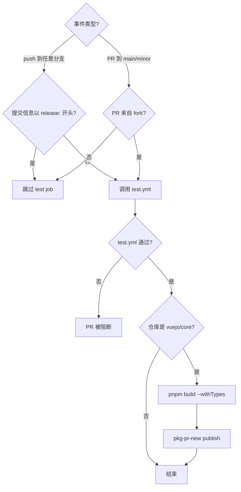
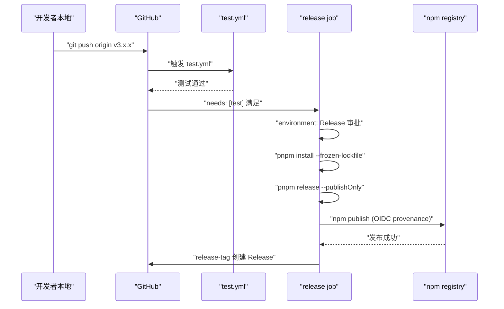
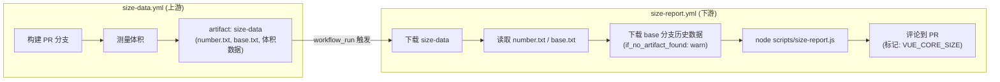

# Chapter 10: CI/CD Workflows: The Automated Gatekeeper from PR to Release

In the previous chapter we saw`scripts/release.js`how to connect each step of a release using an interactive state machine. But that script has a prerequisite: it must be actively invoked by someone or some system. In the Vue core repository, this active invoker is not the maintainer's local terminal, but GitHub Actions. release.js is the executor, workflows are the decision-maker—it determines what events trigger what tasks, under what conditions to allow passage, and under what conditions to block. This chapter focuses on`.github/workflows/`the four files under the directory:`ci.yml`(PR gates and continuous prerelease),`release.yml`(tag-triggered official release),`size-report.yml`(size regression report),`autofix.yml`(automatic formatting fixes). The core of understanding them is not memorizing YAML syntax, but seeing clearly how the Vue team translates engineering standards into unavoidable pipeline constraints.

# 1. ci.yml: Triple Gate and Continuous Prerelease

## Intuitive model

Think of`ci.yml`as an airport security checkpoint. Every PR must pass through this gate: lint checks whether your luggage contains prohibited items, typecheck confirms that your credentials are genuine and valid, and test verifies that you are not carrying dangerous goods. But there is more than one security checkpoint—Vue also attaches a "continuous prerelease" channel here, publishing each PR's build artifact directly to pkg-pr-new, allowing contributors to verify their changes in a real npm installation scenario.

Without this gate, any merge could bring formatting errors, type vulnerabilities, or behavioral regressions into the main branch, and the main branch is the source of all subsequent releases.

## Trigger conditions and concurrency control

`ci.yml`The trigger configuration of

[FACT:.github/workflows/ci.yml:2-11]

```yaml
on:
  push:
    branches:
      - '**'
    tags:
      - '!**'
  pull_request:
    branches:
      - main
      - minor
```

Copy`push`There are two key designs here. First,`'**'`the event listens to all branches (`tags: ['!**']`), but uses`release.yml`to explicitly exclude all tag pushes. Why exclude tags? Because tag pushes are handled separately by`ci.yml`. If`pull_request`also responds to tags, it will cause the release process and the CI process to be triggered repeatedly, wasting runner resources and even creating race conditions. Second,`main`only listens to`minor`and`main`two branches—this is Vue's dual-branch strategy:`minor`carries the stable version,

[FACT:.github/workflows/ci.yml:22-22]

```yaml
concurrency:
  group: ${{ github.workflow }}-${{ github.event.pull_request.number || github.ref }}
  cancel-in-progress: ${{ github.event_name == 'pull_request' }}
```

Copy`group`Concurrency control is the most ingenious touch here.`github.event.pull_request.number || github.ref`The expression uses`cancel-in-progress`as a fallback: PR events use the PR number as the grouping key, and push events use the ref (branch name) as the grouping key. This means that multiple pushes to the same PR will fall into the same concurrency group. And`true`is

> **[Design Inference & Architectural Trade-offs]**
> [Design inference and architectural trade-offs]

## The motivation for this design is clear: during the PR stage, developers push frequently, and the CI results of old commits are already meaningless; canceling them saves a large amount of runner time. But pushes to the main branch cannot be canceled—because every push on main may be the last verification before release, and cancellation would create a verification gap.

[FACT:.github/workflows/ci.yml:22-22]

```yaml
jobs:
  test:
    if: ${{ ! startsWith(github.event.head_commit.message, 'release:') && (github.event_name == 'push' || github.event.pull_request.head.repo.full_name != github.repository) }}
    uses: ./.github/workflows/test.yml
```

Copy`if`This`&&`condition contains two branches of logical AND (

), and each is worth expanding.`! startsWith(github.event.head_commit.message, 'release:')`The first condition`release:`At the beginning, skip tests. This is exactly the commit message format pushed by release.js in the previous chapter—release.js has already run the full test suite locally, so CI does not need to re-verify. This is a "trust upstream" optimization.

> **[Design Inference & Architectural Trade-offs]**
> The second condition`(github.event_name == 'push' || github.event.pull_request.head.repo.full_name != github.repository)`: push events always run tests; PR events require the PR to come from a fork (`head.repo.full_name != github.repository`). Why only run for fork PRs? Because PRs from branches in the same repository are usually created by core team members, and their branch pushes have already triggered the push event CI. Fork PRs do not trigger push events (a fork's push does not notify the upstream repository), so they must be covered by the PR event.

Note`uses: ./.github/workflows/test.yml`—this is a reusable workflow call.`test.yml`It is an independent workflow file, shared by`ci.yml`and`release.yml`. This reuse avoids duplicating the lint/typecheck/test steps across multiple workflows.

## Continuous prerelease: the role of pkg-pr-new

[FACT:.github/workflows/ci.yml:25-51]

```yaml
continuous-release:
  if: github.repository == 'vuejs/core'
  runs-on: ubuntu-latest
  steps:
    - name: Checkout
      uses: actions/checkout@3d3c42e5aac5ba805825da76410c181273ba90b1 # v7.0.1
      with:
        persist-credentials: false
    # ... 安装 pnpm、Node.js、依赖 ...
    - name: Build
      run: pnpm build --withTypes
    - name: Release
      run: pnpx pkg-pr-new publish --compact --pnpm './packages/*' --packageManager=pnpm,npm,yarn
```

`continuous-release`The job only runs in the`vuejs/core`main repository (`if: github.repository == 'vuejs/core'`), and does not execute on forks. It does three things: build (`pnpm build --withTypes`, with type declarations), then use`pkg-pr-new`to publish all packages under`./packages/*`to a temporary npm registry.

> **[Design Inference & Architectural Trade-offs]**
> The value of this mechanism is that contributors can directly`npm install`this PR's build artifact in their own projects to verify whether the change actually solves the problem. This is more convincing than "seeing CI turn green" because it verifies a real package consumption scenario.

Note that all actions are pinned to commit SHAs (such as`actions/checkout@3d3c42e5...`), rather than using a floating tag like`@v4`. This is a hard requirement for supply chain security—preventing malicious code from automatically flowing in after an action repository is compromised.

## ci.yml control flow diagram



---

# 2. release.yml: release orchestration after tag push

## Intuitive model

If`ci.yml`is the security checkpoint,`release.yml`is the launch pad. After release.js completes the version number update, commit, tag, and push locally, the tag push event ignites the engine of`release.yml`. It first runs the full test suite again (to reconfirm), then executes`Release`in the protected`pnpm release --publishOnly`environment, and finally creates a GitHub Release.

Without it, the tag pushed by release.js would just be a Git reference; there would be no new version on npm, and no Release page on GitHub.

## Trigger condition: only tags

[FACT:.github/workflows/release.yml:3-6]

```yaml
on:
  push:
    tags:
      - 'v*' # Push events to matching v*, i.e. v1.0, v20.15.10
```

It only listens for tag pushes in the`v*`format. This complements`ci.yml`'s`tags: ['!**']`—the two are strictly mutually exclusive and will not trigger at the same time.

## Guard conditions for the release job

[FACT:.github/workflows/release.yml:8-21]

```yaml
jobs:
  test:
    uses: ./.github/workflows/test.yml

  release:
    if: github.repository == 'vuejs/core'
    needs: [test]
    runs-on: ubuntu-latest
    permissions:
      contents: write
      id-token: write
    environment: Release
```

There are three layers of guards here, and none of them can be omitted.

First layer`if: github.repository == 'vuejs/core'`: prevents accidental release triggers on forks. If someone forks the repository and pushes a`v1.0.0`tag, this condition will prevent the release process from running.

Second layer`needs: [test]`: the release job depends on the test job. The test job calls`test.yml`; if the tests fail, the release job will not start at all. This is the hard constraint that "tests must pass before release."

> **[Design Inference & Architectural Trade-offs]**
> Third layer`environment: Release`: this is a GitHub Environment, which can be configured with deployment protection rules (such as requiring approval from specific people). This means that even if a tag push triggers the workflow, the release step may still require manual approval before execution—this is the last line of defense for an irreversible operation.

In terms of permissions,`contents: write`is used to create a GitHub Release,`id-token: write`is used for npm provenance authentication (OIDC token). Note that there is no`packages: write`here, because Vue publishes to npm rather than GitHub Packages.

## The complete chain of the release step

[FACT:.github/workflows/release.yml:37-46]

```yaml
- name: Install deps
  run: pnpm install --frozen-lockfile

- name: Update npm
  run: npm i -g npm@latest

- name: Build and publish
  id: publish
  run: |
    pnpm release --publishOnly
```

> **[Design Inference & Architectural Trade-offs]**
> Each of the three steps has its own purpose.`--frozen-lockfile`ensures that the CI environment installs strictly according to the lockfile, so dependency version drift will not cause the build artifact to differ from local.`npm i -g npm@latest`is to obtain the latest npm CLI—because provenance and OIDC authentication depend on a newer version of npm, and older versions may not support these features.

`pnpm release --publishOnly`is the entry point of release.js from the previous chapter.`--publishOnly`The flag tells release.js: skip interactive version selection, skip Git commit and tagging (because the tag already exists), and only perform the build and npm publish.

## Create GitHub Release

[FACT:.github/workflows/release.yml:48-57]

```yaml
- name: Create GitHub release
  id: release_tag
  uses: yyx990803/release-tag@8cccf7c5aa332d71d222df46677f70f77a8d2dc0 # v1.0.0
  env:
    GITHUB_TOKEN: ${{ secrets.GITHUB_TOKEN }}
  with:
    tag_name: ${{ github.ref }}
    body: |
      For stable releases, please refer to [CHANGELOG.md](...) for details.
      For pre-releases, please refer to [CHANGELOG.md](...) of the `minor` branch.
```

> **[Design Inference & Architectural Trade-offs]**
> Here it uses`release-tag` action。`tag_name: ${{ github.ref }}`maintained by Vue author Evan You himself, directly using the ref of the triggering event (i.e.`refs/tags/v3.x.x`). The Release body does not write specific change content, but instead points to CHANGELOG.md — because Vue's changelog is automatically generated by conventional-changelog, and manually maintaining the Release body would create inconsistencies with the changelog.

## release.yml sequence diagram



---

# Three, size-report.yml and autofix.yml: size tracking and format self-healing

## size-report.yml: cross-workflow size regression report

`size-report.yml`The trigger method is very special — it is not directly triggered by push or PR, but by the completion event of another workflow.

[FACT:.github/workflows/size-report.yml:3-7]

```yaml
on:
  workflow_run:
    workflows: ['size data']
    types:
      - completed
```

`workflow_run`The event listener is named`size data`The workflow completes. This is a two-stage design:`size-data.yml`(Source code not provided in this chapter) is responsible for building and measuring size on the PR, and uploading the results as an artifact;`size-report.yml`After`size data`After completion, download the artifact, generate a report, and comment on the PR.

[FACT:.github/workflows/size-report.yml:20-23]

```yaml
if: >
  github.repository == 'vuejs/core' &&
  github.event.workflow_run.event == 'pull_request' &&
  github.event.workflow_run.conclusion == 'success'
```

Triple guard: main repository, PR event, upstream workflow success. If`size data`If it fails, the report job will not run — because there is no data to report.

The data flow process is as follows:

[FACT:.github/workflows/size-report.yml:41-46]

```yaml
- name: Download Size Data
  uses: dawidd6/action-download-artifact@d63b86af1b34672e53c440b1b83979861906bad7 # v24
  with:
    name: size-data
    run_id: ${{ github.event.workflow_run.id }}
    path: temp/size
```

Download from the upstream workflow run`size-data`artifact to`temp/size`. Then read the PR number and base branch in parallel:

[FACT:.github/workflows/size-report.yml:48-59]

```yaml
- parallel:
    - name: Read PR Number
      id: pr-number
      uses: juliangruber/read-file-action@271ff311a4947af354c6abcd696a306553b9ec18 # v1.1.8
      with:
        path: temp/size/number.txt
    - name: Read base branch
      id: pr-base
      uses: juliangruber/read-file-action@271ff311a4947af354c6abcd696a306553b9ec18 # v1.1.8
      with:
        path: temp/size/base.txt
```

`parallel`It is GitHub Actions syntactic sugar that allows two independent steps to execute simultaneously.`number.txt`and`base.txt`Is`size-data.yml`The metadata file written during measurement.

Then download the historical size data of the base branch for comparison:

[FACT:.github/workflows/size-report.yml:61-69]

```yaml
- name: Download Previous Size Data
  uses: dawidd6/action-download-artifact@d63b86af1b34672e53c440b1b83979861906bad7 # v24
  with:
    branch: ${{ steps.pr-base.outputs.content }}
    workflow: size-data.yml
    event: push
    name: size-data
    path: temp/size-prev
    if_no_artifact_found: warn
```

Note`if_no_artifact_found: warn`— If the base branch does not yet have historical data (such as a new branch), it will not fail, only warn. This ensures that the report can still be generated on the first run, just without a comparison baseline.

Finally, generate the report and comment:

[FACT:.github/workflows/size-report.yml:71-89]

```yaml
- name: Prepare report
  run: node scripts/size-report.js > size-report.md

- name: Read Size Report
  id: size-report
  uses: juliangruber/read-file-action@271ff311a4947af354c6abcd696a306553b9ec18 # v1.1.8
  with:
    path: ./size-report.md

- name: Create Comment
  uses: actions-cool/maintain-one-comment-backup@fbbc22ad1809c1bcf46f19b58397b6254773588c # backup for v3.0.0
  with:
    token: ${{ secrets.GITHUB_TOKEN }}
    number: ${{ steps.pr-number.outputs.content }}
    body: |
      ${{ steps.size-report.outputs.content }}
      
    body-include: ''
```

`scripts/size-report.js`Read`temp/size`and`temp/size-prev`Generate a Markdown report from the data under.`maintain-one-comment-backup`The action uses`body-include: '<!-- VUE_CORE_SIZE -->'`As a marker, ensure that only one size report comment is kept on the same PR (update rather than append). Note the comment at L81 explains that the original action repository was blocked by GitHub, so a backup repository was used and the commit was pinned.

## autofix.yml: automatic repair of formatting issues

`autofix.yml`Solves a very practical problem: the code format submitted by contributors does not conform to prettier/eslint standards, CI reports an error, and contributors need to manually run`pnpm lint --fix`Then submit. This workflow automates this step.

[FACT:.github/workflows/autofix.yml:3-8]

```yaml
on:
  pull_request:

concurrency:
  group: ${{ github.workflow }}-${{ github.event.pull_request.number }}
  cancel-in-progress: ${{ github.event_name == 'pull_request' }}
```

Trigger all PRs, concurrency control is similar to`ci.yml`Similar — a new push to the same PR cancels the old autofix run.

[FACT:.github/workflows/autofix.yml:35-41]

```yaml
- name: Run eslint
  run: pnpm run lint --fix

- name: Run prettier
  run: pnpm run format

- uses: autofix-ci/action@7a166d7532b277f34e16238930461bf77f9d7ed8
```

First run eslint's`--fix`, then run prettier formatting, and finally`autofix-ci/action`Commit the modified files directly back to the PR branch. Note`pnpm run format`It is itself a formatting command (no need for`--fix`Flag, because the format script internally is`prettier --write`）。

> **[Design Inference & Architectural Trade-offs]**
> The key to this mechanism is`autofix-ci/action`It will commit fixes as the PR author, not as a bot. This way contributors do not need extra operations, and format fixes automatically appear in their PR. But this also means that if the contributor's branch has protection rules (bot pushes not allowed), autofix will fail — this is an edge case that contributors need to handle manually.

## size-report data flow diagram



---

# Design thinking: solidify standards into the pipeline

Looking back at these four workflows, several design principles can be seen throughout.

**First, least privilege.** `ci.yml`and`autofix.yml`Both declare`permissions: contents: read`, only`release.yml`Needs`contents: write`and`id-token: write`。`size-report.yml`Needs`pull-requests: write`and`issues: write`To post comments. Each workflow only gets the permissions it truly needs.

**Second, supply chain security.**All third-party actions are pinned to commit SHA, not floating tags.`size-report.yml`The comment at L81 directly states that after the original action repository was blocked, it switched to a backup repository and pinned the commit — this is real-world defense against supply chain attacks.

**Third, separation of responsibilities and reuse.** `test.yml`Is used by`ci.yml`and`release.yml`Shared to avoid duplication of test logic.`size-data.yml`and`size-report.yml`Separated, allowing measurement and reporting to evolve independently.

**Fourth, the choice of failure direction.** `size-report.yml`of`if_no_artifact_found: warn`Choose "warn rather than fail" because missing historical data should not block the PR. And`release.yml`of`needs: [test]`Choose "test failure blocks release" because release is an irreversible operation.

**Fifth, differentiation of concurrency control.**PR events cancel old runs (`cancel-in-progress: true`), push events do not cancel (`cancel-in-progress: false`). This difference reflects the semantics of the two events: old commits in a PR are meaningless, while every commit in a push may be the final state.

---

# Chapter summary

This chapter analyzed the four core workflows of the Vue core repository:

- **`ci.yml`**: PR gate + continuous prerelease. Through`if`Conditions distinguish push/PR and fork/same repository, use`concurrency`Cancel outdated PR runs, use`pkg-pr-new`Publish installable prerelease packages.
- **`release.yml`**: Official release triggered by tag. Three layers of guards (repository check, needs test, environment approval) ensure that only tags that pass tests and are approved can be published to npm.
- **`size-report.yml`**: Cross-workflow size regression report. Through`workflow_run`event listening for upstream`size data`completion, download the artifact and compare it with the base branch data, then feed it back to the PR as a comment.
- **`autofix.yml`**: Automatic format fixing. Run eslint --fix and prettier on the PR, and through`autofix-ci/action`commit the fixes directly back to the PR branch.

These four workflows together form an "unbypassable pipeline": code style is automatically fixed by autofix, types and tests are enforced by ci.yml, size regression is tracked by size-report, and release is executed by release.yml under multiple guards.

# Chapter Review and Self-Test

Q1: If in`ci.yml`the value of`cancel-in-progress`is changed to always be`true`(that is, removing the`github.event_name == 'pull_request'`condition), in what scenarios would this cause problems?

**Reference Analysis**：`cancel-in-progress`Always being`true`means that when pushing to the main branch, a new push will cancel the old CI that is running. Consider this scenario: two PRs are merged consecutively on the main branch. The CI of the first PR is running (including the full lint/typecheck/test), and the merge of the second PR triggers a new CI run. If`cancel-in-progress`is`true`, the CI of the first PR will be canceled—but the code of the first PR is already on main, and its CI result is crucial for judging the health of the main branch. Canceling it means that a segment of code on the main branch has never been fully verified. And[FACT:.github/workflows/ci.yml:22-22]the condition`github.event_name == 'pull_request'`is precisely to avoid this problem: only PR events cancel old runs, while push events never cancel.

Q2: `release.yml`In`release`the job's`if: github.repository == 'vuejs/core'`and`environment: Release`respectively defend against what scenarios? What happens if one of them is removed?

**Reference Analysis**：`if: github.repository == 'vuejs/core'` [FACT:.github/workflows/release.yml:14]defends against the fork scenario. If someone forks vuejs/core and pushes a`v3.99.0`tag, without this condition, the workflow will run in the fork repository`pnpm release --publishOnly`. Although the fork repository has no npm token and cannot actually publish, it will waste runner resources and may produce misleading failure notifications.`environment: Release` [FACT:.github/workflows/release.yml:21]defends against the risk of "automatic publishing after tag push"—it allows configuring manual approval to ensure that even if a tag is pushed, publishing still requires maintainer confirmation. If the`if`condition is removed, forks will waste resources; if`environment`is removed, anyone with tag push permission can trigger a release, with no final manual confirmation step. The two are defenses at different levels and cannot replace each other.

Q3: `size-report.yml`In`if_no_artifact_found: warn`the choice of`release.yml`and in`needs: [test]`the choice of

**respectively reflect what kind of failure-direction design philosophy? What would happen if these two strategies were swapped?**：`if_no_artifact_found: warn` [FACT:.github/workflows/size-report.yml:69]Reference Analysis`fail`chooses "warn instead of fail when historical data is missing," because the size report is auxiliary information, not a blocking condition. If changed to`needs: [test]` [FACT:.github/workflows/release.yml:15], then a new branch or a PR running for the first time would fail because base data cannot be found, which is obviously unreasonable.

---

chooses "block release when tests fail," because release is an irreversible operation and code quality must be ensured. If swapped—size-report fails when data is missing, and release still publishes when tests fail—the former would cause many false positives that block normal PRs, and the latter would allow untested code to enter npm. This reflects the failure-direction design principle of "lenient for auxiliary information, strict for irreversible operations."`scripts/size-report.js`The next chapter will go deep into the core of the size budget mechanism:`usage-size`how to parse size data, how to calculate increments, how to format output, and

the measurement philosophy of—why Vue chooses to measure "actual usage size" rather than "full package size."`scripts/size-report.js`From PR gating to tag release, the four workflow files together form an unbypassable automated gatekeeping chain. But the pipeline can block merges only if it has quantifiable criteria for judgment. The next chapter will focus on Vue's engineering governance of package size as a core metric:`scripts/usage-size.js`how to calculate the gzipped size of each artifact and compare it with the baseline,
