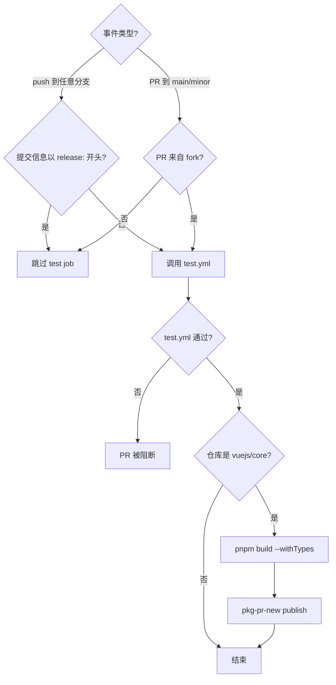
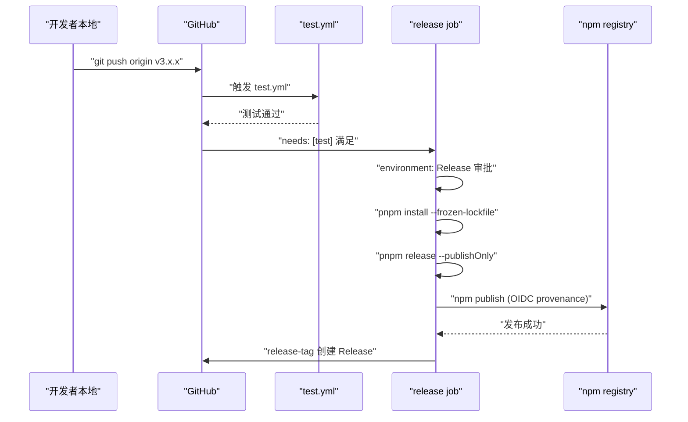
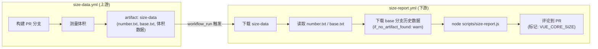

# Chapter 10: SFC Compilation: Block Parsing & Code Splitting in @vue/compiler-sfc


上一章我们看到 `scripts/release.js` 如何用交互式状态机把一次发版的每一步串起来。但那个脚本有一个前提：它必须被某个人或某个系统主动调用。在 Vue core 仓库里，这个主动调用者不是维护者的本地终端，而是 GitHub Actions。release.js 是执行者，workflows 是决策者——它决定什么事件触发什么任务、什么条件下放行、什么条件下阻断。本章聚焦 `.github/workflows/` 目录下的四个文件：`ci.yml`（PR 门禁与持续预发布）、`release.yml`（tag 触发的正式发布）、`size-report.yml`（体积回归报告）、`autofix.yml`（格式自动修复）。理解它们的核心不是记住 YAML 语法，而是看清 Vue 团队如何把工程规范翻译成不可绕过的流水线约束。


## Intuitive Architectural Model

把 `ci.yml` 想象成机场安检口。每个 PR 都要过这道闸：lint 检查你的行李有没有违禁品，typecheck 确认你的证件真实有效，test 验证你没有携带危险品。但安检口不止一个——Vue 还在这里挂了一条「持续预发布」通道，把每个 PR 的构建产物直接发布到 pkg-pr-new，让贡献者能在真实 npm 安装场景下验证自己的改动。

若没有这道闸，任何一次合并都可能把格式错误、类型漏洞或行为回归带进 main 分支，而 main 分支是后续所有 release 的源头。

## 触发条件与并发控制

`ci.yml` 的触发配置值得逐行拆解。

[FACT:.github/workflows/ci.yml:2-11]

```yaml
on:
  push:
    branches:
      - '**'
    tags:
      - '!**'
  pull_request:
    branches:
      - main
      - minor
```

这里有两个关键设计。第一，`push` 事件监听所有分支（`'**'`），但用 `tags: ['!**']` 显式排除所有 tag 推送。为什么要排除 tag？因为 tag 推送由 `release.yml` 单独处理，如果 `ci.yml` 也响应 tag，会导致发布流程和 CI 流程重复触发，浪费 runner 资源甚至产生竞态。第二，`pull_request` 只监听 `main` 和 `minor` 两个分支——这是 Vue 的双分支策略：`main` 承载稳定版，`minor` 承载预发布版。

[FACT:.github/workflows/ci.yml:22-22]

```yaml
concurrency:
  group: ${{ github.workflow }}-${{ github.event.pull_request.number || github.ref }}
  cancel-in-progress: ${{ github.event_name == 'pull_request' }}
```

并发控制是这里最精妙的一笔。`group` 的表达式用 `github.event.pull_request.number || github.ref` 做 fallback：PR 事件用 PR 编号做分组键，push 事件用 ref（分支名）做分组键。这意味着同一个 PR 的多次推送会落在同一个并发组里。而 `cancel-in-progress` 只在 PR 事件时为 `true`——当你连续推送三次提交时，前两次的 CI 会被自动取消，只保留最新一次。

> **〔Design Inference & Architectural Trade-offs〕**
> 这个设计的动机很明确：PR 阶段开发者频繁推送，旧提交的 CI 结果已经无意义，取消它们能节省大量 runner 时间。但 push 到 main 分支时不能取消——因为 main 上的每次 push 都可能是发布前的最后一次验证，取消会导致验证缺口。

## 三重门禁的入口：test job 的条件判断

[FACT:.github/workflows/ci.yml:22-22]

```yaml
jobs:
  test:
    if: ${{ ! startsWith(github.event.head_commit.message, 'release:') && (github.event_name == 'push' || github.event.pull_request.head.repo.full_name != github.repository) }}
    uses: ./.github/workflows/test.yml
```

这个 `if` 条件包含两个逻辑与（`&&`）的分支，每个都值得展开。

第一个条件 `! startsWith(github.event.head_commit.message, 'release:')`：如果提交信息以 `release:` 开头，跳过测试。这正是上一章 release.js 推送的提交信息格式——release.js 在本地已经跑过完整测试，CI 不需要重复验证。这是一个「信任上游」的优化。

> **〔Design Inference & Architectural Trade-offs〕**
> 第二个条件 `(github.event_name == 'push' || github.event.pull_request.head.repo.full_name != github.repository)`：push 事件总是跑测试；PR 事件则要求 PR 来自 fork（`head.repo.full_name != github.repository`）。为什么 fork 的 PR 才跑？ 因为同仓库分支的 PR 通常由核心团队成员创建，他们的分支推送已经触发过 push 事件的 CI。而 fork 的 PR 不会触发 push 事件（fork 的 push 不会通知上游仓库），所以必须在 PR 事件里补跑。

注意 `uses: ./.github/workflows/test.yml`——这是一个 reusable workflow 调用。`test.yml` 是独立的 workflow 文件，被 `ci.yml` 和 `release.yml` 共享。这种复用避免了在多个 workflow 里重复定义 lint/typecheck/test 的步骤。

## 持续预发布：pkg-pr-new 的角色

[FACT:.github/workflows/ci.yml:25-51]

```yaml
continuous-release:
  if: github.repository == 'vuejs/core'
  runs-on: ubuntu-latest
  steps:
    - name: Checkout
      uses: actions/checkout@3d3c42e5aac5ba805825da76410c181273ba90b1 # v7.0.1
      with:
        persist-credentials: false
    # ... 安装 pnpm、Node.js、依赖 ...
    - name: Build
      run: pnpm build --withTypes
    - name: Release
      run: pnpx pkg-pr-new publish --compact --pnpm './packages/*' --packageManager=pnpm,npm,yarn
```

`continuous-release` job 只在 `vuejs/core` 主仓库运行（`if: github.repository == 'vuejs/core'`），fork 上不执行。它做三件事：构建（`pnpm build --withTypes`，带类型声明）、然后用 `pkg-pr-new` 把 `./packages/*` 下的所有包发布到一个临时的 npm registry。

> **〔Design Inference & Architectural Trade-offs〕**
> 这个机制的价值在于：贡献者可以在自己的项目里直接 `npm install` 这个 PR 的构建产物，验证改动是否真的解决了问题。这比「看 CI 绿了」更有说服力，因为它验证的是真实的包消费场景。

注意所有 action 都锁定了 commit SHA（如 `actions/checkout@3d3c42e5...`），而不是用 `@v4` 这样的浮动 tag。这是供应链安全的硬性要求——防止 action 仓库被入侵后恶意代码自动流入。

## ci.yml 控制流图



---


## Intuitive Architectural Model

如果说 `ci.yml` 是安检口，`release.yml` 就是发射台。当 release.js 在本地完成版本号更新、提交、打 tag 并推送后，tag 推送事件点燃了 `release.yml` 的引擎。它先跑一遍完整测试（再次确认），然后在受保护的 `Release` 环境中执行 `pnpm release --publishOnly`，最后创建 GitHub Release。

若没有它，release.js 推送的 tag 就只是一个 Git 引用，npm 上不会有新版本，GitHub 上不会有 Release 页面。

## 触发条件：只认 tag

[FACT:.github/workflows/release.yml:3-6]

```yaml
on:
  push:
    tags:
      - 'v*' # Push events to matching v*, i.e. v1.0, v20.15.10
```

只监听 `v*` 格式的 tag 推送。这与 `ci.yml` 的 `tags: ['!**']` 形成互补——两者严格互斥，不会同时触发。

## 发布 job 的守卫条件

[FACT:.github/workflows/release.yml:8-21]

```yaml
jobs:
  test:
    uses: ./.github/workflows/test.yml

  release:
    if: github.repository == 'vuejs/core'
    needs: [test]
    runs-on: ubuntu-latest
    permissions:
      contents: write
      id-token: write
    environment: Release
```

这里有三层守卫，每一层都不可省略。

第一层 `if: github.repository == 'vuejs/core'`：防止 fork 上误触发发布。如果有人 fork 了仓库并推送了一个 `v1.0.0` tag，这个条件会阻止发布流程运行。

第二层 `needs: [test]`：release job 依赖 test job。test job 调用 `test.yml`，如果测试失败，release job 根本不会启动。这是「发布前必须通过测试」的硬约束。

> **〔Design Inference & Architectural Trade-offs〕**
> 第三层 `environment: Release`：这是一个 GitHub Environment，可以配置部署保护规则（如需要特定人员审批）。 这意味着即使 tag 推送触发了 workflow，发布步骤也可能需要人工审批才能执行——这是对不可逆操作的最后一道防线。

权限方面，`contents: write` 用于创建 GitHub Release，`id-token: write` 用于 npm 的 provenance 认证（OIDC token）。注意这里没有 `packages: write`，因为 Vue 发布到 npm 而非 GitHub Packages。

## 发布步骤的完整链路

[FACT:.github/workflows/release.yml:37-46]

```yaml
- name: Install deps
  run: pnpm install --frozen-lockfile

- name: Update npm
  run: npm i -g npm@latest

- name: Build and publish
  id: publish
  run: |
    pnpm release --publishOnly
```

> **〔Design Inference & Architectural Trade-offs〕**
> 三个步骤各有讲究。`--frozen-lockfile` 确保 CI 环境严格按 lockfile 安装，不会因为依赖版本漂移导致构建产物与本地不一致。`npm i -g npm@latest` 是为了获取最新的 npm CLI—— 因为 provenance 和 OIDC 认证依赖较新版本的 npm，旧版本可能不支持这些特性。

`pnpm release --publishOnly` 是上一章 release.js 的入口。`--publishOnly` 标志告诉 release.js：跳过交互式版本号选择、跳过 Git 提交和打 tag（因为 tag 已经存在），只执行构建和 npm publish。

## 创建 GitHub Release

[FACT:.github/workflows/release.yml:48-57]

```yaml
- name: Create GitHub release
  id: release_tag
  uses: yyx990803/release-tag@8cccf7c5aa332d71d222df46677f70f77a8d2dc0 # v1.0.0
  env:
    GITHUB_TOKEN: ${{ secrets.GITHUB_TOKEN }}
  with:
    tag_name: ${{ github.ref }}
    body: |
      For stable releases, please refer to [CHANGELOG.md](...) for details.
      For pre-releases, please refer to [CHANGELOG.md](...) of the `minor` branch.
```

> **〔Design Inference & Architectural Trade-offs〕**
> 这里用的是 Vue 作者尤雨溪自己维护的 `release-tag` action。`tag_name: ${{ github.ref }}` 直接使用触发事件的 ref（即 `refs/tags/v3.x.x`）。Release body 不写具体变更内容，而是指向 CHANGELOG.md—— 因为 Vue 的 changelog 由 conventional-changelog 自动生成，手动维护 Release body 会与 changelog 产生不一致。

## release.yml 时序图



---


## size-report.yml：跨 workflow 的体积回归报告

`size-report.yml` 的触发方式很特殊——它不是由 push 或 PR 直接触发，而是由另一个 workflow 的完成事件触发。

[FACT:.github/workflows/size-report.yml:3-7]

```yaml
on:
  workflow_run:
    workflows: ['size data']
    types:
      - completed
```

`workflow_run` 事件监听名为 `size data` 的 workflow 完成。这是一个两阶段设计：`size-data.yml`（本章未提供源码）负责在 PR 上构建并测量体积，把结果作为 artifact 上传；`size-report.yml` 在 `size data` 完成后，下载 artifact，生成报告，并评论到 PR 上。

[FACT:.github/workflows/size-report.yml:20-23]

```yaml
if: >
  github.repository == 'vuejs/core' &&
  github.event.workflow_run.event == 'pull_request' &&
  github.event.workflow_run.conclusion == 'success'
```

三重守卫：主仓库、PR 事件、上游 workflow 成功。如果 `size data` 失败了，报告 job 不会运行——因为没有数据可报告。

数据流转过程如下：

[FACT:.github/workflows/size-report.yml:41-46]

```yaml
- name: Download Size Data
  uses: dawidd6/action-download-artifact@d63b86af1b34672e53c440b1b83979861906bad7 # v24
  with:
    name: size-data
    run_id: ${{ github.event.workflow_run.id }}
    path: temp/size
```

从上游 workflow run 下载 `size-data` artifact 到 `temp/size`。然后并行读取 PR 编号和 base 分支：

[FACT:.github/workflows/size-report.yml:48-59]

```yaml
- parallel:
    - name: Read PR Number
      id: pr-number
      uses: juliangruber/read-file-action@271ff311a4947af354c6abcd696a306553b9ec18 # v1.1.8
      with:
        path: temp/size/number.txt
    - name: Read base branch
      id: pr-base
      uses: juliangruber/read-file-action@271ff311a4947af354c6abcd696a306553b9ec18 # v1.1.8
      with:
        path: temp/size/base.txt
```

`parallel` 是 GitHub Actions 的语法糖，让两个无依赖的步骤同时执行。`number.txt` 和 `base.txt` 是 `size-data.yml` 在测量时写入的元数据文件。

接着下载 base 分支的历史体积数据用于对比：

[FACT:.github/workflows/size-report.yml:61-69]

```yaml
- name: Download Previous Size Data
  uses: dawidd6/action-download-artifact@d63b86af1b34672e53c440b1b83979861906bad7 # v24
  with:
    branch: ${{ steps.pr-base.outputs.content }}
    workflow: size-data.yml
    event: push
    name: size-data
    path: temp/size-prev
    if_no_artifact_found: warn
```

注意 `if_no_artifact_found: warn`——如果 base 分支还没有历史数据（比如新分支），不会失败，只是警告。这保证了首次运行时报告仍能生成，只是没有对比基线。

最后生成报告并评论：

[FACT:.github/workflows/size-report.yml:71-89]

```yaml
- name: Prepare report
  run: node scripts/size-report.js > size-report.md

- name: Read Size Report
  id: size-report
  uses: juliangruber/read-file-action@271ff311a4947af354c6abcd696a306553b9ec18 # v1.1.8
  with:
    path: ./size-report.md

- name: Create Comment
  uses: actions-cool/maintain-one-comment-backup@fbbc22ad1809c1bcf46f19b58397b6254773588c # backup for v3.0.0
  with:
    token: ${{ secrets.GITHUB_TOKEN }}
    number: ${{ steps.pr-number.outputs.content }}
    body: |
      ${{ steps.size-report.outputs.content }}
      
    body-include: ''
```

`scripts/size-report.js` 读取 `temp/size` 和 `temp/size-prev` 下的数据，生成 Markdown 报告。`maintain-one-comment-backup` action 用 `body-include: '<!-- VUE_CORE_SIZE -->'` 作为标记，确保同一个 PR 上只保留一条体积报告评论（更新而非追加）。注意 L81 的注释说明原 action 仓库被 GitHub 屏蔽，所以用了备份仓库并锁定 commit。

## autofix.yml：格式问题的自动修复

`autofix.yml` 解决一个很实际的问题：贡献者提交的代码格式不符合 prettier/eslint 规范，CI 报错，贡献者需要手动跑 `pnpm lint --fix` 再提交。这个 workflow 把这一步自动化了。

[FACT:.github/workflows/autofix.yml:3-8]

```yaml
on:
  pull_request:

concurrency:
  group: ${{ github.workflow }}-${{ github.event.pull_request.number }}
  cancel-in-progress: ${{ github.event_name == 'pull_request' }}
```

触发所有 PR，并发控制与 `ci.yml` 类似——同一个 PR 的新推送会取消旧的 autofix 运行。

[FACT:.github/workflows/autofix.yml:35-41]

```yaml
- name: Run eslint
  run: pnpm run lint --fix

- name: Run prettier
  run: pnpm run format

- uses: autofix-ci/action@7a166d7532b277f34e16238930461bf77f9d7ed8
```

先跑 eslint 的 `--fix`，再跑 prettier 格式化，最后 `autofix-ci/action` 把修改后的文件直接提交回 PR 分支。注意 `pnpm run format` 本身就是格式化命令（不需要 `--fix` 标志，因为 format 脚本内部就是 `prettier --write`）。

> **〔Design Inference & Architectural Trade-offs〕**
> 这个机制的关键在于 `autofix-ci/action` 会以 PR 作者的身份提交修复，而不是以 bot 身份。这样贡献者不需要额外操作，格式修复就自动出现在他们的 PR 里。但这也意味着如果贡献者的分支有保护规则（不允许 bot 推送），autofix 会失败——这是需要贡献者手动处理的边界情况。

## size-report 数据流图



---


回顾这四个 workflow，可以看到几条贯穿始终的设计原则。

**第一，权限最小化。** `ci.yml` 和 `autofix.yml` 都声明 `permissions: contents: read`，只有 `release.yml` 需要 `contents: write` 和 `id-token: write`。`size-report.yml` 需要 `pull-requests: write` 和 `issues: write` 来发评论。每个 workflow 只拿它真正需要的权限。

**第二，供应链安全。** 所有第三方 action 都锁定到 commit SHA，而非浮动 tag。`size-report.yml` L81 的注释更是直接说明原 action 仓库被屏蔽后切换到备份仓库并锁定 commit——这是对供应链攻击的实战防御。

**第三，职责分离与复用。** `test.yml` 被 `ci.yml` 和 `release.yml` 共享，避免测试逻辑重复。`size-data.yml` 和 `size-report.yml` 分离，让测量和报告各自独立演进。

**第四，失败方向的选择。** `size-report.yml` 的 `if_no_artifact_found: warn` 选择「警告而非失败」，因为缺少历史数据不应该阻断 PR。而 `release.yml` 的 `needs: [test]` 选择「测试失败即阻断发布」，因为发布是不可逆操作。

**第五，并发控制的差异化。** PR 事件取消旧运行（`cancel-in-progress: true`），push 事件不取消（`cancel-in-progress: false`）。这个差异反映了两种事件的语义：PR 的旧提交已无意义，push 的每次提交都可能是最终状态。

---


本章剖析了 Vue core 仓库的四个核心 workflow：

- **`ci.yml`**：PR 门禁 + 持续预发布。通过 `if` 条件区分 push/PR 和 fork/同仓库，用 `concurrency` 取消过时的 PR 运行，用 `pkg-pr-new` 发布可安装的预发布包。
- **`release.yml`**：tag 触发的正式发布。三层守卫（仓库检查、needs test、environment 审批）确保只有通过测试且经审批的 tag 才能发布到 npm。
- **`size-report.yml`**：跨 workflow 的体积回归报告。通过 `workflow_run` 事件监听上游 `size data` 完成，下载 artifact 并对比 base 分支数据，以评论形式反馈到 PR。
- **`autofix.yml`**：格式自动修复。在 PR 上运行 eslint --fix 和 prettier，通过 `autofix-ci/action` 把修复直接提交回 PR 分支。

这四个 workflow 共同构成了一道「不可绕过的流水线」：代码规范由 autofix 自动修复，类型和测试由 ci.yml 强制检查，体积回归由 size-report 追踪，发布由 release.yml 在多重守卫下执行。


Q1: 如果将 `ci.yml` 中 `cancel-in-progress` 的值改为恒为 `true`（即去掉 `github.event_name == 'pull_request'` 的条件），在什么场景下会导致问题？

**参考解析**：`cancel-in-progress` 恒为 `true` 意味着 push 到 main 分支时，新的 push 会取消正在运行的旧 CI。考虑这个场景：main 分支上连续合并了两个 PR，第一个 PR 的 CI 正在运行（包含完整的 lint/typecheck/test），第二个 PR 的合并触发了新的 CI 运行。如果 `cancel-in-progress` 为 `true`，第一个 PR 的 CI 会被取消——但第一个 PR 的代码已经在 main 上了，它的 CI 结果对于判断 main 分支的健康状态至关重要。取消它意味着 main 分支上有一段代码从未被完整验证过。而 [FACT:.github/workflows/ci.yml:22-22] 的条件 `github.event_name == 'pull_request'` 正是为了避免这个问题：只有 PR 事件才取消旧运行，push 事件永远不取消。

Q2: `release.yml` 中 `release` job 的 `if: github.repository == 'vuejs/core'` 和 `environment: Release` 分别防御什么场景？如果去掉其中一个会怎样？

**参考解析**：`if: github.repository == 'vuejs/core'` [FACT:.github/workflows/release.yml:14] 防御的是 fork 场景。如果有人 fork 了 vuejs/core 并推送一个 `v3.99.0` tag，没有这个条件，workflow 会在 fork 仓库中运行 `pnpm release --publishOnly`。虽然 fork 仓库没有 npm token 无法真正发布，但会浪费 runner 资源并可能产生误导性的失败通知。`environment: Release` [FACT:.github/workflows/release.yml:21] 防御的是「tag 推送后自动发布」的风险——它允许配置人工审批，确保即使 tag 被推送，发布也需要维护者确认。如果去掉 `if` 条件，fork 会浪费资源；如果去掉 `environment`，任何有 tag 推送权限的人都能触发发布，没有最后的人工确认环节。两者是不同层次的防御，不能互相替代。

Q3: `size-report.yml` 中 `if_no_artifact_found: warn` 的选择与 `release.yml` 中 `needs: [test]` 的选择，分别体现了怎样的失败方向设计哲学？如果互换这两个策略会发生什么？

**参考解析**：`if_no_artifact_found: warn` [FACT:.github/workflows/size-report.yml:69] 选择「缺少历史数据时警告而非失败」，因为体积报告是辅助信息，不是阻断条件。如果改为 `fail`，那么新分支或首次运行的 PR 会因为找不到 base 数据而失败，这显然不合理。`needs: [test]` [FACT:.github/workflows/release.yml:15] 选择「测试失败即阻断发布」，因为发布是不可逆操作，必须确保代码质量。如果互换——size-report 在缺少数据时失败，release 在测试失败时仍然发布——前者会导致大量误报阻断正常 PR，后者会导致未经测试的代码进入 npm。这体现了「辅助信息宽松、不可逆操作严格」的失败方向设计原则。

---

下一章将深入体积预算机制的核心：`scripts/size-report.js` 如何解析体积数据、如何计算增量、如何格式化输出，以及 `usage-size` 的度量哲学——为什么 Vue 选择测量「实际使用体积」而非「完整包体积」。

从 PR 门禁到 tag 发布，四个 workflow 文件共同构成了一条不可绕过的自动化守门链。但流水线能阻断合并，前提是它掌握可量化的判断依据。下一章将聚焦 Vue 对包体积这一核心指标的工程化治理：`scripts/size-report.js` 如何计算各产物 gzip 后大小并与基线对比，`scripts/usage-size.js` 如何模拟真实用户引入场景估算实际开销，以及 CI 如何在体积超标时阻断合并。