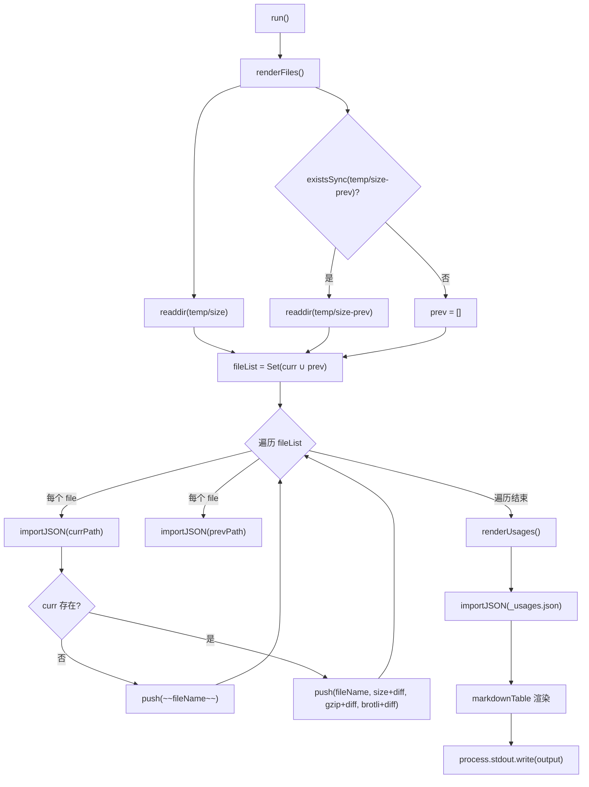
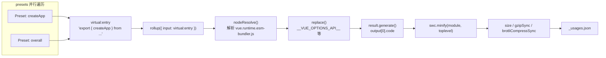

# Next chapter: Chapter 11 →

In the previous chapter, we saw how Vue uses GitHub Actions to solidify lint, type checking, testing, and size tracking into an unavoidable pipeline, where size-report.yml and size-data.yml are responsible for leaving size data after each change. But the pipeline is only responsible for execution; what truly answers "how much bigger did it get, and where did it grow" are the two scripts we will break down in this chapter. The core contradiction of size budgeting lies in this: bundle size is a metric that can only be perceived, not precisely attributed. When users complain that "Vue is too big," maintainers need to answer three questions—how much bigger? Where did it grow? Did this change make it bigger? scripts/size-report.js handles comparison, and scripts/usage-size.js handles attribution; together they form the measurement philosophy of size budgeting.

# 11.1 size-report: Turning size differences into a readable Markdown table

## Intuitive model

Imagine you are a quality inspector at a logistics company. Every package (build artifact) must be weighed before leaving the warehouse, and your job is not the weighing itself, but placing "today's weight" and "yesterday's weight" side by side in a table, using bold`+2.3 kB`to mark which packages got heavier. Without this comparison table, maintainers can only see a pile of isolated numbers and cannot determine whether a PR introduced a size regression.

`size-report.js`is exactly this quality inspector. It does not produce size data (that is the job of`usage-size.js`and the build scripts); it only consumes JSON files from two directories and generates a Markdown report.

## Data structures and directory conventions

The script's core conventions are hidden in two constants. The current data directory is`temp/size`, and the historical baseline directory is`temp/size-prev`。

[FACT:scripts/size-report.js:23-24]

These two directory names are not arbitrary:`temp/size`is generated by the`size-data.yml`workflow on each run and uploaded as an artifact[FACT:.github/workflows/size-data.yml:53-57], while`temp/size-prev`is obtained by`size-report.yml`after pulling the baseline artifact and extracting it. The directory names themselves are the contract of the data flow.

The script defines three type aliases, which precisely describe the structure of the JSON files:

[FACT:scripts/size-report.js:8-21]

`SizeResult`has three numeric fields:`size`(uncompressed),`gzip`、`brotli`。`BundleResult`adds a`file`field on top of that for displaying the file name.`UsageResult`is a`Record`, where the keys are preset names and the values are`SizeResult & { name: string }`—note that there is an extra`name`field here, because the keys of a JSON object are lost after`Object.values`, so the name must be redundantly stored in the value.

## Step-by-Step Walkthrough

The main flow is extremely simple, with only two steps plus one output:

[FACT:scripts/size-report.js:23-38]

`run()`first calls`renderFiles()`to render the artifact file table, then calls`renderUsages()`to render the usage scenario table, and finally writes the string accumulated in the module-level variable`output`to stdout all at once[FACT:scripts/size-report.js:25]. This "accumulate strings and output them all at once" pattern avoids multiple`process.stdout.write`concatenation overheads and also makes the output order fully controllable.

**Step 1: Collect the file list and take the union.**

[FACT:scripts/size-report.js:44-49]

`filterFiles`filters out two types of files: those starting with`_`(such as`_usages.json`) and those ending with`.txt`(such as`number.txt`、`base.txt`). These two types of files are metadata, not size data. Then it takes the union of the file names in the current directory and the historical directory`fileList`—using`Set`for deduplication. Why take the union? Because a file may exist only in the historical directory (this build deleted that artifact), or only in the current directory (this build added an artifact). Both cases need to be reflected in the report.

**Step 2: Compare file by file.**

[FACT:scripts/size-report.js:43-75]

For each file in the union, try to import JSON from the two directories respectively.`importJSON`The implementation of

[FACT:scripts/size-report.js:112-115]

is "return undefined if the file does not exist":`import()`Here dynamic`with: { type: 'json' }`is used together with`fs.readFileSync` + `JSON.parse`import assertions, rather than`import()`. The former is handled by Node's module loader, while the latter requires manual handling of encoding and parsing errors. The cost of choosing`renderFiles`is that it returns a Promise, so the entire

is async.`if (!curr)`The key branch is in`~~fileName~~`: if the current directory does not have this file, it means the artifact has been deleted, so Markdown strikethrough syntax[FACT:scripts/size-report.js:60-61]is used to mark`getDiff`. Otherwise, render a normal row, appending

**after each numeric value.**

[FACT:scripts/size-report.js:124-130]

`getDiff`Step 3: Calculate the difference.`prev === undefined`has three early return points:`diff === 0`returns an empty string when (no baseline, cannot compare);`prettyBytes(diff)`returns an empty string when (no change, do not show noise); otherwise it returns a bold signed difference. Note that`-1.2 kB`also handles negative numbers correctly and will output a form like`sign`, while the`+`。

**variable only adds**

[FACT:scripts/size-report.js:80-103]

`renderUsages`when the number is positive.`renderFiles`Step 4: Render the usage table.`_usages.json`The structural difference between`Object.values(curr)`and`prev?.[usage.name]`is worth noting: it directly imports`name`, because the usage data always exists in this one file.`.filter(usage => !!usage)`After converting the Record into an array, it looks up historical data by name through`map`—this is exactly why the

field is stored redundantly.`markdown-table`This line is actually redundant, because[FACT:scripts/size-report.js:72-74]。

## Finally, the

> **[Design Inference & Architectural Trade-offs]**
> **Copy`import()`Design thinking and pitfalls`readFileSync`？**[Design inference and architectural trade-offs]`import()`Why use

**`filterFiles`instead of`file[0] !== '_'`dynamic**Import assertions for JSON are the standard approach in Node 20+, and they naturally handle JSON loading in an ESM environment. The cost is that they cannot be used in a synchronous context, and each import is cached by the module—but in this one-off script, caching is not a problem.`readdir`The`file[0]`check in`undefined`，`undefined !== '_'`.

**Handling of deleted artifacts.**When an artifact is deleted, the report marks it with strikethrough rather than removing it outright. This is intentional design: maintainers need to see "this file disappeared," not have it silently vanish from the table. If it were simply filtered out, readers would mistakenly assume the artifact never existed.

# 11.2 usage-size: Simulating real user import scenarios

## Intuitive model

`size-report`It tells you "how big the full package is," but that doesn't answer what users actually care about: "If I only use`createApp`, how much code do I actually need to download?" The full package size includes a lot of code you may never use (such as`defineCustomElement`、`Transition`、`KeepAlive`）。`usage-size.js`'s role is to play a "typical user": write a virtual entry file that only imports specific APIs, bundle it with Rollup, and see how big the final output is.

This is like a restaurant not telling you "the total weight of all ingredients in the kitchen is 50 kg," but instead telling you "if you order one Kung Pao Chicken, the ingredients actually used are 300 grams."

## Data structure: Preset array

The script's core data structure is the`presets`array, where each element describes a usage scenario:

[FACT:scripts/usage-size.js:27-55]

`Preset`The type has three fields:`name`(display name),`imports`(list of APIs imported from Vue), optional`replace`(additional compile-time replacements). Five presets cover scenarios from smallest to largest:

- `createApp (CAPI only)`: only imports`createApp`, and replaces`__VUE_OPTIONS_API__`with`'false'`, simulating a pure Composition API user[FACT:scripts/usage-size.js:35-40]
- `createApp`: only imports`createApp`, retaining Options API[FACT:scripts/usage-size.js:35-40]
- `createSSRApp`: SSR scenario[FACT:scripts/usage-size.js:35-40]
- `defineCustomElement`: Web Components scenario[FACT:scripts/usage-size.js:35-40]
- `overall`: imports six core APIs, simulating a "full-featured" user[FACT:scripts/usage-size.js:44-54]

The entry file is fixed as the runtime-only esm-bundler artifact:

[FACT:scripts/usage-size.js:24-28]

Choosing`vue.runtime.esm-bundler.js`instead of the full build`vue.esm-bundler.js`is because the runtime version does not include the template compiler, which is closer to the actual situation of modern build tool users—they use SFC precompiled templates and do not need the runtime compiler.

## Step-by-Step Walkthrough

**Step 1: Generate bundles for all presets in parallel.**

[FACT:scripts/usage-size.js:62-69]

`main()`For each preset, create`generateBundle`promises and execute them in parallel with`Promise.all`. Parallelism is safe here because each`generateBundle`call is independent`rollup()`and they do not share state.

**Step 2: Construct the virtual entry.**

[FACT:scripts/usage-size.js:94-96]

This is the most ingenious part of the entire script. It does not write a temporary file to disk, but instead constructs a virtual module ID`virtual:entry`, whose content is a re-export statement:`export { createApp } from '/absolute/path/to/vue.runtime.esm-bundler.js'`. Note that`entry`is an absolute path, because Rollup needs to be able to resolve it.

**Step 3: Configure the Rollup plugin chain.**

[FACT:scripts/usage-size.js:98-121]

The order of the plugin array is crucial:

1. **Custom`usage-size-plugin`**：`resolveId`intercepts`virtual:entry`returns itself,`load`returns the virtual content[FACT:scripts/usage-size.js:101-110]. This is the standard pattern for Rollup virtual modules.

2. **`nodeResolve()`**: resolves imports inside`vue.runtime.esm-bundler.js`[FACT:scripts/usage-size.js:111]。

3. **`replace`**: injects compile-time constants[FACT:scripts/usage-size.js:112-119]。

`replace`The plugin configuration reveals the core mechanism of the esm-bundler artifact: it preserves runtime flags such as`__VUE_OPTIONS_API__`、`__VUE_PROD_DEVTOOLS__`, which are replaced by the user's build tool. Here the script performs the replacement on the user's behalf:

- `process.env.NODE_ENV` → `"production"`: take the production branch
- `__VUE_PROD_DEVTOOLS__` → `'false'`: disable devtools support
- `__VUE_PROD_HYDRATION_MISMATCH_DETAILS__` → `'false'`: disable detailed hydration errors
- `__VUE_OPTIONS_API__` → `'true'`: retain Options API by default

Then expand`...preset.replace`, allowing presets to override defaults.`createApp (CAPI only)`The preset uses exactly this mechanism to change`__VUE_OPTIONS_API__`to`'false'` [FACT:scripts/usage-size.js:35-40]。

`preventAssignment: true`Prevent replacement`obj.process.env.NODE_ENV = x`assignments like this[FACT:scripts/usage-size.js:117]。

**Step 4: Generate, minify, measure.**

[FACT:scripts/usage-size.js:123-134]

`result.generate({})`produces the code, take`output[0].code`. Then minify with SWC:

[FACT:scripts/usage-size.js:125-130]

`module: true`indicates the input is ESM,`toplevel: true`allows minifying top-level scope variable names. After minification, calculate three metrics respectively:`minified.length`(byte length),`gzipSync(minified).length`、`brotliCompressSync(minified).length`。

Note that this uses`node:zlib`'s synchronous API, not the asynchronous version. In a one-off script, the synchronous API is more concise, and minification itself is a CPU-intensive operation, so asynchrony would not bring parallel gains.

**Step 5: Output and persistence.**

[FACT:scripts/usage-size.js:62-86]

The results are first printed to the console in a human-readable format, using`pico`to color[FACT:scripts/usage-size.js:62-86]. Then write to`temp/size/_usages.json`, using`Object.fromEntries`to convert the array back to a Record, with keys being preset names[FACT:scripts/usage-size.js:81-85]。

`--write`The flag controls whether to additionally write each preset's unminified bundle to disk[FACT:scripts/usage-size.js:136-138], for debugging.

## Design considerations and pitfalls

> **[Design Inference & Architectural Trade-offs]**
> **Why use a virtual module instead of a temporary file?**Temporary files require handling paths, cleanup, and concurrent write conflicts. A virtual module keeps the entry content in memory, and Rollup's`resolveId`/`load`hook naturally supports this pattern. The cost is that the ID must match exactly; any typo will cause Rollup to report "unable to resolve entry."

**`replace`'s`preventAssignment`pitfall.**If`preventAssignment: true`，`replace`is not set, the plugin will also replace assignment statements such as`process.env.NODE_ENV = 'x'`, producing`"production" = 'x'`syntax errors. Vue's source code does contain assignments to`process.env.NODE_ENV`(in test utilities), so this option is necessary.

**`__VUE_OPTIONS_API__`Choice of default value for**The script sets the default value to`'true'` [FACT:scripts/usage-size.js:116], not`'false'`. This is a conservative choice: if the user does not configure it, Vue will retain Options API support.`createApp (CAPI only)`The preset explicitly overrides it to`'false'`, demonstrating the size benefit after disabling it. This comparison itself is documentation for users: telling them "how much you can save by turning off Options API."

**Parallel`Promise.all`failure semantics.**If any preset's bundling fails,`Promise.all`will immediately reject, but other ongoing bundling will not be cancelled (Rollup does not provide a cancellation mechanism). In CI, this means one failure wastes the computation of other presets, but the script itself exits with a non-zero exit code, which CI can correctly capture.

# 11.3 From Data to Gatekeeping: How CI Consumes These Reports

## Data Flow Overview

To understand these two scripts, they must be placed back into the CI pipeline.`size-data.yml`Runs on push to main/minor or on PR`pnpm run size` [FACT:.github/workflows/size-data.yml:45], produces the`temp/size`directory, then uploads it as an artifact[FACT:.github/workflows/size-data.yml:53-57]。

For PRs, it additionally writes two metadata files:

[FACT:.github/workflows/size-data.yml:47-51]

`number.txt`stores the PR number,`base.txt`stores the target branch name. These two files are exactly the`size-report.js`in`filterFiles`that need to be filtered out`.txt`files[FACT:scripts/size-report.js:44-45]. Their existence is to let the downstream`size-report.yml`know "which baseline to compare against."

## Baseline Acquisition and Comparison

`size-report.yml`(detailed in the previous chapter) workflow is: download the current PR's`size-data`artifact, download the target branch's baseline artifact, extract the baseline to`temp/size-prev`, then run`size-report.js`to generate a Markdown report and comment on the PR.

There is a key design constraint here:`size-report.js`itself is not responsible for acquiring the baseline; it assumes`temp/size-prev`already exists. If it does not exist,`existsSync(prevDir)`returns false,`prev`is an empty array[FACT:scripts/size-report.js:48], and all diffs are empty strings. This is graceful degradation: when there is no baseline, the report is still generated, it just does not show differences.

## Size Gatekeeping Decision Logic

> **[Design Inference & Architectural Trade-offs]**
> A common misconception needs to be clarified:`size-report.js`itself does not perform gatekeeping decisions. It only generates reports, does not return an exit code, and does not set thresholds. The actual gatekeeping happens at the`size-report.yml`workflow level—it may include a step that parses the diff values in the report and fails the job if they exceed the threshold.

This "separation of measurement and decision" design has a profound rationale: measurement scripts should remain pure, only responsible for producing facts; decision logic should be at the workflow level, because thresholds may vary by version, branch, and release stage. Hardcoding thresholds into`size-report.js`would make it difficult to reuse.

# Design Reflections

**Why does size budgeting need two sets of measurements?**Full bundle size and usage size answer different questions. Full bundle size is the "upper bound"—it tells you how much users have to download in the worst case. Usage size is the "typical value"—it tells you how much most users actually download. Only by combining both can you get a complete size profile. If there were only full bundle size, maintainers would tend to over-optimize obscure APIs; if there were only usage size, some edge-case size explosions might be overlooked.

**The significance of dual gzip and brotli metrics.**Modern CDNs generally support brotli, but it is not enabled in all scenarios. Reporting both allows maintainers to assess "what the size looks like in environments that only support gzip." Brotli is typically 15-20% smaller than gzip, and this gap itself is valuable information.

**Stability contract of the data format.** `size-report.js`and`usage-size.js`are decoupled through JSON files.`usage-size.js`writes`_usages.json`，`size-report.js`reads it. The field names of this contract (`name`、`size`、`gzip`、`brotli`) are implicit, with no schema validation. If`usage-size.js`changes a field name and forgets to sync`size-report.js`, the report will silently display incorrect data. This is a fragile point in the current design.

# Chapter Summary

# Chapter Reflections and Self-Test

Q1: `size-report.js`'s`filterFiles`filters out files starting with`_`. If`usage-size.js`renames the output file from`_usages.json`to`usages.json`, what happens?

**Reference Analysis**：`filterFiles`'s filter condition is`file[0] !== '_' && !file.endsWith('.txt')` [FACT:scripts/size-report.js:44-45]. If the file is renamed to`usages.json`, it no longer starts with`_`, and will be`filterFiles`retained, entering the`fileList`union. Then`renderFiles`will try to process it as a bundle file:`importJSON`can successfully import it (it is valid JSON), but its structure is`Record<string, UsageResult>`rather than`BundleResult`, so`curr?.file`is`undefined`，`fileName`is an empty string,`curr.size`is also`undefined`，`prettyBytes(undefined)`will throw an error or output anomalies. This will cause report generation to fail. The root cause of this problem is that`filterFiles`uses filename prefixes as the basis for distinguishing "metadata vs data," rather than directory structure or an explicit manifest. A more robust approach would be to place usage data in a subdirectory, or maintain an explicit list of metadata files.

Q2: `usage-size.js`In`Promise.all(tasks)`executes bundling for all presets in parallel. If a preset's`replace`configuration omits`__VUE_OPTIONS_API__`, what happens? Why is the default value set to`'true'`rather than`'false'`？

**Reference Analysis**：`replace`In the plugin configuration,`__VUE_OPTIONS_API__: 'true'`is the default value, then spreading`...preset.replace`allows overriding[FACT:scripts/usage-size.js:116-118]. If a preset omits the configuration, it will use the default value`'true'`, i.e., retaining Options API support, and the size will be larger. Setting the default to`'true'`is a conservative choice: it reflects "the actual behavior when the user does not configure it." In Vue's esm-bundler output,`__VUE_OPTIONS_API__`'s default behavior is to retain the Options API (unless the user explicitly disables it). If the default were set to`'false'`, all presets without explicit configuration would show smaller sizes, misleading users into thinking "you can save size by not configuring it."`createApp (CAPI only)`The preset explicitly sets`'false'` [FACT:scripts/usage-size.js:35-40]precisely to demonstrate "the benefit of explicitly disabling it," contrasting with the default value.

Q3: `size-report.js`'s`importJSON`uses dynamic`import()`rather than`fs.readFileSync`. If a JSON file in the`temp/size-prev`directory is corrupted (invalid JSON), how do the two implementations behave differently?

**Reference Analysis**: dynamic`import()`throws`SyntaxError`when parsing invalid JSON, and this error cannot be caught by`importJSON`'s internal`existsSync`check—`existsSync`Only checks whether the file exists, not whether the content is valid.[FACT:scripts/size-report.js:112-115]. Errors propagate upward to`renderFiles`, causing the entire report generation to fail. If using`fs.readFileSync` + `JSON.parse`, it will also throw an error, but it can be wrapped in a try-catch inside`importJSON`, returning`undefined`to achieve graceful degradation. The current implementation chooses to let errors propagate, with the implicit assumption that "the JSON in the artifact must be valid"—this assumption usually holds in CI environments because the files are generated by`usage-size.js`and build scripts. However, during local debugging, if the JSON file is manually modified and becomes corrupted, the report will crash directly instead of skipping that file. This is a design choice of "trusting the data source."

---

The size budget mechanism solves the problems of "what to measure" and "how to compare," but it relies on a prerequisite: the build artifacts themselves are reproducible. The next chapter will enter the minimal debugging sandbox:`vite-debug`how to start an interactive Vue development environment with minimal configuration, and how it links with local build artifacts to form a closed loop from source code modification to runtime verification.

At this point, the measurement loop of the size budget is clear: size-report.js uses directory comparison to answer "how much bigger," usage-size.js uses virtual modules to simulate real import scenarios to answer "where it's bigger," and the gatekeeping decision is left to the workflow layer. This mechanism turns size regression from vague complaints into traceable data. But data can only tell you that a problem exists; to truly locate and fix it, you still need a minimal environment that can quickly reproduce the problem. The next chapter will enter packages-private/vite-debug to see how Vue uses Vite + SFC to build a minimalist debugging sandbox, turning "minimal reproduction on real source code" into an actionable daily practice.
