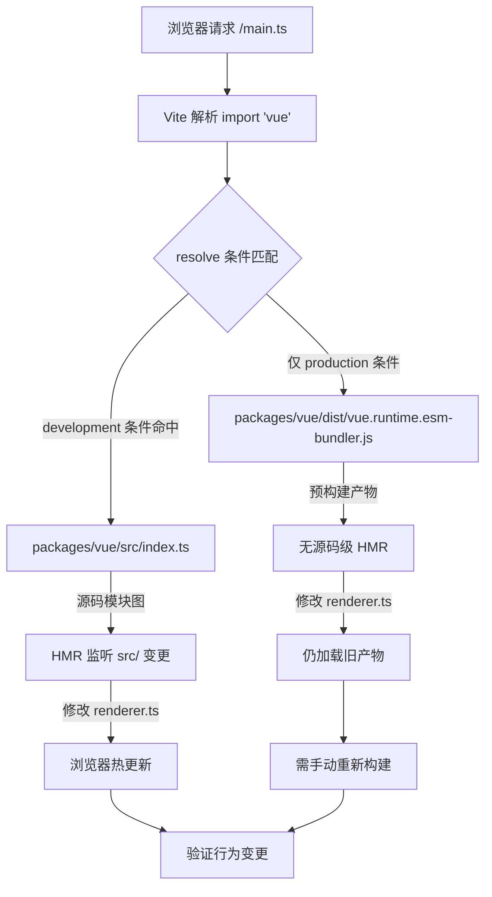

# Chapter 12: Minimal Debugging Sandbox: vite-debug and the Local Development Loop

In the previous chapter, we completed the measurement loop of the size budget: size-report.js answers "how much bigger," usage-size.js answers "where it's bigger," and the workflow layer handles gatekeeping decisions. But this mechanism has an implicit prerequisite—the build artifacts themselves are reproducible. When you find that a certain package's size has abnormally inflated, or that some runtime behavior does not match expectations, you need a minimal environment that can quickly load local source code and immediately see the effect after modification. packages-private/vite-debug is that environment. It has only four files and less than 40 lines of code in total, yet it constitutes the daily practice entry point for "minimal reproduction on real source code" in the Vue core repository. This chapter will break down the construction logic of this sandbox file by file and explain why it is placed under packages-private rather than the packages directory.

# 1. The skeleton of the sandbox:`main.ts`and`App.vue`minimal mounting chain

## Intuitive model

If the entire Vue runtime is compared to an engine, then`vite-debug`is a "bare-metal test bench"—no shell, no dashboard, only the minimal wiring to make the engine run. Its value lies not in functional completeness, but in**eliminating all interfering variables**: when you suspect that a bug is in the reactivity system or inside the renderer, you do not want the complexity of the debugging environment itself to become a source of noise.

## Data structures and file layout

First look at`main.ts`the entire contents of:

[FACT:packages-private/vite-debug/main.ts:4-4]

```ts
import { createApp } from 'vue'
import App from './App.vue'

const app = createApp(App)

app.mount('#app')
```

These six lines of code are the standard paradigm for starting a Vue application, but each line has a precise engineering meaning in the debugging scenario:

- **L1**In`import { createApp } from 'vue'`of`'vue'`, what this module identifier ultimately resolves to is entirely determined by the dependency declarations in`vite.config.ts`and`package.json`. This is the most critical part of the entire sandbox—we will see later how it is pointed to local source code.
- **L2**In`import App from './App.vue'`of`@vitejs/plugin-vue`triggers the SFC compilation pipeline of`App.vue`: Vite registers this plugin when the dev server starts. When the browser requests`<script>`、`<template>`、`<style>`, the plugin splits it into
- **L4**three virtual modules and compiles them separately.`createApp(App)`In`app._context`、`app._instance`of
- **L6**creates the application instance. At this point, Vue internally initializes core fields such as`app.mount('#app')`, but no rendering has been triggered yet.`app`In

of`index.html`is the real startup switch: it looks for the container element with id`index.html`in the DOM, creates the root component instance, and triggers the first render.`<div id="app"></div>`Note that there is no reference to`<script type="module" src="/main.ts"></script>`here—Vite's convention is that`app.mount('#app')`in the project root directory serves as the entry HTML, which contains

## and

. Although this file is not in this chapter's keyFiles, it is the prerequisite for`App.vue`to succeed.

[FACT:packages-private/vite-debug/App.vue:4-8]

```vue

import { ref } from 'vue'

const count = ref(0)

  {{ count }}

button {
  color: red;
}

```

Now look at**, which is the "experimental carrier" of this sandbox:**

**Copy**

`@vitejs/plugin-vue`Put it into a concrete scenario:`App.vue`When the user clicks the button in the browser, what happens?

- `<script setup>`Step 1: SFC compilation phase (when the dev server starts)`setup()`compiles`ref(0)`into three parts:`RefImpl`The block is compiled into the component's`.value`function,`0`。
- `<template>`The call returns a`{{ count }}`object whose`_toDisplayString(count.value)`，`@click="count++"`is initially`onClick: $event => (count.value++)`。
- `<style>`The block is compiled into a render function,`<style>`is converted to

**is converted to`app.mount`The block is compiled into a CSS module and injected into the DOM through**

`createApp(App)`tags.`mount('#app')`, it creates the root component's`ComponentInternalInstance`, executes`setup()`to get`count`'s RefImpl, then calls the render function to generate the VNode tree. Reading`count.value`in the render function triggers`track`to collect dependencies—the currently active render effect (`ReactiveEffect`) is recorded in`count`'s`dep`.

**Step 3: Click event (during user interaction)**

The browser triggers the`click`event, and Vue's event handler executes`count.value++`. This is a setter operation that triggers`trigger`: it iterates over the effects collected in`count.dep`and schedules a re-render. Since it is a synchronous update and not in a batch queue, the render effect is executed immediately, re-invoking the render function to generate a new VNode, which is diffed against the old VNode; it detects that the text content changed from`0`to`1`, and updates the real DOM's`textContent`。

The entire chain can be represented by the following data flow diagram:

```mermaid
flowchart LR
    subgraph compile["编译期 (Vite Dev Server)"]
        sfc["App.vue"] -->|"@vitejs/plugin-vue"| script["setup() 函数"]
        sfc -->|"@vitejs/plugin-vue"| render["渲染函数"]
        sfc -->|"@vitejs/plugin-vue"| style["CSS 模块"]
    end
    subgraph runtime["运行时 (浏览器)"]
        script -->|"ref(0)"| refimpl["RefImpl { value: 0 }"]
        render -->|"读取 count.value"| track["track() 收集依赖"]
        click["用户点击"] -->|"count.value++"| trigger["trigger() 触发更新"]
        trigger -->|"调度渲染副作用"| rerender["重新执行渲染函数"]
        rerender -->|"diff + patch"| dom["更新真实 DOM"]
    end
    track -.->|"dep 记录 ReactiveEffect"| trigger
```

The key to this diagram is:**There are only two coupling points between compile-time artifacts and runtime behavior**——`ref(0)`the RefImpl object returned by , and the read/write of`count.value`in the render function. This means that if you want to debug a certain branch of the reactivity system (for example,`trigger`the scheduling logic in ), you only need to construct the corresponding read/write pattern in this`App.vue`.

## Design consideration: why`ref`instead of`reactive`？

> **[Design Inference & Architectural Trade-offs]**
> Choosing`ref(0)`rather than`reactive({ count: 0 })`as the default example implies a debugging-first consideration:`ref`'s`.value`access path is shorter, and when expanding the`RefImpl`object in the debugger, you can directly see internal fields such as`_value`、`dep`、`__v_isRef`, whereas expanding the Proxy object returned by`reactive`in the console triggers the getter, which may interfere with observing the original state. For the "minimal reproduction" scenario, reducing one layer of Proxy indirection means fewer variables.

---

# 2. Alias resolution:`vite.config.ts`and`package.json`how to point`'vue'`to local source code

## Intuitive model

`vite.config.ts`has only six lines, but it is the "routing hub" of the entire sandbox—it determines whether the`import { createApp } from 'vue'`in`'vue'`ultimately loads the published version on npm or the source code under development in the repository. Without the correct alias configuration, the code you modify in`App.vue`may not trigger the Vue source code you are debugging at all, and debugging becomes "shooting at the wrong target."

## Data structures and resolution chain

First look at`vite.config.ts`：

[FACT:packages-private/vite-debug/vite.config.ts:4-6]

```ts
import { defineConfig } from 'vite'
import vue from '@vitejs/plugin-vue'

export default defineConfig({
  plugins: [vue()],
})
```

Here**there is no explicit`resolve.alias`configuration**. So how is`'vue'`resolved to the local source code? The answer is in`package.json`:

[FACT:packages-private/vite-debug/package.json:1-15]

```json
{
  "name": "vite-debug",
  "private": true,
  "type": "module",
  "scripts": {
    "dev": "vite",
    "build": "vite build",
    "serve": "vite preview"
  },
  "devDependencies": {
    "@vitejs/plugin-vue": "catalog:",
    "vite": "catalog:",
    "vue": "workspace:*"
  }
}
```

The key is**L13**：`"vue": "workspace:*"`. This is the declaration of the pnpm workspace protocol, indicating that`vite-debug`depends on the local package named`vue`in the monorepo, rather than the version on the npm registry. pnpm will create a symlink in`node_modules/vue`, pointing to`packages/vue`(Vue's main package directory).

But this is not enough—`packages/vue`'s`package.json`in`main`/`module`/`exports`the**field usually points to**build artifacts`dist/vue.runtime.esm-bundler.js`(such as`src/`), rather than the source code under`packages/runtime-core/src/renderer.ts`. If you modify`dist`but do not rebuild, Vite will still load the old

> **[Design Inference & Architectural Trade-offs]**
> [Design inference and architectural trade-offs]`packages/vue/package.json`This is why Vue core repository's`"development"`usually configures`resolve.conditions`conditional exports or similar source entry mappings—in dev mode, Vite's`development`will preferentially match the`src/index.ts`condition, thereby loading`dist`instead of`vite-debug`. This mechanism allows

## to see the effect immediately through HMR after modifying the source code without explicitly configuring an alias.`import 'vue'`Scenario-driven Walkthrough: a resolution process of

Put yourself in the scenario:**When the Vite dev server receives the browser's request for`main.ts`and encounters`import { createApp } from 'vue'`, what is the resolution chain?**



This flowchart reveals a key branch:**If the`development`condition is not configured correctly, the browser will not hot-update after modifying the source code**, and you will fall into the confusion of "I changed the code but the behavior did not change." The troubleshooting method is to check the actual loading path of the`vue`module in the Network panel of the browser DevTools—if you see the`dist/`path, it means the source entry mapping is not in effect.

## Design consideration: why not explicitly write an alias in`vite.config.ts`?

> **[Design Inference & Architectural Trade-offs]**
> A natural question is: why not directly write`vite.config.ts`in`resolve: { alias: { vue: '../../packages/vue/src/index.ts' } }`? Although this is intuitive, it has two problems:

1. **Breaking subpath imports**: Vue's public API includes subpaths such as`vue/server-renderer`、`vue/compiler-sfc`. If only`'vue'`itself is aliased, subpath imports will still go through`dist`, causing some modules to come from source code and some from build artifacts, resulting in inconsistent behavior.

2. **Bypassing the conditional exports mechanism**: Vue's`package.json`in`exports`the`development`/`production`/`browser`/`node`field already defines a complete conditional export mapping (

, etc.), and alias will override this mechanism, causing the resolution behavior in the debugging environment to deviate from the real user environment.`vite-debug`Therefore,`package.json`chooses the combination of "trusting the workspace protocol + conditional exports" to make the resolution chain as close as possible to the real usage scenario. This also explains why`"vue": "workspace:*"`in`node_modules/vue`is necessary—it is the prerequisite for triggering the pnpm symlink and enabling Vite to find`packages/vue`through

## .`catalog:`Production pitfalls:

protocol and version drift`package.json`Note that**L11-L12**in`"catalog:"`uses the

```json
"@vitejs/plugin-vue": "catalog:",
"vite": "catalog:",
```

Copy`pnpm-workspace.yaml`This is pnpm's catalog feature, indicating that the version number is uniformly managed by the`catalog`field in**. Its purpose is to**。

> **[Design Inference & Architectural Trade-offs]**
> [Design inference and architectural trade-offs]`vite-debug`When encountering a suspected bug in Vite or plugin-vue and wanting to temporarily upgrade the version to verify, directly modifying`package.json`the`catalog:`in is ineffective—you need to modify`pnpm-workspace.yaml`the catalog definition in, which affects all packages using that catalog. The correct approach is to temporarily change it to an explicit version number (e.g.,`"vite": "5.0.0"`), and after verification, change it back to`catalog:`。

---

# III.`packages-private`Isolation design: Why the debug sandbox is not published externally

## Intuitive model

`packages-private`The directory is like the company's "internal laboratory"—the samples inside are not sold externally, only used for testing and demonstration. It is physically isolated from the`packages`directory to prevent debug code from being accidentally published to npm.

## Three layers of isolation guarantees

**First layer: Directory isolation**

`packages-private/vite-debug`is not under`packages/`, while`pnpm-workspace.yaml`typically declares both`packages/*`and`packages-private/*`as workspace members, but the publish script (e.g.,`scripts/release.js`) only traverses packages under`packages/`.

**Second layer:`private: true`**

[FACT:packages-private/vite-debug/package.json:3]

```json
"private": true,
```

This line is a hard constraint of npm/pnpm: packages marked as`private`can**never be published by`npm publish`**, even manual execution will be rejected. This is the last line of defense against accidental publishing.

**Third layer: No`version`field**

Note that`package.json`does not have the`version`field. The npm specification requires that publishable packages must have`version`, and packages missing this field will error during`npm publish`. This is "double insurance"—even if`private`is accidentally deleted, the missing`version`will still prevent publishing.

## Design thinking: The division of labor between the debug sandbox and Playground

The Vue core repository already has a fully functional`SFC Playground`(discussed in Chapter 7), so why is`vite-debug`？

> **[Design Inference & Architectural Trade-offs]**
> Their positioning is completely different:

| Dimension | SFC Playground | vite-debug |
| --- | --- | --- |
| Runtime environment | In-browser (compilation also in browser) | Node.js + browser |
| Source loading | Via CDN or prebuilt artifacts | Directly loads local source code |
| Debugging capability | Limited by browser sandbox | Can use Node.js debugger, breakpoints |
| Modify source code | Not supported | Supports HMR |
| Applicable scenarios | Verify compilation output, share reproductions | Debug runtime internal behavior |

`vite-debug`The core value of**is that it runs in a real Node.js environment**, you can use`node --inspect`to attach a debugger, set breakpoints in`packages/reactivity/src/effect.ts`, and observe`ReactiveEffect`the creation and scheduling process. This is something Playground cannot provide.

## Production pitfalls: HMR boundaries and state loss

> **[Design Inference & Architectural Trade-offs]**
> When using`vite-debug`for debugging, a common confusion is: after modifying`App.vue`the initial value of`count`in, the count in the browser is not reset. This is because Vite's HMR handling of`<script setup>`blocks is to**preserve component state and only replace the render function**. If you need to fully reset state, you need to manually refresh the page, or add`App.vue`in`import.meta.hot?.invalidate()`to force a full page refresh.

Another trap is: when you modify source code under`packages/runtime-core/src/`, the HMR propagation chain may not automatically trigger—because`vite-debug`the HMR boundary is defined at the`App.vue`level, while source changes under`packages/`need to propagate through Vite's module graph. If you find that the browser does not respond after modifying source code, check whether the Vite terminal output has`hmr update`logs; if not, you may need to restart the dev server.

---

# Chapter summary

`packages-private/vite-debug`uses four files and less than 40 lines of code to build a complete debugging loop:

1. **`main.ts`**provides the minimal mounting chain:`createApp(App).mount('#app')`, excluding all unnecessary initialization logic.

2. **`App.vue`**serves as the experimental carrier:`ref`+ template interpolation + event handling, covering the main path of the reactivity system.

3. **`vite.config.ts` + `package.json`**Through the`workspace:*`protocol and conditional exports,`'vue'`is resolved to local source code, achieving "source changes take effect immediately."

4. **`packages-private` + `private: true`+ no`version`**three-layer isolation ensures that debug code will not be accidentally published.

The engineering philosophy of this sandbox is:**the complexity of the debugging environment itself should approach zero, leaving all complexity to the source code being debugged**. When you encounter a hard-to-reproduce bug in`packages/reactivity`,`vite-debug`provides an experimental bench that can be modified freely and verified immediately.

# Chapter review and self-test

Q1: If you change`package.json`the`"vue": "workspace:*"`in to`"vue": "^3.4.0"`, after modifying`vite-debug`in`packages/reactivity/src/ref.ts`, what will happen to the behavior in the browser? Why?

**Reference analysis**: After changing to`"^3.4.0"`, pnpm will download the published version of Vue 3.4.x from the npm registry instead of linking to the local`packages/vue` [FACT:packages-private/vite-debug/package.json:13]. At this point,`import { createApp } from 'vue'`resolves to`node_modules/.pnpm/vue@3.4.x/node_modules/vue/dist/vue.runtime.esm-bundler.js`, i.e., the prebuilt artifact. Modifying`packages/reactivity/src/ref.ts`will not trigger any HMR, because Vite's module graph does not include this file at all. What runs in the browser is still the npm version of the`ref`implementation. This experiment inversely verifies that`workspace:*`is a necessary condition for source-level debugging.

Q2: `App.vue`The`<style>`block in does not add`scoped`. If two component instances are mounted simultaneously in this sandbox, what will happen to the styles? What does this have to do with`vite-debug`the debugging goal?

**Reference analysis**: Without`scoped`,`button { color: red }`is global style[FACT:packages-private/vite-debug/App.vue:4-8], and will affect all`<button>`elements in the page. If two component instances are mounted, the buttons of both instances will turn red. The relationship with the debugging goal is:`vite-debug`is positioned as "minimal reproduction," not "style isolation verification." Omitting`scoped`reduces the variables injected at compile time for the`data-v-xxx`attribute, making the DOM structure in the debugger cleaner. If you need to debug`scoped`the compilation logic of styles, you should explicitly add`scoped`and observe`@vitejs/plugin-vue`the generated attribute injection code.

Q3: Suppose you add a line`packages/runtime-core/src/renderer.ts`in the`patch`function of`console.log`, but there is no output in the browser console. Please list at least three possible reasons and explain how to troubleshoot them one by one.

**Reference analysis**：

Reason one:**The source entry did not take effect**。`'vue'`resolved to the`dist`artifact rather than`src`. Troubleshooting: In the DevTools Network panel, check the loading path of the`vue`module. If it starts with`dist/`, it means the conditional export did not match`development`condition[FACT:packages-private/vite-debug/package.json:13]。

Cause 2:**HMR not propagated**. Vite's module graph did not propagate changes from`packages/runtime-core/src/renderer.ts`to`vite-debug`. Troubleshooting: Check whether the Vite terminal has`hmr update`logs; if not, restart the dev server.

Cause 3:**`patch`function not called**. If the current page does not trigger any DOM update (for example, no button is clicked),`patch`may only execute once on first mount, and the first mount happened before you added`console.log`. Troubleshooting: Refresh the page, or add an operation in`App.vue`that triggers an update.

Cause 4 (supplementary):**Build cache**. Vite's dependency pre-bundling cache (`node_modules/.vite`) may still use the old version. Troubleshooting: Delete`node_modules/.vite`and restart.

---

The size budget tells you "the problem exists,"`vite-debug`and lets you "reproduce the problem yourself." But when you try to generalize this sandbox mode to the entire monorepo, you will encounter a series of boundary conditions: differences in resolving the workspace protocol in CI environments,`catalog:`the upgrade dilemma of version locking,`packages-private`and the dependency direction constraints between`packages`and

... The next chapter will move into architectural trade-offs and a pitfall-avoidance guide, systematically sorting out the boundary conditions exposed by monorepo engineering in real projects.
