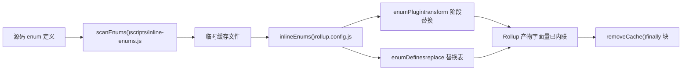
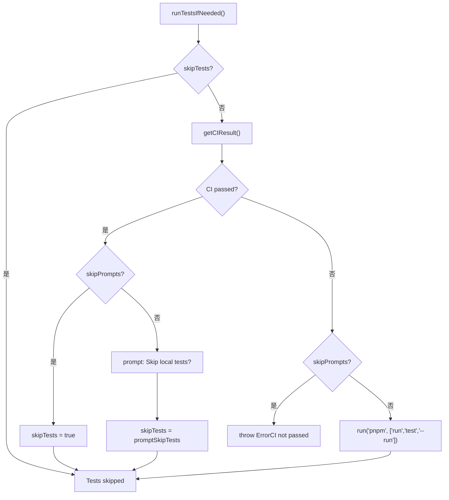

# Next chapter: Chapter 13 →

Verification status: FACT line numbers truly anchored`packages-private/vite-debug`In the previous chapter, we used`packages`as an entry point and mastered the debugging paradigm of doing minimal reproduction on real source code. As this kind of internal debugging package grows in number, a practical problem surfaces: they coexist in the same workspace with officially published packages, so how do we ensure the release process does not accidentally affect them? This chapter will go deep into the boundary conditions of monorepo engineering, starting from the dual-directory contract of`packages-private`and

# , analyze the defensive design behind architectural trade-offs, and provide an actionable pitfall-avoidance guide.

## 13.2 The Iron Law of Timing: Enum Inlining Must Execute Before Rollup

Intuitive model`build.js`Enum inlining is like "replacing the labels on parts with numbers before packing." If the packer (Rollup) has already started packing, and you then change the labels, the parts in the box and the labels will no longer match.`scanEnums()` / `removeCache()`uses the

## pair of functions to strictly sandwich inlining before Rollup.

`inline-enums.js`Data structure and lifecycle`scanEnums()`The exported`removeCache`returns a[FACT:scripts/build.js:30-34]。`build.js`closure, which scans enum definitions in the source code and generates temporary files for Rollup to consume.`run()`'s`try/finally`uses[FACT:scripts/build.js:81-112]：

```js
const removeCache = scanEnums()
try {
  // ... buildAll / checkAllSizes / build-dts
} finally {
  removeCache()
}
```

`rollup.config.js`Copy`inlineEnums()`At the module top level, call`[enumPlugin, enumDefines]` [FACT:rollup.config.js:47-50]to get`enumPlugin`, where[FACT:rollup.config.js:331-331]，`enumDefines`is inserted into the plugins array[FACT:rollup.config.js:222-223]。

## and merged into the replacement table of the replace plugin

1. `build.js`Step-by-Step: The complete lifecycle of an enum in one build`run()`'s`scanEnums()`first calls`removeCache` [FACT:scripts/build.js:87-87]。

2. `buildAll`, scans enum definitions in all packages and writes them to the temporary cache, returns[FACT:scripts/build.js:119-121]。

and concurrently starts multiple Rollup processes`inlineEnums()`3. Each Rollup process executes`enumPlugin`during the config loading phase, reads the cache generated in the previous step, and obtains`enumDefines` [FACT:rollup.config.js:47-50]。

4. `enumPlugin`and`enumDefines`replaces enum references in the source code with literals during the transform phase;[FACT:rollup.config.js:222-223]。

serves as a supplement to replace, handling cross-module constant replacement`finally`5. When the build ends,`removeCache()`the block calls[FACT:scripts/build.js:119-121]。



## Copy

> **[Design Inference & Architectural Trade-offs]**
> [Design inference and architectural trade-offs]**Why not use a Rollup plugin to scan and use on the fly during the transform phase? Because enum inlining requires**：`runtime-core`a cross-package global view`shared`. The referenced enum may be defined in`scanEnums()`, and a single Rollup process only sees its own package's source tree, so it cannot complete cross-package replacement.

Establishing a global cache before the build is precisely to solve this visibility problem.`removeCache()`Production pitfall:`finally`placing`finally`in`temp/`means it will be cleaned up even if the build throws an error midway. But if you manually interrupt the process while debugging (Ctrl+C),

---

# may not execute, and the leftover cache files will cause the next build to read stale enums. Troubleshooting method: Check whether there are leftover enum cache files under the`release.js`directory, delete them manually, and retry.

## 13.3 Release orchestrator:

`release.js`'s skip flag matrix`skipBuild` / `skipTests` / `skipGit` / `skipPrompts`Intuitive model`skipPrompts`is like the wedding director,`skipGit`and the four switches are the buttons for "skip rehearsal," "skip vows," "skip photos," and "skip confirmation." The existence of each button corresponds to a real scenario: CI environments need`skipTests`。

## , local debugging needs

, emergency hotfixes need`parseArgs`Data structure and default values of the flags[FACT:scripts/release.js:39-50]The four skip flags are declared in[FACT:scripts/release.js:64-66]：

```js
let skipTests = args.skipTests
const skipBuild = args.skipBuild
const skipPrompts = args.skipPrompts
const skipGit = args.skipGit
```

Copy`skipTests`Note that`let`declaration, because it will be dynamically rewritten in`runTestsIfNeeded()`[FACT:scripts/release.js:281-317]。

## Step-by-Step: The Complete Decision Flow of a Release

`main()`execution order[FACT:scripts/release.js:143-279]：

1. **Remote sync check**：`isInSyncWithRemote()`Compare local HEAD with remote branch SHA, and show a confirmation dialog when they differ[FACT:scripts/release.js:337-363]。

2. **Version selection**: when there are no positional arguments, pop up`versionIncrements`selection menu[FACT:scripts/release.js:152-176]。

3. **Test decision**：`runTestsIfNeeded()`is where the skip logic is most concentrated[FACT:scripts/release.js:281-317]。

4. **Version update**：`updateVersions()`Iterate over all packages and rewrite`package.json` [FACT:scripts/release.js:377-398]。

5. **Changelog generation**: call`pnpm run changelog` [FACT:scripts/release.js:211-212]。

6. **Git commit**：`skipGit`When true, the entire section is skipped[FACT:scripts/release.js:231-240]。

7. **Publish**: execute only when`args.publish`is true`buildPackages()` + `publishPackages()` [FACT:scripts/release.js:243-246]。

`runTestsIfNeeded()`The branch logic of is worth expanding separately:



## Design reflections and pitfalls

> **[Design Inference & Architectural Trade-offs]**
> `skipTests`use`let`instead of`const`The design of is intended to support the optimization path of "skip local tests automatically if CI has passed." This saves a significant amount of time in CI release scenarios—GitHub Actions'`release.yml`has already run the full test suite, so running it again locally is pure waste.

**The hidden contract of publish order**：`sortPackagesForPublishing`puts`vue`last[FACT:scripts/release.js:85-85], and the comment explicitly states that "users must not be able to install the new entry package before the internal packages are available." If you change this ordering, users`npm install vue@next`may pull a version whose dependencies have not yet been published, causing`ERR_MODULE_NOT_FOUND`。

**Idempotency protection**：`publishPackage`call before publishing`isPackagePublished`to check the registry[FACT:scripts/release.js:453-458], and when publishing fails, catch the`previously published`error and degrade to skipping[FACT:scripts/release.js:480-488]. This allows the release script to be safely retried—after a network interruption, re-running it will not fail entirely because "the package already exists."

**Failure rollback**：`fnToRun().catch()`when`versionUpdated`is true, call`updateVersions(currentVersion)`to roll back the version number[FACT:scripts/release.js:528-537]. But note: this only rolls back`package.json`the version field in**and does not roll back commits that have already been`git commit`**. If you publish and it fails while`skipGit`is false, you need to manually`git reset`。

---

# Design reflection: the common pattern across the three trade-offs

Reviewing the three core trade-offs in this chapter, they share the same design philosophy:**Turn "runtime checks that are easy to forget" into "structural constraints that cannot be bypassed"**。

- `packages-private`Physical isolation: do not rely on the script author remembering to check the`private`field, but instead make the scan scope naturally exclude it.
- Enum inlining upfront: do not rely on the Rollup plugin "happening" to see cross-package enums during transform, but instead build a global cache before the build.
- `release.js`The skip matrix of : do not rely on the publisher remembering that "if CI has passed, there is no need to run tests locally," but instead have the script automatically query CI status and rewrite`skipTests`。

> **[Design Inference & Architectural Trade-offs]**
> The cost of this pattern is**increased script complexity**：`build.js`needs to maintain the`privatePackages`list,`rollup.config.js`needs to duplicate directory probing logic,`release.js`needs to handle the cross-combinations of four skip flags. But for a repository like Vue that releases multiple times per week, the reliability gains from structural constraints far outweigh the complexity cost.

---

# Chapter summary

Starting from the source code, this chapter breaks down three key boundary conditions of the Vue core engineering system:

1. **`packages-private`and`packages`physical isolation**jointly guaranteed by the workspace glob,`build.js`directory probing,`release.js`and filtering in three places[FACT:pnpm-workspace.yaml:1-3][FACT:scripts/build.js:153-170][FACT:scripts/release.js:68-83]。

2. **The timing constraint of enum inlining**is enforced by`scanEnums()` / `removeCache()`'s`try/finally`structure, with the Rollup config consuming the cache at the module top level[FACT:scripts/build.js:81-112][FACT:rollup.config.js:47-50]。

3. **`release.js`The skip flag matrix of**serves three scenarios: CI release, local debugging, and emergency hotfixes,`skipTests`The dynamic rewriting and publish order sorting are the two hidden contracts most easily overlooked[FACT:scripts/release.js:281-317][FACT:scripts/release.js:85-85]。

# Chapter reflection and self-test

Q1: If you remove the`build.js`in`build(target)`the`privatePackages.includes(target)`check in the function and uniformly use`packages`as`pkgBase`, in what scenarios would problems occur?

**Reference analysis**：`build.js:160-164`The directory probing of is the only entry point through which private packages can be built. After removing it,`nr build vite-debug`will look for`packages/vite-debug`under`package.json`, but that directory does not exist,`fs.readFileSync`directly throws`ENOENT`. A more subtle problem is: if someone in the future creates a directory with the same name under`packages/`, the build will silently use the config from the wrong directory, and the output paths and`buildOptions`will all be misaligned. In addition,`rollup.config.js:37-42`has independent directory probing logic, and both places must be modified in sync; otherwise you get the inconsistent state where "`build.js`found the package but Rollup cannot find it."

Q2: `release.js`In`runTestsIfNeeded()`of`skipTests ||= isCIPassed`, this line of code (`release.js:285`) when`skipPrompts`is true and CI has not passed, which branch will it take? If you remove the`else if (skipPrompts)`of the`throw`branch, what will be the consequences?

**Reference analysis**: when`skipPrompts`is true and CI has not passed,`skipTests ||= isCIPassed`in`isCIPassed`is`false`，`skipTests`and keeps its original value (usually`false`). Then it enters the`else if (skipPrompts)`branch and throws`Error`（`release.js:299-304`). If you remove this`throw`, the code will continue to the`if (!skipTests)`branch and run`pnpm run test --run`in a non-interactive environment. In CI, this may cause tests to fail due to environment differences, or worse—tests pass but CI actually did not pass (for example, CI ran a different subset of tests), publishing a version that has not been fully verified.

Q3: `rollup.config.js:55`In`inlineEnums()`of`build.js:87`is called at the module top level, while`scanEnums()`of`run()`is called inside the`inlineEnums()`function. If you swap the execution timing of these two (that is, let`buildStart`be called in Rollup's hook), what would be broken?

**Reference analysis**：`scanEnums()`must complete before all Rollup processes start, because it needs to scan**all packages**source code to build the global enum cache.`inlineEnums()`is called at the top level of the`rollup.config.js`module, when Rollup has not yet started any builds, so the cache is already ready. If it were changed to be called in`buildStart`, each Rollup process would scan independently—but`buildAll`is executed concurrently (`build.js:119-121`), and multiple processes scanning the same batch of files at the same time would create a race: process A may read a cache file that process B has not finished writing, resulting in incomplete enum replacement. More seriously,`scanEnums()`the returned`removeCache`closure depends on the file handle state at scan time, and in concurrent scenarios the cleanup timing cannot be coordinated.

Dual-directory contracts, ownership determination in build scripts, secondary filtering in release scripts—these mechanisms together define the safety boundaries of monorepo engineering. But boundaries are not static: as build tools migrate from Rollup to Rolldown and type testing converges with runtime testing, existing trade-off strategies will face new challenges. In the next chapter, we will look ahead to the evolution direction of the next-generation engineering system based on the change trajectory from 3.0 to 3.4.
