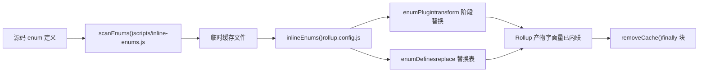
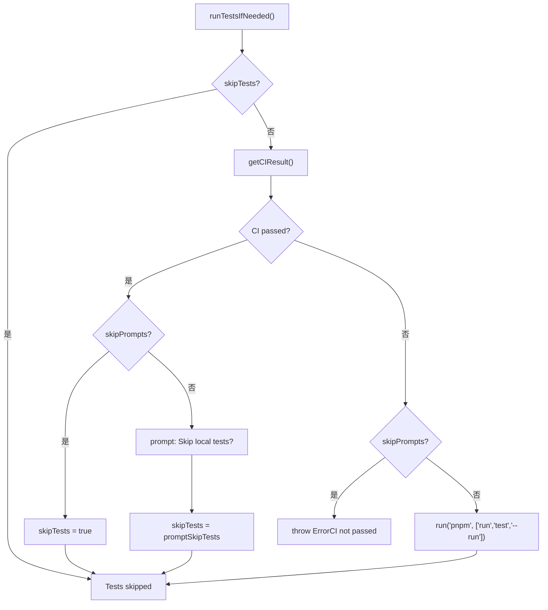

# Chapter 13: Performance Optimization: Tree-shaking, Feature Flags & Rollup Plugins


上一章我们以 `packages-private/vite-debug` 为切口，掌握了在真实源码上做最小复现的调试范式。当这种内部调试包越来越多，一个现实问题便浮出水面：它们与对外发布的正式包共处同一 workspace，如何确保发布流程不会误伤？本章将深入 monorepo 工程化的边界条件，从 `packages` 与 `packages-private` 的双目录契约出发，剖析架构权衡背后的防御性设计，并给出可落地的避坑指南。


## Intuitive Architectural Model

枚举内联就像「在装箱前把零件上的标签换成数字」。如果装箱工人（Rollup）已经开始打包，你再去改标签，箱子里的零件和标签就对不上了。`build.js` 用 `scanEnums()` / `removeCache()` 这对函数把内联严格夹在 Rollup 之前。

## 数据结构与生命周期

`inline-enums.js` 导出的 `scanEnums()` 返回一个 `removeCache` 闭包，它扫描源码中的 enum 定义，生成临时文件供 Rollup 消费 [FACT:scripts/build.js:30-34](https://github.com/vuejs/core/blob/4ab865a848a1da3d10fb674f857e5fff13094644/scripts/build.js#L30-L34)。`build.js` 的 `run()` 用 `try/finally` 保证缓存清理 [FACT:scripts/build.js:81-112](https://github.com/vuejs/core/blob/4ab865a848a1da3d10fb674f857e5fff13094644/scripts/build.js#L81-L112)：

```js
const removeCache = scanEnums()
try {
  // ... buildAll / checkAllSizes / build-dts
} finally {
  removeCache()
}
```

`rollup.config.js` 在模块顶层调用 `inlineEnums()` 拿到 `[enumPlugin, enumDefines]` [FACT:rollup.config.js:47-50](https://github.com/vuejs/core/blob/4ab865a848a1da3d10fb674f857e5fff13094644/rollup.config.js#L47-L50)，其中 `enumPlugin` 插入 plugins 数组 [FACT:rollup.config.js:331-331](https://github.com/vuejs/core/blob/4ab865a848a1da3d10fb674f857e5fff13094644/rollup.config.js#L331-L331)，`enumDefines` 并入 replace 插件的替换表 [FACT:rollup.config.js:222-223](https://github.com/vuejs/core/blob/4ab865a848a1da3d10fb674f857e5fff13094644/rollup.config.js#L222-L223)。

## Step-by-Step：一次构建中枚举的完整生命周期

1. `build.js` 的 `run()` 首先调用 `scanEnums()`，扫描所有包的 enum 定义并写入临时缓存，返回 `removeCache` [FACT:scripts/build.js:87-87](https://github.com/vuejs/core/blob/4ab865a848a1da3d10fb674f857e5fff13094644/scripts/build.js#L87-L87)。

2. `buildAll` 并发启动多个 Rollup 进程 [FACT:scripts/build.js:119-121](https://github.com/vuejs/core/blob/4ab865a848a1da3d10fb674f857e5fff13094644/scripts/build.js#L119-L121)。

3. 每个 Rollup 进程在配置加载阶段执行 `inlineEnums()`，读取上一步生成的缓存，得到 `enumPlugin` 与 `enumDefines` [FACT:rollup.config.js:47-50](https://github.com/vuejs/core/blob/4ab865a848a1da3d10fb674f857e5fff13094644/rollup.config.js#L47-L50)。

4. `enumPlugin` 在 transform 阶段把源码中的 enum 引用替换为字面量；`enumDefines` 作为 replace 的补充，处理跨模块的常量替换 [FACT:rollup.config.js:222-223](https://github.com/vuejs/core/blob/4ab865a848a1da3d10fb674f857e5fff13094644/rollup.config.js#L222-L223)。

5. 构建结束，`finally` 块调用 `removeCache()` 清理临时文件 [FACT:scripts/build.js:119-121](https://github.com/vuejs/core/blob/4ab865a848a1da3d10fb674f857e5fff13094644/scripts/build.js#L119-L121)。



## 设计思考与踩坑

> **〔Design Inference & Architectural Trade-offs〕**
> 为什么不用 Rollup 插件在 transform 阶段现扫现用？因为枚举内联需要**跨包全局视图**：`runtime-core` 引用的 enum 可能定义在 `shared` 中，单个 Rollup 进程只看到自己包的源码树，无法完成跨包替换。`scanEnums()` 在构建前建立全局缓存，正是为了解决这个可见性问题。

生产踩坑点：`removeCache()` 放在 `finally` 中，意味着即使构建中途抛错也会清理。但如果你在调试时手动中断进程（Ctrl+C），`finally` 可能不执行，残留的缓存文件会导致下次构建读到过期枚举。排查方法：检查 `temp/` 目录下是否有残留的 enum 缓存文件，手动删除后重试。

---


## Intuitive Architectural Model

`release.js` 像婚礼总导演，`skipBuild` / `skipTests` / `skipGit` / `skipPrompts` 四个开关就是「跳过彩排」「跳过宣誓」「跳过拍照」「跳过确认」的按钮。每个按钮的存在都对应一种真实场景：CI 环境需要 `skipPrompts`，本地调试需要 `skipGit`，紧急热修需要 `skipTests`。

## 标志位的数据结构与默认值

四个 skip 标志在 `parseArgs` 中声明 [FACT:scripts/release.js:39-50](https://github.com/vuejs/core/blob/4ab865a848a1da3d10fb674f857e5fff13094644/scripts/release.js#L39-L50)，随后解构为局部变量 [FACT:scripts/release.js:64-66](https://github.com/vuejs/core/blob/4ab865a848a1da3d10fb674f857e5fff13094644/scripts/release.js#L64-L66)：

```js
let skipTests = args.skipTests
const skipBuild = args.skipBuild
const skipPrompts = args.skipPrompts
const skipGit = args.skipGit
```

注意 `skipTests` 用 `let` 声明，因为它在 `runTestsIfNeeded()` 中会被动态改写 [FACT:scripts/release.js:281-317](https://github.com/vuejs/core/blob/4ab865a848a1da3d10fb674f857e5fff13094644/scripts/release.js#L281-L317)。

## Step-by-Step：一次 release 的完整决策流

`main()` 的执行顺序 [FACT:scripts/release.js:143-279](https://github.com/vuejs/core/blob/4ab865a848a1da3d10fb674f857e5fff13094644/scripts/release.js#L143-L279)：

1. **远程同步检查**：`isInSyncWithRemote()` 比对本地 HEAD 与远程分支 SHA，不一致时弹确认框 [FACT:scripts/release.js:337-363](https://github.com/vuejs/core/blob/4ab865a848a1da3d10fb674f857e5fff13094644/scripts/release.js#L337-L363)。

2. **版本选择**：无位置参数时弹出 `versionIncrements` 选择菜单 [FACT:scripts/release.js:152-176](https://github.com/vuejs/core/blob/4ab865a848a1da3d10fb674f857e5fff13094644/scripts/release.js#L152-L176)。

3. **测试决策**：`runTestsIfNeeded()` 是 skip 逻辑最密集的地方 [FACT:scripts/release.js:281-317](https://github.com/vuejs/core/blob/4ab865a848a1da3d10fb674f857e5fff13094644/scripts/release.js#L281-L317)。

4. **版本更新**：`updateVersions()` 遍历所有包改写 `package.json` [FACT:scripts/release.js:377-398](https://github.com/vuejs/core/blob/4ab865a848a1da3d10fb674f857e5fff13094644/scripts/release.js#L377-L398)。

5. **Changelog 生成**：调用 `pnpm run changelog` [FACT:scripts/release.js:211-212](https://github.com/vuejs/core/blob/4ab865a848a1da3d10fb674f857e5fff13094644/scripts/release.js#L211-L212)。

6. **Git 提交**：`skipGit` 为真时整段跳过 [FACT:scripts/release.js:231-240](https://github.com/vuejs/core/blob/4ab865a848a1da3d10fb674f857e5fff13094644/scripts/release.js#L231-L240)。

7. **发布**：仅当 `args.publish` 为真时执行 `buildPackages()` + `publishPackages()` [FACT:scripts/release.js:243-246](https://github.com/vuejs/core/blob/4ab865a848a1da3d10fb674f857e5fff13094644/scripts/release.js#L243-L246)。

`runTestsIfNeeded()` 的分支逻辑值得单独展开：



## 设计思考与踩坑

> **〔Design Inference & Architectural Trade-offs〕**
> `skipTests` 用 `let` 而非 `const` 的设计，是为了支持「CI 已通过则自动跳过本地测试」的优化路径。这在 CI 发布场景下节省了大量时间——GitHub Actions 的 `release.yml` 已经跑过完整测试，本地再跑一遍纯属浪费。

**发布顺序的隐藏契约**：`sortPackagesForPublishing` 把 `vue` 排到最后 [FACT:scripts/release.js:85-85](https://github.com/vuejs/core/blob/4ab865a848a1da3d10fb674f857e5fff13094644/scripts/release.js#L85-L85)，注释明确说明「用户不能在内部包可用之前安装新的入口包」。如果你修改了这个排序，用户 `npm install vue@next` 时可能拉到依赖尚未发布的版本，导致 `ERR_MODULE_NOT_FOUND`。

**幂等性保护**：`publishPackage` 在发布前调用 `isPackagePublished` 检查 registry [FACT:scripts/release.js:453-458](https://github.com/vuejs/core/blob/4ab865a848a1da3d10fb674f857e5fff13094644/scripts/release.js#L453-L458)，发布失败时捕获 `previously published` 错误并降级为跳过 [FACT:scripts/release.js:480-488](https://github.com/vuejs/core/blob/4ab865a848a1da3d10fb674f857e5fff13094644/scripts/release.js#L480-L488)。这让 release 脚本可以安全重试——网络中断后重新执行不会因为「包已存在」而整体失败。

**失败回滚**：`fnToRun().catch()` 在 `versionUpdated` 为真时调用 `updateVersions(currentVersion)` 回滚版本号 [FACT:scripts/release.js:528-537](https://github.com/vuejs/core/blob/4ab865a848a1da3d10fb674f857e5fff13094644/scripts/release.js#L528-L537)。但注意：这只回滚 `package.json` 中的版本字段，**不会回滚已经 `git commit` 的提交**。如果你在 `skipGit` 为假的情况下发布失败，需要手动 `git reset`。

---


回顾本章三个核心权衡，它们共享同一个设计哲学：**把「容易忘记的运行时检查」转化为「不可能绕过的结构性约束」**。

- `packages-private` 物理隔离：不依赖脚本作者记得检查 `private` 字段，而是让扫描范围天然排除。
- 枚举内联前置：不依赖 Rollup 插件在 transform 时「碰巧」能看到跨包 enum，而是构建前建立全局缓存。
- `release.js` 的 skip 矩阵：不依赖发布者记得「CI 已过就不用本地跑测试」，而是让脚本自动查询 CI 状态并改写 `skipTests`。

> **〔Design Inference & Architectural Trade-offs〕**
> 这种模式的代价是**脚本复杂度上升**：`build.js` 需要维护 `privatePackages` 列表，`rollup.config.js` 需要重复目录探测逻辑，`release.js` 需要处理四个 skip 标志的交叉组合。但对于 Vue 这种每周多次发布的仓库，结构性约束带来的可靠性收益远超复杂度成本。

---


本章从源码出发，拆解了 Vue core 工程化体系的三个关键边界条件：

1. **`packages-private` 与 `packages` 的物理隔离**由 workspace glob、`build.js` 目录探测、`release.js` 过滤三处共同保证 [FACT:pnpm-workspace.yaml:1-3](https://github.com/vuejs/core/blob/4ab865a848a1da3d10fb674f857e5fff13094644/pnpm-workspace.yaml#L1-L3)[FACT:scripts/build.js:153-170](https://github.com/vuejs/core/blob/4ab865a848a1da3d10fb674f857e5fff13094644/scripts/build.js#L153-L170)[FACT:scripts/release.js:68-83](https://github.com/vuejs/core/blob/4ab865a848a1da3d10fb674f857e5fff13094644/scripts/release.js#L68-L83)。

2. **枚举内联的时序约束**由 `scanEnums()` / `removeCache()` 的 `try/finally` 结构强制保证，Rollup 配置在模块顶层消费缓存 [FACT:scripts/build.js:81-112](https://github.com/vuejs/core/blob/4ab865a848a1da3d10fb674f857e5fff13094644/scripts/build.js#L81-L112)[FACT:rollup.config.js:47-50](https://github.com/vuejs/core/blob/4ab865a848a1da3d10fb674f857e5fff13094644/rollup.config.js#L47-L50)。

3. **`release.js` 的 skip 标志位矩阵**服务于 CI 发布、本地调试、紧急热修三种场景，`skipTests` 的动态改写和发布顺序排序是两个最容易被忽略的隐藏契约 [FACT:scripts/release.js:281-317](https://github.com/vuejs/core/blob/4ab865a848a1da3d10fb674f857e5fff13094644/scripts/release.js#L281-L317)[FACT:scripts/release.js:85-85](https://github.com/vuejs/core/blob/4ab865a848a1da3d10fb674f857e5fff13094644/scripts/release.js#L85-L85)。


Q1: 如果把 `build.js` 中 `build(target)` 函数里的 `privatePackages.includes(target)` 判断去掉，统一用 `packages` 作为 `pkgBase`，在什么场景下会出问题？

**参考解析**：`build.js:160-164` 的目录探测是私有包能被构建的唯一入口。去掉后，`nr build vite-debug` 会在 `packages/vite-debug` 下查找 `package.json`，而该目录不存在，`fs.readFileSync` 直接抛 `ENOENT`。更隐蔽的问题是：如果未来有人在 `packages/` 下创建了同名目录，构建会静默使用错误目录的配置，产物路径和 `buildOptions` 全部错位。此外，`rollup.config.js:37-42` 有独立的目录探测逻辑，两处必须同步修改，否则会出现「`build.js` 找到了包但 Rollup 找不到」的不一致状态。

Q2: `release.js` 的 `runTestsIfNeeded()` 中，`skipTests ||= isCIPassed` 这行代码（`release.js:285`）在 `skipPrompts` 为真且 CI 未通过时会走哪条分支？如果去掉 `else if (skipPrompts)` 分支的 `throw`，会有什么后果？

**参考解析**：当 `skipPrompts` 为真且 CI 未通过时，`skipTests ||= isCIPassed` 中 `isCIPassed` 为 `false`，`skipTests` 保持原值（通常为 `false`）。随后进入 `else if (skipPrompts)` 分支，抛出 `Error`（`release.js:299-304`）。如果去掉这个 `throw`，代码会继续执行到 `if (!skipTests)` 分支，在无交互环境下运行 `pnpm run test --run`。这在 CI 中可能导致测试因环境差异而失败，或者更糟——测试通过但 CI 实际未通过（比如 CI 跑的是不同的测试子集），发布出未经完整验证的版本。

Q3: `rollup.config.js:55` 的 `inlineEnums()` 在模块顶层调用，而 `build.js:87` 的 `scanEnums()` 在 `run()` 函数内调用。如果交换这两者的执行时机（即让 `inlineEnums()` 在 Rollup 的 `buildStart` 钩子中调用），会破坏什么？

**参考解析**：`scanEnums()` 必须在所有 Rollup 进程启动之前完成，因为它需要扫描**所有包**的源码来建立全局 enum 缓存。`inlineEnums()` 在 `rollup.config.js` 模块顶层调用，此时 Rollup 尚未开始任何构建，缓存已经就绪。如果改为在 `buildStart` 中调用，每个 Rollup 进程会独立扫描——但 `buildAll` 是并发执行的（`build.js:119-121`），多个进程同时扫描同一批文件会产生竞态：进程 A 可能读到进程 B 尚未写完的缓存文件，导致 enum 替换不完整。更严重的是，`scanEnums()` 返回的 `removeCache` 闭包依赖扫描时的文件句柄状态，并发场景下清理时机无法协调。

双目录契约、构建脚本的归属判定、发布脚本的二次过滤——这些机制共同划定了 monorepo 工程化的安全边界。但边界并非一成不变：随着构建工具从 Rollup 向 Rolldown 迁移、类型测试与运行时测试走向融合，现有的权衡策略也将面临新的挑战。下一章，我们将基于 3.0 至 3.4 的变更轨迹，展望下一代工程化体系的演进方向。