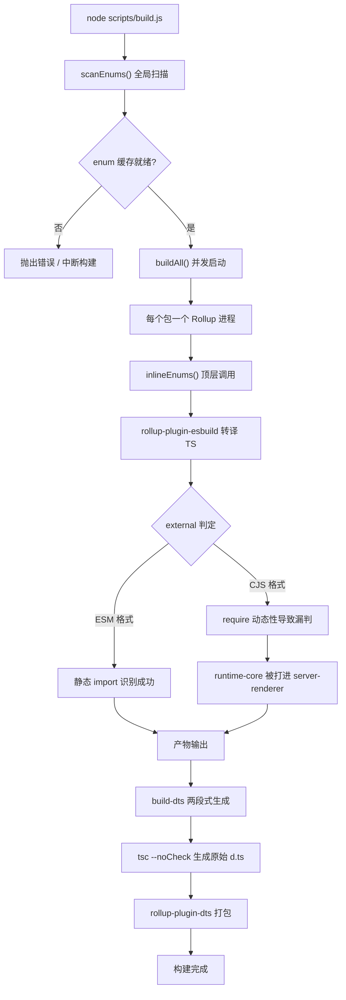
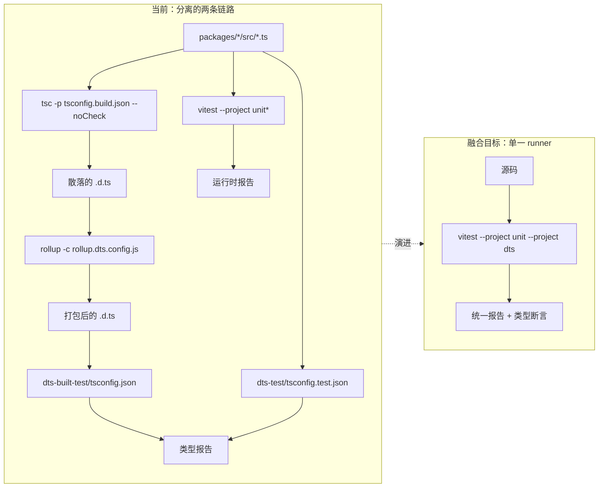
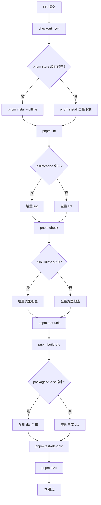

# Chapter 14: Future Evolution: From 3.x to the Next-Generation Engineering System

In the previous chapter, we sorted out the "safety boundaries" of the Vue core engineering system—dual-directory contracts, ownership determination in build scripts, and secondary filtering in release scripts. These mechanisms were not designed all at once, but were repeatedly refined through iterations from 3.0 to 3.4. This chapter takes a different perspective: instead of looking at "what it looks like now," we look at "how it grew into what it is now," and based on that infer where the next-generation engineering system will go. The source materials for this chapter are changelogs/CHANGELOG-3.3.md, changelogs/CHANGELOG-3.4.md, and the package.json at the repository root. Changelogs may look like mere running logs of "what bugs were fixed," but they are the most authentic health report of an engineering system: every commit with the build: prefix, every change with the types: prefix, every dependency version rollback exposes the stress points of the current architecture. What we need to do is read the direction of evolution from these stress points. Treating changelogs as an "observation window into the engineering system" rather than a "feature list" is the core methodology of this chapter. Feature changes tell us what Vue can do, while build-, type-, and CI-related changes tell us where Vue's engineering system "hurts."

# I. Stress Points in the Build Toolchain: The Migration Potential from Rollup to Rolldown

## Intuitive Model

Imagine the build toolchain as an assembly line: Rollup is the main assembly station, esbuild handles rapid cutting (transpiling TS), and terser handles final bundling and minification. As the product (the Vue runtime) becomes increasingly complex and more processes are added to the assembly station, the main assembly station itself becomes the bottleneck. Rolldown's positioning is to be a main assembly station rewritten in Rust—what it aims to replace is not esbuild, but Rollup itself.

Without this layer of evolutionary pressure, the "disaster" the system faces is not a crash, but**build time expanding linearly with the number of packages**: each additional subpackage requires starting another Rollup process, scanning the enum cache one more time, and running another round of dts generation.

## Data Structures and Dependency Layout

First, let's look at a static snapshot of the current toolchain.`package.json`The`devDependencies`in is an precise "assembly station inventory":

[FACT:package.json:103-106]

```
    "rollup": "^4.63.3",
    "rollup-plugin-dts": "^6.5.1",
    "rollup-plugin-esbuild": "^6.2.1",
    "rollup-plugin-polyfill-node": "^0.13.0",
```

Three key facts can be read from this. First, the Rollup major version is`^4.63.3`, placing it in the mature phase of Rollup 4.x. Second,`rollup-plugin-esbuild`handles TS transpilation, meaning Rollup itself does not parse TS and only processes the JS emitted by esbuild. Third,`rollup-plugin-dts`independently handles`.d.ts`bundling, which is exactly the material basis for the`dts-built-test`independence discussed in the previous chapter.

Now let's look at the entry orchestration of the build scripts:

[FACT:package.json:8-9]

```
    "build": "node scripts/build.js",
    "build-dts": "tsc -p tsconfig.build.json --noCheck && rollup -c rollup.dts.config.js",
```

`build-dts`is "two-stage": first`tsc --noCheck`generates raw declaration files (`--noCheck`skips type checking and only performs emit), then uses`rollup -c rollup.dts.config.js`to bundle the scattered`.d.ts`into a single file. This design itself depends on Rollup's capabilities—`rollup-plugin-dts`requires Rollup's module graph to track type dependencies.

## Scenario-Driven: What a`build:`Commit Exposed

Entries with the`build:`prefix in the changelog are direct evidence of stress points in the build toolchain. Let's pick three to examine.

The first is the minify configuration alignment in 3.4.32:

[FACT:changelogs/CHANGELOG-3.4.md:84]

```
* **build:** use consistent minify options from previous terser config ([789675f](https://github.com/vuejs/core/commit/789675f65d2b72cf979ba6a29bd323f716154a4b))
```

The motivation for this commit was "after migrating from terser to esbuild minify, the minification options were inconsistent." It reveals an intermediate state during migration: Vue once used terser for minification, then switched to esbuild (`devDependencies`in`esbuild: ^0.28.2`confirms this), but the minification options were not fully aligned, causing deviations in artifact size or behavior. This is exactly the typical cost of "replacing parts on the assembly station."

The second is the entities version rollback in 3.4.38:

[FACT:changelogs/CHANGELOG-3.4.md:6]

```
* **build:** revert entities to 4.5 to avoid runtime resolution errors ([f349af7](https://github.com/vuejs/core/commit/f349af7b65b9f8605d8b7bafcc06c25ab1f2daf0)), closes [#11603](https://github.com/vuejs/core/issues/11603)
```

`entities`is an HTML entity decoding library, depended on by`compiler-dom`. The rollback to 4.5 was because the new version had problems in runtime parsing. This commit shows:**dependency upgrades in the build toolchain are not isolated; a version jump in an indirect dependency can penetrate into runtime behavior**。

The third is the server-renderer cjs build contamination in 3.4.29:

[FACT:changelogs/CHANGELOG-3.4.md:155]

```
* **build:** fix accidental inclusion of runtime-core in server-renderer cjs build ([11cc12b](https://github.com/vuejs/core/commit/11cc12b915edfe0e4d3175e57464f73bc2c1cb04)), closes [#11137](https://github.com/vuejs/core/issues/11137)
```

This is the most typical kind of build bug: under the CJS format,`server-renderer`accidentally bundled`runtime-core`into its own artifact. The reason is usually that Rollup's`external`determination fails under the CJS format—ESM can statically identify external dependencies via`import`statements, while CJS's`require`More dynamic, prone to missed detection. This commit points directly to the fragility of the logic in the Rollup configuration.`external`The fragility of the logic.

## Mermaid depiction of migration momentum

The following diagram depicts the control flow of the current build pipeline and marks the nodes that the Rolldown migration will touch:



> **[Design Inference & Architectural Trade-offs]**
> The migration value of Rolldown lies in: it replaces the "one process per package" concurrency model with a "parallel within a single process" model,`scanEnums()`The global scan and`inlineEnums()`The replacement can be coordinated within the same Rust runtime, and the "concurrent scan race" problem discussed in the previous chapter will disappear at its root. But the resistance to migration also lies here—`rollup-plugin-esbuild`、`rollup-plugin-dts`These plugin ecosystems require Rolldown to provide a compatibility layer, while`external`The decision logic needs to be rewritten.

## Design thinking and pitfalls

**Why won't the migration happen overnight?**Look at`package.json`The`engines`Field:

[FACT:package.json:61-63]

```
  "engines": {
    "node": ">=20.0.0"
  },
```

Node 20 is a hard lower bound. As a Rust native module, Rolldown requires corresponding N-API bindings and precompiled binary distribution. Once introduced,`pnpm install`The time cost, cross-platform (Windows/macOS/Linux) binary compatibility, and CI caching strategy all need to be redesigned. This is not as simple as "swapping a dependency," but rather**A recalibration of the entire install-build-cache chain**。

**Production pitfalls**：`build-dts`The`tsc --noCheck`Is a double-edged sword. Skipping type checking makes emit faster, but it means`.d.ts`Type errors will not be discovered during the generation phase—type errors can only be caught by`pnpm check`（`tsc --incremental --noEmit`) and`test-dts`As a fallback. If after the Rolldown migration you want to merge these two steps, you must ensure that type checking does not slow down the build, otherwise it violates`--noCheck`The original intent.

---

# II. The convergence trend of type testing and runtime testing

## Intuitive model

Think of type testing and runtime testing as two independent quality inspection gates: one checks whether the "manual (`.d.ts`) is written correctly," and the other checks whether the "machine (runtime) runs correctly." The two gates each have their own workstation, their own tools, and their own reports. The convergence trend means:**Can the same test case verify both the manual and the machine at the same time?**

Without convergence, the disaster the system faces is**Drift between types and runtime behavior**：`.d.ts`Says`ref()`Returns`Ref<T>`But the shape of the object actually returned at runtime has changed; the type test passes, and the runtime test also passes, but the combination of the two is wrong.

## Data structure: the orchestration layout of the test scripts

`package.json`In`scripts`The test-related entries are clearly divided into two groups:

[FACT:package.json:19-24]

```
    "test": "vitest",
    "test-unit": "vitest --project unit*",
    "test-e2e": "node scripts/build.js vue -f global -d && vitest --project e2e --project e2e-browser",
    "test-dts": "run-s build-dts test-dts-only",
    "test-dts-only": "tsc -p packages-private/dts-built-test/tsconfig.json && tsc -p ./packages-private/dts-test/tsconfig.test.json",
    "test-coverage": "vitest run --project unit* --coverage",
```

The key structure here is`test-dts`The`run-s build-dts test-dts-only`—it is**Serial**: first build`.d.ts`Then run the type tests. And`test-dts-only`Internally, it is again**Two independent`tsc`Processes**: one runs`dts-built-test`(verifying the build artifacts), and one runs`dts-test`(verifying the source types).

Note`test-unit`Uses`vitest --project unit*`，`test-e2e`Uses`vitest --project e2e --project e2e-browser`This shows that Vitest's`--project`Mechanism has already divided tests into different projects by "unit/end-to-end/browser."**The physical foundation for convergence already exists**: Vitest's project mechanism allows different types of tests to run in the same runner.

## Scenario-driven: the complete path of one`types:`Commit

In the changelog`types:`The density of prefixed entries is extremely high, which is a direct manifestation of the complexity of the type system. We trace one typical type fix.

The ref type rollback in 3.4.37:

[FACT:changelogs/CHANGELOG-3.4.md:23-24]

```
* Revert "fix(types/ref): allow getter and setter types to be unrelated ([#11442](https://github.com/vuejs/core/issues/11442))" ([b1abac0](https://github.com/vuejs/core/commit/b1abac06cdb198bd72f8e614b1f68b92e1c78339))
* Revert "fix(types/ref): correct type inference for nested refs ([#11536](https://github.com/vuejs/core/issues/11536))" ([3a56315](https://github.com/vuejs/core/commit/3a56315f94bc0e11cfbb288b65482ea8fc3a39b4))
```

Two consecutive Reverts rolled back two type fixes. Note that in 3.4.35 these two fixes had just been merged:

[FACT:changelogs/CHANGELOG-3.4.md:55]

```
* **types/ref:** allow getter and setter types to be unrelated ([#11442](https://github.com/vuejs/core/issues/11442)) ([e0b2975](https://github.com/vuejs/core/commit/e0b2975ef65ae6a0be0aa0a0df43fb887c665251))
```

[FACT:changelogs/CHANGELOG-3.4.md:30]

```
* **types/ref:** correct type inference for nested refs ([#11536](https://github.com/vuejs/core/issues/11536)) ([536f623](https://github.com/vuejs/core/commit/536f62332c455ba82ef2979ba634b831f91928ba)), closes [#11532](https://github.com/vuejs/core/issues/11532) [#11537](https://github.com/vuejs/core/issues/11537)
```

From being merged in 3.4.35 to being reverted in 3.4.37, only one patch version separates them. This rapid "merge-revert" cycle exposes a fundamental dilemma of type testing:**Type tests can verify that "the type signature matches expectations," but they cannot verify "whether this type signature is actually usable in real code."**。`allow getter and setter types to be unrelated`It may pass completely in type tests, but in actual use it will make`ref`Type inference becomes too loose, undermining the type safety of downstream code.

## Mermaid depiction of type testing convergence

The following diagram depicts the current separation structure between type testing and runtime testing, as well as the target form after convergence:



> **[Design Inference & Architectural Trade-offs]**
> The technical path for convergence is most likely: encapsulate`dts-built-test`And`dts-test`The`tsc`Calls into a custom Vitest project, allowing type assertions to be inlined in test files in the form of`expectTypeOf`In this way, a single`vitest`Call can run both runtime assertions and type assertions, with unified reporting. But the resistance lies in:`tsc`Type checking is "full-volume," while Vitest tests are "per-file," and the incremental strategies of the two are incompatible.

## Design thinking and pitfalls

**Why`dts-built-test`Must be independent of`dts-test`？**This was already discussed in the previous chapter; here we supplement from an evolutionary perspective:`dts-built-test`Verifies**Build artifacts**（`rollup-plugin-dts`After bundling`.d.ts`），`dts-test`Verifies**Source types**If the two are merged during convergence, the key checkpoint of "whether the build artifacts are consistent with the source types" will be lost. This commit in 3.4.38 precisely confirms the importance of build artifact types:

[FACT:changelogs/CHANGELOG-3.4.md:9]

```
* **types:** add fallback stub for DOM types when DOM lib is absent ([#11598](https://github.com/vuejs/core/issues/11598)) ([4db0085](https://github.com/vuejs/core/commit/4db0085de316e1b773f474597915f9071d6ae6c6))
```

"Provide a fallback stub when the DOM lib is missing"—this is a type compatibility fix at the build artifact level, and it can only be discovered in scenarios like`dts-built-test`This kind of "consuming the bundled`.d.ts`" scenario.

**Production pitfalls**: The "merge-revert" cycle of type testing shows that changes to type signatures require**Real downstream projects**Verification, not just type assertions. Vue's type tests run in`packages-private/dts-test`uses the repository's internal test cases, which cannot cover all downstream usages. If the convergence trend only focuses on "merging two runners" without solving "how to introduce real downstream feedback," it is merely formal convergence.

---

# III. Fine-Grained Optimization Directions for CI Caching

## Intuitive Model

Think of CI caching as a repository's "staging area": every build needs to fetch raw materials (dependencies, build artifacts, type caches) from the staging area. If the staging area has only one big box, and fetching anything requires rummaging through the entire box, then no matter how high the cache hit rate is, it won't be fast. Fine-grained optimization means:**Splitting the big box into small compartments categorized by purpose**。

Without fine-grained caching, the disaster the system faces is**Cascading amplification of cache invalidation**: changing one line of source code causes the entire`node_modules`cache to be invalidated, CI reinstalls all dependencies, and build time goes from 2 minutes to 10 minutes.

## Data Structure: Classification of Cacheable Items

From`package.json`we can identify several categories of cacheable "materials":

The first category: dependency installation artifacts.`packageManager`The field locks the pnpm version:

[FACT:package.json:4]

```
  "packageManager": "pnpm@12.4.2",
```

pnpm's`node_modules`is a symlink structure; what gets cached is pnpm's content-addressable store, not a flat`node_modules`. This means the cache key should be based on the hash of`pnpm-lock.yaml`, not`package.json`。

The second category: build artifacts.`clean`The script reveals the physical location of the artifacts:

[FACT:package.json:10]

```
    "clean": "rimraf --glob packages/*/dist temp .eslintcache",
```

`packages/*/dist`、`temp`、`.eslintcache`— these three types of artifacts can be cached independently.`dist`is the build output,`temp`is temporary files (such as`bench.json`），`.eslintcache`is the lint cache.

The third category: type-checking cache.`check`The script uses`--incremental`：

[FACT:package.json:15]

```
    "check": "tsc --incremental --noEmit",
```

`--incremental`generates`.tsbuildinfo`file, which is the incremental cache for type checking. If this file is cached in CI,`tsc`'s second run will be much faster.

## Scenario-Driven: CI Execution Flow of a Single PR

Put yourself in a typical scenario: a developer modifies`packages/reactivity/src/ref.ts`and submits a PR. Which steps does CI need to run, and which can hit the cache?

From`scripts`we can infer the CI execution sequence (`simple-git-hooks`'s`pre-commit`is a local hook; CI will run a more complete sequence):

[FACT:package.json:48-51]

```
  "simple-git-hooks": {
    "pre-commit": "pnpm lint-staged && pnpm check",
    "commit-msg": "node scripts/verify-commit.js"
  },
```

Local`pre-commit`runs`lint-staged`and`check`. On CI, it runs`lint`、`check`、`test-unit`、`test-dts`、`size`etc. Each step has a different caching strategy:

- `lint`: cache`.eslintcache`, key based on source file hash.
- `check`: cache`.tsbuildinfo`, key based on`tsconfig`and source hash.
- `test-unit`: Vitest has its own cache, but typically CI does not cache test results, only dependencies.
- `test-dts`: depends on`build-dts`'s artifacts, cache key based on`packages/*/dist`'s hash.
- `size`: depends on build artifacts, cache key same as above.

## Mermaid Depiction of CI Cache Optimization



> **[Design Inference & Architectural Trade-offs]**
> The core contradiction of fine-grained caching is**the granularity of cache keys**: if the key is too coarse (e.g., based only on commit hash), the hit rate is low; if the key is too fine (e.g., based on each file's hash), the overhead of computing keys cancels out the caching benefit. A reasonable strategy for monorepos like Vue is "sharding by package": each`packages/*`sub-package caches independently; changes to`dist`，`reactivity`will not invalidate`compiler-core`'s`dist`cache.

## Design Thinking and Pitfalls

**Why should the`size`script be split into multiple subcommands?**Look at these three:

[FACT:package.json:11-14]

```
    "size": "run-s \"size-*\" && node scripts/usage-size.js",
    "size-global": "node scripts/build.js vue runtime-dom -f global -p --size",
    "size-esm-runtime": "node scripts/build.js vue -f esm-bundler-runtime",
    "size-esm": "node scripts/build.js runtime-dom runtime-core reactivity shared -f esm-bundler",
```

`size`uses`run-s "size-*"`to serially run all subcommands with the`size-`prefix. This "prefix aggregation" pattern allows each size dimension (global, esm-runtime, esm) to be cached and fail independently. If merged into one big command, any dimension exceeding the limit would cause the entire`size`to fail, making it impossible to locate which dimension is the problem.

**Production Pitfalls**: The most common pitfall in CI caching is**cache pollution**—caching the wrong artifacts, causing subsequent builds to be based on dirty data.`clean`The existence of the script is precisely to handle this situation:

[FACT:package.json:10]

```
    "clean": "rimraf --glob packages/*/dist temp .eslintcache",
```

Note that it cleans`packages/*/dist`, not`packages-private/*/dist`. This means`packages-private`'s artifacts are not within the regular cleanup scope—if CI caches`packages-private`'s artifacts and`clean`does not clean them, the problem of "caching old-version playground artifacts" may arise. When designing fine-grained caching,`packages-private`must be handled separately.

---

# Design Thinking: Engineering System as Product Lifecycle

Connecting the threads of the three sections reveals a clear main line:**Vue's engineering system is moving from "usable" to "easy to use," from "manual orchestration" to "declarative configuration."**。

The migration of the build toolchain (Rollup → Rolldown) is a "performance-driven" evolution: when the number of packages grows to a certain point, the overhead of process-level concurrency exceeds the benefit, and a lighter concurrency model must be adopted.

The convergence of type testing is a "consistency-driven" evolution: when the frequency of type signature changes exceeds the frequency of runtime behavior changes, two separate test suites become a burden, and they must share the same set of test cases.

The fine-granularization of CI caching is a "cost-driven" evolution: when CI minutes become the bottleneck, the waste of coarse-grained caching becomes unacceptable, and sharding by purpose becomes necessary.

> **[Design Inference & Architectural Trade-offs]**
> The common constraint of these three evolution lines is**backward compatibility**. Vue's release strategy (as seen from the`BREAKING CHANGES`section in the changelog) allows "type-only breaking changes" in minor versions, but does not allow runtime breaking changes. This means the evolution of the engineering system must guarantee: no matter how the internal toolchain changes, the public API and runtime behavior of the artifacts cannot change. This is the hard boundary of all evolution decisions.

---

# Chapter Summary

Starting from the changelog and`package.json`, this chapter has sorted out the three evolution lines of Vue core's engineering system:

1. **Build toolchain**: The current combination of Rollup 4.x + esbuild + rollup-plugin-dts has its stress points reflected in`build:`prefixed commits (minify config alignment, entities version rollback, CJS external misjudgment). The momentum for Rolldown migration comes from the replacement of "multi-process concurrency" with "single-process parallelism," while the resistance comes from the plugin ecosystem and cross-platform binary distribution.

2. **Type test fusion**：`test-dts`of the`run-s build-dts test-dts-only`serial structure, as well as`dts-built-test`and`dts-test`dual`tsc`processes, are the physical evidence of the current separated form. The technical path for fusion is to leverage Vitest's`--project`mechanism, and the resistance is that`tsc`full checks are incompatible with Vitest's per-file incremental testing strategy.

3. **CI cache fine-granularization**：`packageManager`locks pnpm,`clean`cleans three types of artifacts,`check`uses`--incremental`、`size`aggregates with prefixes—these are all classification bases for cacheable items. The core contradiction is the granularity of cache keys, and the reasonable strategy is "sharding by package."

The most important cognitive shift is:**The engineering system itself is a product, with its own users (contributors), its own performance metrics (build time, CI minutes), and its own compatibility constraints (artifact API unchanged)**. It requires continuous iteration, not one-time design.

# Chapter Review and Self-Assessment

Q1: `package.json:9`of the`build-dts`uses`tsc -p tsconfig.build.json --noCheck`. If`--noCheck`is removed, what chain reactions will occur after the Rolldown migration?

**Reference Analysis**：`--noCheck`serves to skip type checking and only perform emit. After removing it,`tsc`will perform full type checking before generating`.d.ts`. Under the current Rollup architecture, this only makes`build-dts`slower; but after the Rolldown migration, the problem will be amplified: Rolldown's core selling point is "single-process parallel builds." If the`build-dts`phase introduces a full`tsc`check, it becomes a serial bottleneck for the entire pipeline—all package builds must wait for this check to complete. More seriously,`tsc`'s type checking is single-threaded and cannot leverage Rolldown's parallel capabilities. The correct approach is to keep`--noCheck`, delegate type checking to independent`pnpm check`（`package.json:15`) and`test-dts`（`package.json:22`), decoupling builds from checks.

Q2: Changelog 3.4.37 consecutively reverted two`types/ref`fixes (`CHANGELOG-3.4.md:23-24`), and these two fixes were just merged in 3.4.35 (`CHANGELOG-3.4.md:30,55`). If type tests and runtime tests were already fused, could this "merge-revert" cycle be avoided? Why?

**Reference Analysis**: It cannot be completely avoided, but the cycle can be shortened. Fused type tests can still only verify that "type signatures conform to assertions," while the problem with fixes like`allow getter and setter types to be unrelated`is that "type signatures are too loose, breaking downstream code's type safety"—this is a**downstream usage**problem, not a**signature itself**problem. Where fusion can shorten the cycle is: if type assertions and runtime assertions are written in the same test file, developers can more quickly discover inconsistencies where "type signatures changed but runtime behavior didn't." But to truly avoid reverts, real downstream project type checking must be introduced (e.g., extending`packages-private/dts-test`into a test suite that "simulates downstream usage"), which goes beyond merely "fusing runners."

Q3: `package.json:10`'s`clean`script cleans`packages/*/dist`, but does not clean`packages-private/*/dist`. If CI adopts a "sharding by package" fine-grained caching strategy, what production pitfalls will this asymmetry bring?

**Reference Analysis**: The pitfall is "caching old artifacts of`packages-private`."`packages-private`contains`sfc-playground`、`template-explorer`and other debugging tools. If their build artifacts (such as`packages-private/sfc-playground/dist`) are cached by CI, and`clean`does not clean them, the following occurs: source code is updated, but CI reuses old playground artifacts, causing`build-sfc-playground`（`package.json:39`) verification results to be distorted. More insidiously,`dev-sfc-prepare`（`package.json:34`) checks whether`packages-private`'s artifacts exist. If old artifacts are cached, it will skip rebuilding, making developers think the environment is fresh. When designing fine-grained caching, a separate cache key must be defined for`packages-private`, or simply not cache its artifacts—because it is a debugging tool with low rebuild cost and low cache benefit.

Through the observation window of the changelog, we identified the stress points of the current engineering system and inferred the possible evolution directions of the next-generation system. These directions are not castles in the air, but grew from real production pitfalls and trade-offs. At this point, the book's analysis of Vue's engineering system comes to a close, but the exploration of engineering is endless—the next chapter will serve as the final chapter, pulling the perspective back from Vue itself to discuss how these experiences can be transferred to broader engineering scenarios.
