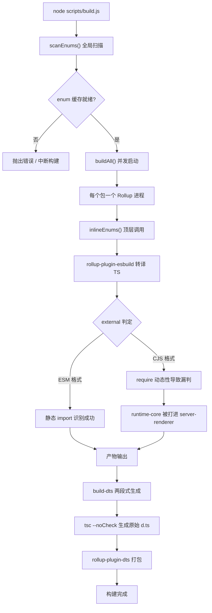
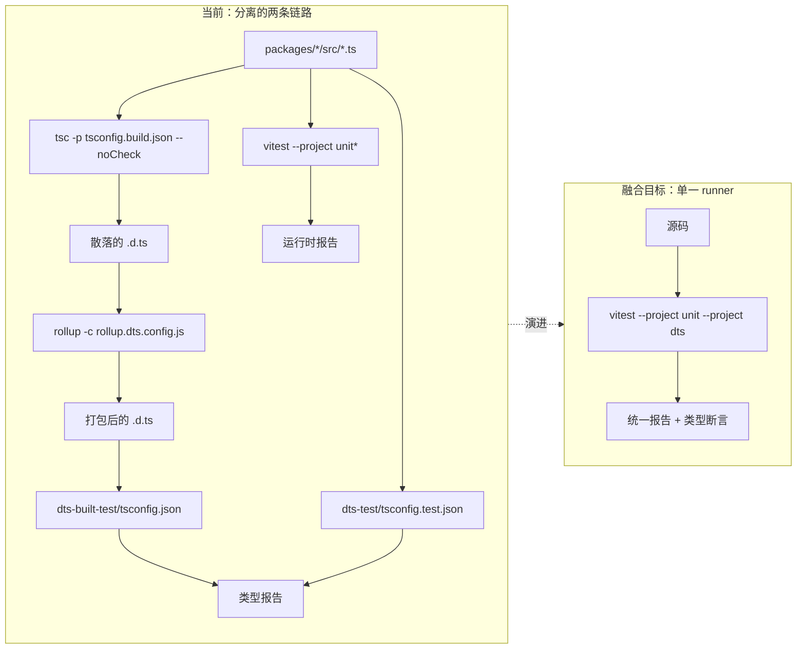
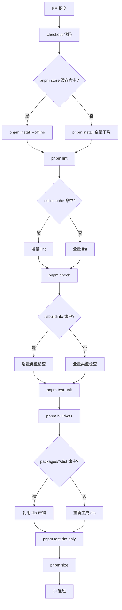

# Chapter 14: Architectural Evolution & Future Outlook: Design Trade-offs & Pitfalls


上一章我们梳理了 Vue core 工程化体系的「安全边界」——双目录契约、构建脚本归属判定、发布脚本二次过滤，这些机制并非一次性设计，而是在 3.0 到 3.4 的迭代中被反复打磨出来的。本章换一个视角：不再看「现在长什么样」，而是看「它是怎么长成现在这样的」，并据此推断下一代工程化体系会往哪里走。本章的源码材料是 changelogs/CHANGELOG-3.3.md、changelogs/CHANGELOG-3.4.md 以及仓库根部的 package.json。变更日志看起来只是「修了什么 bug」的流水账，但它是工程化体系最真实的体检报告：每一次 build: 前缀的提交、每一次 types: 前缀的改动、每一次依赖版本的回退，都在暴露当前架构的应力点。我们要做的，是从这些应力点里读出演进方向。把变更日志当作「工程化体系的观测窗口」而非「功能清单」，是本章的核心方法论。功能变更告诉我们 Vue 能做什么，而构建、类型、CI 相关的变更告诉我们 Vue 的工程化体系「在哪里疼」。


## Intuitive Architectural Model

把构建工具链想象成一条装配流水线：Rollup 是主装配台，esbuild 负责快速切割（转译 TS），terser 负责最后打包压缩。当产品（Vue 运行时）越来越复杂，装配台上的工序越来越多，主装配台本身就成了瓶颈。Rolldown 的定位，就是用 Rust 重写的主装配台——它要替换的不是 esbuild，而是 Rollup 本身。

若没有这层演进压力，系统面临的「灾难」不是崩溃，而是**构建时间随包数量线性膨胀**：每加一个子包，就要多起一个 Rollup 进程，多扫描一遍 enum 缓存，多跑一轮 dts 生成。

## 数据结构与依赖布局

先看当前工具链的静态快照。`package.json` 的 `devDependencies` 是一份精确的「装配台清单」：

[FACT:package.json:103-106](https://github.com/vuejs/core/blob/4ab865a848a1da3d10fb674f857e5fff13094644/package.json#L103-L106)

```
    "rollup": "^4.63.3",
    "rollup-plugin-dts": "^6.5.1",
    "rollup-plugin-esbuild": "^6.2.1",
    "rollup-plugin-polyfill-node": "^0.13.0",
```

这里能读出三个关键事实。第一，Rollup 主版本是 `^4.63.3`，处于 Rollup 4.x 的成熟期。第二，`rollup-plugin-esbuild` 承担 TS 转译，意味着 Rollup 本身不解析 TS，只处理 esbuild 吐出的 JS。第三，`rollup-plugin-dts` 独立负责 `.d.ts` 打包，这正是上一章讨论的 `dts-built-test` 独立性的物质基础。

再看构建脚本的入口编排：

[FACT:package.json:8-9](https://github.com/vuejs/core/blob/4ab865a848a1da3d10fb674f857e5fff13094644/package.json#L8-L9)

```
    "build": "node scripts/build.js",
    "build-dts": "tsc -p tsconfig.build.json --noCheck && rollup -c rollup.dts.config.js",
```

`build-dts` 是「两段式」的：先 `tsc --noCheck` 生成原始声明文件（`--noCheck` 跳过类型检查，只做 emit），再用 `rollup -c rollup.dts.config.js` 把散落的 `.d.ts` 打包成单文件。这个设计本身就是对 Rollup 能力的依赖——`rollup-plugin-dts` 需要 Rollup 的模块图来追踪类型依赖。

## 场景驱动：一次 `build:` 提交暴露了什么

变更日志里 `build:` 前缀的条目，是构建工具链应力点的直接证据。我们挑三条来看。

第一条，3.4.32 的 minify 配置对齐：

[FACT:changelogs/CHANGELOG-3.4.md:84](https://github.com/vuejs/core/blob/4ab865a848a1da3d10fb674f857e5fff13094644/changelogs/CHANGELOG-3.4.md#L84)

```
* **build:** use consistent minify options from previous terser config ([789675f](https://github.com/vuejs/core/commit/789675f65d2b72cf979ba6a29bd323f716154a4b))
```

这条提交的动机是「从 terser 迁移到 esbuild minify 后，压缩选项不一致」。它揭示了一个迁移中的中间态：Vue 曾用 terser 做压缩，后来改用 esbuild（`devDependencies` 里的 `esbuild: ^0.28.2` 印证了这点），但压缩选项没有完全对齐，导致产物体积或行为出现偏差。这正是「换装配台零件」时的典型代价。

第二条，3.4.38 的 entities 版本回退：

[FACT:changelogs/CHANGELOG-3.4.md:6](https://github.com/vuejs/core/blob/4ab865a848a1da3d10fb674f857e5fff13094644/changelogs/CHANGELOG-3.4.md#L6)

```
* **build:** revert entities to 4.5 to avoid runtime resolution errors ([f349af7](https://github.com/vuejs/core/commit/f349af7b65b9f8605d8b7bafcc06c25ab1f2daf0)), closes [#11603](https://github.com/vuejs/core/issues/11603)
```

`entities` 是 HTML 实体解码库，被 `compiler-dom` 依赖。回退到 4.5 是因为新版本在运行时解析上出问题。这条提交说明：**构建工具链的依赖升级不是孤立的，一个间接依赖的版本跳动会穿透到运行时行为**。

第三条，3.4.29 的 server-renderer cjs 构建污染：

[FACT:changelogs/CHANGELOG-3.4.md:155](https://github.com/vuejs/core/blob/4ab865a848a1da3d10fb674f857e5fff13094644/changelogs/CHANGELOG-3.4.md#L155)

```
* **build:** fix accidental inclusion of runtime-core in server-renderer cjs build ([11cc12b](https://github.com/vuejs/core/commit/11cc12b915edfe0e4d3175e57464f73bc2c1cb04)), closes [#11137](https://github.com/vuejs/core/issues/11137)
```

这是最典型的一类构建 bug：CJS 格式下，`server-renderer` 意外把 `runtime-core` 打进了自己的产物。原因通常是 Rollup 的 `external` 判定在 CJS 格式下失效——ESM 能靠 `import` 语句静态识别外部依赖，CJS 的 `require` 动态性更强，容易漏判。这条提交直接指向了 Rollup 配置中 `external` 逻辑的脆弱性。

## 迁移势能的 Mermaid 刻画

下面这张图刻画了当前构建流水线的控制流，并标出了 Rolldown 迁移会触及的节点：



> **〔Design Inference & Architectural Trade-offs〕**
> Rolldown 的迁移价值在于：它把「每个包一个进程」的并发模型换成「单进程内并行」的模型，`scanEnums()` 的全局扫描和 `inlineEnums()` 的替换可以在同一个 Rust 运行时内协调，上一章讨论的「并发扫描竞态」问题会从根上消失。但迁移的阻力也在这里——`rollup-plugin-esbuild`、`rollup-plugin-dts` 这些插件生态需要 Rolldown 提供兼容层，而 `external` 判定逻辑需要重写。

## 设计思考与踩坑

**为什么迁移不会一蹴而就？** 看 `package.json` 的 `engines` 字段：

[FACT:package.json:61-63](https://github.com/vuejs/core/blob/4ab865a848a1da3d10fb674f857e5fff13094644/package.json#L61-L63)

```
  "engines": {
    "node": ">=20.0.0"
  },
```

Node 20 是硬性下限。Rolldown 作为 Rust 原生模块，需要对应的 N-API 绑定和预编译二进制分发。一旦引入，`pnpm install` 的耗时、跨平台（Windows/macOS/Linux）的二进制兼容性、CI 缓存策略都要重新设计。这不是「换个依赖」那么简单，而是**整条安装-构建-缓存链路的重新校准**。

**生产踩坑点**：`build-dts` 的 `tsc --noCheck` 是个双刃剑。跳过类型检查让 emit 变快，但意味着 `.d.ts` 生成阶段不会发现类型错误——类型错误只能靠 `pnpm check`（`tsc --incremental --noEmit`）和 `test-dts` 兜底。如果 Rolldown 迁移后想合并这两步，必须确保类型检查不会拖慢构建，否则就违背了 `--noCheck` 的初衷。

---


## Intuitive Architectural Model

把类型测试和运行时测试想象成两道独立的质检关卡：一道检查「说明书（`.d.ts`）写得对不对」，一道检查「机器（运行时）转得对不对」。两道关卡各自有独立的工位、独立的工具、独立的报告。融合趋势的意思是：**能不能让同一份测试用例同时验证说明书和机器？**

若没有融合，系统面临的灾难是**类型与运行时行为漂移**：`.d.ts` 说 `ref()` 返回 `Ref<T>`，但运行时实际返回的对象形状变了，类型测试通过、运行时测试也通过，但两者组合起来是错的。

## 数据结构：测试脚本的编排布局

`package.json` 的 `scripts` 里，测试相关的条目清晰地分成两组：

[FACT:package.json:19-24](https://github.com/vuejs/core/blob/4ab865a848a1da3d10fb674f857e5fff13094644/package.json#L19-L24)

```
    "test": "vitest",
    "test-unit": "vitest --project unit*",
    "test-e2e": "node scripts/build.js vue -f global -d && vitest --project e2e --project e2e-browser",
    "test-dts": "run-s build-dts test-dts-only",
    "test-dts-only": "tsc -p packages-private/dts-built-test/tsconfig.json && tsc -p ./packages-private/dts-test/tsconfig.test.json",
    "test-coverage": "vitest run --project unit* --coverage",
```

这里的关键结构是 `test-dts` 的 `run-s build-dts test-dts-only`——它是**串行**的：先构建 `.d.ts`，再跑类型测试。而 `test-dts-only` 内部又是**两个独立的 `tsc` 进程**：一个跑 `dts-built-test`（验证构建产物），一个跑 `dts-test`（验证源码类型）。

注意 `test-unit` 用的是 `vitest --project unit*`，`test-e2e` 用的是 `vitest --project e2e --project e2e-browser`。这说明 Vitest 的 `--project` 机制已经把测试按「单元/端到端/浏览器」分成了不同的 project。**融合的物理基础已经存在**：Vitest 的 project 机制允许在同一个 runner 里跑不同类型的测试。

## 场景驱动：一次 `types:` 提交的完整路径

变更日志里 `types:` 前缀的条目密度极高，这是类型系统复杂度的直接体现。我们追踪一条典型的类型修复。

3.4.37 的 ref 类型回退：

[FACT:changelogs/CHANGELOG-3.4.md:23-24](https://github.com/vuejs/core/blob/4ab865a848a1da3d10fb674f857e5fff13094644/changelogs/CHANGELOG-3.4.md#L23-L24)

```
* Revert "fix(types/ref): allow getter and setter types to be unrelated ([#11442](https://github.com/vuejs/core/issues/11442))" ([b1abac0](https://github.com/vuejs/core/commit/b1abac06cdb198bd72f8e614b1f68b92e1c78339))
* Revert "fix(types/ref): correct type inference for nested refs ([#11536](https://github.com/vuejs/core/issues/11536))" ([3a56315](https://github.com/vuejs/core/commit/3a56315f94bc0e11cfbb288b65482ea8fc3a39b4))
```

两条连续的 Revert，回退了两个类型修复。注意 3.4.35 里这两个修复刚被合入：

[FACT:changelogs/CHANGELOG-3.4.md:55](https://github.com/vuejs/core/blob/4ab865a848a1da3d10fb674f857e5fff13094644/changelogs/CHANGELOG-3.4.md#L55)

```
* **types/ref:** allow getter and setter types to be unrelated ([#11442](https://github.com/vuejs/core/issues/11442)) ([e0b2975](https://github.com/vuejs/core/commit/e0b2975ef65ae6a0be0aa0a0df43fb887c665251))
```

[FACT:changelogs/CHANGELOG-3.4.md:30](https://github.com/vuejs/core/blob/4ab865a848a1da3d10fb674f857e5fff13094644/changelogs/CHANGELOG-3.4.md#L30)

```
* **types/ref:** correct type inference for nested refs ([#11536](https://github.com/vuejs/core/issues/11536)) ([536f623](https://github.com/vuejs/core/commit/536f62332c455ba82ef2979ba634b831f91928ba)), closes [#11532](https://github.com/vuejs/core/issues/11532) [#11537](https://github.com/vuejs/core/issues/11537)
```

从 3.4.35 合入到 3.4.37 回退，中间只隔了一个补丁版本。这个「合入-回退」的快速循环，暴露了类型测试的一个根本困境：**类型测试能验证「类型签名符合预期」，但验证不了「这个类型签名在真实代码里是否好用」**。`allow getter and setter types to be unrelated` 在类型测试里可能完全通过，但实际使用时会让 `ref` 的类型推断变得过于宽松，破坏下游代码的类型安全。

## 类型测试融合的 Mermaid 刻画

下面这张图刻画了当前类型测试与运行时测试的分离结构，以及融合后的目标形态：



> **〔Design Inference & Architectural Trade-offs〕**
> 融合的技术路径大概率是：把 `dts-built-test` 和 `dts-test` 的 `tsc` 调用封装成 Vitest 的自定义 project，让类型断言以 `expectTypeOf` 的形式内联在测试文件里。这样一次 `vitest` 调用就能同时跑运行时断言和类型断言，报告统一。但阻力在于：`tsc` 的类型检查是「全量」的，而 Vitest 的测试是「按文件」的，两者的增量策略不兼容。

## 设计思考与踩坑

**为什么 `dts-built-test` 必须独立于 `dts-test`？** 上一章已经讨论过，这里从演进视角补充：`dts-built-test` 验证的是**构建产物**（`rollup-plugin-dts` 打包后的 `.d.ts`），`dts-test` 验证的是**源码类型**。如果融合时把两者合并，就会丢失「构建产物是否与源码类型一致」这个关键检查点。3.4.38 的这条提交正好印证了构建产物类型的重要性：

[FACT:changelogs/CHANGELOG-3.4.md:9](https://github.com/vuejs/core/blob/4ab865a848a1da3d10fb674f857e5fff13094644/changelogs/CHANGELOG-3.4.md#L9)

```
* **types:** add fallback stub for DOM types when DOM lib is absent ([#11598](https://github.com/vuejs/core/issues/11598)) ([4db0085](https://github.com/vuejs/core/commit/4db0085de316e1b773f474597915f9071d6ae6c6))
```

「当 DOM lib 缺失时提供 fallback stub」——这是构建产物层面的类型兼容性修复，只有在 `dts-built-test` 这种「消费打包后 `.d.ts`」的场景下才能被发现。

**生产踩坑点**：类型测试的「合入-回退」循环说明，类型签名的变更需要**真实下游项目**的验证，而不仅仅是类型断言。Vue 的类型测试跑在 `packages-private/dts-test` 里，用的是仓库内部的测试用例，覆盖不了所有下游用法。融合趋势如果只关注「把两个 runner 合并」，而不解决「如何引入真实下游反馈」，就只是形式上的融合。

---


## Intuitive Architectural Model

把 CI 缓存想象成一个仓库的「备料区」：每次构建都要从备料区取原料（依赖、构建产物、类型缓存）。如果备料区只有一个大箱子，取任何一样东西都要翻遍整个箱子，那缓存命中率再高也快不起来。细粒度优化的意思是：**把大箱子拆成按用途分类的小格子**。

若没有细粒度缓存，系统面临的灾难是**缓存失效的级联放大**：改一行源码，导致整个 `node_modules` 缓存失效，CI 重新安装所有依赖，构建时间从 2 分钟变成 10 分钟。

## 数据结构：可缓存物的分类

从 `package.json` 里能识别出几类可缓存的「物料」：

第一类，依赖安装产物。`packageManager` 字段锁定了 pnpm 版本：

[FACT:package.json:4](https://github.com/vuejs/core/blob/4ab865a848a1da3d10fb674f857e5fff13094644/package.json#L4)

```
  "packageManager": "pnpm@12.4.2",
```

pnpm 的 `node_modules` 是符号链接结构，缓存的是 pnpm 的 content-addressable store，而不是扁平的 `node_modules`。这意味着缓存键应该基于 `pnpm-lock.yaml` 的哈希，而不是 `package.json`。

第二类，构建产物。`clean` 脚本揭示了产物的物理位置：

[FACT:package.json:10](https://github.com/vuejs/core/blob/4ab865a848a1da3d10fb674f857e5fff13094644/package.json#L10)

```
    "clean": "rimraf --glob packages/*/dist temp .eslintcache",
```

`packages/*/dist`、`temp`、`.eslintcache`——这三类产物可以独立缓存。`dist` 是构建输出，`temp` 是临时文件（如 `bench.json`），`.eslintcache` 是 lint 缓存。

第三类，类型检查缓存。`check` 脚本用了 `--incremental`：

[FACT:package.json:15](https://github.com/vuejs/core/blob/4ab865a848a1da3d10fb674f857e5fff13094644/package.json#L15)

```
    "check": "tsc --incremental --noEmit",
```

`--incremental` 会生成 `.tsbuildinfo` 文件，这是类型检查的增量缓存。CI 里如果缓存了这个文件，`tsc` 的二次运行会快很多。

## 场景驱动：一次 PR 的 CI 执行流

代入一个典型场景：开发者修改了 `packages/reactivity/src/ref.ts`，提交 PR。CI 需要跑哪些步骤，哪些能命中缓存？

从 `scripts` 里能推断出 CI 的执行序列（`simple-git-hooks` 的 `pre-commit` 是本地钩子，CI 会跑更完整的序列）：

[FACT:package.json:48-51](https://github.com/vuejs/core/blob/4ab865a848a1da3d10fb674f857e5fff13094644/package.json#L48-L51)

```
  "simple-git-hooks": {
    "pre-commit": "pnpm lint-staged && pnpm check",
    "commit-msg": "node scripts/verify-commit.js"
  },
```

本地 `pre-commit` 跑 `lint-staged` 和 `check`。CI 上则会跑 `lint`、`check`、`test-unit`、`test-dts`、`size` 等。每一步的缓存策略不同：

- `lint`：缓存 `.eslintcache`，键基于源码文件哈希。
- `check`：缓存 `.tsbuildinfo`，键基于 `tsconfig` 和源码哈希。
- `test-unit`：Vitest 有自己的缓存，但通常 CI 上不缓存测试结果，只缓存依赖。
- `test-dts`：依赖 `build-dts` 的产物，缓存键基于 `packages/*/dist` 的哈希。
- `size`：依赖构建产物，缓存键同上。

## CI 缓存优化的 Mermaid 刻画



> **〔Design Inference & Architectural Trade-offs〕**
> 细粒度缓存的核心矛盾是**缓存键的粒度**：键太粗（比如只基于 commit hash），命中率低；键太细（比如基于每个文件的哈希），计算键的开销就抵消了缓存收益。Vue 这类 monorepo 的合理策略是「按包分片」：每个 `packages/*` 子包独立缓存 `dist`，`reactivity` 的改动不会让 `compiler-core` 的 `dist` 缓存失效。

## 设计思考与踩坑

**为什么 `size` 脚本要拆成多个子命令？** 看这三条：

[FACT:package.json:11-14](https://github.com/vuejs/core/blob/4ab865a848a1da3d10fb674f857e5fff13094644/package.json#L11-L14)

```
    "size": "run-s \"size-*\" && node scripts/usage-size.js",
    "size-global": "node scripts/build.js vue runtime-dom -f global -p --size",
    "size-esm-runtime": "node scripts/build.js vue -f esm-bundler-runtime",
    "size-esm": "node scripts/build.js runtime-dom runtime-core reactivity shared -f esm-bundler",
```

`size` 用 `run-s "size-*"` 串行跑所有 `size-` 前缀的子命令。这种「前缀聚合」模式让每个体积维度（global、esm-runtime、esm）可以独立缓存和独立失败。如果合并成一个大命令，任何一个维度超标都会让整个 `size` 失败，无法定位是哪个维度的问题。

**生产踩坑点**：CI 缓存最容易踩的坑是**缓存污染**——缓存了错误的产物，导致后续构建基于脏数据。`clean` 脚本的存在就是为了应对这种情况：

[FACT:package.json:10](https://github.com/vuejs/core/blob/4ab865a848a1da3d10fb674f857e5fff13094644/package.json#L10)

```
    "clean": "rimraf --glob packages/*/dist temp .eslintcache",
```

注意它清理的是 `packages/*/dist`，而不是 `packages-private/*/dist`。这意味着 `packages-private` 的产物不在常规清理范围内——如果 CI 缓存了 `packages-private` 的产物，而 `clean` 不清理它，就可能出现「缓存了旧版本 playground 产物」的问题。细粒度缓存设计时必须把 `packages-private` 单独处理。

---


把三节的线索串起来，能看到一条清晰的主线：**Vue 的工程化体系正在从「能用」走向「好用」，从「手工编排」走向「声明式配置」**。

构建工具链的迁移（Rollup → Rolldown）是「性能驱动」的演进：当包数量增长到一定程度，进程级并发的开销超过了收益，必须换成更轻量的并发模型。

类型测试的融合是「一致性驱动」的演进：当类型签名的变更频率超过运行时行为的变更频率，分离的两套测试就成了负担，必须让它们共享同一份用例。

CI 缓存的细粒度化是「成本驱动」的演进：当 CI 分钟数成为瓶颈，粗粒度缓存的浪费就不可接受，必须按用途分片。

> **〔Design Inference & Architectural Trade-offs〕**
> 这三条演进线的共同约束是**向后兼容**。Vue 的发布策略（从变更日志的 `BREAKING CHANGES` 段落可见）允许在 minor 版本做「type-only breaking change」，但不允许运行时 breaking change。这意味着工程化体系的演进必须保证：无论内部工具链怎么换，产物的公开 API 和运行时行为不能变。这是所有演进决策的硬边界。

---


本章从变更日志和 `package.json` 出发，梳理了 Vue core 工程化体系的三条演进线：

1. **构建工具链**：Rollup 4.x + esbuild + rollup-plugin-dts 的当前组合，其应力点体现在 `build:` 前缀的提交里（minify 配置对齐、entities 版本回退、CJS external 漏判）。Rolldown 迁移的势能来自「单进程并行」对「多进程并发」的替代，阻力来自插件生态和跨平台二进制分发。

2. **类型测试融合**：`test-dts` 的 `run-s build-dts test-dts-only` 串行结构，以及 `dts-built-test` 与 `dts-test` 的双 `tsc` 进程，是当前分离形态的物理证据。融合的技术路径是借助 Vitest 的 `--project` 机制，阻力是 `tsc` 全量检查与 Vitest 按文件测试的增量策略不兼容。

3. **CI 缓存细粒度化**：`packageManager` 锁定 pnpm、`clean` 清理三类产物、`check` 用 `--incremental`、`size` 用前缀聚合——这些都是可缓存物的分类依据。核心矛盾是缓存键的粒度，合理策略是「按包分片」。

最重要的认知转变是：**工程化体系本身就是一个产品，它有自己的用户（贡献者）、自己的性能指标（构建时间、CI 分钟数）、自己的兼容性约束（产物 API 不变）**。它需要持续迭代，而不是一次性设计。


Q1: `package.json:9` 的 `build-dts` 用了 `tsc -p tsconfig.build.json --noCheck`。如果去掉 `--noCheck`，在 Rolldown 迁移后会带来什么连锁反应？

**参考解析**：`--noCheck` 的作用是跳过类型检查、只做 emit。去掉它后，`tsc` 会在生成 `.d.ts` 之前做全量类型检查。在当前 Rollup 架构下，这只是让 `build-dts` 变慢；但在 Rolldown 迁移后，问题会放大：Rolldown 的核心卖点是「单进程并行构建」，如果 `build-dts` 阶段引入一个全量 `tsc` 检查，它就成了整条流水线的串行瓶颈——所有包的构建都要等这个检查完成。更严重的是，`tsc` 的类型检查是单线程的，无法利用 Rolldown 的并行能力。正确的做法是保持 `--noCheck`，把类型检查交给独立的 `pnpm check`（`package.json:15`）和 `test-dts`（`package.json:22`），让构建和检查解耦。

Q2: 变更日志 3.4.37 连续回退了两个 `types/ref` 修复（`CHANGELOG-3.4.md:23-24`），而这两个修复在 3.4.35 刚合入（`CHANGELOG-3.4.md:30,55`）。如果类型测试与运行时测试已经融合，这个「合入-回退」循环能否被避免？为什么？

**参考解析**：不能完全避免，但能缩短循环。融合后的类型测试仍然只能验证「类型签名符合断言」，而 `allow getter and setter types to be unrelated` 这类修复的问题在于「类型签名过于宽松，破坏下游代码的类型安全」——这是**下游用法**的问题，不是**签名本身**的问题。融合能缩短循环的地方在于：如果类型断言和运行时断言写在同一个测试文件里，开发者能更快发现「类型签名变了但运行时行为没变」的不一致。但要真正避免回退，需要引入真实下游项目的类型检查（比如把 `packages-private/dts-test` 扩展成「模拟下游用法」的测试集），这超出了单纯「融合 runner」的范畴。

Q3: `package.json:10` 的 `clean` 脚本清理 `packages/*/dist`，但不清理 `packages-private/*/dist`。如果 CI 采用「按包分片」的细粒度缓存策略，这个不对称会带来什么生产陷阱？

**参考解析**：陷阱在于「缓存了 `packages-private` 的旧产物」。`packages-private` 包含 `sfc-playground`、`template-explorer` 等调试工具，它们的构建产物（如 `packages-private/sfc-playground/dist`）如果被 CI 缓存，而 `clean` 不清理它们，就会出现：源码更新了，但 CI 复用了旧的 playground 产物，导致 `build-sfc-playground`（`package.json:39`）的验证结果失真。更隐蔽的是，`dev-sfc-prepare`（`package.json:34`）会检查 `packages-private` 的产物是否存在，如果缓存了旧产物，它会跳过重新构建，让开发者以为环境是新的。细粒度缓存设计时，必须为 `packages-private` 单独定义缓存键，或者干脆不缓存它的产物——因为它是调试工具，重建成本低，缓存收益小。

通过变更日志的观测窗口，我们识别出了当前工程化体系的应力点，并据此推断了下一代体系可能的演进方向。这些方向并非空中楼阁，而是从真实的生产踩坑与权衡中生长出来的。至此，全书对 Vue 工程化体系的剖析告一段落，但工程化的探索永无止境——下一章将作为末章，把视角从 Vue 本身拉远，探讨这些经验如何迁移到更广泛的工程化场景中。