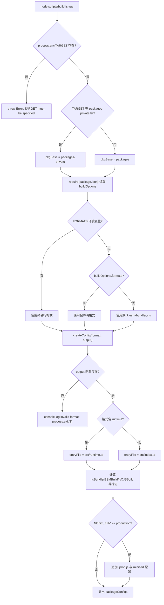

# Capítulo 1: Cognición macro: la filosofía de diseño de ingeniería del repositorio core

Antes de comenzar a rastrear cualquier línea de la implementación de reactividad o del DOM virtual, primero debemos entender la matriz de ingeniería de la que depende la existencia de este código. Al abrir el repositorio Vue core, lo primero que salta a la vista no es la lógica central del framework, sino`package.json`y`pnpm-workspace.yaml`este tipo de archivos de configuración de ingeniería: no contienen ninguna funcionalidad en tiempo de ejecución, pero determinan si todo el framework puede compilarse, probarse y publicarse correctamente. Este capítulo responde precisamente a esta pregunta previa: qué es exactamente el repositorio core. No es`@vue/runtime-core`ese paquete npm, sino la matriz de ingeniería que alberga`runtime-core`、`reactivity`、`compiler-sfc`y más de una decena de paquetes publicados públicamente, además de`sfc-playground`、`template-explorer`y otros paquetes experimentales privados. Comprender la forma de organización de esta matriz es el requisito previo para todos los capítulos posteriores (compilación, tipos, publicación, presupuesto de tamaño). Este capítulo se desarrollará en torno a tres líneas principales: la estructura de doble directorio del workspace, las restricciones unificadas de TypeScript y Rollup a nivel raíz, y la filosofía de desacoplamiento entre el «repositorio de código fuente» y los «artefactos de publicación».

# I. Estructura de doble directorio: el aislamiento físico entre packages y packages-private

## Modelo intuitivo

Imagina el repositorio core como un edificio de I+D.`packages/`es la línea de productos oficial, lo que se produce debe llevar la marca y venderse en el mercado;`packages-private/`es el laboratorio interno, las muestras que contiene solo se usan para depuración y demostración, y nunca se envían al exterior. Ambos comparten el mismo suministro de agua y electricidad (dependencias, herramientas de compilación), pero el sistema de control de acceso (flujo de publicación) los trata de forma diferenciada.

Sin esta capa de aislamiento físico, un paquete playground de depuración interna podría publicarse fácilmente por error en npm; esto no es una suposición, sino un accidente clásico de los monorepos.

## Estructura de datos y diseño de memoria

El límite del workspace está definido por`pnpm-workspace.yaml`. Solo tiene tres líneas de declaración efectivas:

[FACT:pnpm-workspace.yaml:1-3]

```yaml
packages:
  - 'packages/*'
  - 'packages-private/*'
```

Estos dos globs le indican a pnpm:`packages/`y`packages-private/`cada subdirectorio bajo es un paquete independiente. pnpm creará enlaces simbólicos para ellos, de modo que cuando`@vue/runtime-core`haga referencia a`@vue/reactivity`apunte directamente al directorio de código fuente local, en lugar de descargarlo desde el registry.

Inmediatamente después, la sección`catalog:`es el mecanismo de**directorio de versiones de dependencias**de pnpm:

[FACT:pnpm-workspace.yaml:5-13]

```yaml
catalog:
  '@babel/parser': ^7.29.8
  '@babel/types': ^7.29.8
  'entities': '^7.0.1'
  'estree-walker': ^2.0.2
  'magic-string': ^0.30.21
  'source-map-js': ^1.2.1
  'vite': ^8.3.0
  '@vitejs/plugin-vue': ^6.0.9
```

En el`package.json`raíz corresponde lo escrito como`"@babel/parser": "catalog:"` [FACT:package.json:65-65]。`catalog:`es un marcador de posición, y pnpm lo reemplaza durante la instalación por la versión declarada en la sección catalog. El beneficio de hacer esto es:`@babel/parser`la versión de`pnpm-workspace.yaml`se mantiene en un único lugar, y todos los paquetes que la referencian se alinean automáticamente, evitando la deriva de versiones del tipo «el paquete A usa 7.28, el paquete B usa 7.29».

## Walkthrough guiado por escenarios: qué ocurre después de un`pnpm install`Supongamos que ejecutas

en la raíz del repositorio. Sustituyendo este escenario, rastrea paso a paso:`pnpm install`Primer paso: control de acceso preinstall.

**pnpm antes de instalar activará el script**del`package.json`raíz:`preinstall`Copiar

[FACT:package.json:45-45]

```json
"preinstall": "npx only-allow pnpm"
```

> **[Design Inference & Architectural Trade-offs]**
> `only-allow pnpm`, y el modo PnP de yarn cambia las rutas de resolución de módulos, provocando que el comportamiento de`catalog:`en los scripts de compilación sea inconsistente.`createRequire`Segundo paso: resolver el workspace.

**pnpm lee**, escanea`pnpm-workspace.yaml`y`packages/*`, y crea un registro de paquete para cada directorio que contenga`packages-private/*`.`package.json`Tercer paso: aplicar la sustitución de catalog.

**En el**raíz, todos los`package.json``catalog:`El marcador de posición se reemplaza con la versión real del segmento catalog y luego se instala de forma unificada.

**Cuarto paso: hook postinstall.**Se activa después de completar la instalación:

[FACT:package.json:46-46]

```json
"postinstall": "simple-git-hooks"
```

`simple-git-hooks`Leer la raíz`package.json`en el`simple-git-hooks`campo, escribir el hook de Git en`.git/hooks/`：

[FACT:package.json:48-51]

```json
"simple-git-hooks": {
  "pre-commit": "pnpm lint-staged && pnpm check",
  "commit-msg": "node scripts/verify-commit.js"
}
```

`pre-commit`El hook ejecuta lint-staged y verificación de tipos antes de cada commit,`commit-msg`El hook valida el formato del mensaje de commit (Vue usa conventional commits). Nota`preinstall`y`postinstall`simetría: el primero actúa como guardián (solo permite pnpm), el segundo despliega defensas (instala hooks de Git).

## Reflexiones de diseño y errores comunes

> **[Design Inference & Architectural Trade-offs]**
> **¿Por qué usar dos globs en lugar de uno?`packages*/`？**Listar explícitamente dos directorios hace que la semántica de "público" y "privado" sea visible a nivel de configuración. Cualquier nuevo desarrollador que lea`pnpm-workspace.yaml`sabe de inmediato que el repositorio tiene dos tipos de paquetes. Si se escribiera`packages*/`, esta semántica quedaría oculta.

**`allowBuilds`y seguridad de la cadena de suministro.**Presta atención a esta configuración:

[FACT:pnpm-workspace.yaml:15-21]

```yaml
allowBuilds:
  '@parcel/watcher': true
  '@swc/core': true
  'esbuild': true
  'puppeteer': true
  'simple-git-hooks': true
  'unrs-resolver': true
```

pnpm prohíbe por defecto que los paquetes de dependencias ejecuten scripts de instalación (postinstall), porque es un punto de entrada común para ataques a la cadena de suministro.`allowBuilds`es una lista blanca: solo los paquetes listados pueden ejecutar scripts de compilación.`@swc/core`、`esbuild`necesita descargar binarios nativos específicos de la plataforma,`puppeteer`necesita descargar Chromium,`simple-git-hooks`necesita escribir hooks de Git — todos estos son comportamientos legítimos en tiempo de compilación, por lo que se permiten explícitamente.

**`minimumReleaseAge: 1440`El significado profundo de .**Esta línea de configuración exige que las versiones de dependencias recién publicadas deben tener "al menos 24 horas" (1440 minutos) para poder instalarse:

[FACT:pnpm-workspace.yaml:33-33]

```yaml
minimumReleaseAge: 1440
```

> **[Design Inference & Architectural Trade-offs]**
> Este es un mecanismo de período de enfriamiento para defenderse del envenenamiento de la cadena de suministro de npm. Después de que un atacante secuestra un paquete y publica una versión maliciosa, generalmente se descubre y se retira en cuestión de horas. Establecer un período de enfriamiento de 24 horas permite que el repositorio core evite esta ventana. Y`minimumReleaseAgeExclude`permite excepciones para parches de seguridad específicos:

[FACT:pnpm-workspace.yaml:36-38]

```yaml
minimumReleaseAgeExclude:
  # Renovate security update: vitest@4.1.11
  - vitest@4.1.11
```

El comentario aclara explícitamente que esta es una actualización de seguridad activada por Renovate, que debe aplicarse de inmediato, por lo que se exime del período de enfriamiento.

---

# Dos, tsconfig raíz: restricciones unificadas de los límites de tipos de todos los subpaquetes

## Modelo intuitivo

Si cada subpaquete mantiene su propio tsconfig, aparecerán grietas como "el paquete A usa`strict: false`, el paquete B usa`strict: true`". El tsconfig raíz es la**constitución**: establece las reglas de tipos que todos los subpaquetes deben cumplir conjuntamente; los subpaquetes solo pueden agregar sobre esta base, no pueden violarla.

## Estructura de datos y diseño de memoria

Raíz`tsconfig.json`de`compilerOptions`es la base de todo el sistema de tipos del repositorio. Seleccionemos algunos campos clave:

[FACT:tsconfig.json:5-29]

```json
"target": "es2016",
"module": "esnext",
"moduleResolution": "bundler",
"strict": true,
"noUnusedLocals": true,
"isolatedModules": true,
"isolatedDeclarations": true,
"composite": true,
"paths": {
  "@vue/compat": ["./packages/vue-compat/src"],
  "@vue/*": ["./packages/*/src"],
  "vue": ["./packages/vue/src"]
}
```

Interpretación uno por uno:

- `target: es2016`: la sintaxis de salida se degrada a ES2016. Esto se corresponde con`target`de esbuild en la configuración de Rollup (`isServerRenderer || isCJSBuild ? 'es2019' : 'es2016'` [FACT:rollup.config.js:337-337]）。
- `moduleResolution: bundler`: adopta la resolución de módulos estilo empaquetador, permite omitir extensiones, admite el campo`exports`.
- `strict: true`: activa todas las verificaciones estrictas, incluyendo`strictNullChecks`、`noImplicitAny`etc.
- `noUnusedLocals: true`: las variables locales no utilizadas generan error directamente. Esta regla tiene significado práctico junto con Tree-shaking — las variables no utilizadas suelen ser señales de código muerto.
- `isolatedModules: true`: requiere que cada archivo pueda transpilarse de forma independiente. Este es el requisito previo para herramientas como esbuild/swc que "transpilan archivo por archivo, sin análisis de tipos entre archivos".
- `isolatedDeclarations: true`: requiere que todas las exportaciones tengan anotaciones de tipo explícitas. Esta regla sirve directamente a la canalización de generación de`.d.ts`— solo las anotaciones explícitas permiten que`tsc`genere rápidamente archivos de declaración sin realizar inferencia de tipos completa.
- `composite: true`: activa los metadatos de compilación incremental necesarios para las referencias de proyecto (project references).

`paths`El campo es el**espejo de la capa de tipos**：`@vue/*`del workspace, mapeado a`./packages/*/src`, permitiendo que TypeScript resuelva directamente al código fuente en tiempo de compilación, en lugar de a los enlaces simbólicos en`node_modules`. Esto complementa los enlaces simbólicos en tiempo de ejecución de pnpm — en tiempo de ejecución se depende de pnpm, en tiempo de compilación se depende de paths.

## Walkthrough guiado por escenarios: una verificación de tipos de`pnpm check`

`check`El script es`tsc --incremental --noEmit` [FACT:package.json:15-15]. Sustituyendo este escenario:

**Primer paso: leer el alcance de include.**El`include`de tsconfig determina qué archivos participan en la verificación:

[FACT:tsconfig.json:31-39]

```json
"include": [
  "packages/global.d.ts",
  "packages/*/src",
  "packages/*/__tests__",
  "packages/vue/jsx-runtime",
  "packages/runtime-dom/types/jsx.d.ts",
  "scripts/*",
  "rollup.*.js"
]
```

Nota`scripts/*`y`rollup.*.js`también están dentro del alcance de verificación. Esto significa que los propios scripts de compilación también están sujetos a restricciones de tipos —`rollup.config.js`en la parte superior de`// @ts-check` [FACT:rollup.config.js:1-1]junto con las anotaciones de tipo JSDoc, permiten que este archivo puramente JS también pueda ser verificado por`tsc`.

**Segundo paso: aplicar la exclusión de exclude.**

[FACT:tsconfig.json:40-40]

```json
"exclude": ["packages-private/sfc-playground/src/vue-dev-proxy*"]
```

> **[Design Inference & Architectural Trade-offs]**
> `sfc-playground`En`vue-dev-proxy`el archivo

**está excluido. ¿Por qué? Este tipo de archivos suelen ser código proxy generado dinámicamente en tiempo de ejecución, cuya forma de tipos es inestable, y incluirlos en la verificación generaría ruido.** `--incremental`Tercer paso: verificación incremental.`tsc`permite que`.tsbuildinfo`almacene en caché los resultados de la verificación anterior en`--noEmit`, verificando solo los archivos modificados.

## indica solo verificar sin emitir — la verificación de tipos y la generación de artefactos son dos canalizaciones independientes.

**`isolatedDeclarations`Reflexiones de diseño y errores comunes**El costo y beneficio de .`export function foo(): number`Después de activar esta regla, cualquier exportación debe tener anotado explícitamente el tipo de retorno, por ejemplo`export function foo() { return 1 }`en lugar de`.d.ts`. Esto aumenta el costo de escritura, pero a cambio se obtiene una mejora sustancial en la velocidad de generación de`tsc`—`build-dts`puede producir archivos de declaración sin necesidad de inferencia entre archivos. Esto se corresponde con`tsc -p tsconfig.build.json --noCheck`en el script`--noCheck`la bandera

**`types`: dado que los tipos ya están anotados explícitamente, al generar archivos de declaración incluso se puede omitir la verificación.**

[FACT:tsconfig.json:21-21]

```json
"types": ["vitest/globals", "puppeteer", "node"]
```

Copiar`describe`、`it`、`expect`Estos tres paquetes de tipos se inyectan globalmente, lo que significa que los archivos de prueba pueden usar directamente`puppeteer`sin necesidad de import, y las pruebas e2e pueden usar directamente los tipos de

---

# III. Configuración de Rollup: de buildOptions a una fábrica unificada de artefactos multiformato

## Modelo intuitivo

La configuración de Rollup es el**taller de ensamblaje final**del repositorio core. No le importa qué hace específicamente un paquete, solo le importa «qué formatos debe producir este paquete, dónde está el archivo de entrada de cada formato y qué dependencias deben externalizarse». El campo`package.json`en el`buildOptions`de cada subpaquete es la orden de envío pegada al paquete, y el taller de ensamblaje final trabaja siguiendo esa orden.

## Estructura de datos y diseño de memoria

En la entrada del archivo de configuración se establece el modelo de «construcción por paquete»:

[FACT:rollup.config.js:32-44]

```js
if (!process.env.TARGET) {
  throw new Error('TARGET package must be specified via --environment flag.')
}
...
const privatePackages = fs.readdirSync('packages-private')
const pkgBase = privatePackages.includes(process.env.TARGET)
  ? `packages-private`
  : `packages`
const packagesDir = path.resolve(__dirname, pkgBase)
const packageDir = path.resolve(packagesDir, process.env.TARGET)
...
const pkg = require(resolve(`package.json`))
const packageOptions = pkg.buildOptions || {}
const name = packageOptions.filename || path.basename(packageDir)
```

Diseño clave:`TARGET`La variable de entorno especifica qué paquete construir. La configuración determina mediante`fs.readdirSync('packages-private')`si el paquete pertenece al directorio público o privado, decidiendo así`pkgBase`. Esta es una**detección de directorio en tiempo de ejecución**—no es necesario mantener una lista de «qué paquetes son privados», la estructura de directorios en sí misma es la verdad.

`buildOptions`Es un campo personalizado en el subpaquete`package.json`,`packageOptions.filename`determina el prefijo del nombre del archivo de artefacto,`packageOptions.formats`determina el formato de construcción predeterminado.

La asignación de formato a artefacto está definida por`outputConfigs`:

[FACT:rollup.config.js:58-88]

```js
const outputConfigs = {
  'esm-bundler': { file: resolve(`dist/${name}.esm-bundler.js`), format: 'es' },
  'esm-browser': { file: resolve(`dist/${name}.esm-browser.js`), format: 'es' },
  cjs:           { file: resolve(`dist/${name}.cjs.js`),         format: 'cjs' },
  global:        { file: resolve(`dist/${name}.global.js`),      format: 'iife' },
  'esm-bundler-runtime': { file: resolve(`dist/${name}.runtime.esm-bundler.js`), format: 'es' },
  'esm-browser-runtime': { file: resolve(`dist/${name}.runtime.esm-browser.js`), format: 'es' },
  'global-runtime':      { file: resolve(`dist/${name}.runtime.global.js`),      format: 'iife' },
}
```

Siete formatos, que cubren tres escenarios de consumo:`esm-bundler`para consumo de empaquetadores como Vite/webpack,`esm-browser`para consumo de ESM nativo del navegador,`global`para consumo de la etiqueta`<script>`. Los que llevan el sufijo`-runtime`son construcciones «solo runtime», abiertas únicamente para el paquete principal`vue`.

## Walkthrough guiado por escenarios: flujo de decisión completo de una`pnpm build vue`

Ejecutando el escenario`node scripts/build.js vue`.`TARGET=vue`, rastreando las decisiones dentro de`createConfig`:

**Primer paso: determinar la lista de formatos.**

[FACT:rollup.config.js:91-92]

```js
const defaultFormats = ['esm-bundler', 'cjs']
const inlineFormats = process.env.FORMATS && process.env.FORMATS.split(',')
const packageFormats = inlineFormats || packageOptions.formats || defaultFormats
const packageConfigs = process.env.PROD_ONLY
  ? []
  : packageFormats.map(format => createConfig(format, outputConfigs[format]))
```

Prioridad: línea de comandos`FORMATS`> subpaquete`buildOptions.formats`> predeterminado`['esm-bundler', 'cjs']`。`PROD_ONLY`Si la variable de entorno es verdadera, se omiten las construcciones no de producción, conservando solo la configuración de`.prod.js`añadida posteriormente.

**Segundo paso: calcular los indicadores de construcción.** `createConfig`Internamente se derivan un conjunto de indicadores booleanos a partir de la cadena de formato:

[FACT:rollup.config.js:131-142]

```js
const isProductionBuild = process.env.__DEV__ === 'false' || /\.prod\.js$/.test(output.file)
const isBundlerESMBuild = /esm-bundler/.test(format)
const isBrowserESMBuild = /esm-browser/.test(format)
const isServerRenderer = name === 'server-renderer'
const isCJSBuild = format === 'cjs'
const isGlobalBuild = /global/.test(format)
const isCompatPackage = pkg.name === '@vue/compat'
const isCompatBuild = !!packageOptions.compat
const isBrowserBuild =
  (isGlobalBuild || isBrowserESMBuild || isBundlerESMBuild) &&
  !packageOptions.enableNonBrowserBranches
```

Estos indicadores son la**única fuente de verdad**para todas las decisiones posteriores: selección de archivo de entrada, reemplazo de define, determinación de external, ensamblaje de plugins, todo depende de ellos.

**Tercer paso: seleccionar el archivo de entrada.**

[FACT:rollup.config.js:159-168]

```js
let entryFile = /runtime$/.test(format) ? `src/runtime.ts` : `src/index.ts`

if (isCompatPackage && (isBrowserESMBuild || isBundlerESMBuild)) {
  entryFile = /runtime$/.test(format)
    ? `src/esm-runtime.ts`
    : `src/esm-index.ts`
}
```

La entrada predeterminada es`src/index.ts`, las construcciones solo runtime usan`src/runtime.ts`. El paquete compat (`@vue/compat`, es decir, la construcción compatible con Vue 2) necesita proporcionar tanto exportaciones default como named, lo que haría que Rollup reporte errores para objetivos no ESM, por lo que para la construcción ESM se usa una entrada`esm-index.ts` / `esm-runtime.ts`separada.

**Cuarto paso: generar la tabla de reemplazo de define.** `resolveDefine`Se reemplazan constantes en tiempo de compilación como`__DEV__`、`__BROWSER__`en el código fuente por literales:

[FACT:rollup.config.js:170-201]

```js
const replacements = {
  __COMMIT__: `"${process.env.COMMIT}"`,
  __VERSION__: `"${masterVersion}"`,
  __TEST__: `false`,
  __BROWSER__: String(isBrowserBuild),
  __GLOBAL__: String(isGlobalBuild),
  __ESM_BUNDLER__: String(isBundlerESMBuild),
  __ESM_BROWSER__: String(isBrowserESMBuild),
  __CJS__: String(isCJSBuild),
  __SSR__: String(!isGlobalBuild),
  __COMPAT__: String(isCompatBuild),
  __FEATURE_SUSPENSE__: `true`,
  __FEATURE_OPTIONS_API__: isBundlerESMBuild ? `__VUE_OPTIONS_API__` : `true`,
  __FEATURE_PROD_DEVTOOLS__: isBundlerESMBuild ? `__VUE_PROD_DEVTOOLS__` : `false`,
  __FEATURE_PROD_HYDRATION_MISMATCH_DETAILS__: isBundlerESMBuild ? `__VUE_PROD_HYDRATION_MISMATCH_DETAILS__` : `false`,
}
```

Aquí hay una estratificación ingeniosa:**los feature flags no se codifican de forma rígida en la construcción esm-bundler, sino que se conservan como identificadores como`__VUE_OPTIONS_API__`**, dejándolos al empaquetador del usuario final para que los reemplace. Así el usuario puede desactivar el soporte de Options API mediante`define: { __VUE_OPTIONS_API__: false }`, permitiendo que el código relacionado sea eliminado por Tree-shaking. En cambio, en las construcciones global/esm-browser, estos flags se codifican de forma rígida como`true`/`false`, porque los artefactos consumidos directamente por el navegador no tienen intervención de un empaquetador.

**Quinto paso: permitir la sobrescritura por variables de entorno.**

[FACT:rollup.config.js:208-216]

```js
// allow inline overrides like
//__RUNTIME_COMPILE__=true pnpm build runtime-core
Object.keys(replacements).forEach(key => {
  if (key in process.env) {
    const value = process.env[key]
    assert(typeof value === 'string')
    replacements[key] = value
  }
})
```

Cualquier clave de define puede sobrescribirse mediante una variable de entorno del mismo nombre. El ejemplo dado en los comentarios es`__RUNTIME_COMPILE__=true pnpm build runtime-core`—utilizado para depurar una rama de compilación específica.

**Sexto paso: ensamblar la cadena de plugins.**

[FACT:rollup.config.js:324-342]

```js
plugins: [
  json({ namedExports: false }),
  alias({ entries }),
  enumPlugin,
  ...resolveReplace(),
  esbuild({
    tsconfig: path.resolve(__dirname, 'tsconfig.json'),
    sourceMap: output.sourcemap,
    minify: false,
    target: isServerRenderer || isCJSBuild ? 'es2019' : 'es2016',
    define: resolveDefine(),
  }),
  ...resolveNodePlugins(),
  ...plugins,
],
```

El orden de los plugins es importante:`json`primero se procesan las importaciones JSON,`alias`se mapea`@vue/*`a la ruta del código fuente,`enumPlugin`se hace inline de enums,`replace`se hace reemplazo de cadenas,`esbuild`se hace transpilación de TS. Nótese que el`esbuild`de`tsconfig`apunta al tsconfig raíz—**todos los subpaquetes comparten la misma configuración de tipos**, esto es precisamente la manifestación en tiempo de construcción de la «constitución» discutida en la segunda sección.

**Séptimo paso: adición de la construcción de producción.**Si`NODE_ENV=production`：

[FACT:rollup.config.js:97-114]

```js
if (process.env.NODE_ENV === 'production') {
  packageFormats.forEach(format => {
    if (packageOptions.prod === false) {
      return
    }
    if (format === 'cjs') {
      packageConfigs.push(createProductionConfig(format))
    }
    if (/^(global|esm-browser)(-runtime)?/.test(format)) {
      packageConfigs.push(createMinifiedConfig(format))
    }
  })
}
```

Al formato CJS se le añade una versión`.prod.js`(reemplazando con`__DEV__=false`), y a los formatos global y esm-browser se les añade una versión comprimida (usando swc para minificar).`packageOptions.prod === false`Los paquetes de

pueden salir de este mecanismo.



## Copiar

**`external`Reflexiones de diseño y trampas** `resolveExternal`La estrategia de tres ramas de

[FACT:rollup.config.js:257-283]

```js
function resolveExternal() {
  const treeShakenDeps = ['source-map-js', '@babel/parser', 'estree-walker', 'entities/decode']

  if (isGlobalBuild || isBrowserESMBuild || isCompatPackage) {
    if (!packageOptions.enableNonBrowserBranches) {
      return treeShakenDeps
    }
  } else {
    return [
      ...Object.keys(pkg.dependencies || {}),
      ...Object.keys(pkg.peerDependencies || {}),
      ...['path', 'url', 'stream'],
      ...treeShakenDeps,
    ]
  }
}
```

Copiar`treeShakenDeps`Las construcciones de navegador (global/esm-browser) incorporan todas las dependencias, listando solo`dependencies`como external para suprimir advertencias—estas dependencias no se referencian realmente en la rama de navegador y serán eliminadas por Tree-shaking. Las construcciones Node/esm-bundler externalizan todos los`peerDependencies`y

**`onwarn`, dejando que el consumidor gestione las versiones de dependencias por sí mismo.**

[FACT:rollup.config.js:344-348]

```js
onwarn: (msg, warn) => {
  if (msg.code !== 'CIRCULAR_DEPENDENCY') {
    warn(msg)
  }
},
```

Copiar`runtime-core`Las advertencias de dependencias circulares se silencian. Entre`reactivity`y

**`treeshake.moduleSideEffects: false`de Vue existe una referencia circular legítima (el sistema de reactividad necesita referenciar el tipo de instancia de componente), estos ciclos son seguros en tiempo de ejecución, por lo que se filtran.**

[FACT:rollup.config.js:355-355]

```js
treeshake: {
  moduleSideEffects: false,
},
```

.**Copiar**Esto le dice a Rollup: todos los módulos no tienen efectos secundarios, se pueden eliminar con confianza las importaciones no referenciadas. Esta es una

**suposición agresiva`pure_getters`—si algún módulo ejecuta código con efectos secundarios en el nivel superior (como registrar variables globales), podría eliminarse erróneamente. El código fuente de Vue garantiza por convención que todos los módulos son puros, por lo que se puede activar esta optimización.**

[FACT:rollup.config.js:373-388]

```js
async renderChunk(contents, _, { format }) {
  const { code } = await minifySwc(contents, {
    module: format === 'es',
    format: { comments: false },
    compress: { ecma: 2016, pure_getters: true },
    safari10: true,
    mangle: true,
  })
  return { code: banner + code, map: null }
}
```

`pure_getters: true`de swc-minify.`obj.foo`Copiar`track()`) en lugar de completarse mediante efectos secundarios implícitos del getter, por lo que es seguro.`map: null`indica que no se genera sourcemap tras la compresión—los artefactos de producción no necesitan mapas de depuración.

---

# Reflexión de diseño: por qué el repositorio de código fuente y los artefactos de publicación deben desacoplarse

Volvamos a la proposición central de este capítulo. El diseño de ingeniería del repositorio core tiene una línea principal que lo atraviesa de principio a fin:**La responsabilidad del repositorio de código fuente es «producir», la responsabilidad de los artefactos de publicación es «consumir», y ambos se desacoplan mediante la tubería de construcción**。

Esto se refleja concretamente en tres niveles:

**Primero, el código fuente no se publica directamente.** `package.json`de`private: true` [FACT:package.json:2-2]indica que el paquete raíz nunca se publica. En cada subpaquete, el`package.json`dentro de`main`/`module`/`exports`campo apunta a`dist/`bajo los artefactos, no a`src/`. Cuando el usuario instala`vue`, lo que obtiene es el`.js`y`.d.ts`construidos, mientras que el código fuente permanece en el repositorio.

**Segundo, el formato de los artefactos lo determina el escenario de consumo.**Los siete formatos no son una enumeración arbitraria, sino que corresponden a siete rutas de consumo reales: los usuarios de Vite obtienen`esm-bundler`, los usuarios de CDN obtienen`global`, los usuarios de Node SSR obtienen`cjs`. La lógica de selección de formato se concentra en`rollup.config.js`un solo lugar, y los subpaquetes solo necesitan declarar en`buildOptions.formats`cuáles necesitan.

**Tercero, separación entre tipos e implementación.** `build-dts`El script`tsc -p tsconfig.build.json --noCheck && rollup -c rollup.dts.config.js` [FACT:package.json:9-9]indica que la generación de`.d.ts`es una tubería independiente.`isolatedDeclarations: true`permite que la generación de archivos de declaración omita la verificación de tipos (`--noCheck`), porque los tipos ya están anotados explícitamente.

> **[Design Inference & Architectural Trade-offs]**
> La motivación profunda de este desacoplamiento es:**La forma de organizar el código fuente sirve al desarrollador, la forma de organizar los artefactos sirve al consumidor, y la solución óptima de ambos es diferente**. El código fuente necesita una estructura de directorios clara, información de tipos completa y sourcemaps depurables; los artefactos necesitan el mínimo tamaño, el formato de módulo correcto y una superficie de API estable. Forzar la unificación de ambos (por ejemplo, publicar directamente el código fuente TS) perjudicaría simultáneamente la experiencia de ambos extremos.

---

# Resumen del capítulo

Este capítulo estableció una comprensión macro del repositorio core desde tres dimensiones:

1. **Estructura de doble directorio**：`packages/`y`packages-private/`el aislamiento físico de , junto con los enlaces simbólicos del workspace de pnpm y el catálogo de versiones, logra un límite claro entre «paquetes públicos» y «paquetes privados».`preinstall`La puerta de control de`allowBuilds`, la lista blanca de`minimumReleaseAge`y el período de enfriamiento de

2. **constituyen conjuntamente la línea de defensa de seguridad de la cadena de suministro.**tsconfig a nivel raíz`paths`: como la constitución de tipos de todos los subpaquetes, mediante el mapeo de`isolatedDeclarations`implementa la resolución de workspace en tiempo de compilación, y mediante`composite`y

3. **soporta la construcción incremental y la generación rápida de archivos de declaración.**Fábrica unificada de Rollup`TARGET`: toma la variable de entorno`buildOptions`como punto de entrada, lee la metainformación del subpaquete mediante

, y mediante un conjunto de indicadores booleanos impulsa la selección de entradas, el reemplazo de define, la determinación de external y el ensamblaje de plugins, produciendo finalmente artefactos en siete formatos.**La filosofía central es**el desacoplamiento entre el repositorio de código fuente y los artefactos de publicación

---

# : el repositorio se encarga de producir, los artefactos se encargan de consumir, y la tubería de construcción es el único puente entre ambos.

Transición al final del capítulo`scripts/build.js`Este capítulo respondió a «qué es el repositorio core». Pero la estructura estática del repositorio es solo el escenario; el verdadero drama ocurre durante la ejecución de una solicitud de construcción:

# cómo analizar los argumentos de línea de comandos, cómo invocar la API de Rollup, cómo manejar fallos de construcción y concurrencia. El próximo capítulo rastreará el viaje de extremo a extremo de una solicitud de construcción desde la entrada hasta los artefactos, transformando la comprensión estática establecida en este capítulo en una vista de ejecución dinámica.

Reflexión y autoevaluación de este capítulo`pnpm-workspace.yaml`Q1: Si en`minimumReleaseAge: 1440`se cambia`0`a`minimumReleaseAgeExclude`, ¿qué riesgo se introduciría en escenarios de actualización de dependencias? ¿Por qué la existencia de

**es necesaria?**：

`minimumReleaseAge: 1440` [FACT:pnpm-workspace.yaml:33-33]Análisis de referencia`0`exige que una versión de dependencia recién publicada deba tener al menos 24 horas para poder instalarse. Si se cambiara a

, cualquier versión recién publicada podría incorporarse de inmediato.`@babel/parser`Escenario de riesgo: un atacante secuestra alguna dependencia transitiva (por ejemplo, alguna versión patch de

`minimumReleaseAgeExclude` [FACT:pnpm-workspace.yaml:36-38]) y publica una versión con un script postinstall malicioso. Durante el período de enfriamiento de 24 horas, la comunidad normalmente descubre el problema y retira esa versión; si el período de enfriamiento fuera 0, el CI del repositorio core podría actualizar automáticamente y ejecutar el script malicioso dentro de la ventana de ataque.`vitest@4.1.11`existe porque el mecanismo de enfriamiento entra en conflicto con la urgencia de los parches de seguridad. El

Q2: `rollup.config.js`en el comentario es una actualización de seguridad detectada por Renovate—este tipo de actualizaciones necesita surtir efecto de inmediato, y esperar 24 horas alargaría la ventana de exposición. Por lo tanto, se necesita una lista explícita de exenciones que permita a las actualizaciones de seguridad eludir el período de enfriamiento. Esto refleja el principio de diseño de seguridad de «conservador por defecto, excepciones explícitas».`resolveDefine`En`__FEATURE_OPTIONS_API__`, el tratamiento de`isBundlerESMBuild ? '__VUE_OPTIONS_API__' : 'true'`para`'true'`es

**. Si por error se cambiara a devolver**：

[FACT:rollup.config.js:192-194]

```js
__FEATURE_OPTIONS_API__: isBundlerESMBuild
  ? `__VUE_OPTIONS_API__`
  : `true`,
```

Análisis de referencia`__FEATURE_OPTIONS_API__`Copiar`__VUE_OPTIONS_API__`En la construcción esm-bundler,`define: { __VUE_OPTIONS_API__: false }`se conserva como el identificador`data`、`methods`、`computed`, para que el empaquetador del usuario final lo reemplace. El usuario puede establecer

en su propia configuración de construcción, permitiendo que Tree-shaking elimine todo el código relacionado con Options API (la lógica de manejo de opciones como`'true'`), reduciendo significativamente el tamaño del artefacto.`define`Si se cambiara a devolver

para todos los formatos, entonces el código de Options API en el artefacto esm-bundler quedaría codificado de forma rígida, la configuración de**del usuario dejaría de funcionar y no sería posible hacer Tree-shake. Para un proyecto que solo usa Composition API, esto aumentaría en vano varios KB el tamaño del artefacto.**La idea clave de este diseño es:

Q3: `rollup.config.js`de`resolveExternal`, la compilación para navegador solo devuelve`treeShakenDeps`como external, mientras que la compilación para Node devuelve todos los`dependencies`. Supongamos que algún día alguien añade una nueva dependencia de tiempo de ejecución`runtime-core`a`foo-lib`, pero olvida actualizar la lógica de`resolveExternal`. ¿Qué sucederá en la compilación para navegador?

**Análisis de referencia**：

[FACT:rollup.config.js:257-283]

La compilación para navegador (`isGlobalBuild || isBrowserESMBuild`) al`!packageOptions.enableNonBrowserBranches`solo devuelve`treeShakenDeps`（`source-map-js`、`@babel/parser`、`estree-walker`、`entities/decode`). Esto significa que`foo-lib`no está en la lista de external,

Hasta aquí, hemos visto desde un nivel macro la filosofía de diseño integral del repositorio core como matriz de ingeniería: la estructura de workspace de doble directorio delimita la frontera entre paquetes públicos y paquetes experimentales privados, la configuración raíz de TypeScript y Rollup proporciona restricciones unificadas, y el desacoplamiento entre el repositorio de código fuente y los artefactos de publicación hace posible la salida en múltiples formatos. Estos conocimientos allanan el camino para profundizar en las cadenas de ingeniería concretas. En el próximo capítulo, pasaremos la mirada de la estructura estática al flujo dinámico, tomando`node scripts/build.js vue`como punto de partida, para trazar el viaje de extremo a extremo de una solicitud de compilación completa desde el análisis de argumentos de línea de comandos, la localización del paquete objetivo, la generación de la configuración de Rollup hasta la escritura de artefactos en disco, viendo cómo build.js analiza los flags formats/devOnly/release mediante parseArgs, cómo hace require dinámico del package.json del paquete objetivo y lee buildOptions, y finalmente impulsa a rollup.config.js a producir artefactos en múltiples formatos como esm-bundler, cjs, global, etc.
