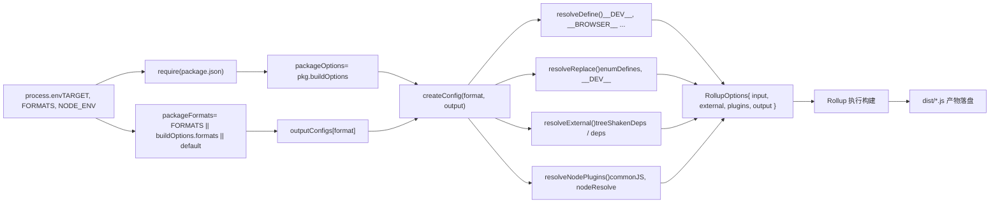

# Capítulo 2: Ciclo de vida del tronco principal: el viaje de extremo a extremo de una solicitud de compilación

En el capítulo anterior aclaramos la posición del repositorio core como matriz de ingeniería, y cómo pnpm workspace y la configuración raíz restringen de forma unificada todos los subpaquetes. Ahora, profundizamos en el núcleo del sistema de compilación, trazando cómo un solo comando impulsa todo el proceso de compilación.`node scripts/build.js vue`parece simple, pero es la única entrada para todos los artefactos —esm-bundler, cjs, global—. Entender cómo traduce la intención del usuario en tareas de compilación ejecutables es un paso clave para dominar el mecanismo de compilación de Vue.

# Generación de la configuración de Rollup: de variables de entorno a artefactos multiformato

`build.js`mediante`exec`tras iniciar Rollup, el control pasa a`rollup.config.js`. Este archivo es el «cerebro» del sistema de compilación: lee variables de entorno y genera dinámicamente un array de objetos de configuración de Rollup.

## Validación de variables de entorno y localización de paquetes

[FACT:rollup.config.js:27-29]

Si`TARGET`no está establecido, lanza un error directamente. Esto es programación defensiva: la configuración de Rollup puede invocarse directamente (como`rollup -c`), y en ese caso no hay`build.js`inyectando variables de entorno, por lo que debe fallar rápidamente.

[FACT:rollup.config.js:32-44]

Aquí se repite la lógica de juicio de paquetes privados de`build.js`, porque`rollup.config.js`es un proceso independiente y no puede compartir el estado en memoria de`build.js`.`resolve`resuelve la ruta relativa a una ruta absoluta dentro del directorio del paquete,`pkg`es el contenido del`package.json`del paquete objetivo,`packageOptions`es el campo`buildOptions`dentro de él,`name`es el prefijo del nombre de archivo del artefacto (se prefiere`buildOptions.filename`, si no, se usa el nombre del directorio).

## Tabla de mapeo de formatos:`outputConfigs`

[FACT:rollup.config.js:58-88]

Esta tabla define el mapeo de 7 formatos a configuraciones de salida. Observaciones clave:

- `esm-bundler`、`esm-browser`、`esm-bundler-runtime`、`esm-browser-runtime`son todos`format: 'es'`, la diferencia está solo en el nombre del archivo.
- `cjs`es`format: 'cjs'`。
- `global`y`global-runtime`es`format: 'iife'`(expresión de función invocada inmediatamente), adecuada para inclusión directa mediante la etiqueta`<script>`.
- `runtime`Los formatos con sufijo`vue`solo tienen sentido para el paquete principal

## : no incluyen el compilador y son de menor tamaño.

[FACT:rollup.config.js:91-92]

Selección de formato: tres niveles de prioridad`FORMATS`La selección de formato sigue tres niveles de prioridad: línea de comandos`buildOptions.formats`variable de entorno > del paquete`['esm-bundler', 'cjs']`。`PROD_ONLY`> por defecto

## La variable de entorno controla si se omite la configuración base: si solo se compila la versión de producción, el array de configuración base queda vacío y posteriormente solo se añade la configuración de producción.

[FACT:rollup.config.js:97-114]

Lógica de adición de la configuración de producción`NODE_ENV === 'production'`Cuando

- , para cada formato:`packageOptions.prod === false`Si
- , se omite (ese paquete no necesita versión de producción).`cjs`Si es`createProductionConfig`, se añade`.prod.js`: genera el archivo
- .`/^(global|esm-browser)(-runtime)?/`Si coincide con`createMinifiedConfig`, se añade

> **[Design Inference & Architectural Trade-offs]**
> 〔Inferencia de diseño y compensaciones arquitectónicas〕`cjs`¿Por qué`createProductionConfig`usa`global`/`esm-browser`mientras que`createMinifiedConfig`usa

## `createConfig`? Porque CJS es para Node, y el entorno de Node no necesita minificación (el usuario se encargará de ello), pero sí necesita distinguir las ramas dev/prod; en cambio, los artefactos que se incluyen directamente en el navegador deben minificarse para reducir el tamaño. Esta diferencia se refleja en la implementación de las dos funciones de fábrica.

`createConfig`: el núcleo de la generación de configuración

[FACT:rollup.config.js:125-142]

es la función más grande; recibe el formato y la configuración de salida, y devuelve el objeto de configuración completo de Rollup.

- `isProductionBuild`Al inicio hay una serie de cálculos de flags booleanos:`__DEV__`: se determina mediante la variable de entorno`.prod.js`o si el nombre del archivo contiene
- `isBundlerESMBuild`、`isBrowserESMBuild`、`isCJSBuild`、`isGlobalBuild`.
- `isServerRenderer`: se determina mediante coincidencia regex del nombre del formato.`server-renderer`。
- `isCompatPackage`、`isCompatBuild`: si el nombre del paquete es
- `isBrowserBuild`: relacionado con la compilación compatible con Vue 2.

: compilación global o compilación ESM para navegador, y sin habilitar la rama no-navegador.`resolveDefine`、`resolveReplace`、`resolveExternal`Estos flags se usan repetidamente en el posterior

[FACT:rollup.config.js:144-157]

y son la base central para diferenciar la configuración.`exports`Configuración básica de salida: encabezado de copyright banner, modo`auto`(los paquetes compat usan`named`, el resto usan`esModule`), interoperabilidad`externalLiveBindings: false`habilitada en la compilación CJS, sourcemap controlado por variables de entorno,`reexportProtoFromExternal: false`y`output.name`son ajustes de compatibilidad de Rollup 4. La compilación global establece adicionalmente`window`, es decir, el nombre de la variable montada en

## .

[FACT:rollup.config.js:159-168]

Selección del archivo de entrada`src/index.ts`La entrada por defecto es`runtime`, pero los formatos con sufijo`src/runtime.ts`。La compilación ESM del paquete compat necesita exportar tanto default como named, por lo que se usa una entrada`esm-index.ts` / `esm-runtime.ts`separada.

## Definiciones de macros:`resolveDefine`

[FACT:rollup.config.js:170-218]

`resolveDefine`Devuelve una tabla de reemplazo que sustituye en el código fuente`__COMMIT__`、`__VERSION__`、`__BROWSER__`y otras macros por literales. Estas macros se usan en el código fuente para compilación condicional — por ejemplo`if (__DEV__) { ... }`en compilaciones de producción se reemplaza por`if (false) { ... }`, y luego es eliminado por Tree-shaking.

Diseño clave:`__FEATURE_OPTIONS_API__`、`__FEATURE_PROD_DEVTOOLS__`Los interruptores de características como`esm-bundler`se conservan en la compilación`__VUE_OPTIONS_API__`como identificadores del tipo`true`, permitiendo que el usuario final los sobrescriba mediante la configuración del empaquetador; mientras que en otras compilaciones se codifican directamente como`false`。

[FACT:rollup.config.js:203-206]

o`esm-bundler`Las compilaciones no`__DEV__`codifican directamente

[FACT:rollup.config.js:210-216]

, porque sus ramas dev/prod ya están determinadas en tiempo de compilación.`__RUNTIME_COMPILE__=true pnpm build runtime-core`El último paso permite que las variables de entorno sobrescriban cualquier definición de macro, soportando sobrescrituras en línea como

## Plugin de reemplazo:`resolveReplace`

[FACT:rollup.config.js:222-255]

`resolveReplace`Maneja fuera de`resolveDefine`los reemplazos que esbuild no puede procesar:

- Fusiona`enumDefines`(definiciones de inline de enum provenientes de`inlineEnums`).
- En compilaciones de producción para navegador, añade la anotación`/*@__PURE__*/`a las funciones de creación de errores para ayudar al Tree-shaking.
- `esm-bundler`En la compilación`__DEV__`,`!!(process.env.NODE_ENV !== 'production')`se reemplaza por
- , dejando que el empaquetador decida.`process.env`En compilaciones ESM para navegador,

## se reemplaza por un objeto vacío para evitar errores en el navegador.`resolveExternal`

[FACT:rollup.config.js:257-283]

Dependencias externas:`treeShakenDeps`Este es el núcleo de la pregunta de reflexión al final del capítulo anterior. La compilación para navegador solo devuelve`dependencies`como external — estas dependencias, aunque se importan, no se ejecutan realmente en la rama de navegador; se listan aquí solo para suprimir las advertencias de Rollup. Las compilaciones Node/ESM-bundler externalizan todos`peerDependencies`y`path`、`url`、`stream`, así como módulos integrados de Node como

## .

[FACT:rollup.config.js:319-352]

Objeto de configuración final

- `input`El objeto de configuración devuelto contiene:
- `external`: ruta absoluta del archivo de entrada.
- `plugins`: lista de dependencias externas.
- `output`: array de plugins, en orden json → alias → enumPlugin → replace → esbuild → nodePlugins.
- `onwarn`: configuración de salida.`CIRCULAR_DEPENDENCY`: filtra las advertencias
- `treeshake.moduleSideEffects: false`(existen dependencias circulares en el código fuente de Vue, pero son inofensivas en tiempo de ejecución).

: indica a Rollup que todos los módulos no tienen efectos secundarios, Tree-shaking agresivo.

# Copiar

## `exec`Escritura en disco de artefactos y verificación de tamaño

`build.js`Gestión de procesos de`exec`Inicia el subproceso de Rollup mediante

[FACT:scripts/utils.js:64-114]

`exec`:`spawn`encapsula

- `stdio`, devolviendo una Promise. Diseño clave:`['ignore', 'pipe', 'pipe']`por defecto es
- `shell: process.platform === 'win32'`—stdin ignorado, stdout/stderr capturados por pipe.
- —en Windows se necesita shell para analizar correctamente el comando.`stderrChunks`Recopila la salida mediante`stdoutChunks`y el array`exit`, concatenando en el evento
- .

> **[Design Inference & Architectural Trade-offs]**
> 〔Inferencia de diseño y compensaciones arquitectónicas〕`build.js`Nota:`exec`al llamar a`{ stdio: 'inherit' }`se pasa

## , lo que sobrescribe la configuración de pipe predeterminada, haciendo que la salida de Rollup se transmita directamente a la terminal. Este es el comportamiento correcto de una herramienta de compilación — el usuario necesita ver el progreso de la compilación en tiempo real.`checkAllSizes`

[FACT:scripts/build.js:206-215]

Verificación de tamaño:`devOnly`La verificación de tamaño tiene dos condiciones de omisión:`global`es verdadero, o se especificó un formato pero no contiene

[FACT:scripts/build.js:222-228]

`checkSize`. Porque la verificación de tamaño solo aplica a los artefactos de compilación global — esos son los archivos que el usuario final importa directamente, y el tamaño es lo más sensible.`${target}.global.prod.js`Verifica dos archivos:`${target}.runtime.global.prod.js`y`global-runtime`(el último solo se verifica cuando no se especifica formato o se especifica

[FACT:scripts/build.js:235-264]

`checkFileSize`).`gzipSync`Lee el archivo, calcula el tamaño comprimido con`brotliCompressSync`y`prettyBytes`, y formatea la salida con`writeSize`. Si`temp/size/${fileName}.json`es verdadero, escribe el resultado en

## — esta es la fuente de datos para la verificación de presupuesto de tamaño en CI.

[FACT:scripts/build.js:94-108]

Compilación de declaraciones de tipo`buildTypes`Si`pnpm run build-dts`es verdadero, llama a`--environment TARGETS:...`, y pasa la lista de objetivos mediante

# . Esto asegura que solo se generen declaraciones de tipo para los paquetes realmente compilados.

**Reflexiones de diseño y trampas en producción`--environment`¿Por qué usar**en lugar de pasar parámetros directamente?`--environment`El`process.env`de Rollup es la única forma de pasar parámetros que puede leerse en el archivo de configuración mediante`--config`. Pasar directamente el parámetro`process.argv`requiere analizar`--environment`, mientras que

**`fuzzyMatchTarget`proporciona un análisis estructurado de pares clave-valor.** `target.match(partialTarget)`La trampa de las expresiones regulares en`partialTarget`.`runtime-core`，`-`En`runtime.core`，`.`es entrada del usuario. Si el usuario ingresa

**como literal en la expresión regular, no hay problema; pero si ingresa** `runParallel`coincidirá con cualquier carácter, pudiendo coincidir con objetivos inesperados. Este es el riesgo inherente de la coincidencia difusa, pero los nombres de paquetes de Vue no contienen caracteres especiales de regex, por lo que en la práctica no se activa.`cpus().length`Competencia de recursos en compilaciones concurrentes.`--max-old-space-size`usa

**`scanEnums`como límite de concurrencia, pero cada proceso de Rollup también inicia workers. En contenedores CI con pocos núcleos, esto puede causar desbordamiento de memoria. En producción, si se encuentra OOM, se puede mitigar mediante** `removeCache`o reduciendo el número de concurrencias.`finally`Ciclo de vida de la caché de`scanEnums`.`removeCache`se llama en`finally`, pero si`scanEnums`mismo lanza un error,`try`no se asigna, y la llamada en

**`resolveExternal`fallará. En realidad, la función devuelta por**ya está determinada antes de`runtime-core`, por lo que este riesgo no existe — pero este es un detalle de secuencia temporal que hay que confirmar al leer.`resolveExternal`Riesgo de omisión en

# .

La pregunta de reflexión del capítulo anterior ya señaló: si se añade una nueva dependencia a`node scripts/build.js vue`pero se olvida actualizar

1. `parseArgs`, la compilación para navegador incluirá esa dependencia en el bundle (porque no está en la lista de external), causando un aumento de tamaño. Este es el costo inherente de la estrategia de «external por lista blanca».`commit`Resumen del capítulo

2. `run()`Un viaje completo de`scanEnums`:`fuzzyMatchTarget`analiza la línea de comandos,`allTargets`）。

3. `buildAll`se obtiene de forma síncrona.`runParallel`llama a`build`。

4. `build`para generar la caché de enum, analiza los objetivos (`package.json`o`dist`mediante`--environment`programa concurrentemente`exec`Iniciar Rollup.

5. `rollup.config.js`Leer variables de entorno, mediante`createConfig`generar el arreglo de configuración,`resolveDefine`/`resolveReplace`/`resolveExternal`procesar respectivamente macros, reemplazos y dependencias externas.

6. Rollup ejecuta la compilación, los artefactos se escriben en disco en`dist/`。

7. `checkAllSizes`Calcular el tamaño gzip/brotli, opcionalmente escribir en`temp/size/`。

8. Si`--withTypes`, llamar a`build-dts`generar declaraciones de tipos.

# Reflexiones y autoevaluación de este capítulo

Q1: En`build.js`de`build`función,`if (!formats && fs.existsSync(...))`esta condición determina si se elimina`dist`directorio. Si se quita`!formats`esta condición (es decir, eliminar`dist`independientemente de si se especifica el formato), en`pnpm build-all-cjs`en un script como este, ¿qué sucedería?

**Análisis de referencia**：

[FACT:scripts/build.js:172-175]

`pnpm build-all-cjs`corresponde a`node scripts/build.js vue runtime compiler reactivity shared -af cjs`(ver[FACT:package.json:40]). Especifica`-f cjs`, por lo que`formats`es`'cjs'`，`!formats`es falso, la lógica actual no eliminará`dist`。

Si se quita`!formats`, cada compilación eliminará`dist`. Pero`build-all-cjs`solo compila`cjs`formato, tras la eliminación`dist`solo queda`cjs`artefacto, los previamente compilados`esm-bundler`、`global`y otros formatos se pierden por completo. Más grave aún,`build-runtime-esm`、`build-browser-esm`y otros scripts se ejecutarán secuencialmente (ver[FACT:package.json:39]de`build-sfc-playground`script), cada script eliminará los artefactos del script anterior, provocando que al final`dist`solo contenga el formato del último script. Esto rompería la compilación de SFC Playground — que necesita que coexistan artefactos de múltiples formatos.

Q2: `runParallel`En`if (maxConcurrency <= source.length)`¿cuál es la función de esta condición? Si se quita, al compilar un solo paquete (`targets.length === 1`), ¿qué sucedería?

**Análisis de referencia**：

[FACT:scripts/build.js:131-151]

Esta condición controla si se habilita la limitación de concurrencia. Cuando`maxConcurrency > source.length`, no se necesita limitación — todas las tareas pueden iniciarse simultáneamente. Si se quita esta condición, incluso con una sola tarea, se creará`executing`arreglo y se ejecutará`await Promise.race(executing)`。

Para una sola tarea,`executing`solo hay una Promise`e`，`Promise.race`que esperará a que se complete. Esto no causará errores, pero introducirá cadenas de Promise innecesarias y sobrecarga de programación de microtareas. Más importante aún,`executing.splice(executing.indexOf(e), 1)`sigue funcionando correctamente en escenarios de una sola tarea, así que funcionalmente no hay diferencia, solo una pequeña pérdida de rendimiento.

El riesgo real está en: si`maxConcurrency`es 0 (teóricamente imposible, porque`cpus().length`es al menos 1),`executing.length >= 0`siempre es verdadero,`Promise.race([])`se colgará indefinidamente. Pero`cpus().length`garantiza que este límite no se active.

Q3: `resolveExternal`En`treeShakenDeps`, la compilación de navegador devuelve

**como external, pero estas dependencias no se ejecutarán realmente en la rama de navegador. Si se eliminan de la lista external (es decir, dejar que Rollup intente empaquetarlas), ¿qué sucedería?**：

[FACT:rollup.config.js:257-283]

`treeShakenDeps`Análisis de referencia`source-map-js`、`@babel/parser`、`estree-walker`、`entities/decode`incluye`compiler-sfc`. Estas son dependencias de paquetes como`__BROWSER__`, excluidas por compilación condicional mediante

macro en la compilación de navegador.`treeshake.moduleSideEffects: false`（[FACT:rollup.config.js:355-355]Si se eliminan de external, Rollup intentará resolver y empaquetar estas dependencias. Dado que`if (!__BROWSER__)`), y las declaraciones de importación de estas dependencias están en`__BROWSER__`rama, el define de esbuild reemplazará`true`con

, marcando la rama como código muerto. El Tree-shaking de Rollup eliminará estas importaciones, y el artefacto final no incluirá el código de estas dependencias.`onwarn`Pero el problema es: Rollup necesita resolver los módulos antes del Tree-shaking. Si estas dependencias no están instaladas (por ejemplo, en un entorno CI reducido), Rollup reportará un error de "no se puede resolver el módulo". Listarlas como external es una medida defensiva — incluso si las dependencias no existen, Rollup no intentará resolverlas, solo emitirá advertencias (y

filtrará las advertencias de dependencias no circulares).`scripts/dev.js`Hasta aquí, hemos recorrido completamente el viaje de compilación desde el análisis de comandos hasta la invocación de Rollup, revelando mecanismos centrales como la programación concurrente y el filtrado de paquetes privados. Sin embargo, la compilación de producción es solo la mitad de la historia. En el próximo capítulo, nos dirigiremos a la cadena en modo desarrollo, para ver
