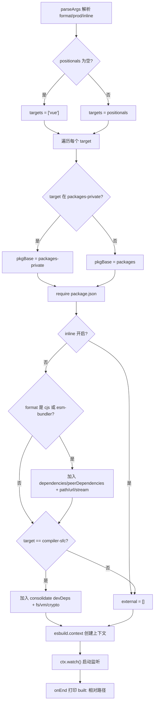
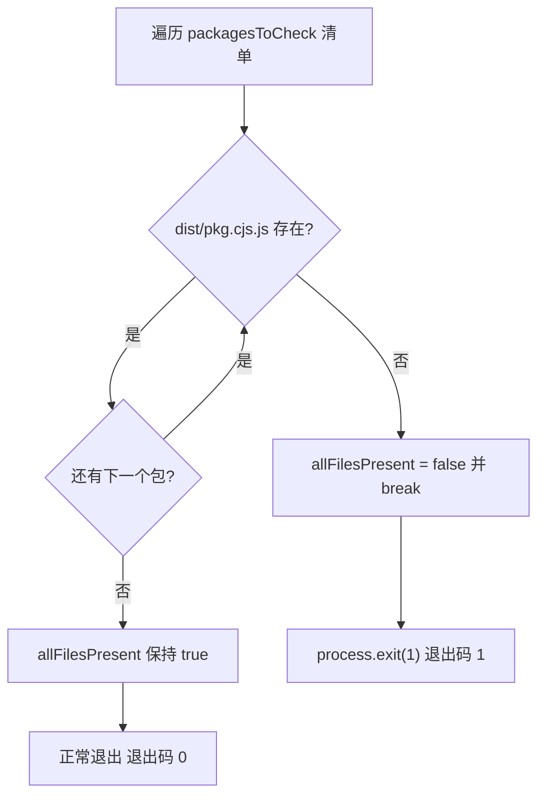
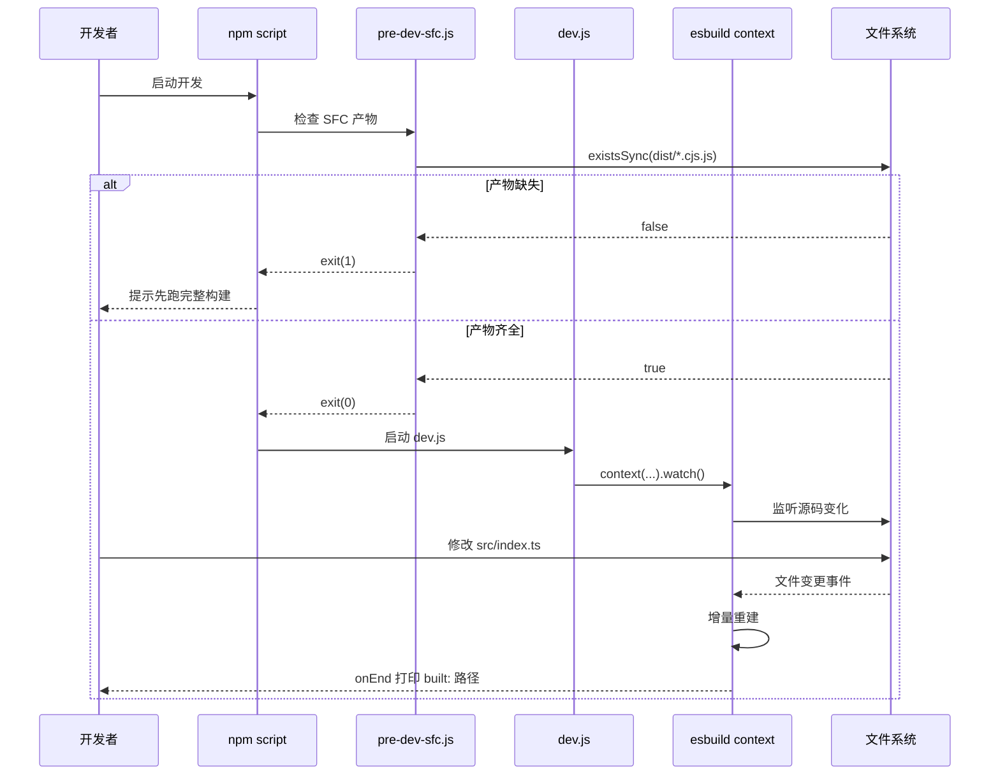

# Capítulo siguiente: Capítulo 3 →

Estado de verificación: FACT anclaje real de números de línea`scripts/dev.js`En el capítulo anterior rastreamos la cadena completa de la compilación de producción desde el análisis de parámetros hasta la escritura en disco de artefactos multi-formato; esa cadena persigue la integridad y normalización de los artefactos. Pero la demanda central del modo desarrollo es solo una: modificar una línea de código y ver el efecto inmediatamente en el navegador. La cadena de compilación de producción de "analizar parámetros → generar configuración → empaquetado completo → escritura en disco" tarda decenas de segundos, incapaz de satisfacer esta demanda. El repositorio de Vue core mantiene por ello una cadena independiente en modo desarrollo:`scripts/pre-dev-sfc.js`usa el modo watch de esbuild para compilación incremental,

# precompila el compilador de SFC antes de la compilación principal. Este capítulo desglosa el mecanismo de colaboración de ambos.

## 3.1 dev.js: el compilador incremental que cambia velocidad por esbuild

Modelo intuitivo[FACT:scripts/dev.js:3-5]

La compilación de producción es como "la imprenta formal maquetando e imprimiendo" — prioriza la calidad, no importa ser más lento; la compilación de desarrollo es como "un boceto a lápiz en papel borrador" — no busca belleza, solo que se plasme al instante. Vue elige esbuild en lugar de Rollup para dibujar este boceto, la razón está escrita en el comentario al inicio del archivo: los artefactos de Rollup son más pequeños y su Tree-shaking mejor, pero esbuild es mucho más rápido.

## Sin este script, los desarrolladores tendrían que ejecutar una compilación de producción completa cada vez que hagan un cambio, el ciclo de retroalimentación degeneraría de milisegundos a minutos, y la experiencia de hot update desaparecería por completo.

Análisis de parámetros y derivación de formato`parseArgs`La entrada del script usa el`format`integrado de Node para analizar tres opciones:`global`）、`prod`(por defecto`false`）、`inline`(por defecto`false`）。[FACT:scripts/dev.js:18-40]los parámetros posicionales se recopilan como`targets`, si está vacío por defecto es`['vue']`。[FACT:scripts/dev.js:42-53]

> **[Design Inference & Architectural Trade-offs]**
> Aquí hay un detalle fácil de pasar por alto:`rawFormat`y`format`son dos asignaciones.`parseArgs`el`default: 'global'`ya garantiza que`rawFormat`tiene valor, pero el script aún escribe`const format = rawFormat || 'global'`como respaldo.[FACT:scripts/dev.js:42]Esta es una escritura defensiva, para evitar que`parseArgs`cambios de comportamiento o al pasar explícitamente una cadena vacía, el`format.startsWith`downstream lance un error.

`format`La asignación al formato de salida de esbuild tiene tres ramas: comenzando con`global`se asigna a`iife`, igual a`cjs`se asigna a`cjs`, el resto siempre`esm`。[FACT:scripts/dev.js:42-53]El sufijo del nombre del archivo de salida se maneja por separado según el sufijo`-runtime`:`global-runtime`se convierte en`runtime.global`, el resto permanece igual.[FACT:scripts/dev.js:42-53]

## Localización del paquete objetivo y ruta de salida

El script primero lee`packages-private`la lista de directorios, para determinar si el paquete objetivo pertenece a paquetes públicos o privados.[FACT:scripts/dev.js:56]Para cada target, decide si la ruta base del paquete es`packages`o`packages-private`, luego`require`su`package.json`obtiene`version`y`buildOptions`。[FACT:scripts/dev.js:58-63]

El nombre del archivo de salida tiene un caso especial:`vue-compat`el objetivo se renombra a`vue`, para evitar que el artefacto se llame`vue-compat.global.js`。[FACT:scripts/dev.js:64-69]La ruta final tiene la forma`packages/vue/dist/vue.global.js`，`prod`cuando es verdadero se inserta el segmento`prod.`.

## Resolución de external: evitar empaquetar dependencias en el artefacto

`external`El array determina qué módulos no se empaquetan. La lógica se divide en dos capas:

Primera capa, cuando`inline`no está habilitado y el formato es`cjs`o contiene`esm-bundler`, se añaden todas las claves de`dependencies`、`peerDependencies`a external, y se codifican de forma fija`path`、`url`、`stream`tres módulos integrados de Node.[FACT:scripts/dev.js:76-88]Los comentarios explican claramente que estos tres están preparados para`@vue/compiler-sfc`y`server-renderer`.

Segunda capa, para el objetivo`compiler-sfc`, se resuelven adicionalmente`@vue/consolidate`los`devDependencies`, se marcan como external junto con`fs`、`vm`、`crypto`etc.[FACT:scripts/dev.js:90-112]En el código también se codifican de forma fija rutas de motores de plantillas como`react-dom/server`、`teacup/lib/express`、`arc-templates/dist/es5`、`then-pug`、`then-jade`— estos son motores de plantillas soportados por consolidate, son dependencias opcionales, no se pueden forzar a instalar.

> **[Design Inference & Architectural Trade-offs]**
> Esta lógica es altamente redundante con`rollup.config.js`, los comentarios del código fuente también lo admiten (`TODO this logic is largely duplicated from rollup.config.js`). La razón por la que no se extrajo una función común es porque las estrategias external de dev y prod tienen diferencias sutiles (dev externaliza más agresivamente para acelerar la construcción), forzar la unificación en cambio aumenta el acoplamiento.

## Plugins e inyección de define

El array de plugins por defecto solo tiene un`log-rebuild`, en el hook`onEnd`imprime la ruta relativa del artefacto de construcción.[FACT:scripts/dev.js:115-124]Esta es la única señal de retroalimentación para que el desarrollador perciba que "los cambios han surtido efecto".

> **[Design Inference & Architectural Trade-offs]**
> El segundo plugin es condicional: cuando el formato no es`cjs`y el`buildOptions.enableNonBrowserBranches`del paquete es verdadero, se monta`polyfillNode()`。[FACT:scripts/dev.js:126-128]paquetes como`compiler-sfc`en la construcción de navegador aún toman la rama de Node, necesitan polyfill de módulos integrados de Node para funcionar en el entorno del navegador.

`define`El bloque es la parte con mayor densidad de información de este capítulo.[FACT:scripts/dev.js:141-159]Reemplaza todas las macros`__XXX__`en el código fuente con literales:

- `__COMMIT__`fijado a`"dev"`，`__VERSION__`toma la versión del paquete;
- `__DEV__`determinado por el flag`prod`,`__TEST__`siempre es`false`；
- `__BROWSER__`La derivación de es la más sutil:`format !== 'cjs' && !pkg.buildOptions?.enableNonBrowserBranches`。[FACT:scripts/dev.js:146-148]Es decir, solo "no cjs y el paquete no soporta la rama no-navegador" se marca como entorno de navegador;
- `__SSR__`es`format !== 'global'`, es decir, la construcción global no habilita la rama SSR;
- `__COMPAT__`determinado por si el target es`vue-compat`;
- tres feature flags (`__FEATURE_SUSPENSE__`、`__FEATURE_OPTIONS_API__`、`__FEATURE_PROD_DEVTOOLS__`、`__FEATURE_PROD_HYDRATION_MISMATCH_DETAILS__`) en modo dev se escriben de forma fija todos.

Estas macros corresponden uno a uno con el bloque`vitest.config.ts`en`define`.[FACT:vitest.config.ts:6-21]El entorno de prueba establece`__TEST__`como`true`、`__DEV__`establece`true`, la diferencia con la construcción dev es precisamente el punto de distinción entre los dos estados de ejecución "prueba vs desarrollo".

## Inicio del modo watch

El último paso es`esbuild.context(...).then(ctx => ctx.watch())`。[FACT:scripts/dev.js:130-161] `context`crear el contexto de construcción pero no ejecutarlo inmediatamente,`watch()`es cuando realmente se inicia la escucha de archivos. Después, esbuild mantiene internamente el grafo de dependencias, cualquier cambio en un archivo dependiente desencadena una reconstrucción incremental, al completar la reconstrucción el callback`onEnd`imprime el log.

# 3.2 pre-dev-sfc.js: el centinela de precompilación que rompe dependencias circulares

## Modelo intuitivo

Imagina un dilema del "huevo y la gallina":`compiler-sfc`el código fuente de importa`compiler-core`, y`compiler-core`en modo desarrollo necesita`compiler-sfc`para procesar archivos`.vue`. Si ambos dependen de la compilación en tiempo real de esbuild watch, quien compile primero se bloquea.`pre-dev-sfc.js`El rol de es "primero incubar el huevo, luego criar la gallina" — antes de que se inicie la construcción principal, asegurar que los artefactos CJS de estos paquetes ya existan.

## Lista de verificación y lógica de cortocircuito

El script mantiene una lista fija:`compiler-sfc`、`compiler-core`、`compiler-dom`、`compiler-ssr`、`shared`。[FACT:scripts/pre-dev-sfc.js:4-10]Para cada paquete, verifica si`packages/${pkg}/dist/${pkg}.cjs.js`existe.[FACT:scripts/pre-dev-sfc.js:4-23]

Si falta al menos uno,`allFilesPresent`se establece en`false`y inmediatamente`break`, sin verificar los paquetes restantes.[FACT:scripts/pre-dev-sfc.js:20-21]Finalmente si`allFilesPresent`es falso,`process.exit(1)`sale con código distinto de cero.[FACT:scripts/pre-dev-sfc.js:25-27]

## Semántica del código de salida

Este script en sí no ejecuta ninguna compilación, solo hace "aserción de existencia".`exit(1)`Es una señal para el llamador superior (generalmente la cadena`&&`del npm script o el script de CI): los artefactos están incompletos, se necesita ejecutar primero una construcción completa. Si todos existen sale normalmente (código de salida 0), la construcción principal continúa.

# 3.3 aliases.js y vitest.config.ts: la otra mitad del enlace en modo desarrollo

`scripts/dev.js`Resuelve "cómo generar rápidamente los artefactos", pero en desarrollo hay otra ruta: ejecutar pruebas.`scripts/aliases.js`Proporciona alias de rutas compartidos para vitest y rollup.[FACT:scripts/aliases.js:7-7]

## Lógica de generación de alias

`resolveEntryForPkg`Mapea nombres de paquetes a`packages/${p}/src/index.ts`。[FACT:scripts/aliases.js:7-7]Los entries base codifican de forma fija cuatro mapeos especiales:`vue`、`vue/compiler-sfc`、`vue/server-renderer`、`@vue/compat`。[FACT:scripts/aliases.js:16-21]

Luego recorre todos los subdirectorios bajo`packages`el directorio, omitiendo`vue`sí mismo, omitiendo`nonSrcPackages`（`sfc-playground`、`template-explorer`、`dts-test`), omitiendo claves ya existentes, y debe ser un directorio, solo entonces se añade al mapeo`@vue/${dir}`.[FACT:scripts/aliases.js:23-35]

> **[Design Inference & Architectural Trade-offs]**
> Esta estrategia de "elementos especiales codificados de forma fija + elementos genéricos escaneados dinámicamente" es para que los paquetes nuevos no necesiten modificar manualmente el archivo de alias — siempre que el nombre del directorio cumpla con la norma, vitest puede resolverlo automáticamente.`nonSrcPackages`La lista de exclusión se debe a que estos tres paquetes no tienen`src/index.ts`entrada, y forzar el mapeo provocaría un fallo en la resolución.

## El define de vitest y el consumo de alias

`vitest.config.ts`importar directamente`entries`como`resolve.alias`。[FACT:vitest.config.ts:3][FACT:vitest.config.ts:22-24]su`define`bloque forma un contraste con la inyección de macros de dev.js: el entorno de pruebas`__DEV__: true`、`__TEST__: true`、`__BROWSER__: false`、`__CJS__: true`。[FACT:vitest.config.ts:6-21]

Las pruebas se dividen en cinco proyectos:`unit`、`unit-gc`、`unit-jsdom`、`e2e`、`e2e-browser`。[FACT:vitest.config.ts:51-118]entre los cuales`unit-gc`usa`pool: 'forks'`y pasa`--expose-gc`, dedicado a ejecutar pruebas SSR que requieren activar manualmente el GC.[FACT:vitest.config.ts:65-76] `e2e-browser`en cambio habilita la instancia de chromium de playwright para ejecutar las pruebas relacionadas con Transition.[FACT:vitest.config.ts:99-117]

# Reflexión de diseño

**¿Por qué dev usa esbuild y prod usa Rollup?**Esto no es una elección tecnológica arbitraria, sino que las restricciones de ambos escenarios son diferentes. En desarrollo no importa el tamaño del artefacto, pero la latencia de retroalimentación es extremadamente sensible; en producción ocurre lo contrario. esbuild está escrito en Go y tiene un alto grado de paralelización, su arranque en frío y su construcción incremental son un orden de magnitud más rápidos, pero su capacidad de Tree-shaking y de división de código es inferior a la de Rollup.[FACT:scripts/dev.js:3-5]Usar dos conjuntos de herramientas para servir a dos escenarios distintos es un compromiso pragmático de ingeniería.

> **[Design Inference & Architectural Trade-offs]**
> **¿Por qué pre-dev-sfc solo verifica y no compila?**Si él mismo desencadenara la compilación, volvería a introducir la dependencia circular: necesita compilar`compiler-sfc`, y el proceso de compilación en sí mismo puede depender de`compiler-sfc`los artefactos de. Por lo tanto, solo puede hacer una «aserción», exponiendo el hecho de «falta de artefactos» a la capa superior, y que esta decida si ejecutar la compilación completa o salir con error. Este es un «patrón centinela»: no resuelve el problema, solo lo reporta.

**¿Es la duplicación de la lista external deuda técnica?**La lógica external de dev.js y rollup.config.js está duplicada, y los comentarios del código fuente también lo admiten.[FACT:scripts/dev.js:73]Pero los conjuntos external de ambos no son completamente idénticos: dev, por velocidad, externaliza de forma más agresiva. Extraer a la fuerza una función común requeriría introducir interruptores de diferencia parametrizados, lo que haría que ambas lógicas fueran más difíciles de leer. Esta es una compensación típica de «la duplicación es mejor que una abstracción errónea».

# Resumen del capítulo

Este capítulo desglosa las tres piezas del rompecabezas de la cadena en modo desarrollo de Vue core:

1. **`scripts/dev.js`**: usar el`context().watch()`de esbuild para implementar construcción incremental, mediante`parseArgs`resolver formato y banderas, dinámicamente`require`el paquete objetivo`package.json`localizar la ruta de salida, inyectar`__DEV__`、`__BROWSER__`y otras macros para controlar la compilación condicional, y usar`log-rebuild`el plugin para imprimir retroalimentación después de cada reconstrucción.

2. **`scripts/pre-dev-sfc.js`**: antes de la construcción principal, verificar si existen los artefactos CJS de los cinco paquetes principales; si faltan, cortocircuitar con código de salida 1 para evitar un bloqueo de construcción causado por dependencias circulares.

3. **`scripts/aliases.js` + `vitest.config.ts`**: proporcionar alias de rutas compartidos para la cadena de pruebas, con elementos especiales codificados y elementos genéricos escaneados dinámicamente, junto con una configuración multiproyecto que cubre cinco escenarios de prueba: unitarias, GC, jsdom, e2e y e2e en navegador.

# Reflexión y autoevaluación de este capítulo

P1: Si se elimina`scripts/pre-dev-sfc.js`de`break`(es decir, verificar todos los paquetes antes de decidir salir), ¿en qué escenarios empeoraría la experiencia del desarrollador? ¿Por qué el autor del código fuente eligió «cortocircuitar al encontrar la primera ausencia»?

**Análisis de referencia**：

[FACT:scripts/pre-dev-sfc.js:4-23]

`break`se encuentra en`if (!fs.existsSync(...))`dentro de la rama, y en cuanto detecta que falta el artefacto de algún paquete, sale inmediatamente del bucle.

Si se elimina`break`, el script seguiría verificando los paquetes restantes, y finalmente`allFilesPresent`seguiría siendo`false`, el código de salida seguiría siendo 1,**funcionalmente equivalente**. Pero la diferencia está en:

1. **Rendimiento**: las cinco`existsSync`llamadas en sí mismas son rápidas, pero si la lista se expande a decenas de paquetes, el cortocircuito ahorraría una gran cantidad de llamadas al sistema stat innecesarias.

2. **Semántica**: el cortocircuito expresa «basta con que falte uno para que el conjunto esté incompleto»: es una aserción booleana, no hace falta saber cuántos faltan exactamente. Seguir verificando no produce información adicional.

3. **Experiencia del desarrollador**: en realidad lo que empeora es el «mensaje de error». El script actual no imprime qué paquete falta, el desarrollador solo ve el código de salida 1. Si se elimina`break`y se añaden logs, en cambio se podría decir al desarrollador «faltan compiler-core y shared», pero eso requiere código adicional. El autor eligió la implementación más simple, dejando el diagnóstico de «cuál falta» al error del script de construcción de la capa superior.

Por lo tanto`break`la motivación central es «semántica de aserción + rendimiento», no la optimización de la experiencia.

Q2: `scripts/dev.js`en`__BROWSER__`la deducción de`format !== 'cjs' && !pkg.buildOptions?.enableNonBrowserBranches`es`buildOptions.enableNonBrowserBranches`. Supongamos que el`true`de algún paquete es`-f global`, y que el desarrollador usa`__BROWSER__`para construir, en ese momento`false`es`true`. ¿Qué consecuencias tendría esto? ¿Qué pasaría si por error se cambiara a

**Análisis de referencia**：

[FACT:scripts/dev.js:146-148]

Cuando`format = 'global'`y`enableNonBrowserBranches = true`:

- `format !== 'cjs'`es`true`
- `!pkg.buildOptions?.enableNonBrowserBranches`es`false`
- En conjunto`__BROWSER__ = false`

Esto significa que todas las ramas`if (__BROWSER__)`del código fuente son reemplazadas por el define de esbuild con`if (false)`, el código exclusivo del navegador se elimina mediante Tree-shaking y las ramas que no son de navegador (lógica exclusiva de Node) se conservan.

**Consecuencia**: el artefacto de construcción global debería ejecutarse en el navegador, pero incluye ramas exclusivas de Node. Si estas ramas hacen referencia a`fs`、`path`y otros módulos integrados de Node, al cargar en el navegador se reportará «módulo no definido». Esta es precisamente la razón por la que los paquetes con`enableNonBrowserBranches`verdadero (como`compiler-sfc`) normalmente no se usan para la construcción global, o necesitan`polyfillNode()`un plugin de respaldo.[FACT:scripts/dev.js:126-128]

**Si por error se cambiara a`true`**：`__BROWSER__ = true`, se conservarían las ramas del navegador y se eliminarían las de Node. Para`compiler-sfc`paquetes como este que deben ejecutar la compilación SFC en el entorno Node, esto provocaría que la funcionalidad central (leer archivos, llamar a la API de Node) fuera eliminada por Tree-shaking, y el artefacto reportaría «función no definida» al ejecutarse en Node.

Q3: `scripts/aliases.js`en, al escanear dinámicamente`packages`el directorio se omite`nonSrcPackages`（`sfc-playground`、`template-explorer`、`dts-test`). Si algún paquete nuevo se añade a`packages`el directorio pero no`src/index.ts`, y no se ha añadido a`nonSrcPackages`, ¿qué sucede? ¿En qué etapa fallará vitest durante la ejecución?

**Análisis de referencia**：

[FACT:scripts/aliases.js:23-35]

La lógica de escaneo dinámico es: para cada directorio, si`dir !== 'vue'`, no está en`nonSrcPackages`, la key no existe, y es un directorio, se añade a`entries['@vue/${dir}'] = resolveEntryForPkg(dir)`。

`resolveEntryForPkg`devuelve la ruta de`packages/${p}/src/index.ts`.[FACT:scripts/aliases.js:7-7]Nótese que**no comprueba si el archivo existe**, solo concatena la ruta.

**Consecuencia**: el alias se registrará, pero apuntará a un archivo inexistente. Cuando vitest resuelve un import, si algún archivo de test importa este paquete, el plugin resolve de Vite intentará cargar esa ruta y reportará «no se puede resolver el módulo» o «el archivo no existe».

**Etapa del error**: no ocurre durante la ejecución de`aliases.js`(que solo hace concatenación de cadenas), sino tras el arranque de vitest, la primera vez que se resuelve ese import. Si ningún test importa este paquete, no habrá error — el alias simplemente queda en el objeto`entries`.

**Forma de evitarlo**: añadir este tipo de paquetes sin`src/index.ts`a`nonSrcPackages`, o asegurarse de que el nuevo paquete tenga una entrada estándar. Esta es también la razón por la que`nonSrcPackages`requiere mantenimiento manual — es la lista de excepciones de «convención sobre configuración».

Los límites de la colaboración entre los tres son muy claros:`pre-dev-sfc`gestiona «si los artefactos están listos»,`dev.js`gestiona «cómo actualizar rápidamente los artefactos»,`aliases`gestiona «cómo los tests resuelven el código fuente». La cadena en modo desarrollo resuelve el problema de la velocidad, pero en la fase de compilación hay otro tipo de optimización más sutil — aquellas transformaciones que se completan antes de que el código sea ejecutado por el navegador. El siguiente capítulo entra en la magia de la fase de compilación, para ver cómo el inline de enums y el mecanismo de verificación de Tree-shaking reemplazan los TypeScript enum por literales durante la compilación, y garantizan que la promesa de importación bajo demanda no se rompa.
