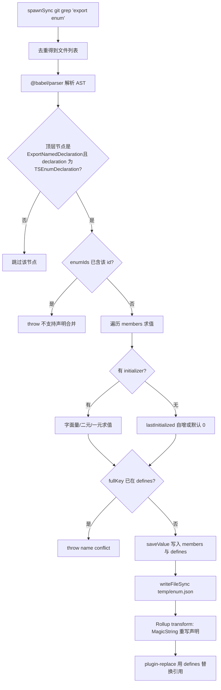
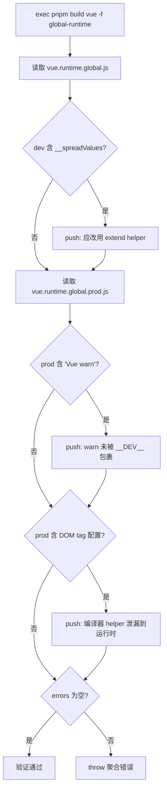

# Capítulo 4: Magia en tiempo de compilación: inline de enums y mecanismo de verificación de Tree-shaking

En el capítulo anterior vimos cómo la cadena en modo desarrollo intercambia velocidad de «cambiar una línea y que surta efecto inmediatamente» mediante file watching y compilación incremental. Pero más allá de la velocidad, Vue tiene otra restricción más sutil: el tamaño de los artefactos publicados debe ser controlable. Uno de los enemigos de esta restricción es el enum de TypeScript — en tiempo de ejecución es un objeto real que rompe el Tree-shaking. Este capítulo entra en la fase de compilación para ver cómo scripts/inline-enums.js «disuelve» los enums en literales antes de que el código sea ejecutado por el navegador; y luego cómo scripts/verify-treeshaking.js, tras la compilación, verifica inversamente mediante cadenas del artefacto que la promesa de «importación bajo demanda» no se ha roto silenciosamente.

# 4.1 Inline de enums: disolver objetos en tiempo de ejecución en literales

## Modelo intuitivo

Imagina que escribes una receta en la que aparece repetidamente «una pizca de sal». Si cada vez que cocinas tienes que ir al apéndice a consultar «una pizca = 3 gramos», es lento y ocupa espacio. Lo que hace el inline de enums es, antes de imprimir, reemplazar en todo el libro «una pizca de sal» por «3 gramos de sal», y luego arrancar esa página del apéndice. Para el lector (tiempo de ejecución), el resultado es exactamente el mismo, pero el libro es más delgado.

Si no existiera, ¿qué catástrofe enfrentaría el sistema? Un`enum`normal de TypeScript, tras compilar, genera un objeto literal real, y con mapeo bidireccional (`Enum[Enum.A] === 'A'`). Este objeto es**una declaración a nivel de módulo con efectos secundarios**, Rollup no puede probar que no se usa, así que solo puede conservarlo — aunque solo importes uno de sus miembros, todo el objeto enum junto con el mapeo inverso se incluirá en el artefacto.[FACT:scripts/inline-enums.js:3-9]El comentario de`const enum`lo dice claramente: solían usar

## , pero por el issue #1228 cambiaron a enum normal, así que usan este script para «recuperar manualmente el beneficio de coste cero de const enum».

Estructura de datos y diseño en memoria[FACT:scripts/inline-enums.js:33-36]

- `EnumMember`：`{ name, value }`El núcleo del script son tres definiciones de tipos; entenderlas es entender todo el flujo de datos.
- `EnumDeclaration`：`{ id, range: [start, end], members }`。`range`, el nombre de un miembro individual del enum y el literal evaluado.**es**el offset en bytes del código fuente`export enum X { ... }`, que apunta a la posición inicial y final de toda la declaración de
- `EnumData`：`{ declarations, defines }`。`declarations`en el archivo — este es el ancla para el reemplazo preciso posterior con MagicString.`defines`indexado por ruta de archivo, registra los rangos de reemplazo de todas las declaraciones de enum en ese archivo;` `es un mapeo plano, cuya clave es `` `` 形式的字符串，值是 `${nombreEnum}.${nombreMiembro}

el literal tras JSON.stringify`.`defines`Aquí hay un diseño clave:**la clave de**。[FACT:scripts/inline-enums.js:98-103]no incluye la ruta del archivo`ErrorCodes`El comentario explica la razón —`@vue/compiler-core`puede existir simultáneamente en`@vue/runtime-core`y`ErrorCodes.__EXTEND_POINT__`, por lo que se permite que enums con el mismo nombre existan en distintos archivos; pero el mismo`fullKey in defines`no puede repetirse en dos enums con el mismo nombre, de lo contrario`name conflict`hace match y lanza directamente

. Esta es una restricción de «único globalmente por nombre de miembro», no de «único globalmente por nombre de enum».`temp/enum.json`。[FACT:scripts/inline-enums.js:33-36]La caché se guarda en`scanEnums()`¿Por qué es necesario persistir en disco? Porque**se llama solo una vez en la entrada de compilación, y Rollup iniciará**。[FACT:scripts/inline-enums.js:39-41]procesos independientes`inlineEnums()`para cada paquete y cada formato. El comentario señala: los datos deben compartirse entre procesos concurrentes de Rollup, así que deben serializarse a disco, y cada proceso los lee de vuelta mediante su

## .

**Paso a paso: de grep al reemplazo por literales`export enum`Primer paso: grep de todos los archivos que contienen**[FACT:scripts/inline-enums.js:51-61].`spawnSync('git', ['grep', 'export enum'])`usa`path:line:content`, la salida tiene la forma`:`, luego se corta por`Set`el primer segmento (ruta del archivo), y se deduplica con`git grep`en lugar de recorrer el sistema de archivos: naturalmente solo escanea los archivos rastreados por Git, excluyendo automáticamente`node_modules`y los artefactos de compilación.

**Segundo paso: Babel analiza y recopila información de enumeraciones.**[FACT:scripts/inline-enums.js:64-70]Para cada archivo usa`@babel/parser`con`typescript`plugin,`sourceType: 'module'`lo analiza en un AST, y luego solo recorre los nodos de nivel superior de`ast.program.body`.[FACT:scripts/inline-enums.js:74-79]Solo reconoce nodos`ExportNamedDeclaration`que sean`declaration.type === 'TSEnumDeclaration'`y cuyo**— es decir, las enum no exportadas no serán procesadas**。

Para cada declaración de enumeración, el script evalúa miembro por miembro. La evaluación de miembros se divide en tres rutas:

1. **Inicialización literal**：`StringLiteral`o`NumericLiteral`toma directamente`init.value`。[FACT:scripts/inline-enums.js:114-119]

2. **Expresión binaria**: como`1 << 2`. Recursivamente`resolveValue`procesa los operandos izquierdo y derecho; los operandos pueden ser literales o también`MemberExpression`(es decir, referencias a miembros de enumeración previamente definidos).[FACT:scripts/inline-enums.js:121-151]La clave está en la rama`MemberExpression`: usa`content.slice(node.start, node.end)`desde**el texto fuente original**para extraer la cadena de expresión (como`ErrorCodes.FOO`), luego consulta`defines`. Si no lo encuentra, lanza`unhandled enum initialization expression`。[FACT:scripts/inline-enums.js:132-141]Esto explica por qué`defines`debe ser un mapeo plano global — al referenciar entre enumeraciones, el referenciado puede provenir de otro archivo, pero la clave solo reconoce`枚举名.成员名`。

3. **Expresión unaria**: como`-1`, se concatena en la cadena`-1`y luego se evalúa con`evaluate`.[FACT:scripts/inline-enums.js:152-163]

La evaluación en sí usa`new Function('return ' + exp)()`。[FACT:scripts/inline-enums.js:39-41]Esto es un**eval controlado**: la entrada proviene de fragmentos de AST ya analizados del código fuente, no de entrada arbitraria del usuario, por lo que el límite de seguridad es controlable.

**Tercer paso: procesar miembros sin inicializador (semántica de autoincremento).**[FACT:scripts/inline-enums.js:171-183]Si un miembro no tiene`initializer`: el primer miembro por defecto es`0`; si los miembros posteriores`lastInitialized`son números entonces`++`; si son cadenas entonces lanza`wrong enum initialization sequence`— porque los miembros de enumeración de cadena no permiten autoincremento implícito. Esta es precisamente la semántica de las enumeraciones de TypeScript.

**Cuarto paso: escribir caché y devolver función de limpieza.**[FACT:scripts/inline-enums.js:200-213] `scanEnums()`Devuelve un closure; al invocarlo se`rmSync`elimina el archivo de caché.`build.js`Se usa dentro de`try/finally`.[FACT:scripts/build.js:81-112]Esto garantiza que incluso si ocurre un error a mitad de la compilación, la caché se limpie y no contamine la siguiente compilación.

**Quinto paso: reemplazo en la fase transform de Rollup.** `inlineEnums()`Lee de vuelta la caché y construye un plugin de Rollup.[FACT:scripts/inline-enums.js:219-234]En`transform(code, id)`, si`id`coincide con`enumData.declarations`, usa MagicString para reemplazar`[start, end]`ese segmento de declaración con un objeto literal.[FACT:scripts/inline-enums.js:242-274]

La forma tras el reemplazo es`export const X = { ... }`. Nótese que**no simplemente elimina la enumeración**, sino que la reescribe como objeto literal, y además genera mapeo inverso adicional para miembros numéricos:`JSON.stringify(value.toString()) + ': ' + JSON.stringify(name)`。[FACT:scripts/inline-enums.js:257-270]El comentario cita la regla de reverse-mappings de la documentación oficial de TypeScript: los miembros de enumeración de cadena no generan mapeo inverso, los numéricos sí. Esto garantiza que el comportamiento en tiempo de ejecución tras el reemplazo sea completamente idéntico al enum original.

Y lo que realmente elimina la sobrecarga en tiempo de ejecución es que`defines`se entrega a`@rollup/plugin-replace`。[FACT:rollup.config.js:222-223]Todas las`X.Member`referencias a**son reemplazadas directamente por literales en el plugin de reemplazo, de modo que ese objeto literal reescrito, si nadie lo usa, puede ser eliminado por Tree-shaking.**El siguiente diagrama de flujo describe la ruta de decisión completa desde grep hasta el reemplazo:

Copiar

## ¿Por qué usar MagicString en lugar de regenerar todo el archivo?

**Porque**solo reemplaza el segmento de la declaración de enumeración, el resto de los bytes del código fuente permanecen intactos,`s.update(start, end, ...)`y además puede generar sourcemaps precisos.`s.generateMap()`Si se usara Babel para reimprimir todo el AST, se perdería el formato original, los comentarios, y la calidad del sourcemap disminuiría.[FACT:scripts/inline-enums.js:277-281]¿Por qué

**`range`en lugar de`node.start/node.end`Lo que se afirma es`declaration.start`？**[FACT:scripts/inline-enums.js:189-193](es decir, el nodo`node.start`), el rango de reemplazo cubre`ExportNamedDeclaration`todo el segmento, incluyendo`export enum X {...}`la palabra clave`export`. El texto de reemplazo comienza con`export const`, continuando exactamente.

**Puntos problemáticos:`defines`La restricción de unicidad global de**Si dos archivos diferentes tienen cada uno un`ErrorCodes`, y ambos definen`__EXTEND_POINT__`, la compilación fallará directamente.[FACT:scripts/inline-enums.js:101-103]Esto no es un bug, sino un diseño deliberado — porque`defines`es una tabla de reemplazo global, incapaz de distinguir el origen del archivo. En producción, al agregar nuevos miembros de enumeración, si el nombre entra en conflicto con un miembro de enumeración existente, explotará aquí.

**Punto problemático:`new Function`El momento de evaluación de**La evaluación de expresiones binarias ocurre en la fase`scanEnums`, en ese momento`defines`puede que aún no tenga el miembro referenciado (si el orden de referencia está invertido).[FACT:scripts/inline-enums.js:136-140]lanzará`unhandled enum initialization expression`. Esto requiere que las referencias a miembros de enumeración sigan el orden del código fuente de «definir primero, referenciar después».

# 4.2 Verificación de Tree-shaking: demostrar la promesa a la inversa usando las cadenas del artefacto

## Modelo intuitivo

La inclusión de enumeraciones es una «optimización previa», pero ¿realmente surte efecto la optimización? Si algún helper se conserva accidentalmente por una escritura inadecuada, el tamaño se inflará silenciosamente sin que el desarrollador lo note.`verify-treeshaking.js`Es ese «inspector de calidad posterior»: construye el artefacto y luego, como en una autopsia, revisa en el artefacto**si aparece lo que no debería aparecer**. Sin él, la promesa de importación bajo demanda de Vue podría romperse silenciosamente tras alguna refactorización, hasta que los usuarios se quejen de que el paquete creció.

## Estructuras de datos e ítems de verificación

Este script no tiene estructuras de datos complejas; el núcleo es un`errors`array y tres`includes`verificaciones[FACT:scripts/verify-treeshaking.js:6-6]Primero construye`global-runtime`formato, luego lee los artefactos dev y prod por separado.

Los tres ítems de verificación corresponden a tres tipos de «fallo de Tree-shaking»:

1. **El artefacto dev contiene`__spreadValues`**。[FACT:scripts/verify-treeshaking.js:13-19]Este es el helper que esbuild genera para`{ ...obj }`la sintaxis de propagación de objetos. Si aparece, indica que el código en tiempo de ejecución usa propagación de objetos, cuando la convención de Vue es usar`extend`helper para evitar código adicional.

2. **El artefacto prod contiene`Vue warn`**。[FACT:scripts/verify-treeshaking.js:26-31]Indica que hay`warn()`llamadas que no están envueltas por la condición`__DEV__`, provocando que el código de advertencia se filtre al paquete de producción.

3. **El artefacto prod contiene la lista de configuración de DOM tags**。[FACT:scripts/verify-treeshaking.js:33-42]como`html,body,base`、`svg,animate,animateMotion`、`annotation,annotation-xml,maction`. Estos son`isHTMLTag()`Los datos internos de helpers como este deberían existir solo en el compilador y ser eliminados por el runtime. Si aparecen en el artefacto de runtime, indica que la ruta de runtime está usando indebidamente un helper exclusivo del compilador.

## Paso a paso: flujo de verificación

[FACT:scripts/verify-treeshaking.js:5-5]Primero`exec('pnpm', ['build', 'vue', '-f', 'global-runtime'])`, construir solo`vue`del paquete`global-runtime`en formato — este es el artefacto de runtime minimizado, el más adecuado para exponer fugas. Tras completar la construcción, leer sincrónicamente ambos archivos, revisar uno por uno`includes`, y al encontrar coincidencias hacer push a`errors`de un mensaje con explicación. Finalmente, si`errors.length`es distinto de cero, lanzar un error agregado.[FACT:scripts/verify-treeshaking.js:44-48]

## Reflexiones de diseño y trampas

> **[Design Inference & Architectural Trade-offs]**
> **¿Por qué usar cadenas`includes`en lugar de análisis AST?**Porque esto es una "verificación centinela", no un "análisis preciso". No busca completitud, solo establecer alertas de bajo costo para tres tipos de regresiones que han ocurrido realmente en la historia. La coincidencia de cadenas tiene cero dependencias, cero sobrecarga de análisis, y es igualmente efectiva en artefactos comprimidos — el análisis AST se vuelve más difícil después de minify.

> **[Design Inference & Architectural Trade-offs]**
> **¿Por qué verificar solo`global-runtime`？**este formato incorpora todas las dependencias en línea (`external`está vacío), es el artefacto más sensible al tamaño y más propenso a inclusiones erróneas. Si está limpio, otros formatos normalmente también lo están. Además, se construye rápido, adecuado para ejecutarse frecuentemente en CI.

> **[Design Inference & Architectural Trade-offs]**
> **Trampa: los elementos de verificación son una "lista negra", que se vuelve obsoleta con la evolución del código.**Si algún día`isHTMLTag`la estructura de datos cambia,`html,body,base`esta cadena deja de aparecer, y la verificación queda vacía. Esto requiere que los mantenedores actualicen sincrónicamente las cadenas centinela aquí al modificar los helpers relacionados. Este es el costo inherente de la verificación por lista negra.

# 4.3 Colaboración con Rollup: orden de plugins e inyección de define

La inclusión de enums no opera aisladamente, está incrustada en el pipeline de plugins de Rollup. Entender su posición en el pipeline es entender por qué`defines`se delega a`replace`en lugar de`esbuild`。

[FACT:rollup.config.js:47-50]llamar en el nivel superior del módulo de configuración`inlineEnums()`, desestructurando`[enumPlugin, enumDefines]`. Nota que esto se ejecuta**al inicio de cada proceso de Rollup**, leyendo la caché escrita por`scanEnums`.

El orden del array de plugins es:`json` → `alias` → `enumPlugin` → `...resolveReplace()` → `esbuild`。[FACT:rollup.config.js:324-339] `enumPlugin`va antes de`replace`, lo que significa que la reescritura de declaraciones de enum ocurre primero, luego`replace`usa`defines`para reemplazar referencias. Y`esbuild`va al final, encargado de la transpilación TS.

¿Por qué`defines`usa`replace`y no`esbuild`el comentario de`define`？[FACT:rollup.config.js:220-221]da la respuesta: el define de esbuild "es algo estricto, solo permite literales JSON o identificadores". Y nombres de miembros de enum como`ErrorCodes.__EXTEND_POINT__`son expresiones de miembro con punto, que el define de esbuild no puede manejar directamente como claves. Por eso se debe usar`@rollup/plugin-replace`, que soporta reemplazo de claves de cadena arbitrarias.[FACT:rollup.config.js:250-251]y se configuró`preventAssignment: true`, para evitar reemplazar también el lado izquierdo de asignaciones.

`resolveReplace()`en`const replacements = { ...enumDefines }`es el primer paso.[FACT:rollup.config.js:222-223]Después se superponen las anotaciones de producción`/*@__PURE__*/`,`__DEV__`y otros reemplazos. Este orden garantiza que el reemplazo de literales de enum siempre tenga efecto.

# Reflexiones de diseño

**La esencia de la inclusión de enums es "intercambiar complejidad en tiempo de construcción por tamaño en runtime".**Replica completamente la semántica del sistema de tipos de TypeScript (evaluación de enum, autoincremento, mapeo inverso) en tiempo de construcción —`scanEnums`la lógica de evaluación en[FACT:scripts/inline-enums.js:110-183]es casi un subconjunto de la evaluación de enums del compilador TS.`unhandled`Esto conlleva costo de mantenimiento: si TS añade nueva sintaxis de enum (como expresiones constantes más complejas), aquí debe actualizarse, o se lanzará error

> **[Design Inference & Architectural Trade-offs]**
> **〔Inferencia de diseño y compensaciones arquitectónicas〕**El script de verificación y el script de inclusión son un par de "promesa y cumplimiento".

**El script de inclusión promete "los enums no ocupan tamaño en runtime", el script de verificación comprueba "otro código tampoco ocupa tamaño a escondidas". Ambos protegen conjuntamente el presupuesto de tamaño de Vue. Este diseño pareado de "optimización + verificación" es un patrón típico de ingeniería en grandes bibliotecas frontend: toda optimización necesita una verificación automatizada para prevenir regresiones.** `scanEnums`La caché entre procesos es imprescindible para construcciones concurrentes.`inlineEnums`El patrón de ejecución única,[FACT:scripts/inline-enums.js:39-41]múltiples lecturas,

# resuelve el problema de "un escaneo, N procesos consumidores". Sin caché, cada proceso de Rollup tendría que hacer grep + parseo de nuevo, desperdiciando gran cantidad de IO y CPU.

# Resumen del capítulo

Reflexiones y autoevaluación del capítulo`scanEnums`P1: Si se elimina`saveValue`en`if (fullKey in defines)`de

**la verificación de conflictos, ¿en qué escenarios causaría errores en el artefacto de construcción?**：

`defines`Análisis de referencia`枚举名.成员名`es un mapeo plano global, con clave[FACT:scripts/inline-enums.js:98-103], sin rutas de archivo.`@vue/compiler-core`Tras eliminar la verificación de conflictos, si dos archivos distintos tienen cada uno un enum con el mismo nombre y definen un miembro con el mismo nombre (como`@vue/runtime-core`y`ErrorCodes.__EXTEND_POINT__`ambos tienen

), el último en escribir sobrescribe al primero.`defines['ErrorCodes.__EXTEND_POINT__']`Consecuencias:`plugin-replace`solo queda un valor, y**al reemplazar no puede distinguir el archivo de origen, reemplazará**todos`ErrorCodes.__EXTEND_POINT__`los[FACT:rollup.config.js:222-223]en los archivos por el mismo valor.

Entonces el valor del miembro de enum de uno de los paquetes es alterado silenciosamente, causando comportamiento erróneo en runtime y extremadamente difícil de diagnosticar — porque el código fuente parece completamente correcto.[FACT:scripts/inline-enums.js:98-100]Esto es precisamente la razón por la que el comentario enfatiza "permitir enums con el mismo nombre entre archivos, pero no miembros con el mismo nombre".

La verificación de conflictos es el guardián que previene la contaminación de la tabla de reemplazo global.`rollup.config.js`P2: Si se intercambia el orden de`enumPlugin`y`...resolveReplace()`en el array de plugins de

**, ¿qué ocurriría?**：

Análisis de referencia`enumPlugin`El orden actual es`replace`primero,[FACT:rollup.config.js:331-332]después.`transform`El hook

de Rollup se ejecuta en el orden del array de plugins.`replace`Si se intercambia,`export enum X { ... }`se ejecutaría primero, cuando las declaraciones de enum aún están en su forma original`replace`.`defines`usa`X.Member`para reemplazar referencias a`enumPlugin`— pero en ese momento las referencias aún existen, el reemplazo puede funcionar. El problema surge cuando`s.update(start, end, ...)`se ejecuta después: usa[FACT:scripts/inline-enums.js:250-273]para reescribir el segmento de declaración.`replace`Pero`code`ya ha modificado`enumPlugin`, y`code`obtiene`replace`cuya desplazamiento de bytes ya no corresponde con`scanEnums`registrado en`range`(basado en el código fuente original)**ya no corresponde**。

Consecuencia: MagicString cortará en el desplazamiento incorrecto y la sintaxis del artefacto quedará corrupta. Esto revela un contrato implícito del pipeline de plugins:**las transformaciones basadas en desplazamientos del código fuente deben ejecutarse primero**, para que las transformaciones posteriores puedan continuar de forma segura sobre su salida.

Q3: `verify-treeshaking.js`solo verifica tres centinelas de cadena. Si alguna refactorización cambia los`isHTMLTag`datos internos de`'html,body,base'`de`['html','body','base']`a una forma de arreglo

**, ¿qué pasaría con el script de verificación? ¿Qué defecto de diseño expone esto?**：

Análisis de referencia`prodBuild.includes('html,body,base')`El script de verificación usa[FACT:scripts/verify-treeshaking.js:33-37]para comprobar.`includes`Si los datos cambian a un arreglo, la cadena conectada por comas ya no aparecerá en el artefacto minificado,`false`devuelve**, la comprobación**pasa silenciosamente`isHTMLTag`—incluso si

realmente se filtró al artefacto de tiempo de ejecución.**Esto expone el defecto inherente de la verificación de cadenas tipo lista negra:**las cadenas centinela están acopladas a la implementación del código fuente; si la implementación cambia, la verificación deja de ser válida

> **[Design Inference & Architectural Trade-offs]**
> 〔Inferencia de diseño y compensaciones arquitectónicas〕`isHTMLTag`Dirección de mejora: se podría cambiar a verificar identificadores más estables (como el nombre de función

), o prohibir a nivel de código fuente mediante reglas de lint el import en tiempo de ejecución de helpers del compilador, en lugar de depender de cadenas del artefacto. Pero bajo las restricciones de costo actuales, los centinelas de cadena son un compromiso «suficiente y barato».`.d.ts`La inclusión de enums resolvió «cómo eliminar la sobrecarga en tiempo de ejecución durante la compilación», y el script de verificación resolvió «cómo confirmar que la optimización no se ha roto». Pero los artefactos de compilación, además de JS, incluyen otro tipo de producto que también requiere procesamiento en el pipeline: los archivos de declaración de tipos. El siguiente capítulo entrará en el pipeline de artefactos de tipos, para ver cómo Vue genera un paquete de tipos de nivel de publicación a partir del código fuente`dts-test`y cómo

usa pruebas de contrato de tipos para proteger la forma de tipos de la API pública.
