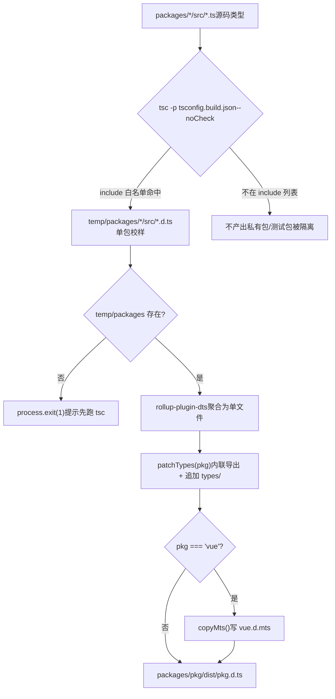
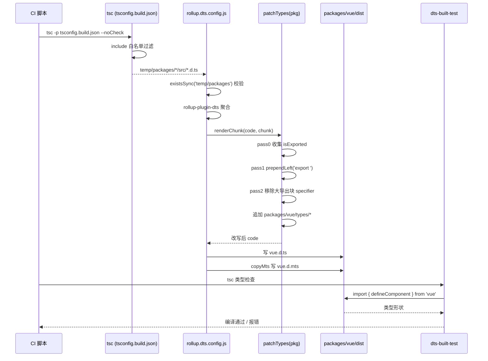

# Capítulo siguiente: Capítulo 5 →

Estado de verificación: líneas FACT ancladas de forma real`inline-enums.js`En el capítulo anterior desglosamos`verify-treeshaking.js`y`import { ref } from 'vue'`: uno se encarga de reemplazar las referencias a enum por literales, permitiendo que el objeto enum sea eliminado por Tree-shaking, y el otro se encarga de confirmar después de la compilación, mediante centinelas de cadena, que tres tipos conocidos de fugas no regresen. Ambos protegen conjuntamente la promesa de tamaño en tiempo de ejecución de Vue. Pero los artefactos de compilación no son solo JS. Cuando el usuario`tsc`, las sugerencias de tipo que muestra el editor,`.d.ts`la verificación de tipos del código del usuario, todo depende de otro tipo de artefacto:`src`los archivos de declaración. Si el artefacto JS está mal, hay errores en tiempo de ejecución; si el artefacto de tipos está mal, el usuario obtiene errores en tiempo de compilación, o peor aún: los tipos derivan silenciosamente, el código del usuario compila, pero la forma de los tipos no coincide con el comportamiento real en tiempo de ejecución. Este capítulo rastrea cómo Vue agrega los tipos del código fuente dispersos en los`dts-built-test`de cada subpaquete en un paquete de tipos de nivel de publicación, y usa

# para hacer pruebas de humo de tipos sobre artefactos de compilación reales.

## 5.1 Pipeline de tipos en dos fases: tsc produce, rollup agrega

Modelo intuitivo`.ts`Imagina una línea de impresión: en la primera fase, cada subpaquete compone su propio manuscrito (`.d.ts`código fuente) en una prueba de página única (`.d.ts`); en la segunda fase, se encuadernan decenas de pruebas en un libro según el orden del directorio (nivel de publicación

), y se unifican encabezados y pies de página (declaraciones de exportación).**Sin este pipeline, Vue tendría que mantener manualmente un archivo de tipos de publicación, y cada cambio en el código fuente requeriría una edición manual sincronizada: un caldo de cultivo para la deriva de tipos. El enfoque de Vue es:**。

## los artefactos de tipos se generan completamente a partir del código fuente, nunca se escriben a mano

`tsconfig.build.json`Primera fase: tsconfig.build.json delimita el alcance de producción`tsconfig.json`es la configuración de la primera fase de este pipeline. Hereda la raíz

[FACT:tsconfig.build.json:3-9]

y solo cubre opciones relacionadas con la compilación.

- `declaration: true`Desglose opción por opción de las clave:`.d.ts`。
- `emitDeclarationOnly: true`：**: hace que tsc genere para cada archivo fuente el correspondiente**solo emite tipos, no JS
- `stripInternal: true`. Rollup se encarga del JS; tsc aquí es puramente un extractor de tipos.`@internal`: toda declaración marcada con`.d.ts`se elimina de`export`. Esta es la primera compuerta con la que Vue controla la superficie de la API pública: los detalles internos de implementación, incluso si son`@internal`, mientras estén marcados con
- `composite: false`no se filtrarán a los tipos publicados.`.tsbuildinfo`: desactiva el modo de compilación incremental de las referencias de proyecto (project references). Vue aquí no necesita incrementalidad entre paquetes; desactivarlo evita el estado adicional que introduce

`include`. La lista

[FACT:tsconfig.build.json:10-23]

delimita con precisión qué directorios participan en la producción:**Nota: aquí**solo se listan 12 directorios`packages/`。`packages-private/`、`packages/dts-test/`、`packages/sfc-playground/`, no todo**, etc. no están incluidos. Esto significa: los tipos de paquetes privados y paquetes de prueba**Entrar en los artefactos de publicación. Esto es un aislamiento físico: no por convención, sino por configuración.

> **[Design Inference & Architectural Trade-offs]**
> ¿Por qué usar una lista blanca en lugar de una lista negra? Porque añadir subpaquetes en un monorepo es la norma. Si se usara una`exclude`lista negra, al añadir un paquete privado y olvidar incluirlo en exclude, sus tipos se colarían silenciosamente en los artefactos de publicación. La lista blanca es lo contrario: los paquetes nuevos no participan en la compilación por defecto, deben añadirse explícitamente, lo que cumple con el principio de «valores predeterminados seguros».

Tras ejecutar`tsc -p tsconfig.build.json --noCheck`los artefactos quedan en`temp/packages/<pkg>/src/*.d.ts`. Nota`--noCheck`: omite la verificación de tipos, solo hace emit. La verificación de tipos la realiza un`tsc --noEmit`separado, la fase de compilación no la repite, ahorrando tiempo.

## Segunda fase: agregación con rollup.dts.config.js

La segunda fase está impulsada por`rollup.dts.config.js`. Su punto de entrada primero realiza una validación previa:

[FACT:rollup.dts.config.js:15-22]

Si`temp/packages`no existe, significa que la primera fase no se ejecutó, el script directamente`process.exit(1)`y sugiere ejecutar primero`tsc`. Este es el**contrato de orden**del pipeline: la fase de rollup depende fuertemente de los artefactos de la fase de tsc, ambos son indispensables.

Luego lee todos los directorios de subpaquetes y admite la variable de entorno`TARGETS`para construir un subconjunto:

[FACT:rollup.dts.config.js:15-22]

`TARGETS`El mecanismo permite reconstruir solo los tipos de algunos paquetes, lo que reduce significativamente el ciclo de retroalimentación durante el desarrollo y la depuración.

El núcleo es`targetPackages.map(...)`generar una configuración de Rollup para cada paquete:

[FACT:rollup.dts.config.js:23-42]

Interpretación campo por campo:

- `input: ./temp/packages/${pkg}/src/index.d.ts`: la entrada es el archivo de tipos producido en la primera fase, no el código fuente`.ts`。
- `output.file: packages/${pkg}/dist/${pkg}.d.ts`: los artefactos van al directorio`dist`de cada paquete, con el nombre de archivo igual al nombre del paquete (como`vue.d.ts`）。
- `format: 'es'`: los archivos de tipos usan uniformemente el formato ES module.
- `plugins: [dts(), patchTypes(pkg), ...(pkg === 'vue' ? [copyMts()] : [])]`: tres plugins, los dos primeros se aplican a todos los paquetes,`copyMts`solo se aplica al paquete`vue`.

`onwarn`El hook

[FACT:rollup.dts.config.js:23-42]

merece mención aparte:`UNRESOLVED_IMPORT`Durante el dts rollup, todas las importaciones con rutas no relativas se externalizan por defecto. Esto provoca que Rollup emita una advertencia**. Pero esto es**comportamiento esperado`import { X } from 'some-pkg'`: las`return`en los archivos de tipos deben permanecer como referencias externas, no deben incluirse en el empaquetado. Por eso el script para «importaciones no resueltas con rutas no relativas» directamente`warn`。

> **[Design Inference & Architectural Trade-offs]**
> predeterminado.`!warning.exporter?.startsWith('.')`〔Inferencia de diseño y compensaciones arquitectónicas〕`.`Aquí hay una sutileza:

## determina si el exporter comienza con

Panorama del pipeline`tsc`Copiar`rollup`Este diagrama ancla el flujo de control de dos fases:`check`la lista blanca de`patchTypes`determina quién puede entrar al pipeline,`copyMts`el`vue`de

# determina si puede continuar,

## es un paso obligatorio,

`rollup-plugin-dts`es la rama exclusiva del paquete`.d.ts`.`export { A, B, C, ... }`5.2 patchTypes: reescribir los artefactos agregados a una forma de nivel de publicación`defineComponent`Modelo intuitivo

`patchTypes`Después de fusionar docenas de**en un solo archivo, la forma producida es «primero declarar un montón de tipos, finalmente exportar todo con un enorme**». Esto no es amigable para la lectura humana, y para algunas cadenas de herramientas (como la llamada

## de VitePress) también provoca el error «el tipo inferido no puede nombrarse sin una referencia».

`patchTypes`es este`renderChunk`proceso de post-procesamiento de conformación

[FACT:rollup.dts.config.js:87-88]

- `isExported`: cambiar «exportación centralizada» por «exportación en línea in situ», y luego añadir mejoras de tipos específicas del paquete.**Estructura de datos: dos Set y tres pasadas**devuelve un plugin de Rollup, la lógica central está en el hook`export { ... }`. Mantiene dos conjuntos:
- `shouldRemoveExport`: registra todos los nombres de tipos que**ya estaban exportados**originalmente (provenientes de la declaración

).

## Step-by-Step Walkthrough

**: registra todos los nombres de tipos que**

[FACT:rollup.dts.config.js:90-100]

necesitan eliminarse del gran bloque de exportación`ExportNamedDeclaration`(porque ya se exportaron en línea).**El flujo de procesamiento se divide en tres pasadas (pass 0 / pass 1 / pass 2), este es el típico patrón de «primero recopilar, luego reescribir, finalmente limpiar».**Pass 0: recopilar todos los nombres de tipos ya exportados.`export ... from '...'`Recorre los nodos de nivel superior del AST, todo`isExported`。

**que sea`export`y**

[FACT:rollup.dts.config.js:102-125]

sin source`VariableDeclaration`、`TSTypeAliasDeclaration`、`TSInterfaceDeclaration`、`TSDeclareFunction`、`TSEnumDeclaration`、`ClassDeclaration`(es decir, que no sea una reexportación de`processDeclaration`。

`processDeclaration`), añade el local name de su specifier a

[FACT:rollup.dts.config.js:70-85]

Pass 1: añadir in situ el prefijo

a los nodos de declaración.`id`Recorre los nodos de nivel superior, para las seis categorías de declaración

llama a la lógica de`_`:**Tres pasos:**1. Sin

devuelve directamente (como declaraciones anónimas).`shouldRemoveExport`2. Si el nombre comienza con`isExported`se omite: esta es la`prependLeft`convención`export `: los tipos con prefijo de guion bajo son tipos auxiliares internos, no se exportan.

3. Añade el nombre a`VariableDeclaration`; si ese nombre está en

[FACT:rollup.dts.config.js:104-115]

(es decir, ya estaba exportado), en la posición inicial de la declaración`declare const`una cadena`declare const a, b`.`processDeclaration`Nota: la rama`declarations[0]`tiene una aserción adicional:**Si un**declara múltiples declarators (como

**), lanza un error directamente. Porque**

[FACT:rollup.dts.config.js:127-171]

solo procesa`ExportNamedDeclaration`, múltiples declarators provocarían un procesamiento omitido. Aquí se elige

- fallo rápido`shouldRemoveExport`en lugar de error silencioso, es una manifestación de programación defensiva.`exported === local`Pass 2: eliminar del gran bloque de exportación los tipos ya exportados en línea.`export { Foo as Bar }`Recorre
- , para cada specifier:
- Si su local name está en`ExportNamedDeclaration`, y

**(excluyendo el caso de renombrado de**

[FACT:rollup.dts.config.js:172-183]

`code = s.toString()`), entonces elimina ese specifier.`packages/${pkg}/types`Al eliminar, usa MagicString para borrar con precisión: si hay más specifiers después, borra hasta el start del siguiente specifier; si es el último, borra hasta el end del anterior o su propio start.

> **[Design Inference & Architectural Trade-offs]**
> Este`types/`directorio es**un punto de entrada de mejoras de tipos mantenido manualmente**, utilizado para colocar aquellos tipos que no pueden generarse automáticamente desde el código fuente (como mejoras globales de JSX, declaraciones de tipos de macros). Se fusiona en el mismo archivo con los tipos generados automáticamente, pero con un origen claramente separado: los generados automáticamente arriba, las mejoras manuales abajo.

## ¿Por qué es obligatorio exportar en línea?

El comentario da la razón directa:

[FACT:rollup.dts.config.js:45-51]

El texto original dice: cambiar todos los tipos a exportación en línea y eliminarlos del bloque de exportación grande, de lo contrario en la llamada de VitePress`defineComponent`se reportará «the inferred type cannot be named without a reference».

> **[Design Inference & Architectural Trade-offs]**
> La esencia de este error es: cuando TypeScript genera tipos, si un tipo solo puede nombrarse mediante «referenciar la exportación de otro módulo», y esa referencia no es visible en el lado del consumidor, se reporta un error. El bloque de exportación centralizado separa el nombre del tipo de su ubicación de declaración, agravando este problema. La exportación en línea hace que cada tipo sea visible en su lugar de declaración, eliminando esta capa indirecta.

## copyMts: proporciona tipos para el doble modo Node ESM/CJS

`copyMts`El plugin solo tiene efecto para el paquete`vue`:

[FACT:rollup.dts.config.js:196-204]

En el hook`writeBundle`, escribe el contenido de`vue.d.ts`tal cual en`vue.d.mts`。

El comentario explica la razón:

[FACT:rollup.dts.config.js:188-192]

Según la especificación de exports de TypeScript 4.7`package.json`, para proporcionar correctamente tipos tanto para Node ESM como para CJS,**debe haber dos archivos de declaración independientes**. Por eso, durante la compilación se copia`vue.d.ts`como`vue.d.mts`。

> **[Design Inference & Architectural Trade-offs]**
> ¿Por qué copiar en lugar de regenerar? Porque la forma de los tipos de ESM y CJS es completamente idéntica, la diferencia solo está en la extensión del archivo y el mapeo de`package.json`en`exports`. Copiar es la solución más económica, evitando ejecutar rollup una vez más.

# 5.3 dts-built-test: prueba de humo de tipos sobre el artefacto real

## Modelo intuitivo

Las dos secciones anteriores garantizan que los artefactos de tipos puedan generarse y que su forma sea correcta. Pero «poder generarse» no equivale a «generarse correctamente». Si alguna pasada de`patchTypes`tiene un bug y elimina por error alguna exportación, el artefacto aún puede generarse, pero el usuario al`import`descubrirá que faltan tipos.

`dts-built-test`es**una prueba de humo de tipos que se ejecuta sobre el artefacto de compilación real**: no prueba los tipos del código fuente, sino que consume el paquete`import`ya publicado`vue`, verificando que las formas de tipos clave no hayan sufrido regresiones.

## Estructura de datos: una aserción de tipos minimizada

El núcleo de todo el paquete de prueba es un solo archivo:

[FACT:packages-private/dts-built-test/src/index.ts:3-6]

Lectura línea por línea:

- L1: importa`vue`desde`defineComponent`. Nótese que aquí se importa el**nombre del paquete**, no una ruta relativa: consume el artefacto real`packages/vue/dist/vue.d.ts`.
- L3-6: define un componente`_CustomPropsNotErased`, con props vacías y setup vacío.
- L8: comentario`// #8376`, apuntando a un issue concreto.
- L9-12: exporta`CustomPropsNotErased`, con tipo`_CustomPropsNotErased`y`{ foo: string }`como tipo de intersección.

Lo que verifica esta prueba es:**`defineComponent`que el tipo de retorno de`{ foo: string }`, tras la intersección con`foo`, no borra la propiedad**。

> **[Design Inference & Architectural Trade-offs]**
> Contexto inferido del issue #8376:`defineComponent`el tipo de retorno de

## posiblemente pasa por algún tipo condicional o tipo mapeado, lo que provoca que las propiedades adicionales en el tipo de intersección sean «borradas». Esta prueba fija este comportamiento con una reproducción mínima; si hay regresión, fallará en la fase de verificación de tipos.

[FACT:packages-private/dts-built-test/package.json:1-11]

Configuración del paquete: dependencia de workspace apuntando al artefacto real

- `private: true`Campos clave:
- `types: dist/index.d.ts`: no se publica en npm.
- `dependencies`: el punto de entrada de tipos apunta al artefacto de compilación.`workspace:*`Tres dependencias de`@vue/shared`、`@vue/reactivity`、`vue`。

> **[Design Inference & Architectural Trade-offs]**
> 〔Inferencia de diseño y compensaciones arquitectónicas〕`@vue/shared`¿Por qué depender de`@vue/reactivity`y`vue`? Porque los tipos de`types`pueden referenciar los tipos de estos dos paquetes. En modo workspace, pnpm enlaza simbólicamente estas dependencias a los paquetes locales, y el campo`dist`de los paquetes locales apunta a los artefactos bajo su respectivo**. Así toda la cadena de pruebas consume**artefactos de compilación

## , no código fuente.

`dts-built-test`Cómo se ejecuta la prueba`src/index.ts`en sí no tiene script de prueba; su`tsc`es el caso de prueba. La forma de ejecutarlo es: en CI ejecutar`tsc`para hacer verificación de tipos sobre el paquete. Si la forma de los tipos sufre regresión,

> **[Design Inference & Architectural Trade-offs]**
> 〔Inferencia de diseño y compensaciones arquitectónicas〕**Lo ingenioso de este diseño es que codifica el «contrato de tipos» como**código compilable`tsc`. No necesita una librería de aserciones adicional, no necesita runtime;

## en sí mismo es el ejecutor de pruebas. Si los tipos son correctos, compila; si los tipos son incorrectos, falla la compilación.

División de trabajo con dts-test`dts-built-test`Nótese que el`dts-test`de este capítulo y el

- `dts-built-test`del siguiente capítulo son dos cosas distintas:**(este capítulo): consume**artefactos de compilación
- `dts-test`, verifica la forma de tipos a nivel de publicación.**(siguiente capítulo): consume**tipos del código fuente

> **[Design Inference & Architectural Trade-offs]**
> 〔Inferencia de diseño y compensaciones arquitectónicas〕`patchTypes`¿Por qué se necesitan dos capas? Porque los tipos del código fuente y los tipos del artefacto pueden ser inconsistentes.`stripInternal`La reescritura de AST de`types/`, la eliminación de`dts-built-test`, la adición del directorio

## , todo puede introducir bugs a nivel de artefacto bajo la premisa de que los tipos del código fuente son correctos.

Secuencia completa del pipeline de tipos`patchTypes`Copiar`dts-built-test`Este diagrama de secuencia ancla la colaboración entre módulos: CI impulsa las dos fases de tsc y Rollup,

# las tres pasadas de

## son el procesamiento central,

`patchTypes`consume el artefacto al final para la verificación.`code.replace(...)`Reflexiones de diseño, recuperación de errores y trampas en producción

1. **¿Por qué usar MagicString en lugar de reemplazo de cadenas?**Se usa MagicString en todo el proceso para reescritura precisa, en lugar de`start`/`end`. Hay dos razones:

2. **Posición precisa**MagicString puede generar mapas, permitiendo que los archivos de tipos reescritos sigan siendo rastreables hasta el código fuente. Aunque el uso de sourcemaps en archivos de tipos es limitado, mantener la consistencia es una buena práctica.

## Fallo rápido vs tolerancia silenciosa

`patchTypes`se usa en múltiples lugares`assert`：

[FACT:rollup.dts.config.js:74-74]

[FACT:rollup.dts.config.js:107-108]

[FACT:rollup.dts.config.js:147-148]

Estas aserciones lanzan errores inmediatamente al encontrar formas de AST no esperadas. En contraste con`onwarn`donde se traga silenciosamente`UNRESOLVED_IMPORT`la**El ruido esperado se traga, las formas inesperadas fallan rápido**. Esta es la postura correcta para un script de construcción: es preferible que la construcción falle a producir archivos de tipos con formas incorrectas.

## Problemas en producción:`_`Convención de prefijo

`processDeclaration`Omitir`_`tipos que comienzan con:

[FACT:rollup.dts.config.js:76-78]

Esto significa que cualquier tipo exportado en el código fuente que comience con`_`no será exportado en línea. Si un tipo debería ser público pero se omite porque su nombre comienza con`_`, los usuarios encontrarán errores de «el tipo no existe».

> **[Design Inference & Architectural Trade-offs]**
> El enfoque para investigar este tipo de problemas: primero verificar si el tipo aún está en el gran bloque de exportación en el artefacto`vue.d.ts`, luego verificar si el nombre del tipo en el código fuente comienza con`_`. Esto es un acoplamiento implícito entre la convención de nombres y el comportamiento de la herramienta, propenso a errores.

## Problemas en producción: aserción de múltiples declaradores

[FACT:rollup.dts.config.js:106-115]

Si en algún`.d.ts`aparece`declare const a, b`, la construcción lanza un error directamente. Esto es raro en tipos escritos a mano, pero se activará si algún archivo de tipos generado por una herramienta usa esta forma. El mensaje de error imprimirá el fragmento de código problemático para facilitar la localización.

# Resumen del capítulo

Este capítulo rastreó la canalización completa de los artefactos de tipos de Vue:

1. **Primera etapa (tsc)**：`tsconfig.build.json`usa`include`la lista blanca para delimitar con precisión el alcance de salida,`emitDeclarationOnly`solo emite tipos,`stripInternal`elimina declaraciones internas. Los artefactos se ubican en`temp/packages/`。

2. **Segunda etapa (rollup)**：`rollup.dts.config.js`usa`rollup-plugin-dts`para agregar los tipos de cada paquete,`patchTypes`mediante tres pasadas de recorrido del AST reescribe las exportaciones centralizadas en exportaciones en línea, y añade`types/`las mejoras manuales del directorio.`copyMts`para`vue`el paquete genera adicionalmente`.d.mts`。

3. **Fase de verificación (dts-built-test)**: realiza pruebas de humo de tipos sobre los artefactos de construcción reales, usando código compilable para fijar las formas de tipos clave y prevenir la deriva de tipos.

# Reflexiones y autoevaluación del capítulo

Q1: Si se cambia`tsconfig.build.json`de`include`la lista blanca a`["packages"]`(es decir, incluir todo el directorio packages), ¿qué sucedería? ¿En qué escenarios causaría contaminación de tipos publicados?

**Análisis de referencia**：

`include`Al cambiar de 12 directorios precisos a`["packages"]`, todos los subpaquetes (incluyendo todos los`packages-private`fuera de`packages/*`) participarán en la salida de tsc.[FACT:tsconfig.build.json:10-23]

Cadena de consecuencias:

1. `temp/packages/`bajo`.d.ts`。

2. `rollup.dts.config.js`aparecerán muchos`readdirSync('temp/packages')`de paquetes adicionales[FACT:rollup.dts.config.js:15-22]

3. `targetPackages`de`packages/<pkg>/dist/<pkg>.d.ts`。[FACT:rollup.dts.config.js:15-22]

leerá estos paquetes adicionales.`dist`por defecto es igual a todos los paquetes, entonces se generará para cada paquete`package.json`Escenario de contaminación: si un paquete no debería publicarse (como un paquete de herramientas internas), su artefacto de tipos aparecerá bajo`private: true`. Si el

de ese paquete no tiene

Q2: `patchTypes`, el script de publicación podría publicarlo junto con todo a npm, causando filtración de tipos internos.`processDeclaration`Esto es precisamente el valor del diseño de lista blanca: los paquetes nuevos por defecto no participan, deben añadirse explícitamente, cumpliendo con valores predeterminados seguros.`_`En el pass 1 de`return`,`_`para tipos que comienzan con`_InternalType`directamente

**. Si el tipo de una API pública casualmente comienza con**：

`processDeclaration`(como`_`exportado accidentalmente), ¿qué fenómeno verían los usuarios? ¿Cómo investigarlo?`shouldRemoveExport`Análisis de referencia`export `。[FACT:rollup.dts.config.js:76-78]

al encontrar

que comienza con`export`。

retorna directamente, sin añadirlo a`shouldRemoveExport`, ni prepend

Consecuencias:**1. Ese tipo no obtendrá**en línea

2. Tampoco será eliminado del gran bloque de exportación (porque no está en`export { _InternalType }`).`stripInternal`3. Por lo tanto`tsc`aún está en el gran bloque de exportación

, teóricamente aún puede importarse.

Pero el problema es: el`vue.d.ts`en el gran bloque de exportación`export`referencia la ubicación de la declaración. Si esa declaración por alguna razón (como

) es eliminada, el bloque de exportación referenciará un nombre inexistente, causando`_`error.

Enfoque de investigación:

1. Verificar en el artefacto`_`si ese tipo no tiene

Q3: `dts-built-test`en la declaración, y además es referenciado en el gran bloque de exportación.`src/index.ts`2. Verificar si el nombre del tipo en el código fuente comienza con`typeof _CustomPropsNotErased & { foo: string }`.`foo`3. Si se confirma que es un problema de nombres, renombrar eliminando el prefijo de guion bajo.`Omit<typeof _CustomPropsNotErased, never> & { foo: string }`Esto expone el acoplamiento implícito entre la convención de nombres y el comportamiento de la herramienta:

**el prefijo originalmente significa «interno», pero la herramienta lo interpreta como «no exportar», los dos significados no son completamente consistentes.**：

`Omit<T, never>`de**usa el tipo de intersección**para verificar

- que no sea borrado. Si se cambia el tipo de intersección a`T & { foo: string }`, ¿la prueba aún podría capturar la regresión de #8376? ¿Por qué?`foo`Análisis de referencia`defineComponent`crea un nuevo tipo mapeado, que`foo`recalcula
- `Omit`todas las propiedades de T. Si el bug de #8376 es «propiedades adicionales en el tipo de intersección son borradas», entonces:`Omit`Escritura original`T`: intersección directa,`{ foo: string }`es parte del tipo de intersección, si`Omit`la lógica de procesamiento del tipo de retorno de

[FACT:packages-private/dts-built-test/src/index.ts:9-12]

borra las propiedades adicionales en la intersección,**se perderá.**Escritura con`Omit`、`Pick`:

> **[Design Inference & Architectural Trade-offs]**
> , luego intersecta con

.`dts-built-test`El proceso de mapeo de`dts-test`, veamos cómo Vue utiliza pruebas de contrato de tipos para proteger la superficie de su API pública.

Los tres forman un ciclo cerrado de «generación → conformación → verificación», garantizando que los tipos del código fuente y los tipos publicados sean estrictamente consistentes. Sin embargo, que el paquete de tipos en sí sea correcto no equivale a que la forma de los tipos de la API pública esté bloqueada. En el próximo capítulo profundizaremos en`packages-private/dts-test`, para ver cómo más de 20 archivos`.test-d.ts`utilizan`expectType`y otras herramientas para convertir «los tipos como contrato de API» en pruebas automatizadas regresivas.
