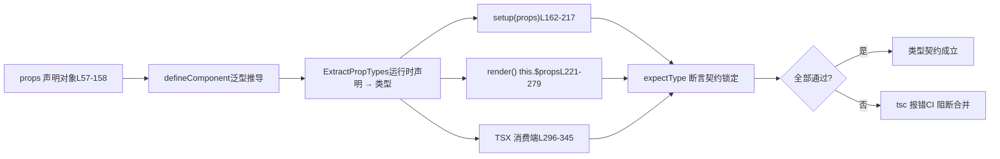

# Capítulo 6: Pruebas de contrato de tipos: cómo dts-test protege la superficie de la API

En el capítulo anterior rastreamos la cadena de generación de declaraciones de tipos y vimos cómo Vue garantiza, mediante configuración de compilación y pruebas de humo, que «los tipos del código fuente» y «los tipos publicados» sean estrictamente consistentes. Pero el contrato de tipos no se limita a «si la forma es correcta»; lo más crucial es «si la superficie de la API cumple con lo esperado»: qué tipos deben exportarse, cuáles no, y si las restricciones genéricas son precisas. Este capítulo entra en`packages-private/dts-test`, para ver cómo Vue utiliza más de 20 archivos`.test-d.ts`para llevar «los tipos como contrato de API» a pruebas automatizadas regresivas.

# Modelo cognitivo de las pruebas de contrato de tipos: convertir el «manual» en un «contrato ejecutable»

`dts-test`Los archivos del directorio tienen una característica contraintuitiva: casi**no producen ningún comportamiento en tiempo de ejecución**. Al abrir`defineComponent.test-d.tsx`, verás una gran cantidad de llamadas`defineComponent({...})`, pero nunca se ejecutan realmente durante la ejecución de las pruebas; estos archivos solo son sometidos por`tsc`/`vue-tsc`a verificación de tipos,`noEmit: true`garantizando que no se produzca ningún JS.

[FACT:packages-private/dts-test/tsconfig.test.json:1-11]

Esta configuración es el «entorno de ejecución» de todo el sistema de contratos:`noEmit`desactiva la emisión de artefactos,`jsx: preserve`deja que la sintaxis TSX sea analizada por el sistema de tipos,`strict`activa todas las comprobaciones estrictas,`moduleResolution: bundler`coincide con la semántica moderna de empaquetado,`lib`e introduce simultáneamente`esnext`y`dom`。**Sin este conjunto de configuración,`.test-d.tsx`el JSX dentro sería tratado como JSX en tiempo de ejecución, y las aserciones de tipos perderían sentido**。

> **[Design Inference & Architectural Trade-offs]**
> Separar las pruebas de tipos en un subpaquete`packages-private`independiente en lugar de meterlas en`packages/vue`de`__tests__`tiene tres motivaciones: primero, las dependencias de las pruebas de tipos son los tipos de nivel de publicación`vue`de**, no los módulos internos del código fuente; el aislamiento físico fuerza a pasar por la entrada pública; segundo,**（`vue/jsx`、`vue`la verificación de tipos de las pruebas de tipos consume mucho más tiempo que las pruebas unitarias en tiempo de ejecución, y un directorio independiente facilita la programación separada en CI; tercero,`.d.ts`los archivos no serán ejecutados erróneamente por el recolector en tiempo de ejecución de Vitest.`tsc`Analogía cotidiana: una prueba unitaria normal es como «encender la máquina y ver si echa humo», mientras que una prueba de contrato de tipos es como «revisar cláusula por cláusula antes de firmar un contrato»: no se realiza la transacción real, solo se confirma que «la cantidad a pagar por la parte A» está escrita en «yuanes» y no en «dólares». Si las cláusulas del contrato están mal, no importa cuán bien funcione la máquina.`.test-d.tsx`proporciona todas las herramientas para esta «verificación de contrato»:

Solo hay cuatro herramientas clave:

`utils.d.ts`afirma que el tipo de

[FACT:packages-private/dts-test/utils.d.ts:7-21]

es exactamente`expectType<T>(value: T)`afirma que`value`es asignable a`T`；`expectAssignable<T, T2 extends T>`determina si`T2`es un tipo unión;`T`；`IsUnion<T>`determina si`T`es`IsAny<T>`. Nótese el`T`de L5`any`: registra el espacio de nombres global JSX, permitiendo que`import 'vue/jsx'`dentro de TSX sea reconocido por el sistema de tipos como`<MyComponent />`La implementación de`JSX.Element`。

[FACT:packages-private/dts-test/utils.d.ts:7-21]

`IsUnion`merece un examen detallado:`T extends any ? (U extends T ? false : true) : never`utiliza tipos condicionales distributivos; si`T`es un tipo unión, cada miembro se evalúa de forma independiente, y finalmente`extends false`determina si todas las ramas devuelven`false`. Esto es**una prueba de existencia a nivel de tipos**: se usa para bloquear contratos como «`props.jjj`debe ser un tipo unión y no fusionarse en una única firma».

# Walkthrough guiado por escenarios:`defineComponent`cadena completa de inferencia de tipos de props en

`defineComponent.test-d.tsx`tiene 2260 líneas y es el núcleo del sistema de contratos. Nos situamos en un escenario concreto:**el usuario escribe`defineComponent({ props: {...}, setup(props) {...} })`, y el sistema de tipos de Vue necesita inferir a partir de la declaración en tiempo de ejecución de`props`el tipo preciso del parámetro`setup`dentro de`props`. Esta cadena es la parte más compleja del sistema de tipos de Vue.**Primer paso: construir el «tipo esperado» como base del contrato

## El archivo de prueba primero define la interfaz

, fijando explícitamente por escrito el tipo que debería inferirse para cada forma de declaración de props`ExpectedProps`**Esta interfaz es la versión escrita de las «cláusulas del contrato». Nótese algunos tipos sutiles:**：

[FACT:packages-private/dts-test/defineComponent.test-d.tsx:21-53]

(props opcionales con`a?: number | undefined`(tiene default, por lo que no es opcional),`undefined`）、`aa: number`declarado explícitamente),`aaa: number | null`（`PropType<number | null>`pero el tipo contiene`aaaa: number | undefined`（`required: true as const`). Estas diferencias no están escritas al azar; cada una corresponde a una rama específica en la declaración de`undefined`.`props`Segundo paso: «alimentar» con diversas formas de declaración a

## Este objeto`defineComponent`

[FACT:packages-private/dts-test/defineComponent.test-d.tsx:57-158]

es una`props`matriz exhaustiva de formas de declaración**, que cubre todas las maneras de escribir props en Vue:**—— abreviatura de constructor, inferido como

- `a: Number`—— tiene default, inferido como no opcional`number | undefined`
- `aa: { type: Number as PropType<number | undefined>, default: 1 }`evita que`number`
- `aaaa: { type: Number, required: true as const }` —— `as const`se amplíe a`true`, preservando el tipo literal`boolean`hace que la propiedad no sea void
- `b: { type: String, required: true as true }` —— `required: true`—— sin
- `bb: { default: 'hello' }`, infiere el tipo solo a partir del default`type`—— conversión de tipo explícita
- `cc: Array as PropType<string[]>`—— sintaxis de array, inferido como
- `l: [Date]`—— array de múltiples tipos, inferido como`Date | undefined`
- `ll: [Date, Number]`—— igual que el anterior`Date | number | undefined`
- `lll: [String, Number]`〔Inferencia de diseño y compensaciones arquitectónicas〕

> **[Design Inference & Architectural Trade-offs]**
> `required: true as const`(L70) y`required: true as true`(L75) es un rastro de evolución histórica: al principio se usaba`as true`, luego se descubrió que`as const`es más general (puede bloquear simultáneamente otros literales dentro del objeto), pero la forma antigua se conserva para verificar compatibilidad hacia atrás. Este es el valor típico de las pruebas de contrato:**bloquea simultáneamente «la nueva forma es usable» y «la forma antigua no regresa»**。

## Tercer paso: afirmar en las tres ubicaciones`setup` / `render` / `this`

Este es el diseño más ingenioso de las pruebas de contrato:**el mismo tipo de props debe inferirse correctamente en tres ubicaciones de consumo diferentes**。

[FACT:packages-private/dts-test/defineComponent.test-d.tsx:160-217]

`setup(props)`se hace`expectType<ExpectedProps['x']>(props.x)`para cada prop. Nótese el tratamiento especial de L168-170:

[FACT:packages-private/dts-test/defineComponent.test-d.tsx:168-170]

`// @ts-expect-error should included 'undefined'`junto con`expectType<number>(props.aaaa)`——**escribir deliberadamente una aserción que genere un error, usando`@ts-expect-error`para tragarse el error**. Esto verifica que`props.aaaa`el tipo de**no es** `number`(de lo contrario esta línea no daría error,`@ts-expect-error`sino que fallaría porque «no hay error que tragar»). Esta es la técnica de «aserción inversa» en las pruebas de tipos.

[FACT:packages-private/dts-test/defineComponent.test-d.tsx:204-205]

`// @ts-expect-error props should be readonly`junto con`props.a = 1`——verifica que los props son de solo lectura en`setup`. Si alguna refactorización hace accidentalmente que los props sean mutables, esta línea ya no dará error,`@ts-expect-error`y fallará.

`render()`En`this.$props`se afirma a través de dos rutas:`this.x`y

[FACT:packages-private/dts-test/defineComponent.test-d.tsx:221-279]

L252-276 verifica que «los props declarados también deben exponerse en`this`», L278-279 verifica que`this.a = 1`da error (los props en`this`también son de solo lectura). L281-287 verifica el desempaquetado del valor de retorno de setup:`this.c`es`number`（`ref(1)`desempaquetado),`this.d.e.value`es`string`(el ref anidado conserva`.value`）、`this.f.g`es`GT`（`reactive`el tipo branded en

## Cuarto paso: verificación de tipos en el lado del consumidor TSX

El último eslabón del contrato de tipos es «cómo el usuario utiliza este componente». En TSX, la verificación de props de`<MyComponent />`es una ruta de tipos independiente:

[FACT:packages-private/dts-test/defineComponent.test-d.tsx:296-322]

Aquí se verifica que`<MyComponent>`acepta todos los props declarados, así como`class`/`style`/`key`/`ref`/`ref_for`estos atributos integrados. Luego viene la**verificación inversa**：

[FACT:packages-private/dts-test/defineComponent.test-d.tsx:337-345]

`// @ts-expect-error missing required props`verifica que falta un prop obligatorio y da error;`wrong prop types`verifica que un tipo no coincidente da error; L342 verifica que`ggg="baz"`da error (`ggg`solo acepta`'foo' | 'bar'`）。

Toda la cadena puede resumirse con un diagrama de flujo de datos:



La clave de este diagrama es:**la misma declaración de`props`debe satisfacer simultáneamente las expectativas de tipo de tres posiciones de consumo**. Cualquier desviación en la inferencia en alguno de ellos hará que`tsc`dé error.

# Fronteras y puertas traseras:`__typeProps`、`__typeEmits`y contratos de tipos condicionales

`defineComponent`La inferencia de tipos de**tiene una limitación fundamental:**las declaraciones de props en tiempo de ejecución no pueden expresar «tipos condicionales»`color='white'`. Por ejemplo, la restricción «cuando`appearance`,`'outline'`debe ser`__typeProps`» no puede escribirse con la sintaxis de objeto en tiempo de ejecución. Para esto, Vue proporciona

## `__typeProps`y otras «puertas traseras de tipos».

[FACT:packages-private/dts-test/defineComponent.test-d.tsx:1803-1836]

`ConditionalProps`: la cápsula de escape de tipos para props condicionales`color`es un tipo unión: o bien`appearance`y`color: 'white'`son ambos opcionales, o bien`appearance: 'outline'`y

- L1823-1824：`<Comp color="white" />`. Las pruebas verifican:`color: 'white'`da error——proporcionar
- L1825-1826：`<Comp color="white" appearance="normal" />`por sí solo no satisface ninguna rama`appearance`da error——`'outline'`
- L1827：`<Comp color="white" appearance="outline" />`debe ser

> **[Design Inference & Architectural Trade-offs]**
> `__typeProps`〔Inferencia de diseño y compensaciones arquitectónicas〕

## `__typeEmits`La motivación de diseño de

`__typeEmits`es «permitir que el sistema de tipos exprese restricciones que no pueden expresarse en tiempo de ejecución». No participa en el análisis de props en tiempo de ejecución, es una cobertura puramente a nivel de tipos. El costo es que el usuario debe mantener manualmente la coherencia entre los tipos y la declaración en tiempo de ejecución——por eso se llama «backdoor» y no API oficial.**: equivalencia de las dos sintaxis de emits**：

[FACT:packages-private/dts-test/defineComponent.test-d.tsx:1838-1885]

admite dos sintaxis, y las pruebas`{ change: [id: number], update: [value: string] }`bloquean ambas simultáneamente`this.$props.onChange?.(123)`Sintaxis de objeto`onChange?.('123')`usa tuplas con nombre para expresar parámetros. Las pruebas verifican que

[FACT:packages-private/dts-test/defineComponent.test-d.tsx:1887-1934]

pasa y`{ (e: 'change', id: number): void; (e: 'update', value: string): void }`da error.**Sintaxis de firma de llamada**usa sobrecargas para expresarla.**Los cuerpos de prueba de ambas sintaxis son casi idénticos línea por línea**——esto es intencional: el contrato exige que ambas formas produzcan

> **[Design Inference & Architectural Trade-offs]**
> .`defineEmits`〔Inferencia de diseño y compensaciones arquitectónicas〕

## `__typeRefs`¿Por qué mantener dos sintaxis? La sintaxis de objeto se acerca más a la forma de escritura de`__typeEl`, y la sintaxis de firma de llamada se acerca más a los tipos de eventos tradicionales de TS. Vue necesita admitir ambas y garantizar un comportamiento consistente. La estructura de «espejo línea por línea» de las pruebas es la prueba de equivalencia más fuerte.

[FACT:packages-private/dts-test/defineComponent.test-d.tsx:1936-1952]

`__typeRefs`y`Parent`: referencias entre componentes y tipos de nodos anfitriones`__typeRefs: { child: ComponentInstance<typeof Child> }`permite que el componente padre conozca con precisión el tipo del ref del componente hijo.`refs.child.$refs.foo`declara`number`。

[FACT:packages-private/dts-test/defineComponent.test-d.tsx:1963-1977]

`__typeEl`, por lo que**puede inferirse como`Element`**es más sutil. El comentario de prueba en L1963-1977 señala la intención de diseño:`TypeEl`los nodos anfitriones de renderizadores personalizados (TUI, canvas, native) no son DOM`Element`, por lo que`CustomElement`no puede restringirse a`$el`. Las pruebas usan la interfaz

> **[Design Inference & Architectural Trade-offs]**
> puede aceptar cualquier tipo de anfitrión.`TypeEl`〔Inferencia de diseño y compensaciones arquitectónicas〕`Element`，`@vue/runtime-test`Esta es la garantía a nivel de tipos de que Vue 3 admite renderizadores personalizados. Si`$el`se restringiera rígidamente a

## , los usuarios de renderizadores no DOM como

`function syntax w/ runtime props`no podrían inferir correctamente el tipo de**. Lo que las pruebas de contrato protegen aquí es la «independencia del renderizador».**。

[FACT:packages-private/dts-test/defineComponent.test-d.tsx:1501-1545]

Restricción mutuamente excluyente entre componentes genéricos y props en tiempo de ejecución`generics aren't supported with object runtime props`La sección`<Comp3<string>>`fija una regla importante:

> **[Design Inference & Architectural Trade-offs]**
> El comentario`ExtractPropTypes`en L1501 es una declaración de contrato. L1525-1535 verifica que setup genérico + props de objeto da error; L1538-1539 verifica que

# da error. En cambio, los props de tipo array sí permiten genéricos (L1464-1499).

## `@ts-expect-error`〔Inferencia de diseño y compensaciones arquitectónicas〕

`@ts-expect-error`La causa raíz de esta restricción es el orden de inferencia de tipos: los props de objeto necesitan que**determine primero el tipo, mientras que los genéricos solo pueden determinarse en el momento de la instanciación, y ambos entran en conflicto. Los props de tipo array no participan en la extracción de tipos, por lo que no hay conflicto. Las pruebas de contrato solidifican esta «limitación del sistema de tipos» como aserciones regresionables.`@ts-expect-error`Reflexiones de diseño, recuperación de errores y trampas en producción**La espada de doble filo de

[FACT:packages-private/dts-test/defineComponent.test-d.tsx:1354-1362]

es la herramienta central de las pruebas de contrato de tipos, pero tiene una trampa fatal:`// @ts-expect-error missing prop`cuando el código debajo de ella ya no da error,`<Comp msg={123} />`ella misma da error**. Esto parece una protección, pero en realidad exige que el autor de la prueba controle con precisión «dónde ocurre el error».**Observa este fragmento:`expectType<JSX.Element>(...)`se coloca en`@ts-expect-error`la línea`expectType`anterior a

> **[Design Inference & Architectural Trade-offs]**
> . Si la posición de`@ts-expect-error`se desplaza una línea, o si el error ocurre realmente en la llamada a**en lugar de en el JSX, la prueba fallará.`@ts-expect-error`〔Inferencia de diseño y compensaciones arquitectónicas〕**Punto de trampa en producción: cuando una actualización de la versión de TypeScript provoca un ajuste fino en la posición del error, una gran cantidad de

## `IsAny`y`IsUnion`: Prueba de existencia a nivel de tipos

[FACT:packages-private/dts-test/defineComponent.test-d.tsx:1991-1993]

`expectType<IsAny<typeof props.foo>>(false)`verifica`props.foo`no es`any`. Esto es**contrato inverso**: no solo requiere que el tipo sea correcto, sino que también requiere que el tipo «no pueda degenerar en`any`」。`any`es un agujero negro del sistema de tipos, cualquier`any`hará que las aserciones posteriores pierdan sentido.

[FACT:packages-private/dts-test/defineComponent.test-d.tsx:195-196]

`expectType<IsUnion<typeof props.jjj>>(true)`verifica`jjj`es un tipo unión.`jjj`declarado como`((arg1: string) => string) | ((arg1: string, arg2: string) => string)`, si el sistema de tipos lo fusiona en una única firma,`IsUnion`devolverá`false`, la prueba falla.

> **[Design Inference & Architectural Trade-offs]**
> Estas dos herramientas protegen la «precisión del tipo» y no la «corrección del tipo». Un tipo que degenera en`any`o una unión que se fusiona, en la mayoría de escenarios de uso «parece funcionar», pero pierde las sugerencias del IDE y la verificación en tiempo de compilación. Las pruebas de contrato deben fijar esta precisión.

## Contrato implícito del orden de declaración

[FACT:packages-private/dts-test/defineComponent.test-d.tsx:1784-1801]

Este comentario es extremadamente crítico:`code generated by tsc / vue-tsc, make sure this continues to work so we don't accidentally change the args order of DefineComponent`。`DefineComponent`tiene 13 parámetros genéricos, el orden es**Contrato público**——`vue-tsc`el tipo de componente generado depende de este orden. La prueba usa`declare const MyButton: DefineComponent<...>`para escribir explícitamente los 13 parámetros, fijando el orden.

> **[Design Inference & Architectural Trade-offs]**
> Este es el contrato más fácil de pasar por alto: el orden de los parámetros genéricos no es un «detalle de implementación», sino la «ABI del código generado». Cualquier PR que ajuste el orden hará que el`vue-tsc`generado`.d.ts`sea incompatible con el tipo en tiempo de ejecución. Las pruebas de contrato actúan aquí como «guardián de compatibilidad de ABI».

## Contrato entre archivos:`componentInstance.test-d.tsx`complemento de

`componentInstance.test-d.tsx`solo tiene 154 líneas, pero cubre todas las formas de entrada de`ComponentInstance`tipos de utilidad:

[FACT:packages-private/dts-test/componentInstance.test-d.tsx:10-40]

`ComponentInstance<typeof CompSetup>`extrae el tipo de instancia del resultado de`defineComponent`;`ComponentInstance<typeof CompFunctional>`extrae de componentes funcionales;`ComponentInstance<typeof CompFunction>`extrae de funciones puras. Los tres deben inferir la clase base`ComponentPublicInstance`.

[FACT:packages-private/dts-test/componentInstance.test-d.tsx:71-116]

Más extremo es el «objeto puro sin`defineComponent`envoltorio»:`CompObjectSetup`、`CompObjectData`、`CompObjectNoProps`las tres formas deben poder ser extraídas correctamente por`ComponentInstance`. L113-114 es especialmente contraintuitivo:`CompObjectNoProps`no tiene declaración`props`, pero`compObjectNoProps.test`aún infiere como`string | undefined`——esto es el respaldo que proporciona la clase base`ComponentPublicInstance`.

[FACT:packages-private/dts-test/componentInstance.test-d.tsx:143-147]

La prueba`#12751`de L141 fija un límite:`__typeEmits`el evento`'update:visible'`declarado debe exponerse en la instancia como`comp['onUpdate:visible']`(clave de cadena con dos puntos), y el tipo de`$props`es`{ 'onUpdate:visible'?: (value?: boolean) => any }`. L152-153 verifica que`comp['$props']['$props']`reporta error——previniendo la autorreferencia recursiva de tipos.

# Resumen del capítulo

`dts-test`el directorio usa más de 20 archivos`.test-d.ts`para llevar «el tipo como contrato de API» a pruebas automatizadas de regresión. El mecanismo central tiene tres capas:

1. **Capa de herramientas**：`expectType`、`expectAssignable`、`IsUnion`、`IsAny`proporciona primitivas de aserción de tipos,`@ts-expect-error`proporciona capacidad de aserción inversa.

2. **Capa de contrato**：`ExpectedProps`la interfaz fija explícitamente «qué tipo debería inferirse»,`props`la matriz de declaraciones agota todas las formas de escritura, tres posiciones de consumo (`setup`/`render`/TSX) verificadas de forma cruzada.

3. **Capa de puerta trasera**：`__typeProps`、`__typeEmits`、`__typeRefs`、`__typeEl`proporciona una vía de escape para restricciones de tipos que no pueden expresarse en tiempo de ejecución, a la vez que fija la equivalencia de las dos sintaxis de emits.

# Reflexión y autoevaluación del capítulo

Q1: Si se elimina`defineComponent.test-d.tsx`de L168-170`@ts-expect-error`, dejando solo`expectType<number>(props.aaaa)`, ¿qué sucedería? ¿Por qué esta prueba «fallaría silenciosamente»?

**Análisis de referencia**：

`props.aaaa`declarado como`{ type: Number as PropType<number | undefined>, required: true as const }`, su tipo inferido es`number | undefined`(porque`PropType<number | undefined>`incluye explícitamente`undefined`）。

`expectType<number>(props.aaaa)`requiere que`props.aaaa`sea exactamente`number`. Dado que el tipo real es`number | undefined`, esta línea**por sí misma reportaría error**。`@ts-expect-error`la función de

es «esperar que aquí se reporte error, y tragárselo».`@ts-expect-error`Si se elimina**, esta línea reportaría error directamente, la prueba falla——parece «más estricto». Pero el problema es:`props.aaaa`si alguna refactorización hace que`number`realmente se convierta en`@ts-expect-error`(corrección de bug o cambio de comportamiento), esta línea ya no reporta error, y al eliminar**la prueba pasaría

——en ese momento la prueba no puede distinguir entre «tipo correcto» y «tipo incorrecto pero que casualmente no reporta error».`@ts-expect-error`Conservar**la forma de escritura es**bloqueo bidireccional`number | undefined`: tanto requiere que «el tipo actual sea`@ts-expect-error`» (tragando el error de`expectType<number>`mediante`number`), como requiere que «el tipo no pueda ser`number`，`@ts-expect-error`» (si se convierte en**fallará porque no hay error que tragar). Esta es la técnica central de las pruebas de contrato de tipos——**。

[FACT:packages-private/dts-test/defineComponent.test-d.tsx:168-170]

Q2: `__typeProps`usar «error esperado» para fijar «el tipo debe contener cierto componente»`ConditionalProps`la prueba de puerta trasera (L1803-1836) verifica las restricciones de tipos unión condicionales. Si se cambia`{ color?: 'normal' | 'primary' | 'secondary' | 'white'; appearance?: 'normal' | 'outline' | 'text' }`de tipo unión a`__typeProps`(es decir, aplanar todas las opciones), ¿cómo fallaría la prueba? ¿Qué restricción de diseño de

**ilustra esto?**：

Análisis de referencia`color`El tipo aplanado permite cualquier combinación de`appearance`y`color: 'white'` + `appearance: 'normal'`, incluyendo**. Pero la prueba L1825-1826 requiere explícitamente que esta combinación**：

```
// @ts-expect-error
;
```

Copiar`@ts-expect-error`Si el tipo se aplana, esta línea ya no reporta error,`<Comp color="white" />`falla porque «no hay error que tragar». Al mismo tiempo,`@ts-expect-error`de L1823-1824 también pasaría de «reportar error» a «pasar», haciendo que

falle igualmente.`__typeProps`Esto indica que la restricción de diseño de**es:**。`__typeProps`debe conservar la semántica de «exclusión mutua de ramas» del tipo unión`Props`no es simplemente «cobertura de tipos», sino «expresar con el sistema de tipos restricciones condicionales que los props en tiempo de ejecución no pueden expresar». Si en la implementación se aplica a`Prettify`alguna transformación de mapeo como`Omit`o

> **[Design Inference & Architectural Trade-offs]**
> 〔Inferencia de diseño y compensaciones arquitectónicas〕`__typeProps`Esta es también la razón por la que los casos de prueba de`CommonProps & ConditionalProps`usan la intersección más simple de

Q3: `DefineComponent`, en lugar de tipos mapeados más «elegantes»——cualquier transformación de tipos adicional podría ocultar bugs.`VNodeProps & AllowedComponentProps & ComponentCustomProps`el orden de los 13 parámetros genéricos de`Readonly<ExtractPropTypes<{}>>`está fijado explícitamente por L1784-1801. Si alguna refactorización intercambia el 9.º parámetro (

**) con el 10.º parámetro (**：

`DefineComponent`), ¿qué elementos posteriores se verían afectados? ¿Por qué las pruebas de contrato deben fijar este orden?`vue-tsc`Análisis de referencia`<script setup>`el orden de los parámetros genéricos de`defineProps` / `defineEmits`，`vue-tsc`es la «ABI» al generar el tipo de componente. Cuando el usuario escribe`CreateComponentPublicInstance<...>`en**, se genera un tipo**similar a L1999-2116, donde la

posición

1. `vue-tsc`de los parámetros genéricos determina el significado de cada parámetro de tipo.`.d.ts`Si se intercambian los parámetros 9.º y 10.º:`DefineComponent`el`VNodeProps & AllowedComponentProps & ComponentCustomProps`generado rellenará los parámetros según el orden antiguo, pero`Readonly<ExtractPropTypes<{}>>`los interpretará según el orden nuevo——**Los tipos de props del componente de usuario están todos desalineados**。

2. L1786-1800 de`declare const MyButton: DefineComponent<...>`reportará un error directamente — porque`{}`y`VNodeProps & ...`no son compatibles.

3. L1999-2116 de`ErrorMessage`tipo (simula`vue-tsc`resultado generado) también reportará un error.

El valor de que las pruebas de contrato fijen el orden radica en:**eleva el «orden de los parámetros genéricos» de «detalle de implementación» a «contrato público»**. Cualquier PR que ajuste el orden hará que L1786-1800 falle inmediatamente, bloqueando cambios incompatibles antes de su publicación.

[FACT:packages-private/dts-test/defineComponent.test-d.tsx:1784-1801]

> **[Design Inference & Architectural Trade-offs]**
> Este es el valor más subestimado de las pruebas de contrato de tipos: no protegen «si los tipos son correctos», sino «la estabilidad de la interfaz del sistema de tipos». El orden de los parámetros genéricos,`@ts-expect-error`la posición de`IsAny`el valor de retorno de

, todos forman parte del «ABI de tipos».

Las pruebas de contrato de tipos resuelven «si la superficie de la API cumple con lo esperado». Pero los tipos son solo la mitad de la ingeniería de Vue — la otra mitad es «cómo el usuario verifica en tiempo real el comportamiento de estas APIs en el navegador». El siguiente capítulo entrará en SFC Playground, para ver cómo Vue empaqueta el compilador, el runtime y el sistema de tipos en un entorno de depuración en tiempo real dentro del navegador, permitiendo al usuario ver el producto compilado y el resultado en ejecución en el instante en que modifica el código.`IsAny`/`IsUnion`Las pruebas de contrato no solo protegen «si los tipos son correctos», sino también «si los tipos son precisos» (`DefineComponent`), «si el orden de los parámetros genéricos es estable» (`__typeEl`13 parámetros), «independencia del renderizador» (`Element`no se restringe a`vue-tsc`). Una vez que estas restricciones se rompen, las sugerencias del IDE del lado del usuario,`packages-private/sfc-playground`los tipos generados derivarán. Y la estabilidad del contrato de tipos, en última instancia, debe servir a la experiencia de depuración diaria del desarrollador — el siguiente capítulo entraremos en
