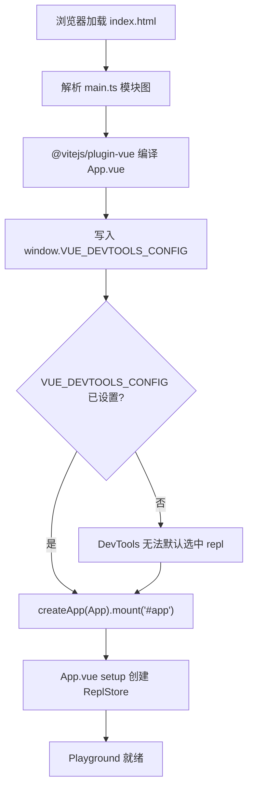
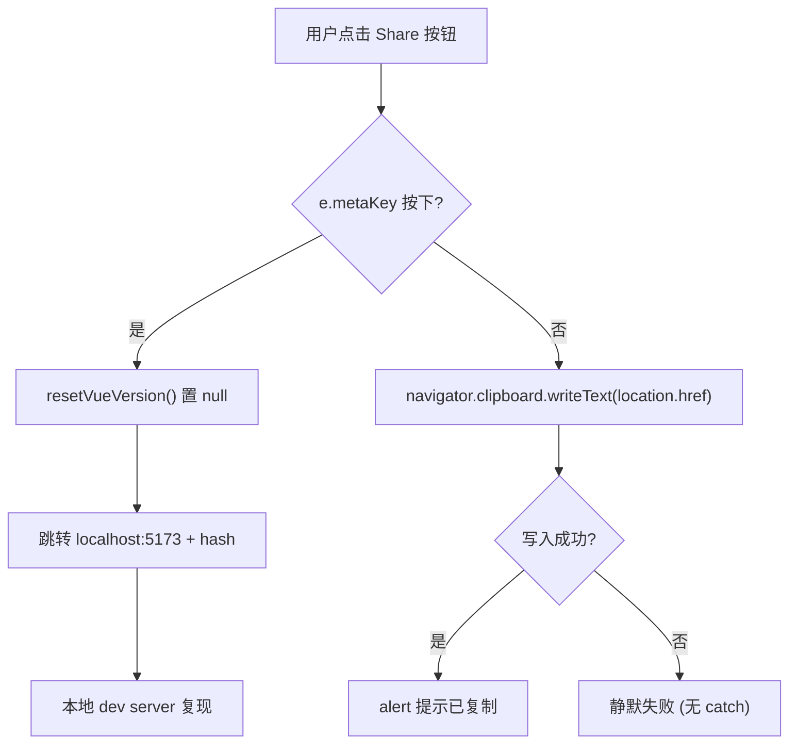
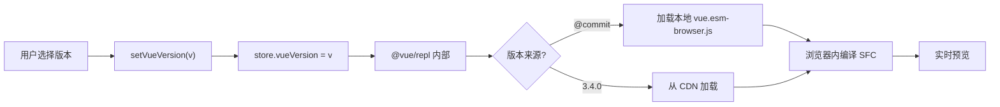

# Capítulo siguiente: Capítulo 7 →

Estado de verificación: líneas FACT ancladas realmente`.test-d.ts`En el capítulo anterior usamos más de 20`packages-private/sfc-playground`archivos para clavar «los tipos como contrato de API» en CI. Pero el contrato de tipos solo responde «cómo se ve la superficie de la API», no puede responder «cómo se ve exactamente este SFC al compilarse» ni «si el resultado del renderizado es consistente en modo SSR». Para responder las dos últimas preguntas, el equipo de Vue necesita un sandbox que pueda ejecutar la canalización de compilación completa en el navegador — este es`packages/`. Tiene una diferencia esencial con los paquetes públicos bajo`package.json`:`"private": true`en`"version": "0.0.0"` [FACT:packages-private/sfc-playground/package.json:2-4]y`vue`, lo que significa que nunca se publica en npm, es solo una herramienta de depuración oficial. Entre sus dependencias`workspace:*` [FACT:packages-private/sfc-playground/package.json:19]apunta a

# , es decir, al producto de compilación del código fuente local, no a la versión estable en npm — esto hace que el Playground sea naturalmente una «demostración viva del commit actual». Este capítulo se centra en tres preguntas: cómo se inicializa la entrada, cómo el Header impulsa el cambio de estado, y cómo se inyectan las constantes en tiempo de compilación.

## I. El minimalismo de la entrada: el contrato de inicialización de main.ts y ReplStore

`main.ts`Modelo intuitivo`window`solo tiene 9 líneas, como un «script de autocomprobación al arrancar»: antes de montar la aplicación Vue, primero se coloca en

## una configuración global, diciéndole a Vue DevTools «qué app seleccionar por defecto». Sin este paso, DevTools al abrirse se enfrentaría a múltiples instancias de app (el propio Playground + el código ejecutándose en el REPL del usuario) y no podría enfocarse automáticamente, la experiencia de depuración degeneraría en cambio manual.

`main.ts`Estructura de datos y efectos secundarios globales`createApp`El núcleo de`window`no es

[FACT:packages-private/sfc-playground/src/main.ts:4-7]

```ts
// @ts-expect-error Custom window property
window.VUE_DEVTOOLS_CONFIG = {
  defaultSelectedAppId: 'repl',
}
```

:

> **[Design Inference & Architectural Trade-offs]**
> 1. **`@ts-expect-error`Aquí hay dos detalles de ingeniería que merecen atención:`@ts-ignore`**：`window`〔Inferencia de diseño y compensaciones arquitectónicas〕`Window & typeof globalThis`en lugar de`VUE_DEVTOOLS_CONFIG`el tipo estándar de`@ts-expect-error`no tiene el campo`@types/*`. Usar`@ts-expect-error`significa «sé que aquí dará error, y exijo que dé error» — si en el futuro algún**añade este campo,**。

> **[Design Inference & Architectural Trade-offs]**
> 2. **`defaultSelectedAppId: 'repl'`usar el sistema de tipos para proteger la intención, no para ocultar problemas**〔Inferencia de diseño y compensaciones arquitectónicas〕`'repl'`la convención de cadena de`@vue/repl`: este`@vue/repl`debe coincidir exactamente con el id usado al crear la app dentro de

## . Es un contrato literal entre paquetes, sin ninguna protección de restricción de tipos — una vez que

cambie el id, la selección por defecto de DevTools del Playground fallará silenciosamente.

Step-by-Step: de HTML al montaje`index.html`El flujo de ejecución es extremadamente corto, pero cada paso tiene restricciones implícitas:`<div id="app">`1. El navegador carga`mount('#app')`, que contiene

(no proporcionado en este material, pero`main.ts`se puede inferir a la inversa).`import App from './App.vue'` [FACT:packages-private/sfc-playground/src/main.ts:2]2. Resolución del grafo de módulos:`@vitejs/plugin-vue`en la parte superior de

> **[Design Inference & Architectural Trade-offs]**
> 3. **la compilación SFC de**：`window.VUE_DEVTOOLS_CONFIG`〔Inferencia de diseño y compensaciones arquitectónicas〕`createApp(App).mount('#app')` [FACT:packages-private/sfc-playground/src/main.ts:9]Orden clave`createApp`debe escribirse antes de

4. `mount('#app')`. Porque el hook de DevTools se registra dentro de`App.vue`, escribir la configuración después del mount no podrá afectar la primera selección.`ReplStore`dispara`App.vue`el setup de



## (en

`main.ts`, no incluido en este material).**Copiar`App.vue`Reflexiones de diseño y trampas`ReplStore`**. El punto de entrada solo asume dos responsabilidades: «inyección de efectos secundarios globales + montaje». Ninguna lógica de negocio debería aparecer aquí. Esta es la decisión de compromiso de Playground como «herramienta de depuración» en lugar de «producto»: no necesita compatibilidad con SSR, no necesita múltiples puntos de entrada, no necesita carga diferida.

> **[Design Inference & Architectural Trade-offs]**
> Puntos problemáticos en producción:`window.VUE_DEVTOOLS_CONFIG`es**singleton global**. Si Playground se incrusta en otra página que también usa DevTools (como en un escenario de iframe), el último en escribir sobrescribirá al primero. Dado que Playground normalmente se despliega de forma independiente, este riesgo se acepta.

---

# II. Header.vue: estado derivado con computed y flujo de datos unidireccional con emit

## Modelo intuitivo

`Header.vue`es el «panel de control» de Playground: selección de versión, conmutación PROD/DEV, interruptor SSR, cambio de tema, compartir, descargar. Por sí mismo**no posee ningún estado de negocio**, todo el estado proviene de`props.store`y props booleanos, todos los cambios se reportan mediante`emit`al componente padre. Sin esta restricción de «componente tonto + propagación de eventos», Header se convertiría en un foco de dispersión de estado, y los efectos secundarios del cambio de versión y del cambio de SSR no podrían gestionarse de forma centralizada.

## Análisis de estructuras de datos y campos

La definición de props de Header es la clave para entender sus responsabilidades:

[FACT:packages-private/sfc-playground/src/Header.vue:13-19]

```ts
const props = defineProps()
```

Los cinco props se dividen en dos categorías:

- **`store: ReplStore`**: la única referencia al contenedor de estado, proveniente de`@vue/repl`. Header lo usa para leer`store.loading`、`store.vueVersion`、`store.typescriptVersion`, y escribe directamente en`store.vueVersion`。
- **cuatro props booleanos/literales**：`prod`、`ssr`、`autoSave`、`theme`. Son**estado controlado**, Header solo lee, no escribe; los cambios deben`emit`。

la lista de emit correspondiente[FACT:packages-private/sfc-playground/src/Header.vue:20-28]：

```ts
const emit = defineEmits([
  'toggle-theme',
  'toggle-ssr',
  'toggle-prod',
  'toggle-autosave',
  'reload-page',
])
```

Nótese que`toggle-theme`aunque es generado internamente por`toggleDark()`, pero`emit`es usado directamente en la plantilla`toggle-ssr`/`toggle-prod`/`toggle-autosave`como`$emit`. Esta mezcla es un estilo común en Vue 3[FACT:packages-private/sfc-playground/src/Header.vue:102-118]:`<script setup>`cuando se necesitan efectos secundarios se usa emit como función, para reenvío puro se usa la plantilla**Paso a paso: visualización y cambio de versión`$emit`**。

## Contextualizando: el usuario abre Playground, Header necesita mostrar la versión actual de Vue.

Paso 1: computed deriva el texto a mostrar

**Copiar**

[FACT:packages-private/sfc-playground/src/Header.vue:30-37]

```ts
const vueVersion = computed(() => {
  if (store.loading) {
    return 'loading...'
  }
  return store.vueVersion || `@${__COMMIT__}`
})
```

estado →`loading`; el usuario seleccionó explícitamente una versión →`'loading...'`; de lo contrario →`store.vueVersion`(hash corto del commit actual).`@${__COMMIT__}`es una constante inyectada en tiempo de compilación, se detalla en la siguiente sección.`__COMMIT__`Paso 2: enlace bidireccional de VersionSelect

**Copiar**

[FACT:packages-private/sfc-playground/src/Header.vue:88-88]

```html

```

no se usó**, sino que se descompone explícitamente en`v-model`**. La razón es que`:model-value` + `@update:model-value`es computed (solo lectura), no puede enlazarse bidireccionalmente de forma directa; debe escribirse mediante`vueVersion`esta función setter`setVueVersion`Copiar`store.vueVersion`：

[FACT:packages-private/sfc-playground/src/Header.vue:39-41]

```ts
async function setVueVersion(v: string) {
  store.vueVersion = v
}

function resetVueVersion() {
  store.vueVersion = null
}
```

> **[Design Inference & Architectural Trade-offs]**
> `setVueVersion`pero internamente no tiene`async`—¿es legado histórico o intencional? Se especula que es para alinearse con la semántica de carga asíncrona de`await`(cambiar de versión dispara carga remota), manteniendo la consistencia de la interfaz.`VersionSelect`Paso 3: comparación con la versión TypeScript

**Copiar**

[FACT:packages-private/sfc-playground/src/Header.vue:76-80]

```html

```

, porque`v-model`es una propiedad normal escribible, no necesita envoltura computed.`store.typescriptVersion`El mismo componente usa dos formas de enlace en la misma plantilla**, lo cual es una manifestación直观 de «controlado vs no controlado».**Cambio de tema: combinación de efectos secundarios y emit

## Copiar

[FACT:packages-private/sfc-playground/src/Header.vue:58-66]

```ts
function toggleDark() {
  const cls = document.documentElement.classList
  cls.toggle('dark')
  localStorage.setItem(
    'vue-sfc-playground-prefer-dark',
    String(cls.contains('dark')),
  )
  emit('toggle-theme', cls.contains('dark'))
}
```

Nótese que no modifica directamente**—porque los props son de solo lectura, el componente padre solo actualizará`props.theme`**tras recibir`toggle-theme`, lo que a su vez impulsa el texto`theme`en la plantilla`:title`〔Inferencia de diseño y compensaciones arquitectónicas〕[FACT:packages-private/sfc-playground/src/Header.vue:123]。

> **[Design Inference & Architectural Trade-offs]**
> la manipulación de clases del DOM y el estado reactivo de Vue son dos rutas independientes**modifica directamente el DOM, mientras que el prop**。`document.documentElement.classList.toggle('dark')`se actualiza a través de Vue. Si ambos no están sincronizados (por ejemplo, el componente padre rechaza la actualización), la UI presentará una inconsistencia de «clase ya cambiada pero texto del title sin cambiar». En la práctica el componente padre siempre acepta el emit, así que el problema no se manifiesta.`theme`Lógica oculta: la rama metaKey de copyLink

## Copiar

[FACT:packages-private/sfc-playground/src/Header.vue:47-56]

```ts
async function copyLink(e: MouseEvent) {
  if (e.metaKey) {
    resetVueVersion()
    // hidden logic for going to local debug from play.vuejs.org
    window.location.href = 'http://localhost:5173/' + window.location.hash
    return
  }
  await navigator.clipboard.writeText(location.href)
  alert('Sharable URL has been copied to clipboard.')
}
```

puerta trasera para desarrolladores**: al mantener presionado Cmd sobre**y hacer clic en el botón de compartir, se redirige a`play.vuejs.org`(servidor dev local), llevando consigo el hash de la URL actual. El hash codifica el estado completo del REPL (código fuente, versión, opciones), por lo que la depuración local puede reproducir problemas en línea. El comentario`localhost:5173`marca explícitamente que esta es una funcionalidad oculta intencional.`// hidden logic for going to local debug from play.vuejs.org` [FACT:packages-private/sfc-playground/src/Header.vue:47-56]〔Inferencia de diseño y compensaciones arquitectónicas〕

> **[Design Inference & Architectural Trade-offs]**
> `resetVueVersion()`en`store.vueVersion`, asegurando que la depuración local use el commit actual en lugar de la versión seleccionada en línea.`null`Copiar



## 〔Inferencia de diseño y compensaciones arquitectónicas〕

> **[Design Inference & Architectural Trade-offs]**
> **permisos y contexto de seguridad de`navigator.clipboard`no tiene try/catch**。`copyLink`. En entornos sin HTTPS o cuando el usuario rechaza el permiso del portapapeles,[FACT:packages-private/sfc-playground/src/Header.vue:47-56]será rechazado, provocando un Promise rejection no capturado. Playground se despliega sobre HTTPS, el riesgo se acepta, pero esta es una típica «trampa de entorno de producción».`writeText`〔Inferencia de diseño y compensaciones arquitectónicas〕

> **[Design Inference & Architectural Trade-offs]**
> **clave de localStorage hardcodeada en`toggleDark`es un literal de cadena, sin extracción a constante. Si en el futuro se quiere cambiar la clave, habrá que hacer una búsqueda global.**。`'vue-sfc-playground-prefer-dark'`Trampa 3:

**comparación entre`currentCommit`y`vueVersion`. En la plantilla**。模板里 `:class="{ active: vueVersion === \`@${currentCommit}\` }"` [FACT:packages-private/sfc-playground/src/Header.vue:88-88]Comparar mediante concatenación de cadenas. Si`__COMMIT__`la inyección falla (se convierte en`undefined`), aquí se convertirá en`'@undefined'`, nunca coincidirá. La fiabilidad de la inyección de constantes en tiempo de compilación determina directamente la corrección de la UI—este es precisamente el tema de la siguiente sección.

---

# Tres, inyección de constantes en tiempo de compilación: la doble responsabilidad de __COMMIT__ y copyVuePlugin

## Modelo intuitivo

`vite.config.ts`es el «taller de ensamblaje» del Playground: ejecuta en tiempo de compilación`git rev-parse`para obtener el hash del commit, y mediante`define`lo convierte en la constante global`__COMMIT__`; al mismo tiempo, mediante un plugin personalizado copia los artefactos ESM del navegador bajo`packages/vue/dist/`al directorio de artefactos del Playground. Sin este paso, el Playground no podría cargar en el navegador «el runtime de Vue del commit actual»—solo podría depender de la versión estable de npm, perdiendo el significado de «demostración en vivo».

## Estructuras de datos y constantes en tiempo de compilación

[FACT:packages-private/sfc-playground/vite.config.ts:7-9]

```ts
const commit = spawnSync('git', ['rev-parse', '--short=7', 'HEAD'])
  .stdout.toString()
  .trim()
```

`spawnSync`ejecuta síncronamente el comando git,`--short=7`toma el hash corto de 7 dígitos. La ejecución síncrona es intencional:**el archivo de configuración necesita el valor de`commit`durante la fase de carga del módulo**, lo asíncrono alteraría el orden de resolución de la configuración de Vite.

[FACT:packages-private/sfc-playground/vite.config.ts:23-26]

```ts
define: {
  __COMMIT__: JSON.stringify(commit),
  __VUE_PROD_DEVTOOLS__: JSON.stringify(true),
},
```

`define`es el mecanismo de**reemplazo de texto**de Vite: todo`__COMMIT__`en el código fuente será reemplazado por el resultado de`JSON.stringify(commit)`(es decir, un literal de cadena entre comillas).`JSON.stringify`es necesario—si se escribiera directamente`commit`, tras el reemplazo se convertiría en el identificador desnudo`abc1234`, siendo tratado como nombre de variable en lugar de cadena.

> **[Design Inference & Architectural Trade-offs]**
> `__VUE_PROD_DEVTOOLS__: true`es otra constante clave: permite que la**compilación de producción**de Vue también conserve el soporte de DevTools. Por defecto, la compilación de producción elimina el hook de DevTools para reducir el tamaño, pero el Playground necesita depurar el código del usuario, por lo que se fuerza su activación.

## Paso a paso: el traslado de artefactos de copyVuePlugin

[FACT:packages-private/sfc-playground/vite.config.ts:32-63]

```ts
function copyVuePlugin(): Plugin {
  return {
    name: 'copy-vue',
    generateBundle() {
      const copyFile = (file: string) => {
        const filePath = path.resolve(
          import.meta.dirname,
          '../../packages',
          file,
        )
        const basename = path.basename(file)
        if (!fs.existsSync(filePath)) {
          throw new Error(
            `${basename} not built. ` +
              `Run "nr build vue -f esm-browser" first.`,
          )
        }
        this.emitFile({
          type: 'asset',
          fileName: basename,
          source: fs.readFileSync(filePath, 'utf-8'),
        })
      }

      copyFile(`vue/dist/vue.esm-browser.js`)
      copyFile(`vue/dist/vue.esm-browser.prod.js`)
      copyFile(`vue/dist/vue.runtime.esm-browser.js`)
      copyFile(`vue/dist/vue.runtime.esm-browser.prod.js`)
      copyFile(`server-renderer/dist/server-renderer.esm-browser.js`)
    },
  }
}
```

Análisis punto por punto de los aspectos clave:

1. **`generateBundle`Hook**: se ejecuta después de que Rollup genere el bundle y antes de escribirlo en disco. En este momento se puede`emitFile`insertar archivos adicionales en los artefactos.

2. **`import.meta.dirname`**: versión ESM de`__dirname`proporcionada por Node 20.11+. La ruta`../../packages`asciende desde`packages-private/sfc-playground/`hasta la raíz del repositorio, y luego entra en`packages/`。

3. **Verificación de existencia + error explícito**: si`vue.esm-browser.js`no existe, lanza un error con instrucciones de reparación`Run "nr build vue -f esm-browser" first.`. Esto es un ejemplo ejemplar de**experiencia de desarrollador**—el mensaje de error te dice directamente cómo arreglarlo.

4. **Cinco artefactos**：`vue`versión completa/versión runtime × dev/prod, más`server-renderer`. Estos cinco archivos son precisamente el conjunto de candidatos para el import dinámico del Playground en el navegador, correspondientes al cambio de versión y al interruptor SSR en el Header.

> **[Design Inference & Architectural Trade-offs]**
> **¿Por qué estos cinco?**La versión completa (con compilador) se usa para escenarios de «compilación en runtime»; la versión runtime para escenarios de «precompilación»; dev/prod corresponden al interruptor PROD/DEV del Header; server-renderer corresponde al interruptor SSR. Estos cinco archivos constituyen la «matriz de runtime de Vue» del Playground.

## Flujo de datos completo del cambio de versión

Viendo en conjunto el`setVueVersion`del Header y los artefactos de copyVuePlugin:



Nótese el valor especial`@${__COMMIT__}`: corresponde a los artefactos locales copiados por copyVuePlugin, no a un CDN. Por eso el Playground debe copiar los artefactos de compilación de Vue para el navegador—**la opción «This Commit» necesita archivos locales**。

## Reflexiones de diseño y trampas

> **[Design Inference & Architectural Trade-offs]**
> **Trampa 1:`spawnSync`manejo de fallos de**. Si el directorio actual no es un repositorio git (por ejemplo, extraído de un tarball),`spawnSync`devolverá un código de salida distinto de cero,`stdout`estará vacío,`commit`se convertirá en cadena vacía. En ese momento`__COMMIT__`es reemplazado por`""`, en el Header`@${currentCommit}`se convierte en`'@'`. No hay manejo explícito de errores.

> **[Design Inference & Architectural Trade-offs]**
> **Trampa 2:`optimizeDeps.exclude: ['@vue/repl']`** [FACT:packages-private/sfc-playground/vite.config.ts:27-29]. Vite por defecto preempaqueta las dependencias para acelerar el arranque en frío, pero`@vue/repl`está excluido. La razón es que`@vue/repl`usa internamente import dinámico y workers, y el preempaquetado rompería estos mecanismos. Este es un problema común en el ecosistema Vite de «conflicto entre preempaquetado y carga dinámica».

> **[Design Inference & Architectural Trade-offs]**
> **Trampa 3:`script.fs`configuración** [FACT:packages-private/sfc-playground/vite.config.ts:13-19]。`@vitejs/plugin-vue`la opción`script.fs`permite que el bloque`<script>`de SFC lea archivos mediante`fs`. Aquí se pasan`fs.existsSync`y`fs.readFileSync`, para soportar el análisis de sentencias`import`en SFC (por ejemplo,`import x from './foo'`necesita verificar si el archivo existe).**Esta es la clave para que el Playground pueda simular la resolución completa de módulos en el navegador**—inyecta la capacidad fs de Node en la fase de resolución del compilador.

---

# Reflexión de diseño: compensaciones arquitectónicas del Playground

Viendo las tres subsecciones en conjunto, la arquitectura del Playground sigue un principio claro:**separar el «estado» de los «efectos secundarios», separar el «tiempo de compilación» del «tiempo de ejecución»**。

- `main.ts`solo hace inyección de efectos secundarios globales, sin tocar el estado de negocio.
- `Header.vue`es un componente puramente presentacional, el estado fluye hacia dentro mediante props y hacia fuera mediante emit.
- `vite.config.ts`solidifica la información de tiempo de compilación «commit actual» como una constante, de solo lectura en tiempo de ejecución.

> **[Design Inference & Architectural Trade-offs]**
> Esta separación aporta un beneficio directo:**el Playground puede incrustarse en cualquier aplicación Vue**(por ejemplo, ejemplos incrustados en sitios de documentación), siempre que se proporcionen`store`y cuatro props booleanos.

El costo es**Estado disperso**：`store`En`@vue/repl`, el estado booleano está en el componente padre, la clase DOM está en`document.documentElement`, y hay otra copia en localStorage. Cuatro ubicaciones de estado necesitan sincronización manual, y cualquier desincronización causará inconsistencia en la UI.

> **[Design Inference & Architectural Trade-offs]**
> Otra compensación es**renunciar a la compatibilidad con SSR**。`main.ts`acceder directamente a`window`，`Header.vue`de`toggleDark`acceder directamente a`document`. Playground es una aplicación puramente CSR, no necesita considerar renderizado del lado del servidor.

---

# Resumen del capítulo

Este capítulo analizó`packages-private/sfc-playground`los tres archivos principales:

1. **`main.ts`**: entrada de 9 líneas, el núcleo es el orden de inyección de`window.VUE_DEVTOOLS_CONFIG`— debe ser antes de`mount`.

2. **`Header.vue`**: mediante`computed`derivar`vueVersion`, mediante`emit`reportar todos los cambios de estado.`copyLink`la rama`metaKey`es una puerta trasera oculta de depuración local.

3. **`vite.config.ts`**：`spawnSync`obtener el hash del commit,`define`inyectar`__COMMIT__`，`copyVuePlugin`copiar los cinco artefactos de navegador de Vue al directorio de artefactos de Playground.

El hilo conductor que atraviesa los tres es**la frontera entre constantes de tiempo de compilación y estado de tiempo de ejecución**：`__COMMIT__`es un hecho de tiempo de compilación de solo lectura,`store.vueVersion`es una elección de tiempo de ejecución mutable, el`vueVersion`computed del Header unifica ambos en una cadena de visualización.

# Reflexión y autoevaluación del capítulo

Q1: Si se mueve la asignación de`main.ts`en`window.VUE_DEVTOOLS_CONFIG`a después de`createApp(App).mount('#app')`, ¿qué sucedería? ¿Por qué?

**Análisis de referencia**：`window.VUE_DEVTOOLS_CONFIG`es la configuración que Vue DevTools lee al registrar el hook dentro de`createApp`registrará inmediatamente[FACT:packages-private/sfc-playground/src/main.ts:4-9]。`createApp`, en este momento DevTools leerá`__VUE_DEVTOOLS_GLOBAL_HOOK__`para decidir qué app seleccionar por defecto. Si la asignación ocurre después de`defaultSelectedAppId`, DevTools ya habrá completado la primera selección de app, la configuración no surtirá efecto, y el usuario necesitará cambiar manualmente a la app`mount`en DevTools. Lo más sutil es que: dado que`repl`internamente también crea una app, una asignación tardía puede causar que DevTools seleccione por defecto el propio Playground en lugar del REPL del usuario, requiriendo cambio manual al depurar código del usuario. Esto refleja la importancia del «orden de inyección de efectos secundarios globales» en herramientas de depuración.`@vue/repl`el

Q2: `Header.vue`de`toggleDark()`opera simultáneamente sobre la clase DOM, localStorage y emit, pero no modifica directamente`props.theme`. Si el componente padre, tras recibir el evento`toggle-theme`, rechaza actualizar el prop`theme`, ¿qué inconsistencia en la UI aparecería? ¿Cómo localizarlo desde el nivel del código fuente?

**Análisis de referencia**：`toggleDark()`en[FACT:packages-private/sfc-playground/src/Header.vue:58-66]llama directamente a`document.documentElement.classList.toggle('dark')`, esto cambiará inmediatamente la clase`dark`en el DOM, activando el cambio de variable CSS (ver la regla[FACT:packages-private/sfc-playground/src/Header.vue:186-186]de`.dark nav`). Pero el texto`:title`en la plantilla[FACT:packages-private/sfc-playground/src/Header.vue:123]depende de`props.theme`, si el componente padre no actualiza, el title permanecerá en el valor antiguo. Método de localización: verificar en DevTools del navegador si la clase de`<html>`y el atributo title del botón se contradicen. La causa raíz es que «efecto secundario del DOM» y «estado reactivo de Vue» siguen dos rutas independientes, sin una única fuente de datos.

Q3: `copyVuePlugin`en`generateBundle`realizar una verificación`fs.existsSync`para cada archivo, lanzando un error con instrucciones de reparación cuando falta. Si se elimina esta verificación y se ejecuta directamente`fs.readFileSync`, ¿qué sucedería en un entorno CI (sin haber construido vue previamente)? ¿Cómo induciría a error el mensaje de error a los desarrolladores?

**Análisis de referencia**: tras eliminar la verificación,`fs.readFileSync`lanzará`ENOENT: no such file or directory, open '.../packages/vue/dist/vue.esm-browser.js'` [FACT:packages-private/sfc-playground/vite.config.ts:32-63]. Este error solo indica al desarrollador «el archivo no existe», pero no le dice «necesitas ejecutar`nr build vue -f esm-browser`primero». En un entorno CI, el desarrollador podría malinterpretar como error de configuración de rutas, problema de permisos o submódulo git no inicializado, desperdiciando mucho tiempo en la investigación. El`throw new Error(\`${basename} not built. Run "nr build vue -f esm-browser" first.\`)`del código original vincula el «síntoma» con la «acción de reparación», siendo un detalle clave del diseño de experiencia del desarrollador. Esto también explica por qué el script de construcción de Playground debe tener un orden de dependencia claro con el script de construcción del núcleo de Vue.

---

El siguiente capítulo entrará en`packages-private/template-explorer`, para ver cómo Vue visualiza los productos intermedios del compilador (AST, resultados de transformación, generación de código), permitiendo a los desarrolladores observar paso a paso cada transformación desde la plantilla hasta la función de renderizado. A diferencia de la «caja negra de extremo a extremo» de Playground, Template Explorer es una «sonda de caja blanca».

Hasta aquí, hemos visto claramente cómo SFC Playground traslada el pipeline de compilación al navegador: la inicialización de la entrada, el cambio de estado del Header y la inyección de constantes de tiempo de compilación constituyen conjuntamente un sandbox depurable en tiempo real. Pero la perspectiva de Playground siempre es «la compilación y ejecución del SFC completo», no responde directamente a «qué transformación hace exactamente el compilador sobre una expresión de plantilla». El siguiente capítulo entrará en Template Explorer, para ver cómo despliega línea por línea los resultados de compilación de`@vue/compiler-dom`y`@vue/compiler-ssr`, usando SourceMapConsumer para establecer el mapeo entre código fuente y artefactos, convirtiendo así el comportamiento interno del compilador en una sonda observable y rastreable.
