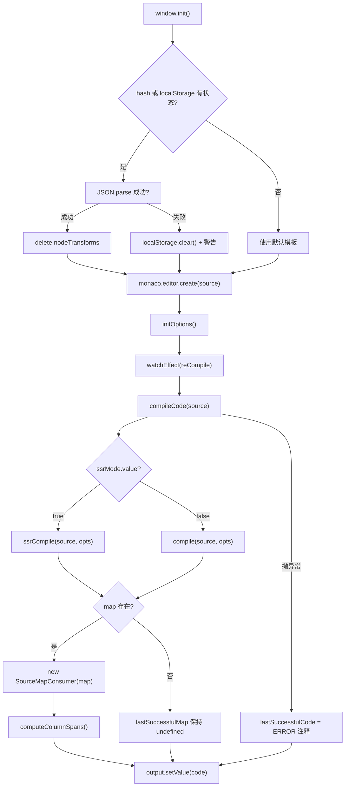
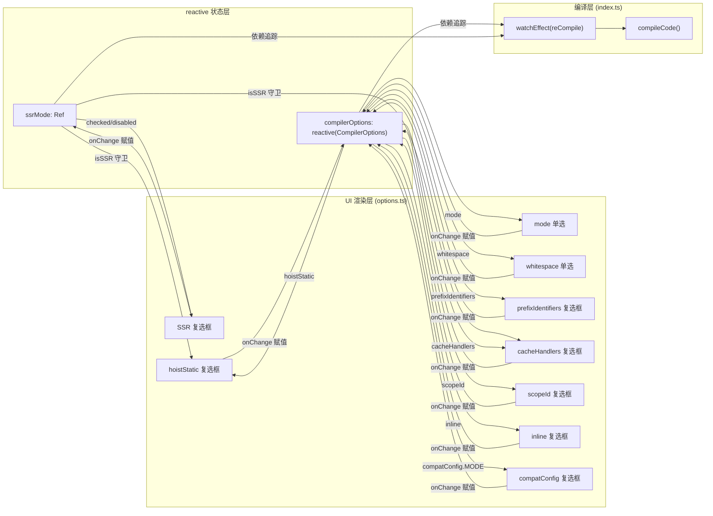

# Capítulo 8: Template Explorer: Sonda de visualización del comportamiento del compilador

En el capítulo anterior vimos cómo SFC Playground encapsula toda la cadena de «entrada SFC → compilación en el navegador → vista previa en tiempo real» como una caja negra: el desarrollador ve el resultado final renderizado, pero no lo que el compilador hace en el medio. Cuando en la plantilla se escribe una directiva personalizada, o cuando se activa hoistStatic y de repente la salida incluye un montón de variables _hoisted_1, Playground no puede responder «por qué el compilador genera esto así». La propuesta de Template Explorer es exactamente la opuesta: expone por completo la salida de compilación de @vue/compiler-dom y @vue/compiler-ssr, el AST, las marcas de error y el mapeo de posiciones desde el código fuente hasta la salida. Su núcleo no es «ejecutar», sino «observar». Este capítulo se desarrolla en torno a tres archivos: index.ts se encarga de la invocación de compilación y del mapeo bidireccional de SourceMap, options.ts gestiona con reactive decenas de CompilerOptions e impulsa la UI, y theme.ts personaliza el tema del editor Monaco.

# I. Invocación de compilación y mapeo bidireccional de SourceMap: index.ts

## Modelo intuitivo

Template Explorer es`index.ts`como una «máquina de traducción bidireccional»: a la izquierda se introduce la plantilla, a la derecha se emite la función de renderizado. Pero tiene una capacidad más que una máquina de traducción: cuando colocas el cursor en una línea de la izquierda, la derecha resalta la salida correspondiente; a la inversa, si colocas el cursor en la derecha, la izquierda resalta la plantilla correspondiente. Sin el mapeo de SourceMap, esta herramienta degeneraría en dos cuadros de texto uno al lado del otro, y el desarrollador solo podría comparar a simple vista, sin poder establecer la cadena causal de «línea N de la plantilla → línea N de la salida».

## Estructuras de datos y diseño de memoria

`index.ts`No hay Structs complejos, pero sí varias variables de estado clave a nivel de módulo que determinan el comportamiento de toda la herramienta:

`lastSuccessfulCode`y`lastSuccessfulMap`son la caché del resultado de compilación[FACT:packages-private/template-explorer/src/index.ts:74-75]. La primera es una cadena, la segunda es`SourceMapConsumer | undefined`. Nótese que`lastSuccessfulMap`inicialmente es`undefined`, y solo se asigna cuando la compilación tiene éxito y`map`existe[FACT:packages-private/template-explorer/src/index.ts:99-100]. Este estado`undefined`es la condición de guarda para toda la lógica posterior de mapeo de cursor: si la compilación falla, la funcionalidad de mapeo se desactiva silenciosamente de forma automática, en lugar de lanzar una excepción.

`PersistedState`La interfaz define la forma del estado que se persiste en localStorage y en el hash de la URL[FACT:packages-private/template-explorer/src/index.ts:26-30]：`src`(código fuente de la plantilla),`ssr`(si está en modo SSR),`options`(opciones del compilador). Aquí hay una decisión de diseño clave:`options`el tipo de es el`CompilerOptions`completo, pero al persistir en la práctica solo se guardan «las entradas diferentes de los valores por defecto»; esta lógica de recorte se realiza en`reCompile`.

`sharedEditorOptions`son las opciones de construcción compartidas por ambos editores[FACT:packages-private/template-explorer/src/index.ts:26-30]：`fontSize: 14`、`scrollBeyondLastLine: false`、`renderWhitespace: 'selection'`、`minimap.enabled: false`. Se desactiva el minimap porque la plantilla y la salida normalmente solo tienen unas pocas decenas de líneas, y el minimap ocupa espacio horizontal innecesariamente.

## Step-by-Step Walkthrough

**Escenario: el usuario abre la página, introduce`
{{ msg }}
`y luego mueve el cursor.**

**Primer paso: inicialización y restauración de estado.** `window.init`es el punto de entrada global[FACT:packages-private/template-explorer/src/index.ts:41]. Primero registra y activa el tema personalizado[FACT:packages-private/template-explorer/src/index.ts:44-45], y luego intenta restaurar el estado desde el hash de la URL o desde localStorage[FACT:packages-private/template-explorer/src/index.ts:49-56]. Nótese el orden de decodificación aquí: primero`atob`y luego`escape`, después`decodeURIComponent`. Si falla el análisis del hash, se hace fallback a`localStorage.getItem('state')`, y luego fallback a`{}`. Si falla todo el JSON.parse, se vacía localStorage y se imprime una advertencia[FACT:packages-private/template-explorer/src/index.ts:57-64]。

Tras restaurar el estado, hay un detalle que se pasa por alto fácilmente:`delete persistedState.options?.nodeTransforms` [FACT:packages-private/template-explorer/src/index.ts:69]. El comentario explica el motivo: las funciones no se pueden serializar, por lo que al persistir`nodeTransforms`se pierde, y al restaurar, si queda un objeto vacío residual, provocará un comportamiento anómalo del compilador. Esta es la trampa clásica de «persistir campos no serializables».

**Segundo paso: núcleo de compilación`compileCode`。**Este es el corazón de toda la herramienta[FACT:packages-private/template-explorer/src/index.ts:76-106]. Primero`console.clear()`, luego, según`ssrMode.value`, elige`ssrCompile`o`compile` [FACT:packages-private/template-explorer/src/index.ts:80]. Nótese`compileFn`los parámetros de la llamada: expande`compilerOptions`, fuerza`filename: 'ExampleTemplate.vue'`、`sourceMap: true`e inyecta`onError`el callback para recopilar errores[FACT:packages-private/template-explorer/src/index.ts:82-89]。

Aquí hay una decisión de diseño:`filename`está codificado como`'ExampleTemplate.vue'`. Este valor debe coincidir exactamente en la llamada posterior a`generatedPositionFor`, de lo contrario la consulta de SourceMap devolverá un resultado vacío. Este es un contrato implícito: las dos cadenas deben ser iguales, pero ningún sistema de tipos lo garantiza.[FACT:packages-private/template-explorer/src/index.ts:189]Una vez completada la compilación, los errores se convierten al formato de marker de Monaco y se establecen en el editor

convierte[FACT:packages-private/template-explorer/src/index.ts:91-95]。`formatError`de`CompilerError`al`loc`de Monaco. Nótese`startLineNumber/startColumn/endLineNumber/endColumn` [FACT:packages-private/template-explorer/src/index.ts:108-119]: solo se marcan los errores con información de posición; los errores sin`errors.filter(e => e.loc)`(como errores de configuración global) solo se muestran en la consola.`loc`Tercer paso: establecimiento del SourceMap.

**Tras el éxito de la compilación,**, e inmediatamente después se llama a`lastSuccessfulMap = new SourceMapConsumer(map!)` [FACT:packages-private/template-explorer/src/index.ts:99]es una API clave de`computeColumnSpans()` [FACT:packages-private/template-explorer/src/index.ts:100]。`computeColumnSpans`: precalcula el intervalo de columnas de cada segmento de mapeo, de modo que el campo`source-map-js`devuelto por`generatedPositionFor`esté disponible. Sin este paso, el mapeo inverso solo puede localizar la columna inicial y no puede resaltar todo el rango del token.`lastColumn`Cuarto paso: mapeo bidireccional del cursor.

**Cuando el usuario, en el**editor de código fuente**, mueve el cursor, se dispara**. Tras un debounce de 100 ms, el callback llama a`editor.onDidChangeCursorPosition` [FACT:packages-private/template-explorer/src/index.ts:184]. Nótese`lastSuccessfulMap.generatedPositionFor({ source: 'ExampleTemplate.vue', line, column: column - 1 })` [FACT:packages-private/template-explorer/src/index.ts:188-192]: los números de columna de Monaco empiezan en 1, mientras que los de SourceMap empiezan en 0. El`column - 1`devuelto, si tiene`pos`y`line`, crea un decorador en el editor de salida para resaltar el rango correspondiente`column`, y se desplaza a esa posición[FACT:packages-private/template-explorer/src/index.ts:194-206]El mapeo inverso está en[FACT:packages-private/template-explorer/src/index.ts:207-210]。

.`output.onDidChangeCursorPosition`Llama a[FACT:packages-private/template-explorer/src/index.ts:223], pero con una guarda adicional: ignora`originalPositionFor` [FACT:packages-private/template-explorer/src/index.ts:227-230]`pos.line === 1 && pos.column === 0`de "mock location"[FACT:packages-private/template-explorer/src/index.ts:231-237]. Este guard es muy crítico: cierto código generado por el compilador (como`import`sentencias o funciones helper) no tiene una posición de plantilla correspondiente, y SourceMap devolverá`{ line: 1, column: 0 }`como marcador de posición. Si no se ignora, colocar el cursor en estas líneas resaltará erróneamente la primera línea de la plantilla.

**Quinto paso: persistencia del estado.** `reCompile`no solo activa la compilación, sino que también se encarga de escribir el estado actual en localStorage y el hash de la URL[FACT:packages-private/template-explorer/src/index.ts:121-146]. Al persistir hay una lógica de recorte: recorrer`compilerOptions`, guardar solo los elementos que "no son objetos y no son iguales al valor predeterminado"[FACT:packages-private/template-explorer/src/index.ts:125-133]. Esto explica por qué`bindingMetadata`opciones de tipo objeto como esta no se persisten: es demasiado complejo y el valor predeterminado ya es suficiente para la demostración.

## Reflexiones de diseño y problemas en producción

**Por qué usar`source-map-js`en lugar de`source-map`？** `source-map`es la biblioteca original de Mozilla, tiene gran tamaño y depende de WASM (versión nueva).`source-map-js`es una implementación pura en JS, de tamaño pequeño, adecuada para entornos de navegador. Template Explorer, como herramienta puramente frontend, elegir`source-map-js`es razonable[FACT:packages-private/template-explorer/package.json:15]。

**Elección del retardo de debounce.**El debounce del editor de código fuente es de 300 ms por defecto[FACT:packages-private/template-explorer/src/index.ts:271], mientras que el debounce del movimiento del cursor es de 100 ms[FACT:packages-private/template-explorer/src/index.ts:215]. Esta diferencia es intencional: la compilación es una operación pesada, 300 ms evita activaciones frecuentes; el movimiento del cursor es una operación ligera, 100 ms garantiza sensación de respuesta. Pero 100 ms aún puede provocar parpadeo del resaltado al mover el cursor rápidamente; esto es un compromiso aceptable.

**`window.init`Montaje global de**. Atención:`window.init`y`window.monaco`ambos están montados en el global[FACT:packages-private/template-explorer/src/index.ts:19-23]. Esto se debe a que el editor Monaco se carga de forma asíncrona mediante el CDN`loader.js`, y una vez completada la carga se llama a`window.init`. Este patrón de "callback global" es el uso estándar de Monaco en entornos no modulares, pero choca con las formas de construcción ESM modernas.

---

# Dos, panel de opciones impulsado por reactive: options.ts

## Modelo intuitivo

`options.ts`es como un "panel de consola": arriba hay una docena de interruptores y botones de opción, cada uno corresponde a un comportamiento del compilador. Al accionar cualquier interruptor, el producto de compilación de la derecha cambia de inmediato. Sin este módulo, los desarrolladores solo podrían modificar los parámetros de llamada de`compile`en el código fuente y recompilar, sin poder comparar en tiempo real los efectos de distintas opciones.

## Estructura de datos y diseño de memoria

`options.ts`El núcleo de

`ssrMode`son tres exportaciones:`ref(false)` [FACT:packages-private/template-explorer/src/options.ts:5]es un`compilerOptions`. Es independiente de`compile` vs `ssrCompile`, porque el modo SSR cambia la propia función de compilación (

`defaultOptions`), no las opciones de compilación.`CompilerOptions`es un objeto completo de[FACT:packages-private/template-explorer/src/options.ts:5-27]. Define los valores predeterminados de todas las opciones, incluidos`mode: 'module'`、`prefixIdentifiers: false`、`hoistStatic: false`、`cacheHandlers: false`、`scopeId: null`、`inline: false`、`ssrCssVars: '{ color }'`、`compatConfig: { MODE: 3 }`、`whitespace: 'condense'`, así como un`bindingMetadata` [FACT:packages-private/template-explorer/src/options.ts:18-26]。

`compilerOptions`que contiene 7 tipos de binding`reactive(Object.assign({}, defaultOptions))` [FACT:packages-private/template-explorer/src/options.ts:29-31]es`Object.assign({}, ...)`. Atención: aquí se usa`reactive(defaultOptions)`para hacer una copia superficial; si se hiciera directamente`compilerOptions`, modificar`defaultOptions`contaminaría`reCompile`, lo que invalidaría la lógica de "comparación con el valor predeterminado" en

## Step-by-Step Walkthrough

**Escenario: el usuario hace clic en la casilla de verificación "hoistStatic".**

**Primer paso: renderizado de la UI.** `App`El`setup`del componente[FACT:packages-private/template-explorer/src/options.ts:33-35]devuelve una función de renderizado`ssrMode.value`、`compilerOptions.mode`、`compilerOptions.prefixIdentifiers`. Esta función de renderizado lee estados reactivos como[FACT:packages-private/template-explorer/src/options.ts:36-39], por lo que cuando estos estados cambian, toda la UI se vuelve a renderizar.

**Segundo paso: binding checked de la casilla de verificación.** `hoistStatic`La propiedad`checked`de la casilla de verificación es`compilerOptions.hoistStatic && !isSSR` [FACT:packages-private/template-explorer/src/options.ts:150]. Aquí hay una lógica: en modo SSR,`hoistStatic`se fuerza a mostrarse como no marcado, porque la compilación SSR no admite elevación estática. Al mismo tiempo,`disabled: isSSR` [FACT:packages-private/template-explorer/src/options.ts:151]garantiza que el usuario no pueda alternarlo en modo SSR.

**Tercer paso: manejo de onChange.**Cuando el usuario hace clic en la casilla de verificación,`onChange`activa[FACT:packages-private/template-explorer/src/options.ts:152-156], asignando directamente`e.target.checked`a`compilerOptions.hoistStatic`. Dado que`compilerOptions`es`reactive`de`watchEffect(reCompile)` [FACT:packages-private/template-explorer/src/index.ts:266], esta asignación activa el seguimiento de dependencias y, a su vez, activa

**, recompilando finalmente.**Cuarto paso: interacción entre opciones.`cacheHandlers`Atención:`checked`El`usePrefix && compilerOptions.cacheHandlers && !isSSR` [FACT:packages-private/template-explorer/src/options.ts:166]，`disabled`de`!usePrefix || isSSR` [FACT:packages-private/template-explorer/src/options.ts:167]es`cacheHandlers`es`prefixIdentifiers`. Esto significa que`mode === 'module'`depende de`prefixIdentifiers`o`function`. Esta relación de interacción se manifiesta en la UI como: cuando`cacheHandlers`no está activado y el modo es

`scopeId`, la casilla de verificación`disabled: !isModule` [FACT:packages-private/template-explorer/src/options.ts:182]，`checked: isModule && compilerOptions.scopeId` [FACT:packages-private/template-explorer/src/options.ts:183]está deshabilitada.`isModule`La interacción de`null` [FACT:packages-private/template-explorer/src/options.ts:184-189]。

**es más compleja:** `initOptions`. Solo en modo module se puede establecer scopeId, y en onChange, si`createApp(App).mount(document.getElementById('header')!)` [FACT:packages-private/template-explorer/src/options.ts:232-234]es false, se fuerza a`vue`Quinto paso: montaje.`createApp`Llamar a`@vue/runtime-dom`. Atención: aquí se usa`options.ts`del paquete`vue`, y no

## es código de capa de aplicación y puede depender directamente del paquete completo

**Copiar`reactive`Reflexiones de diseño y problemas en producción`ref`？** `compilerOptions`Por qué usar`reactive`en lugar de`compilerOptions.hoistStatic = true`es un objeto que contiene una docena de campos; usar`compilerOptions.value.hoistStatic = true`permite`reactive`directamente, sin necesidad de`compilerOptions.xxx`. Esto es más conciso en el código de UI. Pero el costo de

**`bindingMetadata`es que la desestructuración pierde reactividad; en el código fuente no hay ninguna desestructuración, todo se accede mediante**, que es el uso correcto.[FACT:packages-private/template-explorer/src/options.ts:18-26]Diseño de valores predeterminados de`SETUP_CONST`、`SETUP_REF`、`SETUP_LET`、`SETUP_MAYBE_REF`、`PROPS`. El valor predeterminado de`prefixIdentifiers`incluye 7 bindings`$setup`, cubriendo`prefixIdentifiers`cinco tipos. Esto es para que los desarrolladores, al abrir

**`compatConfig`, puedan ver de inmediato el impacto de distintos tipos de binding en la forma de acceso a** `compilerOptions.compatConfig!.MODE = 2` [FACT:packages-private/template-explorer/src/options.ts:216-220]en el producto. Sin este valor predeterminado,`reactive`el efecto de`reactive`sería muy monótono.`compatConfig`Reactividad anidada de`CompatConfig | undefined`. Una asignación anidada como`!`es reactiva bajo`compatConfig`, porque

**`ssrMode`aplica proxy recursivamente a objetos anidados. Pero atención: el tipo de`compilerOptions`es** `ssrMode`, por lo que se usó la aserción`ref`，`compilerOptions`. Si no hubiera`reactive`en el valor predeterminado, aquí habría un fallo en tiempo de ejecución.`ssr`Separación de responsabilidades entre`compilerOptions`y`ssr`.`CompilerOptions`es

---

# es

## . Por qué no poner

`theme.ts`Es como «cambiarle la piel» al editor: define el color y el estilo de fuente de cada token de sintaxis. Sin este módulo, Monaco usaría el tema`vs-dark`predeterminado; aunque funcional, las etiquetas HTML, expresiones y directivas en las plantillas Vue carecerían de distinción visual, dificultando que el desarrollador localice rápidamente las partes clave.

## Estructura de datos y diseño de memoria

`theme.ts`Exporta un objeto que cumple con la interfaz de Monaco`IStandaloneThemeData`.[FACT:packages-private/template-explorer/src/theme.ts:1-244]Tiene tres campos de nivel superior:

`base: 'vs-dark'`Especifica el tema base[FACT:packages-private/template-explorer/src/theme.ts:2]，`inherit: true`Indica las reglas que heredan del tema base[FACT:packages-private/template-explorer/src/theme.ts:3]. Esto significa que solo es necesario definir las diferencias; los tokens no definidos harán fallback a`vs-dark`。

`rules`Es un array donde cada elemento contiene`token`(el nombre del token en Monaco) y`foreground`/`background`/`fontStyle` [FACT:packages-private/template-explorer/src/theme.ts:4-235]. Este array tiene más de 50 entradas, cubriendo tipos de token como number, comment, keyword, string, variable, entity.name.tag, etc.

`colors`Define los colores de la interfaz del editor[FACT:packages-private/template-explorer/src/theme.ts:236-243]：`editor.foreground`、`editor.background`、`editor.selectionBackground`、`editor.lineHighlightBackground`、`editorCursor.foreground`、`editorWhitespace.foreground`。

## Step-by-Step Walkthrough

**Escenario: registrar el tema al cargar la página.**

**Primer paso: definir el tema.** `monaco.editor.defineTheme('my-theme', theme)` [FACT:packages-private/template-explorer/src/index.ts:44]. Esta llamada registra el objeto exportado de`theme.ts`en el registro de temas de Monaco, con el nombre de clave`'my-theme'`。

**Segundo paso: activar el tema.** `monaco.editor.setTheme('my-theme')` [FACT:packages-private/template-explorer/src/index.ts:45]. Esta línea de código debe llamarse después de`defineTheme`; de lo contrario, lanzará el error «tema no definido».

**Tercer paso: coincidencia de tokens.**Cuando Monaco renderiza el código de la plantilla, tokeniza el código usando el servicio de lenguaje HTML y luego busca por nombre de token las reglas en`rules`. Por ejemplo,`
`en`div`se marcará como`entity.name.tag`, coincidirá con`foreground: 'cc6666'` [FACT:packages-private/template-explorer/src/theme.ts:41-44]y se mostrará en rojo.

## Reflexiones de diseño y errores en producción

**Por qué usar`inherit: true`？**Si no se hereda, habría que definir los colores de todos los tokens, incluidos aquellos que no aparecen en la plantilla (como`markup.heading`、`meta.diff`). La herencia permite que el archivo de tema solo se enfoque en los tokens que realmente aparecen en la plantilla y en el producto JS.

**Coincidencia jerárquica de nombres de token.**La coincidencia de tokens de Monaco es por prefijo:`entity.name.tag`coincidirá con`entity.name.tag.html`、`entity.name.tag.css`, etc. En el código fuente se definen tanto`entity.name.tag` [FACT:packages-private/template-explorer/src/theme.ts:41-44]como`entity.name.tag.css` [FACT:packages-private/template-explorer/src/theme.ts:169-172]; este último sobrescribe al primero en el escenario específico de CSS.

**`colors`y`rules`división de responsabilidades.** `rules`controla el color del texto del código,`colors`controla el color de la interfaz del editor (fondo, cursor, línea seleccionada). Ambos son independientes, pero necesitan coordinación visual. En el código fuente,`editor.background: '#1D1F21'`y`base: 'vs-dark'`tienen fondos predeterminados similares, para mantener la consistencia visual.

---

# Reflexión de diseño: compensaciones de ingeniería de la sonda visual

La diferencia central entre Template Explorer y SFC Playground radica en la «granularidad de observación». Playground observa «si todo el SFC compilado puede ejecutarse»; Template Explorer observa «en qué se compila una expresión de plantilla individual». Esta diferencia determina la elección técnica de ambas herramientas:

**La introducción de SourceMapConsumer es inevitable.**Sin él, el desarrollador solo podría comparar a ojo el código fuente y el producto, sin poder establecer una correspondencia precisa de «línea X → línea Y». Pero la API de SourceMapConsumer es asíncrona (las versiones nuevas devuelven una Promise); en el código fuente se usa la versión síncrona`source-map-js`, para simplificar la lógica de llamada.

**`reactive`La gestión de opciones es la elección natural del ecosistema Vue.**Si se usaran eventos DOM nativos para gestionar manualmente la sincronización de estado de una docena de opciones, la cantidad de código se duplicaría.`reactive`El seguimiento de dependencias de`watchEffect(reCompile)`automatiza la cadena «cambio de opción → recompilación», y una sola línea de código completa la suscripción.

**El modo de carga global de Monaco es una carga histórica.** `window.monaco`y`window.init`El montaje global de

---

# Resumen del capítulo

Template Explorer es una «sonda de caja blanca»: no ejecuta el producto compilado, solo muestra el proceso de compilación.`index.ts`Mediante`compileCode`llama a`@vue/compiler-dom`o`@vue/compiler-ssr`, usa`SourceMapConsumer`para establecer un mapeo bidireccional entre el código fuente y el producto, y mediante la API de decoradores de Monaco implementa el resaltado vinculado al cursor.`options.ts`Usa`reactive`para gestionar`CompilerOptions`, mediante`watchEffect`impulsa la recompilación; las relaciones de vinculación entre opciones (como SSR deshabilitando`hoistStatic`) se codifican explícitamente en la capa de UI.`theme.ts`Personaliza el tema de Monaco para que los tokens de sintaxis de la plantilla y el producto tengan una distinción visual clara.

El valor central de esta herramienta radica en «usar la herramienta para inferir el comportamiento del compilador»: cuando no estés seguro de qué`hoistStatic`le hace a una plantilla, abre Template Explorer, cambia opciones y observa los cambios en el producto. Esto es más intuitivo que leer el código fuente del compilador y más confiable que adivinar.

# Reflexiones y autoevaluación de este capítulo

Q1: Si se elimina el guard de mock location (`index.ts`) de`originalPositionFor`en`pos.line === 1 && pos.column === 0`, ¿en qué escenario provocaría un resaltado incorrecto? ¿Por qué el compilador genera un mapeo como`{ line: 1, column: 0 }`?

**Análisis de referencia**: el guard se encuentra en[FACT:packages-private/template-explorer/src/index.ts:231-237]. El compilador, al generar el producto, inserta código que no tiene una posición correspondiente en la plantilla, como declaraciones de importación de helpers`import { createElementVNode as _createElementVNode } from 'vue'`, o firmas de función como`export function render(_ctx, _cache) { ... }`. Este código no tiene posición original en el SourceMap,`source-map-js`devolverá`{ line: 1, column: 0 }`como marcador de posición. Si se elimina el guard, cuando el usuario coloque el cursor sobre estas líneas,`originalPositionFor`devolverá`{ line: 1, column: 0 }`, el código considerará que esta es una posición válida y, por lo tanto, creará un decorador de resaltado en la primera fila y primera columna del editor de código fuente. El resultado es: el usuario hace clic en la línea`import`del artefacto, la primera línea del editor de código fuente se resalta erróneamente, lo que genera confusión. La esencia de esta guarda es "distinguir entre mapeo real y mapeo de marcador de posición", y`{ line: 1, column: 0 }`es`source-map-js`el valor centinela de "sin mapeo" acordado.

Q2: `reCompile`en las opciones de persistencia, la condición`typeof val !== 'object' && val !== defaultOptions[key]`omitirá todas las opciones de tipo objeto. Si`bindingMetadata`es modificado por el usuario (por ejemplo, a través de la consola), esta modificación se perderá después de actualizar la página. ¿Es un bug o un diseño intencional? Si se quiere admitir`bindingMetadata`en la persistencia, ¿qué problemas hay que resolver?

**Análisis de referencia**: la condición se encuentra en[FACT:packages-private/template-explorer/src/index.ts:129]. Es un diseño intencional, por tres razones: primera,`bindingMetadata`el valor de es`BindingTypes`un enum, tras la serialización es un número y, al deserializar, no se puede distinguir entre "el usuario lo estableció explícitamente en 0" y "el valor predeterminado"; segunda,`compatConfig`es un objeto anidado,`val !== defaultOptions[key]`compara referencias, siempre es true, lo que provocaría que todas las opciones de objeto se persistieran; tercera,`nodeTransforms`contiene funciones, no se puede serializar, y en el código fuente ya se maneja`delete persistedState.options?.nodeTransforms`mediante[FACT:packages-private/template-explorer/src/index.ts:69]. Si se quiere admitir`bindingMetadata`, es necesario implementar una comparación profunda (en lugar de comparación por referencia) y también manejar la serialización/deserialización de valores enum. El problema más fundamental es:`bindingMetadata`no tiene entrada de edición en la UI, el usuario solo puede modificarlo a través de la consola, y ese tipo de modificación en sí misma no debería persistirse.

Q3: `options.ts`en`compilerOptions`se crea con`reactive(Object.assign({}, defaultOptions))`. Si se cambia`Object.assign({}, defaultOptions)`por`reactive(defaultOptions)`directamente, después de que el usuario cambie la opción y actualice la página, ¿qué ocurrirá? ¿Por qué?

**Análisis de referencia**：`Object.assign({}, defaultOptions)`es una copia superficial, ubicada en[FACT:packages-private/template-explorer/src/options.ts:29-31]. Si se cambia a`reactive(defaultOptions)`，`compilerOptions`y`defaultOptions`apuntarán al mismo objeto. Cuando el usuario cambia`hoistStatic`a true,`compilerOptions.hoistStatic`se vuelve true y, al mismo tiempo,`defaultOptions.hoistStatic`también se vuelve true. Luego, la lógica de persistencia`reCompile`en[FACT:packages-private/template-explorer/src/index.ts:129]comparará`val !== defaultOptions[key]`; en ese momento,`val`y`defaultOptions[key]`son ambos true, la condición es false y esa opción no se guardará en localStorage. Después de actualizar la página,`defaultOptions`se reinicializa a`hoistStatic: false`, y la modificación del usuario se pierde. Más grave aún: una vez que`defaultOptions`queda contaminado, toda la lógica posterior de "comparar con el valor predeterminado" deja de funcionar, lo que provoca que la funcionalidad de persistencia se rompa por completo. La sutileza de este bug radica en que: dentro de una sola sesión todo funciona normal, y solo después de actualizar se puede descubrir.

---

El siguiente capítulo entrará en`scripts/release.js`, para ver cómo Vue orquesta con una máquina de estados interactiva todo el flujo de actualización de número de versión, build, test, commit de Git, creación de tag y npm publish. A diferencia de la "observación" de Template Explorer, release.js es "ejecución": necesita mantener estado entre múltiples pasos, manejar rollback ante fallos y equilibrar la confirmación interactiva con la automatización.

A través de Template Explorer, hemos aprendido cómo convertir el estado interno del compilador —AST, artefactos de compilación, SourceMap— en sondas visuales interactivas, transformando "por qué el compilador genera esto" de conjetura en observación. Este control y orquestación precisos del estado interno también se reflejan en el flujo de publicación de Vue: el siguiente capítulo profundizará en scripts/release.js, para ver cómo una máquina de estados de más de 500 líneas usa parseArgs para analizar más de diez flags, confirma interactivamente el número de versión mediante enquirer y dispara en orden build, test, commit de Git, creación de tag y npm publish, revelando el flujo de estados completo y la estrategia de rollback ante fallos detrás de una publicación formal.
