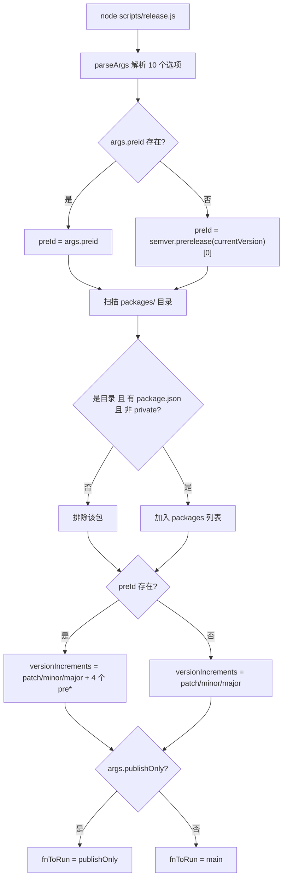
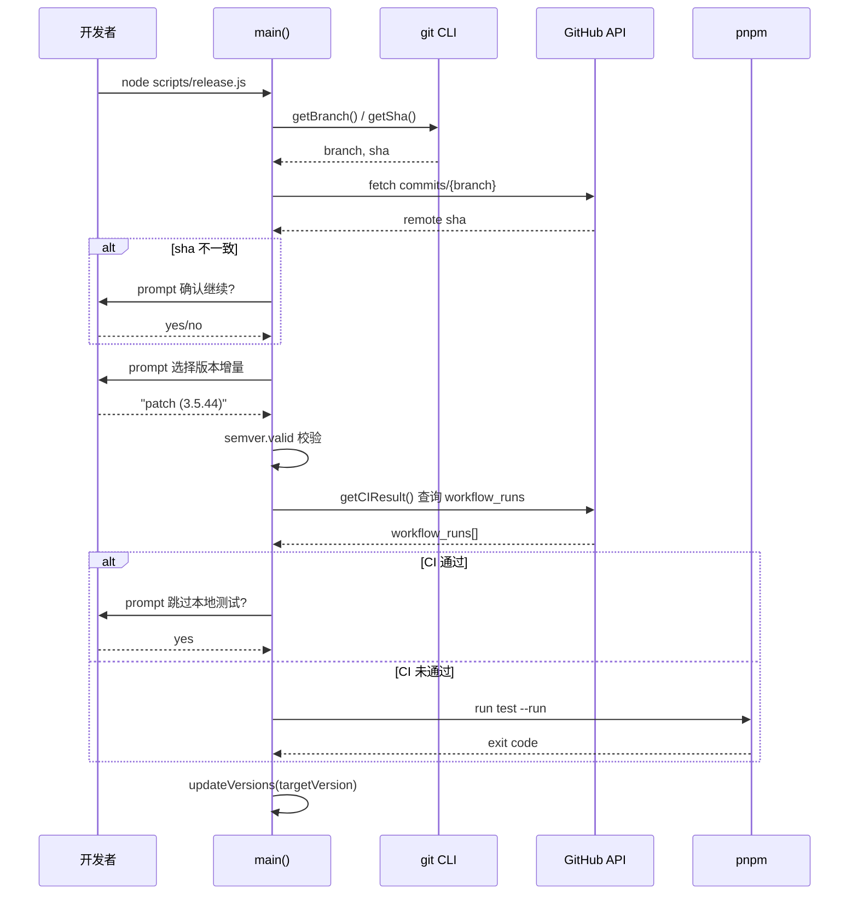
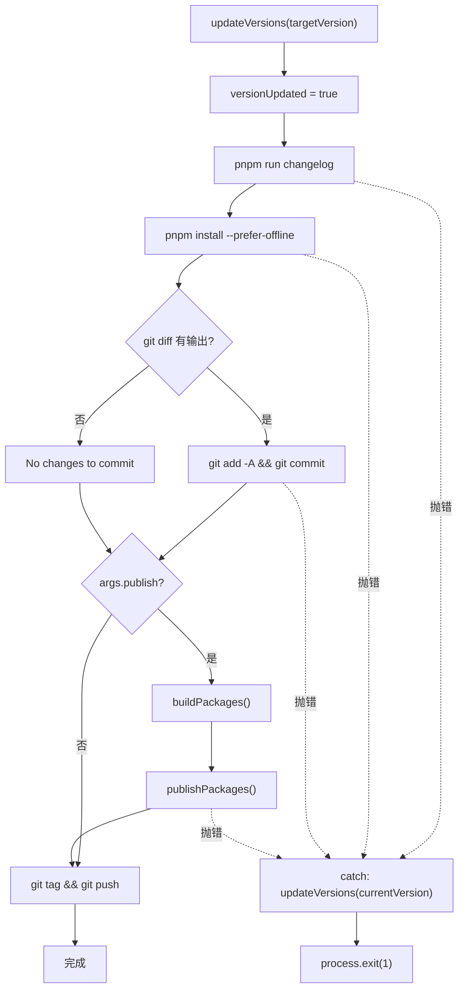

# Capítulo 9: Automatización de publicación: la máquina de estados y la orquestación interactiva de release.js

En el capítulo anterior, con ayuda de template-explorer inferimos el comportamiento del compilador y dominamos la metodología de observar mecanismos internos con herramientas. Ahora, pasamos la mirada del tiempo de compilación al tiempo de publicación: este es el momento más peligroso de todo proyecto de código abierto, ya que toca simultáneamente cuatro sistemas externos irreversibles: número de versión, artefactos de compilación, historial de Git y npm registry. Un npm publish erróneo no se puede retirar, y un push de tag erróneo contamina la resolución de dependencias de todos los usuarios downstream. Vue core usa un scripts/release.js de 537 líneas para domar este peligro: no es ni un script puramente automatizado ni una checklist puramente manual, sino una máquina de estados interactiva: se detiene a preguntar a la persona en los nodos clave, ejecuta de forma totalmente automática en los nodos predecibles y revierte el número de versión al punto inicial si falla cualquier paso. Este capítulo desglosará los tres mecanismos centrales de este orquestador: análisis de parámetros e inicialización de estado, decisión interactiva de versión y puerta de CI, y orden de publicación y rollback ante fallos.

# Análisis de parámetros e inicialización del estado global

## Modelo intuitivo

Imagina`release.js`como el panel de control de una lavadora antigua: el mando (`parseArgs`) decide qué modo usar, las luces indicadoras (variables globales) registran en qué etapa se está actualmente, y el botón "cancelar" (manejo de errores) debe poder devolver la máquina al estado previo al llenado de agua. Sin esta lógica de inicialización, el script perdería el control sobre la pregunta "qué versión quiere publicar realmente el usuario": o publicaría la versión equivocada, o se quedaría bloqueado en CI esperando una entrada de teclado que nunca llegará.

## Diseño de memoria de flags y estado global

> **[Design Inference & Architectural Trade-offs]**
> Lo primero que hace el script tras iniciarse es analizar los argumentos de línea de comandos en un objeto estructurado. Aquí se usa el módulo integrado de Node`parseArgs`, en lugar de`yargs`o`commander`— esto es para eliminar dependencias de terceros, porque el script de publicación en sí debe poder ejecutarse en cualquier entorno, incluso si`node_modules`está instalado a medias.

[FACT:scripts/release.js:27-62]define 10 opciones, que se pueden dividir en cuatro categorías:

- **Categoría de semántica de versión**：`preid`(identificador de prelanzamiento, como`alpha`/`beta`/`rc`）、`tag`（npm dist-tag）
- **Categoría de omisión**：`skipBuild`、`skipTests`、`skipGit`、`skipPrompts`— estos cuatro interruptores booleanos constituyen los botones de ajuste del «grado de automatización»
- **Categoría de modo de ejecución**：`dry`(simulación),`publish`(si publicar directamente en local),`publishOnly`(solo publicar sin actualizar la versión)
- **Categoría de destino**：`registry`(dirección de registry personalizada)

Nótese que`publish`el valor predeterminado de es`false` [FACT:scripts/release.js:51-54], mientras que los demás elementos booleanos no tienen valor predeterminado (es decir,`undefined`). Esta asimetría es deliberada:`publish`la semántica de es «si ejecutar npm publish en local», por defecto no publica, y delega la acción de publicación a GitHub Actions; mientras que`skipXxx`por defecto`undefined`significa «no especificado», y la lógica posterior distinguirá entre «el usuario pasó explícitamente`--skipTests`» y «el usuario no lo pasó».

Una vez completado el análisis, el script aplana los parámetros en un conjunto de variables a nivel de módulo[FACT:scripts/release.js:64-66]：

```js
const preId = args.preid || semver.prerelease(currentVersion)?.[0]
const isDryRun = args.dry
let skipTests = args.skipTests
const skipBuild = args.skipBuild
const skipPrompts = args.skipPrompts
const skipGit = args.skipGit
```

Aquí hay dos diseños que merecen atención. Primero,`preId`la prioridad de valor de es «especificado explícitamente en la línea de comandos > inferido a partir del número de versión actual»[FACT:scripts/release.js:64-66]. Si la versión actual de`package.json`es`3.5.0-beta.1`, entonces`semver.prerelease`devolverá`['beta', 1]`, tomando`[0]`se obtiene`'beta'`. Esto significa que al publicar versiones consecutivas en la rama beta, no es necesario escribir`--preid beta`cada vez. Segundo,`skipTests`se declara con`let`mientras que los demás usan`const` [FACT:scripts/release.js:64-66], porque en`runTestsIfNeeded`será reescrito dinámicamente por el resultado de CI — este es un bit de estado de «decisión diferida».

Inmediatamente después está la lógica de descubrimiento de paquetes[FACT:scripts/release.js:68-83]: lee el directorio`packages/`, filtra elementos que no son directorios, elementos sin`package.json`, y paquetes`private: true`. Nótese que aquí se lee`packages/`en lugar de`packages-private/`— este último es un paquete de depuración interno, que nunca se publica.

## Algoritmo de ordenación del orden de publicación

[FACT:scripts/release.js:85-85]define una función que parece simple pero es crucial:

```js
const sortPackagesForPublishing = (packageNames) => [
  ...packageNames.filter(p => p !== 'vue'),
  ...packageNames.filter(p => p === 'vue'),
]
```

Coloca el paquete de entrada`vue`al final. El comentario[FACT:scripts/release.js:85-85]explica la razón: si se publica primero`vue`, los usuarios podrían instalar la nueva versión de`@vue/runtime-core`antes de que paquetes internos como`vue`estén en línea, y npm dará error al no encontrar dependencias internas coincidentes. Esta es la solución de compromiso de la «atomicidad de publicación» en el ecosistema npm — npm no tiene transacciones entre paquetes, solo puede aproximarse a la atomicidad mediante el orden.

## Construcción dinámica del conjunto de candidatos de incremento de versión

[FACT:scripts/release.js:111-116]construye las opciones del menú interactivo:

```js
const versionIncrements = [
  'patch', 'minor', 'major',
  ...(preId ? ['prepatch', 'preminor', 'premajor', 'prerelease'] : []),
]
```

Esta es una expansión condicional: solo cuando`preId`existe (es decir, actualmente en el canal de prelanzamiento, o el usuario especificó explícitamente`--preid`), se añaden al menú los tipos de incremento relacionados con prelanzamiento. Si actualmente es una versión estable`3.5.43`y no se especificó`preid`, el menú solo tiene`patch/minor/major`tres opciones — evitando que el usuario convierta por error una versión estable en una versión de prelanzamiento a medias como`3.5.44-0`.

`inc`La función[FACT:scripts/release.js:120-120]encapsula`semver.inc`, pasando`preId`como tercer parámetro. Aquí hay una defensa de tipos:`typeof preId === 'string' ? preId : undefined`— porque`preId`puede ser`string | undefined`, y`semver.inc`espera`string | undefined`, esta expresión ternaria es para satisfacer el estrechamiento de tipos de TS.

## Primitivas de ejecución: el sistema de doble vía de run y dryRun

[FACT:scripts/release.js:122-123]es uno de los diseños más ingeniosos de todo el capítulo:

```js
const run = async (bin, args, opts = {}) =>
  exec(bin, args, { stdio: 'inherit', ...opts })
const dryRun = async (bin, args, opts = {}) =>
  console.log(pico.blue(`[dryrun] ${bin} ${args.join(' ')}`), opts)
const runIfNotDry = isDryRun ? dryRun : run
```

`run`establece el stdio del subproceso en`inherit`, permitiendo que la salida de compilación/pruebas se transmita directamente a la terminal — esto es crucial para compilaciones de larga duración, el usuario puede ver el progreso en tiempo real.`dryRun`solo imprime el comando sin ejecutarlo.`runIfNotDry`es una «selección de estrategia»: al cargar el módulo se vincula el puntero de función a`dryRun`o`run`, y todos los puntos de llamada posteriores ya no necesitan juzgar`isDryRun`。

> **[Design Inference & Architectural Trade-offs]**
> Este patrón de «decidir la estrategia en la inicialización» es menos propenso a errores que «juzgar en cada punto de llamada»: si algún punto de llamada olvida juzgar`isDryRun`, en modo dry run se ejecutarán realmente los efectos secundarios. Mientras que`runIfNotDry`concentra el juicio en un solo lugar, eliminando la posibilidad de este tipo de omisiones.



---

# Decisión interactiva de versión y control de acceso de CI

## Modelo intuitivo

Esta etapa es como el control de seguridad de un aeropuerto: primero verifica tu tarjeta de embarque (si el commit local está sincronizado con el remoto), luego confirma a dónde vas (número de versión), y finalmente comprueba si ya pasaste el control de seguridad (si CI pasó). Si alguna parte no pasa, todo el proceso se detiene. Sin este control de acceso, un commit local no subido podría ser etiquetado y publicado, provocando que el código fuente correspondiente a la versión en npm no exista en GitHub — este es el accidente de publicación más difícil de diagnosticar.

## Verificación de sincronización y selección de versión

`main`Lo primero que hace la función`isInSyncWithRemote()` [FACT:scripts/release.js:141-141]es[FACT:scripts/release.js:337-363]. La lógica de esta función`git rev-parse HEAD`es: obtener el nombre de la rama actual, solicitar a la API de GitHub el SHA del último commit de esa rama, y compararlo con el[FACT:scripts/release.js:348-355]local. Si no coinciden, aparece un cuadro de confirmación con advertencia roja`false`, dejando que el usuario decida si continuar. Si la solicitud a la API falla (problema de red, sin token), devuelve directamente[FACT:scripts/release.js:365-367]。

> **[Design Inference & Architectural Trade-offs]**
> 〔Inferencia de diseño y compensaciones arquitectónicas〕

La filosofía de diseño aquí es «fallar es abortar»: ante una anomalía de red, es preferible no permitir la publicación que arriesgarse a continuar con un estado desconocido. Porque la publicación es irreversible, y el costo de volver a ejecutar el script es muy bajo.`node scripts/release.js 3.6.0`），`targetVersion`La determinación del número de versión tiene dos rutas. Si el usuario pasó un parámetro posicional en la línea de comandos (como[FACT:scripts/release.js:141-141]se toma directamente ese valor[FACT:scripts/release.js:152-176]. De lo contrario, se entra al menú interactivo`custom`: primero se deja que el usuario elija el tipo de incremento, y si elige

se muestra otro cuadro de entrada para que el usuario escriba manualmente el número de versión.[FACT:scripts/release.js:174]Nótese la línea

```js
targetVersion = release.match(/\((.*)\)/)?.[1] ?? ''
```

Copiar`patch (3.5.44)`El formato del elemento del menú es`custom`, esta expresión regular extrae el número de versión real de los paréntesis. Si el usuario eligió[FACT:scripts/release.js:164-172]。

, se sigue otra rama[FACT:scripts/release.js:178-182]Posteriormente hay una lógica de «segundo análisis»`targetVersion`: si`patch`/`minor`Este tipo de palabra clave incremental (el usuario podría pasar directamente`node release.js minor`), se llama a`inc`para convertirla en un número de versión concreto. Finalmente se usa`semver.valid`para validar[FACT:scripts/release.js:184-186], y si el número de versión es inválido se lanza un error directamente.

## Puerta de CI: la lógica de tres estados de runTestsIfNeeded

Este es el flujo de control más complejo de todo el capítulo.[FACT:scripts/release.js:281-317]El`runTestsIfNeeded`de

**es en realidad una máquina de decisión de tres estados:`--skipTests`**。`skipTests`Estado uno: el usuario pasó explícitamente`true`se inicializa como[FACT:scripts/release.js:314-316]。

**, se omite directamente todo el cuerpo de la función y se imprime "Tests skipped."**Estado dos: no se omitió, y CI ya pasó`getCIResult()` [FACT:scripts/release.js:319-335]. El script llama a`ci`, que solicita la API de GitHub Actions y verifica si existe un workflow run llamado`conclusion === 'success'`y con[FACT:scripts/release.js:319-335]. Si pasa, pregunta al usuario «CI ya pasó, ¿omitir las pruebas locales?»[FACT:scripts/release.js:288-295]. Si el usuario activó`--skipPrompts`, se omiten automáticamente las pruebas locales[FACT:scripts/release.js:296-298]。

**Estado tres: no se omitió, y CI no pasó**. Si se activó`--skipPrompts`, se lanza un error directamente[FACT:scripts/release.js:299-304]：

```js
throw new Error(
  'CI for the latest commit has not passed yet. ' +
    'Only run the release workflow after the CI has passed.',
)
```

Si no se activó`--skipPrompts`, entonces`skipTests`se mantiene como`undefined`, y se cae en la rama final de pruebas locales[FACT:scripts/release.js:307-313], ejecutando`pnpm run test --run`。

Aquí hay un detalle sutil[FACT:scripts/release.js:285]：

```js
skipTests ||= isCIPassed
```

`||=`es una asignación lógica OR: solo cuando`skipTests`es un valor falsy (`undefined`o`false`) se le asigna`isCIPassed`. Esto significa que si el usuario pasó explícitamente`--skipTests`（`true`), esta línea no lo cambia; si el usuario no lo pasó (`undefined`), entonces se establece con el resultado de CI. Pero inmediatamente después[FACT:scripts/release.js:287-298]se reasigna cuando CI pasa; por lo tanto`||=`el efecto real de esta línea es solo «si CI no pasó, establecer`skipTests`como`false`», para que la posterior rama`if (!skipTests)`ejecute las pruebas locales.

> **[Design Inference & Architectural Trade-offs]**
> Esta lógica da muchas vueltas, pero en esencia quiere expresar: «CI pasó → se pueden omitir las pruebas locales (pero preguntando al usuario); CI no pasó → se deben ejecutar las pruebas locales (a menos que el usuario pida explícitamente omitirlas)». Usar`||=`más una sobrescritura posterior es compacto, pero poco legible; es el típico code smell de «bit de estado modificado en varios lugares».



## Escritura de números de versión: el recorrido de updateVersions

[FACT:scripts/release.js:377-384]El`updateVersions`de`package.json`hace dos cosas: actualizar el`updatePackage`。`updatePackage` [FACT:scripts/release.js:391-398]raíz, y luego recorrer todos los subpaquetes llamando a`name`para leer el JSON, reescribir`version`y`JSON.stringify(pkg, null, 2) + '\n'`, y escribir de vuelta con`\n`— atención al

`getNewPackageName`final, esto es para mantener el archivo terminado en salto de línea y evitar que git diff muestre "No newline at end of file".`keepThePackageName` [FACT:scripts/release.js:105]El parámetro

---

# por defecto es

## , es decir, no cambia el nombre del paquete. La existencia de este parámetro es para soportar el escenario de «renombrar el paquete al publicar en un registry personalizado»; aunque los puntos de llamada actuales pasan el valor por defecto, la interfaz deja espacio para extensibilidad.

Orden de publicación, idempotencia y reversión ante fallos`updateVersions`Modelo intuitivo

## Esta etapa es como fichas de dominó:

> **[Design Inference & Architectural Trade-offs]**
> `publishPackage` [FACT:scripts/release.js:439-489]Publicación idempotente: isPackagePublished y respaldo ante errores[FACT:scripts/release.js:442-451]〔Inferencia de diseño y compensaciones arquitectónicas〕`--tag`es el núcleo de la publicación. Primero determina el dist-tag`alpha`/`beta`/`rc`: prioriza el parámetro`version.includes('alpha')`; de lo contrario, lo infiere a partir de la palabra clave`semver.prerelease`en el número de versión. Nótese que aquí se usa`3.5.0-alpha.1`，`includes`en lugar de

— porque el número de versión puede tener la forma[FACT:scripts/release.js:453-458]：

```js
if (!isDryRun && (await isPackagePublished(packageName, version))) {
  console.log(pico.yellow(`Skipping already published: ${pkgVersion}`))
  alreadyPublishedPackages.push(pkgVersion)
  return
}
```

`isPackagePublished` [FACT:scripts/release.js:491-513]Antes de publicar hay una comprobación de idempotencia`npm view <pkg>@<version> version`Copiar`true`ejecuta`false`, si tiene éxito devuelve

, si reporta un error tipo E404 devuelve`npm view`. El sentido de esta comprobación es que el flujo de publicación puede reejecutarse por una interrupción de red, y al reejecutar los paquetes ya publicados no deben publicarse de nuevo (npm rechazará versiones duplicadas).`isPackagePublished`Pero la comprobación misma también puede fallar; por ejemplo,[FACT:scripts/release.js:507-510]lanza un error que no es E404 por un timeout de red. En ese caso

propaga el error hacia arriba`pnpm publish`, lo que provoca que toda la publicación se aborte. Esta es otra manifestación de «preferir abortar antes que arriesgarse».`publishPackage`Incluso si la comprobación pasa,[FACT:scripts/release.js:480-488]：

```js
} catch (e) {
  if (e.message?.match(/previously published/)) {
    console.log(pico.red(`Skipping already published: ${pkgVersion}`))
    alreadyPublishedPackages.push(pkgVersion)
  } else {
    throw e
  }
}
```

hace un segundo respaldo en el bloque catch`previously published`Copiar

## Solo si coincide con

[FACT:scripts/release.js:412-432]se traga el error; cualquier otro error se relanza. Esto es «tolerancia precisa a fallos»: solo se degradan los errores conocidos y seguros de ignorar.`pnpm publish`Ensamblado dinámico de las banderas de publicación

```js
const additionalPublishFlags = []
if (isDryRun) additionalPublishFlags.push('--dry-run')
if (isDryRun || skipGit || process.env.CI)
  additionalPublishFlags.push('--no-git-checks')
if (process.env.CI && !args.registry)
  additionalPublishFlags.push('--provenance')
```

`--no-git-checks`según el entorno de ejecución:`pnpm publish`Copiar

`--provenance`se habilita en tres casos: dry run, omitir git, o estar en CI. La razón es que[FACT:scripts/release.js:425-427]por defecto verifica si el árbol de trabajo está limpio, si la rama actual es la rama de publicación, etc., y en CI estas comprobaciones dan falsos positivos.`!args.registry`solo se habilita en CI y cuando no se especificó un registry personalizado

## . provenance es una característica de seguridad de la cadena de suministro de npm; firma y adjunta al paquete la información de origen del artefacto de compilación (qué commit, qué workflow). Pero los registries personalizados (como un registry privado interno) normalmente no soportan provenance, por eso se añadió la condición

.`main`Reversión ante fallos: la bandera versionUpdated[FACT:scripts/release.js:528-537]：

```js
fnToRun().catch(err => {
  if (versionUpdated) {
    updateVersions(currentVersion)
  }
  console.error(err)
  process.exit(1)
})
```

`versionUpdated`Copiar`false` [FACT:scripts/release.js:24-27]es un booleano a nivel de módulo, inicialmente`updateVersions`, y se establece inmediatamente en`true` [FACT:scripts/release.js:208]tras el éxito de la llamada a`true`. Si cualquier paso posterior (generación de changelog, actualización de lockfile, git commit, publish) lanza un error, el bloque catch revisa esta bandera y, si es`currentVersion`。

> **[Design Inference & Architectural Trade-offs]**
> Esta reversión es "de mejor esfuerzo": solo revierte`package.json`el número de versión en , no revierte el archivo changelog, no revierte el lockfile, no revierte el git commit ya ejecutado. Si el error ocurre después del git commit, el repositorio quedará en un estado intermedio de "número de versión revertido pero commit ya existente". Esta es una decisión de diseño—una reversión completa requeriría`git reset`, y eso destruiría otros cambios que el usuario podría haber hecho. Por eso el script elige revertir solo el número de versión más crítico, dejando que el usuario maneje manualmente el resto.

Nota`publishOnly`ruta[FACT:scripts/release.js:519-526]no establece`versionUpdated`, porque su semántica es "solo publicar, no cambiar versión"—incluso si falla, no necesita reversión. Pero cuando`targetVersion`existe, llama a`updateVersions` [FACT:scripts/release.js:519-526], y si falla en ese momento, el número de versión no será revertido. Este es un problema potencial de borde, ver las preguntas de reflexión al final del capítulo.



## Orden de publicación y manejo especial del paquete vue

`publishPackages` [FACT:scripts/release.js:412-432]itera sobre`sortPackagesForPublishing(packages)`el resultado, llamando uno por uno a`publishPackage`. Dado que la ordenación coloca`vue`al final[FACT:scripts/release.js:85-85], toda la secuencia de publicación garantiza que los paquetes internos se publiquen primero.

`publishPackage`internamente usa`cwd: getPkgRoot(pkgName)` [FACT:scripts/release.js:475]para cambiar el directorio de trabajo al directorio del subpaquete, de modo que`pnpm publish`publica el subpaquete en lugar del paquete raíz. El comentario[FACT:scripts/release.js:462-463]advierte especialmente "no cambiar a npm publish"—porque`pnpm publish`puede manejar correctamente`workspace:*`el protocolo de dependencias, convirtiéndolo al número de versión real, mientras que`npm publish`mantendría`workspace:*`tal cual, causando fallo en la instalación.

---

# Reflexión de diseño

**¿Por qué usar`parseArgs`en lugar de`yargs`？**? El script de publicación es la "última línea de defensa", debe ser ejecutable en cualquier entorno. Si una biblioteca CLI de terceros falla al cargarse por un árbol de dependencias corrupto, todo el flujo de publicación se paraliza. El`parseArgs`integrado de Node, aunque de funcionalidad rudimentaria (no soporta subcomandos, no soporta help automático), tiene cero dependencias y cero riesgo.

**¿Por qué`publish`se establece por defecto en`false`？**? Porque la publicación oficial de Vue pasa por GitHub Actions (ver[FACT:scripts/release.js:256-263]el mensaje de aviso), el script local solo se encarga de cambiar el número de versión, generar changelog, crear tag, hacer push. El verdadero`npm publish`se ejecuta en CI, aprovechando la firma de provenance y el entorno controlado de CI.`--publish`El flag es una vía de escape para que los mantenedores publiquen localmente en situaciones de emergencia.

**¿Por qué la reversión solo revierte el número de versión?**Porque una reversión completa requiere entender "qué cambios hizo el script y qué cambios hizo el usuario", y eso no se puede distinguir a nivel de git. El script elige revertir solo lo que está más seguro de haber cambiado—`package.json`el número de versión—y deja el resto al juicio del usuario.

---

# Resumen del capítulo

`scripts/release.js`implementa con 537 líneas de código una "máquina de estados interactiva", cuyo diseño central se puede resumir en tres puntos:

1. **Parámetros como estrategia**: 10 flags se analizan al cargar el módulo y se aplanan en variables globales,`runIfNotDry`vincula la estrategia durante la inicialización, evitando omisiones de juicio en los puntos de llamada.

2. **Puertas de control al frente**: verificación de sincronización, validación de versión, puertas de CI se completan antes de cualquier efecto secundario, asegurando "todo o nada".

3. **Tolerancia a fallos precisa**：`isPackagePublished`preverificación +`previously published`respaldo de errores constituyen doble protección idempotente;`versionUpdated`los flags implementan reversión minimizada.

Este mecanismo forma un contraste interesante con el Template Explorer del capítulo anterior: Template Explorer es "observar"—visualizar el estado interno del compilador; release.js es "ejecutar"—explicitar cada paso del estado del flujo de publicación. Ambos reflejan la misma filosofía de ingeniería:**convertir estado implícito en estado explícito, convertir efectos secundarios incontrolables en pasos controlables**。

# Reflexión y autoevaluación del capítulo

Q1: Si se cambia[FACT:scripts/release.js:285]de`skipTests ||= isCIPassed`a`skipTests = isCIPassed`, ¿qué sucede cuando el usuario pasa explícitamente`--skipTests`y CI no ha pasado? ¿Por qué?

**Análisis de referencia**: En la lógica original, cuando el usuario pasa`--skipTests`,`skipTests`inicialmente es`true` [FACT:scripts/release.js:64-66]，`||=`no lo cambia, por lo tanto`runTestsIfNeeded`en[FACT:scripts/release.js:282]el juicio de`if (!skipTests)`es falso, salta directamente a[FACT:scripts/release.js:314-316]imprimir "Tests skipped.". Si se cambia a`skipTests = isCIPassed`, entonces`skipTests`se fuerza a`false`(CI no pasado), luego[FACT:scripts/release.js:287]el`if (isCIPassed)`de es falso, cae en[FACT:scripts/release.js:299]el`else if (skipPrompts)`de —si no se activa`--skipPrompts`, entonces`skipTests`permanece`false`, finalmente en[FACT:scripts/release.js:307-313]ejecuta pruebas locales. Esto viola la intención del usuario de "omitir pruebas explícitamente", y en entorno CI (`--skipPrompts`) además lanzaría directamente error[FACT:scripts/release.js:300-303], causando la interrupción de la publicación.`||=`La existencia de es precisamente para respetar la elección explícita del usuario.

Q2: `publishOnly`ruta[FACT:scripts/release.js:519-526]cuando`targetVersion`existe llama a`updateVersions`, pero no establece`versionUpdated`. Si en ese momento`buildPackages`o`publishPackages`lanza error, ¿qué sucede? ¿Es razonable este diseño?

**Análisis de referencia**：`publishOnly`llama a`updateVersions(targetVersion)` [FACT:scripts/release.js:519-526]modificando todos`package.json`los números de versión, pero no establece`versionUpdated = true`. Cuando posteriormente`buildPackages` [FACT:scripts/release.js:519-526]o`publishPackages` [FACT:scripts/release.js:519-526]lanza error,`fnToRun().catch` [FACT:scripts/release.js:528-537]verifica`versionUpdated`que es`false`, no revierte el número de versión. El resultado es que el repositorio queda en estado "versión cambiada pero publicación fallida". Este diseño es razonable bajo la semántica original de`publishOnly`(solo publicar, no cambiar versión)—porque`targetVersion`normalmente no se pasa,`updateVersions`no se ejecuta. Pero cuando el usuario pasa`targetVersion`, esta ruta tiene una vulnerabilidad de reversión. La forma de corregir es agregar[FACT:scripts/release.js:519-526]después de`versionUpdated = true`, o hacer que`publishOnly`reutilice`main`la lógica de reversión de .

Q3: `isPackagePublished` [FACT:scripts/release.js:491-513]usa`npm view`para verificar si el paquete ya fue publicado. Si un timeout de red causa que`npm view`lance un error que no es E404, ¿qué sucede? ¿Es seguro este comportamiento en escenarios de re-ejecución de CI?

**Análisis de referencia**：`isPackagePublished`en el bloque catch[FACT:scripts/release.js:507-510]llama a`isPackageNotFoundError`para determinar el tipo de error. Esa función[FACT:scripts/release.js:515-515]solo coincide con`/E404|No match found|No matching version|notarget/i`. El mensaje de error de timeout de red no contiene estas palabras clave, por lo tanto`isPackageNotFoundError`devuelve`false`，`isPackagePublished`relanza el error[FACT:scripts/release.js:507-510]. Este error se propaga hacia arriba hasta`publishPackage` [FACT:scripts/release.js:453], lo que provoca la interrupción de toda la publicación. En escenarios de reejecución de CI, esto causaría que «aunque el paquete ya está publicado, se interrumpa por una fluctuación de red» — pero esta es una dirección de fallo segura: es mejor abortar que juzgar erróneamente como «no publicado» y volver a publicar. La republicación activaría el error`previously published`de npm, siendo cubierto por[FACT:scripts/release.js:491-492], pero desperdiciaría un viaje de ida y vuelta de red. Por lo tanto, «error de red = abortar» es una elección conservadora pero correcta.

---

El siguiente capítulo entrará en`.github/workflows/`, para ver cómo GitHub Actions toma el relevo de la construcción y publicación posteriores después de que release.js empuje el tag, así como la implementación completa de las puertas de CI.

Hasta aquí, hemos visto claramente cómo release.js minimiza el riesgo de publicación irreversible mediante una máquina de estados y orquestación interactiva. Pero el script de publicación en sí es solo el ejecutor; quien realmente decide cuándo activar y bajo qué condiciones permitir el paso es el guardián de automatización de nivel superior. El siguiente capítulo analizará el sistema CI/CD bajo el directorio .github/workflows: cómo ci.yml ejecuta la triple puerta de lint/typecheck/test en la fase de PR, cómo release.yml activa la publicación al empujar un tag, cómo size-report.yml y size-data.yml rastrean regresiones de tamaño de paquete, y cómo autofix.yml corrige automáticamente problemas de formato. Entenderás cómo Vue utiliza GitHub Actions para solidificar las normas de ingeniería en un pipeline que no se puede eludir.
