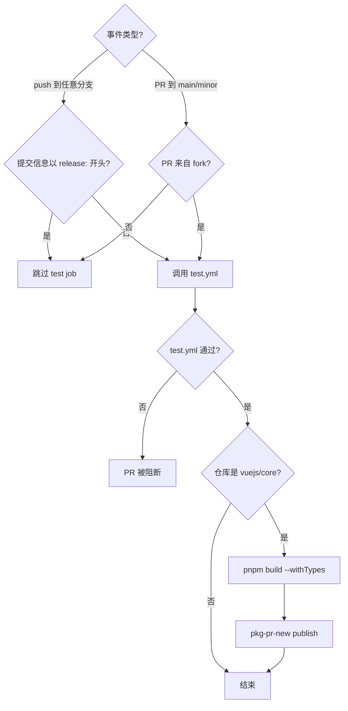
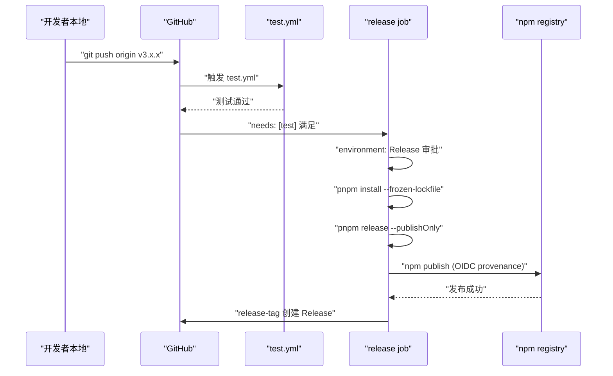
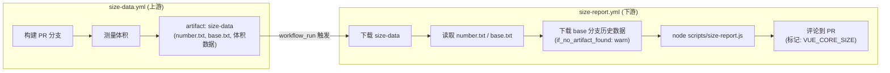

# Capítulo 10: Flujos de trabajo CI/CD: el guardián automatizado desde PR hasta Release

En el capítulo anterior vimos`scripts/release.js`cómo utiliza una máquina de estados interactiva para encadenar cada paso de una publicación. Pero ese script tiene una premisa: debe ser invocado activamente por alguien o algún sistema. En el repositorio de Vue core, este invocador activo no es la terminal local del mantenedor, sino GitHub Actions. release.js es el ejecutor, workflows es el decisor — decide qué evento activa qué tarea, bajo qué condiciones permite el paso y bajo qué condiciones lo bloquea. Este capítulo se centra en`.github/workflows/`los cuatro archivos bajo el directorio:`ci.yml`(puerta de PR y prepublicación continua),`release.yml`(publicación formal activada por tag),`size-report.yml`(informe de regresión de tamaño),`autofix.yml`(corrección automática de formato). Entenderlos no consiste en memorizar la sintaxis YAML, sino en ver claramente cómo el equipo de Vue traduce las normas de ingeniería en restricciones de pipeline que no se pueden eludir.

# I. ci.yml: triple puerta y prepublicación continua

## Modelo intuitivo

Imagina`ci.yml`como el control de seguridad de un aeropuerto. Cada PR debe pasar por esta puerta: lint revisa si tu equipaje tiene artículos prohibidos, typecheck confirma que tu identificación es real y válida, test verifica que no llevas materiales peligrosos. Pero no hay una sola puerta de seguridad — Vue también ha añadido aquí un canal de «prepublicación continua», que publica directamente los artefactos de construcción de cada PR en pkg-pr-new, permitiendo a los contribuyentes validar sus cambios en un escenario real de instalación desde npm.

Sin esta puerta, cualquier fusión podría introducir errores de formato, vulnerabilidades de tipos o regresiones de comportamiento en la rama main, y la rama main es el origen de todas las releases posteriores.

## Condiciones de activación y control de concurrencia

`ci.yml`La configuración de activación de

[FACT:.github/workflows/ci.yml:2-11]

```yaml
on:
  push:
    branches:
      - '**'
    tags:
      - '!**'
  pull_request:
    branches:
      - main
      - minor
```

Copiar`push`Aquí hay dos diseños clave. Primero, el evento`'**'`escucha todas las ramas (`tags: ['!**']`), pero excluye explícitamente todos los push de tags mediante`release.yml`. ¿Por qué excluir los tags? Porque el push de tags es manejado por separado por`ci.yml`; si`pull_request`también respondiera a los tags, se activarían duplicadamente el flujo de publicación y el flujo de CI, desperdiciando recursos del runner e incluso generando condiciones de carrera. Segundo,`main`solo escucha las dos ramas`minor`y`main`— esta es la estrategia de doble rama de Vue:`minor`alberga la versión estable,

[FACT:.github/workflows/ci.yml:22-22]

```yaml
concurrency:
  group: ${{ github.workflow }}-${{ github.event.pull_request.number || github.ref }}
  cancel-in-progress: ${{ github.event_name == 'pull_request' }}
```

Copiar`group`El control de concurrencia es el trazo más ingenioso aquí.`github.event.pull_request.number || github.ref`La expresión de`cancel-in-progress`utiliza`true`como fallback: los eventos de PR usan el número de PR como clave de agrupación, los eventos de push usan el ref (nombre de rama) como clave de agrupación. Esto significa que múltiples push del mismo PR caerán en el mismo grupo de concurrencia. Y

> **[Design Inference & Architectural Trade-offs]**
> durante eventos de PR — cuando empujas tres commits consecutivos, los CI de los dos primeros se cancelan automáticamente, conservando solo el más reciente.

## 〔Inferencia de diseño y compensaciones arquitectónicas〕

[FACT:.github/workflows/ci.yml:22-22]

```yaml
jobs:
  test:
    if: ${{ ! startsWith(github.event.head_commit.message, 'release:') && (github.event_name == 'push' || github.event.pull_request.head.repo.full_name != github.repository) }}
    uses: ./.github/workflows/test.yml
```

La entrada de la triple puerta: la condición del job test`if`Copiar`&&`Esta condición

contiene dos ramas de conjunción lógica (`! startsWith(github.event.head_commit.message, 'release:')`), cada una merece ser desarrollada.`release:`Al principio, se omiten las pruebas. Este es exactamente el formato del mensaje de commit que release.js envía en el capítulo anterior: release.js ya ha ejecutado las pruebas completas localmente, por lo que CI no necesita verificarlas de nuevo. Esta es una optimización de «confiar en el origen».

> **[Design Inference & Architectural Trade-offs]**
> La segunda condición`(github.event_name == 'push' || github.event.pull_request.head.repo.full_name != github.repository)`: el evento push siempre ejecuta las pruebas; el evento PR requiere que el PR provenga de un fork (`head.repo.full_name != github.repository`). ¿Por qué solo se ejecutan las pruebas para PR de fork? Porque los PR de ramas del mismo repositorio generalmente son creados por miembros del equipo principal, y el push de sus ramas ya ha activado el CI del evento push. En cambio, los PR de fork no activan el evento push (el push de un fork no notifica al repositorio upstream), por lo que deben ejecutarse adicionalmente en el evento PR.

Nota`uses: ./.github/workflows/test.yml`——esta es una llamada a un reusable workflow.`test.yml`es un archivo de workflow independiente, compartido por`ci.yml`y`release.yml`. Esta reutilización evita definir repetidamente los pasos de lint/typecheck/test en múltiples workflows.

## Prepublicación continua: el rol de pkg-pr-new

[FACT:.github/workflows/ci.yml:25-51]

```yaml
continuous-release:
  if: github.repository == 'vuejs/core'
  runs-on: ubuntu-latest
  steps:
    - name: Checkout
      uses: actions/checkout@3d3c42e5aac5ba805825da76410c181273ba90b1 # v7.0.1
      with:
        persist-credentials: false
    # ... 安装 pnpm、Node.js、依赖 ...
    - name: Build
      run: pnpm build --withTypes
    - name: Release
      run: pnpx pkg-pr-new publish --compact --pnpm './packages/*' --packageManager=pnpm,npm,yarn
```

`continuous-release`El job solo se ejecuta en el repositorio principal`vuejs/core`(`if: github.repository == 'vuejs/core'`), no se ejecuta en forks. Hace tres cosas: construir (`pnpm build --withTypes`, con declaraciones de tipos), luego usar`pkg-pr-new`para publicar todos los paquetes bajo`./packages/*`en un registro npm temporal.

> **[Design Inference & Architectural Trade-offs]**
> El valor de este mecanismo radica en que los contribuyentes pueden, directamente en su propio proyecto,`npm install`los artefactos de compilación de este PR, verificando si los cambios realmente resuelven el problema. Esto es más convincente que «ver que CI está en verde», porque valida un escenario real de consumo del paquete.

Nota: todas las actions están fijadas a un commit SHA (como`actions/checkout@3d3c42e5...`), en lugar de usar`@v4`una etiqueta flotante como esa. Este es un requisito estricto de seguridad de la cadena de suministro: evitar que código malicioso fluya automáticamente tras un compromiso del repositorio de la action.

## Diagrama de flujo de control de ci.yml



---

# II. release.yml: orquestación de publicación tras el push de un tag

## Modelo intuitivo

Si`ci.yml`es el control de seguridad,`release.yml`es la plataforma de lanzamiento. Cuando release.js completa localmente la actualización de versión, el commit, la creación del tag y el push, el evento de push del tag enciende el motor de`release.yml`. Primero ejecuta una ronda completa de pruebas (confirmación adicional), luego ejecuta`Release`en el entorno protegido`pnpm release --publishOnly`, y finalmente crea el GitHub Release.

Sin él, el tag que release.js envía sería solo una referencia de Git, no habría nueva versión en npm ni página de Release en GitHub.

## Condición de activación: solo reconoce tags

[FACT:.github/workflows/release.yml:3-6]

```yaml
on:
  push:
    tags:
      - 'v*' # Push events to matching v*, i.e. v1.0, v20.15.10
```

Solo escucha pushes de tags con formato`v*`. Esto es complementario con`ci.yml`de`tags: ['!**']`——ambos son estrictamente mutuamente excluyentes y no se activan simultáneamente.

## Condiciones de guarda del job de publicación

[FACT:.github/workflows/release.yml:8-21]

```yaml
jobs:
  test:
    uses: ./.github/workflows/test.yml

  release:
    if: github.repository == 'vuejs/core'
    needs: [test]
    runs-on: ubuntu-latest
    permissions:
      contents: write
      id-token: write
    environment: Release
```

Aquí hay tres capas de guarda, ninguna de las cuales puede omitirse.

Primera capa`if: github.repository == 'vuejs/core'`: evita activaciones accidentales de publicación en forks. Si alguien hace fork del repositorio y envía un`v1.0.0`tag, esta condición impedirá que se ejecute el flujo de publicación.

Segunda capa`needs: [test]`: el job release depende del job test. El job test llama a`test.yml`, y si las pruebas fallan, el job release no se iniciará en absoluto. Esta es la restricción estricta de «debe pasar las pruebas antes de publicar».

> **[Design Inference & Architectural Trade-offs]**
> Tercera capa`environment: Release`: este es un GitHub Environment, que puede configurar reglas de protección de despliegue (como requerir aprobación de personal específico). Esto significa que incluso si el push del tag activa el workflow, el paso de publicación puede requerir aprobación manual para ejecutarse: esta es la última línea de defensa para operaciones irreversibles.

En cuanto a permisos,`contents: write`se usa para crear GitHub Release,`id-token: write`se usa para la autenticación de provenance de npm (token OIDC). Nota: aquí no hay`packages: write`, porque Vue publica en npm, no en GitHub Packages.

## Cadena completa del paso de publicación

[FACT:.github/workflows/release.yml:37-46]

```yaml
- name: Install deps
  run: pnpm install --frozen-lockfile

- name: Update npm
  run: npm i -g npm@latest

- name: Build and publish
  id: publish
  run: |
    pnpm release --publishOnly
```

> **[Design Inference & Architectural Trade-offs]**
> Los tres pasos tienen sus matices.`--frozen-lockfile`asegura que el entorno de CI instale estrictamente según el lockfile, evitando que la deriva de versiones de dependencias haga que los artefactos de compilación sean inconsistentes con los locales.`npm i -g npm@latest`es para obtener la CLI de npm más reciente, porque la autenticación de provenance y OIDC depende de versiones más nuevas de npm; las versiones antiguas pueden no soportar estas características.

`pnpm release --publishOnly`es el punto de entrada de release.js del capítulo anterior.`--publishOnly`El flag le indica a release.js: omitir la selección interactiva de versión, omitir el commit de Git y la creación del tag (porque el tag ya existe), y solo ejecutar la compilación y npm publish.

## Crear GitHub Release

[FACT:.github/workflows/release.yml:48-57]

```yaml
- name: Create GitHub release
  id: release_tag
  uses: yyx990803/release-tag@8cccf7c5aa332d71d222df46677f70f77a8d2dc0 # v1.0.0
  env:
    GITHUB_TOKEN: ${{ secrets.GITHUB_TOKEN }}
  with:
    tag_name: ${{ github.ref }}
    body: |
      For stable releases, please refer to [CHANGELOG.md](...) for details.
      For pre-releases, please refer to [CHANGELOG.md](...) of the `minor` branch.
```

> **[Design Inference & Architectural Trade-offs]**
> Aquí se usa`release-tag` action。`tag_name: ${{ github.ref }}`mantenido por el propio autor de Vue, Evan You, que utiliza directamente la ref del evento desencadenante (es decir,`refs/tags/v3.x.x`). El cuerpo del Release no incluye los cambios específicos, sino que apunta a CHANGELOG.md — porque el changelog de Vue es generado automáticamente por conventional-changelog, y mantener manualmente el cuerpo del Release crearía inconsistencias con el changelog.

## Diagrama de secuencia de release.yml



---

# Tres, size-report.yml y autofix.yml: seguimiento de tamaño y autocorrección de formato

## size-report.yml: informe de regresión de tamaño entre workflows

`size-report.yml`La forma de activación es muy particular — no se activa directamente por push o PR, sino por el evento de finalización de otro workflow.

[FACT:.github/workflows/size-report.yml:3-7]

```yaml
on:
  workflow_run:
    workflows: ['size data']
    types:
      - completed
```

`workflow_run`El evento de escucha se llama`size data`el workflow completado. Este es un diseño de dos fases:`size-data.yml`(Este capítulo no proporciona el código fuente) se encarga de construir y medir el tamaño en el PR, subiendo el resultado como artifact;`size-report.yml`después de que`size data`se complete, descarga el artifact, genera el informe y comenta en el PR.

[FACT:.github/workflows/size-report.yml:20-23]

```yaml
if: >
  github.repository == 'vuejs/core' &&
  github.event.workflow_run.event == 'pull_request' &&
  github.event.workflow_run.conclusion == 'success'
```

Triple guardia: repositorio principal, evento PR, workflow upstream exitoso. Si`size data`falla, el job de informe no se ejecuta — porque no hay datos que reportar.

El flujo de datos es el siguiente:

[FACT:.github/workflows/size-report.yml:41-46]

```yaml
- name: Download Size Data
  uses: dawidd6/action-download-artifact@d63b86af1b34672e53c440b1b83979861906bad7 # v24
  with:
    name: size-data
    run_id: ${{ github.event.workflow_run.id }}
    path: temp/size
```

Descarga desde el workflow run upstream el`size-data`artifact a`temp/size`. Luego lee en paralelo el número de PR y la rama base:

[FACT:.github/workflows/size-report.yml:48-59]

```yaml
- parallel:
    - name: Read PR Number
      id: pr-number
      uses: juliangruber/read-file-action@271ff311a4947af354c6abcd696a306553b9ec18 # v1.1.8
      with:
        path: temp/size/number.txt
    - name: Read base branch
      id: pr-base
      uses: juliangruber/read-file-action@271ff311a4947af354c6abcd696a306553b9ec18 # v1.1.8
      with:
        path: temp/size/base.txt
```

`parallel`es azúcar sintáctico de GitHub Actions que permite ejecutar dos pasos sin dependencias simultáneamente.`number.txt`y`base.txt`son`size-data.yml`archivos de metadatos escritos durante la medición.

A continuación, descarga los datos históricos de tamaño de la rama base para comparar:

[FACT:.github/workflows/size-report.yml:61-69]

```yaml
- name: Download Previous Size Data
  uses: dawidd6/action-download-artifact@d63b86af1b34672e53c440b1b83979861906bad7 # v24
  with:
    branch: ${{ steps.pr-base.outputs.content }}
    workflow: size-data.yml
    event: push
    name: size-data
    path: temp/size-prev
    if_no_artifact_found: warn
```

Nota`if_no_artifact_found: warn`— si la rama base aún no tiene datos históricos (por ejemplo, una rama nueva), no fallará, solo advertirá. Esto garantiza que el informe aún se genere en la primera ejecución, solo que sin línea base de comparación.

Finalmente, genera el informe y comenta:

[FACT:.github/workflows/size-report.yml:71-89]

```yaml
- name: Prepare report
  run: node scripts/size-report.js > size-report.md

- name: Read Size Report
  id: size-report
  uses: juliangruber/read-file-action@271ff311a4947af354c6abcd696a306553b9ec18 # v1.1.8
  with:
    path: ./size-report.md

- name: Create Comment
  uses: actions-cool/maintain-one-comment-backup@fbbc22ad1809c1bcf46f19b58397b6254773588c # backup for v3.0.0
  with:
    token: ${{ secrets.GITHUB_TOKEN }}
    number: ${{ steps.pr-number.outputs.content }}
    body: |
      ${{ steps.size-report.outputs.content }}
      
    body-include: ''
```

`scripts/size-report.js`lee`temp/size`y`temp/size-prev`los datos bajo, generando un informe en Markdown.`maintain-one-comment-backup`La action usa`body-include: '<!-- VUE_CORE_SIZE -->'`como marcador, asegurando que solo se mantenga un comentario de informe de tamaño en el mismo PR (actualizar en lugar de añadir). Nota la anotación en L81 que indica que el repositorio original de la action fue bloqueado por GitHub, por lo que se usó un repositorio de respaldo con commit fijado.

## autofix.yml: corrección automática de problemas de formato

`autofix.yml`resuelve un problema muy práctico: el código enviado por el contribuyente no cumple con las normas de prettier/eslint, CI falla, y el contribuyente necesita ejecutar manualmente`pnpm lint --fix`y volver a enviar. Este workflow automatiza este paso.

[FACT:.github/workflows/autofix.yml:3-8]

```yaml
on:
  pull_request:

concurrency:
  group: ${{ github.workflow }}-${{ github.event.pull_request.number }}
  cancel-in-progress: ${{ github.event_name == 'pull_request' }}
```

Se activa en todos los PR, el control de concurrencia es similar a`ci.yml`— un nuevo push en el mismo PR cancela la ejecución anterior de autofix.

[FACT:.github/workflows/autofix.yml:35-41]

```yaml
- name: Run eslint
  run: pnpm run lint --fix

- name: Run prettier
  run: pnpm run format

- uses: autofix-ci/action@7a166d7532b277f34e16238930461bf77f9d7ed8
```

Primero ejecuta el`--fix`de eslint, luego el formateo de prettier, y finalmente`autofix-ci/action`hace commit directo de los archivos modificados a la rama del PR. Nota que`pnpm run format`en sí mismo es un comando de formateo (no necesita el`--fix`flag, porque el script format internamente es`prettier --write`）。

> **[Design Inference & Architectural Trade-offs]**
> La clave de este mecanismo es que`autofix-ci/action`hace commit de las correcciones como el autor del PR, no como bot. Así el contribuyente no necesita operaciones adicionales, y la corrección de formato aparece automáticamente en su PR. Pero esto también significa que si la rama del contribuyente tiene reglas de protección (no permite push de bots), autofix fallará — este es un caso límite que el contribuyente debe manejar manualmente.

## Diagrama de flujo de datos de size-report



---

# Reflexión de diseño: solidificar las normas en el pipeline

Revisando estos cuatro workflows, se pueden ver varios principios de diseño que atraviesan todo.

**Primero, minimización de permisos.** `ci.yml`y`autofix.yml`ambos declaran`permissions: contents: read`, solo`release.yml`necesita`contents: write`y`id-token: write`。`size-report.yml`necesita`pull-requests: write`y`issues: write`para comentar. Cada workflow solo obtiene los permisos que realmente necesita.

**Segundo, seguridad de la cadena de suministro.**Todas las actions de terceros están fijadas a commit SHA, no a tags flotantes.`size-report.yml`La anotación en L81 indica directamente que tras el bloqueo del repositorio original de la action se cambió a un repositorio de respaldo con commit fijado — esto es defensa práctica contra ataques a la cadena de suministro.

**Tercero, separación de responsabilidades y reutilización.** `test.yml`es compartido por`ci.yml`y`release.yml`, evitando duplicación de lógica de pruebas.`size-data.yml`y`size-report.yml`están separados, permitiendo que medición y reporte evolucionen independientemente.

**Cuarto, elección de la dirección del fallo.** `size-report.yml`El`if_no_artifact_found: warn`de elige «advertir en lugar de fallar», porque la falta de datos históricos no debería bloquear el PR. Mientras que el`release.yml`de`needs: [test]`elige «fallo de prueba bloquea el release», porque el release es una operación irreversible.

**Quinto, diferenciación del control de concurrencia.**El evento PR cancela ejecuciones antiguas (`cancel-in-progress: true`), el evento push no cancela (`cancel-in-progress: false`). Esta diferencia refleja la semántica de ambos eventos: los commits antiguos del PR ya no tienen sentido, cada commit del push puede ser el estado final.

---

# Resumen del capítulo

Este capítulo analizó los cuatro workflows principales del repositorio Vue core:

- **`ci.yml`**: puerta de PR + pre-release continuo. Mediante`if`condiciones que distinguen push/PR y fork/mismo repositorio, usando`concurrency`para cancelar ejecuciones obsoletas de PR, usando`pkg-pr-new`para publicar paquetes pre-release instalables.
- **`release.yml`**: Publicación oficial activada por tag. Tres capas de protección (verificación del repositorio, needs test, aprobación del environment) garantizan que solo los tags que hayan pasado las pruebas y hayan sido aprobados puedan publicarse en npm.
- **`size-report.yml`**: Informe de regresión de tamaño entre workflows. Mediante`workflow_run`eventos se escucha el flujo ascendente`size data`completado, se descarga el artifact y se comparan los datos con la rama base, retroalimentando al PR en forma de comentario.
- **`autofix.yml`**: Corrección automática de formato. Se ejecutan eslint --fix y prettier en el PR, y mediante`autofix-ci/action`se envían las correcciones directamente de vuelta a la rama del PR.

Estos cuatro workflows juntos constituyen una «pipeline que no se puede eludir»: el estilo del código se corrige automáticamente con autofix, los tipos y las pruebas se verifican obligatoriamente con ci.yml, la regresión de tamaño se rastrea con size-report, y la publicación se ejecuta con release.yml bajo múltiples capas de protección.

# Reflexiones y autoevaluación de este capítulo

Q1: Si se cambia el valor de`ci.yml`en`cancel-in-progress`para que sea siempre`true`(es decir, se elimina la condición de`github.event_name == 'pull_request'`), ¿en qué escenarios causaría problemas?

**Análisis de referencia**：`cancel-in-progress`Que sea siempre`true`significa que, al hacer push a la rama main, un nuevo push cancelará la CI antigua que esté en ejecución. Considérese este escenario: en la rama main se fusionan dos PR consecutivamente, la CI del primer PR está en ejecución (incluyendo lint/typecheck/test completos), y la fusión del segundo PR activa una nueva ejecución de CI. Si`cancel-in-progress`es`true`, la CI del primer PR será cancelada; pero el código del primer PR ya está en main, y su resultado de CI es crucial para juzgar el estado de salud de la rama main. Cancelarla significa que en la rama main hay un fragmento de código que nunca fue verificado por completo. Y la condición[FACT:.github/workflows/ci.yml:22-22]`github.event_name == 'pull_request'`precisamente evita este problema: solo los eventos de PR cancelan ejecuciones antiguas, los eventos de push nunca cancelan.

Q2: `release.yml`En`release`, ¿qué escenarios defienden respectivamente`if: github.repository == 'vuejs/core'`y`environment: Release`del job? ¿Qué pasaría si se elimina uno de ellos?

**Análisis de referencia**：`if: github.repository == 'vuejs/core'` [FACT:.github/workflows/release.yml:14]defiende el escenario de fork. Si alguien hace fork de vuejs/core y hace push de un tag`v3.99.0`, sin esta condición, el workflow se ejecutaría en el repositorio fork`pnpm release --publishOnly`. Aunque el repositorio fork no tiene token de npm y no puede publicar realmente, desperdiciaría recursos del runner y podría generar notificaciones de fallo engañosas.`environment: Release` [FACT:.github/workflows/release.yml:21]defiende el riesgo de «publicación automática tras el push del tag»: permite configurar una aprobación manual, asegurando que incluso si se hace push del tag, la publicación requiera la confirmación del mantenedor. Si se elimina la condición`if`, el fork desperdiciaría recursos; si se elimina`environment`, cualquiera con permiso para hacer push de tags podría activar la publicación, sin el paso final de confirmación humana. Ambos son defensas de niveles distintos y no pueden sustituirse entre sí.

Q3: `size-report.yml`En`if_no_artifact_found: warn`, la elección de`release.yml`y en`needs: [test]`, la elección de

**, ¿qué filosofía de diseño de dirección de fallo reflejan respectivamente? ¿Qué pasaría si se intercambiaran ambas estrategias?**：`if_no_artifact_found: warn` [FACT:.github/workflows/size-report.yml:69]Análisis de referencia`fail`elige «advertir en lugar de fallar cuando faltan datos históricos», porque el informe de tamaño es información auxiliar, no una condición de bloqueo. Si se cambiara a`needs: [test]` [FACT:.github/workflows/release.yml:15], entonces las ramas nuevas o los PR en su primera ejecución fallarían por no encontrar datos base, lo cual es claramente irrazonable.

---

elige «bloquear la publicación si fallan las pruebas», porque la publicación es una operación irreversible y debe garantizar la calidad del código. Si se intercambiaran —size-report fallando cuando faltan datos, release publicando aunque fallen las pruebas—, lo primero causaría una gran cantidad de falsos positivos que bloquearían PR normales, y lo segundo haría que código no probado llegara a npm. Esto refleja el principio de diseño de dirección de fallo de «flexible con la información auxiliar, estricto con las operaciones irreversibles».`scripts/size-report.js`El próximo capítulo profundizará en el núcleo del mecanismo de presupuesto de tamaño:`usage-size`cómo se analizan los datos de tamaño, cómo se calcula el incremento, cómo se formatea la salida, y la filosofía de medición de

—por qué Vue elige medir el «tamaño de uso real» en lugar del «tamaño completo del paquete».`scripts/size-report.js`Desde la puerta de acceso del PR hasta la publicación por tag, los cuatro archivos de workflow juntos constituyen una cadena de guardianes automatizados que no se puede eludir. Pero la pipeline puede bloquear fusiones solo si dispone de criterios de juicio cuantificables. El próximo capítulo se centrará en la gobernanza ingenieril de Vue sobre el tamaño del paquete como métrica central:`scripts/usage-size.js`cómo calcular el tamaño gzip de cada artefacto y compararlo con la línea base,
