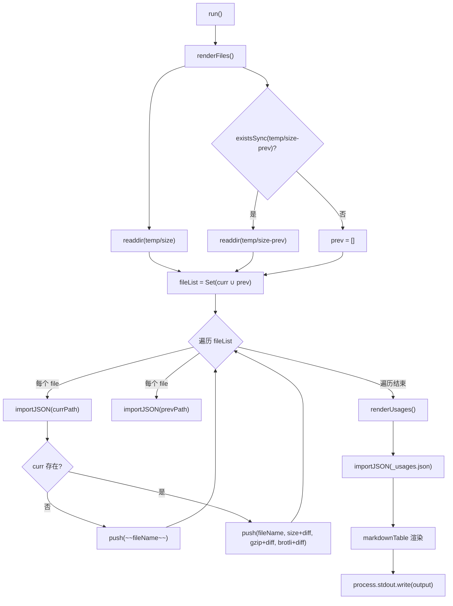
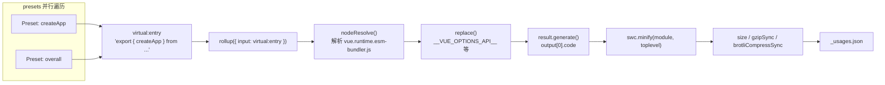

# Capítulo siguiente: Capítulo 11 →

En el capítulo anterior vimos cómo Vue utiliza GitHub Actions para convertir lint, verificación de tipos, pruebas y seguimiento de tamaño en un pipeline imposible de eludir, donde size-report.yml y size-data.yml se encargan de dejar datos de tamaño tras cada cambio. Pero el pipeline solo ejecuta; lo que realmente responde «cuánto ha crecido y dónde» son los dos scripts que desglosaremos en este capítulo. La contradicción central del presupuesto de tamaño radica en que: el tamaño del paquete es una métrica que solo se puede percibir, pero es difícil de atribuir con precisión. Cuando los usuarios se quejan de que «Vue es demasiado grande», los mantenedores necesitan responder tres preguntas: ¿cuánto ha crecido? ¿dónde ha crecido? ¿este cambio lo ha hecho más grande? scripts/size-report.js se encarga de la comparación, scripts/usage-size.js se encarga de la atribución, y juntos constituyen la filosofía de medición del presupuesto de tamaño.

# 11.1 size-report: convertir las diferencias de tamaño en una tabla Markdown legible

## Modelo intuitivo

Imagina que eres un inspector de calidad en una empresa de logística. Cada paquete (artefacto de compilación) debe pesarse antes de salir del almacén, y tu trabajo no es pesar en sí, sino colocar «el peso de hoy» y «el peso de ayer» en una tabla, marcando en negrita`+2.3 kB`qué paquetes han aumentado de peso. Sin esta tabla comparativa, los mantenedores solo verían un montón de números aislados, incapaces de determinar si un PR ha introducido una regresión de tamaño.

`size-report.js`es precisamente ese inspector de calidad. No produce datos de tamaño (eso es tarea de`usage-size.js`y los scripts de compilación), solo consume los archivos JSON de dos directorios y genera un informe Markdown.

## Estructura de datos y convención de directorios

La convención central del script está oculta en dos constantes. El directorio de datos actual es`temp/size`, y el directorio de línea base histórica es`temp/size-prev`。

[FACT:scripts/size-report.js:23-24]

La denominación de estos dos directorios no es arbitraria:`temp/size`es generado por`size-data.yml`el flujo de trabajo en cada ejecución y subido como artifact[FACT:.github/workflows/size-data.yml:53-57], mientras que`temp/size-prev`es obtenido por`size-report.yml`tras descargar el artifact de línea base y descomprimirlo. El nombre del directorio en sí mismo es el contrato del flujo de datos.

El script define tres alias de tipo que describen con precisión la estructura de los archivos JSON:

[FACT:scripts/size-report.js:8-21]

`SizeResult`tiene tres campos numéricos:`size`(sin comprimir),`gzip`、`brotli`。`BundleResult`sobre esta base añade el campo`file`para mostrar el nombre del archivo.`UsageResult`es un`Record`, donde la clave es el nombre del preset y el valor es`SizeResult & { name: string }`—observa que aquí hay un campo adicional`name`, porque las claves del objeto JSON se pierden después de`Object.values`, por lo que el nombre debe almacenarse redundantemente en el valor.

## Step-by-Step Walkthrough

El flujo principal es extremadamente simple, solo dos pasos más una salida:

[FACT:scripts/size-report.js:23-38]

`run()`primero llama a`renderFiles()`para renderizar la tabla de archivos de artefactos, luego llama a`renderUsages()`para renderizar la tabla de escenarios de uso, y finalmente escribe la cadena acumulada en la variable a nivel de módulo`output`de una sola vez en stdout[FACT:scripts/size-report.js:25]. Este patrón de «acumular cadenas y luego emitirlas de una vez» evita la sobrecarga de múltiples concatenaciones de`process.stdout.write`y también hace que el orden de salida sea completamente controlable.

**Primer paso: recopilar la lista de archivos y calcular la unión.**

[FACT:scripts/size-report.js:44-49]

`filterFiles`filtra dos tipos de archivos: los que comienzan con`_`(como`_usages.json`) y los que terminan con`.txt`(como`number.txt`、`base.txt`). Estos dos tipos de archivos son metadatos, no datos de tamaño. Luego toma la unión de los nombres de archivo del directorio actual y del directorio histórico`fileList`—usando`Set`para eliminar duplicados. ¿Por qué tomar la unión? Porque un archivo puede existir solo en el directorio histórico (este build eliminó ese artefacto), o puede existir solo en el directorio actual (este build añadió un nuevo artefacto). Ambas situaciones deben reflejarse en el informe.

**Segundo paso: comparación archivo por archivo.**

[FACT:scripts/size-report.js:43-75]

Para cada archivo en la unión, intenta importar el JSON desde ambos directorios.`importJSON`La implementación de

[FACT:scripts/size-report.js:112-115]

es «devuelve undefined si el archivo no existe»:`import()`Aquí se usa`with: { type: 'json' }`dinámico junto con la aserción de importación`fs.readFileSync` + `JSON.parse`, en lugar de`import()`. El primero es manejado por el cargador de módulos de Node, el segundo requiere manejo manual de errores de codificación y análisis. El costo de elegir`renderFiles`es que devuelve una Promise, por lo que todo

es async.`if (!curr)`La rama clave está en`~~fileName~~`: si el directorio actual no tiene este archivo, significa que el artefacto ha sido eliminado, y se marca[FACT:scripts/size-report.js:60-61]con la sintaxis de tachado de Markdown`getDiff`. De lo contrario, se renderiza una línea normal, concatenando el resultado de

**después de cada valor numérico.**

[FACT:scripts/size-report.js:124-130]

`getDiff`Tercer paso: calcular la diferencia.`prev === undefined`tiene tres puntos de retorno anticipado:`diff === 0`devuelve cadena vacía cuando (no hay línea base, no se puede comparar);`prettyBytes(diff)`devuelve cadena vacía cuando (sin cambios, no mostrar ruido); de lo contrario devuelve la diferencia con signo en negrita. Observa que`-1.2 kB`maneja correctamente los números negativos, produciendo formas como`sign`, mientras que la variable`+`。

**solo añade**

[FACT:scripts/size-report.js:80-103]

`renderUsages`cuando es positivo.`renderFiles`Cuarto paso: renderizar la tabla de usage.`_usages.json`La diferencia estructural entre`Object.values(curr)`y`prev?.[usage.name]`merece atención: importa directamente`name`, porque los datos de usage existen fijamente en este único archivo.`.filter(usage => !!usage)`convierte el Record en array y luego busca los datos históricos por nombre mediante`map`—esta es precisamente la razón por la que el campo

se almacena redundantemente.`markdown-table`Esta línea es en realidad redundante, porque[FACT:scripts/size-report.js:72-74]。

## Finalmente usa la biblioteca

> **[Design Inference & Architectural Trade-offs]**
> **Copiar`import()`Reflexiones de diseño y trampas`readFileSync`？**〔Inferencia de diseño y compensaciones arquitectónicas〕`import()`¿Por qué usar

**`filterFiles`en lugar de`file[0] !== '_'`dinámico**La aserción de importación para JSON es la práctica estándar en Node 20+, que maneja naturalmente la carga de JSON en entornos ESM. El costo es que no se puede usar en contextos síncronos, y cada importación es cacheada por el módulo —pero en este script de una sola ejecución, el caché no es un problema.`readdir`La comprobación`file[0]`de`undefined`，`undefined !== '_'`.

**Manejo de la eliminación de artefactos.**Cuando se elimina un artefacto, el informe lo marca con tachado en lugar de eliminarlo directamente. Esto es un diseño intencional: los mantenedores necesitan ver «este archivo desapareció», en lugar de que desaparezca silenciosamente de la tabla. Si se filtrara directamente, los lectores pensarían erróneamente que ese artefacto nunca existió.

# 11.2 usage-size: simular el escenario de importación de un usuario real

## Modelo intuitivo

`size-report`Te dice «cuán grande es el paquete completo», pero eso no responde a la pregunta que realmente le importa al usuario: «si solo uso`createApp`, ¿cuánto código necesito descargar realmente?». El tamaño del paquete completo incluye una gran cantidad de código que probablemente nunca usarás (como`defineCustomElement`、`Transition`、`KeepAlive`）。`usage-size.js`El rol de es interpretar a un «usuario típico»: escribir un archivo de entrada virtual que solo importe una API específica, empaquetarlo con Rollup y ver cuán grande es el artefacto final.

Esto es como si un restaurante no te dijera «el peso total de todos los ingredientes en la cocina es de 50 kilogramos», sino «si pides un pollo Kung Pao, los ingredientes que realmente se usan son 300 gramos».

## Estructura de datos: array de Preset

La estructura de datos central del script es el array`presets`, cada elemento describe un escenario de uso:

[FACT:scripts/usage-size.js:27-55]

`Preset`El tipo tiene tres campos:`name`(nombre para mostrar),`imports`(lista de APIs importadas desde Vue), opcional`replace`(reemplazos adicionales en tiempo de compilación). Los cinco presets cubren escenarios de uso desde el mínimo hasta el máximo:

- `createApp (CAPI only)`: solo importa`createApp`, y reemplaza`__VUE_OPTIONS_API__`por`'false'`, simulando un usuario de API de composición pura[FACT:scripts/usage-size.js:35-40]
- `createApp`: solo importa`createApp`, conservando Options API[FACT:scripts/usage-size.js:35-40]
- `createSSRApp`: escenario SSR[FACT:scripts/usage-size.js:35-40]
- `defineCustomElement`: escenario de Web Components[FACT:scripts/usage-size.js:35-40]
- `overall`: importa seis APIs principales, simulando un usuario «full-featured»[FACT:scripts/usage-size.js:44-54]

El archivo de entrada se fija como el artefacto esm-bundler de runtime-only:

[FACT:scripts/usage-size.js:24-28]

Se elige`vue.runtime.esm-bundler.js`en lugar de la versión completa`vue.esm-bundler.js`, porque la versión de runtime no incluye el compilador de plantillas y se acerca más a la situación real de los usuarios de herramientas de construcción modernas: usan SFC para precompilar plantillas y no necesitan el compilador en runtime.

## Step-by-Step Walkthrough

**Primer paso: generar en paralelo los bundles de todos los presets.**

[FACT:scripts/usage-size.js:62-69]

`main()`Se crea para cada preset una Promise de`generateBundle`, ejecutándolas en paralelo con`Promise.all`. Aquí el paralelismo es seguro, porque cada llamada a`generateBundle`es independiente`rollup()`, sin compartir estado entre sí.

**Segundo paso: construir la entrada virtual.**

[FACT:scripts/usage-size.js:94-96]

Esta es la parte más ingeniosa de todo el script. No escribe archivos temporales en disco, sino que construye un ID de módulo virtual`virtual:entry`, cuyo contenido es una sentencia re-export:`export { createApp } from '/absolute/path/to/vue.runtime.esm-bundler.js'`. Nótese que`entry`es una ruta absoluta, porque Rollup necesita poder resolverla.

**Tercer paso: configurar la cadena de plugins de Rollup.**

[FACT:scripts/usage-size.js:98-121]

El orden del array de plugins es crucial:

1. **Personalizado`usage-size-plugin`**：`resolveId`intercepta`virtual:entry`y devuelve sí mismo,`load`devuelve el contenido virtual[FACT:scripts/usage-size.js:101-110]. Este es el patrón estándar de módulos virtuales de Rollup.

2. **`nodeResolve()`**: resuelve`vue.runtime.esm-bundler.js`los imports internos de[FACT:scripts/usage-size.js:111]。

3. **`replace`**: inyecta constantes en tiempo de compilación[FACT:scripts/usage-size.js:112-119]。

`replace`La configuración del plugin revela el mecanismo central del artefacto esm-bundler: conserva`__VUE_OPTIONS_API__`、`__VUE_PROD_DEVTOOLS__`y otros indicadores de runtime, que son reemplazados por la herramienta de construcción del usuario. Aquí el script hace el reemplazo por el usuario:

- `process.env.NODE_ENV` → `"production"`: toma la rama de producción
- `__VUE_PROD_DEVTOOLS__` → `'false'`: desactiva el soporte de devtools
- `__VUE_PROD_HYDRATION_MISMATCH_DETAILS__` → `'false'`: desactiva los errores detallados de hydration
- `__VUE_OPTIONS_API__` → `'true'`: conserva Options API por defecto

Luego expande`...preset.replace`, permitiendo que el preset sobrescriba los valores por defecto.`createApp (CAPI only)`El preset precisamente usa este mecanismo para cambiar`__VUE_OPTIONS_API__`a`'false'` [FACT:scripts/usage-size.js:35-40]。

`preventAssignment: true`Evitar reemplazar`obj.process.env.NODE_ENV = x`este tipo de sentencias de asignación[FACT:scripts/usage-size.js:117]。

**Cuarto paso: generar, comprimir, medir.**

[FACT:scripts/usage-size.js:123-134]

`result.generate({})`Se produce el código, se toma`output[0].code`. Luego se comprime con SWC:

[FACT:scripts/usage-size.js:125-130]

`module: true`indica que la entrada es ESM,`toplevel: true`permite comprimir nombres de variables de ámbito superior. Tras la compresión se calculan tres métricas:`minified.length`(longitud en bytes),`gzipSync(minified).length`、`brotliCompressSync(minified).length`。

Nótese que aquí se usa la API síncrona de`node:zlib`, no la versión asíncrona. En un script de una sola ejecución, la API síncrona es más concisa, y la compresión en sí es una operación intensiva en CPU, por lo que la asincronía no aporta beneficios de paralelismo.

**Quinto paso: salida y persistencia.**

[FACT:scripts/usage-size.js:62-86]

Los resultados se imprimen primero en la consola en formato legible para humanos, coloreando con`pico`.[FACT:scripts/usage-size.js:62-86]. Luego se escriben en`temp/size/_usages.json`, usando`Object.fromEntries`para convertir el array de vuelta a Record, con clave el nombre del preset[FACT:scripts/usage-size.js:81-85]。

`--write`El indicador controla si se escriben adicionalmente los bundles sin comprimir de cada preset en disco[FACT:scripts/usage-size.js:136-138], para depuración.

## Reflexiones de diseño y trampas encontradas

> **[Design Inference & Architectural Trade-offs]**
> **¿Por qué usar módulos virtuales en lugar de archivos temporales?**Los archivos temporales requieren manejar rutas, limpieza y conflictos de escritura concurrente. Los módulos virtuales mantienen el contenido de entrada en memoria, y el hook`resolveId`/`load`de Rollup soporta naturalmente este patrón. El costo es que se debe coincidir exactamente el ID; cualquier error tipográfico hará que Rollup reporte «no se puede resolver la entrada».

**`replace`La trampa de`preventAssignment`en**Si no se establece`preventAssignment: true`，`replace`, el plugin también reemplazará sentencias de asignación como`process.env.NODE_ENV = 'x'`, produciendo`"production" = 'x'`un error de sintaxis. En el código fuente de Vue sí existen asignaciones a`process.env.NODE_ENV`(en herramientas de prueba), por lo que esta opción es necesaria.

**`__VUE_OPTIONS_API__`Elección del valor por defecto de**El script establece el valor por defecto como`'true'` [FACT:scripts/usage-size.js:116], en lugar de`'false'`. Esta es una elección conservadora: si el usuario no configura nada, Vue conservará el soporte de Options API.`createApp (CAPI only)`El preset lo sobrescribe explícitamente a`'false'`, mostrando el beneficio en tamaño al desactivarlo. Esta comparación en sí misma es documentación para el usuario: decirle «cuánto se ahorra al desactivar Options API».

**Semántica de fallo de`Promise.all`en paralelo.**Si el empaquetado de cualquier preset falla,`Promise.all`se rechazará inmediatamente, los demás empaquetados en curso no se cancelarán (Rollup no proporciona un mecanismo de cancelación). En CI, esto significa que un fallo desperdicia el cómputo de los otros presets, pero el script en sí termina con un código de salida distinto de cero, y CI puede capturarlo correctamente.

# 11.3 De los datos a la puerta de control: cómo CI consume estos informes

## Panorama del flujo de datos

Para entender estos dos scripts, hay que devolverlos al pipeline de CI.`size-data.yml`se ejecuta al hacer push a main/minor o en un PR`pnpm run size` [FACT:.github/workflows/size-data.yml:45], produce`temp/size`directorio, luego se sube como artifact[FACT:.github/workflows/size-data.yml:53-57]。

Para los PR, además escribe dos archivos de metadatos:

[FACT:.github/workflows/size-data.yml:47-51]

`number.txt`almacena el número de PR,`base.txt`almacena el nombre de la rama destino. Estos dos archivos son precisamente`size-report.js`en`filterFiles`los que hay que filtrar`.txt`archivos[FACT:scripts/size-report.js:44-45]. Su existencia es para que el`size-report.yml`downstream sepa «con qué línea base comparar».

## Obtención y comparación de la línea base

`size-report.yml`(ya detallado en el capítulo anterior) el flujo de trabajo es: descargar el`size-data`artifact del PR actual, descargar el artifact de línea base de la rama destino, descomprimir la línea base en`temp/size-prev`, luego ejecutar`size-report.js`para generar el informe Markdown y comentarlo en el PR.

Aquí hay una restricción de diseño clave:`size-report.js`en sí no se encarga de obtener la línea base, asume que`temp/size-prev`ya existe. Si no existe,`existsSync(prevDir)`devuelve false,`prev`es un array vacío[FACT:scripts/size-report.js:48], todos los diff son cadenas vacías. Esto es degradación elegante: sin línea base el informe aún se genera, solo que no muestra diferencias.

## Lógica de decisión de la puerta de control de tamaño

> **[Design Inference & Architectural Trade-offs]**
> Es necesario aclarar un malentendido común:`size-report.js`en sí no realiza la decisión de la puerta de control. Solo genera el informe, no devuelve código de salida, no establece umbrales. La verdadera puerta de control ocurre a nivel del`size-report.yml`workflow — puede contener un paso que analice los valores de diff del informe y haga fallar el job si superan el umbral.

Este diseño de «separación entre medición y decisión» tiene razones profundas: el script de medición debe mantenerse puro, solo encargado de producir hechos; la lógica de decisión debe estar a nivel del workflow, porque los umbrales pueden variar según versión, rama o fase de publicación. Codificar los umbrales en`size-report.js`lo haría difícil de reutilizar.

# Reflexiones de diseño

**¿Por qué el presupuesto de tamaño necesita dos conjuntos de mediciones?**El tamaño completo del paquete y el tamaño de usage responden a preguntas diferentes. El tamaño completo del paquete es el «límite superior» — te dice cuánto tendría que descargar el usuario en el peor caso. El tamaño de usage es el «valor típico» — te dice cuánto descarga realmente la mayoría de los usuarios. Solo combinando ambos se obtiene un retrato completo del tamaño. Si solo existiera el tamaño completo del paquete, los mantenedores tenderían a optimizar en exceso APIs poco usadas; si solo existiera el tamaño de usage, podrían pasarse por alto explosiones de tamaño en ciertos escenarios límite.

**El significado de la doble métrica gzip y brotli.**Los CDN modernos soportan brotli de forma generalizada, pero no en todos los escenarios está habilitado. Reportar ambos permite a los mantenedores evaluar «cómo es el tamaño en entornos que solo soportan gzip». brotli suele ser 15-20% más pequeño que gzip, y esa diferencia en sí misma es información valiosa.

**El contrato de estabilidad del formato de datos.** `size-report.js`y`usage-size.js`se desacoplan mediante archivos JSON.`usage-size.js`escribe`_usages.json`，`size-report.js`lo lee. Los nombres de campo de este contrato (`name`、`size`、`gzip`、`brotli`) son implícitos, sin validación de schema. Si`usage-size.js`cambia un nombre de campo y olvida sincronizar`size-report.js`, el informe mostrará datos erróneos silenciosamente. Este es el punto frágil del diseño actual.

# Resumen del capítulo

# Reflexiones y autoevaluación del capítulo

Q1: `size-report.js`de`filterFiles`filtra los archivos que comienzan con`_`. Si`usage-size.js`renombra el archivo de salida de`_usages.json`a`usages.json`, ¿qué sucedería?

**Análisis de referencia**：`filterFiles`La condición de filtrado de`file[0] !== '_' && !file.endsWith('.txt')` [FACT:scripts/size-report.js:44-45]es`usages.json`. Si el archivo se renombra a`_`, ya no comienza con`filterFiles`, será retenido por`fileList`y entrará en la unión de`renderFiles`. Luego`importJSON`intentará tratarlo como archivo bundle:`Record<string, UsageResult>`puede importarlo con éxito (es JSON válido), pero su estructura es`BundleResult`en lugar de`curr?.file`, por lo que`undefined`，`fileName`es`curr.size`es una cadena vacía,`undefined`，`prettyBytes(undefined)`también es`filterFiles`lanzará error o dará salida anómala. Esto provocará el fallo en la generación del informe. La raíz del problema es que

Q2: `usage-size.js`usa el prefijo del nombre de archivo como criterio para distinguir «metadatos vs datos», en lugar de usar estructura de directorios o un manifiesto explícito. Un enfoque más robusto sería poner los datos de usage en un subdirectorio, o mantener una lista explícita de archivos de metadatos.`Promise.all(tasks)`en`replace`ejecuta en paralelo el empaquetado de todos los presets. Si la configuración de`__VUE_OPTIONS_API__`de algún preset omite`'true'`, ¿qué sucedería? ¿Por qué el valor por defecto se establece en`'false'`？

**en lugar de**：`replace`Análisis de referencia`__VUE_OPTIONS_API__: 'true'`En la configuración del plugin`...preset.replace`,[FACT:scripts/usage-size.js:116-118]es el valor por defecto, luego se expande`'true'`permitiendo sobrescribir`'true'`. Si algún preset omite la configuración, usará el valor por defecto`__VUE_OPTIONS_API__`, es decir, conserva el soporte de Options API, y el tamaño será mayor. Establecer el valor por defecto en`'false'`es una elección conservadora: refleja «el comportamiento real cuando el usuario no configura». En el artefacto esm-bundler de Vue,`createApp (CAPI only)`el comportamiento por defecto es conservar Options API (a menos que el usuario lo desactive explícitamente). Si el valor por defecto se estableciera en`'false'` [FACT:scripts/usage-size.js:35-40], todos los presets sin configuración explícita mostrarían un tamaño menor, engañando al usuario haciéndole creer que «sin configurar se ahorra tamaño».

Q3: `size-report.js`El preset se establece explícitamente en`importJSON`, precisamente para mostrar «el beneficio tras desactivarlo explícitamente», contrastando con el valor por defecto.`import()`de`fs.readFileSync`usa`temp/size-prev`dinámico en lugar de

**. Si algún archivo JSON en el directorio**está corrupto (JSON inválido), ¿en qué se diferencian ambos comportamientos de implementación?`import()`Análisis de referencia`SyntaxError`: el`importJSON`dinámico lanza`existsSync`al parsear JSON inválido, y este error no puede ser capturado por la comprobación interna de`existsSync`Solo verifica si el archivo existe, no valida la legalidad del contenido[FACT:scripts/size-report.js:112-115]. El error se propaga hacia arriba hasta`renderFiles`, lo que provoca que falle toda la generación del informe. Si se usa`fs.readFileSync` + `JSON.parse`, también lanzará un error, pero se puede envolver dentro de`importJSON`con try-catch, devolviendo`undefined`para lograr una degradación elegante. La implementación actual opta por dejar que el error se propague, con la suposición implícita de que «el JSON en el artifact siempre es válido» — esta suposición normalmente se cumple en entornos de CI, porque los archivos son generados por`usage-size.js`y los scripts de compilación. Pero al depurar localmente, si se modifica manualmente el archivo JSON y se corrompe, el informe fallará directamente en lugar de omitir ese archivo. Esta es una decisión de diseño de «confiar en la fuente de datos».

---

El mecanismo de presupuesto de tamaño resuelve los problemas de «qué medir» y «cómo comparar», pero depende de una premisa: que el artefacto de compilación en sí sea reproducible. El siguiente capítulo entrará en el sandbox de depuración mínimo:`vite-debug`cómo iniciar un entorno de desarrollo Vue interactivo con la mínima configuración, y cómo se vincula con los artefactos de compilación locales, formando un ciclo cerrado desde la modificación del código fuente hasta la verificación en tiempo de ejecución.

Hasta aquí, el ciclo de medición del presupuesto de tamaño ya está claro: size-report.js responde con la comparación de directorios a «cuánto ha crecido», usage-size.js simula escenarios reales de importación con módulos virtuales para responder a «dónde ha crecido», y la determinación del umbral se deja a la capa de flujo de trabajo. Este mecanismo convierte la regresión de tamaño de una queja vaga en datos trazables. Pero los datos solo te dicen que el problema existe; para localizarlo y corregirlo realmente, se necesita un entorno mínimo que pueda reproducir el problema rápidamente. El siguiente capítulo entrará en packages-private/vite-debug para ver cómo Vue construye un sandbox de depuración minimalista con Vite + SFC, convirtiendo «hacer una reproducción mínima sobre el código fuente real» en una práctica diaria operable.
