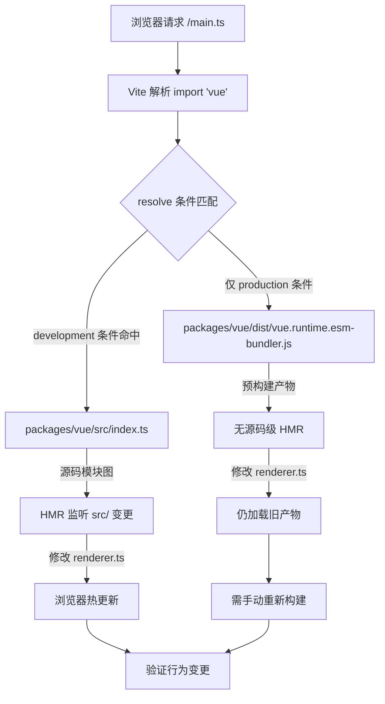

# Capítulo 12: Sandbox de depuración mínimo: vite-debug y el ciclo cerrado de desarrollo local

En el capítulo anterior completamos el ciclo de medición del presupuesto de tamaño: size-report.js responde a «cuánto ha crecido», usage-size.js responde a «dónde ha crecido», y la capa de flujo de trabajo se encarga de la determinación del umbral. Pero este mecanismo tiene una premisa implícita — que el artefacto de compilación en sí sea reproducible. Cuando descubres que el tamaño de algún paquete se ha inflado anormalmente, o que algún comportamiento en tiempo de ejecución no coincide con lo esperado, necesitas un entorno mínimo que pueda cargar rápidamente el código fuente local y ver el efecto inmediatamente después de modificarlo. packages-private/vite-debug es ese entorno. Solo tiene cuatro archivos, con menos de 40 líneas de código en total, pero constituye el punto de entrada de la práctica diaria de «hacer una reproducción mínima sobre el código fuente real» en el repositorio de Vue core. Este capítulo desglosará archivo por archivo la lógica de construcción de este sandbox, y explicará por qué se colocó en packages-private en lugar del directorio packages.

# I. El esqueleto del sandbox:`main.ts`y`App.vue`la cadena de montaje mínima

## Modelo intuitivo

Si comparamos todo el runtime de Vue con un motor, entonces`vite-debug`es un «banco de pruebas desnudo» — sin carcasa, sin panel de instrumentos, solo el cableado mínimo para que el motor arranque. Su valor no radica en la completitud funcional, sino en**eliminar todas las variables de interferencia**: cuando sospechas que un bug está en el sistema de reactividad o dentro del renderizador, no querrás que la complejidad del propio entorno de depuración se convierta en una fuente de ruido.

## Estructura de datos y disposición de archivos

Primero veamos`main.ts`todo el contenido de:

[FACT:packages-private/vite-debug/main.ts:4-4]

```ts
import { createApp } from 'vue'
import App from './App.vue'

const app = createApp(App)

app.mount('#app')
```

Estas seis líneas de código son el paradigma estándar de inicio de una aplicación Vue, pero cada línea tiene un significado de ingeniería preciso en el contexto de depuración:

- **L1**en el`import { createApp } from 'vue'`de`'vue'`, a qué se resuelve finalmente este identificador de módulo depende completamente de las declaraciones de dependencia de`vite.config.ts`y`package.json`. Este es el eslabón más crítico de todo el sandbox — veremos más adelante cómo se apunta al código fuente local.
- **L2**el`import App from './App.vue'`de`@vitejs/plugin-vue`activa la cadena de compilación SFC de`App.vue`: Vite registra este plugin al iniciar el dev server, y cuando el navegador solicita`<script>`、`<template>`、`<style>`, el plugin lo descompone en
- **L4**tres módulos virtuales que se compilan por separado.`createApp(App)`el`app._context`、`app._instance`de
- **L6**crea la instancia de la aplicación; en este momento Vue inicializa internamente`app.mount('#app')`y otros campos principales, pero aún no se ha activado ningún renderizado.`app`el

de`index.html`es el verdadero interruptor de arranque: busca en el DOM el elemento contenedor con id`index.html`, crea la instancia del componente raíz y activa el primer renderizado.`<div id="app"></div>`Nótese que aquí no hay referencia a`<script type="module" src="/main.ts"></script>`— la convención de Vite es que el`app.mount('#app')`en el directorio raíz del proyecto sirva como HTML de entrada, que contiene

## y

. Aunque este archivo no está en los keyFiles de este capítulo, es la premisa para que`App.vue`funcione correctamente.

[FACT:packages-private/vite-debug/App.vue:4-8]

```vue

import { ref } from 'vue'

const count = ref(0)

  {{ count }}

button {
  color: red;
}

```

Ahora veamos**, que es el «vehículo experimental» de este sandbox:**

**Copiar**

`@vitejs/plugin-vue`Situémonos en un escenario concreto:`App.vue`Cuando el usuario hace clic en el botón en el navegador, ¿qué sucede?

- `<script setup>`Primer paso: fase de compilación SFC (al iniciar el dev server)`setup()`compila`ref(0)`en tres partes:`RefImpl`el bloque`.value`se compila en la función`0`。
- `<template>`del componente,`{{ count }}`la llamada devuelve un objeto`_toDisplayString(count.value)`，`@click="count++"`cuyo`onClick: $event => (count.value++)`。
- `<style>`inicialmente es`<style>`el bloque

**se compila en la función de renderizado,`app.mount`se convierte en**

`createApp(App)`se convierte en`mount('#app')`, se crea el componente raíz`ComponentInternalInstance`, se ejecuta`setup()`para obtener`count`el RefImpl de, y luego se llama a la función de renderizado para generar el árbol VNode. En la función de renderizado, leer`count.value`activa`track`la recolección de dependencias: el efecto de renderizado actualmente activo (`ReactiveEffect`) se registra en`count`de`dep`.

**Tercer paso: evento de clic (durante la interacción del usuario)**

El navegador activa el evento`click`, y el manejador de eventos de Vue ejecuta`count.value++`. Esta es una operación setter que activa`trigger`: recorre los efectos recolectados en`count.dep`y programa una nueva renderización. Como es una actualización síncrona y no está en la cola por lotes, el efecto de renderizado se ejecuta inmediatamente, se vuelve a llamar a la función de renderizado, se genera un nuevo VNode, se hace diff con el VNode antiguo, se detecta que el contenido de texto cambió de`0`a`1`, y se actualiza el`textContent`。

del DOM real. Toda la cadena se puede representar con el siguiente diagrama de flujo de datos:

```mermaid
flowchart LR
    subgraph compile["编译期 (Vite Dev Server)"]
        sfc["App.vue"] -->|"@vitejs/plugin-vue"| script["setup() 函数"]
        sfc -->|"@vitejs/plugin-vue"| render["渲染函数"]
        sfc -->|"@vitejs/plugin-vue"| style["CSS 模块"]
    end
    subgraph runtime["运行时 (浏览器)"]
        script -->|"ref(0)"| refimpl["RefImpl { value: 0 }"]
        render -->|"读取 count.value"| track["track() 收集依赖"]
        click["用户点击"] -->|"count.value++"| trigger["trigger() 触发更新"]
        trigger -->|"调度渲染副作用"| rerender["重新执行渲染函数"]
        rerender -->|"diff + patch"| dom["更新真实 DOM"]
    end
    track -.->|"dep 记录 ReactiveEffect"| trigger
```

La clave de este diagrama es:**Los únicos dos puntos de acoplamiento entre los artefactos de tiempo de compilación y el comportamiento en tiempo de ejecución son**——`ref(0)`el objeto RefImpl devuelto, y la lectura/escritura de`count.value`en la función de renderizado. Esto significa que si quieres depurar una rama del sistema de reactividad (por ejemplo,`trigger`la lógica de programación en), solo necesitas construir el patrón de lectura/escritura correspondiente en este`App.vue`.

## Reflexión de diseño: por qué es`ref`y no`reactive`？

> **[Design Inference & Architectural Trade-offs]**
> Elegir`ref(0)`en lugar de`reactive({ count: 0 })`como ejemplo predeterminado implica una consideración de prioridad de depuración:`ref`la ruta de acceso a`.value`de`RefImpl`es más corta; al expandir el objeto`_value`、`dep`、`__v_isRef`en el depurador se pueden ver directamente campos internos como`reactive`, mientras que expandir el objeto Proxy devuelto por

---

# en la consola activa el getter, lo que puede interferir con la observación del estado original. Para escenarios de "reproducción mínima", reducir una capa de indirección Proxy significa menos variables.`vite.config.ts`Dos, resolución de alias:`package.json`y`'vue'`cómo apuntan

## al código fuente local

`vite.config.ts`Modelo intuitivo`import { createApp } from 'vue'`solo tiene seis líneas, pero es el "centro de enrutamiento" de todo el sandbox: determina si el`'vue'`en`App.vue`finalmente carga la versión publicada en npm o el código fuente en desarrollo en el repositorio. Si la configuración de alias no es correcta, el código que modificas en

## puede que ni siquiera active la copia del código fuente de Vue que estás depurando, y la depuración se convierte en "dispararle al objetivo equivocado".

Estructura de datos y cadena de resolución`vite.config.ts`：

[FACT:packages-private/vite-debug/vite.config.ts:4-6]

```ts
import { defineConfig } from 'vite'
import vue from '@vitejs/plugin-vue'

export default defineConfig({
  plugins: [vue()],
})
```

Copiar**Aquí`resolve.alias`no tiene una configuración explícita de**. Entonces, ¿cómo se resuelve`'vue'`al código fuente local? La respuesta está en`package.json`:

[FACT:packages-private/vite-debug/package.json:1-15]

```json
{
  "name": "vite-debug",
  "private": true,
  "type": "module",
  "scripts": {
    "dev": "vite",
    "build": "vite build",
    "serve": "vite preview"
  },
  "devDependencies": {
    "@vitejs/plugin-vue": "catalog:",
    "vite": "catalog:",
    "vue": "workspace:*"
  }
}
```

La clave está en**L13**：`"vue": "workspace:*"`. Esta es la declaración del protocolo pnpm workspace, que indica que`vite-debug`depende del paquete local llamado`vue`en el monorepo, no de la versión en el registro de npm. pnpm creará un enlace simbólico en`node_modules/vue`, apuntando a`packages/vue`(el directorio del paquete principal de Vue).

Pero esto no es suficiente:`packages/vue`el campo`package.json`en`main`/`module`/`exports`de**normalmente apunta a**artefactos de compilación`dist/vue.runtime.esm-bundler.js`(como`src/`), no al código fuente bajo`packages/runtime-core/src/renderer.ts`. Si modificas`dist`, pero no reconstruyes, Vite seguirá cargando el archivo

> **[Design Inference & Architectural Trade-offs]**
> 〔Inferencia de diseño y compensaciones arquitectónicas〕`packages/vue/package.json`Por eso el`"development"`del repositorio Vue core normalmente configura`resolve.conditions`exportaciones condicionales o un mapeo similar de entrada de código fuente; en modo dev, el`development`de Vite priorizará la coincidencia de la condición`src/index.ts`, cargando así`dist`en lugar de`vite-debug`. Este mecanismo permite que

## , sin configurar alias explícitamente, vea los efectos inmediatamente mediante HMR después de modificar el código fuente.`import 'vue'`Walkthrough guiado por escenarios: un proceso de resolución de

Sustituyendo el escenario:**Cuando el servidor de desarrollo de Vite recibe la solicitud del navegador para`main.ts`, al encontrar`import { createApp } from 'vue'`, ¿cómo es la cadena de resolución?**



Este diagrama de flujo revela una rama clave:**Si la condición`development`no está configurada correctamente, después de modificar el código fuente el navegador no se actualizará en caliente**, y caerás en la confusión de "cambié el código pero el comportamiento no cambió". El método de diagnóstico es revisar en el panel Network de DevTools del navegador la ruta de carga real del módulo`vue`; si ves la ruta`dist/`, significa que el mapeo de entrada de código fuente no está funcionando.

## Reflexión de diseño: por qué no escribir alias explícitamente en`vite.config.ts`?

> **[Design Inference & Architectural Trade-offs]**
> Una pregunta natural es: por qué no escribir directamente`vite.config.ts`en`resolve: { alias: { vue: '../../packages/vue/src/index.ts' } }`? Aunque esto es intuitivo, tiene dos problemas:

1. **Rompe las importaciones de subrutas**: la API pública de Vue incluye subrutas como`vue/server-renderer`、`vue/compiler-sfc`. Si solo se alias`'vue'`en sí mismo, las importaciones de subrutas seguirán usando`dist`, lo que hará que algunos módulos provengan del código fuente y otros del artefacto, con comportamiento inconsistente.

2. **Omite el mecanismo de exportaciones condicionales**: el campo`package.json`en`exports`de Vue ya define un mapeo completo de exportaciones condicionales (`development`/`production`/`browser`/`node`, etc.); el alias sobrescribirá este mecanismo, haciendo que el comportamiento de resolución del entorno de depuración se desvíe del entorno real del usuario.

Por lo tanto,`vite-debug`elige la combinación de "confiar en el protocolo workspace + exportaciones condicionales", haciendo que la cadena de resolución se acerque lo más posible al escenario de uso real. Esto también explica por qué`package.json`en`"vue": "workspace:*"`es necesario: es la premisa para activar el enlace simbólico de pnpm y, por lo tanto, permitir que Vite encuentre`node_modules/vue`a través de`packages/vue`.

## Errores en producción:`catalog:`protocolo y deriva de versiones

Observa que`package.json`en**L11-L12**usa el protocolo`"catalog:"`:

```json
"@vitejs/plugin-vue": "catalog:",
"vite": "catalog:",
```

Esta es una característica de catálogo de pnpm, que indica que el número de versión se gestiona de forma unificada mediante el campo`pnpm-workspace.yaml`en`catalog`. Su función es**evitar la deriva de versiones cuando varios paquetes del monorepo referencian la misma dependencia**。

> **[Design Inference & Architectural Trade-offs]**
> En escenarios de depuración, esto trae una trampa oculta: si en`vite-debug`Encontrar un posible bug de Vite o plugin-vue, querer actualizar temporalmente la versión para verificarlo, modificar directamente`package.json`en`catalog:`no es efectivo — necesitas modificar`pnpm-workspace.yaml`la definición del catálogo en, esto afectará a todos los paquetes que usan ese catálogo. La forma correcta es cambiar temporalmente a un número de versión explícito (como`"vite": "5.0.0"`), y después de verificar, volver a cambiar a`catalog:`。

---

# Tres、`packages-private`diseño de aislamiento: por qué el sandbox de depuración no se publica externamente

## Modelo intuitivo

`packages-private`El directorio es como el "laboratorio interno" de la empresa — las muestras dentro no se venden externamente, solo se usan para pruebas y demostraciones. Está físicamente aislado de`packages`directorio, evitando que el código de depuración se publique accidentalmente en npm.

## Tres capas de garantía del mecanismo de aislamiento

**Primera capa: aislamiento de directorio**

`packages-private/vite-debug`no está bajo`packages/`, mientras que`pnpm-workspace.yaml`generalmente declarará`packages/*`y`packages-private/*`ambos como miembros del workspace, pero el script de publicación (como`scripts/release.js`) solo recorrerá los paquetes bajo`packages/`.

**Segunda capa:`private: true`**

[FACT:packages-private/vite-debug/package.json:3]

```json
"private": true,
```

Esta línea es una restricción obligatoria de npm/pnpm: los paquetes marcados como`private`nunca podrán ser**publicados por`npm publish`, incluso si se ejecuta manualmente será rechazado. Esta es la última línea de defensa contra publicaciones accidentales.**Tercera capa: sin

**campo`version`Nota**

no tiene`package.json`campo. La especificación de npm requiere que los paquetes publicables tengan`version`, los paquetes que carecen de este campo reportarán un error al`version`. Esto es "doble seguro" — incluso si`npm publish`se elimina accidentalmente, la falta de`private`seguirá impidiendo la publicación.`version`Reflexión de diseño: división de trabajo entre el sandbox de depuración y Playground

## El repositorio de Vue core ya tiene un

completamente funcional (discutido en el capítulo 7), ¿por qué todavía se necesita`SFC Playground`〔Inferencia de diseño y compensaciones arquitectónicas〕`vite-debug`？

> **[Design Inference & Architectural Trade-offs]**
> Dimensión

| Entorno de ejecución | SFC Playground | vite-debug |
| --- | --- | --- |
| Dentro del navegador (la compilación también en el navegador) | Node.js + navegador | Carga de código fuente |
| A través de CDN o artefactos precompilados | Carga directamente el código fuente local | Capacidad de depuración |
| Limitada por el sandbox del navegador | Puede usar el depurador de Node.js, puntos de interrupción | Modificación del código fuente |
| No soportado | Soporta HMR | Escenarios de aplicación |
| Verificar la salida de compilación, compartir reproducciones | Depurar el comportamiento interno en tiempo de ejecución | El valor central de |

`vite-debug`radica en**que se ejecuta en un entorno real de Node.js**, puedes usar`node --inspect`para adjuntar el depurador, poner puntos de interrupción en`packages/reactivity/src/effect.ts`, observar`ReactiveEffect`el proceso de creación y programación. Esto es algo que Playground no puede proporcionar.

## Problemas en producción: límites de HMR y pérdida de estado

> **[Design Inference & Architectural Trade-offs]**
> Al usar`vite-debug`para depurar, una confusión común es: después de modificar`App.vue`en`count`el valor inicial de`<script setup>`, el contador en el navegador no se restablece. Esto se debe a que el HMR de Vite trata los bloques de**como**preservar el estado del componente, solo reemplazar la función de renderizado`App.vue`. Si necesitas restablecer completamente el estado, necesitas actualizar manualmente la página, o agregar`import.meta.hot?.invalidate()`en

para forzar una actualización completa de la página.`packages/runtime-core/src/`Otra trampa es: cuando modificas el código fuente bajo`vite-debug`, la cadena de propagación de HMR puede no activarse automáticamente — porque el límite de HMR de`App.vue`está definido a nivel de`packages/`, y los cambios en el código fuente bajo`hmr update`necesitan propagarse a través del gráfico de módulos de Vite. Si descubres que el navegador no responde después de modificar el código fuente, verifica si la salida de la terminal de Vite tiene

---

# registros; si no los tiene, puede que necesites reiniciar el dev server.

`packages-private/vite-debug`Resumen del capítulo

1. **`main.ts`**Con cuatro archivos y menos de 40 líneas de código, se construyó un ciclo completo de depuración:`createApp(App).mount('#app')`Proporciona la cadena de montaje mínima:

2. **`App.vue`**, excluyendo toda lógica de inicialización no necesaria.`ref`Como vehículo de experimentación:

3. **`vite.config.ts` + `package.json`**+ interpolación de plantillas + manejo de eventos, cubriendo la ruta principal del sistema reactivo.`workspace:*`A través de`'vue'`protocolo y exportaciones condicionales, resuelve

4. **`packages-private` + `private: true`al código fuente local, logrando "modificar el código fuente y que surta efecto".`version`**+ sin

aislamiento de tres capas, asegurando que el código de depuración no se publique accidentalmente.**La filosofía de ingeniería de este sandbox es:**La complejidad del entorno de depuración en sí misma debe tender a cero, dejando toda la complejidad al código fuente que se está depurando`packages/reactivity`. Cuando encuentras un bug difícil de reproducir en`vite-debug`,

# proporciona una mesa de experimentación que puedes modificar libremente y verificar inmediatamente.

Reflexión y autoevaluación del capítulo`package.json`Q1: Si cambias`"vue": "workspace:*"`en`"vue": "^3.4.0"`a`vite-debug`, después de modificar`packages/reactivity/src/ref.ts`en

**, ¿qué cambios ocurrirán en el comportamiento del navegador? ¿Por qué?**Análisis de referencia`"^3.4.0"`: Después de cambiar a`packages/vue` [FACT:packages-private/vite-debug/package.json:13], pnpm descargará la versión publicada de Vue 3.4.x desde el registro de npm, en lugar de enlazar al`import { createApp } from 'vue'`local. En este momento`node_modules/.pnpm/vue@3.4.x/node_modules/vue/dist/vue.runtime.esm-bundler.js`resuelve a`packages/reactivity/src/ref.ts`, es decir, el artefacto precompilado. Modificar`ref`no activará ningún HMR, porque el gráfico de módulos de Vite simplemente no incluye este archivo. Lo que se ejecuta en el navegador sigue siendo la implementación de`workspace:*`de la versión de npm. Este experimento verifica inversamente que

Q2: `App.vue`es una condición necesaria para la depuración a nivel de código fuente.`<style>`El bloque de`scoped`en`vite-debug`no tiene agregado

**, si en este sandbox se montan dos instancias de componente simultáneamente, ¿qué sucederá con los estilos? ¿Qué relación tiene esto con el objetivo de depuración de**?`scoped`Análisis de referencia`button { color: red }`: Sin[FACT:packages-private/vite-debug/App.vue:4-8],`<button>`es un estilo global`vite-debug`, actuará sobre todos los`scoped`elementos de la página. Si se montan dos instancias de componente, los botones de ambas instancias se volverán rojos. La relación con el objetivo de depuración radica en:`data-v-xxx`La posición de`scoped`es "reproducción mínima", no "verificación de aislamiento de estilos". Omitir`scoped`reduce las variables de inyección de atributos`@vitejs/plugin-vue`en tiempo de compilación, haciendo que la estructura del DOM en el depurador sea más limpia. Si necesitas depurar la lógica de compilación de estilos de

, deberías agregar explícitamente`packages/runtime-core/src/renderer.ts`y observar el código de inyección de atributos generado por`patch`.`console.log`Q3: Supongamos que agregas una línea

**en la función**：

de**, pero la consola del navegador no muestra salida. Enumera al menos tres posibles causas y explica cómo investigarlas una por una.**。`'vue'`Análisis de referencia`dist`Causa uno:`src`. Diagnóstico: en el panel Network de DevTools, revisa la`vue`ruta de carga del módulo; si comienza con`dist/`, significa que la exportación condicional no coincidió con la`development`condición[FACT:packages-private/vite-debug/package.json:13]。

Causa dos:**HMR no se propagó**. El grafo de módulos de Vite no propagó los cambios de`packages/runtime-core/src/renderer.ts`a`vite-debug`. Diagnóstico: revisa si en la terminal de Vite aparece el log`hmr update`; si no aparece, reinicia el dev server.

Causa tres:**`patch`la función no fue llamada**. Si la página actual no dispara ninguna actualización del DOM (por ejemplo, no se hizo clic en ningún botón),`patch`puede ejecutarse solo una vez en el primer montaje, y ese primer montaje ocurrió antes de que agregaras`console.log`. Diagnóstico: recarga la página o agrega en`App.vue`una acción que dispare una actualización.

Causa cuatro (complementaria):**caché de build**. La caché de preconstrucción de dependencias de Vite (`node_modules/.vite`) podría seguir usando la versión antigua. Diagnóstico: elimina`node_modules/.vite`y reinicia.

---

El presupuesto de tamaño te dice «el problema existe»,`vite-debug`te permite «reproducir el problema con tus propias manos». Pero cuando intentas extender este modo sandbox a todo el monorepo, te encuentras con una serie de condiciones límite: diferencias de resolución del protocolo workspace en entornos CI,`catalog:`el dilema de actualización con versiones bloqueadas,`packages-private`y las restricciones de dirección de dependencias entre`packages`y

... El siguiente capítulo entrará en el análisis de compromisos arquitectónicos y la guía para evitar trampas, y sistematizará las condiciones límite que la ingeniería de monorepos expone en proyectos reales.
