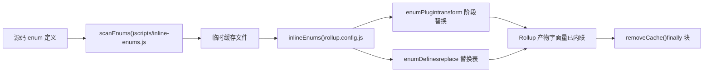
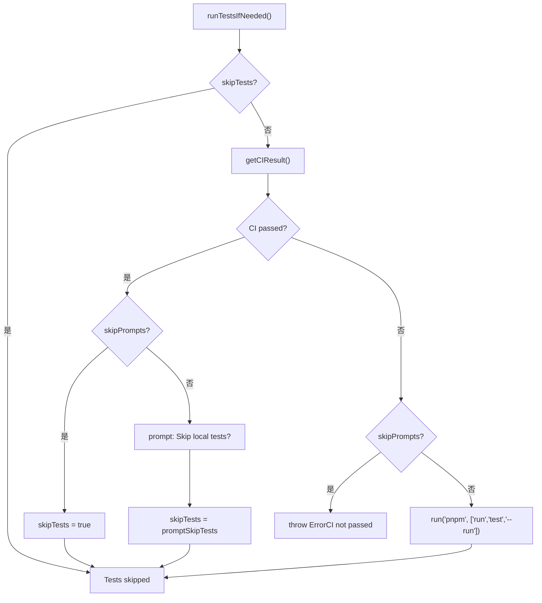

# Capítulo 13: Compromisos arquitectónicos y guía para evitar trampas: condiciones límite de la ingeniería de monorepos

En el capítulo anterior tomamos`packages-private/vite-debug`como punto de entrada y dominamos el paradigma de depuración para hacer reproducciones mínimas sobre código fuente real. Cuando este tipo de paquetes de depuración interna se multiplica, surge un problema práctico: conviven en el mismo workspace con los paquetes formales publicados externamente, ¿cómo garantizar que el flujo de publicación no los dañe por error? Este capítulo profundizará en las condiciones límite de la ingeniería de monorepos, partiendo del contrato de doble directorio entre`packages`y`packages-private`, analizará el diseño defensivo detrás de los compromisos arquitectónicos y ofrecerá una guía práctica para evitar trampas.

# 13.2 Regla temporal inquebrantable: la inserción en línea de enums debe ejecutarse antes que Rollup

## Modelo intuitivo

La inserción en línea de enums es como «cambiar las etiquetas de las piezas por números antes de embalarlas». Si el operario de embalaje (Rollup) ya empezó a empaquetar y luego cambias las etiquetas, las piezas y las etiquetas dentro de la caja ya no coincidirán.`build.js`usa`scanEnums()` / `removeCache()`este par de funciones para encerrar estrictamente la inserción en línea antes de Rollup.

## Estructura de datos y ciclo de vida

`inline-enums.js`exporta`scanEnums()`devuelve un cierre`removeCache`que escanea las definiciones de enum en el código fuente y genera archivos temporales para que Rollup los consuma[FACT:scripts/build.js:30-34]。`build.js`de`run()`usa`try/finally`para garantizar la limpieza de caché[FACT:scripts/build.js:81-112]：

```js
const removeCache = scanEnums()
try {
  // ... buildAll / checkAllSizes / build-dts
} finally {
  removeCache()
}
```

`rollup.config.js`llama en el nivel superior del módulo a`inlineEnums()`para obtener`[enumPlugin, enumDefines]` [FACT:rollup.config.js:47-50], donde`enumPlugin`se inserta en el arreglo plugins[FACT:rollup.config.js:331-331]，`enumDefines`y se incorpora a la tabla de reemplazos del plugin replace[FACT:rollup.config.js:222-223]。

## Paso a paso: ciclo de vida completo de un enum en una compilación

1. `build.js`de`run()`primero llama a`scanEnums()`, escanea las definiciones de enum de todos los paquetes y las escribe en la caché temporal, devuelve`removeCache` [FACT:scripts/build.js:87-87]。

2. `buildAll`e inicia varios procesos de Rollup en paralelo[FACT:scripts/build.js:119-121]。

3. Cada proceso de Rollup ejecuta durante la fase de carga de configuración`inlineEnums()`, lee la caché generada en el paso anterior y obtiene`enumPlugin`y`enumDefines` [FACT:rollup.config.js:47-50]。

4. `enumPlugin`en la fase transform reemplaza las referencias a enum en el código fuente por literales;`enumDefines`como complemento de replace, maneja el reemplazo de constantes entre módulos[FACT:rollup.config.js:222-223]。

5. Al finalizar la compilación,`finally`el bloque llama a`removeCache()`para limpiar los archivos temporales[FACT:scripts/build.js:119-121]。



## Reflexiones de diseño y trampas

> **[Design Inference & Architectural Trade-offs]**
> ¿Por qué no usar un plugin de Rollup para escanear y usar en el momento durante la fase transform? Porque la inserción en línea de enums necesita**una vista global entre paquetes**：`runtime-core`: el enum referenciado puede estar definido en`shared`, y un único proceso de Rollup solo ve el árbol de código fuente de su propio paquete, por lo que no puede completar el reemplazo entre paquetes.`scanEnums()`Establecer una caché global antes de la compilación es precisamente para resolver este problema de visibilidad.

Puntos de trampa en producción:`removeCache()`se coloca en`finally`, lo que significa que se limpiará incluso si la compilación lanza un error a mitad de camino. Pero si interrumpes manualmente el proceso mientras depuras (Ctrl+C),`finally`podría no ejecutarse, y los archivos de caché residuales harán que la siguiente compilación lea enums obsoletos. Método de diagnóstico: revisa si hay archivos de caché de enum residuales en el directorio`temp/`, elimínalos manualmente y vuelve a intentarlo.

---

# 13.3 Orquestador de publicación:`release.js`matriz de flags skip de

## Modelo intuitivo

`release.js`es como el director general de una boda,`skipBuild` / `skipTests` / `skipGit` / `skipPrompts`y los cuatro interruptores son los botones de «saltar ensayo», «saltar juramento», «saltar fotos» y «saltar confirmación». La existencia de cada botón corresponde a un escenario real: el entorno CI necesita`skipPrompts`, la depuración local necesita`skipGit`, el hotfix de emergencia necesita`skipTests`。

## Estructura de datos y valores predeterminados de los flags

Los cuatro flags skip se declaran en`parseArgs`[FACT:scripts/release.js:39-50]y luego se desestructuran en variables locales[FACT:scripts/release.js:64-66]：

```js
let skipTests = args.skipTests
const skipBuild = args.skipBuild
const skipPrompts = args.skipPrompts
const skipGit = args.skipGit
```

Nota:`skipTests`usa`let`declaración, porque está en`runTestsIfNeeded()`será reescrito dinámicamente[FACT:scripts/release.js:281-317]。

## Paso a paso: el flujo completo de decisiones de un release

`main()`el orden de ejecución de[FACT:scripts/release.js:143-279]：

1. **Verificación de sincronización remota**：`isInSyncWithRemote()`Compara el HEAD local con el SHA de la rama remota; si no coinciden, muestra un cuadro de confirmación[FACT:scripts/release.js:337-363]。

2. **Selección de versión**: cuando no hay argumentos posicionales, se muestra`versionIncrements`menú de selección[FACT:scripts/release.js:152-176]。

3. **Decisión de pruebas**：`runTestsIfNeeded()`es donde la lógica de skip es más densa[FACT:scripts/release.js:281-317]。

4. **Actualización de versión**：`updateVersions()`recorre todos los paquetes y reescribe`package.json` [FACT:scripts/release.js:377-398]。

5. **Generación de Changelog**: llama a`pnpm run changelog` [FACT:scripts/release.js:211-212]。

6. **Commit de Git**：`skipGit`si es verdadero, se omite todo el bloque[FACT:scripts/release.js:231-240]。

7. **Publicación**: solo se ejecuta cuando`args.publish`es verdadero`buildPackages()` + `publishPackages()` [FACT:scripts/release.js:243-246]。

`runTestsIfNeeded()`La lógica de ramas de



## Reflexiones de diseño y trampas

> **[Design Inference & Architectural Trade-offs]**
> `skipTests`usa`let`en lugar de`const`de GitHub Actions ya ejecutó las pruebas completas, y volver a ejecutarlas localmente es puro desperdicio.`release.yml`ya ejecutó las pruebas completas, y volver a ejecutarlas localmente es puro desperdicio.

**El contrato oculto del orden de publicación**：`sortPackagesForPublishing`coloca`vue`al final[FACT:scripts/release.js:85-85], y el comentario indica explícitamente que «el usuario no puede instalar el nuevo paquete de entrada antes de que los paquetes internos estén disponibles». Si modificas este orden, el usuario`npm install vue@next`podría obtener una versión cuyas dependencias aún no se han publicado, provocando`ERR_MODULE_NOT_FOUND`。

**Protección de idempotencia**：`publishPackage`llama antes de publicar a`isPackagePublished`para verificar el registry[FACT:scripts/release.js:453-458], y si la publicación falla, captura el error`previously published`y degrada a omitir[FACT:scripts/release.js:480-488]. Esto permite que el script de release se reintente de forma segura: tras una interrupción de red, volver a ejecutarlo no fallará por completo debido a «el paquete ya existe».

**Reversión en caso de fallo**：`fnToRun().catch()`cuando`versionUpdated`es verdadero, llama a`updateVersions(currentVersion)`para revertir el número de versión[FACT:scripts/release.js:528-537]. Pero atención: esto solo revierte`package.json`el campo de versión en**no revierte los commits que ya se`git commit`han hecho**. Si la publicación falla cuando`skipGit`es falso, necesitas hacerlo manualmente`git reset`。

---

# Reflexión de diseño: el patrón común de las tres compensaciones

Si revisamos las tres compensaciones centrales de este capítulo, comparten la misma filosofía de diseño:**convertir «verificaciones en tiempo de ejecución fáciles de olvidar» en «restricciones estructurales imposibles de eludir»**。

- `packages-private`Aislamiento físico: no depende de que el autor del script recuerde verificar el campo`private`, sino que hace que el alcance del escaneo lo excluya de forma natural.
- Inline de enum por adelantado: no depende de que el plugin de Rollup «casualmente» pueda ver el enum entre paquetes durante el transform, sino que establece una caché global antes de la compilación.
- `release.js`: no depende de que el publicador recuerde «si CI ya pasó, no hace falta ejecutar pruebas locales», sino que hace que el script consulte automáticamente el estado de CI y reescriba`skipTests`。

> **[Design Inference & Architectural Trade-offs]**
> El costo de este patrón es**el aumento de la complejidad del script**：`build.js`hay que mantener la lista`privatePackages`,`rollup.config.js`hay que duplicar la lógica de detección de directorios,`release.js`hay que manejar la combinación cruzada de cuatro flags de skip. Pero para un repositorio como Vue que publica varias veces por semana, el beneficio de fiabilidad que aportan las restricciones estructurales supera con creces el costo de complejidad.

---

# Resumen del capítulo

Este capítulo, partiendo del código fuente, desglosa tres condiciones límite clave del sistema de ingeniería de Vue core:

1. **`packages-private`y`packages`el aislamiento físico de**garantizado conjuntamente por el glob del workspace,`build.js`la detección de directorios,`release.js`y el filtrado de[FACT:pnpm-workspace.yaml:1-3][FACT:scripts/build.js:153-170][FACT:scripts/release.js:68-83]。

2. **la restricción temporal del inline de enum**garantizada obligatoriamente por`scanEnums()` / `removeCache()`la estructura`try/finally`, y la configuración de Rollup consume la caché en el nivel superior del módulo[FACT:scripts/build.js:81-112][FACT:rollup.config.js:47-50]。

3. **`release.js`la matriz de flags de skip de**sirve a tres escenarios: publicación por CI, depuración local y hotfix urgente,`skipTests`y el orden de publicación son los dos contratos ocultos más fáciles de pasar por alto[FACT:scripts/release.js:281-317][FACT:scripts/release.js:85-85]。

# Reflexión y autoevaluación de este capítulo

Q1: Si en`build.js`se elimina la comprobación`build(target)`dentro de la función`privatePackages.includes(target)`y se usa uniformemente`packages`como`pkgBase`, ¿en qué escenarios habría problemas?

**Análisis de referencia**：`build.js:160-164`es la única entrada por la que un paquete privado puede compilarse. Si se elimina,`nr build vite-debug`buscará`packages/vite-debug`bajo`package.json`, pero ese directorio no existe,`fs.readFileSync`lanzará directamente`ENOENT`. El problema más oculto es: si en el futuro alguien crea un directorio con el mismo nombre bajo`packages/`, la compilación usará silenciosamente la configuración del directorio equivocado, y tanto la ruta del artefacto como`buildOptions`quedarán completamente desalineadas. Además,`rollup.config.js:37-42`tiene una lógica de detección de directorios independiente, y ambos lugares deben modificarse en sincronía; de lo contrario, aparecerá el estado inconsistente de «`build.js`encontró el paquete pero Rollup no puede encontrarlo».

Q2: `release.js`En`runTestsIfNeeded()`de`skipTests ||= isCIPassed`la línea de código`release.js:285`) cuando`skipPrompts`es verdadero y CI no ha pasado, ¿qué rama tomará? Si se elimina`else if (skipPrompts)`de la rama`throw`, ¿qué consecuencias habría?

**Análisis de referencia**: cuando`skipPrompts`es verdadero y CI no ha pasado,`skipTests ||= isCIPassed`en`isCIPassed`es`false`，`skipTests`mantiene el valor original (normalmente`false`). Luego entra en la rama`else if (skipPrompts)`y lanza`Error`（`release.js:299-304`). Si se elimina este`throw`, el código continuará ejecutándose hasta la rama`if (!skipTests)`y ejecutará`pnpm run test --run`en un entorno sin interacción. En CI, esto puede hacer que las pruebas fallen por diferencias de entorno o, peor aún, que las pruebas pasen pero CI en realidad no haya pasado (por ejemplo, si CI ejecuta un subconjunto diferente de pruebas), publicando una versión sin validación completa.

Q3: `rollup.config.js:55`El`inlineEnums()`se llama en el nivel superior del módulo, mientras que`build.js:87`el`scanEnums()`se llama dentro de la función`run()`. Si se intercambia el momento de ejecución de ambos (es decir, hacer que`inlineEnums()`se llame en el hook`buildStart`de Rollup), ¿qué se rompería?

**Análisis de referencia**：`scanEnums()`debe completarse antes de que se inicien todos los procesos de Rollup, porque necesita escanear**todos los paquetes**el código fuente de todos los paquetes para establecer la caché global de enum.`inlineEnums()`se llama en el nivel superior del módulo`rollup.config.js`, cuando Rollup aún no ha comenzado ninguna compilación y la caché ya está lista. Si se cambiara para llamarse en`buildStart`, cada proceso de Rollup escanearía de forma independiente, pero`buildAll`se ejecuta de forma concurrente (`build.js:119-121`), y múltiples procesos escaneando simultáneamente el mismo lote de archivos producirían una condición de carrera: el proceso A podría leer un archivo de caché que el proceso B aún no ha terminado de escribir, provocando un reemplazo de enum incompleto. Más grave aún,`scanEnums()`el`removeCache`depende del estado de los descriptores de archivo en el momento del escaneo, y en escenarios concurrentes el momento de limpieza no puede coordinarse.

Contrato de doble directorio, determinación de pertenencia de scripts de compilación, filtrado secundario de scripts de publicación: estos mecanismos delimitan conjuntamente la frontera de seguridad de la ingenierización del monorepo. Pero la frontera no es inmutable: a medida que las herramientas de compilación migran de Rollup a Rolldown y las pruebas de tipos y las pruebas en tiempo de ejecución convergen, las estrategias de equilibrio actuales también enfrentarán nuevos desafíos. En el próximo capítulo, basándonos en la trayectoria de cambios de 3.0 a 3.4, proyectaremos la dirección de evolución del sistema de ingenierización de próxima generación.
