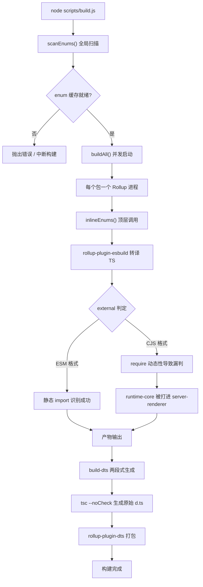
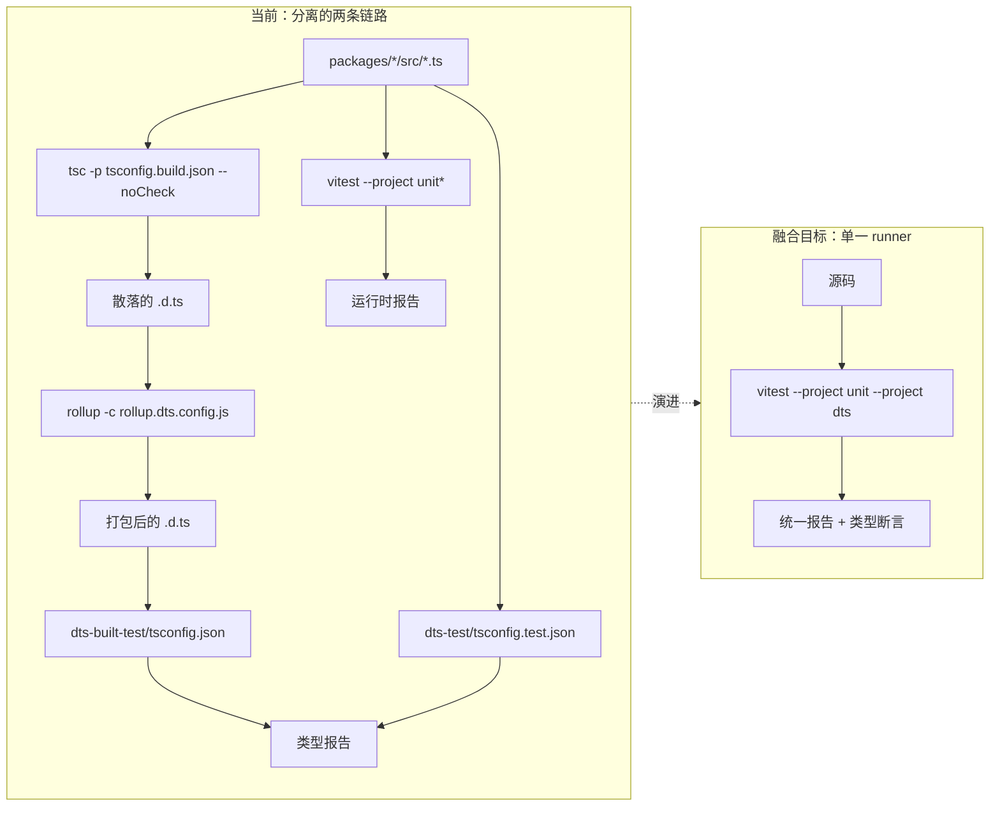
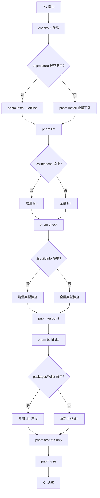

# Capítulo 14: Evolución futura: de 3.x al sistema de ingenierización de próxima generación

En el capítulo anterior revisamos la «frontera de seguridad» del sistema de ingenierización de Vue core: contrato de doble directorio, determinación de pertenencia de scripts de compilación, filtrado secundario de scripts de publicación. Estos mecanismos no fueron un diseño único, sino que se pulieron repetidamente durante las iteraciones de 3.0 a 3.4. Este capítulo adopta otra perspectiva: ya no observamos «cómo se ve ahora», sino «cómo llegó a verse así», y a partir de ello inferimos hacia dónde irá el sistema de ingenierización de próxima generación. El material fuente de este capítulo son changelogs/CHANGELOG-3.3.md, changelogs/CHANGELOG-3.4.md y el package.json en la raíz del repositorio. Los registros de cambios parecen solo una lista de «qué bugs se corrigieron», pero son el informe médico más auténtico del sistema de ingenierización: cada commit con prefijo build:, cada cambio con prefijo types:, cada reversión de versión de dependencia, exponen los puntos de tensión de la arquitectura actual. Lo que debemos hacer es leer la dirección de evolución a partir de estos puntos de tensión. Tratar los registros de cambios como una «ventana de observación del sistema de ingenierización» en lugar de una «lista de funcionalidades» es la metodología central de este capítulo. Los cambios funcionales nos dicen qué puede hacer Vue, mientras que los cambios relacionados con compilación, tipos y CI nos dicen «dónde le duele» al sistema de ingenierización de Vue.

# I. Puntos de tensión de la cadena de herramientas de compilación: la energía de migración de Rollup a Rolldown

## Modelo intuitivo

Imagina la cadena de herramientas de compilación como una línea de ensamblaje: Rollup es la mesa de ensamblaje principal, esbuild se encarga del corte rápido (transpilación de TS), terser se encarga del empaquetado y compresión final. A medida que el producto (el runtime de Vue) se vuelve más complejo y los procesos en la mesa de ensamblaje aumentan, la mesa de ensamblaje principal se convierte en el cuello de botella. El posicionamiento de Rolldown es reescribir la mesa de ensamblaje principal en Rust: no reemplaza a esbuild, sino a Rollup mismo.

Sin esta presión evolutiva, el «desastre» que enfrenta el sistema no es un colapso, sino**el tiempo de compilación que se expande linealmente con el número de paquetes**: por cada subpaquete añadido, hay que iniciar un proceso Rollup más, escanear una vez más la caché de enum, ejecutar una ronda más de generación de dts.

## Estructuras de datos y disposición de dependencias

Primero veamos una instantánea estática de la cadena de herramientas actual.`package.json`El`devDependencies`de  es una «lista de mesas de ensamblaje» precisa:

[FACT:package.json:103-106]

```
    "rollup": "^4.63.3",
    "rollup-plugin-dts": "^6.5.1",
    "rollup-plugin-esbuild": "^6.2.1",
    "rollup-plugin-polyfill-node": "^0.13.0",
```

Aquí se pueden leer tres hechos clave. Primero, la versión principal de Rollup es`^4.63.3`, en la fase madura de Rollup 4.x. Segundo,`rollup-plugin-esbuild`se encarga de la transpilación de TS, lo que significa que Rollup en sí no analiza TS, solo procesa el JS que esbuild emite. Tercero,`rollup-plugin-dts`se encarga de forma independiente del empaquetado de`.d.ts`, que es precisamente la base material de la independencia de`dts-built-test`discutida en el capítulo anterior.

Ahora veamos la orquestación de entrada de los scripts de compilación:

[FACT:package.json:8-9]

```
    "build": "node scripts/build.js",
    "build-dts": "tsc -p tsconfig.build.json --noCheck && rollup -c rollup.dts.config.js",
```

`build-dts`es «de dos etapas»: primero`tsc --noCheck`genera los archivos de declaración originales (`--noCheck`omite la verificación de tipos, solo hace emit), luego`rollup -c rollup.dts.config.js`empaqueta los`.d.ts`dispersos en un solo archivo. Este diseño en sí depende de las capacidades de Rollup:`rollup-plugin-dts`necesita el grafo de módulos de Rollup para rastrear dependencias de tipos.

## Impulsado por escenarios: qué expuso un commit de`build:`

Las entradas con prefijo`build:`en los registros de cambios son evidencia directa de los puntos de tensión de la cadena de herramientas de compilación. Elijamos tres para examinar.

La primera, la alineación de configuración de minify en 3.4.32:

[FACT:changelogs/CHANGELOG-3.4.md:84]

```
* **build:** use consistent minify options from previous terser config ([789675f](https://github.com/vuejs/core/commit/789675f65d2b72cf979ba6a29bd323f716154a4b))
```

La motivación de este commit es «tras migrar de terser a esbuild minify, las opciones de compresión son inconsistentes». Revela un estado intermedio en la migración: Vue solía usar terser para la compresión, luego cambió a esbuild (el`devDependencies`en`esbuild: ^0.28.2`lo confirma), pero las opciones de compresión no se alinearon completamente, causando desviaciones en el tamaño o comportamiento del artefacto. Este es precisamente el costo típico de «cambiar piezas de la mesa de ensamblaje».

La segunda, la reversión de versión de entities en 3.4.38:

[FACT:changelogs/CHANGELOG-3.4.md:6]

```
* **build:** revert entities to 4.5 to avoid runtime resolution errors ([f349af7](https://github.com/vuejs/core/commit/f349af7b65b9f8605d8b7bafcc06c25ab1f2daf0)), closes [#11603](https://github.com/vuejs/core/issues/11603)
```

`entities`es una biblioteca de decodificación de entidades HTML, de la que depende`compiler-dom`. Se revirtió a 4.5 porque la nueva versión presentaba problemas en el análisis en tiempo de ejecución. Este commit demuestra:**la actualización de dependencias de la cadena de herramientas de compilación no es aislada; el salto de versión de una dependencia indirecta puede penetrar hasta el comportamiento en tiempo de ejecución**。

La tercera, la contaminación de la compilación cjs de server-renderer en 3.4.29:

[FACT:changelogs/CHANGELOG-3.4.md:155]

```
* **build:** fix accidental inclusion of runtime-core in server-renderer cjs build ([11cc12b](https://github.com/vuejs/core/commit/11cc12b915edfe0e4d3175e57464f73bc2c1cb04)), closes [#11137](https://github.com/vuejs/core/issues/11137)
```

Este es el tipo más típico de bug de compilación: en formato CJS,`server-renderer`incluyó accidentalmente`runtime-core`en su propio artefacto. La causa suele ser que la determinación de`external`de Rollup falla en formato CJS: ESM puede identificar estáticamente dependencias externas mediante sentencias`import`, mientras que el CJS de`require`Más dinámico, propenso a pasar por alto fallos. Este commit apunta directamente a la fragilidad de la lógica en la configuración de Rollup.`external`fragilidad de la lógica.

## Representación Mermaid del potencial de migración

La siguiente imagen describe el flujo de control del pipeline de construcción actual y señala los nodos que la migración a Rolldown tocará:



> **[Design Inference & Architectural Trade-offs]**
> El valor de la migración a Rolldown radica en que reemplaza el modelo de concurrencia de "un proceso por paquete" por un modelo de "paralelismo dentro de un solo proceso",`scanEnums()`el escaneo global de y el reemplazo de`inlineEnums()`pueden coordinarse dentro del mismo runtime de Rust, y el problema de "condición de carrera en el escaneo concurrente" discutido en el capítulo anterior desaparecerá de raíz. Pero la resistencia a la migración también está aquí——`rollup-plugin-esbuild`、`rollup-plugin-dts`estos ecosistemas de plugins necesitan que Rolldown proporcione una capa de compatibilidad, y la lógica de determinación de`external`necesita ser reescrita.

## Reflexiones de diseño y trampas encontradas

**¿Por qué la migración no se logrará de la noche a la mañana?**Observa el campo`package.json`de`engines`:

[FACT:package.json:61-63]

```
  "engines": {
    "node": ">=20.0.0"
  },
```

Node 20 es el límite inferior obligatorio. Rolldown, como módulo nativo de Rust, requiere los enlaces N-API correspondientes y distribución de binarios precompilados. Una vez introducido,`pnpm install`el tiempo de ejecución, la compatibilidad de binarios multiplataforma (Windows/macOS/Linux) y la estrategia de caché de CI deben rediseñarse. Esto no es tan simple como "cambiar una dependencia", sino**una recalibración completa de toda la cadena de instalación-construcción-caché**。

**Puntos problemáticos en producción**：`build-dts`El`tsc --noCheck`de es un arma de doble filo. Omitir la verificación de tipos acelera la emisión, pero significa que los errores de tipo no se detectarán en la fase de generación de`.d.ts`——los errores de tipo solo pueden ser cubiertos por`pnpm check`（`tsc --incremental --noEmit`) y`test-dts`. Si después de la migración a Rolldown se quieren fusionar estos dos pasos, hay que asegurarse de que la verificación de tipos no ralentice la construcción, de lo contrario se traiciona el propósito original de`--noCheck`.

---

# II. Tendencia de fusión entre pruebas de tipos y pruebas en tiempo de ejecución

## Modelo intuitivo

Imagina las pruebas de tipos y las pruebas en tiempo de ejecución como dos controles de calidad independientes: uno verifica si "el manual (`.d.ts`) está bien escrito", y el otro verifica si "la máquina (el runtime) gira correctamente". Cada control tiene su propio puesto de trabajo, sus propias herramientas y sus propios informes. La tendencia de fusión significa:**¿se puede hacer que el mismo caso de prueba verifique simultáneamente el manual y la máquina?**

Sin la fusión, el desastre que enfrenta el sistema es**deriva entre tipos y comportamiento en tiempo de ejecución**：`.d.ts`dice que`ref()`devuelve`Ref<T>`, pero la forma del objeto que realmente devuelve el runtime ha cambiado; la prueba de tipos pasa, la prueba en tiempo de ejecución también pasa, pero la combinación de ambas es incorrecta.

## Estructura de datos: disposición de la orquestación de scripts de prueba

`package.json`En el`scripts`de , las entradas relacionadas con pruebas se dividen claramente en dos grupos:

[FACT:package.json:19-24]

```
    "test": "vitest",
    "test-unit": "vitest --project unit*",
    "test-e2e": "node scripts/build.js vue -f global -d && vitest --project e2e --project e2e-browser",
    "test-dts": "run-s build-dts test-dts-only",
    "test-dts-only": "tsc -p packages-private/dts-built-test/tsconfig.json && tsc -p ./packages-private/dts-test/tsconfig.test.json",
    "test-coverage": "vitest run --project unit* --coverage",
```

La estructura clave aquí es el`test-dts`de`run-s build-dts test-dts-only`——es**serial**: primero se construye`.d.ts`, luego se ejecutan las pruebas de tipos. Y dentro de`test-dts-only`hay a su vez**dos procesos`tsc`independientes**: uno ejecuta`dts-built-test`(verifica los artefactos de construcción), y otro ejecuta`dts-test`(verifica los tipos del código fuente).

Nota que`test-unit`usa`vitest --project unit*`，`test-e2e`usa`vitest --project e2e --project e2e-browser`. Esto indica que el mecanismo`--project`de Vitest ya ha dividido las pruebas en diferentes proyectos según "unidad/end-to-end/navegador".**La base física para la fusión ya existe**: el mecanismo de proyectos de Vitest permite ejecutar diferentes tipos de pruebas en el mismo runner.

## Impulsado por escenarios: la ruta completa de un commit de`types:`En el changelog, la densidad de entradas con el prefijo

es extremadamente alta, lo cual es un reflejo directo de la complejidad del sistema de tipos. Rastreemos una típica corrección de tipos.`types:`Reversión de tipos de ref en 3.4.37:

Copiar

[FACT:changelogs/CHANGELOG-3.4.md:23-24]

```
* Revert "fix(types/ref): allow getter and setter types to be unrelated ([#11442](https://github.com/vuejs/core/issues/11442))" ([b1abac0](https://github.com/vuejs/core/commit/b1abac06cdb198bd72f8e614b1f68b92e1c78339))
* Revert "fix(types/ref): correct type inference for nested refs ([#11536](https://github.com/vuejs/core/issues/11536))" ([3a56315](https://github.com/vuejs/core/commit/3a56315f94bc0e11cfbb288b65482ea8fc3a39b4))
```

Copiar

[FACT:changelogs/CHANGELOG-3.4.md:55]

```
* **types/ref:** allow getter and setter types to be unrelated ([#11442](https://github.com/vuejs/core/issues/11442)) ([e0b2975](https://github.com/vuejs/core/commit/e0b2975ef65ae6a0be0aa0a0df43fb887c665251))
```

[FACT:changelogs/CHANGELOG-3.4.md:30]

```
* **types/ref:** correct type inference for nested refs ([#11536](https://github.com/vuejs/core/issues/11536)) ([536f623](https://github.com/vuejs/core/commit/536f62332c455ba82ef2979ba634b831f91928ba)), closes [#11532](https://github.com/vuejs/core/issues/11532) [#11537](https://github.com/vuejs/core/issues/11537)
```

las pruebas de tipos pueden verificar que "la firma de tipo cumple lo esperado", pero no pueden verificar "si esta firma de tipo es realmente útil en código real".**En las pruebas de tipos puede pasar completamente, pero en uso real hará que la inferencia de tipos de**。`allow getter and setter types to be unrelated`sea demasiado laxa, rompiendo la seguridad de tipos del código downstream.`ref`Representación Mermaid de la fusión de pruebas de tipos

## La siguiente imagen describe la estructura actual de separación entre pruebas de tipos y pruebas en tiempo de ejecución, así como la forma objetivo tras la fusión:

Copiar



> **[Design Inference & Architectural Trade-offs]**
> y`dts-built-test`de`dts-test`como un proyecto personalizado de Vitest, permitiendo que las aserciones de tipos se integren en forma de`tsc`dentro de los archivos de prueba. Así, una sola llamada a`expectTypeOf`puede ejecutar simultáneamente aserciones en tiempo de ejecución y aserciones de tipos, con informes unificados. Pero la resistencia está en que:`vitest`la verificación de tipos de`tsc`es "global", mientras que las pruebas de Vitest son "por archivo", y las estrategias de incrementalidad de ambas son incompatibles.

## Reflexiones de diseño y trampas encontradas

**¿Por qué`dts-built-test`debe ser independiente de`dts-test`？**Ya se discutió en el capítulo anterior; aquí se complementa desde la perspectiva evolutiva:`dts-built-test`verifica los**artefactos de construcción**（`rollup-plugin-dts`empaquetados`.d.ts`），`dts-test`verifica los**tipos del código fuente**. Si al fusionar se combinan ambos, se perderá el punto de verificación clave de "si los artefactos de construcción son consistentes con los tipos del código fuente". Este commit de 3.4.38 confirma precisamente la importancia de los tipos de los artefactos de construcción:

[FACT:changelogs/CHANGELOG-3.4.md:9]

```
* **types:** add fallback stub for DOM types when DOM lib is absent ([#11598](https://github.com/vuejs/core/issues/11598)) ([4db0085](https://github.com/vuejs/core/commit/4db0085de316e1b773f474597915f9071d6ae6c6))
```

"Proporcionar un stub de fallback cuando falta la lib DOM"——esta es una corrección de compatibilidad de tipos a nivel de artefactos de construcción, que solo puede descubrirse en escenarios como`dts-built-test`donde se "consume el`.d.ts`empaquetado".

**Puntos problemáticos en producción**: el ciclo de "integración-reversión" de las pruebas de tipos indica que los cambios en las firmas de tipos requieren validación de**proyectos downstream reales**, no solo aserciones de tipos. Las pruebas de tipos de Vue se ejecutan en`packages-private/dts-test`, se utilizan casos de prueba internos del repositorio, que no cubren todos los usos downstream. Si la tendencia de fusión solo se centra en «fusionar dos runners», sin resolver «cómo introducir retroalimentación real de downstream», es solo una fusión formal.

---

# III. Direcciones de optimización de granularidad fina para la caché de CI

## Modelo intuitivo

Imagina la caché de CI como el «área de preparación de materiales» de un almacén: cada compilación necesita tomar materias primas (dependencias, artefactos de compilación, caché de tipos) del área de preparación. Si el área de preparación solo tiene una caja grande, y para tomar cualquier cosa hay que rebuscar en toda la caja, entonces por muy alta que sea la tasa de aciertos de caché, no será rápida. La optimización de granularidad fina significa:**Dividir la caja grande en compartimentos pequeños clasificados por uso**。

Sin caché de granularidad fina, el desastre que enfrenta el sistema es**Amplificación en cascada de la invalidación de caché**: modificar una línea de código fuente provoca que toda la caché de`node_modules`se invalide, CI reinstala todas las dependencias y el tiempo de compilación pasa de 2 minutos a 10 minutos.

## Estructura de datos: clasificación de elementos cacheables

A partir de`package.json`se pueden identificar varias categorías de «materiales» cacheables:

Primera categoría, productos de instalación de dependencias.`packageManager`El campo fija la versión de pnpm:

[FACT:package.json:4]

```
  "packageManager": "pnpm@12.4.2",
```

El`node_modules`de pnpm es una estructura de enlaces simbólicos; lo que se cachea es el content-addressable store de pnpm, no un`node_modules`plano. Esto significa que la clave de caché debe basarse en el hash de`pnpm-lock.yaml`, no en`package.json`。

Segunda categoría, artefactos de compilación.`clean`El script revela la ubicación física de los artefactos:

[FACT:package.json:10]

```
    "clean": "rimraf --glob packages/*/dist temp .eslintcache",
```

`packages/*/dist`、`temp`、`.eslintcache`——estas tres categorías de artefactos pueden cachearse de forma independiente.`dist`es la salida de compilación,`temp`son archivos temporales (como`bench.json`），`.eslintcache`es la caché de lint.

Tercera categoría, caché de verificación de tipos.`check`El script utiliza`--incremental`：

[FACT:package.json:15]

```
    "check": "tsc --incremental --noEmit",
```

`--incremental`genera el archivo`.tsbuildinfo`, que es la caché incremental de la verificación de tipos. Si en CI se cachea este archivo,`tsc`la segunda ejecución de

## será mucho más rápida.

Impulsado por escenarios: flujo de ejecución de CI de un PR`packages/reactivity/src/ref.ts`Situémonos en un escenario típico: el desarrollador modifica

y envía un PR. ¿Qué pasos debe ejecutar CI y cuáles pueden acertar en la caché?`scripts`A partir de`simple-git-hooks`se puede inferir la secuencia de ejecución de CI (el`pre-commit`de

[FACT:package.json:48-51]

```
  "simple-git-hooks": {
    "pre-commit": "pnpm lint-staged && pnpm check",
    "commit-msg": "node scripts/verify-commit.js"
  },
```

Copiar`pre-commit`El`lint-staged`local ejecuta`check`y`lint`、`check`、`test-unit`、`test-dts`、`size`. En CI se ejecutarán

- `lint`, etc. La estrategia de caché de cada paso es diferente:`.eslintcache`: cachear
- `check`, clave basada en el hash de los archivos fuente.`.tsbuildinfo`: cachear`tsconfig`, clave basada en
- `test-unit`y el hash del código fuente.
- `test-dts`: Vitest tiene su propia caché, pero normalmente en CI no se cachean los resultados de las pruebas, solo las dependencias.`build-dts`: depende de los artefactos de`packages/*/dist`, clave de caché basada en el hash de
- `size`: depende de los artefactos de compilación, clave de caché igual que arriba.

## Representación Mermaid de la optimización de caché de CI



> **[Design Inference & Architectural Trade-offs]**
> La contradicción central de la caché de granularidad fina es**la granularidad de la clave de caché**: si la clave es demasiado gruesa (por ejemplo, basada solo en el commit hash), la tasa de aciertos es baja; si la clave es demasiado fina (por ejemplo, basada en el hash de cada archivo), el costo de calcular la clave anula el beneficio de la caché. La estrategia razonable para un monorepo como Vue es «fragmentar por paquete»: cada`packages/*`subpaquete cachea de forma independiente`dist`，`reactivity`; los cambios en`compiler-core`no invalidan la caché de`dist`de

## Reflexiones de diseño y errores comunes

**¿Por qué el script`size`debe dividirse en múltiples subcomandos?**Observa estas tres líneas:

[FACT:package.json:11-14]

```
    "size": "run-s \"size-*\" && node scripts/usage-size.js",
    "size-global": "node scripts/build.js vue runtime-dom -f global -p --size",
    "size-esm-runtime": "node scripts/build.js vue -f esm-bundler-runtime",
    "size-esm": "node scripts/build.js runtime-dom runtime-core reactivity shared -f esm-bundler",
```

`size`utiliza`run-s "size-*"`para ejecutar en serie todos los subcomandos con el prefijo`size-`. Este patrón de «agregación por prefijo» permite que cada dimensión de tamaño (global, esm-runtime, esm) se cachee y falle de forma independiente. Si se fusionaran en un solo comando grande, cualquier dimensión que exceda el límite haría fallar todo el`size`, sin poder localizar qué dimensión tiene el problema.

**Puntos problemáticos en producción**: el error más fácil de cometer en la caché de CI es**la contaminación de caché**——cachear artefactos incorrectos, lo que provoca que compilaciones posteriores se basen en datos sucios.`clean`El script

[FACT:package.json:10]

```
    "clean": "rimraf --glob packages/*/dist temp .eslintcache",
```

Copiar`packages/*/dist`Observa que lo que limpia es`packages-private/*/dist`, no`packages-private`. Esto significa que los artefactos de`packages-private`no están dentro del alcance de limpieza habitual——si CI cachea los artefactos de`clean`y`packages-private`no los limpia, puede aparecer el problema de «tener cacheados artefactos de una versión antigua del playground». Al diseñar la caché de granularidad fina, hay que tratar

---

# por separado.

Reflexión de diseño: el sistema de ingeniería como ciclo de vida del producto**Al enlazar los hilos de las tres secciones, se puede ver una línea principal clara:**。

El sistema de ingeniería de Vue está pasando de «funcionar» a «ser fácil de usar», de «orquestación manual» a «configuración declarativa»

La migración de la cadena de herramientas de compilación (Rollup → Rolldown) es una evolución «impulsada por el rendimiento»: cuando el número de paquetes crece hasta cierto punto, el costo de la concurrencia a nivel de proceso supera el beneficio y hay que cambiar a un modelo de concurrencia más ligero.

La fusión de las pruebas de tipos es una evolución «impulsada por la consistencia»: cuando la frecuencia de cambios en las firmas de tipos supera la frecuencia de cambios en el comportamiento en tiempo de ejecución, dos conjuntos separados de pruebas se convierten en una carga y hay que hacer que compartan los mismos casos de uso.

> **[Design Inference & Architectural Trade-offs]**
> 〔Inferencia de diseño y compensaciones arquitectónicas〕**La restricción común de estas tres líneas de evolución es**la compatibilidad hacia atrás`BREAKING CHANGES`. La estrategia de publicación de Vue (visible en la sección

---

# del changelog) permite hacer «type-only breaking change» en versiones minor, pero no permite breaking changes en tiempo de ejecución. Esto significa que la evolución del sistema de ingeniería debe garantizar que: sin importar cómo cambie la cadena de herramientas interna, la API pública y el comportamiento en tiempo de ejecución de los artefactos no pueden cambiar. Esta es la frontera dura de todas las decisiones de evolución.

Resumen del capítulo`package.json`Este capítulo, partiendo del changelog y de

1. **, ha ordenado las tres líneas de evolución del sistema de ingeniería de Vue core:**: La combinación actual de Rollup 4.x + esbuild + rollup-plugin-dts tiene sus puntos de tensión reflejados en`build:`commits con el prefijo (alineación de configuración de minify, reversión de versión de entities, omisión de detección de CJS external). El potencial de la migración a Rolldown proviene del reemplazo de «concurrencia multiproceso» por «paralelismo monoproceso», mientras que la resistencia proviene del ecosistema de plugins y la distribución de binarios multiplataforma.

2. **Fusión de pruebas de tipos**：`test-dts`de`run-s build-dts test-dts-only`estructura serial, así como`dts-built-test`y`dts-test`el doble`tsc`proceso, son evidencia física de la forma de separación actual. La ruta técnica de fusión es aprovechar el mecanismo de`--project`de Vitest, la resistencia es que la verificación completa de`tsc`es incompatible con la estrategia incremental de pruebas por archivo de Vitest.

3. **Granularización de caché de CI**：`packageManager`fijar pnpm,`clean`limpiar tres tipos de artefactos,`check`usar`--incremental`、`size`agregar por prefijo — todos estos son criterios de clasificación para elementos cacheables. La contradicción central es la granularidad de las claves de caché, la estrategia razonable es «fragmentar por paquete».

El cambio cognitivo más importante es:**el sistema de ingeniería en sí mismo es un producto, tiene sus propios usuarios (contribuidores), sus propias métricas de rendimiento (tiempo de compilación, minutos de CI), sus propias restricciones de compatibilidad (API de artefactos sin cambios)**. Necesita iteración continua, no un diseño único.

# Reflexiones y autoevaluación de este capítulo

Q1: `package.json:9`de`build-dts`usó`tsc -p tsconfig.build.json --noCheck`. Si se elimina`--noCheck`, ¿qué reacciones en cadena traería tras la migración a Rolldown?

**Análisis de referencia**：`--noCheck`La función de es omitir la verificación de tipos y solo hacer emit. Tras eliminarlo,`tsc`hará una verificación completa de tipos antes de generar`.d.ts`. Bajo la arquitectura actual de Rollup, esto solo hace que`build-dts`sea más lento; pero tras la migración a Rolldown, el problema se amplifica: el punto de venta central de Rolldown es «compilación paralela monoproceso», si la fase de`build-dts`introduce una verificación completa de`tsc`, se convierte en el cuello de botella serial de toda la cadena de producción — la compilación de todos los paquetes debe esperar a que esta verificación termine. Más grave aún, la verificación de tipos de`tsc`es monohilo, no puede aprovechar la capacidad paralela de Rolldown. La práctica correcta es mantener`--noCheck`, delegar la verificación de tipos a`pnpm check`（`package.json:15`) y`test-dts`（`package.json:22`) independientes, desacoplando compilación y verificación.

Q2: El changelog 3.4.37 revirtió consecutivamente dos correcciones de`types/ref`(`CHANGELOG-3.4.md:23-24`), y estas dos correcciones se acababan de integrar en 3.4.35 (`CHANGELOG-3.4.md:30,55`). Si las pruebas de tipos y las pruebas de tiempo de ejecución ya se hubieran fusionado, ¿se podría evitar este ciclo de «integración-reversión»? ¿Por qué?

**Análisis de referencia**: No se puede evitar por completo, pero sí acortar el ciclo. Las pruebas de tipos fusionadas aún solo pueden verificar que «la firma de tipos cumple con las aserciones», mientras que el problema de correcciones como`allow getter and setter types to be unrelated`radica en que «la firma de tipos es demasiado permisiva, rompe la seguridad de tipos del código downstream» — esto es un problema de**uso downstream**, no de**la firma en sí**. Donde la fusión puede acortar el ciclo es en que: si las aserciones de tipos y las aserciones de tiempo de ejecución se escriben en el mismo archivo de prueba, los desarrolladores pueden detectar más rápido la inconsistencia de «la firma de tipos cambió pero el comportamiento en tiempo de ejecución no». Pero para evitar realmente las reversiones, se necesita introducir verificación de tipos de proyectos downstream reales (por ejemplo, extender`packages-private/dts-test`a un conjunto de pruebas que «simule el uso downstream»), lo cual excede el ámbito de la simple «fusión de runners».

Q3: `package.json:10`de`clean`script limpia`packages/*/dist`, pero no limpia`packages-private/*/dist`. Si CI adopta una estrategia de caché de granularidad fina «fragmentada por paquete», ¿qué trampa de producción traería esta asimetría?

**Análisis de referencia**: La trampa radica en «cachear artefactos antiguos de`packages-private`».`packages-private`contiene`sfc-playground`、`template-explorer`y otras herramientas de depuración, sus artefactos de compilación (como`packages-private/sfc-playground/dist`) si son cacheados por CI, y`clean`no los limpia, ocurrirá: el código fuente se actualizó, pero CI reutiliza artefactos antiguos del playground, causando que los resultados de verificación de`build-sfc-playground`（`package.json:39`) se distorsionen. Más sutil aún,`dev-sfc-prepare`（`package.json:34`) verificará si los artefactos de`packages-private`existen, si se cachearon artefactos antiguos, omitirá la recompilación, haciendo que los desarrolladores crean que el entorno es nuevo. Al diseñar caché de granularidad fina, se debe definir una clave de caché separada para`packages-private`, o simplemente no cachear sus artefactos — porque es una herramienta de depuración, el costo de reconstrucción es bajo, el beneficio de caché es pequeño.

A través de la ventana de observación del changelog, identificamos los puntos de tensión del sistema de ingeniería actual, y a partir de ello inferimos las posibles direcciones de evolución de la próxima generación del sistema. Estas direcciones no son castillos en el aire, sino que crecen a partir de verdaderos tropiezos y compensaciones en producción. Hasta aquí, el análisis del sistema de ingeniería de Vue en este libro llega a una pausa, pero la exploración de la ingeniería nunca termina — el próximo capítulo será el último, alejando la perspectiva de Vue mismo para explorar cómo estas experiencias se pueden transferir a escenarios de ingeniería más amplios.
