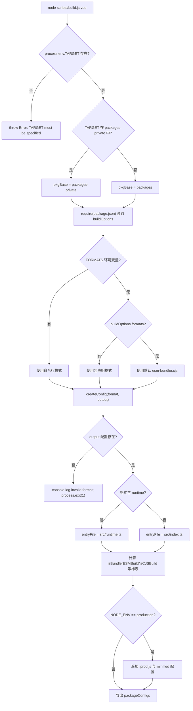

# Chapitre 1 : Vision macroscopique : la philosophie de conception d'ingénierie du dépôt core

Avant de commencer à tracer la moindre ligne d'implémentation de la réactivité ou du DOM virtuel, nous devons d'abord comprendre la matrice d'ingénierie dans laquelle ce code évolue. En ouvrant le dépôt Vue core, ce qui saute aux yeux en premier n'est pas la logique centrale du framework, mais des fichiers de configuration d'ingénierie tels que`package.json`et`pnpm-workspace.yaml`— ils ne contiennent aucune fonctionnalité d'exécution, mais déterminent si l'ensemble du framework peut être correctement construit, testé et publié. Ce chapitre répond précisément à cette question préalable : qu'est-ce que le dépôt core exactement. Il n'est pas`@vue/runtime-core`ce paquet npm, mais la matrice d'ingénierie qui héberge`runtime-core`、`reactivity`、`compiler-sfc`plus de dix paquets publiés publiquement, ainsi que des paquets expérimentaux privés tels que`sfc-playground`、`template-explorer`Comprendre l'organisation de cette matrice est le prérequis de tous les chapitres suivants (build, types, publication, budget de taille). Ce chapitre se déploie selon trois axes principaux : la structure à double répertoire du workspace, la contrainte unifiée de TypeScript et Rollup au niveau racine, et la philosophie de découplage entre « dépôt de code source » et « artefacts de publication ».

# I. Structure à double répertoire : l'isolation physique entre packages et packages-private

## Modèle intuitif

Imaginez le dépôt core comme un immeuble de R&D.`packages/`est la ligne de produits officielle, dont les productions doivent être marquées et vendues sur le marché ;`packages-private/`est le laboratoire interne, dont les échantillons ne servent qu'au débogage et à la démonstration, et ne sont jamais expédiés à l'extérieur. Les deux partagent le même réseau d'eau et d'électricité (dépendances, outils de build), mais le système de contrôle d'accès (processus de publication) les traite différemment.

Sans cette couche d'isolation physique, un paquet playground à usage de débogage interne pourrait facilement être publié par erreur sur npm — ce n'est pas une hypothèse, mais un accident classique des monorepos.

## Structures de données et disposition mémoire

La frontière du workspace est définie par`pnpm-workspace.yaml`Il ne contient que trois lignes de déclaration effective :

[FACT:pnpm-workspace.yaml:1-3]

```yaml
packages:
  - 'packages/*'
  - 'packages-private/*'
```

Ces deux globs indiquent à pnpm :`packages/`et`packages-private/`chaque sous-répertoire sous`@vue/runtime-core`est un paquet indépendant. pnpm crée des liens symboliques pour eux, afin que`@vue/reactivity`référence

pointe directement vers le répertoire source local, plutôt que de télécharger depuis le registry.`catalog:`Juste après, la section**est le mécanisme de**répertoire de versions de dépendances

[FACT:pnpm-workspace.yaml:5-13]

```yaml
catalog:
  '@babel/parser': ^7.29.8
  '@babel/types': ^7.29.8
  'entities': '^7.0.1'
  'estree-walker': ^2.0.2
  'magic-string': ^0.30.21
  'source-map-js': ^1.2.1
  'vite': ^8.3.0
  '@vitejs/plugin-vue': ^6.0.9
```

Copier`package.json`Dans le`"@babel/parser": "catalog:"` [FACT:package.json:65-65]。`catalog:`racine, la valeur correspondante est`@babel/parser`est un placeholder, que pnpm remplace lors de l'installation par la version déclarée dans la section catalog. Le bénéfice de cette approche est que :`pnpm-workspace.yaml`la version de

## n'est maintenue qu'à un seul endroit dans`pnpm install`tous les paquets qui la référencent sont automatiquement alignés, ce qui élimine la dérive de version du type « le paquet A utilise 7.28, le paquet B utilise 7.29 ».

Walkthrough guidé par scénario : ce qui se passe après un`pnpm install`Supposons que vous exécutiez

**à la racine du dépôt. Plaçons-nous dans ce scénario et traçons étape par étape :**Première étape : le contrôle d'accès preinstall.`package.json`pnpm déclenche avant l'installation le`preinstall`script

[FACT:package.json:45-45]

```json
"preinstall": "npx only-allow pnpm"
```

> **[Design Inference & Architectural Trade-offs]**
> `only-allow pnpm`〔Inférence de conception et compromis architecturaux〕`catalog:`vérifie si le gestionnaire de paquets actuel est pnpm, et sinon, renvoie directement une erreur et quitte. L'existence de ce script signifie que : installer le dépôt core avec npm ou yarn échouera. Pourquoi faut-il verrouiller pnpm ? Parce que le dépôt core dépend des liens symboliques de workspace et du mécanisme catalog de pnpm, que les workspaces de npm ne prennent pas en charge`createRequire`la syntaxe

**et que le mode PnP de yarn modifie les chemins de résolution des modules, entraînant une incohérence de comportement de**dans les scripts de build.`pnpm-workspace.yaml`Deuxième étape : résolution du workspace.`packages/*`pnpm lit`packages-private/*`scanne`package.json`et

**et crée un enregistrement de paquet pour chaque répertoire contenant**Troisième étape : application du remplacement catalog.`package.json`Dans le`catalog:`Le placeholder est remplacé par la version réelle du segment catalog, puis installé uniformément.

**Quatrième étape : hook postinstall.**Déclenché après l'installation :

[FACT:package.json:46-46]

```json
"postinstall": "simple-git-hooks"
```

`simple-git-hooks`Lire la racine`package.json`dans le champ`simple-git-hooks`, écrire les hooks Git dans`.git/hooks/`：

[FACT:package.json:48-51]

```json
"simple-git-hooks": {
  "pre-commit": "pnpm lint-staged && pnpm check",
  "commit-msg": "node scripts/verify-commit.js"
}
```

`pre-commit`Le hook exécute lint-staged et la vérification de types avant chaque commit,`commit-msg`Le hook valide le format du message de commit (Vue utilise les conventional commits). Attention à`preinstall`et`postinstall`la symétrie : le premier garde l'entrée (seul pnpm autorisé), le second déploie la défense (installation des hooks Git).

## Réflexions de conception et pièges

> **[Design Inference & Architectural Trade-offs]**
> **Pourquoi utiliser deux globs au lieu d'un seul`packages*/`？**Lister explicitement deux répertoires rend la sémantique « public » et « privé » visible au niveau de la configuration. Tout nouveau développeur lisant`pnpm-workspace.yaml`sait immédiatement que le dépôt contient deux catégories de packages. Si l'on écrivait`packages*/`, cette sémantique serait masquée.

**`allowBuilds`et sécurité de la chaîne d'approvisionnement.**Notez cette configuration :

[FACT:pnpm-workspace.yaml:15-21]

```yaml
allowBuilds:
  '@parcel/watcher': true
  '@swc/core': true
  'esbuild': true
  'puppeteer': true
  'simple-git-hooks': true
  'unrs-resolver': true
```

pnpm interdit par défaut aux packages de dépendances d'exécuter des scripts d'installation (postinstall), car c'est un vecteur courant d'attaques de la chaîne d'approvisionnement.`allowBuilds`est une liste blanche : seuls les packages listés sont autorisés à exécuter des scripts de build.`@swc/core`、`esbuild`nécessite le téléchargement de binaires natifs spécifiques à la plateforme,`puppeteer`nécessite le téléchargement de Chromium,`simple-git-hooks`nécessite l'écriture de hooks Git — ce sont tous des comportements légitimes à la construction, donc explicitement autorisés.

**`minimumReleaseAge: 1440`la signification profonde.**Cette ligne de configuration exige que les versions de dépendances nouvellement publiées aient « au moins 24 heures » (1440 minutes) avant de pouvoir être installées :

[FACT:pnpm-workspace.yaml:33-33]

```yaml
minimumReleaseAge: 1440
```

> **[Design Inference & Architectural Trade-offs]**
> C'est un mécanisme de période de refroidissement pour se défendre contre l'empoisonnement de la chaîne d'approvisionnement npm. Après qu'un attaquant détourne un package et publie une version malveillante, elle est généralement découverte et retirée en quelques heures. Définir une période de refroidissement de 24 heures permet au dépôt core d'éviter cette fenêtre. Et`minimumReleaseAgeExclude`permet de faire exception pour des correctifs de sécurité spécifiques :

[FACT:pnpm-workspace.yaml:36-38]

```yaml
minimumReleaseAgeExclude:
  # Renovate security update: vitest@4.1.11
  - vitest@4.1.11
```

Le commentaire précise explicitement qu'il s'agit d'une mise à jour de sécurité déclenchée par Renovate, nécessitant une prise d'effet immédiate, donc exemptée de la période de refroidissement.

---

# II. tsconfig racine : contraindre uniformément les frontières de types de tous les sous-packages

## Modèle intuitif

Si chaque sous-package maintenait son propre tsconfig, il y aurait des fissures du type « le package A utilise`strict: false`, le package B utilise`strict: true`». Le tsconfig racine est**une constitution**: il définit les règles de types que tous les sous-packages doivent respecter conjointement ; les sous-packages ne peuvent qu'ajouter par-dessus, sans les enfreindre.

## Structures de données et disposition mémoire

La racine`tsconfig.json`du`compilerOptions`est la fondation de tout le système de types du dépôt. Extrayons quelques champs clés :

[FACT:tsconfig.json:5-29]

```json
"target": "es2016",
"module": "esnext",
"moduleResolution": "bundler",
"strict": true,
"noUnusedLocals": true,
"isolatedModules": true,
"isolatedDeclarations": true,
"composite": true,
"paths": {
  "@vue/compat": ["./packages/vue-compat/src"],
  "@vue/*": ["./packages/*/src"],
  "vue": ["./packages/vue/src"]
}
```

Interprétation ligne par ligne :

- `target: es2016`: la syntaxe de sortie est rétrogradée à ES2016. Cela fait écho au`target`d'esbuild dans la configuration Rollup (`isServerRenderer || isCJSBuild ? 'es2019' : 'es2016'` [FACT:rollup.config.js:337-337]）。
- `moduleResolution: bundler`: adopte la résolution de modules de style bundler, permettant d'omettre les extensions et supportant le champ`exports`.
- `strict: true`: active toutes les vérifications strictes, incluant`strictNullChecks`、`noImplicitAny`etc.
- `noUnusedLocals: true`: les variables locales inutilisées provoquent directement une erreur. Cette règle a un sens pratique avec le Tree-shaking — les variables inutilisées sont souvent le signal de code mort.
- `isolatedModules: true`: exige que chaque fichier soit transpilable indépendamment. C'est le prérequis des outils comme esbuild/swc qui « transpilent fichier par fichier sans analyse de types inter-fichiers ».
- `isolatedDeclarations: true`: exige que tous les exports aient une annotation de type explicite. Cette règle sert directement le pipeline de génération de`.d.ts`— seule une annotation explicite permet à`tsc`de générer rapidement les fichiers de déclaration sans inférence de types complète.
- `composite: true`: active les métadonnées de build incrémental nécessaires aux project references.

`paths`Le champ est le**miroir de la couche de types**：`@vue/*`du workspace, mappé vers`./packages/*/src`, permettant à TypeScript de résoudre directement vers le code source à la compilation, plutôt que vers les liens symboliques dans`node_modules`. Cela complète les liens symboliques d'exécution de pnpm — à l'exécution on s'appuie sur pnpm, à la compilation sur paths.

## Walkthrough guidé par scénario : une vérification de types de`pnpm check`

`check`Le script est`tsc --incremental --noEmit` [FACT:package.json:15-15]. Plaçons-nous dans ce scénario :

**Première étape : lire la portée include.**Le`include`du tsconfig détermine quels fichiers participent à la vérification :

[FACT:tsconfig.json:31-39]

```json
"include": [
  "packages/global.d.ts",
  "packages/*/src",
  "packages/*/__tests__",
  "packages/vue/jsx-runtime",
  "packages/runtime-dom/types/jsx.d.ts",
  "scripts/*",
  "rollup.*.js"
]
```

Notez que`scripts/*`et`rollup.*.js`sont aussi dans la portée de vérification. Cela signifie que les scripts de build eux-mêmes sont soumis aux contraintes de types —`rollup.config.js`en tête de`// @ts-check` [FACT:rollup.config.js:1-1]avec les annotations de types JSDoc, permet à ce fichier purement JS d'être aussi vérifié par`tsc`.

**Deuxième étape : appliquer l'exclusion exclude.**

[FACT:tsconfig.json:40-40]

```json
"exclude": ["packages-private/sfc-playground/src/vue-dev-proxy*"]
```

> **[Design Inference & Architectural Trade-offs]**
> `sfc-playground`Les fichiers`vue-dev-proxy`dans

**sont exclus. Pourquoi ? Ces fichiers sont généralement du code proxy généré dynamiquement à l'exécution, dont la forme des types est instable, et les inclure dans la vérification produirait du bruit.** `--incremental`Troisième étape : vérification incrémentale.`tsc`permet à`.tsbuildinfo`de mettre en cache les résultats de la dernière vérification dans`--noEmit`, ne revérifiant que les fichiers modifiés.

## signifie vérifier sans produire — la vérification de types et la génération d'artefacts sont deux pipelines indépendants.

**`isolatedDeclarations`Réflexions de conception et pièges**Le coût et le bénéfice de`export function foo(): number`. Après activation de cette règle, tout export doit avoir un type de retour explicitement annoté, par exemple`export function foo() { return 1 }`au lieu de`.d.ts`. Cela augmente le coût d'écriture, mais en échange, la vitesse de génération de`tsc`est considérablement améliorée —`build-dts`peut produire les fichiers de déclaration sans inférence inter-fichiers. Cela fait écho au flag`tsc -p tsconfig.build.json --noCheck`dans le script`--noCheck`: puisque les types sont déjà explicitement annotés, on peut même sauter la vérification lors de la génération des fichiers de déclaration.

**`types`Injection globale du champ**

[FACT:tsconfig.json:21-21]

```json
"types": ["vitest/globals", "puppeteer", "node"]
```

Ces trois packages de types sont injectés globalement, ce qui signifie que les fichiers de test peuvent utiliser directement`describe`、`it`、`expect`sans import, et les tests e2e peuvent utiliser directement les types de`puppeteer`. C'est un compromis entre commodité et pollution — plus il y a de types globaux, plus le risque de conflit de noms est élevé, mais meilleure est l'expérience d'écriture du code de test.

---

# III. Configuration Rollup : de buildOptions à l'usine unifiée des artefacts multi-formats

## Modèle intuitif

La configuration Rollup est l'**atelier d'assemblage**du dépôt core. Il ne se soucie pas de ce que fait un package spécifique, mais seulement de « quels formats ce package doit produire, où se trouve le fichier d'entrée pour chaque format, et quelles dépendances doivent être externalisées ». Le champ`package.json`dans le`buildOptions`de chaque sous-package est un bon de livraison collé sur le colis, et l'atelier d'assemblage travaille selon ce bon.

## Structures de données et disposition mémoire

Dès l'entrée du fichier de configuration, le modèle « construction par package » est établi :

[FACT:rollup.config.js:32-44]

```js
if (!process.env.TARGET) {
  throw new Error('TARGET package must be specified via --environment flag.')
}
...
const privatePackages = fs.readdirSync('packages-private')
const pkgBase = privatePackages.includes(process.env.TARGET)
  ? `packages-private`
  : `packages`
const packagesDir = path.resolve(__dirname, pkgBase)
const packageDir = path.resolve(packagesDir, process.env.TARGET)
...
const pkg = require(resolve(`package.json`))
const packageOptions = pkg.buildOptions || {}
const name = packageOptions.filename || path.basename(packageDir)
```

Conceptions clés :`TARGET`La variable d'environnement spécifie quel package construire. La configuration utilise`fs.readdirSync('packages-private')`pour déterminer si le package appartient à un répertoire public ou privé, décidant ainsi de`pkgBase`. C'est une**détection de répertoire à l'exécution**— pas besoin de maintenir une liste de « quels packages sont privés », la structure des répertoires est elle-même la vérité.

`buildOptions`est un champ personnalisé dans le`package.json`du sous-package,`packageOptions.filename`détermine le préfixe du nom de fichier de l'artefact,`packageOptions.formats`détermine le format de construction par défaut.

La correspondance format-vers-artefact est définie par`outputConfigs`:

[FACT:rollup.config.js:58-88]

```js
const outputConfigs = {
  'esm-bundler': { file: resolve(`dist/${name}.esm-bundler.js`), format: 'es' },
  'esm-browser': { file: resolve(`dist/${name}.esm-browser.js`), format: 'es' },
  cjs:           { file: resolve(`dist/${name}.cjs.js`),         format: 'cjs' },
  global:        { file: resolve(`dist/${name}.global.js`),      format: 'iife' },
  'esm-bundler-runtime': { file: resolve(`dist/${name}.runtime.esm-bundler.js`), format: 'es' },
  'esm-browser-runtime': { file: resolve(`dist/${name}.runtime.esm-browser.js`), format: 'es' },
  'global-runtime':      { file: resolve(`dist/${name}.runtime.global.js`),      format: 'iife' },
}
```

Sept formats, couvrant trois scénarios de consommation :`esm-bundler`pour les bundlers comme Vite/webpack,`esm-browser`pour l'ESM natif du navigateur,`global`pour la balise`<script>`. Ceux avec le suffixe`-runtime`sont des constructions « runtime uniquement », ouvertes uniquement au package principal`vue`.

## Parcours guidé par scénario : le flux de décision complet d'un`pnpm build vue`

Imaginons l'exécution du scénario`node scripts/build.js vue`.`TARGET=vue`, traçons les décisions internes de`createConfig`:

**Première étape : déterminer la liste des formats.**

[FACT:rollup.config.js:91-92]

```js
const defaultFormats = ['esm-bundler', 'cjs']
const inlineFormats = process.env.FORMATS && process.env.FORMATS.split(',')
const packageFormats = inlineFormats || packageOptions.formats || defaultFormats
const packageConfigs = process.env.PROD_ONLY
  ? []
  : packageFormats.map(format => createConfig(format, outputConfigs[format]))
```

Priorité : ligne de commande`FORMATS`> sous-package`buildOptions.formats`> par défaut`['esm-bundler', 'cjs']`。`PROD_ONLY`Si la variable d'environnement est vraie, les constructions non-production sont ignorées, ne conservant que la configuration`.prod.js`ajoutée ultérieurement.

**Deuxième étape : calculer les indicateurs de construction.** `createConfig`déduit en interne un ensemble d'indicateurs booléens à partir de la chaîne de format :

[FACT:rollup.config.js:131-142]

```js
const isProductionBuild = process.env.__DEV__ === 'false' || /\.prod\.js$/.test(output.file)
const isBundlerESMBuild = /esm-bundler/.test(format)
const isBrowserESMBuild = /esm-browser/.test(format)
const isServerRenderer = name === 'server-renderer'
const isCJSBuild = format === 'cjs'
const isGlobalBuild = /global/.test(format)
const isCompatPackage = pkg.name === '@vue/compat'
const isCompatBuild = !!packageOptions.compat
const isBrowserBuild =
  (isGlobalBuild || isBrowserESMBuild || isBundlerESMBuild) &&
  !packageOptions.enableNonBrowserBranches
```

Ces indicateurs sont la**source unique de vérité**pour toutes les décisions ultérieures : sélection du fichier d'entrée, remplacement define, détermination external, assemblage des plugins, tout en dépend.

**Troisième étape : sélectionner le fichier d'entrée.**

[FACT:rollup.config.js:159-168]

```js
let entryFile = /runtime$/.test(format) ? `src/runtime.ts` : `src/index.ts`

if (isCompatPackage && (isBrowserESMBuild || isBundlerESMBuild)) {
  entryFile = /runtime$/.test(format)
    ? `src/esm-runtime.ts`
    : `src/esm-index.ts`
}
```

L'entrée par défaut est`src/index.ts`, les constructions runtime uniquement utilisent`src/runtime.ts`. Le package compat (`@vue/compat`, c'est-à-dire la construction compatible Vue 2) doit fournir à la fois les exports default et named, ce qui ferait échouer Rollup pour les cibles non-ESM, donc une entrée`esm-index.ts` / `esm-runtime.ts`distincte est utilisée pour la construction ESM.

**Quatrième étape : générer la table de remplacement define.** `resolveDefine`remplace les constantes de compilation comme`__DEV__`、`__BROWSER__`dans le code source par des littéraux :

[FACT:rollup.config.js:170-201]

```js
const replacements = {
  __COMMIT__: `"${process.env.COMMIT}"`,
  __VERSION__: `"${masterVersion}"`,
  __TEST__: `false`,
  __BROWSER__: String(isBrowserBuild),
  __GLOBAL__: String(isGlobalBuild),
  __ESM_BUNDLER__: String(isBundlerESMBuild),
  __ESM_BROWSER__: String(isBrowserESMBuild),
  __CJS__: String(isCJSBuild),
  __SSR__: String(!isGlobalBuild),
  __COMPAT__: String(isCompatBuild),
  __FEATURE_SUSPENSE__: `true`,
  __FEATURE_OPTIONS_API__: isBundlerESMBuild ? `__VUE_OPTIONS_API__` : `true`,
  __FEATURE_PROD_DEVTOOLS__: isBundlerESMBuild ? `__VUE_PROD_DEVTOOLS__` : `false`,
  __FEATURE_PROD_HYDRATION_MISMATCH_DETAILS__: isBundlerESMBuild ? `__VUE_PROD_HYDRATION_MISMATCH_DETAILS__` : `false`,
}
```

Il y a ici une stratification ingénieuse :**les feature flags ne sont pas codés en dur dans la construction esm-bundler, mais conservés comme des identifiants tels que`__VUE_OPTIONS_API__`**, laissés au bundler de l'utilisateur final pour le remplacement. Ainsi l'utilisateur peut désactiver le support de l'Options API via`define: { __VUE_OPTIONS_API__: false }`, permettant le Tree-shaking du code associé. En revanche, dans les constructions global/esm-browser, ces flags sont codés en dur à`true`/`false`, car les artefacts consommés directement par le navigateur n'ont pas d'intervention de bundler.

**Cinquième étape : permettre la surcharge par variables d'environnement.**

[FACT:rollup.config.js:208-216]

```js
// allow inline overrides like
//__RUNTIME_COMPILE__=true pnpm build runtime-core
Object.keys(replacements).forEach(key => {
  if (key in process.env) {
    const value = process.env[key]
    assert(typeof value === 'string')
    replacements[key] = value
  }
})
```

Toute clé define peut être surchargée par une variable d'environnement du même nom. L'exemple donné en commentaire est`__RUNTIME_COMPILE__=true pnpm build runtime-core`— utilisé pour déboguer une branche de compilation spécifique.

**Sixième étape : assembler la chaîne de plugins.**

[FACT:rollup.config.js:324-342]

```js
plugins: [
  json({ namedExports: false }),
  alias({ entries }),
  enumPlugin,
  ...resolveReplace(),
  esbuild({
    tsconfig: path.resolve(__dirname, 'tsconfig.json'),
    sourceMap: output.sourcemap,
    minify: false,
    target: isServerRenderer || isCJSBuild ? 'es2019' : 'es2016',
    define: resolveDefine(),
  }),
  ...resolveNodePlugins(),
  ...plugins,
],
```

L'ordre des plugins est important :`json`traite d'abord les imports JSON,`alias`mappe`@vue/*`vers le chemin source,`enumPlugin`fait l'inlining d'énumérations,`replace`fait le remplacement de chaînes,`esbuild`fait la transpilation TS. Notez que le`esbuild`de`tsconfig`pointe vers le tsconfig racine —**tous les sous-packages partagent la même configuration de types**, ce qui est précisément la manifestation à la construction de la « constitution » discutée dans la section II.

**Septième étape : ajout des constructions de production.**Si`NODE_ENV=production`：

[FACT:rollup.config.js:97-114]

```js
if (process.env.NODE_ENV === 'production') {
  packageFormats.forEach(format => {
    if (packageOptions.prod === false) {
      return
    }
    if (format === 'cjs') {
      packageConfigs.push(createProductionConfig(format))
    }
    if (/^(global|esm-browser)(-runtime)?/.test(format)) {
      packageConfigs.push(createMinifiedConfig(format))
    }
  })
}
```

Le format CJS ajoute une version`.prod.js`(avec remplacement par`__DEV__=false`), les formats global et esm-browser ajoutent une version minifiée (minify avec swc).`packageOptions.prod === false`Les packages

peuvent se retirer de ce mécanisme.



## Copier

**`external`Réflexions de conception et pièges** `resolveExternal`La stratégie à trois branches de

[FACT:rollup.config.js:257-283]

```js
function resolveExternal() {
  const treeShakenDeps = ['source-map-js', '@babel/parser', 'estree-walker', 'entities/decode']

  if (isGlobalBuild || isBrowserESMBuild || isCompatPackage) {
    if (!packageOptions.enableNonBrowserBranches) {
      return treeShakenDeps
    }
  } else {
    return [
      ...Object.keys(pkg.dependencies || {}),
      ...Object.keys(pkg.peerDependencies || {}),
      ...['path', 'url', 'stream'],
      ...treeShakenDeps,
    ]
  }
}
```

retourne différentes listes d'externalisation selon le type de construction :`treeShakenDeps`Copier`dependencies`Les constructions navigateur (global/esm-browser) intègrent toutes les dépendances, ne listant`peerDependencies`comme external que pour supprimer les avertissements — ces dépendances ne sont pas réellement référencées dans la branche navigateur et seront supprimées par Tree-shaking. Les constructions Node/esm-bundler externalisent tous les

**`onwarn`et**

[FACT:rollup.config.js:344-348]

```js
onwarn: (msg, warn) => {
  if (msg.code !== 'CIRCULAR_DEPENDENCY') {
    warn(msg)
  }
},
```

Filtrage des dépendances circulaires.`runtime-core`Copier`reactivity`Les avertissements de dépendances circulaires sont silencieux. Il existe des références circulaires légitimes entre

**`treeshake.moduleSideEffects: false`et**

[FACT:rollup.config.js:355-355]

```js
treeshake: {
  moduleSideEffects: false,
},
```

L'hypothèse agressive de**.**Copier

**Cela indique à Rollup : tous les modules sont sans effets de bord, les imports non référencés peuvent être supprimés en toute sécurité. C'est une`pure_getters`hypothèse agressive**

[FACT:rollup.config.js:373-388]

```js
async renderChunk(contents, _, { format }) {
  const { code } = await minifySwc(contents, {
    module: format === 'es',
    format: { comments: false },
    compress: { ecma: 2016, pure_getters: true },
    safari10: true,
    mangle: true,
  })
  return { code: banner + code, map: null }
}
```

`pure_getters: true`Le piège`obj.foo`de swc-minify.`track()`) plutôt que par un effet de bord implicite du getter, ce qui est donc sûr.`map: null`indique qu'aucun sourcemap n'est généré après minification — les artefacts de production n'ont pas besoin de mappings de débogage.

---

# Réflexion de conception : pourquoi le dépôt source et les artefacts publiés doivent être découplés

Revenons à la proposition centrale de ce chapitre. La conception d'ingénierie du dépôt core suit un fil conducteur :**La responsabilité du dépôt source est la « production », celle des artefacts publiés est la « consommation », les deux étant découplés par le pipeline de build**。

Cela se manifeste concrètement à trois niveaux :

**Premièrement, le code source n'est pas publié directement.** `package.json`Le`private: true` [FACT:package.json:2-2]indique que le package racine n'est jamais publié. Dans chaque sous-package, le`package.json`contient le`main`/`module`/`exports`champ qui pointe vers`dist/`les artefacts sous, et non vers`src/`. Lorsqu'un utilisateur installe`vue`, il obtient les`.js`et`.d.ts`après build, le code source restant dans le dépôt.

**Deuxièmement, le format des artefacts est déterminé par le scénario de consommation.**Les sept formats ne sont pas listés au hasard, mais correspondent à sept chemins de consommation réels : les utilisateurs de Vite prennent`esm-bundler`, les utilisateurs de CDN prennent`global`, les utilisateurs de Node SSR prennent`cjs`. La logique de sélection des formats est centralisée en`rollup.config.js`un seul endroit, les sous-packages n'ayant qu'à déclarer dans`buildOptions.formats`ceux dont ils ont besoin.

**Troisièmement, séparation des types et de l'implémentation.** `build-dts`Le script`tsc -p tsconfig.build.json --noCheck && rollup -c rollup.dts.config.js` [FACT:package.json:9-9]indique que`.d.ts`la génération est un pipeline indépendant.`isolatedDeclarations: true`permet à la génération des fichiers de déclaration de sauter la vérification de types (`--noCheck`), car les types sont déjà explicitement annotés.

> **[Design Inference & Architectural Trade-offs]**
> La motivation profonde de ce découplage est :**L'organisation du code source sert les développeurs, l'organisation des artefacts sert les consommateurs, et leurs optima diffèrent**. Le code source a besoin d'une structure de répertoires claire, d'informations de types complètes, de sourcemaps débogables ; les artefacts ont besoin d'une taille minimale, de formats de modules corrects, d'une surface d'API stable. Forcer l'unification des deux (par exemple publier directement le code source TS) nuirait simultanément à l'expérience des deux côtés.

---

# Résumé de ce chapitre

Ce chapitre a établi une compréhension macroscopique du dépôt core selon trois dimensions :

1. **Structure à double répertoire**：`packages/`et`packages-private/`l'isolation physique de, combinée aux liens symboliques de pnpm workspace et au catalogue de versions catalog, réalise une frontière claire entre « packages publics » et « packages privés ».`preinstall`Le verrouillage,`allowBuilds`la liste blanche,`minimumReleaseAge`et la période de refroidissement constituent ensemble la ligne de défense de la sécurité de la chaîne d'approvisionnement.

2. **tsconfig racine**: en tant que constitution des types pour tous les sous-packages, il réalise la résolution workspace à la compilation via`paths`le mapping, et soutient la construction incrémentale et la génération rapide de fichiers de déclaration via`isolatedDeclarations`et`composite`.

3. **Fabrique unifiée Rollup**: avec`TARGET`la variable d'environnement comme point d'entrée, il lit les métadonnées des sous-packages via`buildOptions`, pilote la sélection d'entrée, le remplacement define, la détermination external et l'assemblage des plugins via un ensemble de drapeaux booléens, produisant finalement des artefacts en sept formats.

La philosophie centrale est**le découplage entre le dépôt source et les artefacts publiés**: le dépôt est responsable de la production, les artefacts de la consommation, le pipeline de build étant l'unique pont entre les deux.

---

# Transition de fin de chapitre

Ce chapitre a répondu à « qu'est-ce que le dépôt core ». Mais la structure statique du dépôt n'est que la scène ; le véritable drame se joue lors de l'exécution d'une requête de build :`scripts/build.js`comment parser les arguments de ligne de commande, comment appeler l'API Rollup, comment gérer les échecs de build et la concurrence. Le prochain chapitre suivra le voyage de bout en bout d'une requête de build, de l'entrée aux artefacts, transformant la compréhension statique établie dans ce chapitre en une vue d'exécution dynamique.

# Réflexions et auto-évaluation de ce chapitre

Q1 : si l'on remplace dans`pnpm-workspace.yaml`le`minimumReleaseAge: 1440`par`0`, quels risques cela introduirait-il dans un scénario de mise à jour de dépendances ? Pourquoi`minimumReleaseAgeExclude`l'existence de est-elle nécessaire ?

**Analyse de référence**：

`minimumReleaseAge: 1440` [FACT:pnpm-workspace.yaml:33-33]exige qu'une version de dépendance nouvellement publiée ait au moins 24 heures avant de pouvoir être installée. Si l'on remplace par`0`, toute version fraîchement publiée peut être immédiatement tirée.

Scénario de risque : un attaquant détourne une dépendance transitive (par exemple`@babel/parser`une certaine version patch de), publiant une version contenant un script postinstall malveillant. Pendant la période de refroidissement de 24 heures, la communauté détecte généralement le problème et retire la version ; si la période de refroidissement est de 0, la CI du dépôt core pourrait automatiquement mettre à jour et exécuter le script malveillant pendant la fenêtre d'attaque.

`minimumReleaseAgeExclude` [FACT:pnpm-workspace.yaml:36-38]L'existence de est due au fait que le mécanisme de refroidissement entre en conflit avec l'urgence des correctifs de sécurité. Le`vitest@4.1.11`dans les commentaires est une mise à jour de sécurité détectée par Renovate — ce type de mise à jour doit prendre effet immédiatement, attendre 24 heures ne ferait que prolonger la fenêtre d'exposition. Il faut donc une liste d'exemptions explicite permettant aux mises à jour de sécurité de contourner la période de refroidissement. Cela illustre le principe de conception de sécurité « conservateur par défaut, exception explicite ».

Q2: `rollup.config.js`Dans`resolveDefine`, le traitement de`__FEATURE_OPTIONS_API__`par`isBundlerESMBuild ? '__VUE_OPTIONS_API__' : 'true'`est`'true'`. Si l'on modifiait par erreur pour retourner

**pour tous les formats, quel impact cela aurait-il sur les utilisateurs finaux ?**：

[FACT:rollup.config.js:192-194]

```js
__FEATURE_OPTIONS_API__: isBundlerESMBuild
  ? `__VUE_OPTIONS_API__`
  : `true`,
```

Copie`__FEATURE_OPTIONS_API__`Dans le build esm-bundler,`__VUE_OPTIONS_API__`est conservé comme identifiant`define: { __VUE_OPTIONS_API__: false }`, laissé au bundler de l'utilisateur final pour remplacement. L'utilisateur peut définir`data`、`methods`、`computed`dans sa propre configuration de build, permettant au Tree-shaking de supprimer tout le code lié à l'Options API (la logique de traitement des options

, etc.), réduisant significativement la taille de l'artefact.`'true'`Si l'on modifiait pour retourner`define`pour tous les formats, le code de l'Options API serait codé en dur dans l'artefact esm-bundler, la configuration

de l'utilisateur deviendrait inopérante, empêchant le Tree-shaking. Pour un projet n'utilisant que la Composition API, cela ajouterait inutilement plusieurs Ko à la taille de l'artefact.**L'idée clé de cette conception est :**la forme finale de l'artefact esm-bundler est déterminée par le bundler de l'utilisateur, donc les feature flags doivent être résolus tardivement, au moment du build de l'utilisateur

Q3: `rollup.config.js`de`resolveExternal`, la construction navigateur ne retourne que`treeShakenDeps`comme external, tandis que la construction Node retourne tous les`dependencies`. Supposons qu'un jour quelqu'un ajoute une nouvelle dépendance d'exécution`runtime-core`à`foo-lib`, mais oublie de mettre à jour`resolveExternal`la logique de

**. Que se passe-t-il dans la construction navigateur ?**：

[FACT:rollup.config.js:257-283]

Analyse de référence`isGlobalBuild || isBrowserESMBuild`La construction navigateur (`!packageOptions.enableNonBrowserBranches`) lors de`treeShakenDeps`（`source-map-js`、`@babel/parser`、`estree-walker`、`entities/decode`ne retourne que`foo-lib`). Cela signifie que

n'est pas dans la liste external,`node scripts/build.js vue`Jusqu'ici, nous avons clairement vu, au niveau macro, la philosophie de conception globale du dépôt core en tant que matrice d'ingénierie : la structure workspace à double répertoire délimite la frontière entre les packages publics et les packages expérimentaux privés, les configurations TypeScript et Rollup au niveau racine fournissent des contraintes unifiées, et le découplage entre le dépôt source et les artefacts de publication rend possible la sortie multi-format. Ces connaissances ouvrent la voie à l'exploration approfondie des chaînes d'ingénierie concrètes. Dans le chapitre suivant, nous passerons de la structure statique au flux dynamique, en prenant
