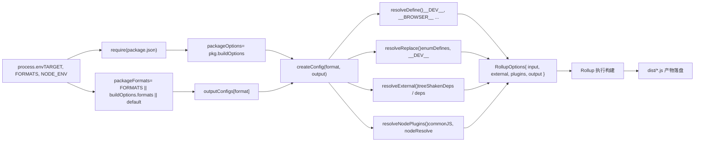

# Chapitre suivant : Chapitre 2 →

Statut de vérification : lignes FACT réellement ancrées`node scripts/build.js vue`Dans le chapitre précédent, nous avons clarifié la position du dépôt core en tant que matrice d'ingénierie, ainsi que la manière dont le workspace pnpm et la configuration racine contraignent uniformément tous les sous-packages. Maintenant, nous plongeons au cœur du système de construction pour suivre comment une commande pilote l'ensemble du processus de construction.

# semble simple, mais constitue l'unique point d'entrée de tous les artefacts — esm-bundler, cjs, global. Comprendre comment il traduit l'intention de l'utilisateur en tâches de construction exécutables est une étape clé pour maîtriser le mécanisme de construction de Vue.

`build.js`Génération de la configuration Rollup : des variables d'environnement aux artefacts multi-format`exec`via`rollup.config.js`démarre Rollup, puis le contrôle passe à

## . Ce fichier est le « cerveau » du système de construction — il lit les variables d'environnement et génère dynamiquement un tableau d'objets de configuration Rollup.

[FACT:rollup.config.js:27-29]

Validation des variables d'environnement et localisation des packages`TARGET`Si`rollup -c`n'est pas défini, une erreur est levée directement. C'est de la programmation défensive : la configuration Rollup peut être appelée directement (comme`build.js`), auquel cas aucune

[FACT:rollup.config.js:32-44]

n'injecte de variables d'environnement, et il faut échouer rapidement.`build.js`Ici, la logique de détermination des packages privés de`rollup.config.js`est répétée — car`build.js`est un processus indépendant et ne peut pas partager l'état mémoire de`resolve`.`pkg`La fonction résout un chemin relatif en chemin absolu dans le répertoire du package,`package.json`est le contenu`packageOptions`du package cible,`buildOptions`est le champ`name`qu'il contient,`buildOptions.filename`est le préfixe du nom de fichier de l'artefact (on utilise en priorité

## , sinon le nom du répertoire).`outputConfigs`

[FACT:rollup.config.js:58-88]

Table de correspondance des formats :

- `esm-bundler`、`esm-browser`、`esm-bundler-runtime`、`esm-browser-runtime`Cette table définit la correspondance entre 7 formats et les configurations de sortie. Observations clés :`format: 'es'`sont tous
- `cjs`, la différence ne réside que dans le nom de fichier.`format: 'cjs'`。
- `global`est`global-runtime`et`format: 'iife'`est`<script>`(expression de fonction immédiatement invoquée), adapté à une introduction directe via la balise
- `runtime`.`vue`Les formats avec ce suffixe n'ont de sens que pour le package principal

## — ils n'incluent pas le compilateur et sont plus légers.

[FACT:rollup.config.js:91-92]

Sélection du format : trois niveaux de priorité`FORMATS`La sélection du format suit trois niveaux de priorité : ligne de commande`buildOptions.formats`variable d'environnement > package`['esm-bundler', 'cjs']`。`PROD_ONLY`> par défaut

## La variable d'environnement contrôle s'il faut ignorer la configuration de base — si seule la version de production est construite, le tableau de configuration de base est vide, et seule la configuration de production est ensuite ajoutée.

[FACT:rollup.config.js:97-114]

Logique d'ajout de la configuration de production`NODE_ENV === 'production'`Lorsque

- , pour chaque format :`packageOptions.prod === false`Si
- , ignorer (ce package n'a pas besoin de version de production).`cjs`Si c'est`createProductionConfig`, ajouter`.prod.js`— génère le fichier
- .`/^(global|esm-browser)(-runtime)?/`Si cela correspond à`createMinifiedConfig`, ajouter

> **[Design Inference & Architectural Trade-offs]**
> 〔Inférence de conception et compromis architecturaux〕`cjs`Pourquoi`createProductionConfig`utilise`global`/`esm-browser`tandis que`createMinifiedConfig`utilise

## `createConfig`? Parce que CJS est destiné à Node, et l'environnement Node n'a pas besoin de compression (l'utilisateur s'en charge), mais doit distinguer les branches dev/prod ; tandis que les artefacts directement introduits dans le navigateur doivent être compressés pour réduire la taille. Cette différence se reflète dans l'implémentation des deux fonctions de fabrique.

`createConfig`: le cœur de la génération de configuration

[FACT:rollup.config.js:125-142]

est la plus grande fonction ; elle reçoit le format et la configuration de sortie, et retourne l'objet de configuration Rollup complet.

- `isProductionBuild`Au début se trouve une série de calculs de drapeaux booléens :`__DEV__`: via`.prod.js`la variable d'environnement ou si le nom de fichier contient
- `isBundlerESMBuild`、`isBrowserESMBuild`、`isCJSBuild`、`isGlobalBuild`.
- `isServerRenderer`: correspondance par expression régulière sur le nom de format.`server-renderer`。
- `isCompatPackage`、`isCompatBuild`: si le nom du package est
- `isBrowserBuild`: lié à la construction compatible Vue 2.

: construction globale ou construction ESM navigateur, et branche non-navigateur non activée.`resolveDefine`、`resolveReplace`、`resolveExternal`Ces drapeaux sont utilisés de manière répétée dans le

[FACT:rollup.config.js:144-157]

ultérieur et constituent la base essentielle de la différenciation des configurations.`exports`Paramètres de base de la configuration de sortie : en-tête de copyright banner,`auto`mode (les packages compat utilisent`named`, les autres utilisent`esModule`), activation de l'interopérabilité`externalLiveBindings: false`pour la construction CJS, sourcemap contrôlé par variable d'environnement,`reexportProtoFromExternal: false`et`output.name`sont des paramètres de compatibilité de Rollup 4. La construction globale définit en plus`window`, c'est-à-dire le nom de variable monté sur

## .

[FACT:rollup.config.js:159-168]

Sélection du fichier d'entrée`src/index.ts`L'entrée par défaut est`runtime`, mais les formats avec le suffixe`src/runtime.ts`. La construction ESM du paquet compat doit exporter à la fois default et named, donc on utilise une entrée`esm-index.ts` / `esm-runtime.ts`séparée.

## Définition de macros :`resolveDefine`

[FACT:rollup.config.js:170-218]

`resolveDefine`Retourne une table de remplacement qui remplace dans le code source les`__COMMIT__`、`__VERSION__`、`__BROWSER__`macros telles que par des littéraux. Ces macros sont utilisées dans le code source pour la compilation conditionnelle — par exemple`if (__DEV__) { ... }`sera remplacé en production par`if (false) { ... }`, puis supprimé par Tree-shaking.

Conception clé :`__FEATURE_OPTIONS_API__`、`__FEATURE_PROD_DEVTOOLS__`Les commutateurs de fonctionnalités tels que sont conservés dans la construction`esm-bundler`sous forme d'identifiants`__VUE_OPTIONS_API__`tels que, permettant aux utilisateurs finaux de les surcharger via la configuration du bundler ; dans les autres constructions, ils sont directement codés en dur comme`true`ou`false`。

[FACT:rollup.config.js:203-206]

non`esm-bundler`La construction code en dur`__DEV__`, car leurs branches dev/prod sont déterminées au moment de la construction.

[FACT:rollup.config.js:210-216]

La dernière étape permet aux variables d'environnement de surcharger toute définition de macro, prenant en charge`__RUNTIME_COMPILE__=true pnpm build runtime-core`des surcharges en ligne telles que.

## Plugin de remplacement :`resolveReplace`

[FACT:rollup.config.js:222-255]

`resolveReplace`En dehors de`resolveDefine`, gère les remplacements qu'esbuild ne peut pas traiter :

- Fusionne`enumDefines`(définitions d'inlining d'énumérations provenant de`inlineEnums`).
- Dans la construction navigateur de production, ajoute une annotation`/*@__PURE__*/`aux fonctions de création d'erreurs pour aider le Tree-shaking.
- `esm-bundler`Dans la construction,`__DEV__`est remplacé par`!!(process.env.NODE_ENV !== 'production')`, laissant le bundler décider.
- Dans la construction ESM navigateur, remplace`process.env`par un objet vide pour éviter les erreurs du navigateur.

## Dépendances externes :`resolveExternal`

[FACT:rollup.config.js:257-283]

C'est le cœur de la question de réflexion à la fin du chapitre précédent. La construction navigateur ne retourne que`treeShakenDeps`comme external — ces dépendances, bien qu'importées, ne seront pas réellement exécutées dans la branche navigateur ; elles sont listées ici uniquement pour supprimer les avertissements de Rollup. Les constructions Node/ESM-bundler externalisent tous les`dependencies`et`peerDependencies`, ainsi que`path`、`url`、`stream`les modules intégrés Node tels que.

## Objet de configuration final

[FACT:rollup.config.js:319-352]

L'objet de configuration retourné contient :

- `input`: chemin absolu du fichier d'entrée.
- `external`: liste des dépendances externes.
- `plugins`: tableau de plugins, dans l'ordre json → alias → enumPlugin → replace → esbuild → nodePlugins.
- `output`: configuration de sortie.
- `onwarn`: filtre les avertissements`CIRCULAR_DEPENDENCY`(il existe des dépendances circulaires dans le code source de Vue, mais elles sont inoffensives à l'exécution).
- `treeshake.moduleSideEffects: false`: indique à Rollup que tous les modules n'ont pas d'effets de bord, Tree-shaking agressif.

La figure ci-dessous montre le flux de données des variables d'environnement à la configuration finale :

# Écriture des artefacts sur disque et vérification de taille

## `exec`Gestion des processus de

`build.js`Lance le sous-processus Rollup via`exec`:

[FACT:scripts/utils.js:64-114]

`exec`encapsule`spawn`, retourne une Promise. Conception clé :

- `stdio`Par défaut,`['ignore', 'pipe', 'pipe']`— stdin ignoré, stdout/stderr capturés par pipe.
- `shell: process.platform === 'win32'`— sous Windows, un shell est nécessaire pour analyser correctement la commande.
- Collecte la sortie via les tableaux`stderrChunks`et`stdoutChunks`, concaténée dans l'événement`exit`.
- resolve si le code de sortie est 0, sinon reject avec le contenu de stderr.

> **[Design Inference & Architectural Trade-offs]**
> Notez que`build.js`appelle`exec`en passant`{ stdio: 'inherit' }`, ce qui écrase la configuration de pipe par défaut, faisant passer la sortie de Rollup directement au terminal. C'est le comportement correct d'un outil de construction — l'utilisateur doit voir la progression de la construction en temps réel.

## Vérification de taille :`checkAllSizes`

[FACT:scripts/build.js:206-215]

La vérification de taille a deux conditions de saut :`devOnly`est vrai, ou un format est spécifié mais ne contient pas`global`. Car la vérification de taille ne concerne que les artefacts de construction globale — ce sont les fichiers directement importés par l'utilisateur final, les plus sensibles à la taille.

[FACT:scripts/build.js:222-228]

`checkSize`Vérifie deux fichiers :`${target}.global.prod.js`et`${target}.runtime.global.prod.js`(le second n'est vérifié que si aucun format n'est spécifié ou si`global-runtime`est spécifié).

[FACT:scripts/build.js:235-264]

`checkFileSize`Lit le fichier, calcule la taille compressée avec`gzipSync`et`brotliCompressSync`, formate la sortie avec`prettyBytes`. Si`writeSize`est vrai, écrit le résultat dans`temp/size/${fileName}.json`— c'est la source de données pour la vérification du budget de taille en CI.

## Construction des déclarations de type

[FACT:scripts/build.js:94-108]

Si`buildTypes`est vrai, appelle`pnpm run build-dts`, et passe la liste des cibles via`--environment TARGETS:...`. Cela garantit que les déclarations de type ne sont générées que pour les paquets réellement construits.

# Réflexions de conception et pièges en production

**Pourquoi utiliser`--environment`plutôt que de passer directement les arguments ?**Le`--environment`de Rollup est le seul moyen de passer des arguments lisible via`process.env`dans le fichier de configuration. Passer directement les arguments`--config`nécessite d'analyser`process.argv`, tandis que`--environment`fournit une analyse structurée clé-valeur.

**`fuzzyMatchTarget`Le piège des expressions régulières.** `target.match(partialTarget)`Dans`partialTarget`est une entrée utilisateur. Si l'utilisateur saisit`runtime-core`，`-`qui est un littéral dans l'expression régulière, pas de problème ; mais si l'entrée`runtime.core`，`.`correspond à n'importe quel caractère, elle peut correspondre à une cible inattendue. C'est le risque inhérent de la correspondance floue, mais les noms de paquets Vue ne contiennent pas de caractères spéciaux d'expression régulière, donc en pratique cela ne se déclenche pas.

**Compétition de ressources en construction concurrente.** `runParallel`Utilise`cpus().length`comme limite de concurrence, mais chaque processus Rollup démarre lui-même des workers. Dans les conteneurs CI à faible nombre de cœurs, cela peut provoquer un dépassement de mémoire. En production, en cas d'OOM, on peut atténuer via`--max-old-space-size`ou en réduisant le nombre de concurrences.

**`scanEnums`Cycle de vie du cache.** `removeCache`Est appelé dans`finally`, mais si`scanEnums`lui-même lève une erreur,`removeCache`ne sera pas assigné, et l'appel dans`finally`échouera. En réalité, la fonction retournée par`scanEnums`est déjà déterminée avant`try`, donc ce risque n'existe pas — mais c'est un détail temporel à confirmer lors de la lecture.

**`resolveExternal`Risque d'omission.**La question de réflexion du chapitre précédent l'a déjà souligné : si l'on ajoute une nouvelle dépendance à`runtime-core`mais oublie de mettre à jour`resolveExternal`, la construction navigateur inclura cette dépendance (car elle n'est pas dans la liste external), entraînant une augmentation de taille. C'est le coût inhérent de la stratégie « external par liste blanche ».

# Résumé du chapitre

Le voyage complet d'un`node scripts/build.js vue`:

1. `parseArgs`analyse la ligne de commande,`commit`obtention synchrone.

2. `run()`appelle`scanEnums`pour générer le cache d'énumérations, analyse la cible (`fuzzyMatchTarget`ou`allTargets`）。

3. `buildAll`via`runParallel`planifie en concurrence`build`。

4. `build`localise le répertoire du paquet, lit`package.json`, filtre les paquets privés, nettoie`dist`, assemble les arguments`--environment`, appelle`exec`Démarrer Rollup.

5. `rollup.config.js`Lire les variables d'environnement, via`createConfig`Générer le tableau de configuration,`resolveDefine`/`resolveReplace`/`resolveExternal`Traiter séparément les macros, les remplacements et les dépendances externes.

6. Rollup exécute la construction, les artefacts sont écrits sur disque dans`dist/`。

7. `checkAllSizes`Calculer la taille gzip/brotli, écrire optionnellement dans`temp/size/`。

8. Si`--withTypes`, appeler`build-dts`Générer les déclarations de types.

# Réflexions et auto-évaluation de ce chapitre

Q1 : Dans`build.js`la fonction`build`de`if (!formats && fs.existsSync(...))`Cette condition détermine si l'on supprime`dist`le répertoire. Si l'on retire`!formats`cette condition (c'est-à-dire supprimer`dist`quel que soit le format spécifié),`pnpm build-all-cjs`dans un script comme

**Analyse de référence**：

[FACT:scripts/build.js:172-175]

`pnpm build-all-cjs`correspond à`node scripts/build.js vue runtime compiler reactivity shared -af cjs`(voir[FACT:package.json:40]). Il spécifie`-f cjs`, donc`formats`vaut`'cjs'`，`!formats`est faux, la logique actuelle ne supprime pas`dist`。

Si l'on retire`!formats`, chaque construction supprimera`dist`. Mais`build-all-cjs`ne construit que`cjs`le format, après suppression`dist`il ne reste que`cjs`les artefacts, les`esm-bundler`、`global`et autres formats précédemment construits sont tous perdus. Plus grave encore,`build-runtime-esm`、`build-browser-esm`des scripts comme[FACT:package.json:39]s'exécutent séquentiellement (voir`build-sfc-playground`le script`dist`de

Q2: `runParallel`), chaque script supprimant les artefacts du script précédent, ce qui fait qu'à la fin`if (maxConcurrency <= source.length)`ne contient que le format du dernier script. Cela casserait la construction du SFC Playground — qui nécessite la présence simultanée d'artefacts de plusieurs formats.`targets.length === 1`Quel est le rôle de la condition

**dans**：

[FACT:scripts/build.js:131-151]

? Si on la retire, que se passe-t-il lors de la construction d'un seul paquet (`maxConcurrency > source.length`) ?`executing`Analyse de référence`await Promise.race(executing)`。

Cette condition contrôle l'activation ou non de la limitation de concurrence. Lorsque`executing`, aucune limitation n'est nécessaire — toutes les tâches peuvent démarrer simultanément. Si l'on retire cette condition, même avec une seule tâche, on créera`e`，`Promise.race`le tableau et exécutera`executing.splice(executing.indexOf(e), 1)`Pour une seule tâche,

il n'y a qu'une seule Promise dans`maxConcurrency`qui attendra son achèvement. Cela ne provoquera pas d'erreur, mais introduira une chaîne de Promises et une surcharge de planification de micro-tâches inutiles. Plus important encore,`cpus().length`fonctionne toujours correctement dans un scénario mono-tâche, donc aucune différence fonctionnelle, juste une légère perte de performance.`executing.length >= 0`Le vrai risque est : si`Promise.race([])`vaut 0 (théoriquement impossible, car`cpus().length`vaut au moins 1),

Q3: `resolveExternal`est toujours vrai,`treeShakenDeps`restera suspendu indéfiniment. Mais

**garantit que cette limite ne sera pas déclenchée.**：

[FACT:rollup.config.js:257-283]

`treeShakenDeps`Dans`source-map-js`、`@babel/parser`、`estree-walker`、`entities/decode`, la construction navigateur retourne`compiler-sfc`comme external, mais ces dépendances ne seront pas réellement exécutées dans la branche navigateur. Que se passe-t-il si on les retire de la liste external (c'est-à-dire si on laisse Rollup tenter de les empaqueter) ?`__BROWSER__`Analyse de référence

contient`treeshake.moduleSideEffects: false`（[FACT:rollup.config.js:355-355]. Ce sont les dépendances de paquets comme`if (!__BROWSER__)`, exclues par compilation conditionnelle via la macro`__BROWSER__`dans la construction navigateur.`true`Si on les retire des external, Rollup tentera de résoudre et d'empaqueter ces dépendances. Comme

), et que les instructions d'import de ces dépendances se trouvent dans la branche`onwarn`, le define d'esbuild remplacera

par`scripts/dev.js`, ce qui marquera la branche comme code mort. Le Tree-shaking de Rollup supprimera ces imports, et le produit final ne contiendra pas le code de ces dépendances.
