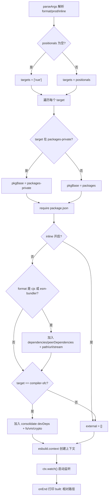
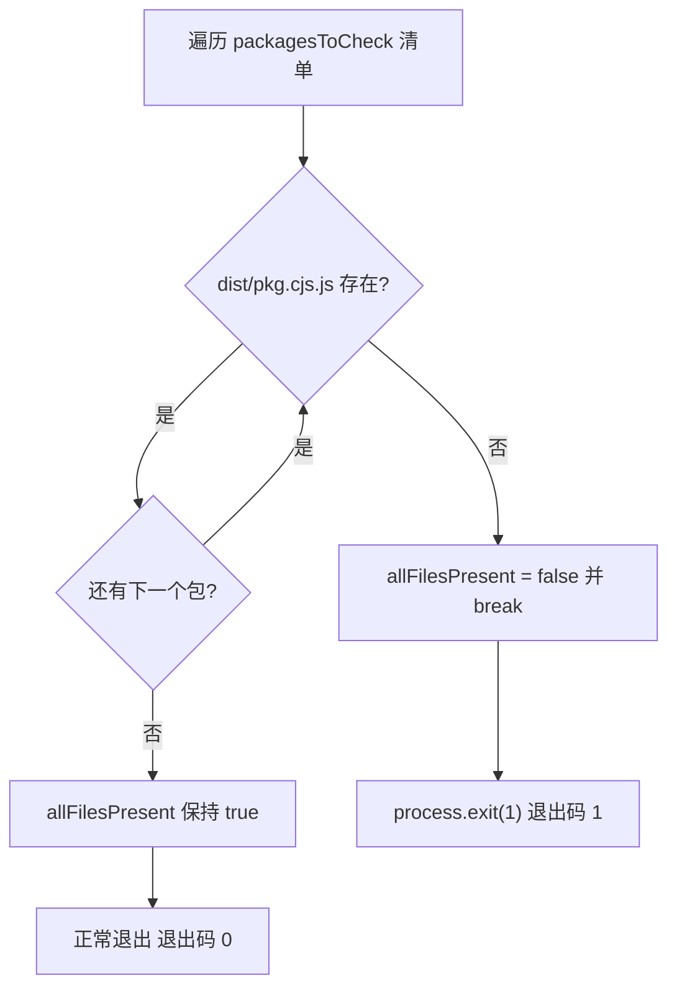
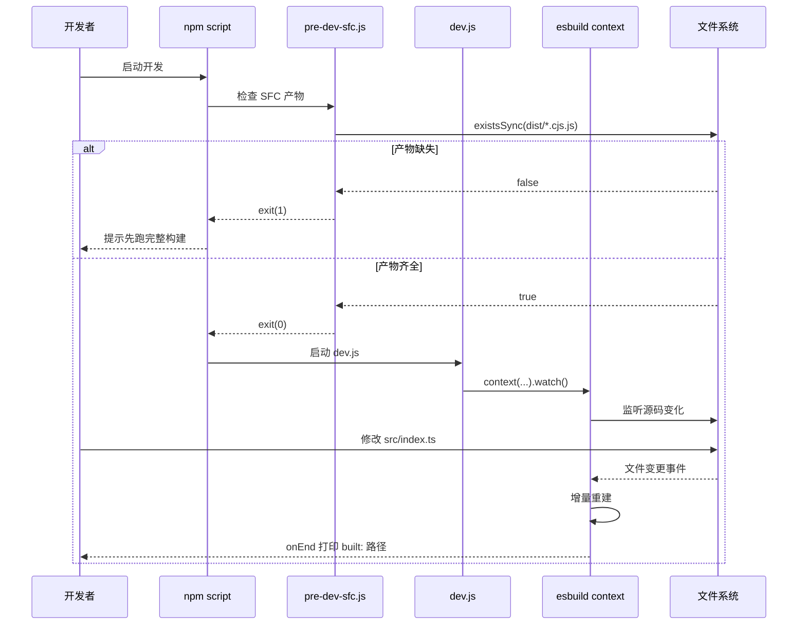

# collabore avec la précompilation SFC pour réaliser une boucle de retour de développement en millisecondes.

Chapitre 3 : Chaîne de développement : mécanisme de collaboration entre le script dev et la précompilation SFC`scripts/dev.js`Projet : vuejs/core`scripts/pre-dev-sfc.js`Progression du livre : Chapitre 3 / 14

# État de vérification : ancrage réel des numéros de ligne FACT

## Dans le chapitre précédent, nous avons suivi la chaîne complète de la construction de production, de l'analyse des paramètres à l'écriture des artefacts multi-formats sur disque ; cette chaîne vise la complétude et la conformité des artefacts. Or le besoin fondamental du mode développement est unique : modifier une ligne de code et voir immédiatement l'effet dans le navigateur. La chaîne de construction de production « analyser les paramètres → générer la configuration → empaqueter entièrement → écrire sur disque » prend des dizaines de secondes, ce qui ne peut absolument pas satisfaire ce besoin. Le dépôt Vue core maintient pour cela une chaîne de développement indépendante :

utiliser le mode watch d'esbuild pour la construction incrémentale,[FACT:scripts/dev.js:3-5]

précompiler le compilateur SFC avant la construction principale. Ce chapitre décompose le mécanisme de collaboration entre ces deux éléments.

## 3.1 dev.js : un constructeur incrémental qui mise sur esbuild pour la vitesse

Modèle intuitif`parseArgs`La construction de production ressemble à « la composition et l'impression officielles d'une imprimerie » — la qualité prime, la lenteur n'est pas grave ; la construction de développement ressemble à « un croquis au crayon sur un brouillon » — pas besoin d'être beau, juste immédiat. Vue choisit esbuild plutôt que Rollup pour ce croquis, la raison étant écrite dans le commentaire en tête de fichier : les artefacts de Rollup sont plus petits, le Tree-shaking meilleur, mais esbuild est bien plus rapide.`format`Sans ce script, les développeurs devraient exécuter une construction de production complète à chaque modification, la boucle de retour passant de l'échelle de la milliseconde à celle de la minute, et l'expérience de hot reload disparaîtrait totalement.`global`）、`prod`Analyse des paramètres et déduction des formats`false`）、`inline`(par défaut`false`）。[FACT:scripts/dev.js:18-40]les paramètres positionnels sont collectés comme`targets`, s'ils sont vides, la valeur par défaut est`['vue']`。[FACT:scripts/dev.js:42-53]

> **[Design Inference & Architectural Trade-offs]**
> Il y a ici un détail facile à négliger :`rawFormat`et`format`sont deux affectations distinctes.`parseArgs`le`default: 'global'`de`rawFormat`garantit déjà que`const format = rawFormat || 'global'`a une valeur, mais le script écrit tout de même[FACT:scripts/dev.js:42]comme filet de sécurité.`parseArgs`C'est une écriture défensive, pour éviter que`format.startsWith`ne change de comportement ou qu'une chaîne vide explicitement passée ne fasse lever une erreur en aval à

`format`La correspondance vers le format de sortie esbuild se fait en trois branches : ce qui commence par`global`est mappé vers`iife`, ce qui est égal à`cjs`est mappé vers`cjs`, tout le reste est`esm`。[FACT:scripts/dev.js:42-53]Le suffixe du nom de fichier produit est quant à lui géré séparément par le suffixe`-runtime`:`global-runtime`devient`runtime.global`, le reste reste inchangé.[FACT:scripts/dev.js:42-53]

## Localisation du package cible et chemin de sortie

Le script lit d'abord la liste du répertoire`packages-private`pour déterminer si le package cible est un package public ou privé.[FACT:scripts/dev.js:56]Pour chaque target, il détermine si le chemin de base du package est`packages`ou`packages-private`, puis`require`son`package.json`pour obtenir`version`et`buildOptions`。[FACT:scripts/dev.js:58-63]

Le nom du fichier de sortie a un cas particulier :`vue-compat`la cible`vue`est renommée en`vue-compat.global.js`。[FACT:scripts/dev.js:64-69], pour éviter que le produit ne s'appelle`packages/vue/dist/vue.global.js`，`prod`Le chemin final a la forme`prod.`insère le segment

## lorsque la condition est vraie.

`external`Résolution des external : éviter d'inclure les dépendances dans le produit

Le tableau`inline`détermine quels modules ne sont pas bundlés. La logique se divise en deux niveaux :`cjs`Premier niveau, lorsque`esm-bundler`n'est pas activé et que le format est`dependencies`、`peerDependencies`ou contient`path`、`url`、`stream`, toutes les clés de[FACT:scripts/dev.js:76-88]sont ajoutées aux external, et les trois modules intégrés Node`@vue/compiler-sfc`sont codés en dur.`server-renderer`Un commentaire précise explicitement que ces trois sont destinés à

et`compiler-sfc`Deuxième niveau, pour la cible`@vue/consolidate`, on résout en plus les`devDependencies`de`fs`、`vm`、`crypto`, et on les externalise avec[FACT:scripts/dev.js:90-112]etc.`react-dom/server`、`teacup/lib/express`、`arc-templates/dist/es5`、`then-pug`、`then-jade`Le code code également en dur des chemins de moteurs de template comme

> **[Design Inference & Architectural Trade-offs]**
> 〔Inférence de conception et compromis architecturaux〕`rollup.config.js`Cette logique est hautement redondante avec`TODO this logic is largely duplicated from rollup.config.js`, et les commentaires du code source l'admettent (

## ). La raison pour laquelle aucune fonction commune n'a été extraite est qu'il existe de subtiles différences dans la stratégie external entre dev et prod (dev externalise de manière plus agressive pour accélérer la construction), et une unification forcée augmenterait au contraire le couplage.

Plugins et injection de define`log-rebuild`Le tableau de plugins ne contient par défaut qu'un seul`onEnd`, qui affiche dans le hook[FACT:scripts/dev.js:115-124]le chemin relatif du produit de construction.

> **[Design Inference & Architectural Trade-offs]**
> 〔Inférence de conception et compromis architecturaux〕`cjs`Le deuxième plugin est conditionnel : lorsque le format n'est pas`buildOptions.enableNonBrowserBranches`et que le`polyfillNode()`。[FACT:scripts/dev.js:126-128]du package est vrai, on monte`compiler-sfc`Des packages comme

`define`(par exemple[FACT:scripts/dev.js:141-159]) empruntent toujours la branche Node dans une construction navigateur, et nécessitent un polyfill des modules intégrés Node pour fonctionner dans un environnement navigateur.`__XXX__`Le bloc

- `__COMMIT__`est la partie la plus dense en informations de ce chapitre.`"dev"`，`__VERSION__`Il remplace toutes les macros
- `__DEV__`du code source par des littéraux :`prod`est fixé à`__TEST__`prend la version du package ;`false`；
- `__BROWSER__`est déterminé par le flag`format !== 'cjs' && !pkg.buildOptions?.enableNonBrowserBranches`。[FACT:scripts/dev.js:146-148],
- `__SSR__`est toujours`format !== 'global'`La dérivation de
- `__COMPAT__`est la plus subtile :`vue-compat`Autrement dit, seul « non-cjs et package ne supportant pas la branche non-navigateur » est marqué comme environnement navigateur ;
- vaut`__FEATURE_SUSPENSE__`、`__FEATURE_OPTIONS_API__`、`__FEATURE_PROD_DEVTOOLS__`、`__FEATURE_PROD_HYDRATION_MISMATCH_DETAILS__`, c'est-à-dire que la construction global n'active pas la branche SSR ;

est déterminé par le fait que le target est`vitest.config.ts`ou non ;`define`les trois feature flags ([FACT:vitest.config.ts:6-21]) sont tous codés en dur en mode dev.`__TEST__`Ces macros correspondent une à une au bloc`true`、`__DEV__`dans`true`L'environnement de test définit

## à

et`esbuild.context(...).then(ctx => ctx.watch())`。[FACT:scripts/dev.js:130-161] `context`à`watch()`, et la différence avec la construction dev est précisément le point de distinction entre les deux états d'exécution « test vs développement ».`onEnd`Démarrage du mode watch

# crée le contexte de construction mais ne l'exécute pas immédiatement,

## ne lance réellement la surveillance de fichiers qu'ensuite. Par la suite, esbuild maintient en interne le graphe de dépendances, tout changement d'un fichier dépendu déclenche une reconstruction incrémentale, et le callback de fin de reconstruction

affiche le journal.`compiler-sfc`Copier`compiler-core`3.2 pre-dev-sfc.js : la sentinelle de précompilation qui brise les dépendances circulaires`compiler-core`Modèle intuitif`compiler-sfc`Imaginez un dilemme de « l'œuf et la poule » :`.vue`le code source de`pre-dev-sfc.js`importe

## , et

en mode développement a besoin de`compiler-sfc`、`compiler-core`、`compiler-dom`、`compiler-ssr`、`shared`。[FACT:scripts/pre-dev-sfc.js:4-10]pour traiter les fichiers`packages/${pkg}/dist/${pkg}.cjs.js`. Si les deux reposent sur la compilation en temps réel d'esbuild watch, celui qui compile en premier se bloque.[FACT:scripts/pre-dev-sfc.js:4-23]

Le rôle de`allFilesPresent`est de « faire éclore l'œuf d'abord, puis élever la poule » — avant le démarrage de la construction principale, s'assurer que les produits CJS de ces packages existent déjà.`false`Liste de vérification et logique de court-circuit`break`Le script maintient une liste fixe :[FACT:scripts/pre-dev-sfc.js:20-21]Pour chaque package, il vérifie si`allFilesPresent`existe.`process.exit(1)`Si un seul est manquant,[FACT:scripts/pre-dev-sfc.js:25-27]

## est mis à

et`exit(1)`immédiatement, sans vérifier les packages restants.`&&`Enfin, si

# se termine avec un code non nul.

`scripts/dev.js`Sémantique du code de sortie`scripts/aliases.js`Ce script n'effectue lui-même aucune compilation, il ne fait qu'une « assertion d'existence ».[FACT:scripts/aliases.js:7-7]

## est un signal destiné à l'appelant supérieur (généralement la chaîne

`resolveEntryForPkg`d'un npm script ou un script CI) : les produits sont incomplets, il faut d'abord lancer une construction complète. Si tout existe, il se termine normalement (code de sortie 0), et la construction principale continue.`packages/${p}/src/index.ts`。[FACT:scripts/aliases.js:7-7]Copier`vue`、`vue/compiler-sfc`、`vue/server-renderer`、`@vue/compat`。[FACT:scripts/aliases.js:16-21]

3.3 aliases.js et vitest.config.ts : l'autre moitié de la chaîne en mode développement`packages`résout la question de « comment générer rapidement les produits », mais en développement il existe un autre chemin : lancer les tests.`vue`fournit des alias de chemins partagés pour vitest et rollup.`nonSrcPackages`（`sfc-playground`、`template-explorer`、`dts-test`Logique de génération des alias`@vue/${dir}`mappe les noms de packages vers[FACT:scripts/aliases.js:23-35]

> **[Design Inference & Architectural Trade-offs]**
> Ensuite, il parcourt tous les sous-répertoires du répertoire`nonSrcPackages`La liste d'exclusion s'explique par le fait que ces trois paquets n'ont pas de`src/index.ts`point d'entrée, et un mappage forcé entraînerait un échec de résolution.

## Le define et la consommation d'alias de vitest

`vitest.config.ts`import direct`entries`en tant que`resolve.alias`。[FACT:vitest.config.ts:3][FACT:vitest.config.ts:22-24]son`define`bloc contraste avec l'injection de macros de dev.js : environnement de test`__DEV__: true`、`__TEST__: true`、`__BROWSER__: false`、`__CJS__: true`。[FACT:vitest.config.ts:6-21]

Les tests sont divisés en cinq projets :`unit`、`unit-gc`、`unit-jsdom`、`e2e`、`e2e-browser`。[FACT:vitest.config.ts:51-118]parmi lesquels`unit-gc`utilise`pool: 'forks'`et passe`--expose-gc`, dédié aux tests SSR nécessitant un déclenchement manuel du GC.[FACT:vitest.config.ts:65-76] `e2e-browser`active quant à lui une instance chromium de playwright pour exécuter les tests liés à Transition.[FACT:vitest.config.ts:99-117]

# Réflexion de conception

**Pourquoi utiliser esbuild en dev et Rollup en prod ?**Ce n'est pas un choix technologique arbitraire, mais les contraintes diffèrent selon les deux scénarios. En développement, la taille du produit importe peu, mais la latence de retour est critique ; en production, c'est l'inverse. esbuild, écrit en Go et hautement parallélisé, offre un démarrage à froid et une construction incrémentale un ordre de grandeur plus rapides, mais ses capacités de Tree-shaking et de découpage de code sont inférieures à celles de Rollup.[FACT:scripts/dev.js:3-5]Utiliser deux ensembles d'outils pour servir deux scénarios distincts est un compromis pragmatique d'ingénierie.

> **[Design Inference & Architectural Trade-offs]**
> **Pourquoi pre-dev-sfc ne fait-il que vérifier sans compiler ?**S'il déclenchait lui-même la compilation, il réintroduirait la dépendance circulaire — il doit compiler`compiler-sfc`, et le processus de compilation lui-même peut dépendre des`compiler-sfc`produits de. Il ne peut donc faire qu'une « assertion », exposant le fait « produit manquant » à la couche supérieure, qui décide d'exécuter une construction complète ou de quitter avec une erreur. C'est un « mode sentinelle » : ne pas résoudre le problème, seulement le signaler.

**La duplication de la liste external est-elle une dette technique ?**La logique external de dev.js et rollup.config.js est dupliquée, et les commentaires du code source l'admettent.[FACT:scripts/dev.js:73]Mais les ensembles external des deux ne sont pas totalement identiques — dev externalise de manière plus agressive pour la vitesse. Extraire de force une fonction commune nécessiterait d'introduire un commutateur de différence paramétré, rendant les deux logiques plus difficiles à lire. C'est un arbitrage typique de « la duplication vaut mieux qu'une mauvaise abstraction ».

# Résumé de ce chapitre

Ce chapitre décompose les trois pièces du puzzle de la chaîne de développement de Vue core :

1. **`scripts/dev.js`**: utiliser le`context().watch()`d'esbuild pour réaliser une construction incrémentale, via`parseArgs`analyser le format et les indicateurs, dynamiquement`require`le paquet cible`package.json`localiser le chemin de sortie, injecter`__DEV__`、`__BROWSER__`et autres macros pour contrôler la compilation conditionnelle, et utiliser`log-rebuild`un plugin pour afficher un retour après chaque reconstruction.

2. **`scripts/pre-dev-sfc.js`**: vérifier avant la construction principale si les produits CJS des cinq paquets principaux existent, et en cas d'absence, court-circuiter avec le code de sortie 1, évitant un blocage de construction dû à une dépendance circulaire.

3. **`scripts/aliases.js` + `vitest.config.ts`**: fournir des alias de chemin partagés pour la chaîne de test, avec des éléments spéciaux codés en dur et une analyse dynamique des éléments génériques, accompagné d'une configuration multi-projets couvrant cinq scénarios de test : unitaire, GC, jsdom, e2e et e2e navigateur.

# Réflexions et auto-évaluation de ce chapitre

Q1 : Si l'on retire`scripts/pre-dev-sfc.js`dans`break`(c'est-à-dire vérifier tous les paquets avant de décider de quitter), dans quel scénario l'expérience développeur se dégraderait-elle ? Pourquoi l'auteur du code source a-t-il choisi de « court-circuiter dès le premier manque détecté » ?

**Analyse de référence**：

[FACT:scripts/pre-dev-sfc.js:4-23]

`break`se situe dans`if (!fs.existsSync(...))`la branche, et dès qu'un produit de paquet manquant est détecté, la boucle est immédiatement interrompue.

Si l'on retire`break`, le script continuerait de vérifier les paquets restants, et finalement`allFilesPresent`resterait`false`, le code de sortie resterait 1,**fonctionnellement équivalent**. Mais la différence réside dans :

1. **Performance**: les cinq`existsSync`appels sont eux-mêmes rapides, mais si la liste s'étend à des dizaines de paquets, le court-circuit économise un grand nombre d'appels système stat inutiles.

2. **Sémantique**: le court-circuit exprime « s'il en manque un seul, l'ensemble est incomplet » — c'est une assertion booléenne, il n'est pas nécessaire de savoir combien manquent précisément. Continuer la vérification ne produit aucune information supplémentaire.

3. **Expérience développeur**: en réalité, ce qui se dégrade, c'est le « message d'erreur ». Le script actuel n'indique pas quel paquet manque, le développeur ne voit que le code de sortie 1. Si l'on retirait`break`et ajoutait des logs, on pourrait au contraire indiquer au développeur « il manque compiler-core et shared » — mais cela nécessite du code supplémentaire. L'auteur a choisi l'implémentation la plus simple, laissant le diagnostic de « lequel manque » au script de construction supérieur.

Donc`break`le motif central est « sémantique d'assertion + performance », et non l'optimisation de l'expérience.

Q2: `scripts/dev.js`dans`__BROWSER__`la déduction de`format !== 'cjs' && !pkg.buildOptions?.enableNonBrowserBranches`est`buildOptions.enableNonBrowserBranches`. Supposons qu'un paquet ait`true`pour`-f global`, et que le développeur construise avec`__BROWSER__`, alors`false`est`true`. Quelle en serait la conséquence ? Que se passerait-il si l'on modifiait par erreur en

**Analyse de référence**：

[FACT:scripts/dev.js:146-148]

Lorsque`format = 'global'`et`enableNonBrowserBranches = true`:

- `format !== 'cjs'`est`true`
- `!pkg.buildOptions?.enableNonBrowserBranches`est`false`
- global`__BROWSER__ = false`

Cela signifie que toutes les branches`if (__BROWSER__)`du code source sont remplacées par le define d'esbuild en`if (false)`, le code spécifique au navigateur est supprimé par Tree-shaking, et les branches non-navigateur (logique spécifique à Node) sont conservées.

**Conséquence**: le produit de construction global est censé s'exécuter dans le navigateur, mais il contient des branches spécifiques à Node. Si ces branches référencent`fs`、`path`et autres modules intégrés de Node, le navigateur signalera « module non défini » au chargement. C'est précisément pourquoi`enableNonBrowserBranches`les paquets pour lesquels c'est vrai (comme`compiler-sfc`) ne sont généralement pas utilisés pour la construction global, ou nécessitent`polyfillNode()`un plugin de secours.[FACT:scripts/dev.js:126-128]

**Si l'on modifie par erreur en`true`**：`__BROWSER__ = true`, la branche navigateur est conservée et la branche Node supprimée. Pour`compiler-sfc`ce type de paquet qui doit exécuter la compilation SFC dans l'environnement Node, cela entraînerait la suppression par Tree-shaking des fonctionnalités essentielles (lecture de fichiers, appels aux API Node), et le produit signalerait « fonction non définie » à l'exécution dans Node.

Q3: `scripts/aliases.js`dans, lors de l'analyse dynamique du`packages`répertoire, a sauté`nonSrcPackages`（`sfc-playground`、`template-explorer`、`dts-test`). Si un nouveau paquet est ajouté au`packages`répertoire mais sans`src/index.ts`, et n'a pas été ajouté à`nonSrcPackages`, que se passe-t-il ? À quelle étape vitest signalera-t-il une erreur lors de l'exécution ?

**Analyse de référence**：

[FACT:scripts/aliases.js:23-35]

La logique de balayage dynamique est la suivante : pour chaque répertoire, si`dir !== 'vue'`, n'est pas dans`nonSrcPackages`, la clé n'existe pas, et c'est un répertoire, alors on l'ajoute à`entries['@vue/${dir}'] = resolveEntryForPkg(dir)`。

`resolveEntryForPkg`renvoie le chemin de`packages/${p}/src/index.ts`.[FACT:scripts/aliases.js:7-7]Notez qu'il**ne vérifie pas si le fichier existe**, il ne fait que concaténer le chemin.

**Conséquence**: l'alias sera enregistré, mais pointera vers un fichier inexistant. Lorsque vitest résout un import, si un fichier de test importe ce package, le plugin resolve de Vite tentera de charger ce chemin et signalera « impossible de résoudre le module » ou « fichier inexistant ».

**Étape de l'erreur**: ce n'est pas au moment de l'exécution de`aliases.js`(il ne fait que de la concaténation de chaînes), mais après le démarrage de vitest, lors de la première résolution de cet import. Si aucun test n'importe ce package, aucune erreur ne sera signalée — l'alias reste simplement dans l'objet`entries`.

**Moyen de contournement**: ajoutez ce type de package sans`src/index.ts`à`nonSrcPackages`, ou assurez-vous que le nouveau package possède un point d'entrée standard. C'est aussi pourquoi`nonSrcPackages`doit être maintenu manuellement — c'est la liste des exceptions à la règle « convention plutôt que configuration ».

Les frontières de la collaboration entre les trois sont très claires :`pre-dev-sfc`gère « si les artefacts sont prêts »,`dev.js`gère « comment mettre à jour rapidement les artefacts »,`aliases`gère « comment les tests résolvent le code source ». La chaîne en mode développement résout le problème de vitesse, mais il existe une autre catégorie d'optimisations plus discrètes au moment de la construction — celles qui sont effectuées avant que le code ne soit exécuté par le navigateur. Le chapitre suivant abordera la magie de la compilation, pour voir comment l'inlining des enums et le mécanisme de vérification du Tree-shaking remplacent les TypeScript enum par des littéraux au moment de la construction, et garantissent que la promesse d'importation à la demande n'est pas brisée.
