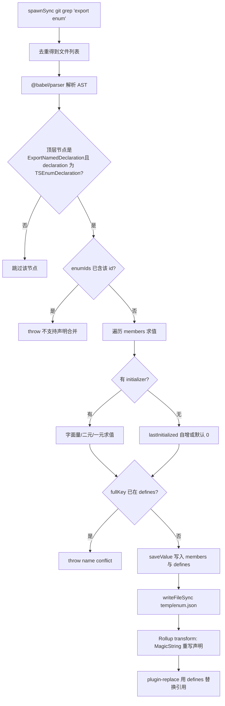
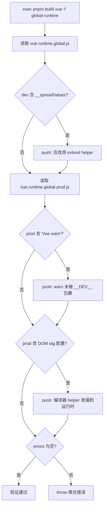

# Chapitre 4 : Magie de la compilation : inlining des enums et mécanisme de vérification du Tree-shaking

Dans le chapitre précédent, nous avons vu comment la chaîne en mode développement échange la surveillance de fichiers et la construction incrémentale contre la vitesse de « modifier une ligne et prendre effet immédiatement ». Mais au-delà de la vitesse, Vue a une autre contrainte plus discrète : la taille des artefacts publiés doit être contrôlable. L'un des ennemis de cette contrainte est l'enum de TypeScript — il s'agit d'un objet réellement existant à l'exécution, qui brise le Tree-shaking. Ce chapitre entre dans la phase de compilation, pour voir comment scripts/inline-enums.js « dissout » les enums en littéraux avant que le code ne soit exécuté par le navigateur ; puis comment scripts/verify-treeshaking.js, après la construction, utilise les chaînes des artefacts pour vérifier en sens inverse que la promesse d'« importation à la demande » n'a pas été silencieusement brisée.

# 4.1 Inlining des enums : dissoudre les objets d'exécution en littéraux

## Modèle intuitif

Imaginez que vous écrivez une recette dans laquelle « un peu de sel » apparaît à plusieurs reprises. Si à chaque fois que vous cuisinez, vous devez feuilleter l'annexe pour vérifier que « un peu = 3 grammes », c'est à la fois lent et encombrant. Ce que fait l'inlining des enums, c'est remplacer directement dans tout le livre « un peu de sel » par « 3 grammes de sel » avant l'impression, puis arracher la page de l'annexe. Pour le lecteur (l'exécution), le résultat est exactement le même, mais le livre est plus fin.

Sans cela, quel désastre le système affronterait-il ? Un`enum`ordinaire de TypeScript génère après compilation un véritable objet littéral, avec un mapping bidirectionnel (`Enum[Enum.A] === 'A'`). Cet objet est**une déclaration au niveau du module avec effets de bord**, Rollup ne peut pas prouver qu'il n'est pas utilisé, il doit donc le conserver — même si vous n'importez qu'un seul de ses membres, l'objet enum entier ainsi que le mapping inverse seront inclus dans l'artefact.[FACT:scripts/inline-enums.js:3-9]Le commentaire de`const enum`est très explicite : ils utilisaient auparavant

## , mais en raison de l'issue #1228, ils sont passés à un enum ordinaire, et utilisent donc ce script pour « récupérer manuellement le bénéfice zéro coût du const enum ».

Structures de données et disposition mémoire[FACT:scripts/inline-enums.js:33-36]

- `EnumMember`：`{ name, value }`Le cœur du script réside dans trois définitions de types ; les comprendre, c'est comprendre tout le flux de données.
- `EnumDeclaration`：`{ id, range: [start, end], members }`。`range`, le nom d'un membre d'enum individuel et le littéral après évaluation.**est**l'offset en octets dans le code source`export enum X { ... }`, pointant vers la position de début et de fin de toute la déclaration
- `EnumData`：`{ declarations, defines }`。`declarations`dans le fichier — c'est l'ancre pour le remplacement précis ultérieur par MagicString.`defines`est indexé par chemin de fichier, enregistrant les plages de remplacement de toutes les déclarations d'enum dans ce fichier ;` `est un mapping plat, dont la clé est le littéral après `` `` 形式的字符串，值是 `${nomEnum}.${nomMembre}

JSON.stringify`.`defines`Il y a ici une conception clé :**la clé de**。[FACT:scripts/inline-enums.js:98-103]ne contient pas le chemin de fichier`ErrorCodes`. Le commentaire explique la raison —`@vue/compiler-core`peut exister simultanément dans`@vue/runtime-core`et`ErrorCodes.__EXTEND_POINT__`, donc les enums de même nom peuvent exister dans différents fichiers ; mais le même`fullKey in defines`n'est pas autorisé à se répéter dans deux enums de même nom, sinon`name conflict`est atteint et

est directement levé. C'est une contrainte d'« unicité globale par nom de membre », et non d'« unicité globale par nom d'enum ».`temp/enum.json`。[FACT:scripts/inline-enums.js:33-36]Le cache est stocké dans`scanEnums()`Pourquoi faut-il l'écrire sur disque ? Parce que**n'est appelé qu'une seule fois à l'entrée de la construction, tandis que Rollup démarre**。[FACT:scripts/inline-enums.js:39-41]des processus indépendants`inlineEnums()`pour chaque package et chaque format. Le commentaire précise : les données doivent être partagées entre les processus Rollup concurrents, elles doivent donc être sérialisées sur disque et relues par le

## de chaque processus.

**Step-by-Step : du grep au remplacement par littéraux`export enum`Première étape : grep tous les fichiers contenant**[FACT:scripts/inline-enums.js:51-61].`spawnSync('git', ['grep', 'export enum'])`utilise`path:line:content`, la sortie ressemble à`:`, puis on découpe le premier segment (chemin de fichier) selon`Set`, et on déduplique avec`git grep`au lieu de parcourir le système de fichiers — il ne scanne naturellement que les fichiers suivis par Git, excluant automatiquement`node_modules`et les artefacts de build.

**Deuxième étape : Babel analyse et collecte les informations d'énumération.**[FACT:scripts/inline-enums.js:64-70]Pour chaque fichier, on utilise`@babel/parser`avec`typescript`le plugin,`sourceType: 'module'`pour analyser en AST, puis on ne parcourt que`ast.program.body`les nœuds de premier niveau.[FACT:scripts/inline-enums.js:74-79]On ne reconnaît que`ExportNamedDeclaration`et ses`declaration.type === 'TSEnumDeclaration'`nœuds — c'est-à-dire que**les enum non exportés ne seront pas traités**。

Pour chaque déclaration d'énumération, le script évalue chaque membre. L'évaluation des membres suit trois chemins :

1. **Initialisation littérale**：`StringLiteral`ou`NumericLiteral`on prend directement`init.value`。[FACT:scripts/inline-enums.js:114-119]

2. **Expression binaire**: comme`1 << 2`. Récursivement`resolveValue`on traite les opérandes gauche et droit, les opérandes pouvant être des littéraux ou des`MemberExpression`(c'est-à-dire une référence à un membre d'énumération déjà défini).[FACT:scripts/inline-enums.js:121-151]Le point clé est la branche`MemberExpression`: elle utilise`content.slice(node.start, node.end)`pour extraire**du texte source original**la chaîne d'expression (comme`ErrorCodes.FOO`), puis consulte`defines`. Si introuvable, on lance`unhandled enum initialization expression`。[FACT:scripts/inline-enums.js:132-141]Cela explique pourquoi`defines`doit être un mapping plat global — lors d'une référence inter-énumérations, le référencé peut provenir d'un autre fichier, mais la clé ne reconnaît que`枚举名.成员名`。

3. **Expression unaire**: comme`-1`, on assemble la chaîne`-1`puis on utilise`evaluate`pour évaluer.[FACT:scripts/inline-enums.js:152-163]

L'évaluation elle-même utilise`new Function('return ' + exp)()`。[FACT:scripts/inline-enums.js:39-41]C'est un**eval contrôlé**: l'entrée provient de fragments d'AST déjà analysés dans le code source, pas d'une entrée utilisateur arbitraire, donc la frontière de sécurité est contrôlable.

**Troisième étape : traitement des membres sans initialiseur (sémantique d'auto-incrémentation).**[FACT:scripts/inline-enums.js:171-183]Si un membre n'a pas`initializer`: le premier membre vaut par défaut`0`; si les membres suivants ont`lastInitialized`qui est un nombre alors`++`; si c'est une chaîne alors on lance`wrong enum initialization sequence`— car les membres d'énumération de type chaîne n'autorisent pas l'auto-incrémentation implicite. C'est exactement la sémantique des enums TypeScript.

**Quatrième étape : écrire le cache et retourner la fonction de nettoyage.**[FACT:scripts/inline-enums.js:200-213] `scanEnums()`Retourne une closure, dont l'appel`rmSync`supprime le fichier de cache.`build.js`On l'utilise dans`try/finally`.[FACT:scripts/build.js:81-112]Cela garantit que même si une erreur survient en cours de build, le cache sera nettoyé et ne polluera pas le build suivant.

**Cinquième étape : remplacement lors de la phase transform de Rollup.** `inlineEnums()`On relit le cache et on construit un plugin Rollup.[FACT:scripts/inline-enums.js:219-234]Dans`transform(code, id)`, si`id`correspond à`enumData.declarations`, on utilise MagicString pour remplacer`[start, end]`cette déclaration par un littéral d'objet.[FACT:scripts/inline-enums.js:242-274]

La forme après remplacement est`export const X = { ... }`. Notez qu'il**ne s'agit pas simplement de supprimer l'énumération**, mais de la réécrire en littéral d'objet, et de générer en plus un mapping inverse pour les membres numériques :`JSON.stringify(value.toString()) + ': ' + JSON.stringify(name)`。[FACT:scripts/inline-enums.js:257-270]Le commentaire cite la règle reverse-mappings de la documentation officielle TypeScript : les membres d'énumération de type chaîne ne génèrent pas de mapping inverse, les membres numériques oui. Cela garantit que le comportement à l'exécution après remplacement est totalement identique à l'enum original.

Et ce qui élimine réellement le coût à l'exécution, c'est que`defines`est confié à`@rollup/plugin-replace`。[FACT:rollup.config.js:222-223]toutes les`X.Member`références à**sont**directement remplacées par des littéraux dans le plugin de remplacement, de sorte que le littéral d'objet réécrit, s'il n'est utilisé par personne, peut être éliminé par le Tree-shaking.

Le diagramme de flux ci-dessous décrit le chemin de décision complet, du grep au remplacement :

## Réflexions de conception et pièges

**Pourquoi utiliser MagicString plutôt que régénérer tout le fichier ?**Parce que`s.update(start, end, ...)`ne remplace que le segment de la déclaration d'énumération, le reste des octets du code source reste totalement inchangé,`s.generateMap()`et on peut encore générer une sourcemap précise.[FACT:scripts/inline-enums.js:277-281]Si l'on utilisait Babel pour réimprimer tout l'AST, on perdrait le formatage original, les commentaires, et la qualité de la sourcemap se dégraderait.

**`range`Pourquoi`node.start/node.end`plutôt que`declaration.start`？**[FACT:scripts/inline-enums.js:189-193]ce qui est asserté est`node.start`(c'est-à-dire`ExportNamedDeclaration`le nœud), la plage de remplacement couvre`export enum X {...}`tout le segment, y compris`export`le mot-clé. Le texte de remplacement commence par`export const`, s'enchaînant parfaitement.

**Pièges :`defines`La contrainte d'unicité globale de**Si deux fichiers différents contiennent chacun un`ErrorCodes`, et que tous deux définissent`__EXTEND_POINT__`, le build échouera directement.[FACT:scripts/inline-enums.js:101-103]Ce n'est pas un bug, mais une conception délibérée — car`defines`est une table de remplacement globale, incapable de distinguer la provenance des fichiers. En production, lors de l'ajout d'un nouveau membre d'énumération, si son nom entre en conflit avec un membre d'énumération existant, cela explosera ici.

**Piège :`new Function`Le moment d'évaluation de**L'évaluation des expressions binaires se produit à la phase`scanEnums`, à ce moment`defines`peut ne pas encore contenir le membre référencé (si l'ordre de référence est inversé).[FACT:scripts/inline-enums.js:136-140]lancera`unhandled enum initialization expression`. Cela exige que la référence aux membres d'énumération respecte l'ordre du code source « définir avant de référencer ».

# 4.2 Vérification du Tree-shaking : prouver la promesse à rebours via les chaînes du produit

## Modèle intuitif

L'inlining des énumérations est une « optimisation a priori », mais l'optimisation prend-elle vraiment effet ? Si un helper est accidentellement conservé à cause d'une mauvaise écriture, la taille gonflera silencieusement, sans que le développeur ne s'en aperçoive.`verify-treeshaking.js`C'est le « contrôleur qualité a posteriori » : il construit le produit, puis inspecte comme lors d'une autopsie si**ce qui ne devrait pas apparaître apparaît**dans le produit. Sans lui, la promesse d'import à la demande de Vue pourrait silencieusement se briser après une refactorisation, jusqu'à ce que les utilisateurs se plaignent de la taille du bundle.

## Structures de données et éléments de vérification

Ce script n'a pas de structure de données complexe, le cœur est un`errors`tableau et trois`includes`vérifications.[FACT:scripts/verify-treeshaking.js:6-6]Il construit d'abord`global-runtime`le format, puis lit respectivement les produits dev et prod.

Les trois vérifications correspondent à trois types d'« échecs de Tree-shaking » :

1. **Le produit dev contient`__spreadValues`**。[FACT:scripts/verify-treeshaking.js:13-19]C'est le helper généré par esbuild pour`{ ...obj }`la syntaxe de spread d'objet. S'il apparaît, cela signifie que le code à l'exécution utilise le spread d'objet, alors que la convention Vue devrait utiliser`extend`le helper pour éviter du code supplémentaire.

2. **Le produit prod contient`Vue warn`**。[FACT:scripts/verify-treeshaking.js:26-31]Cela indique qu'il y a`warn()`des appels qui ne sont pas`__DEV__`enveloppés par la condition, entraînant une fuite du code d'avertissement dans le bundle de production.

3. **Le produit prod contient la liste de configuration des tags DOM**。[FACT:scripts/verify-treeshaking.js:33-42]comme`html,body,base`、`svg,animate,animateMotion`、`annotation,annotation-xml,maction`. Ce sont`isHTMLTag()`Les données internes à des helpers comme celui-ci ne devraient exister que dans le compilateur et être éliminées par le runtime. Si elles apparaissent dans les artefacts d'exécution, cela signifie que le chemin d'exécution utilise à tort un helper réservé au compilateur.

## Étape par étape : processus de validation

[FACT:scripts/verify-treeshaking.js:5-5]D'abord`exec('pnpm', ['build', 'vue', '-f', 'global-runtime'])`, construire uniquement`vue`le paquet`global-runtime`au format — c'est l'artefact d'exécution minimal, le plus susceptible d'exposer les fuites. Une fois la construction terminée, lire les deux fichiers en parallèle, vérifier un par un`includes`, et en cas de correspondance, pousser dans`errors`un message accompagné d'une explication. Enfin, si`errors.length`est non nul, lever une erreur agrégée.[FACT:scripts/verify-treeshaking.js:44-48]

## Réflexions de conception et pièges rencontrés

> **[Design Inference & Architectural Trade-offs]**
> **Pourquoi utiliser la chaîne`includes`plutôt qu'une analyse AST ?**Parce qu'il s'agit d'une « vérification sentinelle » et non d'une « analyse précise ». Elle ne vise pas l'exhaustivité, mais se limite à mettre en place des alertes à faible coût pour trois types de régressions réellement survenues dans l'historique. La correspondance de chaînes n'a aucune dépendance, aucun coût d'analyse, et reste efficace sur les artefacts minifiés — l'analyse AST est au contraire plus difficile après minification.

> **[Design Inference & Architectural Trade-offs]**
> **Pourquoi ne valider que`global-runtime`？**ce format inline toutes les dépendances (`external`est vide), c'est l'artefact le plus sensible au volume et le plus susceptible d'être introduit par erreur. S'il est propre, les autres formats le sont généralement aussi. De plus, sa construction est rapide, ce qui le rend adapté à une exécution fréquente en CI.

> **[Design Inference & Architectural Trade-offs]**
> **Piège : les éléments vérifiés constituent une « liste noire », qui devient obsolète à mesure que le code évolue.**Si un jour`isHTMLTag`la structure de données change,`html,body,base`cette chaîne n'apparaîtra plus et la vérification sera vide de sens. Cela exige que les mainteneurs mettent à jour ces chaînes sentinelles en même temps qu'ils modifient les helpers concernés. C'est le coût inhérent à une validation par liste noire.

# 4.3 Collaboration avec Rollup : ordre des plugins et injection de define

L'inlining des enums ne fonctionne pas isolément ; il s'insère dans le pipeline de plugins de Rollup. Comprendre sa position dans le pipeline permet de comprendre pourquoi`defines`doit être confié à`replace`plutôt qu'à`esbuild`。

[FACT:rollup.config.js:47-50]appeler au niveau supérieur du module de configuration`inlineEnums()`, pour déstructurer`[enumPlugin, enumDefines]`. Notez que cela s'exécute**au démarrage de chaque processus Rollup**, et lit le cache écrit par`scanEnums`.

L'ordre du tableau de plugins est :`json` → `alias` → `enumPlugin` → `...resolveReplace()` → `esbuild`。[FACT:rollup.config.js:324-339] `enumPlugin`est placé avant`replace`, ce qui signifie que la réécriture des déclarations d'enum a lieu en premier, puis`replace`utilise`defines`pour remplacer les références. Et`esbuild`est placé en dernier, chargé de la transpilation TS.

Pourquoi`defines`passe par`replace`et non par`esbuild`? Le commentaire de`define`？[FACT:rollup.config.js:220-221]donne la réponse : le define d'esbuild « est un peu strict, n'autorisant que des littéraux JSON ou des identifiants ». Or les noms de membres d'enum comme`ErrorCodes.__EXTEND_POINT__`sont des expressions de membre avec point, et le define d'esbuild ne peut pas traiter directement ce type de clé. Il faut donc utiliser`@rollup/plugin-replace`, qui prend en charge le remplacement de clés de chaîne arbitraires.[FACT:rollup.config.js:250-251]et définit`preventAssignment: true`, pour éviter de remplacer aussi le côté gauche des instructions d'affectation.

`resolveReplace()`Dans`const replacements = { ...enumDefines }`est la première étape.[FACT:rollup.config.js:222-223]Ensuite seulement viennent les remplacements de production`/*@__PURE__*/`d'annotations,`__DEV__`, etc. Cet ordre garantit que le remplacement des littéraux d'enum prend toujours effet.

# Réflexions de conception

**L'essence de l'inlining des enums est d'« échanger de la complexité au moment de la construction contre du volume à l'exécution ».**Il reproduit intégralement la sémantique du système de types de TypeScript (évaluation d'enum, auto-incrémentation, mapping inverse) au moment de la construction —`scanEnums`la logique d'évaluation dans est presque un sous-ensemble de l'évaluation d'enum du compilateur TS.[FACT:scripts/inline-enums.js:110-183]Cela entraîne un coût de maintenance : si TS ajoute une nouvelle syntaxe d'enum (comme des expressions constantes plus complexes), il faut suivre ici, sinon une erreur`unhandled`est levée. Mais le bénéfice est clair : zéro objet enum à l'exécution, et un Tree-shaking complet.

> **[Design Inference & Architectural Trade-offs]**
> **Le script de validation et le script d'inlining forment un couple « promesse et réalisation ».**Le script d'inlining promet que « les enums n'occupent pas de volume à l'exécution », le script de validation vérifie que « les autres codes n'en occupent pas non plus en cachette ». Les deux protègent ensemble le budget de taille de Vue. Cette conception appariée « optimisation + validation » est un modèle typique d'ingénierie des grandes bibliothèques front-end : toute optimisation nécessite une vérification automatisée pour prévenir les régressions.

**Le cache inter-processus est indispensable aux constructions concurrentes.** `scanEnums`Le modèle d'une exécution unique et de`inlineEnums`lectures multiples[FACT:scripts/inline-enums.js:39-41]résout le problème « un seul scan, N processus consommateurs ». Sans cache, chaque processus Rollup devrait refaire un grep + parsing, gaspillant massivement IO et CPU.

# Résumé de ce chapitre

# Réflexions et auto-évaluation de ce chapitre

Q1 : Si l'on supprime dans`scanEnums`la vérification de conflit de`saveValue`dans`if (fullKey in defines)`, dans quel scénario cela entraînerait-il des erreurs dans les artefacts de construction ?

**Analyse de référence**：

`defines`est un mapping plat global, dont les clés sont`枚举名.成员名`, sans chemin de fichier.[FACT:scripts/inline-enums.js:98-103]Après suppression de la vérification de conflit, si deux fichiers différents ont chacun un enum de même nom définissant un membre de même nom (par exemple`@vue/compiler-core`et`@vue/runtime-core`ont tous deux`ErrorCodes.__EXTEND_POINT__`), le dernier écrit écrasera le premier.

Conséquences :`defines['ErrorCodes.__EXTEND_POINT__']`il ne reste qu'une seule valeur, et`plugin-replace`lors du remplacement ne peut pas distinguer la provenance du fichier, et remplacera**tous**les`ErrorCodes.__EXTEND_POINT__`de tous les fichiers par la même valeur.[FACT:rollup.config.js:222-223]Ainsi, la valeur d'un membre d'enum d'un des paquets est silencieusement altérée, entraînant un comportement erroné à l'exécution et extrêmement difficile à diagnostiquer — car le code source semble parfaitement correct.

C'est précisément pourquoi le commentaire souligne « autoriser les enums de même nom entre fichiers, mais pas les membres de même nom ».[FACT:scripts/inline-enums.js:98-100]La vérification de conflit est le gardien qui empêche la pollution de la table de remplacement globale.

Q2 : Si l'on inverse l'ordre de`rollup.config.js`et de`enumPlugin`dans le tableau de plugins de`...resolveReplace()`, que se passerait-il ?

**Analyse de référence**：

L'ordre actuel est`enumPlugin`en premier,`replace`en second.[FACT:rollup.config.js:331-332]Le hook`transform`de Rollup s'exécute dans l'ordre du tableau de plugins.

Si l'on inverse,`replace`s'exécuterait en premier, alors que les déclarations d'enum sont encore sous leur forme originale`export enum X { ... }`.`replace`utilise`defines`pour remplacer les références`X.Member`— mais à ce moment les références existent encore, le remplacement peut prendre effet. Le problème survient ensuite lorsque`enumPlugin`s'exécute : il utilise`s.update(start, end, ...)`pour réécrire la section de déclaration.[FACT:scripts/inline-enums.js:250-273]Mais`replace`a déjà modifié`code`, et`enumPlugin`obtient`code`est`replace`la sortie de , dont le décalage d'octets a été enregistré avec`scanEnums`enregistré par`range`(basé sur le code source original)**ne correspond plus**。

Conséquence : MagicString découpera au mauvais décalage, et le produit aura une syntaxe corrompue. Cela révèle un contrat implicite du pipeline de plugins :**les transformations basées sur les décalages du code source doivent être exécutées en premier**, afin que les transformations suivantes puissent continuer en toute sécurité sur leur sortie.

Q3: `verify-treeshaking.js`ne vérifie que trois sentinelles de chaînes. Si une refactorisation fait passer`isHTMLTag`les données internes de`'html,body,base'`à une forme de tableau`['html','body','base']`, que fera le script de vérification ? Quel défaut de conception cela expose-t-il ?

**Analyse de référence**：

Le script de vérification utilise`prodBuild.includes('html,body,base')`pour vérifier.[FACT:scripts/verify-treeshaking.js:33-37]Si les données deviennent un tableau, la chaîne concaténée par des virgules n'apparaîtra plus dans le produit minifié,`includes`renvoie`false`, la vérification**passe silencieusement**— même si`isHTMLTag`a réellement fui dans le produit d'exécution.

Cela expose le défaut inhérent à la validation par chaînes en liste noire :**les chaînes sentinelles sont couplées à l'implémentation du code source ; dès que l'implémentation change, la validation devient invalide**. Elle ne peut pas détecter les « fuites inconnues », seulement les « fuites connues dont la forme de chaîne n'a pas changé ».

> **[Design Inference & Architectural Trade-offs]**
> Piste d'amélioration : on pourrait plutôt vérifier des identifiants plus stables (comme le nom de fonction`isHTMLTag`), ou interdire au niveau du code source, via une règle de lint, l'import à l'exécution d'helpers du compilateur, plutôt que de dépendre des chaînes du produit. Mais sous la contrainte de coût actuelle, les sentinelles de chaînes sont un compromis « suffisant et peu coûteux ».

L'inlining des enums résout « comment éliminer le coût d'exécution à la compilation », et le script de vérification résout « comment confirmer que l'optimisation n'a pas été cassée ». Mais les produits de build ne se limitent pas au JS ; il existe une autre catégorie de produits qui nécessitent également un traitement par pipeline — les fichiers de déclaration de types. Le chapitre suivant entrera dans le pipeline des produits de types, pour voir comment Vue génère, à partir du code source`.d.ts`, un paquet de types de niveau publication, et comment`dts-test`utilise des tests de contrat de types pour protéger la forme typée de l'API publique.

Ce chapitre a décomposé deux scripts clés de la phase de compilation. inline-enums.js utilise git grep pour localiser les enums, Babel pour analyser l'AST, new Function pour évaluer les membres, MagicString pour réécrire précisément les déclarations, et finalement, via la table de remplacement globale defines, transforme les références d'enum en littéraux, permettant à l'objet enum d'être éliminé par Tree-shaking. verify-treeshaking.js, quant à lui, vérifie le produit après le build à l'aide de sentinelles de chaînes, afin de garantir que trois types connus de fuites de Tree-shaking ne régressent pas. L'un s'occupe de « l'optimisation », l'autre de « vérifier que l'optimisation n'a pas été cassée » ; ensemble, ils protègent la promesse de taille de Vue. Ensuite, nous passerons de la phase de compilation à la chaîne de génération des produits de types, pour voir comment Vue garantit une stricte cohérence entre les types du code source et les types publiés.
