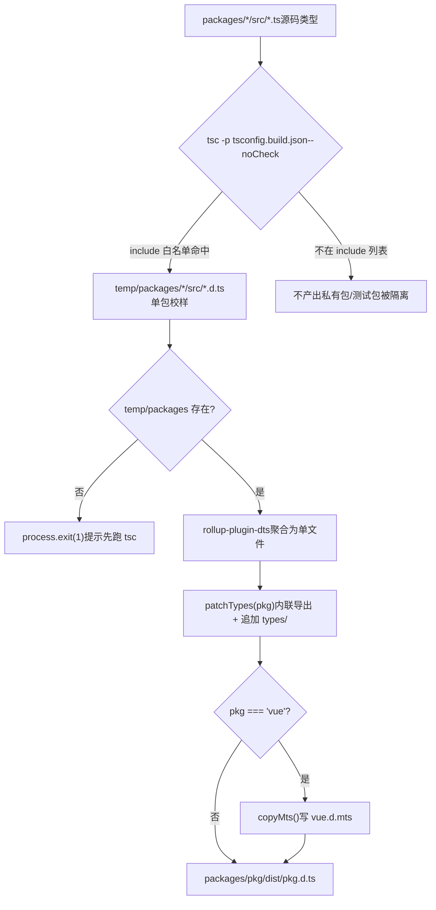
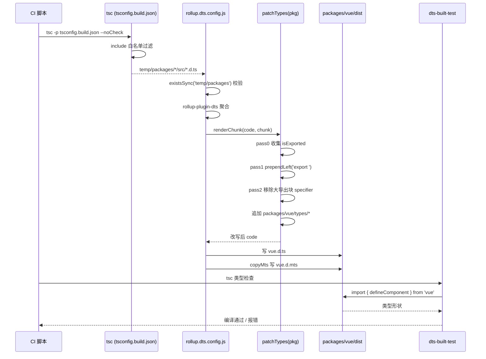

# Chapitre 5 : Pipeline des produits de types : des .d.ts sources au paquet de types de niveau publication

Dans le chapitre précédent, nous avons décomposé`inline-enums.js`et`verify-treeshaking.js`: l'un remplace les références d'enum par des littéraux pour que l'objet enum puisse être éliminé, l'autre confirme après le build, à l'aide de sentinelles de chaînes, que trois fuites connues ne régressent pas. Ensemble, ils protègent la promesse de taille d'exécution de Vue. Mais les produits de build ne se limitent pas au JS. Lorsque l'utilisateur`import { ref } from 'vue'`, les indications de type affichées par l'éditeur,`tsc`la vérification de type du code utilisateur, tout dépend d'une autre catégorie de produits —`.d.ts`les fichiers de déclaration. Si le produit JS est erroné, une erreur survient à l'exécution ; si le produit de types est erroné, une erreur survient côté utilisateur à la compilation, ou pire : une dérive silencieuse des types, le code utilisateur compile, mais la forme typée ne correspond pas au comportement réel à l'exécution. Ce chapitre retrace comment Vue agrège les types sources dispersés dans les différents sous-paquets`src`en un paquet de types de niveau publication, et utilise`dts-built-test`pour effectuer des tests fumigènes de types sur les produits de build réels.

# 5.1 Pipeline de types en deux phases : tsc produit, rollup agrège

## Modèle intuitif

Imaginez une chaîne d'impression : dans la première phase, chaque sous-paquet met en page son propre manuscrit (`.ts`code source) en une épreuve d'une page (`.d.ts`) ; dans la deuxième phase, on relie des dizaines d'épreuves dans l'ordre du catalogue pour en faire un livre (`.d.ts`de niveau publication), avec des en-têtes et pieds de page uniformes (déclarations d'export).

Sans cette chaîne, Vue devrait maintenir manuellement un fichier de types publié, et toute modification du code source exigerait une modification manuelle synchronisée — un terreau pour la dérive des types. L'approche de Vue est la suivante :**les produits de types sont entièrement générés à partir du code source, jamais écrits à la main**。

## Première phase : tsconfig.build.json délimite la portée de production

`tsconfig.build.json`est la configuration de la première phase de cette chaîne. Elle hérite de la racine`tsconfig.json`, et ne couvre que les options liées au build.

[FACT:tsconfig.build.json:3-9]

Décomposition des options clés une par une :

- `declaration: true`: demander à tsc de générer pour chaque fichier source le`.d.ts`。
- `emitDeclarationOnly: true`：**correspondant, uniquement des types, pas de JS**. Le JS est pris en charge par Rollup ; ici, tsc est purement un extracteur de types.
- `stripInternal: true`: toute déclaration marquée`@internal`est retirée de`.d.ts`. C'est la première barrière par laquelle Vue contrôle la surface de l'API publique — même si un détail d'implémentation interne est`export`, tant qu'il porte`@internal`, il ne fuira pas dans les types publiés.
- `composite: false`: désactiver le mode de build incrémental des références de projet (project references). Vue n'a pas besoin ici d'incrémentalité inter-paquets ; le désactiver évite l'état supplémentaire apporté par`.tsbuildinfo`.

`include`La liste  délimite précisément quels répertoires participent à la production :

[FACT:tsconfig.build.json:10-23]

Notez ici**ne liste que 12 répertoires**, et non l'ensemble`packages/`。`packages-private/`、`packages/dts-test/`、`packages/sfc-playground/`etc. n'en font pas partie. Cela signifie : les types des paquets privés et des paquets de test**ne seront jamais**entrez dans les artefacts de publication. Il s'agit d'une isolation physique — non pas par convention, mais par configuration.

> **[Design Inference & Architectural Trade-offs]**
> Pourquoi utiliser une liste blanche plutôt qu'une liste noire ? Parce que l'ajout de sous-paquets dans un monorepo est monnaie courante. Si l'on utilisait une`exclude`liste noire, lors de l'ajout d'un paquet privé, si l'on oublie de l'ajouter à exclude, ses types se glisseraient silencieusement dans les artefacts de publication. La liste blanche, à l'inverse : les nouveaux paquets ne participent pas à la construction par défaut et doivent être ajoutés explicitement, ce qui respecte le principe de « valeurs par défaut sûres ».

Après exécution de`tsc -p tsconfig.build.json --noCheck`, les artefacts se trouvent dans`temp/packages/<pkg>/src/*.d.ts`. Notez`--noCheck`: on saute la vérification de types, on fait uniquement l'emit. La vérification de types est assurée séparément par`tsc --noEmit`, on ne la répète pas lors de la construction, ce qui permet de gagner du temps.

## Deuxième phase : agrégation par rollup.dts.config.js

La deuxième phase est pilotée par`rollup.dts.config.js`. Son point d'entrée effectue d'abord une validation préalable :

[FACT:rollup.dts.config.js:15-22]

Si`temp/packages`n'existe pas, cela signifie que la première phase n'a pas été exécutée, le script fait directement`process.exit(1)`et indique d'exécuter d'abord`tsc`. C'est le**contrat d'ordre**du pipeline : la phase rollup dépend fortement des artefacts de la phase tsc, les deux sont indispensables.

Ensuite, il lit tous les répertoires de sous-paquets et prend en charge la variable d'environnement`TARGETS`pour une construction en sous-ensemble :

[FACT:rollup.dts.config.js:15-22]

`TARGETS`Ce mécanisme permet de ne reconstruire que les types de certains paquets, ce qui raccourcit considérablement la boucle de retour lors du développement et du débogage.

Le cœur est`targetPackages.map(...)`qui génère une configuration Rollup pour chaque paquet :

[FACT:rollup.dts.config.js:23-42]

Décryptage champ par champ :

- `input: ./temp/packages/${pkg}/src/index.d.ts`: l'entrée est le fichier de types produit par la première phase, et non le code source`.ts`。
- `output.file: packages/${pkg}/dist/${pkg}.d.ts`: les artefacts vont dans le répertoire`dist`propre à chaque paquet, le nom de fichier correspondant au nom du paquet (par exemple`vue.d.ts`）。
- `format: 'es'`: les fichiers de types utilisent uniformément le format ES module.
- `plugins: [dts(), patchTypes(pkg), ...(pkg === 'vue' ? [copyMts()] : [])]`: trois plugins, les deux premiers s'appliquent à tous les paquets,`copyMts`ne s'applique qu'au paquet`vue`.

`onwarn`Le hook

[FACT:rollup.dts.config.js:23-42]

mérite une mention spéciale :`UNRESOLVED_IMPORT`Lors du dts rollup, tous les imports à chemin non relatif sont externalisés par défaut. Cela provoque l'avertissement**de Rollup. Mais c'est un**comportement attendu`import { X } from 'some-pkg'`— les`return`dans les fichiers de types doivent être conservés comme références externes et ne doivent pas être intégrés. Le script supprime donc directement l'avertissement`warn`。

> **[Design Inference & Architectural Trade-offs]**
> par défaut que les imports non résolus à chemin relatif.`!warning.exporter?.startsWith('.')`〔Inférences de conception et arbitrages architecturaux〕`.`Il y a ici une subtilité :

## vérifie si l'exporter commence par

Vue d'ensemble du pipeline`tsc`Copier`rollup`Ce schéma ancre le flux de contrôle en deux phases :`check`la liste blanche de`patchTypes`détermine qui peut entrer dans le pipeline,`copyMts`le`vue`de

# détermine si l'on peut continuer,

## est une étape obligatoire,

`rollup-plugin-dts`est la branche exclusive au paquet`.d.ts`.`export { A, B, C, ... }`5.2 patchTypes : réécrire les artefacts agrégés en une forme de niveau publication`defineComponent`Modèle intuitif

`patchTypes`Après avoir fusionné des dizaines de**en un seul fichier, la forme produite est « on déclare d'abord une pile de types, puis on exporte le tout via un énorme**». Ce n'est pas agréable à lire pour un humain, et pour certaines chaînes d'outils (comme l'appel

## de VitePress), cela déclenche l'erreur « le type inféré ne peut pas être nommé sans référence ».

`patchTypes`est précisément cette`renderChunk`étape de post-traitement et de mise en forme

[FACT:rollup.dts.config.js:87-88]

- `isExported`: transformer l'« export centralisé » en « export inline sur place », puis ajouter les augmentations de types propres au paquet.**Structure de données : deux Set et trois passes**retourne un plugin Rollup, dont la logique centrale se trouve dans le hook`export { ... }`. Il maintient deux ensembles :
- `shouldRemoveExport`: enregistre tous les noms de types**déjà exportés à l'origine**(provenant des déclarations

).

## Step-by-Step Walkthrough

**: enregistre tous les noms de types**

[FACT:rollup.dts.config.js:90-100]

à retirer du grand bloc d'export`ExportNamedDeclaration`(car déjà exportés inline).**Le traitement se fait en trois passes (pass 0 / pass 1 / pass 2), c'est le schéma typique « collecter d'abord, réécrire ensuite, nettoyer enfin ».**Pass 0 : collecter tous les noms de types déjà exportés.`export ... from '...'`Parcourir les nœuds de premier niveau de l'AST, pour tout`isExported`。

**qui`export`n'a pas de source**

[FACT:rollup.dts.config.js:102-125]

(c'est-à-dire qui n'est pas une ré-exportation`VariableDeclaration`、`TSTypeAliasDeclaration`、`TSInterfaceDeclaration`、`TSDeclareFunction`、`TSEnumDeclaration`、`ClassDeclaration`), ajouter le local name de son specifier à`processDeclaration`。

`processDeclaration`Pass 1 : ajouter sur place le préfixe

[FACT:rollup.dts.config.js:70-85]

aux nœuds de déclaration.

Parcourir les nœuds de premier niveau, pour les six catégories de déclarations`id`appeler la logique de

:`_`Trois étapes :**1. Sans**retourner directement (comme une déclaration anonyme).

2. Si le nom commence par`shouldRemoveExport`, passer — c'est une`isExported`convention`prependLeft`: les types préfixés par un underscore sont des types auxiliaires internes, non exportés.`export `3. Ajouter le nom à

; si ce nom est dans`VariableDeclaration`(c'est-à-dire déjà exporté à l'origine), insérer

[FACT:rollup.dts.config.js:104-115]

une chaîne`declare const`à la position de début de la déclaration.`declare const a, b`Notez que la branche`processDeclaration`a une assertion supplémentaire :`declarations[0]`Si un**déclare plusieurs declarators (comme**), lever directement une erreur. Car

**ne traite que**

[FACT:rollup.dts.config.js:127-171]

, plusieurs declarators entraîneraient un traitement manqué. Ici on choisit`ExportNamedDeclaration`l'échec rapide

- plutôt qu'une erreur silencieuse, ce qui est une manifestation de programmation défensive.`shouldRemoveExport`Pass 2 : retirer du grand bloc d'export les types déjà inlinés.`exported === local`Parcourir`export { Foo as Bar }`, pour chaque specifier :
- Si son local name est dans
- , et`ExportNamedDeclaration`(en excluant le cas de renommage

**), alors retirer ce specifier.**

[FACT:rollup.dts.config.js:172-183]

`code = s.toString()`Lors du retrait, utiliser MagicString pour supprimer précisément : s'il y a encore un specifier après, supprimer jusqu'au start du specifier suivant ; si c'est le dernier, supprimer jusqu'au end du précédent ou à son propre start.`packages/${pkg}/types`Si tous les specifiers de tout le bloc d'export sont retirés, supprimer tout le nœud

> **[Design Inference & Architectural Trade-offs]**
> Ce`types/`répertoire est**l'entrée d'amélioration de types maintenue manuellement**, destinée à accueillir les types qui ne peuvent pas être générés automatiquement à partir du code source (comme les améliorations globales JSX, les déclarations de types de macros). Il est fusionné dans le même fichier que les types générés automatiquement, mais les sources sont clairement séparées — les types générés automatiquement en haut, les améliorations manuelles en bas.

## Pourquoi l'export inline est-il obligatoire ?

Le commentaire en donne la raison directe :

[FACT:rollup.dts.config.js:45-51]

Le texte original dit : convertir tous les types en export inline et les retirer du grand bloc d'export, sinon dans l'appel`defineComponent`de VitePress, l'erreur « the inferred type cannot be named without a reference » sera signalée.

> **[Design Inference & Architectural Trade-offs]**
> L'essence de cette erreur est la suivante : lorsque TypeScript génère des types, si un type ne peut être nommé que par « référence à l'export d'un autre module », et que cette référence n'est pas visible côté consommateur, une erreur est signalée. Le bloc d'export centralisé sépare le nom du type de son emplacement de déclaration, ce qui aggrave ce problème. L'export inline rend chaque type visible à son emplacement de déclaration, éliminant cette couche d'indirection.

## copyMts : fournir des types pour le double mode Node ESM/CJS

`copyMts`Le plugin ne prend effet que pour le paquet`vue`:

[FACT:rollup.dts.config.js:196-204]

Dans le hook`writeBundle`, il écrit le contenu de`vue.d.ts`tel quel dans`vue.d.mts`。

Le commentaire explique la raison :

[FACT:rollup.dts.config.js:188-192]

Selon la spécification`package.json`exports de TypeScript 4.7, pour fournir correctement des types à la fois pour Node ESM et CJS,**il faut deux fichiers de déclaration indépendants**. Donc lors du build, on copie`vue.d.ts`en`vue.d.mts`。

> **[Design Inference & Architectural Trade-offs]**
> Pourquoi copier plutôt que régénérer ? Parce que la forme des types ESM et CJS est totalement identique, la différence ne réside que dans l'extension de fichier et le mapping`package.json`de`exports`. La copie est la solution la moins coûteuse, évitant de relancer rollup une seconde fois.

# 5.3 dts-built-test : effectuer un test de fumée des types sur les artefacts réels

## Modèle intuitif

Les deux sections précédentes garantissent que les artefacts de types peuvent être générés et que leur forme est correcte. Mais « pouvoir être généré » ne signifie pas « être généré correctement ». Si`patchTypes`a un bug dans l'une de ses passes de parcours et supprime par erreur un export, l'artefact peut toujours être généré, mais l'utilisateur`import`découvrira que le type est manquant.

`dts-built-test`C'est**un test de fumée des types exécuté sur les artefacts de build réels**: il ne teste pas les types du code source, mais`import`le paquet`vue`déjà publié, pour vérifier qu'aucune régression n'est survenue dans la forme des types clés.

## Structure de données : une assertion de type minimale

Le cœur de tout le paquet de test ne contient qu'un seul fichier :

[FACT:packages-private/dts-built-test/src/index.ts:3-6]

Lecture ligne par ligne :

- L1 : importer`vue`depuis`defineComponent`. Noter qu'ici on importe le**nom du paquet**, pas un chemin relatif — il consomme l'artefact réel`packages/vue/dist/vue.d.ts`.
- L3-6 : définir un composant`_CustomPropsNotErased`, avec des props vides et un setup vide.
- L8 : commentaire`// #8376`, pointant vers un issue spécifique.
- L9-12 : exporter`CustomPropsNotErased`, de type`_CustomPropsNotErased`croisé avec`{ foo: string }`.

Ce que ce test vérifie :**`defineComponent`le type de retour de`{ foo: string }`après croisement avec`foo`, la propriété**。

> **[Design Inference & Architectural Trade-offs]**
> 〔Inférence de conception et arbitrages architecturaux〕`defineComponent`Contexte supposé de l'issue #8376 :

## le type de retour de

[FACT:packages-private/dts-built-test/package.json:1-11]

pourrait passer par un type conditionnel ou un type mappé, entraînant l'« effacement » des propriétés supplémentaires dans le type croisé. Ce test verrouille ce comportement avec une reproduction minimale ; toute régression sera signalée lors de la vérification des types.

- `private: true`Configuration du paquet : les dépendances workspace pointent vers les artefacts réels
- `types: dist/index.d.ts`Champs clés :
- `dependencies`: ne pas publier sur npm.`workspace:*`: l'entrée de types pointe vers l'artefact de build.`@vue/shared`、`@vue/reactivity`、`vue`。

> **[Design Inference & Architectural Trade-offs]**
> dans`@vue/shared`〔Inférence de conception et arbitrages architecturaux〕`@vue/reactivity`Pourquoi dépendre de`vue`et`types`? Parce que les types de`dist`peuvent référencer les types de ces deux paquets. En mode workspace, pnpm crée des liens symboliques vers les paquets locaux, et le champ**des paquets locaux pointe vers les artefacts sous leur**respectif. Ainsi, toute la chaîne de test consomme des

## artefacts de build

`dts-built-test`, et non le code source.`src/index.ts`Comment le test s'exécute`tsc`lui-même n'a pas de script de test, son`tsc`est le cas de test. La méthode d'exécution est : dans la CI, exécuter

> **[Design Inference & Architectural Trade-offs]**
> signale une erreur et la CI échoue.**〔Inférence de conception et arbitrages architecturaux〕**L'ingéniosité de cette conception réside dans le fait qu'elle encode le « contrat de types » en`tsc`code compilable

## . Pas besoin de bibliothèque d'assertions supplémentaire, pas besoin de runtime,

est lui-même le lanceur de tests. Si les types sont corrects, la compilation passe ; s'ils sont erronés, la compilation échoue.`dts-built-test`Répartition des rôles avec dts-test`dts-test`Noter que le

- `dts-built-test`de ce chapitre et le**du chapitre suivant sont deux choses différentes :**(ce chapitre) : consomme les
- `dts-test`artefacts de build**, vérifie la forme des types au niveau de la publication.**(chapitre suivant) : consomme les

> **[Design Inference & Architectural Trade-offs]**
> , vérifie le contrat de surface de l'API.`patchTypes`〔Inférence de conception et arbitrages architecturaux〕`stripInternal`Pourquoi deux niveaux ? Parce que les types du code source et les types des artefacts peuvent être incohérents.`types/`La réécriture AST de`dts-built-test`, l'élimination de

## , l'ajout du répertoire

garde spécifiquement ce dernier kilomètre.`patchTypes`Chronologie complète du pipeline de types`dts-built-test`Copie

# Ce diagramme de séquence ancre la collaboration inter-modules : la CI pilote les deux phases tsc et Rollup,

## les trois passes de parcours de

`patchTypes`constituent le traitement central,`code.replace(...)`consomme les artefacts en fin de chaîne pour la vérification.

1. **Réflexions de conception, récupération d'erreurs et pièges en production**Pourquoi utiliser MagicString plutôt que le remplacement de chaînes ?`start`/`end`utilise MagicString tout au long pour des réécritures précises, plutôt que

2. **. Deux raisons :**: MagicString peut générer des mappings, permettant aux fichiers de types réécrits de rester traçables jusqu'au code source. Bien que l'utilité des sourcemaps pour les fichiers de types soit limitée, maintenir la cohérence est une bonne pratique.

## Échec rapide vs tolérance silencieuse

`patchTypes`utilisés à plusieurs endroits`assert`：

[FACT:rollup.dts.config.js:74-74]

[FACT:rollup.dts.config.js:107-108]

[FACT:rollup.dts.config.js:147-148]

Ces assertions lancent immédiatement une erreur en cas de forme AST inattendue. Comparez avec`onwarn`où`UNRESOLVED_IMPORT`est silencieusement avalé——**Le bruit attendu est avalé, les formes inattendues échouent rapidement**. C'est la bonne posture pour un script de build : mieux vaut que le build échoue que de produire des fichiers de types mal formés.

## Pièges en production :`_`Convention de préfixe

`processDeclaration`Ignorer les types commençant par`_`:

[FACT:rollup.dts.config.js:76-78]

Cela signifie que tout type exporté dans le code source commençant par`_`ne sera pas exporté en ligne. Si un type devrait être public mais est ignoré parce que son nom commence par`_`, les utilisateurs rencontreront une erreur « le type n'existe pas ».

> **[Design Inference & Architectural Trade-offs]**
> Pour diagnostiquer ce genre de problème : vérifiez d'abord si le type est encore dans le grand bloc d'export dans l'artefact`vue.d.ts`, puis vérifiez si le nom du type dans le code source commence par`_`. C'est un couplage implicite entre convention de nommage et comportement de l'outil, facile à piéger.

## Piège en production : assertion multi-declarator

[FACT:rollup.dts.config.js:106-115]

Si un`.d.ts`contient`declare const a, b`, le build lance directement une erreur. C'est rare dans les types écrits à la main, mais si un fichier de types généré par un outil utilise cette forme, cela se déclenchera. Le message d'erreur affiche l'extrait de code problématique pour faciliter la localisation.

# Résumé de ce chapitre

Ce chapitre a retracé le pipeline complet des artefacts de types Vue :

1. **Première phase (tsc)**：`tsconfig.build.json`utilise`include`une liste blanche pour délimiter précisément la portée de sortie,`emitDeclarationOnly`ne produit que les types,`stripInternal`exclut les déclarations internes. Les artefacts se trouvent dans`temp/packages/`。

2. **Deuxième phase (rollup)**：`rollup.dts.config.js`utilise`rollup-plugin-dts`pour agréger les types de chaque package,`patchTypes`via trois passes de traversée AST, réécrit les exports centralisés en exports en ligne, et ajoute`types/`les enrichissements manuels du répertoire.`copyMts`pour le package`vue`génère en plus`.d.mts`。

3. **Phase de validation (dts-built-test)**: effectue des tests de fumée de types sur les artefacts de build réels, verrouille les formes de types clés avec du code compilable, pour prévenir la dérive des types.

# Réflexions et auto-évaluation de ce chapitre

Q1 : Si on change la liste blanche`tsconfig.build.json`de`include`en`["packages"]`(c'est-à-dire incluant tout le répertoire packages), que se passe-t-il ? Dans quels scénarios cela entraînerait une pollution des types publiés ?

**Analyse de référence**：

`include`En passant de 12 répertoires précis à`["packages"]`, tous les sous-packages (y compris tous les`packages-private`en dehors de`packages/*`) participeront à la sortie tsc.[FACT:tsconfig.build.json:10-23]

Chaîne de conséquences :

1. `temp/packages/`contiendra les`.d.ts`。

2. `rollup.dts.config.js`de nombreux packages en plus`readdirSync('temp/packages')`lira ces packages supplémentaires.[FACT:rollup.dts.config.js:15-22]

3. `targetPackages`est par défaut égal à tous les packages, donc générera pour chaque package`packages/<pkg>/dist/<pkg>.d.ts`。[FACT:rollup.dts.config.js:15-22]

Scénario de pollution : si un package ne devrait pas être publié (comme un package d'outils internes), ses artefacts de types apparaîtront dans`dist`. Si le`package.json`de ce package n'a pas`private: true`, le script de publication pourrait le publier sur npm, entraînant une fuite de types internes.

C'est précisément la valeur de la conception par liste blanche : les nouveaux packages ne participent pas par défaut, ils doivent être ajoutés explicitement, conformément aux valeurs par défaut sécurisées.

Q2: `patchTypes`Dans la passe 1 de`processDeclaration`, pour les types commençant par`_`retourne directement`return`. Si le type d'une API publique commence恰好 par`_`(comme`_InternalType`exporté accidentellement), que verront les utilisateurs ? Comment diagnostiquer ?

**Analyse de référence**：

`processDeclaration`En rencontrant`_`commençant par, retourne directement, sans ajouter à`shouldRemoveExport`, ni prepend`export `。[FACT:rollup.dts.config.js:76-78]

Conséquences :

1. Ce type n'obtiendra pas d'`export`。

en ligne`shouldRemoveExport`2. Il ne sera pas non plus retiré du grand bloc d'export (car pas dans

).**3. Donc il**reste dans le grand bloc d'export

, théoriquement encore importable.`export { _InternalType }`Mais le problème est : le`stripInternal`dans le grand bloc d'export fait référence à la position de déclaration. Si cette déclaration est exclue pour une raison quelconque (comme`tsc`), le bloc d'export référencera un nom inexistant, provoquant une erreur

.

Piste de diagnostic :`vue.d.ts`1. Vérifier dans l'artefact`export`si ce type n'a pas de

à sa déclaration, et est référencé dans le grand bloc d'export.`_`2. Vérifier si le nom du type dans le code source commence par

.

3. Si c'est confirmé comme un problème de nommage, il suffit de renommer en supprimant le préfixe underscore.`_`Cela expose le couplage implicite entre convention de nommage et comportement de l'outil :

Q3: `dts-built-test`Le préfixe`src/index.ts`signifie à l'origine « interne », mais l'outil le traite comme « non exporté », les deux sémantiques n'étant pas parfaitement alignées.`typeof _CustomPropsNotErased & { foo: string }`Le`foo`de`Omit<typeof _CustomPropsNotErased, never> & { foo: string }`utilise le type d'intersection

**pour vérifier que**：

`Omit<T, never>`n'est pas effacé. Si on change le type d'intersection en**, le test peut-il encore capturer la régression #8376 ? Pourquoi ?**Analyse de référence

- crée un nouveau type mappé, qui`T & { foo: string }`recalcule`foo`toutes les propriétés de T. Si le bug #8376 est « les propriétés supplémentaires dans le type d'intersection sont effacées », alors :`defineComponent`Écriture originale`foo`: intersection directe,
- `Omit`fait partie du type d'intersection, si la logique de traitement du type de retour de`Omit`efface les propriétés supplémentaires de l'intersection,`T`sera perdu.`{ foo: string }`Écriture`Omit`:

[FACT:packages-private/dts-built-test/src/index.ts:9-12]

mappe d'abord**, puis croise avec**. Le processus de mapping de`Omit`、`Pick`peut modifier la structure du type, rendant les conditions de déclenchement du bug non valides——même si le bug existe, le test peut passer.

> **[Design Inference & Architectural Trade-offs]**
> minimalité

du cas de test est cruciale : il doit reproduire précisément le chemin de déclenchement du bug. Toute transformation de type supplémentaire (comme`dts-built-test`) peut masquer le bug. C'est pourquoi le test utilise le type d'intersection le plus simple, plutôt qu'une écriture plus « élégante ».`dts-test`, découvrez comment Vue protège la surface de son API publique grâce aux tests de contrat de types.

Ces trois éléments forment une boucle fermée « génération → mise en forme → vérification », garantissant une correspondance stricte entre les types source et les types publiés. Cependant, le fait que le paquet de types soit lui-même correct ne signifie pas que la forme typée de l'API publique soit verrouillée. Dans le chapitre suivant, nous approfondirons`packages-private/dts-test`, pour voir comment plus de 20`.test-d.ts`fichiers utilisent`expectType`et d'autres outils pour transformer « le type comme contrat d'API » en tests automatisés reproductibles.
