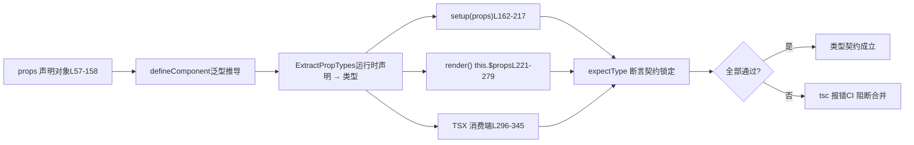

# Chapitre 6 : Tests de contrat de types : comment dts-test protège la surface de l'API

Dans le chapitre précédent, nous avons suivi la chaîne de génération des déclarations de types, et vu comment Vue garantit, via la configuration de build et des tests de fumée, une correspondance stricte entre « types source » et « types publiés ». Mais le contrat de types ne se limite pas à « la forme est-elle correcte » ; plus crucial encore est « la surface de l'API est-elle conforme aux attentes » — quels types doivent être exportés, lesquels ne doivent pas l'être, et si les contraintes génériques sont précises. Ce chapitre entre dans`packages-private/dts-test`, pour voir comment Vue utilise plus de 20`.test-d.ts`fichiers pour transformer « le type comme contrat d'API » en tests automatisés reproductibles.

# Modèle cognitif des tests de contrat de types : transformer le « manuel » en « contrat exécutable »

`dts-test`Les fichiers du répertoire**ont une caractéristique contre-intuitive : ils**ne produisent presque aucun comportement à l'exécution`defineComponent.test-d.tsx`. En ouvrant`defineComponent({...})`, vous verrez de nombreux appels`tsc`/`vue-tsc`, mais ils ne sont jamais réellement exécutés au moment de l'exécution des tests — ces fichiers sont uniquement soumis à`noEmit: true`pour la vérification de types,

[FACT:packages-private/dts-test/tsconfig.test.json:1-11]

garantissant qu'aucun JS n'est produit.`noEmit`Cette configuration constitue l'« environnement d'exécution » de tout le système de contrat :`jsx: preserve`désactive la sortie d'artefacts,`strict`laisse la syntaxe TSX être analysée par le système de types,`moduleResolution: bundler`active toutes les vérifications strictes,`lib`correspond aux sémantiques de bundling modernes,`esnext`et introduit simultanément`dom`。**et`.test-d.tsx`Sans cette configuration,**。

> **[Design Inference & Architectural Trade-offs]**
> serait traité comme du JSX d'exécution, et les assertions de types perdraient leur sens`packages-private`〔Inférence de conception et arbitrages architecturaux〕`packages/vue`Isoler les tests de types dans un sous-paquet`__tests__`plutôt que de les intégrer dans`vue`de**, pour trois raisons : premièrement, les dépendances des tests de types sont les**（`vue/jsx`、`vue`de niveau publication de`.d.ts`, et non les modules internes du code source ; l'isolation physique force le passage par les points d'entrée publics ; deuxièmement,`tsc`la vérification des tests de types prend bien plus de temps que les tests unitaires d'exécution, et un répertoire indépendant facilite une planification CI séparée ; troisièmement,`.test-d.tsx`les fichiers ne seront pas exécutés par erreur par le collecteur d'exécution de Vitest.

Analogie du quotidien : un test unitaire ordinaire ressemble à « mettre la machine sous tension et voir si elle fume », tandis qu'un test de contrat de types ressemble à « vérifier clause par clause avant de signer un contrat » — sans transaction réelle, on confirme simplement que « la somme due par la partie A » est libellée en « yuan » et non en « dollars ». Si les clauses du contrat sont erronées, la machine a beau tourner parfaitement, cela ne sert à rien.

`utils.d.ts`fournit tous les outils de cette « vérification de contrat » :

[FACT:packages-private/dts-test/utils.d.ts:7-21]

Il n'y a que quatre outils clés :`expectType<T>(value: T)`affirme que`value`a exactement le type`T`；`expectAssignable<T, T2 extends T>`affirme que`T2`est assignable à`T`；`IsUnion<T>`détermine si`T`est un type union ;`IsAny<T>`détermine si`T`est`any`. Notez le`import 'vue/jsx'`en L5 — il enregistre l'espace de noms JSX global, permettant au`<MyComponent />`dans TSX d'être reconnu par le système de types comme`JSX.Element`。

[FACT:packages-private/dts-test/utils.d.ts:7-21]

`IsUnion`. L'implémentation de`T extends any ? (U extends T ? false : true) : never`mérite un examen attentif :`T`utilise les types conditionnels distributifs ; si`extends false`est un type union, chaque membre est évalué indépendamment, et finalement`false`détermine si toutes les branches retournent**. C'est**une preuve d'existence au niveau des types`props.jjj`— utilisée pour verrouiller des contrats du type «

# doit être un type union et non fusionné en une signature unique ».`defineComponent`Parcours guidé par scénario :

`defineComponent.test-d.tsx`chaîne complète d'inférence des types de props de**compte 2260 lignes et constitue le cœur du système de contrat. Plaçons-nous dans un scénario concret :`defineComponent({ props: {...}, setup(props) {...} })`l'utilisateur écrit`props`, le système de types de Vue doit déduire à partir de`setup`la déclaration d'exécution`props`le type précis du paramètre**dans

## . Cette chaîne est la partie la plus complexe du système de types de Vue.

Première étape : construire le « type attendu » comme référence contractuelle`ExpectedProps`Le fichier de test définit d'abord l'interface**, en écrivant explicitement et de manière figée**：

[FACT:packages-private/dts-test/defineComponent.test-d.tsx:21-53]

le type que chaque mode de déclaration de props devrait inférer`a?: number | undefined`. Cette interface est la version écrite des « clauses du contrat ». Notez quelques types subtils :`undefined`）、`aa: number`(props optionnelles avec`aaa: number | null`（`PropType<number | null>`(a une default donc non optionnelle),`aaaa: number | undefined`（`required: true as const`déclaré explicitement),`undefined`mais le type contient`props`). Ces différences ne sont pas écrites au hasard ; chacune correspond à une branche spécifique dans la déclaration

## .`defineComponent`

[FACT:packages-private/dts-test/defineComponent.test-d.tsx:57-158]

Deuxième étape : « nourrir »`props`avec divers modes de déclaration**Cet objet**est

- `a: Number`une matrice exhaustive des modes de déclaration`number | undefined`
- `aa: { type: Number as PropType<number | undefined>, default: 1 }`, couvrant toutes les écritures de props de Vue :`number`
- `aaaa: { type: Number, required: true as const }` —— `as const`— raccourci de constructeur, inféré comme`true`— a une default, inféré comme non optionnel`boolean`empêche
- `b: { type: String, required: true as true }` —— `required: true`d'être élargi en
- `bb: { default: 'hello' }`, préserve le type littéral`type`rend la propriété non void
- `cc: Array as PropType<string[]>`— sans
- `l: [Date]`, type inféré uniquement à partir de la default`Date | undefined`
- `ll: [Date, Number]`— conversion de type explicite`Date | number | undefined`
- `lll: [String, Number]`— syntaxe tableau, inférée comme

> **[Design Inference & Architectural Trade-offs]**
> `required: true as const`— idem`required: true as true`〔Inférence de conception et arbitrages architecturaux〕`as true`(L70) et`as const`(L75) coexistent, trace d'une évolution historique : au début on utilisait**, puis on a découvert que**。

## était plus général (pouvant verrouiller simultanément d'autres littéraux dans l'objet), mais l'ancienne écriture est conservée pour vérifier la rétrocompatibilité. C'est la valeur typique des tests de contrat —`setup` / `render` / `this`ils verrouillent simultanément « la nouvelle écriture est utilisable » et « l'ancienne écriture ne régresse pas »

Troisième étape : affirmer aux trois emplacements**C'est la conception la plus ingénieuse des tests de contrat :**。

[FACT:packages-private/dts-test/defineComponent.test-d.tsx:160-217]

`setup(props)`un même type de props doit être correctement inféré dans trois positions de consommation différentes`expectType<ExpectedProps['x']>(props.x)`effectue un

[FACT:packages-private/dts-test/defineComponent.test-d.tsx:168-170]

`// @ts-expect-error should included 'undefined'`Avec`expectType<number>(props.aaaa)`——**Écrire délibérément une assertion qui génère une erreur, en utilisant`@ts-expect-error`pour avaler l'erreur**. Cela vérifie que`props.aaaa`le type de**n'est pas** `number`(sinon cette ligne ne générerait pas d'erreur,`@ts-expect-error`échouerait plutôt à cause de « aucune erreur à avaler »). C'est la technique de « l'assertion inversée » pour les tests de type.

[FACT:packages-private/dts-test/defineComponent.test-d.tsx:204-205]

`// @ts-expect-error props should be readonly`Avec`props.a = 1`— vérifie que les props sont en lecture seule dans`setup`. Si une refactorisation rend accidentellement les props mutables, cette ligne ne génère plus d'erreur,`@ts-expect-error`échouera.

`render()`Dans`this.$props`et`this.x`on asserte via deux chemins :

[FACT:packages-private/dts-test/defineComponent.test-d.tsx:221-279]

L252-276 vérifie que « les props déclarées doivent aussi être exposées sur`this`», L278-279 vérifie que`this.a = 1`génère une erreur (les props sur`this`sont aussi en lecture seule). L281-287 vérifie le déballage de la valeur de retour de setup :`this.c`est`number`（`ref(1)`déballé),`this.d.e.value`est`string`(les refs imbriqués conservent`.value`）、`this.f.g`est`GT`（`reactive`le type branded dans

## n'est pas déballé). Étape quatre : validation des types côté consommateur TSX

Le dernier maillon du contrat de type est « comment l'utilisateur utilise ce composant ». Dans TSX, la validation des props de`<MyComponent />`est un chemin de type indépendant :

[FACT:packages-private/dts-test/defineComponent.test-d.tsx:296-322]

Ici on vérifie que`<MyComponent>`accepte toutes les props déclarées, ainsi que`class`/`style`/`key`/`ref`/`ref_for`ces attributs intégrés. Ensuite vient**la validation inversée**：

[FACT:packages-private/dts-test/defineComponent.test-d.tsx:337-345]

`// @ts-expect-error missing required props`vérifie qu'une prop obligatoire manquante génère une erreur ;`wrong prop types`vérifie qu'une incompatibilité de type génère une erreur ; L342 vérifie que`ggg="baz"`génère une erreur (`ggg`n'accepte que`'foo' | 'bar'`）。

Toute la chaîne peut être résumée par un diagramme de flux de données :



Le point clé de ce diagramme est :**la même`props`déclaration doit satisfaire simultanément les attentes de type de trois positions de consommation**. Toute divergence d'inférence fera échouer`tsc`.

# Limites et portes dérobées :`__typeProps`、`__typeEmits`et contrats de types conditionnels

`defineComponent`L'inférence de type de**a une limitation fondamentale :**les déclarations de props à l'exécution ne peuvent pas exprimer de « types conditionnels »`color='white'`. Par exemple « quand`appearance`doit être`'outline'`» ce type de contrainte ne peut pas s'écrire avec la syntaxe d'objet à l'exécution. Vue fournit pour cela`__typeProps`et autres « portes dérobées de type ».

## `__typeProps`: la capsule de secours pour les props conditionnelles

[FACT:packages-private/dts-test/defineComponent.test-d.tsx:1803-1836]

`ConditionalProps`est un type union : soit`color`et`appearance`sont tous deux optionnels, soit`color: 'white'`et`appearance: 'outline'`. Le test vérifie :

- L1823-1824：`<Comp color="white" />`génère une erreur — fournir`color: 'white'`seul ne satisfait aucune branche
- L1825-1826：`<Comp color="white" appearance="normal" />`génère une erreur —`appearance`doit être`'outline'`
- L1827：`<Comp color="white" appearance="outline" />`passe

> **[Design Inference & Architectural Trade-offs]**
> `__typeProps`La motivation de conception de

## `__typeEmits`: équivalence des deux syntaxes d'emits

`__typeEmits`supporte deux syntaxes, le test**verrouille les deux simultanément**：

[FACT:packages-private/dts-test/defineComponent.test-d.tsx:1838-1885]

Syntaxe objet`{ change: [id: number], update: [value: string] }`exprime les paramètres avec des tuples nommés. Le test vérifie que`this.$props.onChange?.(123)`passe,`onChange?.('123')`génère une erreur.

[FACT:packages-private/dts-test/defineComponent.test-d.tsx:1887-1934]

Syntaxe de signature d'appel`{ (e: 'change', id: number): void; (e: 'update', value: string): void }`exprime via des surcharges.**Les corps de test des deux syntaxes sont presque identiques ligne par ligne**— c'est délibéré : le contrat exige que les deux écritures produisent**un comportement de type complètement équivalent**.

> **[Design Inference & Architectural Trade-offs]**
> Pourquoi conserver deux syntaxes ? La syntaxe objet est plus proche de l'écriture de`defineEmits`, la syntaxe de signature d'appel est plus proche des types d'événements TS traditionnels. Vue doit supporter les deux et garantir un comportement identique. La structure de « miroir ligne par ligne » des tests est la preuve d'équivalence la plus forte.

## `__typeRefs`et`__typeEl`: références inter-composants et types de nœuds hôtes

[FACT:packages-private/dts-test/defineComponent.test-d.tsx:1936-1952]

`__typeRefs`permet au composant parent de connaître précisément le type du ref du composant enfant.`Parent`déclare`__typeRefs: { child: ComponentInstance<typeof Child> }`, ainsi`refs.child.$refs.foo`peut être inféré comme`number`。

[FACT:packages-private/dts-test/defineComponent.test-d.tsx:1963-1977]

`__typeEl`est plus subtil. Le commentaire de test L1963-1977 précise l'intention de conception :**Les nœuds hôtes des moteurs de rendu personnalisés (TUI, canvas, native) ne sont pas des`Element`**DOM, donc`TypeEl`ne peut pas être contraint à`Element`. Le test utilise l'interface`CustomElement`pour vérifier que`$el`peut accepter n'importe quel type hôte.

> **[Design Inference & Architectural Trade-offs]**
> C'est la garantie au niveau des types que Vue 3 supporte les moteurs de rendu personnalisés. Si`TypeEl`était contraint en dur à`Element`，`@vue/runtime-test`, les utilisateurs de moteurs de rendu non-DOM ne pourraient pas inférer correctement le type de`$el`. Le test de contrat protège ici « l'indépendance du moteur de rendu ».

## Contrainte mutuellement exclusive entre composants génériques et props à l'exécution

`function syntax w/ runtime props`La section**verrouille une règle importante :**。

[FACT:packages-private/dts-test/defineComponent.test-d.tsx:1501-1545]

les composants génériques ne peuvent pas coexister avec des props objet à l'exécution`generics aren't supported with object runtime props`Le commentaire L1501`<Comp3<string>>`est une déclaration de contrat. L1525-1535 vérifie que setup générique + props objet génère une erreur ; L1538-1539 vérifie que

> **[Design Inference & Architectural Trade-offs]**
> 〔Inférences de conception et compromis architecturaux〕`ExtractPropTypes`La cause racine de cette contrainte est l'ordre d'inférence de type : les props objet nécessitent que

# détermine d'abord le type, tandis que les génériques ne peuvent être déterminés qu'à l'instanciation, les deux entrent en conflit. Les props tableau ne participent pas à l'extraction de type, donc pas de conflit. Le test de contrat fige cette « limitation du système de types » en assertions régressables.

## `@ts-expect-error`Réflexions de conception, récupération d'erreurs et pièges en production

`@ts-expect-error`La double arme de**est l'outil central des tests de contrat de type, mais il a un piège fatal :`@ts-expect-error`quand le code en dessous ne génère plus d'erreur,**lui-même génère une erreur

[FACT:packages-private/dts-test/defineComponent.test-d.tsx:1354-1362]

. Cela semble être une protection, mais exige en réalité que l'auteur du test contrôle précisément « l'emplacement où l'erreur se produit ».`// @ts-expect-error missing prop`Regardez ceci :`<Comp msg={123} />`est placé sur la ligne**au-dessus de**, mais toute l'expression est enveloppée dans`expectType<JSX.Element>(...)`. Si la position de`@ts-expect-error`se décale d'une ligne, ou si l'erreur se produit en réalité sur l'appel`expectType`plutôt que sur le JSX, le test échouera.

> **[Design Inference & Architectural Trade-offs]**
> Piège en production : quand une mise à jour de version de TypeScript décale légèrement les positions d'erreur, un grand nombre de`@ts-expect-error`peuvent échouer collectivement. La stratégie de Vue est de**coller`@ts-expect-error`au plus près du code asserté**, et de verrouiller la version de TypeScript dans la CI. Toute mise à jour de TS nécessite de revalider tous les tests de type.

## `IsAny`et`IsUnion`: « preuve d'existence » au niveau du type

[FACT:packages-private/dts-test/defineComponent.test-d.tsx:1991-1993]

`expectType<IsAny<typeof props.foo>>(false)`vérifie que`props.foo`n'est pas`any`. C'est un**contrat inversé**: il exige non seulement que le type soit correct, mais aussi qu'il ne puisse pas dégénérer en`any`」。`any`est un trou noir du système de types, tout`any`rendra les assertions suivantes dénuées de sens.

[FACT:packages-private/dts-test/defineComponent.test-d.tsx:195-196]

`expectType<IsUnion<typeof props.jjj>>(true)`vérifie que`jjj`est un type union.`jjj`déclaré comme`((arg1: string) => string) | ((arg1: string, arg2: string) => string)`, si le système de types le fusionne en une signature unique,`IsUnion`renverra`false`, le test échoue.

> **[Design Inference & Architectural Trade-offs]**
> Ces deux outils protègent la « précision du type » plutôt que la « correction du type ». Un type dégénéré en`any`ou une union fusionnée « semble fonctionnel » dans la plupart des cas d'usage, mais perd les indications de l'IDE et les vérifications à la compilation. Les tests de contrat doivent verrouiller cette précision.

## Contrat implicite de l'ordre de déclaration

[FACT:packages-private/dts-test/defineComponent.test-d.tsx:1784-1801]

Ce commentaire est extrêmement crucial :`code generated by tsc / vue-tsc, make sure this continues to work so we don't accidentally change the args order of DefineComponent`。`DefineComponent`possède 13 paramètres génériques, dans l'ordre**Contrat public**——`vue-tsc`le type de composant généré dépend de cet ordre. Le test utilise`declare const MyButton: DefineComponent<...>`pour écrire explicitement les 13 paramètres, verrouillant l'ordre.

> **[Design Inference & Architectural Trade-offs]**
> C'est le contrat le plus facilement négligé : l'ordre des paramètres génériques n'est pas un « détail d'implémentation », mais l'« ABI du code généré ». Toute PR modifiant l'ordre rendra le`vue-tsc`généré par`.d.ts`incompatible avec le type à l'exécution. Le test de contrat joue ici le rôle de « gardien de la compatibilité ABI ».

## Contrat inter-fichiers :`componentInstance.test-d.tsx`complément de

`componentInstance.test-d.tsx`ne fait que 154 lignes, mais couvre toutes les formes d'entrée de`ComponentInstance`du type utilitaire :

[FACT:packages-private/dts-test/componentInstance.test-d.tsx:10-40]

`ComponentInstance<typeof CompSetup>`extrait le type d'instance depuis le résultat de`defineComponent`;`ComponentInstance<typeof CompFunctional>`extrait depuis un composant fonctionnel ;`ComponentInstance<typeof CompFunction>`extrait depuis une fonction nue. Les trois doivent dériver la classe de base`ComponentPublicInstance`.

[FACT:packages-private/dts-test/componentInstance.test-d.tsx:71-116]

Plus extrême encore, « l'objet nu sans`defineComponent`enveloppant » :`CompObjectSetup`、`CompObjectData`、`CompObjectNoProps`les trois formes doivent pouvoir être correctement extraites par`ComponentInstance`. L113-114 est particulièrement contre-intuitif :`CompObjectNoProps`n'a pas de déclaration`props`, mais`compObjectNoProps.test`est quand même déduit comme`string | undefined`— c'est le repli fourni par la classe de base`ComponentPublicInstance`.

[FACT:packages-private/dts-test/componentInstance.test-d.tsx:143-147]

Le test`#12751`de L141 verrouille une limite :`__typeEmits`l'événement`'update:visible'`déclaré doit être exposé sur l'instance comme`comp['onUpdate:visible']`(clé de chaîne avec deux-points), et le type`$props`est`{ 'onUpdate:visible'?: (value?: boolean) => any }`. L152-153 vérifie que`comp['$props']['$props']`renvoie une erreur — empêchant l'auto-référence récursive du type.

# Résumé de ce chapitre

`dts-test`le répertoire utilise plus de 20 fichiers`.test-d.ts`pour transformer « le type est le contrat d'API » en tests automatisés régressifs. Le mécanisme central comporte trois couches :

1. **Couche outils**：`expectType`、`expectAssignable`、`IsUnion`、`IsAny`fournit les primitives d'assertion de type,`@ts-expect-error`fournit la capacité d'assertion inversée.

2. **Couche contrat**：`ExpectedProps`l'interface fige explicitement « quel type doit être déduit »,`props`la matrice de déclaration énumère toutes les écritures possibles, les trois emplacements de consommation (`setup`/`render`/TSX) se recoupent.

3. **Couche porte dérobée**：`__typeProps`、`__typeEmits`、`__typeRefs`、`__typeEl`fournit une trappe de secours pour les contraintes de type inexprimables à l'exécution, tout en verrouillant l'équivalence des deux syntaxes emits.

# Réflexions et auto-évaluation de ce chapitre

Q1 : si l'on supprime le`defineComponent.test-d.tsx`de L168-170 dans`@ts-expect-error`, en ne gardant que`expectType<number>(props.aaaa)`, que se passe-t-il ? Pourquoi ce test « échoue-t-il silencieusement » ?

**Analyse de référence**：

`props.aaaa`déclaré comme`{ type: Number as PropType<number | undefined>, required: true as const }`, son type déduit est`number | undefined`(car`PropType<number | undefined>`inclut explicitement`undefined`）。

`expectType<number>(props.aaaa)`exige que`props.aaaa`soit exactement`number`. Comme le type réel est`number | undefined`, cette ligne**elle-même renverra une erreur**。`@ts-expect-error`le rôle de

est « prévoir une erreur ici et l'absorber ».`@ts-expect-error`Si l'on supprime**, cette ligne renverra directement une erreur, le test échoue — cela semble « plus strict ». Mais le problème est :`props.aaaa`si une refactorisation fait que`number`devient réellement`@ts-expect-error`(correction de bug ou changement de comportement), cette ligne ne renverra plus d'erreur, et après suppression de**le test passera

— à ce moment le test ne peut plus distinguer « type correct » et « type erroné mais qui ne renvoie justement pas d'erreur ».`@ts-expect-error`Conserver l'écriture**est un**verrouillage bidirectionnel`number | undefined`: il exige à la fois que « le type actuel soit`@ts-expect-error`» (en absorbant l'erreur`expectType<number>`via`number`), et que « le type ne puisse pas être`number`，`@ts-expect-error`» (s'il devient**, le test échouera faute d'erreur à absorber). C'est la technique centrale des tests de contrat de type —**。

[FACT:packages-private/dts-test/defineComponent.test-d.tsx:168-170]

Q2: `__typeProps`utiliser « l'erreur attendue » pour verrouiller « le type doit contenir un certain composant »`ConditionalProps`le test de porte dérobée (L1803-1836) vérifie la contrainte du type union conditionnel. Si l'on change`{ color?: 'normal' | 'primary' | 'secondary' | 'white'; appearance?: 'normal' | 'outline' | 'text' }`d'un type union en`__typeProps`(c'est-à-dire en aplatissant toutes les options), comment le test échouerait-il ? Qu'est-ce que cela révèle comme contrainte de conception de

**?**：

Analyse de référence`color`Le type aplati permet n'importe quelle combinaison de`appearance`et`color: 'white'` + `appearance: 'normal'`, y compris**. Mais le test L1825-1826 exige explicitement que cette combinaison**：

```
// @ts-expect-error
;
```

Copie`@ts-expect-error`Si le type est aplati, cette ligne ne renverra plus d'erreur,`<Comp color="white" />`échouera car « aucune erreur à absorber ». De même, le`@ts-expect-error`de L1823-1824 passera de « erreur » à « succès », faisant également échouer

.`__typeProps`Cela montre que la contrainte de conception de**est :**。`__typeProps`il doit préserver la sémantique d'« exclusion mutuelle des branches » du type union`Props`ce n'est pas une simple « couverture de type », mais « exprimer via le système de types des contraintes conditionnelles que les props à l'exécution ne peuvent pas exprimer ». Si lors de l'implémentation on applique à`Prettify`des transformations de mapping comme`Omit`ou

> **[Design Inference & Architectural Trade-offs]**
> 〔Inférences de conception et arbitrages architecturaux〕`__typeProps`C'est aussi pourquoi les cas de test de`CommonProps & ConditionalProps`utilisent l'intersection la plus brute

Q3: `DefineComponent`, plutôt que des types mappés plus « élégants » — toute transformation de type supplémentaire risque de masquer des bugs.`VNodeProps & AllowedComponentProps & ComponentCustomProps`L'ordre des 13 paramètres génériques de`Readonly<ExtractPropTypes<{}>>`est explicitement verrouillé par L1784-1801. Si une refactorisation échange le 9e paramètre (

**) et le 10e paramètre (**：

`DefineComponent`), quels éléments en aval seraient affectés ? Pourquoi le test de contrat doit-il verrouiller cet ordre ?`vue-tsc`Analyse de référence`<script setup>`L'ordre des paramètres génériques de`defineProps` / `defineEmits`，`vue-tsc`est l'« ABI » lors de la génération du type de composant. Quand l'utilisateur écrit`CreateComponentPublicInstance<...>`dans**, cela génère un type**similaire à L1999-2116, où la

position

1. `vue-tsc`des paramètres génériques détermine la signification de chaque paramètre de type.`.d.ts`Si l'on échange les 9e et 10e paramètres :`DefineComponent`le`VNodeProps & AllowedComponentProps & ComponentCustomProps`généré par`Readonly<ExtractPropTypes<{}>>`remplira les paramètres selon l'ancien ordre, mais**Les types des props des composants utilisateur sont tous décalés**。

2. L1786-1800 de`declare const MyButton: DefineComponent<...>`générera directement une erreur — car`{}`et`VNodeProps & ...`sont incompatibles.

3. L1999-2116 de`ErrorMessage`type (simulant`vue-tsc`résultat de génération) générera également une erreur.

La valeur du verrouillage de l'ordre par les tests de contrat réside dans le fait que :**il élève « l'ordre des paramètres génériques » du statut de « détail d'implémentation » à celui de « contrat public »**. Toute PR modifiant l'ordre fera immédiatement échouer L1786-1800, empêchant les changements incompatibles d'entrer en release.

[FACT:packages-private/dts-test/defineComponent.test-d.tsx:1784-1801]

> **[Design Inference & Architectural Trade-offs]**
> C'est la valeur la plus sous-estimée des tests de contrat de types : ce qu'ils protègent n'est pas « le type est-il correct », mais « la stabilité de l'interface du système de types ». L'ordre des paramètres génériques,`@ts-expect-error`la position de`IsAny`la valeur de retour de

Les tests de contrat de types résolvent la question « la surface de l'API est-elle conforme aux attentes ». Mais les types ne représentent que la moitié de l'ingénierie Vue — l'autre moitié est « comment l'utilisateur peut vérifier en temps réel dans le navigateur le comportement de ces API ». Le chapitre suivant abordera le SFC Playground, pour voir comment Vue empaquette le compilateur, le runtime et le système de types dans un environnement de débogage en temps réel au sein du navigateur, permettant à l'utilisateur de voir instantanément les produits de compilation et les résultats d'exécution dès qu'il modifie le code.

Les tests de contrat ne protègent pas seulement « le type est-il correct », mais aussi « le type est-il précis » (`IsAny`/`IsUnion`), « l'ordre des paramètres génériques est-il stable » (`DefineComponent`13 paramètres), « l'indépendance vis-à-vis du renderer » (`__typeEl`non contraint à`Element`). Une fois ces contraintes brisées, les indications IDE côté utilisateur,`vue-tsc`les types générés dériveront. Et la stabilité du contrat de types doit finalement servir l'expérience de débogage quotidienne du développeur — le chapitre suivant nous emmènera dans`packages-private/sfc-playground`, pour voir comment un Playground purement front-end réalise la boucle fermée de compilation SFC et de prévisualisation en temps réel dans le navigateur.
