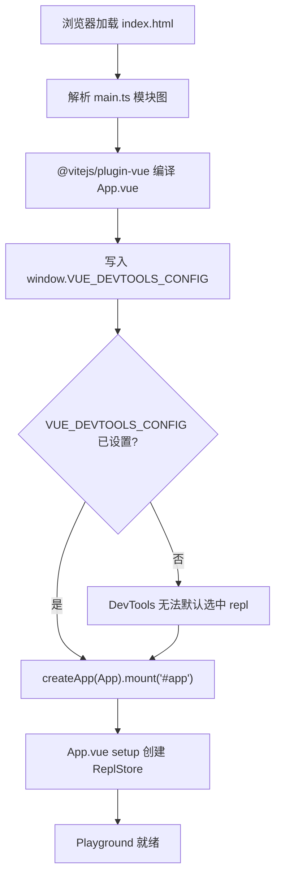
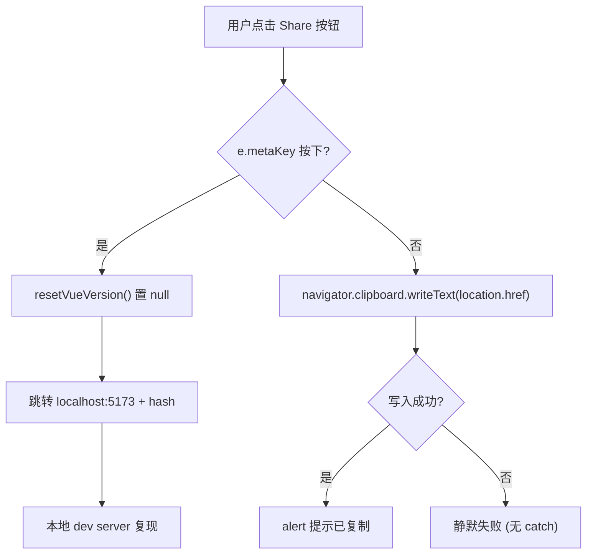
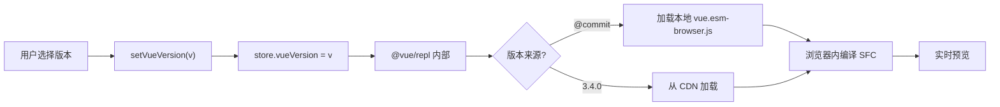

# Chapitre 7 : SFC Playground : sous-système de compilation et de débogage en temps réel dans le navigateur

Dans le chapitre précédent, nous avons utilisé plus de 20`.test-d.ts`fichiers pour clouer « le type est le contrat d'API » dans la CI. Mais le contrat de types ne répond qu'à « à quoi ressemble la surface de l'API », il ne peut pas répondre à « à quoi ressemble exactement ce SFC une fois compilé » ni « les résultats de rendu sont-ils cohérents en mode SSR ». Pour répondre à ces deux dernières questions, l'équipe Vue avait besoin d'un bac à sable capable d'exécuter le pipeline de compilation complet dans le navigateur — c'est`packages-private/sfc-playground`. Il diffère fondamentalement des`packages/`packages publics sous`package.json`:`"private": true`et`"version": "0.0.0"` [FACT:packages-private/sfc-playground/package.json:2-4], ce qui signifie qu'il n'est jamais publié sur npm, c'est juste un outil de débogage officiel. Dans ses dépendances,`vue`pointe vers`workspace:*` [FACT:packages-private/sfc-playground/package.json:19], c'est-à-dire le produit de build des sources locales, et non la version stable sur npm — ce qui fait naturellement du Playground une « démonstration vivante du commit actuel ». Ce chapitre se concentre sur trois questions : comment l'entrée s'initialise, comment le Header pilote les changements d'état, comment les constantes de build sont injectées.

# I. Le minimalisme de l'entrée : contrat d'initialisation de main.ts et ReplStore

## Modèle intuitif

`main.ts`ne contient que 9 lignes, comme un « script d'auto-test au démarrage » : avant le montage de l'application Vue, on injecte d'abord dans`window`une configuration globale, pour dire à Vue DevTools « quelle app sélectionner par défaut ». Sans cette étape, DevTools ferait face à plusieurs instances d'app à l'ouverture (le Playground lui-même + le code exécuté dans le REPL utilisateur) et ne pourrait pas se focaliser automatiquement, l'expérience de débogage dégénérerait en bascule manuelle.

## Structures de données et effets de bord globaux

`main.ts`Le cœur de`createApp`n'est pas`window`, mais l'écriture polluante sur

[FACT:packages-private/sfc-playground/src/main.ts:4-7]

```ts
// @ts-expect-error Custom window property
window.VUE_DEVTOOLS_CONFIG = {
  defaultSelectedAppId: 'repl',
}
```

Voici deux détails d'ingénierie notables :

> **[Design Inference & Architectural Trade-offs]**
> 1. **`@ts-expect-error`plutôt que`@ts-ignore`**：`window`le type standard de`Window & typeof globalThis`ne possède pas`VUE_DEVTOOLS_CONFIG`champ. Utiliser`@ts-expect-error`signifie « je sais que cela va générer une erreur, et j'exige qu'elle soit générée » — si à l'avenir un`@types/*`ajoute ce champ,`@ts-expect-error`générera une erreur inverse pour « absence d'erreur produite », rappelant ainsi à l'auteur de retirer ce commentaire. Cela s'inscrit dans la continuité de la démarche des tests de contrat de types du chapitre précédent :**utiliser le système de types pour protéger l'intention, plutôt que masquer le problème**。

> **[Design Inference & Architectural Trade-offs]**
> 2. **`defaultSelectedAppId: 'repl'`La convention de chaîne de**: ce`'repl'`doit être parfaitement identique à l'id utilisé lors de la création de l'app à l'intérieur de`@vue/repl`. C'est un contrat littéral inter-packages, sans aucune protection de contrainte de type — si`@vue/repl`change l'id, la sélection par défaut du DevTools du Playground échouera silencieusement.

## Step-by-Step : du HTML au montage

Le flux d'exécution est très court, mais chaque étape a des contraintes implicites :

1. Le navigateur charge`index.html`, qui contient`<div id="app">`(non fourni dans ce matériel, mais`mount('#app')`permet de le déduire).

2. Résolution du graphe de modules :`main.ts`en haut de`import App from './App.vue'` [FACT:packages-private/sfc-playground/src/main.ts:2]déclenche`@vitejs/plugin-vue`la compilation SFC de

> **[Design Inference & Architectural Trade-offs]**
> 3. **Ordre critique**：`window.VUE_DEVTOOLS_CONFIG`doit être écrit avant`createApp(App).mount('#app')` [FACT:packages-private/sfc-playground/src/main.ts:9]. Car le hook de DevTools est enregistré à l'intérieur de`createApp`, une écriture de configuration après le mount ne pourra pas influencer la première sélection.

4. `mount('#app')`déclenche`App.vue`le setup de`ReplStore`, créant ainsi`App.vue`(dans



## Copier

`main.ts`Réflexions de conception et pièges**Le minimalisme de`App.vue`est délibéré :`ReplStore`**. Le point d'entrée ne assume que deux choses : « injection d'effets de bord globaux + montage ». Aucune logique métier ne doit apparaître ici. C'est un compromis assumé du Playground en tant qu'« outil de débogage » plutôt que « produit » — il n'a pas besoin de compatibilité SSR, ni de points d'entrée multiples, ni de chargement paresseux.

> **[Design Inference & Architectural Trade-offs]**
> Pièges rencontrés en production :`window.VUE_DEVTOOLS_CONFIG`est**Singleton global**. Si le Playground est intégré dans une autre page utilisant également DevTools (par exemple dans un scénario iframe), le dernier écrivain écrasera le premier. Comme le Playground est généralement déployé de manière indépendante, ce risque est accepté.

---

# II. Header.vue : état dérivé par computed et flux de données unidirectionnel via emit

## Modèle intuitif

`Header.vue`est le « panneau de contrôle » du Playground — sélection de version, bascule PROD/DEV, interrupteur SSR, bascule de thème, partage, téléchargement. Il ne**détient aucun état métier**, tous les états proviennent de`props.store`et de props booléens, toutes les modifications sont remontées au composant parent via`emit`. Sans cette contrainte de « composant muet + remontée d'événements », le Header deviendrait une zone sinistrée où les états seraient dispersés, et les effets de bord du changement de version et de la bascule SSR ne pourraient plus être gérés de manière centralisée.

## Analyse de la structure de données et des champs

La définition des props du Header est la clé pour comprendre ses responsabilités :

[FACT:packages-private/sfc-playground/src/Header.vue:13-19]

```ts
const props = defineProps()
```

Les cinq props se répartissent en deux catégories :

- **`store: ReplStore`**: la référence unique au conteneur d'état, provenant de`@vue/repl`. Le Header lit via celui-ci`store.loading`、`store.vueVersion`、`store.typescriptVersion`, et écrit directement dans`store.vueVersion`。
- **quatre props booléens/littéraux**：`prod`、`ssr`、`autoSave`、`theme`. Ce sont des**états contrôlés**, le Header est en lecture seule, les modifications doivent passer par`emit`。

la liste d'emit correspondante[FACT:packages-private/sfc-playground/src/Header.vue:20-28]：

```ts
const emit = defineEmits([
  'toggle-theme',
  'toggle-ssr',
  'toggle-prod',
  'toggle-autosave',
  'reload-page',
])
```

Noter que`toggle-theme`bien que défini en interne par`toggleDark()`, mais`emit`est directement`toggle-ssr`/`toggle-prod`/`toggle-autosave`dans le template`$emit`. Ce mélange est un style courant en Vue 3[FACT:packages-private/sfc-playground/src/Header.vue:102-118]:`<script setup>`utiliser emit sous forme de fonction lorsqu'un effet de bord est nécessaire, utiliser le template**pour un simple transfert`$emit`**。

## Étape par étape : affichage et changement de version

Mise en situation : l'utilisateur ouvre le Playground, le Header doit afficher la version actuelle de Vue.

**Étape 1 : dérivation du texte affiché via computed**

[FACT:packages-private/sfc-playground/src/Header.vue:30-37]

```ts
const vueVersion = computed(() => {
  if (store.loading) {
    return 'loading...'
  }
  return store.vueVersion || `@${__COMMIT__}`
})
```

Il y a ici trois niveaux de priorité :`loading`état →`'loading...'`; l'utilisateur a explicitement choisi une version →`store.vueVersion`; sinon →`@${__COMMIT__}`(hash court du commit actuel).`__COMMIT__`est une constante injectée au moment du build, détaillée dans la section suivante.

**Étape 2 : liaison bidirectionnelle de VersionSelect**

[FACT:packages-private/sfc-playground/src/Header.vue:88-88]

```html

```

Noter ici**n'utilise pas`v-model`**, mais est explicitement décomposé en`:model-value` + `@update:model-value`. La raison est que`vueVersion`est un computed (en lecture seule), il ne peut pas être lié bidirectionnellement directement ; il faut passer par`setVueVersion`cette fonction setter pour écrire dans`store.vueVersion`：

[FACT:packages-private/sfc-playground/src/Header.vue:39-41]

```ts
async function setVueVersion(v: string) {
  store.vueVersion = v
}

function resetVueVersion() {
  store.vueVersion = null
}
```

> **[Design Inference & Architectural Trade-offs]**
> `setVueVersion`est déclaré comme`async`mais sans`await`en interne — est-ce un héritage historique ou intentionnel ? On suppose que c'est pour s'aligner sur la sémantique de chargement asynchrone de`VersionSelect`(le changement de version déclenche un chargement distant), afin de maintenir la cohérence de l'interface.

**Étape 3 : comparaison avec la version TypeScript**

[FACT:packages-private/sfc-playground/src/Header.vue:76-80]

```html

```

La version TypeScript utilise`v-model`, car`store.typescriptVersion`est une propriété ordinaire modifiable, pas besoin d'un wrapper computed.**Le même composant utilise deux modes de liaison dans le même template**, ce qui illustre de manière直观 la distinction « contrôlé vs non contrôlé ».

## Bascule de thème : combinaison d'effets de bord et d'emit

[FACT:packages-private/sfc-playground/src/Header.vue:58-66]

```ts
function toggleDark() {
  const cls = document.documentElement.classList
  cls.toggle('dark')
  localStorage.setItem(
    'vue-sfc-playground-prefer-dark',
    String(cls.contains('dark')),
  )
  emit('toggle-theme', cls.contains('dark'))
}
```

Cette fonction fait trois choses : manipuler la classe DOM, persister dans localStorage, émettre un emit pour notifier le composant parent.**Noter qu'elle ne modifie pas directement`props.theme`**— car les props sont en lecture seule, le composant parent ne mettra à jour`toggle-theme`qu'après avoir reçu`theme`, ce qui pilote ensuite dans le template`:title`le texte[FACT:packages-private/sfc-playground/src/Header.vue:123]。

> **[Design Inference & Architectural Trade-offs]**
> Il y a ici une conception subtile :**la manipulation de classe DOM et l'état réactif Vue sont deux chemins indépendants**。`document.documentElement.classList.toggle('dark')`modifie directement le DOM, tandis que`theme`la prop est mise à jour via Vue. Si les deux ne sont pas synchronisés (par exemple si le composant parent refuse la mise à jour), l'UI présentera une incohérence : « la classe a changé mais le texte du title n'a pas changé ». En pratique, le composant parent accepte toujours l'emit, donc le problème ne se manifeste pas.

## Logique cachée : la branche metaKey de copyLink

[FACT:packages-private/sfc-playground/src/Header.vue:47-56]

```ts
async function copyLink(e: MouseEvent) {
  if (e.metaKey) {
    resetVueVersion()
    // hidden logic for going to local debug from play.vuejs.org
    window.location.href = 'http://localhost:5173/' + window.location.hash
    return
  }
  await navigator.clipboard.writeText(location.href)
  alert('Sharable URL has been copied to clipboard.')
}
```

C'est une**porte dérobée pour développeurs**: en maintenant Cmd enfoncé sur`play.vuejs.org`et en cliquant sur le bouton de partage, on est redirigé vers`localhost:5173`(serveur de dev local), en emportant le hash de l'URL actuelle. Le hash encode l'état complet du REPL (code source, version, options), ce qui permet de reproduire les problèmes de production en débogage local. Le commentaire`// hidden logic for going to local debug from play.vuejs.org` [FACT:packages-private/sfc-playground/src/Header.vue:47-56]indique clairement qu'il s'agit d'une fonctionnalité volontairement cachée.

> **[Design Inference & Architectural Trade-offs]**
> `resetVueVersion()`est appelé avant la redirection, mettant`store.vueVersion`à`null`, garantissant que le débogage local utilise le commit actuel plutôt que la version sélectionnée en ligne.



## Réflexions de conception et pièges

> **[Design Inference & Architectural Trade-offs]**
> **Piège 1 :`navigator.clipboard`permissions et contexte de sécurité de**。`copyLink`n'a pas de try/catch[FACT:packages-private/sfc-playground/src/Header.vue:47-56]. En l'absence de HTTPS ou si l'utilisateur refuse la permission du presse-papiers,`writeText`sera rejeté, entraînant un rejet de Promise non capturé. Le Playground étant déployé en HTTPS, le risque est accepté, mais c'est un « piège de production » typique.

> **[Design Inference & Architectural Trade-offs]**
> **Piège 2 :`toggleDark`clé localStorage codée en dur de**。`'vue-sfc-playground-prefer-dark'`est un littéral de chaîne, sans extraction en constante. Si la clé doit être modifiée à l'avenir, une recherche globale sera nécessaire.

**Piège 3 :`currentCommit`comparaison entre`vueVersion`et**. Dans le template`:class="{ active: vueVersion === \`@${currentCommit}\` }"` [FACT:packages-private/sfc-playground/src/Header.vue:88-88]Comparaison par concaténation de chaînes. Si`__COMMIT__`l'injection échoue (devient`undefined`), ici cela devient`'@undefined'`, ne correspondant jamais. La fiabilité de l'injection de constantes à la compilation détermine directement la justesse de l'UI — c'est précisément le sujet de la section suivante.

---

# III. Injection de constantes à la compilation : la double responsabilité de __COMMIT__ et copyVuePlugin

## Modèle intuitif

`vite.config.ts`est l'« atelier d'assemblage » du Playground : il exécute à la compilation`git rev-parse`pour obtenir le hash de commit, le transforme via`define`en constante globale`__COMMIT__`; simultanément, via un plugin personnalisé, il copie les artefacts navigateur ESM de`packages/vue/dist/`vers le répertoire de sortie du Playground. Sans cette étape, le Playground ne pourrait pas charger « le runtime Vue du commit actuel » dans le navigateur — il ne pourrait dépendre que de la version stable sur npm, perdant ainsi la signification de « démonstration vivante ».

## Structures de données et constantes à la compilation

[FACT:packages-private/sfc-playground/vite.config.ts:7-9]

```ts
const commit = spawnSync('git', ['rev-parse', '--short=7', 'HEAD'])
  .stdout.toString()
  .trim()
```

`spawnSync`exécute synchroniquement la commande git,`--short=7`prend le hash court de 7 caractères. L'exécution synchrone est intentionnelle :**le fichier de configuration a besoin de la valeur de`commit`dès la phase de chargement du module**, l'asynchrone perturberait l'ordre de résolution de la configuration Vite.

[FACT:packages-private/sfc-playground/vite.config.ts:23-26]

```ts
define: {
  __COMMIT__: JSON.stringify(commit),
  __VUE_PROD_DEVTOOLS__: JSON.stringify(true),
},
```

`define`est le mécanisme de**remplacement de texte**de Vite : dans le code source, tous les`__COMMIT__`sont remplacés par le résultat de`JSON.stringify(commit)`(c'est-à-dire une chaîne littérale entre guillemets).`JSON.stringify`est nécessaire — si l'on écrivait directement`commit`, après remplacement cela deviendrait l'identifiant nu`abc1234`, traité comme nom de variable et non comme chaîne.

> **[Design Inference & Architectural Trade-offs]**
> `__VUE_PROD_DEVTOOLS__: true`est une autre constante clé : elle permet à la**compilation de production**de Vue de conserver le support DevTools. Par défaut, la compilation de production supprime le hook DevTools pour réduire la taille, mais le Playground doit déboguer le code utilisateur, donc il est forcé activé.

## Étape par étape : le transport d'artefacts de copyVuePlugin

[FACT:packages-private/sfc-playground/vite.config.ts:32-63]

```ts
function copyVuePlugin(): Plugin {
  return {
    name: 'copy-vue',
    generateBundle() {
      const copyFile = (file: string) => {
        const filePath = path.resolve(
          import.meta.dirname,
          '../../packages',
          file,
        )
        const basename = path.basename(file)
        if (!fs.existsSync(filePath)) {
          throw new Error(
            `${basename} not built. ` +
              `Run "nr build vue -f esm-browser" first.`,
          )
        }
        this.emitFile({
          type: 'asset',
          fileName: basename,
          source: fs.readFileSync(filePath, 'utf-8'),
        })
      }

      copyFile(`vue/dist/vue.esm-browser.js`)
      copyFile(`vue/dist/vue.esm-browser.prod.js`)
      copyFile(`vue/dist/vue.runtime.esm-browser.js`)
      copyFile(`vue/dist/vue.runtime.esm-browser.prod.js`)
      copyFile(`server-renderer/dist/server-renderer.esm-browser.js`)
    },
  }
}
```

Analyse point par point des éléments clés :

1. **`generateBundle`hook**: exécuté après que Rollup a généré le bundle, avant l'écriture sur disque. À ce moment, on peut`emitFile`ajouter des fichiers supplémentaires dans les artefacts.

2. **`import.meta.dirname`**: version ESM de`__dirname`fournie par Node 20.11+. Le chemin`../../packages`remonte de`packages-private/sfc-playground/`jusqu'à la racine du dépôt, puis entre dans`packages/`。

3. **Vérification d'existence + erreur explicite**: si`vue.esm-browser.js`n'existe pas, lever une erreur avec instruction de correction`Run "nr build vue -f esm-browser" first.`. C'est un modèle d'**expérience développeur**— le message d'erreur indique directement comment corriger.

4. **Cinq artefacts**：`vue`version complète/runtime × dev/prod, plus`server-renderer`. Ces cinq fichiers constituent précisément l'ensemble candidat pour l'import dynamique du Playground dans le navigateur, correspondant au changement de version et à l'interrupteur SSR dans le Header.

> **[Design Inference & Architectural Trade-offs]**
> **Pourquoi ces cinq ?**La version complète (avec compilateur) sert au scénario de « compilation à l'exécution » ; la version runtime au scénario de « précompilation » ; dev/prod correspond au basculement PROD/DEV du Header ; server-renderer correspond à l'interrupteur SSR. Ces cinq fichiers constituent la « matrice runtime Vue » du Playground.

## Flux de données complet du changement de version

Relions le`setVueVersion`du Header aux artefacts de copyVuePlugin :



Noter la valeur spéciale`@${__COMMIT__}`: elle correspond aux artefacts locaux copiés par copyVuePlugin, et non au CDN. C'est pourquoi le Playground doit copier les artefacts de build navigateur de Vue —**l'option « This Commit » nécessite des fichiers locaux**。

## Réflexions de conception et pièges

> **[Design Inference & Architectural Trade-offs]**
> **Piège 1 :`spawnSync`gestion de l'échec**. Si le répertoire courant n'est pas un dépôt git (par exemple extrait d'un tarball),`spawnSync`renvoie un code de sortie non nul,`stdout`est vide,`commit`devient une chaîne vide. À ce moment,`__COMMIT__`est remplacé par`""`, dans le Header`@${currentCommit}`devient`'@'`. Aucune gestion d'erreur explicite.

> **[Design Inference & Architectural Trade-offs]**
> **Piège 2 :`optimizeDeps.exclude: ['@vue/repl']`** [FACT:packages-private/sfc-playground/vite.config.ts:27-29]. Vite pré-bundle les dépendances par défaut pour accélérer le démarrage à froid, mais`@vue/repl`est exclu. La raison est que`@vue/repl`utilise en interne des imports dynamiques et des workers, et le pré-bundling casserait ces mécanismes. C'est un problème courant dans l'écosystème Vite : « conflit entre pré-bundling et chargement dynamique ».

> **[Design Inference & Architectural Trade-offs]**
> **Piège 3 :`script.fs`configuration** [FACT:packages-private/sfc-playground/vite.config.ts:13-19]。`@vitejs/plugin-vue`l'option`script.fs`permet au bloc`<script>`des SFC de lire des fichiers via`fs`. Ici, on passe`fs.existsSync`et`fs.readFileSync`, afin de supporter l'analyse des instructions`import`dans les SFC (par exemple`import x from './foo'`doit vérifier si un fichier existe).**C'est la clé permettant au Playground de simuler une résolution de modules complète dans le navigateur**— il injecte la capacité fs de Node dans la phase de résolution du compilateur.

---

# Réflexions de conception : compromis architecturaux du Playground

En reliant les trois sous-sections, l'architecture du Playground suit un principe clair :**séparer « état » et « effets de bord », séparer « compilation » et « exécution »**。

- `main.ts`ne fait qu'injecter des effets de bord globaux, sans toucher à l'état métier.
- `Header.vue`est un composant purement présentationnel, l'état entre par props et sort par emit.
- `vite.config.ts`fige l'information de compilation « commit actuel » en constante, en lecture seule à l'exécution.

> **[Design Inference & Architectural Trade-offs]**
> Cette séparation apporte un avantage direct :**le Playground peut être intégré dans n'importe quelle application Vue**(par exemple un exemple intégré dans un site de documentation), à condition de fournir`store`et quatre props booléens.

Le coût est**État dispersé**：`store`Dans`@vue/repl`, l'état booléen est dans le composant parent, la classe DOM est sur`document.documentElement`, et il y en a une autre copie dans localStorage. Quatre emplacements d'état doivent être synchronisés manuellement, et toute désynchronisation entraîne une incohérence de l'UI.

> **[Design Inference & Architectural Trade-offs]**
> Un autre compromis est**abandonner la compatibilité SSR**。`main.ts`accéder directement à`window`，`Header.vue`de`toggleDark`accéder directement à`document`. Le Playground est une application purement CSR, il n'est pas nécessaire de considérer le rendu côté serveur.

---

# Résumé de ce chapitre

Ce chapitre a analysé`packages-private/sfc-playground`les trois fichiers principaux :

1. **`main.ts`**: point d'entrée de 9 lignes, le cœur étant l'ordre d'injection de`window.VUE_DEVTOOLS_CONFIG`— doit être avant`mount`.

2. **`Header.vue`**: dérive`computed`via`vueVersion`, et signale tous les changements d'état via`emit`.`copyLink`la branche`metaKey`de

3. **`vite.config.ts`**：`spawnSync`est une porte dérobée de débogage local cachée.`define`récupère le hash de commit,`__COMMIT__`，`copyVuePlugin`injecte

pour transporter les cinq artefacts de navigateur Vue vers le répertoire d'artefacts du Playground.**Le fil conducteur traversant les trois est**：`__COMMIT__`la frontière entre les constantes de build et l'état d'exécution`store.vueVersion`est un fait de build en lecture seule,`vueVersion`est un choix d'exécution mutable, le

# computed du Header unifie les deux en une seule chaîne d'affichage.

Réflexions et auto-évaluation de ce chapitre`main.ts`Q1 : Si l'on déplace l'assignation de`window.VUE_DEVTOOLS_CONFIG`dans`createApp(App).mount('#app')`après

**, que se passe-t-il ? Pourquoi ?**：`window.VUE_DEVTOOLS_CONFIG`Analyse de référence`createApp`est la configuration lue par Vue DevTools lors de l'enregistrement du hook à l'intérieur de[FACT:packages-private/sfc-playground/src/main.ts:4-9]。`createApp`enregistre immédiatement`__VUE_DEVTOOLS_GLOBAL_HOOK__`, à ce moment DevTools lit`defaultSelectedAppId`pour décider quelle app est sélectionnée par défaut. Si l'assignation est postérieure à`mount`, DevTools a déjà terminé la première sélection d'app, la configuration ne prendra pas effet, et l'utilisateur devra basculer manuellement vers l'app`repl`dans DevTools. Plus subtil encore : comme`@vue/repl`crée aussi une app en interne, une assignation tardive peut amener DevTools à sélectionner par défaut le Playground lui-même plutôt que le REPL de l'utilisateur, nécessitant un basculement manuel lors du débogage du code utilisateur. Cela illustre l'importance de « l'ordre d'injection des effets de bord globaux » dans les outils de débogage.

Q2: `Header.vue`le`toggleDark()`de`props.theme`manipule simultanément la classe DOM, localStorage et emit, mais ne modifie pas directement`toggle-theme`. Si le composant parent, après avoir reçu l'événement`theme`, refuse de mettre à jour la prop

**, quelle incohérence d'UI apparaîtrait ? Comment la localiser au niveau du code source ?**：`toggleDark()`Analyse de référence[FACT:packages-private/sfc-playground/src/Header.vue:58-66]dans`document.documentElement.classList.toggle('dark')`appelle directement`dark`, ce qui change immédiatement la classe[FACT:packages-private/sfc-playground/src/Header.vue:186-186]sur le DOM, déclenchant le basculement des variables CSS (voir`.dark nav`la règle`:title`de[FACT:packages-private/sfc-playground/src/Header.vue:123]). Mais le texte`props.theme`dans le template dépend de`<html>`, si le composant parent ne met pas à jour, le title restera à l'ancienne valeur. Méthode de localisation : inspecter dans les DevTools du navigateur si la classe de

Q3: `copyVuePlugin`et l'attribut title du bouton sont contradictoires. La cause racine est que « l'effet de bord DOM » et « l'état réactif Vue » empruntent deux chemins indépendants, sans source de données unique.`generateBundle`dans`fs.existsSync`effectue une vérification`fs.readFileSync`sur chaque fichier, lançant une erreur avec instruction de correction en cas d'absence. Si l'on supprime cette vérification et appelle directement

**, que se passe-t-il dans un environnement CI (sans avoir construit vue au préalable) ? Comment le message d'erreur induirait-il les développeurs en erreur ?**Analyse de référence`fs.readFileSync`: après suppression de la vérification,`ENOENT: no such file or directory, open '.../packages/vue/dist/vue.esm-browser.js'` [FACT:packages-private/sfc-playground/vite.config.ts:32-63]lancera`nr build vue -f esm-browser`. Cette erreur indique seulement au développeur que « le fichier n'existe pas », mais ne lui dit pas qu'« il faut d'abord exécuter`throw new Error(\`${basename} not built. Run "nr build vue -f esm-browser" first.\`)`». Dans un environnement CI, le développeur pourrait croire à tort à une erreur de configuration de chemin, un problème de permissions ou un sous-module git non initialisé, perdant beaucoup de temps en investigation. Le

---

du code original lie « le symptôme » et « l'action de correction », un détail clé de la conception de l'expérience développeur. Cela explique aussi pourquoi le script de build du Playground doit avoir un ordre de dépendance explicite avec le script de build du cœur de Vue.`packages-private/template-explorer`Le chapitre suivant abordera

, pour voir comment Vue visualise les produits intermédiaires du compilateur (AST, résultats de transformation, génération de code), permettant aux développeurs d'observer pas à pas chaque transformation du template vers la fonction de rendu. Contrairement au « black box de bout en bout » du Playground, Template Explorer est une « sonde white box ».`@vue/compiler-dom`Jusqu'ici, nous avons vu clairement comment le SFC Playground transporte le pipeline de compilation dans le navigateur : initialisation de l'entrée, bascule d'état du Header et injection de constantes de build constituent ensemble un bac à sable débogable en temps réel. Mais la perspective du Playground reste toujours « la compilation et l'exécution d'un SFC entier », il ne répond pas directement à « ce que le compilateur fait exactement comme transformation sur une expression de template donnée ». Le chapitre suivant entrera dans Template Explorer, pour voir comment il déploie ligne par ligne les résultats de compilation de`@vue/compiler-ssr`et
