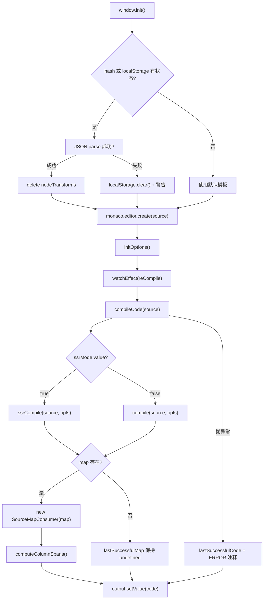
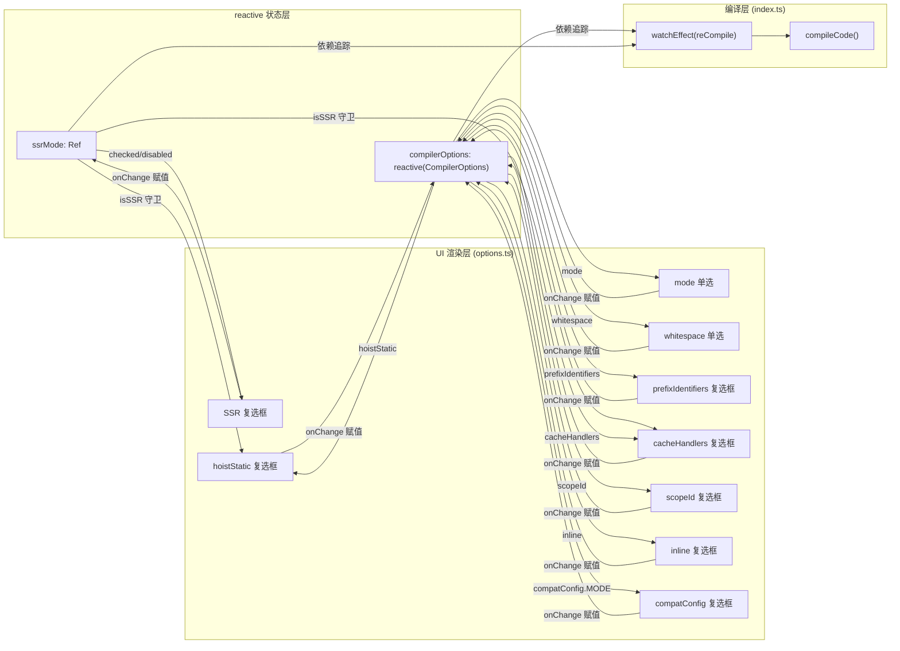

# Chapitre suivant : Chapitre 8 →

Dans le chapitre précédent, nous avons vu comment SFC Playground encapsule toute la chaîne « saisie SFC → compilation dans le navigateur → aperçu en temps réel » dans une boîte noire : le développeur voit le résultat de rendu final, mais ne voit pas ce que le compilateur fait entre-temps. Lorsqu'une directive personnalisée est écrite dans le template, ou que hoistStatic est activé et que le produit de sortie fait soudain apparaître une multitude de variables _hoisted_1, le Playground ne peut pas répondre à la question « pourquoi le compilateur génère-t-il cela ». Le positionnement de Template Explorer est exactement l'inverse : il expose entièrement les produits de compilation de @vue/compiler-dom et @vue/compiler-ssr, l'AST, les marqueurs d'erreur, ainsi que la correspondance de position entre le code source et le produit de sortie. Son cœur n'est pas « exécuter », mais « observer ». Ce chapitre s'articule autour de trois fichiers : index.ts est responsable de l'appel de compilation et de la correspondance bidirectionnelle SourceMap, options.ts gère des dizaines de CompilerOptions avec reactive et pilote l'UI, theme.ts personnalise le thème de l'éditeur Monaco.

# I. Appel de compilation et correspondance bidirectionnelle SourceMap : index.ts

## Modèle intuitif

Le`index.ts`de Template Explorer ressemble à une « machine à traduire bidirectionnelle » : à gauche on saisit le template, à droite on obtient la fonction de rendu. Mais elle possède une capacité de plus qu'une machine à traduire — lorsque vous placez le curseur sur une ligne à gauche, la droite met en surbrillance le produit correspondant ; inversement, si vous placez le curseur à droite, la gauche met en surbrillance le template correspondant. Sans le mappage SourceMap, cet outil dégénérerait en deux zones de texte côte à côte, et le développeur devrait comparer à l'œil nu, sans pouvoir établir la chaîne causale « ligne N du template → ligne N du produit ».

## Structures de données et disposition mémoire

`index.ts`Il n'y a pas de Struct complexe dans , mais il existe plusieurs variables d'état clés au niveau du module, qui déterminent le comportement de tout l'outil :

`lastSuccessfulCode`et`lastSuccessfulMap`sont le cache du résultat de compilation[FACT:packages-private/template-explorer/src/index.ts:74-75]. Le premier est une chaîne, le second est`SourceMapConsumer | undefined`. Notez que`lastSuccessfulMap`est initialement`undefined`, et n'est assigné que lorsque la compilation réussit et que`map`existe[FACT:packages-private/template-explorer/src/index.ts:99-100]. Cet état`undefined`est la condition de garde de toute la logique ultérieure de mappage du curseur — si la compilation échoue, la fonctionnalité de mappage devient automatiquement silencieusement inactive, au lieu de lever une exception.

`PersistedState`L'interface  définit la forme de l'état persisté dans localStorage et le hash d'URL[FACT:packages-private/template-explorer/src/index.ts:26-30]：`src`(code source du template),`ssr`(mode SSR ou non),`options`(options du compilateur). Il y a ici une conception clé :`options`a pour type le`CompilerOptions`complet, mais lors de la persistance réelle, seuls les « éléments différents des valeurs par défaut » sont enregistrés ; cette logique de filtrage est effectuée dans`reCompile`.

`sharedEditorOptions`sont les options de construction partagées par les deux éditeurs[FACT:packages-private/template-explorer/src/index.ts:26-30]：`fontSize: 14`、`scrollBeyondLastLine: false`、`renderWhitespace: 'selection'`、`minimap.enabled: false`. La minimap est désactivée car le template et le produit ne font généralement que quelques dizaines de lignes, et la minimap occupe au contraire l'espace horizontal.

## Step-by-Step Walkthrough

**Scénario : l'utilisateur ouvre la page, saisit`
{{ msg }}
`, puis déplace le curseur.**

**Première étape : initialisation et restauration de l'état.** `window.init`est le point d'entrée global[FACT:packages-private/template-explorer/src/index.ts:41]. Il enregistre et active d'abord le thème personnalisé[FACT:packages-private/template-explorer/src/index.ts:44-45], puis tente de restaurer l'état depuis le hash d'URL ou localStorage[FACT:packages-private/template-explorer/src/index.ts:49-56]. Notez l'ordre de décodage ici : d'abord`atob`puis`escape`, ensuite`decodeURIComponent`. Si l'analyse du hash échoue, on revient à`localStorage.getItem('state')`, puis à`{}`. Si l'ensemble du JSON.parse échoue, localStorage est vidé et un avertissement est affiché[FACT:packages-private/template-explorer/src/index.ts:57-64]。

Après la restauration de l'état, il y a un détail facile à négliger :`delete persistedState.options?.nodeTransforms` [FACT:packages-private/template-explorer/src/index.ts:69]. Le commentaire explique la raison — les fonctions ne peuvent pas être sérialisées, donc lors de la persistance`nodeTransforms`est perdu, et lors de la restauration, s'il reste un objet vide, le comportement du compilateur devient anormal. C'est le piège classique de la « persistance de champs non sérialisables ».

**Deuxième étape : cœur de la compilation`compileCode`。**C'est le cœur de tout l'outil[FACT:packages-private/template-explorer/src/index.ts:76-106]. Il commence par`console.clear()`, puis selon`ssrMode.value`choisit`ssrCompile`ou`compile` [FACT:packages-private/template-explorer/src/index.ts:80]. Notez les paramètres d'appel de`compileFn`: on étend`compilerOptions`, on force`filename: 'ExampleTemplate.vue'`、`sourceMap: true`, et on injecte le callback`onError`pour collecter les erreurs[FACT:packages-private/template-explorer/src/index.ts:82-89]。

Il y a ici une décision de conception :`filename`est codé en dur à`'ExampleTemplate.vue'`. Cette valeur doit correspondre exactement dans l'appel ultérieur à`generatedPositionFor`, sinon la requête SourceMap renverra un résultat vide. C'est un contrat implicite — les deux chaînes doivent être identiques, mais aucun système de types ne le garantit.[FACT:packages-private/template-explorer/src/index.ts:189]Une fois la compilation terminée, les erreurs sont converties au format marker de Monaco et définies sur l'éditeur

convertit le[FACT:packages-private/template-explorer/src/index.ts:91-95]。`formatError`de`CompilerError`en`loc`de Monaco. Notez`startLineNumber/startColumn/endLineNumber/endColumn` [FACT:packages-private/template-explorer/src/index.ts:108-119]— seules les erreurs avec information de position sont marquées ; les erreurs sans`errors.filter(e => e.loc)`(comme les erreurs de configuration globale) ne sont affichées que dans la console.`loc`Troisième étape : établissement de la SourceMap.

**Après une compilation réussie,**, puis on appelle immédiatement`lastSuccessfulMap = new SourceMapConsumer(map!)` [FACT:packages-private/template-explorer/src/index.ts:99]est une API clé de`computeColumnSpans()` [FACT:packages-private/template-explorer/src/index.ts:100]。`computeColumnSpans`: elle précalcule l'étendue de colonne de chaque segment de mappage, ce qui rend disponible le champ`source-map-js`renvoyé par`generatedPositionFor`. Sans cette étape, le mappage inverse ne peut localiser que la colonne de début, et ne peut pas mettre en surbrillance toute l'étendue du token.`lastColumn`Quatrième étape : mappage bidirectionnel du curseur.

**Lorsque l'utilisateur, dans**l'éditeur de code source**, déplace le curseur, cela déclenche**. Après un debounce de 100 ms, le callback appelle`editor.onDidChangeCursorPosition` [FACT:packages-private/template-explorer/src/index.ts:184]. Notez`lastSuccessfulMap.generatedPositionFor({ source: 'ExampleTemplate.vue', line, column: column - 1 })` [FACT:packages-private/template-explorer/src/index.ts:188-192]: les numéros de colonne de Monaco commencent à 1, tandis que ceux de la SourceMap commencent à 0. Le`column - 1`renvoyé, s'il possède`pos`et`line`, crée un décorateur sur l'éditeur de sortie pour mettre en surbrillance la plage correspondante`column`, et défile jusqu'à cette position[FACT:packages-private/template-explorer/src/index.ts:194-206]Le mappage inverse se fait dans[FACT:packages-private/template-explorer/src/index.ts:207-210]。

de`output.onDidChangeCursorPosition`. Il appelle[FACT:packages-private/template-explorer/src/index.ts:223], mais avec une garde supplémentaire : ignorer`originalPositionFor` [FACT:packages-private/template-explorer/src/index.ts:227-230]，但多了一个守卫：忽略 `pos.line === 1 && pos.column === 0`de « mock location »[FACT:packages-private/template-explorer/src/index.ts:231-237]. Ce garde est crucial — certains codes générés par le compilateur (comme les`import`instructions ou fonctions helper) n'ont pas de position de template correspondante, et SourceMap renvoie`{ line: 1, column: 0 }`comme placeholder. Si on ne l'ignore pas, placer le curseur sur ces lignes mettra erronément en surbrillance la première ligne du template.

**Cinquième étape : persistance de l'état.** `reCompile`déclenche non seulement la compilation, mais est aussi responsable d'écrire l'état actuel dans localStorage et le hash d'URL[FACT:packages-private/template-explorer/src/index.ts:121-146]. Lors de la persistance, il y a une logique de filtrage : parcourir`compilerOptions`, et ne sauvegarder que les éléments « non-objet et différents de la valeur par défaut »[FACT:packages-private/template-explorer/src/index.ts:125-133]. Cela explique pourquoi`bindingMetadata`ce type d'option de type objet n'est pas persisté — c'est trop complexe, et la valeur par défaut suffit déjà pour la démonstration.

## Réflexions de conception et pièges en production

**Pourquoi utiliser`source-map-js`plutôt que`source-map`？** `source-map`est la bibliothèque originale de Mozilla, volumineuse et dépendante de WASM (nouvelle version).`source-map-js`est une implémentation pure JS, de petite taille, adaptée à l'environnement navigateur. Template Explorer, en tant qu'outil purement front-end, choisir`source-map-js`est raisonnable[FACT:packages-private/template-explorer/package.json:15]。

**le choix du délai de debounce.**Le debounce de l'éditeur de code source est par défaut de 300ms[FACT:packages-private/template-explorer/src/index.ts:271], tandis que le debounce du déplacement du curseur est de 100ms[FACT:packages-private/template-explorer/src/index.ts:215]. Cette différence est intentionnelle : la compilation est une opération lourde, 300ms évite les déclenchements fréquents ; le déplacement du curseur est une opération légère, 100ms garantit la réactivité. Mais 100ms peut encore provoquer un clignotement de la surbrillance lors de déplacements rapides du curseur — c'est un compromis acceptable.

**`window.init`Le montage global de**. Noter que`window.init`et`window.monaco`sont tous deux montés sur le global[FACT:packages-private/template-explorer/src/index.ts:19-23]. C'est parce que l'éditeur Monaco est chargé de manière asynchrone via le CDN`loader.js`, et une fois le chargement terminé, il appelle`window.init`. Ce modèle de « callback global » est l'usage standard de Monaco dans un environnement non modulaire, mais il est en décalage avec les méthodes de build ESM modernes.

---

# II. Panneau d'options piloté par reactive : options.ts

## Modèle intuitif

`options.ts`ressemble à un « panneau de contrôle » : il y a une dizaine d'interrupteurs et de boutons radio en haut, chacun correspondant à un comportement du compilateur. Actionner n'importe quel interrupteur fait immédiatement changer le résultat de compilation à droite. Sans ce module, les développeurs ne pourraient que modifier les paramètres d'appel de`compile`dans le code source puis recompiler, sans pouvoir comparer en temps réel les effets des différentes options.

## Structure de données et disposition mémoire

`options.ts`Le cœur de

`ssrMode`est`ref(false)` [FACT:packages-private/template-explorer/src/options.ts:5]. Il est indépendant de`compilerOptions`, car le mode SSR commute la fonction de compilation elle-même (`compile` vs `ssrCompile`), et non les options de compilation.

`defaultOptions`est un objet complet`CompilerOptions`[FACT:packages-private/template-explorer/src/options.ts:5-27]. Il définit les valeurs par défaut de toutes les options, y compris`mode: 'module'`、`prefixIdentifiers: false`、`hoistStatic: false`、`cacheHandlers: false`、`scopeId: null`、`inline: false`、`ssrCssVars: '{ color }'`、`compatConfig: { MODE: 3 }`、`whitespace: 'condense'`, ainsi qu'un`bindingMetadata` [FACT:packages-private/template-explorer/src/options.ts:18-26]。

`compilerOptions`contenant 7 types de bindings`reactive(Object.assign({}, defaultOptions))` [FACT:packages-private/template-explorer/src/options.ts:29-31]est`Object.assign({}, ...)`. Noter ici l'utilisation de`reactive(defaultOptions)`pour une copie superficielle — si on faisait directement`compilerOptions`, modifier`defaultOptions`polluerait`reCompile`, rendant inopérante la logique de « comparaison avec la valeur par défaut » dans

## Step-by-Step Walkthrough

**Scénario : l'utilisateur clique sur la case à cocher « hoistStatic ».**

**Première étape : rendu de l'UI.** `App`Le`setup`du composant[FACT:packages-private/template-explorer/src/options.ts:33-35]retourne une fonction de rendu`ssrMode.value`、`compilerOptions.mode`、`compilerOptions.prefixIdentifiers`. Cette fonction de rendu lit[FACT:packages-private/template-explorer/src/options.ts:36-39]et d'autres états réactifs

**, donc lorsque ces états changent, toute l'UI se re-rend.** `hoistStatic`Deuxième étape : liaison checked de la case à cocher.`checked`La propriété`compilerOptions.hoistStatic && !isSSR` [FACT:packages-private/template-explorer/src/options.ts:150]de la case à cocher est`hoistStatic`. Il y a une logique ici : en mode SSR,`disabled: isSSR` [FACT:packages-private/template-explorer/src/options.ts:151]est forcé à s'afficher comme non coché, car la compilation SSR ne supporte pas le hoisting statique. En même temps,

**garantit que l'utilisateur ne peut pas le basculer en mode SSR.**Troisième étape : traitement onChange.`onChange`Lorsque l'utilisateur clique sur la case à cocher,[FACT:packages-private/template-explorer/src/options.ts:152-156]déclenche`e.target.checked`, assignant directement`compilerOptions.hoistStatic`à`compilerOptions`. Comme`reactive`est`watchEffect(reCompile)` [FACT:packages-private/template-explorer/src/index.ts:266], cette assignation déclenche le suivi des dépendances, puis déclenche

**, et finalement recompile.**Quatrième étape : interaction entre options.`cacheHandlers`Noter que`checked`le`usePrefix && compilerOptions.cacheHandlers && !isSSR` [FACT:packages-private/template-explorer/src/options.ts:166]，`disabled`de`!usePrefix || isSSR` [FACT:packages-private/template-explorer/src/options.ts:167]est`cacheHandlers`est`prefixIdentifiers`. Cela signifie que`mode === 'module'`dépend de`prefixIdentifiers`ou`function`. Cette relation d'interaction se manifeste dans l'UI par : lorsque`cacheHandlers`n'est pas activé et que le mode est

`scopeId`, la case à cocher`disabled: !isModule` [FACT:packages-private/template-explorer/src/options.ts:182]，`checked: isModule && compilerOptions.scopeId` [FACT:packages-private/template-explorer/src/options.ts:183]est désactivée.`isModule`L'interaction de`null` [FACT:packages-private/template-explorer/src/options.ts:184-189]。

**est plus complexe :** `initOptions`. scopeId ne peut être défini qu'en mode module, et lors du onChange, si`createApp(App).mount(document.getElementById('header')!)` [FACT:packages-private/template-explorer/src/options.ts:232-234]est false, il sera forcé à`vue`Cinquième étape : montage.`createApp`appelle`@vue/runtime-dom`. Noter ici l'utilisation de`options.ts`du package`vue`, et non

## est du code applicatif, et peut dépendre directement du package complet

**Copier`reactive`Réflexions de conception et pièges en production`ref`？** `compilerOptions`Pourquoi utiliser`reactive`plutôt que`compilerOptions.hoistStatic = true`est un objet contenant une dizaine de champs, utiliser`compilerOptions.value.hoistStatic = true`permet de`reactive`directement, sans avoir besoin de`compilerOptions.xxx`. C'est plus concis dans le code UI. Mais le coût de

**`bindingMetadata`est que la déstructuration fait perdre la réactivité — il n'y a aucune déstructuration dans le code source, tout est accédé via**, c'est l'usage correct.[FACT:packages-private/template-explorer/src/options.ts:18-26]La conception des valeurs par défaut de`SETUP_CONST`、`SETUP_REF`、`SETUP_LET`、`SETUP_MAYBE_REF`、`PROPS`Les valeurs par défaut de`prefixIdentifiers`contiennent 7 bindings`$setup`, couvrant les cinq types`prefixIdentifiers`. C'est pour que les développeurs puissent, après avoir ouvert

**`compatConfig`, voir immédiatement l'impact des différents types de bindings sur la façon d'accéder à** `compilerOptions.compatConfig!.MODE = 2` [FACT:packages-private/template-explorer/src/options.ts:216-220]dans le résultat. Sans cette valeur par défaut,`reactive`l'effet de`reactive`serait très monotone.`compatConfig`La réactivité imbriquée de`CompatConfig | undefined`Ce type d'assignation imbriquée est réactive sous`!`, car`compatConfig`proxy récursivement les objets imbriqués. Mais noter que le type de

**`ssrMode`est`compilerOptions`, donc on utilise l'assertion** `ssrMode`. Si la valeur par défaut ne contenait pas`ref`，`compilerOptions`, cela planterait à l'exécution ici.`reactive`Séparation des responsabilités entre`ssr`et`compilerOptions``ssr`est`CompilerOptions`est

---

# . Pourquoi ne pas mettre

## dans

`theme.ts`C'est comme « changer de peau » pour l'éditeur : il définit la couleur et le style de police de chaque token syntaxique. Sans ce module, Monaco utiliserait le thème`vs-dark`par défaut ; bien que fonctionnel, les balises HTML, les expressions et les directives dans les templates Vue manqueraient de distinction visuelle, rendant difficile pour les développeurs de localiser rapidement les parties clés.

## Structure de données et disposition mémoire

`theme.ts`Exporte un objet conforme à l'interface`IStandaloneThemeData`Monaco[FACT:packages-private/template-explorer/src/theme.ts:1-244]. Il possède trois champs de premier niveau :

`base: 'vs-dark'`Spécifie le thème de base[FACT:packages-private/template-explorer/src/theme.ts:2]，`inherit: true`Représente les règles héritant du thème de base[FACT:packages-private/template-explorer/src/theme.ts:3]. Cela signifie qu'il suffit de définir les différences ; les tokens non définis reviendront à`vs-dark`。

`rules`est un tableau dont chaque élément contient`token`(le nom du token Monaco) et`foreground`/`background`/`fontStyle` [FACT:packages-private/template-explorer/src/theme.ts:4-235]. Ce tableau compte plus de 50 entrées, couvrant des types de tokens tels que number, comment, keyword, string, variable, entity.name.tag, etc.

`colors`Définit les couleurs de l'interface de l'éditeur[FACT:packages-private/template-explorer/src/theme.ts:236-243]：`editor.foreground`、`editor.background`、`editor.selectionBackground`、`editor.lineHighlightBackground`、`editorCursor.foreground`、`editorWhitespace.foreground`。

## Step-by-Step Walkthrough

**Scénario : enregistrer le thème au chargement de la page.**

**Première étape : définir le thème.** `monaco.editor.defineTheme('my-theme', theme)` [FACT:packages-private/template-explorer/src/index.ts:44]. Cet appel enregistre`theme.ts`l'objet exporté dans le registre de thèmes de Monaco, avec pour nom de clé`'my-theme'`。

**Deuxième étape : activer le thème.** `monaco.editor.setTheme('my-theme')` [FACT:packages-private/template-explorer/src/index.ts:45]. Cette ligne de code doit être appelée après`defineTheme`, sinon une erreur « thème non défini » sera levée.

**Troisième étape : correspondance des tokens.**Lorsque Monaco rend le code du template, il tokenise le code avec le service de langage HTML, puis recherche les règles dans`rules`par nom de token. Par exemple`
`dans`div`sera marqué comme`entity.name.tag`, correspondant à`foreground: 'cc6666'` [FACT:packages-private/template-explorer/src/theme.ts:41-44], affiché en rouge.

## Réflexions de conception et pièges en production

**Pourquoi utiliser`inherit: true`？**? Sans héritage, il faudrait définir les couleurs de tous les tokens, y compris ceux qui n'apparaissent pas dans les templates (comme`markup.heading`、`meta.diff`). L'héritage permet au fichier de thème de se concentrer uniquement sur les tokens réellement présents dans les templates et les sorties JS.

**Correspondance hiérarchique des noms de tokens.**La correspondance des tokens de Monaco est basée sur les préfixes :`entity.name.tag`correspondra à`entity.name.tag.html`、`entity.name.tag.css`, etc. Le code source définit à la fois`entity.name.tag` [FACT:packages-private/template-explorer/src/theme.ts:41-44]et`entity.name.tag.css` [FACT:packages-private/template-explorer/src/theme.ts:169-172], ce dernier écrasant le premier dans le contexte CSS spécifique.

**`colors`Répartition entre`rules`et** `rules`contrôle la couleur du texte du code,`colors`contrôle la couleur de l'interface de l'éditeur (arrière-plan, curseur, ligne sélectionnée). Les deux sont indépendants mais doivent être visuellement coordonnés. Dans le code source,`editor.background: '#1D1F21'`est proche de l'arrière-plan par défaut de`base: 'vs-dark'`, afin de maintenir la cohérence visuelle.

---

# Réflexions de conception : compromis d'ingénierie d'une sonde de visualisation

La différence fondamentale entre Template Explorer et SFC Playground réside dans la « granularité d'observation ». Playground observe « si l'ensemble du SFC compilé peut s'exécuter », tandis que Template Explorer observe « ce en quoi une expression de template individuelle est compilée ». Cette différence détermine les choix techniques des deux outils :

**L'introduction de SourceMapConsumer est inévitable.**Sans lui, les développeurs ne pourraient que comparer visuellement le code source et la sortie, sans pouvoir établir une correspondance précise « ligne X → ligne Y ». Mais l'API de SourceMapConsumer est asynchrone (les nouvelles versions renvoient une Promise) ; le code source utilise la version synchrone`source-map-js`, afin de simplifier la logique d'appel.

**`reactive`La gestion des options est un choix naturel dans l'écosystème Vue.**Si l'on gérait manuellement la synchronisation d'état d'une dizaine d'options avec des événements DOM natifs, la quantité de code doublerait.`reactive`Le suivi de dépendances de`watchEffect(reCompile)`automatise la chaîne « changement d'option → recompilation », une seule ligne de code suffit pour l'abonnement.

**Le mode de chargement global de Monaco est un héritage historique.** `window.monaco`Les méthodes de montage global de`window.init`et

---

# découlent de la conception du chargeur AMD de Monaco. Dans les builds ESM modernes, cela semble anachronique, mais la taille de Monaco (environ 5 Mo) rend le chargement à la demande toujours nécessaire.

Résumé du chapitre`index.ts`Template Explorer est une « sonde en boîte blanche » : il n'exécute pas la sortie compilée, il montre uniquement le processus de compilation.`compileCode`Via`@vue/compiler-dom`il appelle`@vue/compiler-ssr`ou`SourceMapConsumer`, utilise`options.ts`pour établir une correspondance bidirectionnelle entre le code source et la sortie, et implémente la surbrillance synchronisée du curseur via l'API de décorateurs de Monaco.`reactive`Utilise`CompilerOptions`pour gérer`watchEffect`, pilote la recompilation via`hoistStatic`, et les relations entre options (comme la désactivation de`theme.ts`en SSR) sont explicitement codées dans la couche UI.

Personnalise le thème Monaco pour que les tokens syntaxiques des templates et de la sortie aient une distinction visuelle claire.`hoistStatic`La valeur fondamentale de cet outil réside dans « utiliser l'outil pour déduire le comportement du compilateur » : lorsque vous n'êtes pas sûr de ce que

# fait à un template donné, ouvrez Template Explorer, changez les options, observez les changements de sortie. C'est plus intuitif que de lire le code source du compilateur, et plus fiable que de deviner.

Réflexions et auto-évaluation de ce chapitre`index.ts`Q1 : Si l'on supprime le garde mock location (`originalPositionFor`) de`pos.line === 1 && pos.column === 0`dans`{ line: 1, column: 0 }`, dans quel scénario cela provoquerait-il une surbrillance erronée ? Pourquoi le compilateur génère-t-il des mappings comme

**?**Analyse de référence[FACT:packages-private/template-explorer/src/index.ts:231-237]: le garde se situe dans`import { createElementVNode as _createElementVNode } from 'vue'`. Le compilateur insère du code sans position correspondante dans le template lors de la génération de la sortie, par exemple des instructions d'import de helpers comme`export function render(_ctx, _cache) { ... }`, ou des signatures de fonctions comme`source-map-js`. Ces codes n'ont pas de position d'origine dans la SourceMap,`{ line: 1, column: 0 }`renverra`originalPositionFor`comme valeur de remplacement. Si l'on supprime le garde, lorsque l'utilisateur place le curseur sur ces lignes,`{ line: 1, column: 0 }`, le code considérera qu'il s'agit d'une position valide et créera un décorateur de surbrillance à la première ligne, première colonne de l'éditeur de code source. Le résultat est : lorsque l'utilisateur clique sur la ligne`import`de l'artefact, la première ligne de l'éditeur de code source est mise en surbrillance à tort, ce qui induit en erreur. L'essence de ce garde-fou est de « distinguer les mappings réels des mappings fictifs », et`{ line: 1, column: 0 }`est`source-map-js`la valeur sentinelle « aucun mapping » conventionnée.

Q2: `reCompile`lors de la persistance des options dans`typeof val !== 'object' && val !== defaultOptions[key]`, la condition`bindingMetadata`ignore toutes les options de type objet. Si`bindingMetadata`est modifié par l'utilisateur (par exemple via la console), cette modification sera perdue après actualisation de la page. Est-ce un bug ou une conception intentionnelle ? Si l'on souhaite prendre en charge

**dans la persistance, quels problèmes faut-il résoudre ?**Analyse de référence[FACT:packages-private/template-explorer/src/index.ts:129]: la condition se trouve dans`bindingMetadata`. C'est une conception intentionnelle, pour trois raisons : premièrement,`BindingTypes`a une valeur de type énumération`compatConfig`, qui après sérialisation devient un nombre, et lors de la désérialisation, il est impossible de distinguer « l'utilisateur a explicitement défini la valeur à 0 » de « la valeur par défaut » ; deuxièmement,`val !== defaultOptions[key]`est un objet imbriqué,`nodeTransforms`compare des références, ce qui est toujours vrai, et entraînerait la persistance de toutes les options d'objet ; troisièmement,`delete persistedState.options?.nodeTransforms`contient des fonctions, qui ne peuvent pas être sérialisées, et le code source gère déjà[FACT:packages-private/template-explorer/src/index.ts:69]via`bindingMetadata`. Si l'on souhaite prendre en charge`bindingMetadata`, il faudrait implémenter une comparaison profonde (plutôt qu'une comparaison de références), et gérer la sérialisation/désérialisation des valeurs d'énumération. Le problème plus fondamental est que :

Q3: `options.ts`n'a pas de point d'entrée d'édition dans l'interface utilisateur, l'utilisateur ne peut le modifier que via la console, et ce type de modification ne devrait de toute façon pas être persisté.`compilerOptions`dans`reactive(Object.assign({}, defaultOptions))`est créé avec`Object.assign({}, defaultOptions)`. Si l'on remplace`reactive(defaultOptions)`par une simple

**, que se passe-t-il après que l'utilisateur a basculé l'option et actualisé la page ? Pourquoi ?**：`Object.assign({}, defaultOptions)`Analyse de référence[FACT:packages-private/template-explorer/src/options.ts:29-31]est une copie superficielle, située dans`reactive(defaultOptions)`，`compilerOptions`. Si l'on remplace par`defaultOptions`et`hoistStatic`pointeraient vers le même objet. Lorsque l'utilisateur bascule`compilerOptions.hoistStatic`à true,`defaultOptions.hoistStatic`devient true, et`reCompile`devient également true. Ensuite, la logique de persistance[FACT:packages-private/template-explorer/src/index.ts:129]dans`val !== defaultOptions[key]`compare`val`, à ce moment`defaultOptions[key]`et`defaultOptions`sont tous deux true, la condition est fausse, et cette option ne sera pas sauvegardée dans localStorage. Après actualisation de la page,`hoistStatic: false`est réinitialisé à`defaultOptions`, la modification de l'utilisateur est perdue. Plus grave encore, une fois

---

pollué, toute la logique ultérieure de « comparaison avec la valeur par défaut » devient invalide, entraînant un effondrement complet de la fonctionnalité de persistance. Le caractère insidieux de ce bug réside dans le fait que : tout fonctionne normalement au sein d'une même session, et le problème ne se manifeste qu'après actualisation.`scripts/release.js`Le chapitre suivant abordera

, pour voir comment Vue orchestre avec une machine à états interactive l'ensemble du processus de mise à jour du numéro de version, build, tests, commit Git, tag et npm publish. Contrairement à l'« observation » de Template Explorer, release.js est de l'« exécution » — il doit maintenir un état entre plusieurs étapes, gérer les échecs et les rollbacks, et trouver un équilibre entre confirmation interactive et automatisation.
