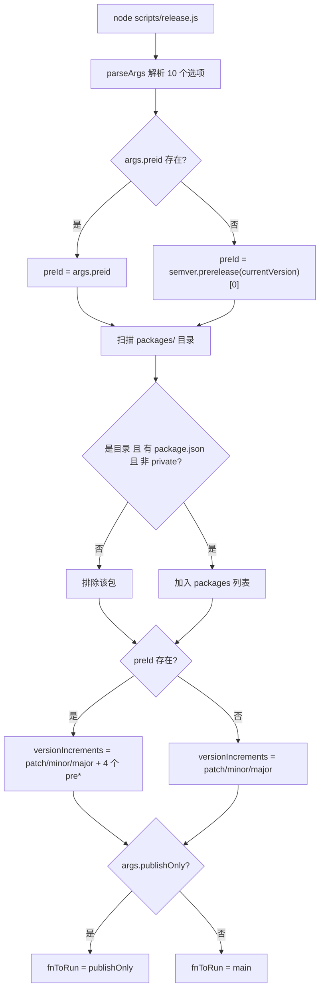
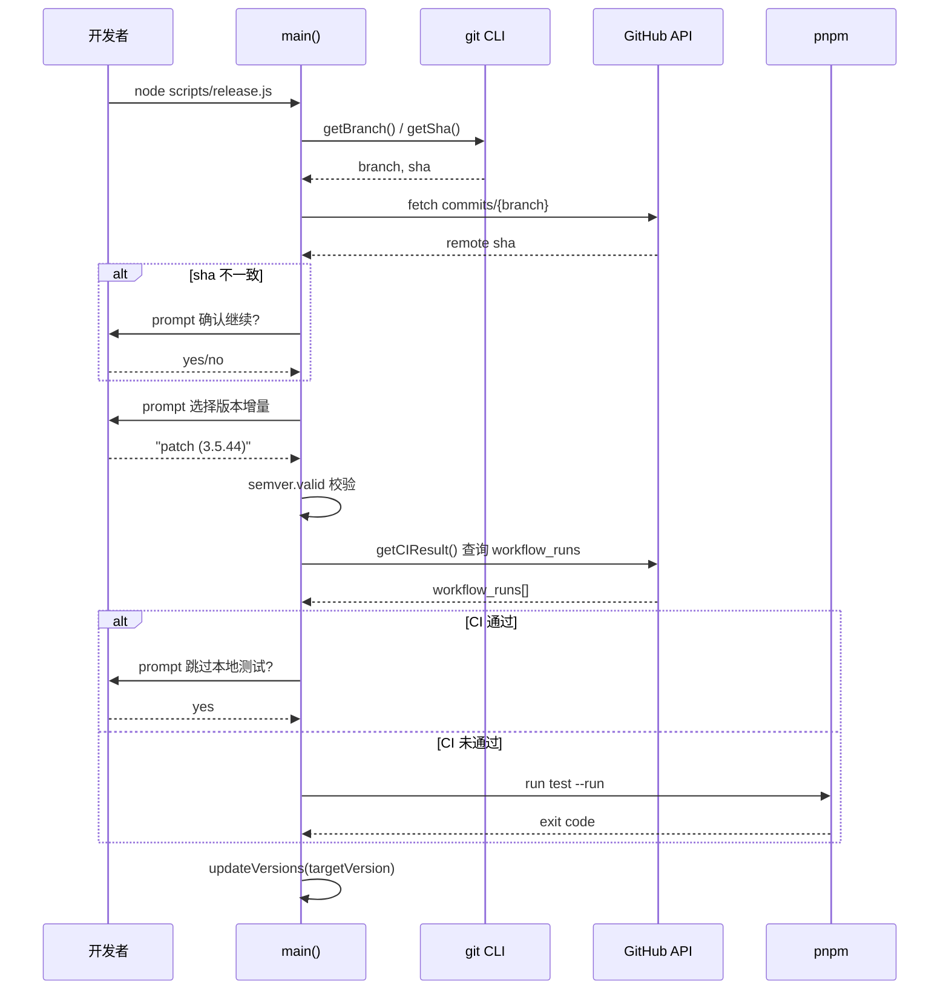
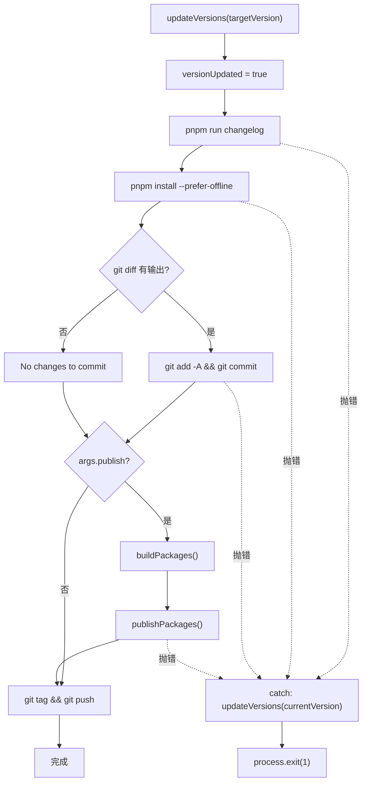

# Chapitre suivant : Chapitre 9 →

Statut de vérification : ancrage réel des numéros de ligne FACT

# Dans le chapitre précédent, nous avons utilisé template-explorer pour déduire le comportement du compilateur et maîtrisé la méthodologie d'observation des mécanismes internes par les outils. Maintenant, nous détournons notre regard de la compilation vers la publication — c'est le moment le plus dangereux pour tout projet open source : il touche simultanément quatre systèmes externes irréversibles que sont le numéro de version, les artefacts de build, l'historique Git et le registre npm. Un npm publish erroné ne peut pas être annulé, un push de tag erroné polluera la résolution de dépendances de tous les utilisateurs en aval. Vue core utilise un scripts/release.js de 537 lignes pour dompter ce danger — ce n'est ni un script purement automatisé, ni une liste purement manuelle, mais une machine à états interactive : s'arrêter pour demander à l'humain aux points critiques, exécuter entièrement automatiquement aux points prévisibles, et restaurer le numéro de version à son état initial en cas d'échec à n'importe quelle étape. Ce chapitre décomposera les trois mécanismes centraux de cet orchestrateur : l'analyse des paramètres et l'initialisation de l'état, la décision interactive de version et le contrôle CI, ainsi que l'ordre de publication et le rollback en cas d'échec.

## Analyse des paramètres et initialisation de l'état global

Modèle intuitif`release.js`Imaginez`parseArgs`comme le panneau de commande d'une vieille machine à laver : le bouton rotatif (

## ) détermine le mode à utiliser, les voyants lumineux (variables globales) enregistrent l'étape en cours, et le bouton « annuler » (gestion des erreurs) doit pouvoir ramener la machine à l'état précédant le remplissage d'eau. Sans cette logique d'initialisation, le script perdrait le contrôle sur la question « quelle version l'utilisateur veut-il réellement publier » — soit il publierait la mauvaise version, soit il resterait bloqué en CI à attendre une saisie clavier qui n'arrivera jamais.

> **[Design Inference & Architectural Trade-offs]**
> La première chose que fait le script après son lancement est d'analyser les arguments de ligne de commande en un objet structuré. Ici, on utilise le module intégré de Node`parseArgs`, plutôt que`yargs`ou`commander`— afin d'éliminer les dépendances tierces, car le script de publication lui-même doit pouvoir s'exécuter dans n'importe quel environnement, même si`node_modules`n'est installé qu'à moitié.

[FACT:scripts/release.js:27-62]définit 10 options, répartissables en quatre catégories :

- **Catégorie sémantique de version**：`preid`(identifiant de prépublication, tel que`alpha`/`beta`/`rc`）、`tag`（npm dist-tag）
- **Catégorie de saut**：`skipBuild`、`skipTests`、`skipGit`、`skipPrompts`— ces quatre commutateurs booléens constituent les boutons de réglage du « degré d'automatisation »
- **Catégorie de mode d'exécution**：`dry`(exécution à blanc),`publish`(s'il faut publier directement en local),`publishOnly`(publier sans mettre à jour la version)
- **Catégorie de cible**：`registry`(adresse de registre personnalisée)

Noter que`publish`la valeur par défaut de`false` [FACT:scripts/release.js:51-54], tandis que les autres booléens n'ont pas de valeur par défaut (c'est-à-dire`undefined`). Cette asymétrie est intentionnelle :`publish`la sémantique de est « faut-il exécuter npm publish en local », par défaut ne pas publier, en confiant l'action de publication à GitHub Actions ; tandis que`skipXxx`par défaut`undefined`signifie « non spécifié », et la logique ultérieure distinguera « l'utilisateur a explicitement passé`--skipTests`» de « l'utilisateur ne l'a pas passé ».

Une fois l'analyse terminée, le script aplatit les paramètres sur un ensemble de variables au niveau du module[FACT:scripts/release.js:64-66]：

```js
const preId = args.preid || semver.prerelease(currentVersion)?.[0]
const isDryRun = args.dry
let skipTests = args.skipTests
const skipBuild = args.skipBuild
const skipPrompts = args.skipPrompts
const skipGit = args.skipGit
```

Deux conceptions méritent ici d'être examinées. Premièrement,`preId`la priorité de valeur de est « spécification explicite en ligne de commande > inférence à partir de la version actuelle »[FACT:scripts/release.js:64-66]. Si la version actuelle de`package.json`est`3.5.0-beta.1`, alors`semver.prerelease`renverra`['beta', 1]`, et prendre`[0]`donne`'beta'`. Cela signifie que lors de publications successives sur la branche beta, il n'est pas nécessaire de taper`--preid beta`à chaque fois. Deuxièmement,`skipTests`est déclaré avec`let`tandis que les autres utilisent`const` [FACT:scripts/release.js:64-66], car il sera réécrit dynamiquement par le résultat de la CI dans`runTestsIfNeeded`— c'est un bit d'état de « décision différée ».

Vient ensuite la logique de découverte de paquets[FACT:scripts/release.js:68-83]: lire le répertoire`packages/`, filtrer les entrées non répertoires, celles sans`package.json`, ainsi que les paquets`private: true`. Noter qu'ici on lit`packages/`et non`packages-private/`— ce dernier est un paquet de débogage interne, jamais publié.

## L'algorithme de tri de l'ordre de publication

[FACT:scripts/release.js:85-85]définit une fonction apparemment simple mais cruciale :

```js
const sortPackagesForPublishing = (packageNames) => [
  ...packageNames.filter(p => p !== 'vue'),
  ...packageNames.filter(p => p === 'vue'),
]
```

Il place le paquet d'entrée`vue`en dernier. Le commentaire[FACT:scripts/release.js:85-85]en explique la raison : si l'on publie`vue`en premier, les utilisateurs pourraient installer la nouvelle version de`@vue/runtime-core`alors que des paquets internes comme`vue`ne sont pas encore en ligne, et npm signalerait une erreur faute de dépendance interne correspondante. C'est le compromis de « l'atomicité de publication » dans l'écosystème npm — npm n'a pas de transaction inter-paquets, et l'on ne peut qu'approcher l'atomicité par l'ordre.

## Construction dynamique de l'ensemble des candidats d'incrément de version

[FACT:scripts/release.js:111-116]construit les candidats du menu interactif :

```js
const versionIncrements = [
  'patch', 'minor', 'major',
  ...(preId ? ['prepatch', 'preminor', 'premajor', 'prerelease'] : []),
]
```

Il s'agit d'une expansion conditionnelle : ce n'est que lorsque`preId`existe (c'est-à-dire que l'on est actuellement dans le canal de prépublication, ou que l'utilisateur a explicitement spécifié`--preid`) que les types d'incrément liés à la prépublication sont ajoutés au menu. Si l'on est actuellement en version stable`3.5.43`et qu'aucun`preid`n'est spécifié, le menu ne contient que`patch/minor/major`trois éléments — évitant qu'une mauvaise manipulation de l'utilisateur ne transforme la version stable en une version de prépublication bancale comme`3.5.44-0`.

`inc`La fonction[FACT:scripts/release.js:120-120]encapsule`semver.inc`, en passant`preId`comme troisième paramètre. Il y a ici une défense de typage :`typeof preId === 'string' ? preId : undefined`— car`preId`pourrait être`string | undefined`, alors que`semver.inc`attend`string | undefined`, cette expression ternaire sert à satisfaire le rétrécissement de type de TS.

## Primitives d'exécution : le système à double voie run et dryRun

[FACT:scripts/release.js:122-123]est l'une des conceptions les plus ingénieuses de tout le chapitre :

```js
const run = async (bin, args, opts = {}) =>
  exec(bin, args, { stdio: 'inherit', ...opts })
const dryRun = async (bin, args, opts = {}) =>
  console.log(pico.blue(`[dryrun] ${bin} ${args.join(' ')}`), opts)
const runIfNotDry = isDryRun ? dryRun : run
```

`run`définit le stdio du sous-processus sur`inherit`, laissant la sortie de build/test se transmettre directement au terminal — ce qui est essentiel pour les builds de longue durée, l'utilisateur pouvant voir la progression en temps réel.`dryRun`se contente d'afficher la commande sans l'exécuter.`runIfNotDry`est un « choix de stratégie » : au chargement du module, le pointeur de fonction est lié à`dryRun`ou`run`, et tous les points d'appel ultérieurs n'ont plus besoin de vérifier`isDryRun`。

> **[Design Inference & Architectural Trade-offs]**
> Ce modèle consistant à « décider de la stratégie à l'initialisation » est moins sujet aux erreurs que « vérifier à chaque point d'appel » : si un point d'appel oublie de vérifier`isDryRun`, en mode dry run, l'effet de bord serait réellement exécuté. Or`runIfNotDry`centralise la vérification en un seul endroit, éliminant ce type d'omission.



---

# Décision interactive de version et verrou de CI

## Modèle intuitif

Cette phase ressemble au contrôle de sécurité d'un aéroport : on vérifie d'abord votre carte d'embarquement (le commit local est-il synchronisé avec le distant), puis on confirme où vous allez (le numéro de version), et enfin on vérifie que vous avez passé le contrôle (la CI est-elle passée). Si une seule étape échoue, tout le processus s'arrête. Sans ce verrou, un commit local non poussé pourrait être étiqueté et publié, faisant que le code source correspondant à la version sur npm n'existe pas du tout sur GitHub — c'est l'accident de publication le plus difficile à diagnostiquer.

## Vérification de synchronisation et sélection de version

`main`La première chose que fait la fonction`isInSyncWithRemote()` [FACT:scripts/release.js:141-141]est[FACT:scripts/release.js:337-363]. La logique de cette fonction`git rev-parse HEAD`est : prendre le nom de la branche actuelle, demander à l'API GitHub le SHA du dernier commit de cette branche, et le comparer avec le[FACT:scripts/release.js:348-355]local. En cas de divergence, une boîte de confirmation avec avertissement rouge`false`s'affiche, laissant l'utilisateur décider s'il faut continuer. Si la requête API échoue (problème réseau, absence de token), elle renvoie directement[FACT:scripts/release.js:365-367]。

> **[Design Inference & Architectural Trade-offs]**
> 〔Inférence de conception et arbitrages architecturaux〕

La philosophie de conception ici est « l'échec entraîne l'arrêt » : en cas d'anomalie réseau, mieux vaut empêcher la publication que de risquer de continuer dans un état inconnu. Car la publication est irréversible, tandis que le coût de réexécuter le script est très faible.`node scripts/release.js 3.6.0`），`targetVersion`La détermination du numéro de version suit deux chemins. Si l'utilisateur a passé un paramètre positionnel en ligne de commande (tel que[FACT:scripts/release.js:141-141]prend directement cette valeur[FACT:scripts/release.js:152-176]. Sinon, on entre dans le menu interactif`custom`: on laisse d'abord l'utilisateur choisir le type d'incrément, et s'il choisit

, une boîte de saisie supplémentaire s'affiche pour qu'il remplisse manuellement le numéro de version.[FACT:scripts/release.js:174]Noter

```js
targetVersion = release.match(/\((.*)\)/)?.[1] ?? ''
```

Copier`patch (3.5.44)`Le format de l'élément de menu est`custom`, cette regex extrait le numéro de version réel des parenthèses. Si l'utilisateur choisit[FACT:scripts/release.js:164-172]。

, c'est une autre branche qui est suivie[FACT:scripts/release.js:178-182]Il y a ensuite une logique de « seconde analyse »`targetVersion`: si`patch`/`minor`Ce type de mot-clé incrémental (l'utilisateur peut passer directement`node release.js minor`), on appelle`inc`pour le convertir en numéro de version concret. Enfin, on utilise`semver.valid`pour valider[FACT:scripts/release.js:184-186], un numéro de version invalide lève directement une erreur.

## Porte CI : la logique à trois états de runTestsIfNeeded

C'est le flux de contrôle le plus complexe de tout le chapitre.[FACT:scripts/release.js:281-317]Le`runTestsIfNeeded`de

**est en réalité une machine de décision à trois états :`--skipTests`**。`skipTests`État un : l'utilisateur a explicitement passé`true`initialisé à[FACT:scripts/release.js:314-316]。

**, on saute directement tout le corps de la fonction, on affiche "Tests skipped."**État deux : non sauté, et la CI est déjà passée`getCIResult()` [FACT:scripts/release.js:319-335]. Le script appelle`ci`, qui interroge l'API GitHub Actions pour vérifier s'il existe un workflow run nommé`conclusion === 'success'`et[FACT:scripts/release.js:319-335]. Si c'est validé, on demande à l'utilisateur « La CI est passée, voulez-vous sauter les tests locaux ? »[FACT:scripts/release.js:288-295]. Si l'utilisateur a activé`--skipPrompts`, on saute automatiquement les tests locaux[FACT:scripts/release.js:296-298]。

**État trois : non sauté, et la CI n'est pas passée**. Si`--skipPrompts`est activé, on lève directement une erreur[FACT:scripts/release.js:299-304]：

```js
throw new Error(
  'CI for the latest commit has not passed yet. ' +
    'Only run the release workflow after the CI has passed.',
)
```

Si`--skipPrompts`n'est pas activé, alors`skipTests`reste à`undefined`, on tombe dans la dernière branche de tests locaux[FACT:scripts/release.js:307-313], on exécute`pnpm run test --run`。

Il y a ici un détail subtil[FACT:scripts/release.js:285]：

```js
skipTests ||= isCIPassed
```

`||=`est une affectation par OU logique : on n'assigne`skipTests`que lorsque`undefined`est falsy (`false`ou`isCIPassed`). Cela signifie que si l'utilisateur a explicitement passé`--skipTests`（`true`), cette ligne ne le modifie pas ; si l'utilisateur n'a rien passé (`undefined`), on le définit sur le résultat de la CI. Mais juste après,[FACT:scripts/release.js:287-298]réassigne à nouveau lorsque la CI passe — donc`||=`l'effet réel de cette ligne est seulement « si la CI n'est pas passée, définir`skipTests`sur`false`», permettant ainsi à la branche`if (!skipTests)`suivante d'exécuter les tests locaux.

> **[Design Inference & Architectural Trade-offs]**
> Cette logique fait un détour, mais l'essence est d'exprimer : « CI passée → on peut sauter les tests locaux (mais on demande à l'utilisateur) ; CI non passée → on doit exécuter les tests locaux (sauf si l'utilisateur demande explicitement de sauter) ». L'écriture avec`||=`plus une surcharge ultérieure est compacte, mais peu lisible, c'est un code smell typique de « bit d'état modifié à plusieurs endroits ».



## Écriture des numéros de version : le parcours de updateVersions

[FACT:scripts/release.js:377-384]Le`updateVersions`de`package.json`fait deux choses : mettre à jour le`updatePackage`。`updatePackage` [FACT:scripts/release.js:391-398]racine, puis parcourir tous les sous-packages en appelant`name`pour lire le JSON, réécrire`version`et`JSON.stringify(pkg, null, 2) + '\n'`, et réécrire avec`\n`— notez le

`getNewPackageName`à la fin, c'est pour conserver un fichier terminé par un saut de ligne, évitant que git diff n'affiche "No newline at end of file".`keepThePackageName` [FACT:scripts/release.js:105]Le paramètre

---

# est par défaut

## , c'est-à-dire sans changer le nom du package. Ce paramètre existe pour supporter le scénario « renommer le package lors de la publication vers un registry personnalisé » — bien que les points d'appel actuels passent tous la valeur par défaut, l'interface réserve l'extensibilité.

Ordre de publication, idempotence et rollback en cas d'échec`updateVersions`Modèle intuitif

## Cette phase ressemble à des dominos :

> **[Design Inference & Architectural Trade-offs]**
> `publishPackage` [FACT:scripts/release.js:439-489]Publication idempotente : isPackagePublished et repli sur erreur[FACT:scripts/release.js:442-451]〔Inférence de conception et compromis d'architecture〕`--tag`est le cœur de la publication. Il détermine d'abord le dist-tag`alpha`/`beta`/`rc`: on privilégie le paramètre`version.includes('alpha')`, sinon on l'infère à partir du mot-clé`semver.prerelease`dans le numéro de version. Notez qu'on utilise ici`3.5.0-alpha.1`，`includes`plutôt que

— car le numéro de version peut être de la forme[FACT:scripts/release.js:453-458]：

```js
if (!isDryRun && (await isPackagePublished(packageName, version))) {
  console.log(pico.yellow(`Skipping already published: ${pkgVersion}`))
  alreadyPublishedPackages.push(pkgVersion)
  return
}
```

`isPackagePublished` [FACT:scripts/release.js:491-513]Avant la publication, il y a une vérification d'idempotence`npm view <pkg>@<version> version`Copier`true`exécute`false`, retourne

en cas de succès, retourne`npm view`en cas d'erreur de type E404. La raison d'être de cette vérification : le processus de publication peut être relancé suite à une interruption réseau, et un package déjà publié ne doit pas être republié (npm refusera une version en double).`isPackagePublished`Mais la vérification elle-même peut aussi échouer — par exemple si[FACT:scripts/release.js:507-510]lève une erreur non-E404 à cause d'un timeout réseau. Dans ce cas,

propage l'erreur vers le haut`pnpm publish`, ce qui interrompt toute la publication. C'est une nouvelle manifestation de « plutôt interrompre que prendre un risque ».`publishPackage`Même si la vérification passe,[FACT:scripts/release.js:480-488]：

```js
} catch (e) {
  if (e.message?.match(/previously published/)) {
    console.log(pico.red(`Skipping already published: ${pkgVersion}`))
    alreadyPublishedPackages.push(pkgVersion)
  } else {
    throw e
  }
}
```

fait un second repli dans le bloc catch`previously published`Copier

## On n'avale l'erreur que si elle correspond à

[FACT:scripts/release.js:412-432], toutes les autres erreurs sont relancées. C'est de la « tolérance précise » : on ne dégrade que pour des erreurs connues et sûres à ignorer.`pnpm publish`Assemblage dynamique des flags de publication

```js
const additionalPublishFlags = []
if (isDryRun) additionalPublishFlags.push('--dry-run')
if (isDryRun || skipGit || process.env.CI)
  additionalPublishFlags.push('--no-git-checks')
if (process.env.CI && !args.registry)
  additionalPublishFlags.push('--provenance')
```

`--no-git-checks`selon l'environnement d'exécution :`pnpm publish`Copier

`--provenance`est activé dans trois cas : dry run, skip git, ou en CI. La raison est que[FACT:scripts/release.js:425-427]vérifie par défaut si le workspace est propre, si la branche courante est la branche de publication, etc., et en CI ces vérifications produisent des faux positifs.`!args.registry`n'est activé qu'en CI et lorsqu'aucun registry personnalisé n'est spécifié

## . provenance est une fonctionnalité de sécurité de la chaîne d'approvisionnement de npm, qui signe et attache au package les informations d'origine de l'artefact de build (quel commit, quel workflow). Mais un registry personnalisé (comme un registry privé interne) ne supporte généralement pas provenance, d'où la condition

ajoutée.`main`Rollback en cas d'échec : le flag versionUpdated[FACT:scripts/release.js:528-537]：

```js
fnToRun().catch(err => {
  if (versionUpdated) {
    updateVersions(currentVersion)
  }
  console.error(err)
  process.exit(1)
})
```

`versionUpdated`Copier`false` [FACT:scripts/release.js:24-27]est un booléen au niveau du module, initialisé à`updateVersions`, et mis à`true` [FACT:scripts/release.js:208]immédiatement après le succès de l'appel à`true`. Si une étape ultérieure (génération de changelog, mise à jour du lockfile, git commit, publish) lève une erreur, le bloc catch vérifie ce flag, et s'il est à`currentVersion`。

> **[Design Inference & Architectural Trade-offs]**
> Ce rollback est « au mieux » : il ne restaure que`package.json`le numéro de version dans, sans restaurer le fichier changelog, le lockfile, ni le commit git déjà effectué. Si l'erreur se produit après le git commit, le dépôt se retrouve dans un état intermédiaire « numéro de version restauré mais commit existant ». C'est un compromis de conception — un rollback complet nécessiterait`git reset`, ce qui détruirait d'autres modifications que l'utilisateur aurait pu faire. Le script choisit donc de ne restaurer que le numéro de version critique, laissant l'utilisateur gérer le reste manuellement.

Attention`publishOnly`le chemin[FACT:scripts/release.js:519-526]ne définit pas`versionUpdated`, car sa sémantique est « publier uniquement, ne pas modifier la version » — même en cas d'échec, aucun rollback n'est nécessaire. Mais il appelle`targetVersion`lorsque`updateVersions` [FACT:scripts/release.js:519-526]existe, et en cas d'échec à ce moment, le numéro de version ne sera pas restauré. C'est un problème de bord potentiel, voir la question de réflexion en fin de chapitre.



## Ordre de publication et traitement spécial du paquet vue

`publishPackages` [FACT:scripts/release.js:412-432]parcourt`sortPackagesForPublishing(packages)`le résultat et appelle`publishPackage`un par un. Comme le tri place`vue`en dernier[FACT:scripts/release.js:85-85], toute la séquence de publication garantit que les paquets internes sont mis en ligne en premier.

`publishPackage`utilise en interne`cwd: getPkgRoot(pkgName)` [FACT:scripts/release.js:475]pour changer le répertoire de travail vers le répertoire du sous-paquet, afin que`pnpm publish`publie le sous-paquet et non le paquet racine. Le commentaire[FACT:scripts/release.js:462-463]rappelle spécifiquement « ne pas remplacer par npm publish » — car`pnpm publish`gère correctement le protocole de dépendance`workspace:*`, en le convertissant en numéro de version réel, tandis que`npm publish`conserverait`workspace:*`tel quel, provoquant un échec d'installation.

---

# Réflexion de conception

**Pourquoi utiliser`parseArgs`plutôt que`yargs`？**Le script de publication est la « dernière ligne de défense », il doit être exécutable dans n'importe quel environnement. Si une bibliothèque CLI tierce échoue à se charger à cause d'un arbre de dépendances corrompu, tout le processus de publication est paralysé. Le`parseArgs`intégré à Node, bien que rudimentaire (pas de sous-commandes, pas d'aide automatique), est sans dépendances et sans risque.

**Pourquoi définir`publish`par défaut à`false`？**Parce que la publication officielle de Vue passe par GitHub Actions (voir[FACT:scripts/release.js:256-263]le message d'aide), le script local ne fait que modifier le numéro de version, générer le changelog, créer le tag et pousser. Le véritable`npm publish`s'exécute dans la CI, ce qui permet de bénéficier de la signature de provenance et de l'environnement contrôlé de la CI.`--publish`Le flag

**est une porte de sortie pour les mainteneurs en cas d'urgence pour publier localement.**Pourquoi le rollback ne restaure-t-il que le numéro de version ?`package.json`Parce qu'un rollback complet nécessiterait de comprendre « quelles modifications ont été faites par le script et lesquelles par l'utilisateur », ce qui est impossible à distinguer au niveau de git. Le script choisit de ne restaurer que ce dont il est le plus certain d'avoir modifié —

---

# le numéro de version — et laisse le reste à l'appréciation de l'utilisateur.

`scripts/release.js`Résumé de ce chapitre

1. **implémente une « machine à états interactive » en 537 lignes de code, dont la conception centrale se résume en trois points :**Les paramètres sont la stratégie`runIfNotDry`: 10 flags sont analysés au chargement du module et aplatis en variables globales,

2. **lie la stratégie lors de l'initialisation, évitant les oublis de vérification aux points d'appel.**Barrières en amont

3. **: les vérifications de synchronisation, de version et les barrières CI sont toutes effectuées avant tout effet de bord, garantissant « tout ou rien ».**：`isPackagePublished`Tolérance aux erreurs précise`previously published`pré-vérification +`versionUpdated`en secours d'erreur constituent une double protection idempotente ;

le flag**réalise un rollback minimal.**。

# Ce mécanisme forme un contraste intéressant avec le Template Explorer du chapitre précédent : le Template Explorer « observe » — il visualise l'état interne du compilateur ; release.js « exécute » — il explicite chaque étape de l'état du processus de publication. Les deux incarnent la même philosophie d'ingénierie :

Transformer l'état implicite en état explicite, transformer les effets de bord incontrôlables en étapes contrôlables[FACT:scripts/release.js:285]Réflexions et auto-évaluation de ce chapitre`skipTests ||= isCIPassed`Q1 : Si l'on change`skipTests = isCIPassed`le`--skipTests`de

**en**, que se passe-t-il lorsque l'utilisateur passe explicitement`--skipTests`et que la CI échoue ? Pourquoi ?`skipTests`Analyse de référence`true` [FACT:scripts/release.js:64-66]，`||=`: Dans la logique originale, lorsque l'utilisateur passe`runTestsIfNeeded`,[FACT:scripts/release.js:282]est initialement à`if (!skipTests)`et ne le modifie pas, donc[FACT:scripts/release.js:314-316]dans le`skipTests = isCIPassed`de`skipTests`est évalué à faux, sautant directement à`false`qui affiche « Tests skipped. ». Si on change en[FACT:scripts/release.js:287], alors`if (isCIPassed)`est forcé à[FACT:scripts/release.js:299](CI échouée), ensuite le`else if (skipPrompts)`de`--skipPrompts`est faux, tombant dans le`skipTests`de`false`— si[FACT:scripts/release.js:307-313]n'est pas activé, alors`--skipPrompts`reste à[FACT:scripts/release.js:300-303], et finalement`||=`exécute les tests locaux. Cela va à l'encontre de l'intention de l'utilisateur de « sauter explicitement les tests », et dans un environnement CI (

Q2: `publishOnly`), cela lèvera directement une erreur[FACT:scripts/release.js:519-526], provoquant l'arrêt de la publication.`targetVersion`L'existence de`updateVersions`est précisément là pour respecter le choix explicite de l'utilisateur.`versionUpdated`Le chemin`buildPackages`appelle`publishPackages`lorsque

**existe, mais ne définit pas**：`publishOnly`. Si à ce moment`updateVersions(targetVersion)` [FACT:scripts/release.js:519-526]ou`package.json`lève une erreur, que se passe-t-il ? Cette conception est-elle raisonnable ?`versionUpdated = true`Analyse de référence`buildPackages` [FACT:scripts/release.js:519-526]appelle`publishPackages` [FACT:scripts/release.js:519-526]modifie le numéro de version de tous les`fnToRun().catch` [FACT:scripts/release.js:528-537], mais ne définit pas`versionUpdated`. Lorsque ensuite`false`ou`publishOnly`lève une erreur,`targetVersion`vérifie`updateVersions`qui est à`targetVersion`, et ne restaure pas le numéro de version. Le résultat est que le dépôt reste dans l'état « version modifiée mais publication échouée ». Cette conception est raisonnable dans la sémantique originale de[FACT:scripts/release.js:519-526](publier uniquement, ne pas modifier la version) — car`versionUpdated = true`n'est généralement pas passé,`publishOnly`ne s'exécute pas. Mais lorsque l'utilisateur passe`main`, ce chemin présente une faille de rollback. La correction consiste à ajouter

Q3: `isPackagePublished` [FACT:scripts/release.js:491-513]après`npm view`, ou à faire en sorte que`npm view`réutilise la logique de rollback de

**.**：`isPackagePublished`utilise[FACT:scripts/release.js:507-510]pour vérifier si le paquet est déjà publié. Si un timeout réseau fait que`isPackageNotFoundError`lève une erreur non-E404, que se passe-t-il ? Ce comportement est-il sûr dans un scénario de réexécution CI ?[FACT:scripts/release.js:515-515]Analyse de référence`/E404|No match found|No matching version|notarget/i`dans le bloc catch`isPackageNotFoundError`appelle`false`，`isPackagePublished`pour déterminer le type d'erreur. Cette fonction[FACT:scripts/release.js:507-510]ne correspond qu'à`publishPackage` [FACT:scripts/release.js:453], ce qui entraîne l'annulation de toute la publication. Dans le scénario de réexécution de la CI, cela conduit à « le paquet est déjà publié, mais le processus s'arrête à cause d'une instabilité réseau » — mais c'est une direction d'échec sûre : l'arrêt est préférable à une erreur de jugement « non publié » entraînant une publication en double. Une publication en double déclenche l'erreur`previously published`d'npm, rattrapée par[FACT:scripts/release.js:491-492], mais gaspille un aller-retour réseau. Donc « erreur réseau = arrêt » est un choix conservateur mais correct.

---

Le chapitre suivant abordera`.github/workflows/`, pour voir comment, après que release.js a poussé le tag, GitHub Actions prend en charge la construction et la publication ultérieures, ainsi que l'implémentation complète des barrières CI.

Jusqu'ici, nous avons vu clairement comment release.js utilise une machine à états et une orchestration interactive pour minimiser le risque irréversible d'une publication. Mais le script de publication n'est qu'un exécutant ; ce qui décide réellement quand déclencher et sous quelles conditions laisser passer, c'est le gardien automatisé de niveau supérieur. Le chapitre suivant analysera le système CI/CD dans le répertoire .github/workflows : comment ci.yml exécute la triple barrière lint/typecheck/test au stade de la PR, comment release.yml déclenche la publication lors du push d'un tag, comment size-report.yml et size-data.yml suivent les régressions de taille de paquet, comment autofix.yml corrige automatiquement les problèmes de format. Vous comprendrez comment Vue utilise GitHub Actions pour figer les normes d'ingénierie en un pipeline incontournable.
