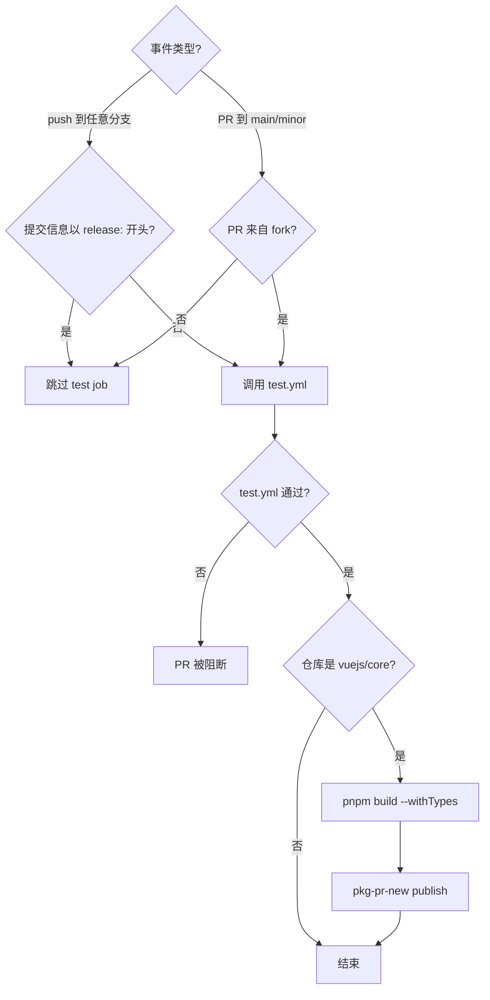
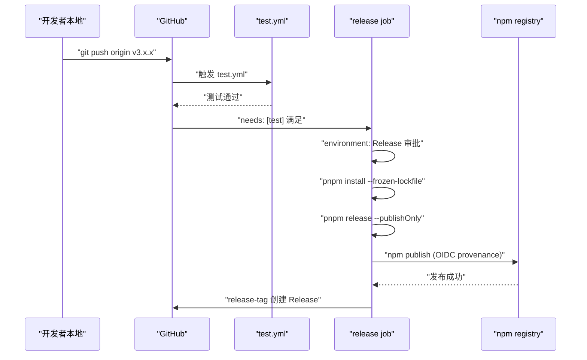
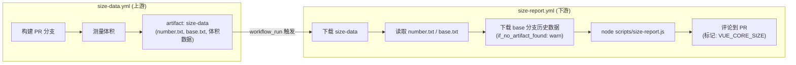

# Chapitre 10 : Workflows CI/CD : le gardien automatisé de la PR à la Release

Dans le chapitre précédent, nous avons vu`scripts/release.js`comment utiliser une machine à états interactive pour enchaîner chaque étape d'une publication. Mais ce script a un prérequis : il doit être appelé activement par une personne ou un système. Dans le dépôt Vue core, cet appelant actif n'est pas le terminal local d'un mainteneur, mais GitHub Actions. release.js est l'exécutant, les workflows sont le décideur — ils déterminent quel événement déclenche quelle tâche, sous quelles conditions laisser passer, sous quelles conditions bloquer. Ce chapitre se concentre sur`.github/workflows/`les quatre fichiers du répertoire :`ci.yml`(barrière de PR et prépublication continue),`release.yml`(publication officielle déclenchée par tag),`size-report.yml`(rapport de régression de taille),`autofix.yml`(correction automatique du format). Les comprendre ne consiste pas à mémoriser la syntaxe YAML, mais à voir clairement comment l'équipe Vue traduit les normes d'ingénierie en contraintes de pipeline incontournables.

# I. ci.yml : triple barrière et prépublication continue

## Modèle intuitif

Imaginez`ci.yml`comme un point de contrôle aéroportuaire. Chaque PR doit passer cette barrière : lint vérifie que vos bagages ne contiennent pas d'objets interdits, typecheck confirme que vos documents sont authentiques et valides, test vérifie que vous ne transportez pas de matières dangereuses. Mais il n'y a pas qu'un seul point de contrôle — Vue y a aussi accroché un canal de « prépublication continue », publiant directement les artefacts de build de chaque PR vers pkg-pr-new, permettant aux contributeurs de valider leurs modifications dans un scénario réel d'installation npm.

Sans cette barrière, toute fusion pourrait introduire des erreurs de format, des failles de type ou des régressions de comportement dans la branche main, or la branche main est la source de toutes les releases ultérieures.

## Conditions de déclenchement et contrôle de concurrence

`ci.yml`La configuration de déclenchement de

[FACT:.github/workflows/ci.yml:2-11]

```yaml
on:
  push:
    branches:
      - '**'
    tags:
      - '!**'
  pull_request:
    branches:
      - main
      - minor
```

Copier`push`Il y a ici deux conceptions clés. Premièrement,`'**'`l'événement écoute toutes les branches (`tags: ['!**']`), mais utilise`release.yml`pour exclure explicitement tous les push de tags. Pourquoi exclure les tags ? Parce que le push de tags est traité séparément par`ci.yml`; si`pull_request`répondait aussi aux tags, le processus de publication et le processus CI se déclencheraient en double, gaspillant les ressources des runners et pouvant même créer des conditions de course. Deuxièmement,`main`n'écoute que`minor`et`main`deux branches — c'est la stratégie à double branche de Vue :`minor`porte la version stable,

[FACT:.github/workflows/ci.yml:22-22]

```yaml
concurrency:
  group: ${{ github.workflow }}-${{ github.event.pull_request.number || github.ref }}
  cancel-in-progress: ${{ github.event_name == 'pull_request' }}
```

Copier`group`Le contrôle de concurrence est ici l'élément le plus ingénieux.`github.event.pull_request.number || github.ref`L'expression de`cancel-in-progress`utilise`true`comme fallback : les événements PR utilisent le numéro de PR comme clé de regroupement, les événements push utilisent le ref (nom de branche) comme clé de regroupement. Cela signifie que plusieurs push d'une même PR tombent dans le même groupe de concurrence. Et

> **[Design Inference & Architectural Trade-offs]**
> que pour les événements PR — lorsque vous poussez trois commits consécutifs, les CI des deux premiers sont automatiquement annulées, seule la plus récente est conservée.

## 〔Inférence de conception et compromis architecturaux〕

[FACT:.github/workflows/ci.yml:22-22]

```yaml
jobs:
  test:
    if: ${{ ! startsWith(github.event.head_commit.message, 'release:') && (github.event_name == 'push' || github.event.pull_request.head.repo.full_name != github.repository) }}
    uses: ./.github/workflows/test.yml
```

L'entrée des trois barrières : la condition du job test`if`Copier`&&`Cette

condition contient deux branches de ET logique (`! startsWith(github.event.head_commit.message, 'release:')`), chacune méritant d'être développée.`release:`Au début, on saute les tests. C'est exactement le format du message de commit poussé par release.js dans le chapitre précédent — release.js a déjà exécuté l'ensemble des tests en local, la CI n'a pas besoin de revérifier. C'est une optimisation de « confiance en amont ».

> **[Design Inference & Architectural Trade-offs]**
> La deuxième condition`(github.event_name == 'push' || github.event.pull_request.head.repo.full_name != github.repository)`: l'événement push exécute toujours les tests ; l'événement PR exige que la PR provienne d'un fork (`head.repo.full_name != github.repository`). Pourquoi seules les PR de fork sont exécutées ? Parce que les PR de branches du même dépôt sont généralement créées par les membres de l'équipe principale, et le push de leur branche a déjà déclenché la CI de l'événement push. En revanche, les PR de fork ne déclenchent pas l'événement push (le push d'un fork ne notifie pas le dépôt amont), il faut donc les exécuter en complément dans l'événement PR.

Attention`uses: ./.github/workflows/test.yml`— c'est un appel à un reusable workflow.`test.yml`est un fichier workflow indépendant, partagé par`ci.yml`et`release.yml`. Cette réutilisation évite de redéfinir les étapes lint/typecheck/test dans plusieurs workflows.

## Prépublication continue : le rôle de pkg-pr-new

[FACT:.github/workflows/ci.yml:25-51]

```yaml
continuous-release:
  if: github.repository == 'vuejs/core'
  runs-on: ubuntu-latest
  steps:
    - name: Checkout
      uses: actions/checkout@3d3c42e5aac5ba805825da76410c181273ba90b1 # v7.0.1
      with:
        persist-credentials: false
    # ... 安装 pnpm、Node.js、依赖 ...
    - name: Build
      run: pnpm build --withTypes
    - name: Release
      run: pnpx pkg-pr-new publish --compact --pnpm './packages/*' --packageManager=pnpm,npm,yarn
```

`continuous-release`Le job`vuejs/core`ne s'exécute que sur le dépôt principal`if: github.repository == 'vuejs/core'`), pas sur les forks. Il fait trois choses : build (`pnpm build --withTypes`, avec déclarations de types), puis utilise`pkg-pr-new`pour publier tous les packages sous`./packages/*`vers un registre npm temporaire.

> **[Design Inference & Architectural Trade-offs]**
> La valeur de ce mécanisme réside dans le fait que les contributeurs peuvent directement`npm install`les artefacts de build de cette PR dans leur propre projet, pour vérifier si les modifications résolvent réellement le problème. C'est plus convaincant que « voir la CI au vert », car cela valide un scénario réel de consommation du package.

Notez que toutes les actions sont verrouillées sur un commit SHA (comme`actions/checkout@3d3c42e5...`), plutôt que d'utiliser`@v4`un tag flottant comme celui-ci. C'est une exigence stricte de sécurité de la chaîne d'approvisionnement — empêcher l'injection automatique de code malveillant après la compromission d'un dépôt d'action.

## Graphe de flux de contrôle de ci.yml



---

# II. release.yml : orchestration de publication après push de tag

## Modèle intuitif

Si`ci.yml`est le point de contrôle de sécurité,`release.yml`est la rampe de lancement. Lorsque release.js a terminé localement la mise à jour du numéro de version, le commit, le tag et le push, l'événement de push de tag allume le moteur de`release.yml`. Il exécute d'abord une passe complète de tests (confirmation supplémentaire), puis exécute`Release`dans l'environnement protégé`pnpm release --publishOnly`, et enfin crée la GitHub Release.

Sans lui, le tag poussé par release.js ne serait qu'une référence Git, aucune nouvelle version sur npm, aucune page Release sur GitHub.

## Condition de déclenchement : uniquement les tags

[FACT:.github/workflows/release.yml:3-6]

```yaml
on:
  push:
    tags:
      - 'v*' # Push events to matching v*, i.e. v1.0, v20.15.10
```

N'écoute que les push de tags au format`v*`. Cela complète`ci.yml`de`tags: ['!**']`— les deux sont strictement mutuellement exclusifs et ne se déclenchent jamais simultanément.

## Conditions de garde du job de publication

[FACT:.github/workflows/release.yml:8-21]

```yaml
jobs:
  test:
    uses: ./.github/workflows/test.yml

  release:
    if: github.repository == 'vuejs/core'
    needs: [test]
    runs-on: ubuntu-latest
    permissions:
      contents: write
      id-token: write
    environment: Release
```

Il y a ici trois niveaux de garde, aucun ne peut être omis.

Premier niveau`if: github.repository == 'vuejs/core'`: empêche un déclenchement accidentel de publication sur un fork. Si quelqu'un forke le dépôt et pousse un tag`v1.0.0`, cette condition empêchera le processus de publication de s'exécuter.

Deuxième niveau`needs: [test]`: le job release dépend du job test. Le job test appelle`test.yml`, si les tests échouent, le job release ne démarrera pas du tout. C'est une contrainte stricte de « tests obligatoires avant publication ».

> **[Design Inference & Architectural Trade-offs]**
> Troisième niveau`environment: Release`: c'est un GitHub Environment, qui peut configurer des règles de protection de déploiement (comme nécessiter l'approbation de personnes spécifiques). Cela signifie que même si le push de tag déclenche le workflow, l'étape de publication peut nécessiter une approbation manuelle pour s'exécuter — c'est la dernière ligne de défense contre les opérations irréversibles.

Côté permissions,`contents: write`sert à créer la GitHub Release,`id-token: write`sert à l'authentification provenance de npm (token OIDC). Notez qu'il n'y a pas de`packages: write`ici, car Vue publie sur npm et non sur GitHub Packages.

## Chaîne complète de l'étape de publication

[FACT:.github/workflows/release.yml:37-46]

```yaml
- name: Install deps
  run: pnpm install --frozen-lockfile

- name: Update npm
  run: npm i -g npm@latest

- name: Build and publish
  id: publish
  run: |
    pnpm release --publishOnly
```

> **[Design Inference & Architectural Trade-offs]**
> Les trois étapes ont chacune leur subtilité.`--frozen-lockfile`garantit que l'environnement CI installe strictement selon le lockfile, évitant que la dérive des versions de dépendances ne rende les artefacts de build incohérents avec le local.`npm i -g npm@latest`sert à obtenir la dernière npm CLI — car la provenance et l'authentification OIDC dépendent de versions relativement récentes de npm, les anciennes versions pouvant ne pas supporter ces fonctionnalités.

`pnpm release --publishOnly`est le point d'entrée de release.js du chapitre précédent.`--publishOnly`Le flag

## indique à release.js : sauter la sélection interactive du numéro de version, sauter le commit Git et le tag (car le tag existe déjà), et exécuter uniquement le build et npm publish.

[FACT:.github/workflows/release.yml:48-57]

```yaml
- name: Create GitHub release
  id: release_tag
  uses: yyx990803/release-tag@8cccf7c5aa332d71d222df46677f70f77a8d2dc0 # v1.0.0
  env:
    GITHUB_TOKEN: ${{ secrets.GITHUB_TOKEN }}
  with:
    tag_name: ${{ github.ref }}
    body: |
      For stable releases, please refer to [CHANGELOG.md](...) for details.
      For pre-releases, please refer to [CHANGELOG.md](...) of the `minor` branch.
```

> **[Design Inference & Architectural Trade-offs]**
> 〔Inférence de conception et arbitrages architecturaux〕`release-tag` action。`tag_name: ${{ github.ref }}`Ici on utilise`refs/tags/v3.x.x`). Le corps de la Release ne contient pas les détails des changements, mais pointe vers CHANGELOG.md — car le changelog de Vue est généré automatiquement par conventional-changelog, et maintenir manuellement le corps de la Release créerait des incohérences avec le changelog.

## Diagramme de séquence de release.yml



---

# III. size-report.yml et autofix.yml : suivi de taille et auto-réparation de format

## size-report.yml : rapport de régression de taille inter-workflow

`size-report.yml`Le mode de déclenchement de  est très particulier — il n'est pas déclenché directement par un push ou une PR, mais par l'événement d'achèvement d'un autre workflow.

[FACT:.github/workflows/size-report.yml:3-7]

```yaml
on:
  workflow_run:
    workflows: ['size data']
    types:
      - completed
```

`workflow_run`L'événement écoute l'achèvement du workflow nommé`size data`. C'est une conception en deux phases :`size-data.yml`(le code source n'est pas fourni dans ce chapitre) est responsable de construire et mesurer la taille sur la PR, puis de téléverser le résultat comme artifact ;`size-report.yml`après l'achèvement de`size data`, télécharge l'artifact, génère le rapport et le commente sur la PR.

[FACT:.github/workflows/size-report.yml:20-23]

```yaml
if: >
  github.repository == 'vuejs/core' &&
  github.event.workflow_run.event == 'pull_request' &&
  github.event.workflow_run.conclusion == 'success'
```

Triple garde : dépôt principal, événement PR, succès du workflow amont. Si`size data`échoue, le job de rapport ne s'exécute pas — car il n'y a aucune donnée à rapporter.

Le flux de données est le suivant :

[FACT:.github/workflows/size-report.yml:41-46]

```yaml
- name: Download Size Data
  uses: dawidd6/action-download-artifact@d63b86af1b34672e53c440b1b83979861906bad7 # v24
  with:
    name: size-data
    run_id: ${{ github.event.workflow_run.id }}
    path: temp/size
```

Télécharge l'artifact`size-data`depuis le workflow run amont vers`temp/size`. Puis lit en parallèle le numéro de PR et la branche de base :

[FACT:.github/workflows/size-report.yml:48-59]

```yaml
- parallel:
    - name: Read PR Number
      id: pr-number
      uses: juliangruber/read-file-action@271ff311a4947af354c6abcd696a306553b9ec18 # v1.1.8
      with:
        path: temp/size/number.txt
    - name: Read base branch
      id: pr-base
      uses: juliangruber/read-file-action@271ff311a4947af354c6abcd696a306553b9ec18 # v1.1.8
      with:
        path: temp/size/base.txt
```

`parallel`est un sucre syntaxique de GitHub Actions qui permet à deux étapes sans dépendance de s'exécuter simultanément.`number.txt`et`base.txt`sont des fichiers de métadonnées écrits par`size-data.yml`lors de la mesure.

Ensuite, télécharge les données historiques de taille de la branche de base pour comparaison :

[FACT:.github/workflows/size-report.yml:61-69]

```yaml
- name: Download Previous Size Data
  uses: dawidd6/action-download-artifact@d63b86af1b34672e53c440b1b83979861906bad7 # v24
  with:
    branch: ${{ steps.pr-base.outputs.content }}
    workflow: size-data.yml
    event: push
    name: size-data
    path: temp/size-prev
    if_no_artifact_found: warn
```

Noter`if_no_artifact_found: warn`— si la branche de base n'a pas encore de données historiques (par exemple une nouvelle branche), cela n'échouera pas, mais émettra seulement un avertissement. Cela garantit que le rapport peut toujours être généré lors de la première exécution, simplement sans base de comparaison.

Enfin, génère le rapport et commente :

[FACT:.github/workflows/size-report.yml:71-89]

```yaml
- name: Prepare report
  run: node scripts/size-report.js > size-report.md

- name: Read Size Report
  id: size-report
  uses: juliangruber/read-file-action@271ff311a4947af354c6abcd696a306553b9ec18 # v1.1.8
  with:
    path: ./size-report.md

- name: Create Comment
  uses: actions-cool/maintain-one-comment-backup@fbbc22ad1809c1bcf46f19b58397b6254773588c # backup for v3.0.0
  with:
    token: ${{ secrets.GITHUB_TOKEN }}
    number: ${{ steps.pr-number.outputs.content }}
    body: |
      ${{ steps.size-report.outputs.content }}
      
    body-include: ''
```

`scripts/size-report.js`lit les données sous`temp/size`et`temp/size-prev`, et génère un rapport Markdown.`maintain-one-comment-backup`L'action utilise`body-include: '<!-- VUE_CORE_SIZE -->'`comme marqueur, garantissant qu'un seul commentaire de rapport de taille est conservé sur la même PR (mise à jour plutôt qu'ajout). Noter le commentaire à la L81 indiquant que le dépôt d'action original a été bloqué par GitHub, donc un dépôt de secours a été utilisé avec un commit verrouillé.

## autofix.yml : réparation automatique des problèmes de format

`autofix.yml`résout un problème très concret : le code soumis par le contributeur ne respecte pas les normes prettier/eslint, la CI échoue, et le contributeur doit exécuter manuellement`pnpm lint --fix`puis soumettre à nouveau. Ce workflow automatise cette étape.

[FACT:.github/workflows/autofix.yml:3-8]

```yaml
on:
  pull_request:

concurrency:
  group: ${{ github.workflow }}-${{ github.event.pull_request.number }}
  cancel-in-progress: ${{ github.event_name == 'pull_request' }}
```

Déclenche toutes les PR, le contrôle de concurrence est similaire à`ci.yml`— un nouveau push sur la même PR annule l'ancienne exécution autofix.

[FACT:.github/workflows/autofix.yml:35-41]

```yaml
- name: Run eslint
  run: pnpm run lint --fix

- name: Run prettier
  run: pnpm run format

- uses: autofix-ci/action@7a166d7532b277f34e16238930461bf77f9d7ed8
```

Exécute d'abord le`--fix`d'eslint, puis le formatage prettier, et enfin`autofix-ci/action`soumet directement les fichiers modifiés vers la branche de la PR. Noter que`pnpm run format`est lui-même une commande de formatage (pas besoin du flag`--fix`, car le script format est en interne`prettier --write`）。

> **[Design Inference & Architectural Trade-offs]**
> La clé de ce mécanisme est que`autofix-ci/action`soumet les corrections en tant qu'auteur de la PR, et non en tant que bot. Ainsi, les contributeurs n'ont pas besoin d'opérations supplémentaires, et les corrections de format apparaissent automatiquement dans leur PR. Mais cela signifie aussi que si la branche du contributeur a des règles de protection (interdisant les push de bot), autofix échouera — c'est un cas limite que le contributeur doit gérer manuellement.

## Diagramme de flux de données de size-report



---

# Réflexion de conception : cristalliser les normes dans le pipeline

En examinant ces quatre workflows, on peut voir plusieurs principes de conception qui traversent l'ensemble.

**Premièrement, minimisation des permissions.** `ci.yml`et`autofix.yml`déclarent tous`permissions: contents: read`, seul`release.yml`a besoin de`contents: write`et`id-token: write`。`size-report.yml`a besoin de`pull-requests: write`et`issues: write`pour publier des commentaires. Chaque workflow ne prend que les permissions dont il a réellement besoin.

**Deuxièmement, sécurité de la chaîne d'approvisionnement.**Toutes les actions tierces sont verrouillées à un commit SHA, plutôt qu'à un tag flottant.`size-report.yml`Le commentaire à la L81 indique même directement que le dépôt d'action original a été bloqué, puis qu'on est passé à un dépôt de secours avec un commit verrouillé — c'est une défense pratique contre les attaques de la chaîne d'approvisionnement.

**Troisièmement, séparation des responsabilités et réutilisation.** `test.yml`est partagé par`ci.yml`et`release.yml`, évitant la duplication de la logique de test.`size-data.yml`et`size-report.yml`sont séparés, permettant à la mesure et au rapport d'évoluer indépendamment.

**Quatrièmement, le choix de la direction d'échec.** `size-report.yml`Le`if_no_artifact_found: warn`de  choisit « avertir plutôt qu'échouer », car l'absence de données historiques ne devrait pas bloquer la PR. Tandis que le`release.yml`de`needs: [test]`choisit « bloquer la publication en cas d'échec de test », car la publication est une opération irréversible.

**Cinquièmement, différenciation du contrôle de concurrence.**L'événement PR annule les anciennes exécutions (`cancel-in-progress: true`), l'événement push ne les annule pas (`cancel-in-progress: false`). Cette différence reflète la sémantique des deux événements : les anciens commits d'une PR n'ont plus de sens, chaque commit d'un push peut être l'état final.

---

# Résumé de ce chapitre

Ce chapitre a analysé les quatre workflows principaux du dépôt Vue core :

- **`ci.yml`**: porte de PR + pré-publication continue. Via la condition`if`pour distinguer push/PR et fork/même dépôt, utiliser`concurrency`pour annuler les exécutions de PR obsolètes, utiliser`pkg-pr-new`pour publier des paquets de pré-publication installables.
- **`release.yml`**: Publication officielle déclenchée par tag. Trois niveaux de garde (vérification du dépôt, needs test, approbation de l'environnement) garantissent que seuls les tags ayant passé les tests et été approuvés peuvent être publiés sur npm.
- **`size-report.yml`**: Rapport de régression de taille inter-workflow. Via`workflow_run`événement d'écoute en amont`size data`terminé, télécharge l'artifact et compare les données de la branche base, puis renvoie le retour sous forme de commentaire sur la PR.
- **`autofix.yml`**: Correction automatique du format. Exécute eslint --fix et prettier sur la PR, via`autofix-ci/action`commit directement les corrections dans la branche de la PR.

Ces quatre workflows constituent ensemble un « pipeline incontournable » : les normes de code sont corrigées automatiquement par autofix, les types et les tests sont vérifiés de manière obligatoire par ci.yml, la régression de taille est suivie par size-report, et la publication est exécutée par release.yml sous de multiples gardes.

# Réflexions et auto-évaluation de ce chapitre

Q1 : Si l'on remplace dans`ci.yml`la valeur de`cancel-in-progress`par constamment`true`(c'est-à-dire en supprimant la condition`github.event_name == 'pull_request'`), dans quels scénarios cela poserait-il problème ?

**Analyse de référence**：`cancel-in-progress`Constamment`true`signifie que lors d'un push vers la branche main, un nouveau push annulera l'ancienne CI en cours d'exécution. Considérons ce scénario : deux PR sont fusionnées consécutivement sur la branche main, la CI de la première PR est en cours d'exécution (incluant lint/typecheck/test complets), la fusion de la deuxième PR déclenche une nouvelle exécution de la CI. Si`cancel-in-progress`est`true`, la CI de la première PR sera annulée — mais le code de la première PR est déjà sur main, et son résultat de CI est crucial pour juger de la santé de la branche main. L'annuler signifie qu'un segment de code sur la branche main n'a jamais été complètement validé. Or la condition[FACT:.github/workflows/ci.yml:22-22]de`github.event_name == 'pull_request'`vise précisément à éviter ce problème : seuls les événements PR annulent les anciennes exécutions, les événements push n'annulent jamais.

Q2: `release.yml`Dans`release`, que protègent respectivement`if: github.repository == 'vuejs/core'`et`environment: Release`du job

**? Que se passerait-il si l'on en supprimait un ?**：`if: github.repository == 'vuejs/core'` [FACT:.github/workflows/release.yml:14]Analyse de référence`v3.99.0`protège le scénario fork. Si quelqu'un fork vuejs/core et pousse un tag`pnpm release --publishOnly`, sans cette condition, le workflow exécuterait`environment: Release` [FACT:.github/workflows/release.yml:21]dans le dépôt fork. Bien que le dépôt fork n'ait pas de token npm et ne puisse pas réellement publier, cela gaspillerait des ressources de runner et pourrait produire des notifications d'échec trompeuses.`if`protège contre le risque de « publication automatique après push d'un tag » — il permet de configurer une approbation manuelle, garantissant que même si le tag est poussé, la publication nécessite la confirmation d'un mainteneur. Si l'on supprime la condition`environment`, le fork gaspillerait des ressources ; si l'on supprime

Q3: `size-report.yml`, toute personne ayant la permission de pousser un tag pourrait déclencher une publication, sans étape de confirmation humaine finale. Les deux sont des défenses de niveaux différents et ne peuvent se substituer l'une à l'autre.`if_no_artifact_found: warn`Dans`release.yml`, le choix de`needs: [test]`et dans

**, le choix de**：`if_no_artifact_found: warn` [FACT:.github/workflows/size-report.yml:69], quelle philosophie de conception de direction d'échec reflètent-ils respectivement ? Que se passerait-il si l'on intervertissait ces deux stratégies ?`fail`Analyse de référence`needs: [test]` [FACT:.github/workflows/release.yml:15]choisit « avertir plutôt qu'échouer en cas d'absence de données historiques », car le rapport de taille est une information auxiliaire, pas une condition bloquante. Si l'on remplaçait par

---

, alors une nouvelle branche ou une PR s'exécutant pour la première fois échouerait faute de données base, ce qui est manifestement déraisonnable.`scripts/size-report.js`choisit « bloquer la publication en cas d'échec des tests », car la publication est une opération irréversible et la qualité du code doit être garantie. Si l'on intervertissait — size-report échouant en l'absence de données, release publiant malgré l'échec des tests — le premier provoquerait de nombreux faux positifs bloquant des PR normales, le second ferait entrer du code non testé dans npm. Cela illustre le principe de conception de direction d'échec « tolérant pour les informations auxiliaires, strict pour les opérations irréversibles ».`usage-size`Le chapitre suivant approfondira le cœur du mécanisme de budget de taille :

comment`scripts/size-report.js`analyse les données de taille, comment il calcule l'incrément, comment il formate la sortie, ainsi que la philosophie de mesure de`scripts/usage-size.js`— pourquoi Vue choisit de mesurer la « taille réellement utilisée » plutôt que la « taille complète du paquet ».
