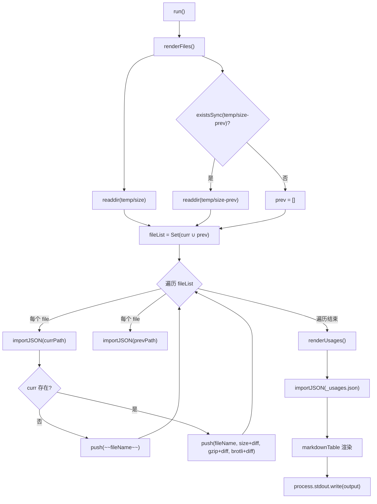
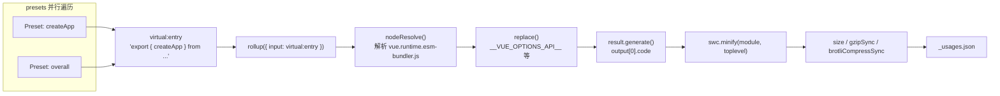

# comment

Dans le chapitre précédent, nous avons vu que Vue utilise GitHub Actions pour transformer le lint, la vérification de types, les tests et le suivi de taille en un pipeline incontournable, où size-report.yml et size-data.yml sont chargés de conserver les données de taille après chaque modification. Mais le pipeline ne fait qu'exécuter ; ce qui répond réellement à « de combien ça a grossi, et où ? », ce sont les deux scripts que ce chapitre va décomposer. La contradiction centrale du budget de taille réside dans le fait que la taille du bundle est un indicateur que l'on peut percevoir mais difficile à attribuer avec précision. Quand les utilisateurs se plaignent que « Vue est trop gros », les mainteneurs doivent répondre à trois questions — de combien ça a grossi ? où ? cette modification l'a-t-elle aggravé ? scripts/size-report.js est chargé de la comparaison, scripts/usage-size.js de l'attribution, et ensemble ils constituent la philosophie de mesure du budget de taille.

# 11.1 size-report : transformer les différences de taille en tableaux Markdown lisibles

## Modèle intuitif

Imaginez que vous êtes un inspecteur qualité dans une entreprise de logistique. Chaque colis (artefact de build) doit être pesé avant de quitter l'entrepôt, et votre travail n'est pas la pesée elle-même, mais de placer « le poids d'aujourd'hui » et « le poids d'hier » côte à côte dans un tableau, en mettant en gras`+2.3 kB`pour signaler quels colis ont pris du poids. Sans ce tableau comparatif, les mainteneurs ne verraient qu'une série de chiffres isolés et ne pourraient pas déterminer si une PR a introduit une régression de taille.

`size-report.js`est précisément cet inspecteur qualité. Il ne produit pas de données de taille (c'est le rôle de`usage-size.js`et des scripts de build), il consomme uniquement les fichiers JSON de deux répertoires et génère un rapport Markdown.

## Structure des données et convention de répertoires

La convention centrale du script est cachée dans deux constantes. Le répertoire de données actuel est`temp/size`, le répertoire de référence historique est`temp/size-prev`。

[FACT:scripts/size-report.js:23-24]

La dénomination de ces deux répertoires n'est pas arbitraire :`temp/size`est généré par le workflow`size-data.yml`à chaque exécution et téléversé comme artifact[FACT:.github/workflows/size-data.yml:53-57], tandis que`temp/size-prev`est obtenu par`size-report.yml`après avoir récupéré et décompressé l'artifact de référence. Le nom du répertoire est lui-même le contrat du flux de données.

Le script définit trois alias de types qui décrivent précisément la structure des fichiers JSON :

[FACT:scripts/size-report.js:8-21]

`SizeResult`possède trois champs numériques :`size`(non compressé),`gzip`、`brotli`。`BundleResult`y ajoute le champ`file`pour afficher le nom du fichier.`UsageResult`est quant à lui un`Record`, dont la clé est le nom du preset et la valeur un`SizeResult & { name: string }`— notez qu'il y a ici un champ`name`supplémentaire, car les clés d'un objet JSON sont perdues après`Object.values`, il faut donc stocker le nom de manière redondante dans la valeur.

## Step-by-Step Walkthrough

Le flux principal est minimaliste : seulement deux étapes plus une sortie :

[FACT:scripts/size-report.js:23-38]

`run()`on appelle d'abord`renderFiles()`pour rendre le tableau des fichiers d'artefacts, puis`renderUsages()`pour rendre le tableau des scénarios d'utilisation, et enfin on écrit en une seule fois dans stdout la chaîne accumulée dans la variable au niveau du module`output`. Ce modèle « accumuler la chaîne puis la sortir en une fois » évite les surcoûts de concaténation multiples de[FACT:scripts/size-report.js:25]et rend l'ordre de sortie entièrement contrôlable.`process.stdout.write`Première étape : collecter la liste des fichiers et en faire l'union.

**On filtre deux types de fichiers : ceux commençant par**

[FACT:scripts/size-report.js:44-49]

`filterFiles`(comme`_`) et ceux se terminant par`_usages.json`(comme`.txt`). Ces deux types de fichiers sont des métadonnées, pas des données de taille. On prend ensuite l'union`number.txt`、`base.txt`des noms de fichiers du répertoire actuel et du répertoire historique — en utilisant`fileList`pour dédupliquer. Pourquoi prendre l'union ? Parce qu'un fichier peut n'exister que dans le répertoire historique (cet artefact a été supprimé lors de ce build), ou n'exister que dans le répertoire actuel (un nouvel artefact a été ajouté lors de ce build). Les deux cas doivent apparaître dans le rapport.`Set`Deuxième étape : comparaison fichier par fichier.

**Pour chaque fichier de l'union, on tente d'importer le JSON depuis les deux répertoires respectivement.**

[FACT:scripts/size-report.js:43-75]

L'implémentation de`importJSON`est « retourne undefined si le fichier n'existe pas » :

[FACT:scripts/size-report.js:112-115]

On utilise ici un`import()`dynamique avec une assertion d'import`with: { type: 'json' }`, plutôt que`fs.readFileSync` + `JSON.parse`. Le premier est géré par le chargeur de modules de Node, le second nécessite de gérer manuellement l'encodage et les erreurs de parsing. Le coût de choisir`import()`est qu'il retourne une Promise, donc tout`renderFiles`est async.

La branche clé est dans`if (!curr)`: si le fichier n'existe pas dans le répertoire actuel, cela signifie que l'artefact a été supprimé, on le marque avec la syntaxe barrée de Markdown`~~fileName~~`sur[FACT:scripts/size-report.js:60-61]. Sinon on rend une ligne normale, en concaténant le résultat de`getDiff`après chaque valeur numérique.

**Troisième étape : calculer les différences.**

[FACT:scripts/size-report.js:124-130]

`getDiff`possède trois points de retour anticipé :`prev === undefined`retourne une chaîne vide quand (pas de référence, impossible de comparer) ;`diff === 0`retourne une chaîne vide quand (pas de changement, on n'affiche pas de bruit) ; sinon retourne la différence signée en gras. Notez que`prettyBytes(diff)`gère correctement les nombres négatifs et produira une forme comme`-1.2 kB`, tandis que la variable`sign`n'ajoute le`+`。

**que pour les positifs.**

[FACT:scripts/size-report.js:80-103]

`renderUsages`Quatrième étape : rendre le tableau usage.`renderFiles`La différence structurelle entre`_usages.json`et`Object.values(curr)`mérite attention : il importe directement`prev?.[usage.name]`, car les données usage existent toujours dans ce seul fichier.`name`convertit le Record en tableau, puis recherche les données historiques par nom via`.filter(usage => !!usage)`— c'est précisément la raison du stockage redondant du champ`map`. Cette ligne

est en fait redondante, car`markdown-table`retourne toujours un élément du tableau et ne produit jamais de valeur falsy.[FACT:scripts/size-report.js:72-74]。

## pour rendre le tableau à deux dimensions en tableau Markdown

> **[Design Inference & Architectural Trade-offs]**
> **Réflexions de conception et pièges`import()`〔Inférence de conception et arbitrages architecturaux〕`readFileSync`？**Pourquoi utiliser`import()`plutôt que

**`filterFiles`L'assertion d'import dynamique`file[0] !== '_'`pour JSON est la pratique standard de Node 20+, elle gère naturellement le chargement de JSON en environnement ESM. Le coût est qu'elle ne peut pas être utilisée dans un contexte synchrone, et que chaque import est mis en cache par le module — mais dans ce script à usage unique, le cache n'est pas un problème.**Le jugement`readdir`de`file[0]`. Ce jugement suppose que le nom de fichier n'est pas vide. Si`undefined`，`undefined !== '_'`retourne une chaîne vide (théoriquement impossible),

**Traitement des artefacts supprimés.**Lorsqu'un artefact est supprimé, le rapport le marque d'un trait de suppression plutôt que de le retirer directement. C'est un choix de conception délibéré : les mainteneurs doivent voir que « ce fichier a disparu », et non le laisser s'évanouir silencieusement du tableau. S'il était simplement filtré, le lecteur pourrait croire à tort que cet artefact n'a jamais existé.

# 11.2 usage-size : simuler le scénario d'importation d'un utilisateur réel

## Modèle intuitif

`size-report`Vous indique « quelle est la taille du paquet complet », mais cela ne répond pas à la question qui intéresse vraiment l'utilisateur : « Si je n'utilise que`createApp`, combien de code dois-je réellement télécharger ? » Le volume du paquet complet contient une grande quantité de code que vous n'utiliserez peut-être jamais (comme`defineCustomElement`、`Transition`、`KeepAlive`）。`usage-size.js`Le rôle de est de jouer un « utilisateur typique » : écrire un fichier d'entrée virtuel qui n'importe qu'une API spécifique, le bundler avec Rollup, et observer la taille du produit final.

C'est comme un restaurant qui ne vous dit pas « le poids total de tous les ingrédients dans la cuisine est de 50 kg », mais qui vous dit « pour une portion de poulet Kung Pao, les ingrédients réellement utilisés pèsent 300 grammes ».

## Structure de données : tableau de Presets

La structure de données centrale du script est`presets`tableau, chaque élément décrivant un scénario d'utilisation :

[FACT:scripts/usage-size.js:27-55]

`Preset`Le type possède trois champs :`name`(nom affiché),`imports`(liste des API importées depuis Vue), et optionnellement`replace`(substitutions supplémentaires à la compilation). Cinq presets couvrent les scénarios d'utilisation du plus petit au plus grand :

- `createApp (CAPI only)`: importer uniquement`createApp`, et remplacer`__VUE_OPTIONS_API__`par`'false'`, simulant un utilisateur de l'API Composition pure[FACT:scripts/usage-size.js:35-40]
- `createApp`: importer uniquement`createApp`, conserver l'Options API[FACT:scripts/usage-size.js:35-40]
- `createSSRApp`: scénario SSR[FACT:scripts/usage-size.js:35-40]
- `defineCustomElement`: scénario Web Components[FACT:scripts/usage-size.js:35-40]
- `overall`: importer six API principales, simulant un utilisateur « tout-en-un »[FACT:scripts/usage-size.js:44-54]

Le fichier d'entrée est fixé au produit esm-bundler en runtime-only :

[FACT:scripts/usage-size.js:24-28]

Choisir`vue.runtime.esm-bundler.js`plutôt que la version complète`vue.esm-bundler.js`, car la version runtime ne contient pas le compilateur de templates, ce qui est plus proche de la situation réelle des utilisateurs d'outils de build modernes — ils utilisent des templates précompilés par SFC et n'ont pas besoin du compilateur runtime.

## Step-by-Step Walkthrough

**Première étape : générer en parallèle les bundles de tous les presets.**

[FACT:scripts/usage-size.js:62-69]

`main()`Pour chaque preset, créer`generateBundle`de Promise, exécutées en parallèle avec`Promise.all`. La parallélisation est sûre ici, car chaque`generateBundle`appelle un`rollup()`indépendant, sans état partagé.

**Deuxième étape : construire l'entrée virtuelle.**

[FACT:scripts/usage-size.js:94-96]

C'est la partie la plus ingénieuse de tout le script. Il n'écrit pas de fichier temporaire sur le disque, mais construit un ID de module virtuel`virtual:entry`, dont le contenu est une instruction re-export :`export { createApp } from '/absolute/path/to/vue.runtime.esm-bundler.js'`. Notez que`entry`est un chemin absolu, car Rollup doit pouvoir le résoudre.

**Troisième étape : configurer la chaîne de plugins Rollup.**

[FACT:scripts/usage-size.js:98-121]

L'ordre du tableau de plugins est crucial :

1. **Personnalisé`usage-size-plugin`**：`resolveId`intercepte`virtual:entry`retourne lui-même,`load`retourne le contenu virtuel[FACT:scripts/usage-size.js:101-110]. C'est le modèle standard des modules virtuels de Rollup.

2. **`nodeResolve()`**: résoudre`vue.runtime.esm-bundler.js`les imports internes[FACT:scripts/usage-size.js:111]。

3. **`replace`**: injecter les constantes de compilation[FACT:scripts/usage-size.js:112-119]。

`replace`La configuration du plugin révèle le mécanisme central du produit esm-bundler : il conserve`__VUE_OPTIONS_API__`、`__VUE_PROD_DEVTOOLS__`et autres indicateurs runtime, remplacés par l'outil de build de l'utilisateur. Ici, le script effectue le remplacement à la place de l'utilisateur :

- `process.env.NODE_ENV` → `"production"`: prendre la branche de production
- `__VUE_PROD_DEVTOOLS__` → `'false'`: désactiver le support devtools
- `__VUE_PROD_HYDRATION_MISMATCH_DETAILS__` → `'false'`: désactiver les messages d'erreur détaillés d'hydratation
- `__VUE_OPTIONS_API__` → `'true'`: conserver l'Options API par défaut

Puis étendre`...preset.replace`, permettant au preset de remplacer les valeurs par défaut.`createApp (CAPI only)`Le preset utilise précisément ce mécanisme pour remplacer`__VUE_OPTIONS_API__`par`'false'` [FACT:scripts/usage-size.js:35-40]。

`preventAssignment: true`Empêcher le remplacement`obj.process.env.NODE_ENV = x`de ce type d'instruction d'affectation[FACT:scripts/usage-size.js:117]。

**Quatrième étape : générer, compresser, mesurer.**

[FACT:scripts/usage-size.js:123-134]

`result.generate({})`produit le code, prendre`output[0].code`. Puis compresser avec SWC :

[FACT:scripts/usage-size.js:125-130]

`module: true`indique que l'entrée est ESM,`toplevel: true`permet de compresser les noms de variables de portée supérieure. Après compression, calculer respectivement trois métriques :`minified.length`(longueur en octets),`gzipSync(minified).length`、`brotliCompressSync(minified).length`。

Notez qu'ici on utilise`node:zlib`l'API synchrone, et non la version asynchrone. Dans un script à usage unique, l'API synchrone est plus concise, et la compression elle-même étant une opération intensive en CPU, l'asynchrone n'apporterait pas de gain de parallélisme.

**Cinquième étape : sortie et persistance.**

[FACT:scripts/usage-size.js:62-86]

Les résultats sont d'abord imprimés sur la console dans un format lisible par l'homme, avec`pico`coloration[FACT:scripts/usage-size.js:62-86]. Puis écrits dans`temp/size/_usages.json`, avec`Object.fromEntries`pour reconvertir le tableau en Record, la clé étant le nom du preset[FACT:scripts/usage-size.js:81-85]。

`--write`L'indicateur contrôle si l'on écrit en plus le bundle non compressé de chaque preset sur le disque[FACT:scripts/usage-size.js:136-138], pour le débogage.

## Réflexions de conception et pièges rencontrés

> **[Design Inference & Architectural Trade-offs]**
> **Pourquoi utiliser des modules virtuels plutôt que des fichiers temporaires ?**Les fichiers temporaires nécessitent de gérer les chemins, le nettoyage, les conflits d'écriture concurrente. Les modules virtuels gardent le contenu de l'entrée en mémoire, et le`resolveId`/`load`hook de Rollup supporte naturellement ce modèle. Le coût est qu'il faut faire correspondre l'ID avec précision, toute faute de frappe provoquant une erreur Rollup « impossible de résoudre l'entrée ».

**`replace`Le`preventAssignment`piège de**Si l'on ne définit pas`preventAssignment: true`，`replace`, le plugin effectuera aussi le remplacement sur`process.env.NODE_ENV = 'x'`ce type d'instruction d'affectation, produisant`"production" = 'x'`une erreur de syntaxe. Le code source de Vue contient effectivement des affectations à`process.env.NODE_ENV`(dans les outils de test), donc cette option est nécessaire.

**`__VUE_OPTIONS_API__`Choix de la valeur par défaut de**Le script définit la valeur par défaut à`'true'` [FACT:scripts/usage-size.js:116], plutôt que`'false'`. C'est un choix conservateur : si l'utilisateur ne configure pas, Vue conservera le support de l'Options API.`createApp (CAPI only)`Le preset remplace explicitement par`'false'`, montrant le gain de taille après désactivation. Cette comparaison est en elle-même une documentation pour l'utilisateur : lui dire « combien on économise en désactivant l'Options API ».

**Parallèle`Promise.all`Sémantique d'échec de**Si le bundling de n'importe quel preset échoue,`Promise.all`rejette immédiatement, les autres empaquetages en cours ne seront pas annulés (Rollup ne fournit pas de mécanisme d'annulation). Dans CI, cela signifie qu'un échec gaspille le calcul des autres presets, mais le script lui-même se termine avec un code de sortie non nul, que CI peut correctement capturer.

# 11.3 Des données au contrôle qualité : comment CI consomme ces rapports

## Vue d'ensemble du flux de données

Pour comprendre ces deux scripts, il faut les replacer dans le pipeline CI.`size-data.yml`s'exécute lors d'un push vers main/minor ou d'une PR`pnpm run size` [FACT:.github/workflows/size-data.yml:45], produit`temp/size`le répertoire, puis le téléverse comme artifact[FACT:.github/workflows/size-data.yml:53-57]。

Pour les PR, il écrit en plus deux fichiers de métadonnées :

[FACT:.github/workflows/size-data.yml:47-51]

`number.txt`stocke le numéro de PR,`base.txt`stocke le nom de la branche cible. Ces deux fichiers sont exactement`size-report.js`dans`filterFiles`à filtrer`.txt`les fichiers[FACT:scripts/size-report.js:44-45]. Ils existent pour que le`size-report.yml`en aval sache « avec quelle base comparer ».

## Obtention et comparaison de la base

`size-report.yml`(détaillé dans le chapitre précédent) le workflow est : télécharger le`size-data`artifact de la PR actuelle, télécharger l'artifact de base de la branche cible, décompresser la base dans`temp/size-prev`, puis exécuter`size-report.js`pour générer un rapport Markdown et commenter sur la PR.

Il y a ici une contrainte de conception clé :`size-report.js`lui-même n'est pas responsable de l'obtention de la base, il suppose que`temp/size-prev`existe déjà. S'il n'existe pas,`existsSync(prevDir)`retourne false,`prev`est un tableau vide[FACT:scripts/size-report.js:48], tous les diffs sont des chaînes vides. C'est une dégradation gracieuse : sans base, le rapport est quand même généré, il n'affiche simplement pas les différences.

## Logique de décision du contrôle de taille

> **[Design Inference & Architectural Trade-offs]**
> Il faut clarifier un malentendu courant :`size-report.js`lui-même ne fait pas de jugement de contrôle qualité. Il génère seulement un rapport, ne retourne pas de code de sortie, ne définit pas de seuil. Le véritable contrôle qualité se produit au niveau du`size-report.yml`workflow — il peut contenir une étape qui analyse les valeurs de diff dans le rapport et fait échouer le job si le seuil est dépassé.

Cette conception de « séparation mesure/jugement » a des raisons profondes : le script de mesure doit rester pur, ne produire que des faits ; la logique de jugement doit être au niveau du workflow, car les seuils peuvent varier selon la version, la branche, la phase de release. Coder en dur les seuils dans`size-report.js`le rendrait difficile à réutiliser.

# Réflexions de conception

**Pourquoi le budget de taille nécessite-t-il deux ensembles de mesures ?**La taille complète du bundle et la taille usage répondent à des questions différentes. La taille complète est la « limite supérieure » — elle vous dit combien l'utilisateur doit télécharger dans le pire des cas. La taille usage est la « valeur typique » — elle vous dit combien la plupart des utilisateurs téléchargent réellement. Les deux combinées donnent un portrait complet de la taille. Si on n'avait que la taille complète, les mainteneurs auraient tendance à sur-optimiser les API peu utilisées ; si on n'avait que la taille usage, on pourrait ignorer l'explosion de taille de certains cas limites.

**Signification des doubles métriques gzip et brotli.**Les CDN modernes supportent généralement brotli, mais pas dans tous les scénarios. Rapporter les deux permet aux mainteneurs d'évaluer « quelle est la taille dans un environnement qui ne supporte que gzip ». brotli est généralement 15-20% plus petit que gzip, cet écart est en soi une information précieuse.

**Contrat de stabilité du format de données.** `size-report.js`et`usage-size.js`sont découplés via des fichiers JSON.`usage-size.js`écrit`_usages.json`，`size-report.js`le lit. Les noms de champs de ce contrat (`name`、`size`、`gzip`、`brotli`) sont implicites, sans validation de schéma. Si`usage-size.js`change un nom de champ et oublie de synchroniser`size-report.js`, le rapport affichera silencieusement des données erronées. C'est le point fragile de la conception actuelle.

# Résumé de ce chapitre

# Réflexions et auto-évaluation de ce chapitre

Q1: `size-report.js`le`filterFiles`filtre les fichiers commençant par`_`. Si`usage-size.js`renomme le fichier de sortie de`_usages.json`en`usages.json`, que se passe-t-il ?

**Analyse de référence**：`filterFiles`la condition de filtrage est`file[0] !== '_' && !file.endsWith('.txt')` [FACT:scripts/size-report.js:44-45]. Si le fichier est renommé en`usages.json`, il ne commence plus par`_`, sera`filterFiles`conservé, entre dans`fileList`l'union. Puis`renderFiles`tentera de le traiter comme un fichier bundle :`importJSON`peut l'importer avec succès (c'est du JSON valide), mais sa structure est`Record<string, UsageResult>`et non`BundleResult`, donc`curr?.file`est`undefined`，`fileName`une chaîne vide,`curr.size`aussi`undefined`，`prettyBytes(undefined)`lancera une erreur ou produira une sortie anormale. Cela entraînera l'échec de la génération du rapport. La racine du problème est que`filterFiles`utilise le préfixe du nom de fichier comme critère de distinction « métadonnées vs données », plutôt que la structure de répertoires ou un manifeste explicite. Une approche plus robuste serait de placer les données usage dans un sous-répertoire, ou de maintenir une liste explicite de fichiers de métadonnées.

Q2: `usage-size.js`dans`Promise.all(tasks)`exécute en parallèle l'empaquetage de tous les presets. Si la`replace`configuration d'un preset omet`__VUE_OPTIONS_API__`, que se passe-t-il ? Pourquoi la valeur par défaut est-elle`'true'`et non`'false'`？

**Analyse de référence**：`replace`Dans la configuration du plugin,`__VUE_OPTIONS_API__: 'true'`est la valeur par défaut, puis l'expansion de`...preset.replace`permet de remplacer[FACT:scripts/usage-size.js:116-118]. Si un preset omet la configuration, il utilisera la valeur par défaut`'true'`, c'est-à-dire conserve le support de l'Options API, la taille sera plus grande. La valeur par défaut`'true'`est un choix conservateur : elle reflète « le comportement réel quand l'utilisateur ne configure pas ». Dans les artefacts esm-bundler de Vue,`__VUE_OPTIONS_API__`le comportement par défaut est de conserver l'Options API (sauf si l'utilisateur le désactive explicitement). Si la valeur par défaut était`'false'`, tous les presets non explicitement configurés afficheraient une taille plus petite, induisant l'utilisateur en erreur en lui faisant croire que « ne pas configurer permet d'économiser de la taille ».`createApp (CAPI only)`le preset est explicitement défini sur`'false'` [FACT:scripts/usage-size.js:35-40], précisément pour montrer « le gain après désactivation explicite », en contraste avec la valeur par défaut.

Q3: `size-report.js`le`importJSON`utilise un`import()`dynamique plutôt que`fs.readFileSync`. Si`temp/size-prev`un fichier JSON dans le répertoire est corrompu (JSON invalide), quelle est la différence de comportement entre les deux implémentations ?

**Analyse de référence**: le`import()`dynamique lancera`SyntaxError`lors de l'analyse d'un JSON invalide, et cette erreur ne peut pas être capturée par`importJSON`la vérification`existsSync`interne —`existsSync`Vérifie uniquement si le fichier existe, sans contrôler la validité du contenu[FACT:scripts/size-report.js:112-115]. L'erreur se propagera vers le haut jusqu'à`renderFiles`, entraînant l'échec de la génération du rapport entier. Si on utilise`fs.readFileSync` + `JSON.parse`, une erreur sera également levée, mais on peut l'encapsuler dans un try-catch à l'intérieur de`importJSON`, et retourner`undefined`pour réaliser une dégradation gracieuse. L'implémentation actuelle choisit de laisser l'erreur se propager, avec l'hypothèse implicite que « le JSON dans l'artifact est nécessairement valide » — cette hypothèse est généralement vérifiée dans un environnement CI, car les fichiers sont générés par`usage-size.js`et les scripts de build. Mais en débogage local, si le fichier JSON est modifié manuellement et corrompu, le rapport plantera directement au lieu d'ignorer ce fichier. C'est un choix de conception « faire confiance à la source de données ».

---

Le mécanisme de budget de taille résout les questions « quoi mesurer » et « comment comparer », mais il repose sur un prérequis : les artefacts de build eux-mêmes sont reproductibles. Le chapitre suivant abordera le bac à sable de débogage minimal :`vite-debug`comment démarrer un environnement de développement Vue interactif avec un minimum de configuration, et comment il s'articule avec les artefacts de build locaux pour former une boucle fermée allant de la modification du code source à la validation à l'exécution.

À ce stade, la boucle de mesure du budget de taille est claire : size-report.js répond à « de combien c'est plus gros » par comparaison de répertoires, usage-size.js répond à « où c'est plus gros » en simulant des scénarios d'import réels via des modules virtuels, et la décision de seuil est laissée à la couche workflow. Ce mécanisme transforme la régression de taille d'une plainte vague en données traçables. Mais les données ne peuvent que vous dire que le problème existe ; pour vraiment localiser et corriger, il faut un environnement minimal capable de reproduire rapidement le problème. Le chapitre suivant abordera packages-private/vite-debug, pour voir comment Vue construit un bac à sable de débogage minimal avec Vite + SFC, transformant « faire une reproduction minimale sur le code source réel » en une pratique quotidienne opérationnelle.
