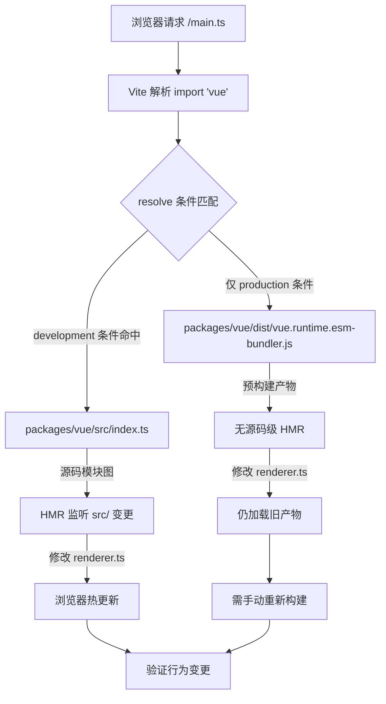

# Chapitre 12 : Bac à sable de débogage minimal : vite-debug et boucle de développement local

Dans le chapitre précédent, nous avons complété la boucle de mesure du budget de taille : size-report.js répond à « de combien c'est plus gros », usage-size.js répond à « où c'est plus gros », et la couche workflow est responsable de la décision de seuil. Mais ce mécanisme a un prérequis implicite — les artefacts de build eux-mêmes sont reproductibles. Lorsque vous découvrez qu'un package a une taille anormalement gonflée, ou qu'un comportement à l'exécution ne correspond pas aux attentes, vous avez besoin d'un environnement minimal capable de charger rapidement le code source local et de voir immédiatement l'effet après modification. packages-private/vite-debug est cet environnement. Il ne contient que quatre fichiers, totalisant moins de 40 lignes de code, mais il constitue le point d'entrée pratique quotidien pour « faire une reproduction minimale sur le code source réel » dans le dépôt Vue core. Ce chapitre décomposera fichier par fichier la logique de construction de ce bac à sable, et expliquera pourquoi il est placé dans packages-private plutôt que dans le répertoire packages.

# I. Le squelette du bac à sable :`main.ts`et`App.vue`la chaîne de montage minimale

## Modèle intuitif

Si l'on compare tout le runtime Vue à un moteur, alors`vite-debug`est un « banc d'essai à nu » — sans carrosserie, sans tableau de bord, avec juste le câblage minimal pour faire tourner le moteur. Sa valeur ne réside pas dans la complétude fonctionnelle, mais dans**l'élimination de toutes les variables parasites**: lorsque vous soupçonnez qu'un bug se trouve dans le système de réactivité ou à l'intérieur du renderer, vous ne voulez pas que la complexité de l'environnement de débogage lui-même devienne une source de bruit.

## Structures de données et disposition des fichiers

Regardons d'abord`main.ts`tout le contenu :

[FACT:packages-private/vite-debug/main.ts:4-4]

```ts
import { createApp } from 'vue'
import App from './App.vue'

const app = createApp(App)

app.mount('#app')
```

Ces six lignes de code sont le paradigme standard de démarrage d'une application Vue, mais chaque ligne a une signification d'ingénierie précise dans un contexte de débogage :

- **L1**dans le`import { createApp } from 'vue'`de`'vue'`, ce que l'identifiant de module`vite.config.ts`résout finalement dépend entièrement des déclarations de dépendances de`package.json`et
- **L2**. C'est le maillon le plus critique de tout le bac à sable — nous verrons plus tard comment il est redirigé vers le code source local.`import App from './App.vue'`le`@vitejs/plugin-vue`de`App.vue`déclenche le pipeline de compilation SFC de`<script>`、`<template>`、`<style>`: Vite enregistre ce plugin au démarrage du dev server, et lorsque le navigateur demande
- **L4**, le plugin le décompose en`createApp(App)`trois modules virtuels compilés séparément.`app._context`、`app._instance`le
- **L6**de`app.mount('#app')`crée l'instance d'application ; à ce moment Vue initialise en interne`app`et d'autres champs principaux, mais ne déclenche encore aucun rendu.

le`index.html`de`index.html`est le véritable interrupteur de démarrage : il recherche dans le DOM l'élément conteneur avec l'id`<div id="app"></div>`, crée l'instance du composant racine, et déclenche le premier rendu.`<script type="module" src="/main.ts"></script>`Notez qu'il n'y a pas ici de référence à`app.mount('#app')`— la convention de Vite est que le

## à la racine du projet sert de HTML d'entrée, contenant

et`App.vue`. Bien que ce fichier ne figure pas dans les keyFiles de ce chapitre, il est le prérequis au succès de

[FACT:packages-private/vite-debug/App.vue:4-8]

```vue

import { ref } from 'vue'

const count = ref(0)

  {{ count }}

button {
  color: red;
}

```

Walkthrough guidé par scénario : la chaîne complète d'un clic**Regardons maintenant**

**, c'est le « support d'expérimentation » de ce bac à sable :**

`@vitejs/plugin-vue`Copier`App.vue`Plaçons-nous dans un scénario concret :

- `<script setup>`Que se passe-t-il lorsque l'utilisateur clique sur le bouton dans le navigateur ?`setup()`Première étape : phase de compilation SFC (au démarrage du dev server)`ref(0)`compile`RefImpl`en trois parties :`.value`le bloc`0`。
- `<template>`est compilé en fonction`{{ count }}`du composant,`_toDisplayString(count.value)`，`@click="count++"`l'appel retourne un objet`onClick: $event => (count.value++)`。
- `<style>`dont le`<style>`est initialement

**le bloc`app.mount`est compilé en fonction de rendu,**

`createApp(App)`est converti en`mount('#app')`, le composant racine est créé`ComponentInternalInstance`, exécute`setup()`pour obtenir`count`le RefImpl de, puis appelle la fonction de rendu pour générer l'arbre VNode. Dans la fonction de rendu, la lecture de`count.value`déclenche`track`la collecte de dépendances — l'effet de rendu actif actuel (`ReactiveEffect`) est enregistré dans`count`le`dep`de.

**Troisième étape : événement de clic (lors de l'interaction utilisateur)**

Le navigateur déclenche`click`l'événement, le gestionnaire d'événements de Vue exécute`count.value++`. Il s'agit d'une opération setter, qui déclenche`trigger`: parcourt`count.dep`les effets collectés dans, planifie un nouveau rendu. Comme il s'agit d'une mise à jour synchrone et qu'elle ne se trouve pas dans la file de traitement par lots, l'effet de rendu est exécuté immédiatement, la fonction de rendu est rappelée, un nouveau VNode est généré, un diff est effectué avec l'ancien VNode, et il est découvert que le contenu textuel passe de`0`à`1`, mettant à jour le`textContent`。

du DOM réel. L'ensemble du chaînage peut être représenté par le diagramme de flux de données suivant :

```mermaid
flowchart LR
    subgraph compile["编译期 (Vite Dev Server)"]
        sfc["App.vue"] -->|"@vitejs/plugin-vue"| script["setup() 函数"]
        sfc -->|"@vitejs/plugin-vue"| render["渲染函数"]
        sfc -->|"@vitejs/plugin-vue"| style["CSS 模块"]
    end
    subgraph runtime["运行时 (浏览器)"]
        script -->|"ref(0)"| refimpl["RefImpl { value: 0 }"]
        render -->|"读取 count.value"| track["track() 收集依赖"]
        click["用户点击"] -->|"count.value++"| trigger["trigger() 触发更新"]
        trigger -->|"调度渲染副作用"| rerender["重新执行渲染函数"]
        rerender -->|"diff + patch"| dom["更新真实 DOM"]
    end
    track -.->|"dep 记录 ReactiveEffect"| trigger
```

Le point clé de ce diagramme est le suivant :**Il n'y a que deux points de couplage entre les artefacts de compilation et le comportement d'exécution**——`ref(0)`l'objet RefImpl retourné par, ainsi que la lecture et l'écriture de`count.value`dans la fonction de rendu. Cela signifie que si vous souhaitez déboguer une branche spécifique du système de réactivité (par exemple`trigger`la logique de planification dans), il vous suffit de construire le modèle de lecture-écriture correspondant dans ce`App.vue`.

## Réflexion de conception : pourquoi`ref`plutôt que`reactive`？

> **[Design Inference & Architectural Trade-offs]**
> Choisir`ref(0)`plutôt que`reactive({ count: 0 })`comme exemple par défaut implique une considération de priorité au débogage :`ref`le`.value`chemin d'accès de est plus court, lors de l'expansion de l'objet`RefImpl`dans le débogueur, on peut voir directement`_value`、`dep`、`__v_isRef`les champs internes tels que, tandis que l'expansion de l'objet Proxy retourné par`reactive`dans la console déclenche le getter, ce qui peut interférer avec l'observation de l'état d'origine. Pour le scénario de « reproduction minimale », réduire une couche d'indirection Proxy signifie moins de variables.

---

# Deuxièmement, résolution d'alias :`vite.config.ts`et`package.json`comment faire pointer`'vue'`vers le code source local

## Modèle intuitif

`vite.config.ts`ne comporte que six lignes, mais c'est le « centre de routage » de tout le bac à sable — il détermine si le`import { createApp } from 'vue'`dans`'vue'`charge finalement la version publiée sur npm ou le code source en cours de développement dans le dépôt. Sans une configuration d'alias correcte, le code que vous modifiez dans`App.vue`pourrait ne pas du tout déclencher la source Vue que vous déboguez, et le débogage devient « tirer sur la mauvaise cible ».

## Structure de données et chaîne de résolution

Regardons d'abord`vite.config.ts`：

[FACT:packages-private/vite-debug/vite.config.ts:4-6]

```ts
import { defineConfig } from 'vite'
import vue from '@vitejs/plugin-vue'

export default defineConfig({
  plugins: [vue()],
})
```

Ici**n'a pas de configuration`resolve.alias`explicite**. Alors comment`'vue'`est-il résolu vers le code source local ? La réponse se trouve dans`package.json`:

[FACT:packages-private/vite-debug/package.json:1-15]

```json
{
  "name": "vite-debug",
  "private": true,
  "type": "module",
  "scripts": {
    "dev": "vite",
    "build": "vite build",
    "serve": "vite preview"
  },
  "devDependencies": {
    "@vitejs/plugin-vue": "catalog:",
    "vite": "catalog:",
    "vue": "workspace:*"
  }
}
```

La clé est**L13**：`"vue": "workspace:*"`. Il s'agit de la déclaration du protocole pnpm workspace, indiquant que`vite-debug`dépend du package local nommé`vue`dans le monorepo, et non de la version sur le registre npm. pnpm créera un lien symbolique dans`node_modules/vue`, pointant vers`packages/vue`(le répertoire du package principal de Vue).

Mais cela ne suffit pas —`packages/vue`le`package.json`dans`main`/`module`/`exports`le champ**pointe généralement vers**les artefacts de build`dist/vue.runtime.esm-bundler.js`(comme`src/`), et non vers le code source sous`packages/runtime-core/src/renderer.ts`. Si vous modifiez`dist`, mais sans reconstruire, Vite chargera toujours l'ancien fichier

> **[Design Inference & Architectural Trade-offs]**
> 〔Inférence de conception et compromis architecturaux〕`packages/vue/package.json`C'est pourquoi le`"development"`de Vue core configure généralement`resolve.conditions`des exports conditionnels ou un mappage d'entrée source similaire — en mode dev, le`development`de Vite correspond en priorité à la condition`src/index.ts`, chargeant ainsi`dist`plutôt que`vite-debug`. Ce mécanisme permet à

## de voir immédiatement les effets via HMR après modification du code source, sans configuration explicite d'alias.`import 'vue'`Parcours guidé par scénario : un processus de résolution de

Mise en situation :**Lorsque le serveur de développement Vite reçoit une requête du navigateur pour`main.ts`, et rencontre`import { createApp } from 'vue'`, quelle est la chaîne de résolution ?**



Ce diagramme de flux révèle une branche critique :**Si la condition`development`n'est pas correctement configurée, le navigateur ne fera pas de hot update après modification du code source**, et vous vous retrouverez dans la confusion « j'ai modifié le code mais le comportement n'a pas changé ». La méthode de diagnostic consiste à vérifier le chemin de chargement réel du module`vue`dans le panneau Network des DevTools du navigateur — si vous voyez le chemin`dist/`, cela signifie que le mappage d'entrée source n'a pas pris effet.

## Réflexion de conception : pourquoi ne pas écrire explicitement l'alias dans`vite.config.ts`?

> **[Design Inference & Architectural Trade-offs]**
> Une question naturelle est : pourquoi ne pas écrire directement`vite.config.ts`dans`resolve: { alias: { vue: '../../packages/vue/src/index.ts' } }`? Bien que cela soit intuitif, cela pose deux problèmes :

1. **Cela casse les imports de sous-chemins**: l'API publique de Vue inclut`vue/server-renderer`、`vue/compiler-sfc`des sous-chemins tels que. Si seul`'vue'`lui-même est aliasé, les imports de sous-chemins passeront toujours par`dist`, entraînant une incohérence de comportement où certains modules proviennent du code source et d'autres des artefacts.

2. **Cela contourne le mécanisme d'exports conditionnels**: le`package.json`de Vue`exports`le champ`development`/`production`/`browser`/`node`définit déjà un mappage complet d'exports conditionnels (

etc.), et l'alias écraserait ce mécanisme, créant un écart de comportement de résolution entre l'environnement de débogage et l'environnement utilisateur réel.`vite-debug`Par conséquent,`package.json`choisit la combinaison « faire confiance au protocole workspace + exports conditionnels », rendant la chaîne de résolution aussi proche que possible du scénario d'utilisation réel. Cela explique aussi pourquoi`"vue": "workspace:*"`le`node_modules/vue`dans`packages/vue`est nécessaire — c'est la condition préalable pour déclencher le lien symbolique pnpm, permettant ensuite à Vite de trouver

## via`catalog:`.

Pièges en production :`package.json`protocole et dérive de version**L11-L12**Attention`"catalog:"`dans

```json
"@vitejs/plugin-vue": "catalog:",
"vite": "catalog:",
```

:`pnpm-workspace.yaml`Copier`catalog`Il s'agit de la fonctionnalité catalog de pnpm, indiquant que le numéro de version est géré de manière unifiée par le champ**dans**。

> **[Design Inference & Architectural Trade-offs]**
> 〔Inférence de conception et compromis architecturaux〕`vite-debug`Si vous rencontrez un bug suspecté de Vite ou de plugin-vue, et que vous souhaitez vérifier en mettant à jour temporairement la version, modifier directement`package.json`dans`catalog:`est inefficace — vous devez modifier`pnpm-workspace.yaml`la définition du catalog dans`"vite": "5.0.0"`), puis revenir à`catalog:`。

---

# après vérification. Troisièmement,`packages-private`la conception d'isolation de

## Modèle intuitif

`packages-private`Le répertoire est comme le « laboratoire interne » de l'entreprise — les échantillons qu'il contient ne sont pas vendus à l'extérieur, ils servent uniquement aux tests et aux démonstrations. Il est physiquement isolé du répertoire`packages`afin d'éviter que le code de débogage ne soit publié par erreur sur npm.

## Triple garantie du mécanisme d'isolation

**Première couche : isolation par répertoire**

`packages-private/vite-debug`n'est pas sous`packages/`, tandis que`pnpm-workspace.yaml`déclare généralement`packages/*`et`packages-private/*`comme membres du workspace, mais le script de publication (comme`scripts/release.js`) ne parcourt que les packages sous`packages/`.

**Deuxième couche :`private: true`**

[FACT:packages-private/vite-debug/package.json:3]

```json
"private": true,
```

Cette ligne est une contrainte stricte de npm/pnpm : un package marqué comme`private`ne pourra**jamais être publié par`npm publish`,**même une exécution manuelle sera refusée. C'est la dernière ligne de défense contre les publications accidentelles.

**Troisième couche : absence du champ`version`**

Notez que`package.json`ne contient pas le champ`version`. La spécification npm exige qu'un package publiable possède`version`; un package dépourvu de ce champ provoquera une erreur lors de`npm publish`. C'est une « double assurance » — même si`private`est supprimé par erreur, l'absence de`version`empêchera toujours la publication.

## Réflexion de conception : la répartition des rôles entre le bac à sable de débogage et le Playground

Le dépôt Vue core contient déjà un`SFC Playground`complet (discuté au chapitre 7), pourquoi avoir besoin de`vite-debug`？

> **[Design Inference & Architectural Trade-offs]**
> Leurs positionnements sont radicalement différents :

| Dimension | SFC Playground | vite-debug |
| --- | --- | --- |
| Environnement d'exécution | Dans le navigateur (la compilation aussi dans le navigateur) | Node.js + navigateur |
| Chargement du code source | Via CDN ou artefacts précompilés | Chargement direct du code source local |
| Capacité de débogage | Limitée par le bac à sable du navigateur | Utilisation du débogueur Node.js, points d'arrêt |
| Modification du code source | Non pris en charge | Prise en charge du HMR |
| Cas d'usage | Vérifier la sortie de compilation, partager une reproduction | Déboguer le comportement interne à l'exécution |

`vite-debug`La valeur principale de**réside dans le fait qu'il s'exécute dans un véritable environnement Node.js**, vous pouvez utiliser`node --inspect`pour attacher un débogueur, poser un point d'arrêt dans`packages/reactivity/src/effect.ts`, et observer le processus de création et d'ordonnancement de`ReactiveEffect`. C'est ce que le Playground ne peut pas offrir.

## Pièges en production : limites du HMR et perte d'état

> **[Design Inference & Architectural Trade-offs]**
> Lors de l'utilisation de`vite-debug`pour le débogage, une confusion fréquente est la suivante : après avoir modifié la valeur initiale de`App.vue`dans`count`, le compteur dans le navigateur ne se réinitialise pas. Cela est dû au fait que le HMR de Vite traite les blocs`<script setup>`en**préservant l'état du composant et ne remplaçant que la fonction de rendu**. Si vous avez besoin de réinitialiser complètement l'état, vous devez actualiser manuellement la page, ou ajouter`App.vue`dans`import.meta.hot?.invalidate()`pour forcer un rechargement complet de la page.

Un autre piège : lorsque vous modifiez le code source sous`packages/runtime-core/src/`, la chaîne de propagation du HMR peut ne pas se déclencher automatiquement — car la frontière HMR de`vite-debug`est définie au niveau de`App.vue`, et les modifications du code source sous`packages/`doivent se propager via le graphe de modules de Vite. Si vous constatez qu'après modification du code source le navigateur ne réagit pas, vérifiez si la sortie du terminal Vite contient un journal`hmr update`; sinon, il peut être nécessaire de redémarrer le serveur de développement.

---

# Résumé de ce chapitre

`packages-private/vite-debug`Avec quatre fichiers et moins de 40 lignes de code, un cycle de débogage complet est construit :

1. **`main.ts`**Fournit une chaîne de montage minimale :`createApp(App).mount('#app')`, en excluant toute logique d'initialisation non nécessaire.

2. **`App.vue`**Comme support d'expérimentation :`ref`+ interpolation de template + gestion d'événements, couvrant le chemin principal du système de réactivité.

3. **`vite.config.ts` + `package.json`**Via le protocole`workspace:*`et les exports conditionnels,`'vue'`est résolu vers le code source local, réalisant « modifier le code source, effet immédiat ».

4. **`packages-private` + `private: true`+ sans`version`**isolation à trois niveaux, garantissant que le code de débogage ne sera pas publié par erreur.

La philosophie d'ingénierie de ce bac à sable est la suivante :**la complexité de l'environnement de débogage lui-même doit tendre vers zéro, en laissant toute la complexité au code source débogué**. Lorsque vous rencontrez dans`packages/reactivity`un bug difficile à reproduire,`vite-debug`offre une plateforme d'expérimentation que vous pouvez modifier à volonté et vérifier immédiatement.

# Réflexions et auto-évaluation de ce chapitre

Q1 : Si vous remplacez`package.json`dans`"vue": "workspace:*"`par`"vue": "^3.4.0"`, après avoir modifié`vite-debug`dans`packages/reactivity/src/ref.ts`, quel sera le changement de comportement dans le navigateur ? Pourquoi ?

**Analyse de référence**: après avoir remplacé par`"^3.4.0"`, pnpm téléchargera depuis le registre npm la version publiée de Vue 3.4.x, au lieu de créer un lien vers le`packages/vue` [FACT:packages-private/vite-debug/package.json:13]local. À ce moment-là,`import { createApp } from 'vue'`est résolu vers`node_modules/.pnpm/vue@3.4.x/node_modules/vue/dist/vue.runtime.esm-bundler.js`, c'est-à-dire l'artefact précompilé. Modifier`packages/reactivity/src/ref.ts`ne déclenchera aucun HMR, car le graphe de modules de Vite n'inclut pas du tout ce fichier. Ce qui s'exécute dans le navigateur reste l'implémentation de`ref`de la version npm. Cette expérience valide a contrario que`workspace:*`est une condition nécessaire au débogage au niveau du code source.

Q2: `App.vue`Le bloc`<style>`n'a pas ajouté`scoped`; si deux instances de composant sont montées simultanément dans ce bac à sable, que se passera-t-il au niveau des styles ? Quel est le rapport avec l'objectif de débogage de`vite-debug`?

**Analyse de référence**: sans`scoped`,`button { color: red }`est un style global[FACT:packages-private/vite-debug/App.vue:4-8], qui s'appliquera à tous les éléments`<button>`de la page. Si deux instances de composant sont montées, les boutons des deux instances deviendront rouges. Le rapport avec l'objectif de débogage réside dans le fait que :`vite-debug`a pour positionnement la « reproduction minimale », et non la « vérification de l'isolation des styles ». Omettre`scoped`réduit les variables d'injection de l'attribut`data-v-xxx`au moment de la compilation, rendant la structure DOM dans le débogueur plus propre. Si vous avez besoin de déboguer la logique de compilation des styles`scoped`, vous devriez ajouter explicitement`scoped`et observer le code d'injection d'attribut généré par`@vitejs/plugin-vue`.

Q3 : Supposons que vous ayez ajouté une ligne`packages/runtime-core/src/renderer.ts`dans la fonction`patch`de`console.log`, mais que la console du navigateur n'affiche rien. Listez au moins trois causes possibles et expliquez comment les vérifier une par une.

**Analyse de référence**：

Cause un :**le point d'entrée du code source n'est pas effectif**。`'vue'`est résolu vers l'artefact`dist`plutôt que`src`. Diagnostic : dans le panneau Network des DevTools, vérifiez le`vue`chemin de chargement du module ; s'il commence par`dist/`, cela signifie que l'export conditionnel n'a pas été atteint`development`condition[FACT:packages-private/vite-debug/package.json:13]。

Cause 2 :**HMR non propagé**. Le graphe de modules de Vite n'a pas propagé les modifications de`packages/runtime-core/src/renderer.ts`vers`vite-debug`. Diagnostic : vérifiez si le terminal Vite affiche des logs`hmr update`; sinon, redémarrez le dev server.

Cause 3 :**`patch`fonction non appelée**. Si la page actuelle ne déclenche aucune mise à jour du DOM (par exemple, aucun clic sur un bouton),`patch`peut ne s'exécuter qu'une seule fois lors du premier montage, et ce premier montage a eu lieu avant que vous n'ajoutiez`console.log`. Diagnostic : rafraîchissez la page, ou ajoutez dans`App.vue`une action déclenchant une mise à jour.

Cause 4 (complément) :**cache de build**. Le cache de pré-bundling des dépendances de Vite (`node_modules/.vite`) peut encore utiliser l'ancienne version. Diagnostic : supprimez`node_modules/.vite`puis redémarrez.

---

Le budget de taille vous dit « le problème existe »,`vite-debug`vous permet de « reproduire le problème de vos propres mains ». Mais lorsque vous tentez de généraliser ce mode sandbox à l'ensemble du monorepo, vous rencontrez une série de conditions limites : les différences de résolution du protocole workspace en environnement CI,`catalog:`le dilemme de mise à niveau du verrouillage de version,`packages-private`et`packages`la contrainte de direction des dépendances entre ... Le chapitre suivant abordera les compromis architecturaux et le guide anti-pièges, en analysant systématiquement les conditions limites exposées par l'ingénierie monorepo dans des projets réels.

Jusqu'ici, nous avons accompli la boucle d'ingénierie allant de la mesure de taille à la reproduction minimale : vite-debug, avec quatre fichiers minimalistes, transforme la « validation rapide sur le code source réel » en une pratique quotidienne utilisable. Mais lorsque vous commencerez réellement à reproduire ce système, vous découvrirez davantage de compromis cachés — pourquoi packages-private doit-il être physiquement isolé de packages ? Pourquoi l'inlining des enums doit-il être terminé avant Rollup ? Le chapitre suivant synthétisera les points de décision clés et les retours d'expérience de production exposés dans les douze chapitres précédents, pour vous fournir une liste complète anti-pièges et des bases de décision.
