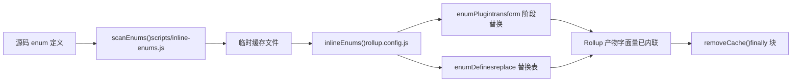
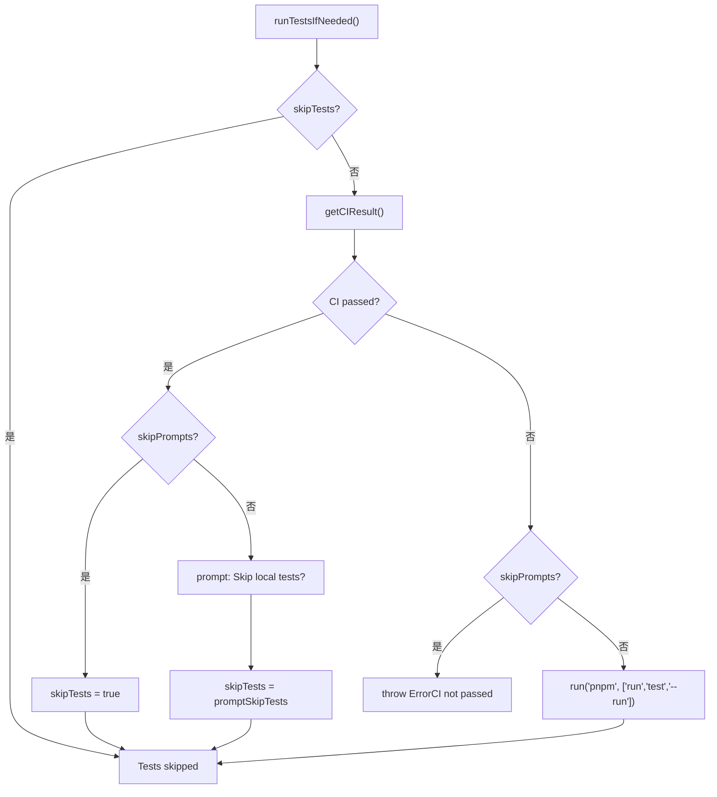

# Chapitre 13 : Compromis architecturaux et guide anti-pièges : les conditions limites de l'ingénierie monorepo

Dans le chapitre précédent, en prenant`packages-private/vite-debug`comme point d'entrée, nous avons maîtrisé le paradigme de débogage pour la reproduction minimale sur le code source réel. Lorsque ces packages de débogage internes se multiplient, un problème concret émerge : ils cohabitent dans le même workspace que les packages officiels publiés, comment garantir que le processus de publication ne les affecte pas par erreur ? Ce chapitre approfondira les conditions limites de l'ingénierie monorepo, en partant du contrat à double répertoire entre`packages`et`packages-private`, pour analyser la conception défensive derrière les compromis architecturaux et fournir un guide anti-pièges applicable.

# 13.2 Règle temporelle absolue : l'inlining des enums doit précéder l'exécution de Rollup

## Modèle intuitif

L'inlining des enums, c'est comme « remplacer les étiquettes sur les pièces par des numéros avant l'emballage ». Si l'ouvrier emballeur (Rollup) a déjà commencé à empaqueter, et que vous modifiez ensuite les étiquettes, les pièces dans la boîte et les étiquettes ne correspondront plus.`build.js`utilise`scanEnums()` / `removeCache()`cette paire de fonctions pour encadrer strictement l'inlining avant Rollup.

## Structures de données et cycle de vie

`inline-enums.js`exporte`scanEnums()`retourne une fermeture`removeCache`, qui scanne les définitions d'enum dans le code source et génère des fichiers temporaires destinés à la consommation par Rollup[FACT:scripts/build.js:30-34]。`build.js`de`run()`utilise`try/finally`pour garantir le nettoyage du cache[FACT:scripts/build.js:81-112]：

```js
const removeCache = scanEnums()
try {
  // ... buildAll / checkAllSizes / build-dts
} finally {
  removeCache()
}
```

`rollup.config.js`appelle au niveau supérieur du module`inlineEnums()`pour obtenir`[enumPlugin, enumDefines]` [FACT:rollup.config.js:47-50], où`enumPlugin`est inséré dans le tableau plugins[FACT:rollup.config.js:331-331]，`enumDefines`et intégré dans la table de remplacement du plugin replace[FACT:rollup.config.js:222-223]。

## Step-by-Step : le cycle de vie complet d'un enum lors d'un build

1. `build.js`de`run()`appelle d'abord`scanEnums()`, scanne les définitions d'enum de tous les packages et écrit dans le cache temporaire, retourne`removeCache` [FACT:scripts/build.js:87-87]。

2. `buildAll`et lance en parallèle plusieurs processus Rollup[FACT:scripts/build.js:119-121]。

3. Chaque processus Rollup exécute`inlineEnums()`lors de la phase de chargement de configuration, lit le cache généré à l'étape précédente, obtient`enumPlugin`et`enumDefines` [FACT:rollup.config.js:47-50]。

4. `enumPlugin`remplace les références d'enum dans le code source par des littéraux lors de la phase transform ;`enumDefines`complète replace en gérant le remplacement de constantes inter-modules[FACT:rollup.config.js:222-223]。

5. À la fin du build, le bloc`finally`appelle`removeCache()`pour nettoyer les fichiers temporaires[FACT:scripts/build.js:119-121]。



## Réflexions de conception et pièges

> **[Design Inference & Architectural Trade-offs]**
> Pourquoi ne pas utiliser un plugin Rollup pour scanner et utiliser à la volée lors de la phase transform ? Parce que l'inlining des enums nécessite**une vue globale inter-packages**：`runtime-core`. L'enum référencé peut être défini dans`shared`; un seul processus Rollup ne voit que l'arbre source de son propre package et ne peut pas effectuer le remplacement inter-packages.`scanEnums()`L'établissement d'un cache global avant le build vise précisément à résoudre ce problème de visibilité.

Pièges en production :`removeCache()`placé dans`finally`signifie qu'il sera nettoyé même en cas d'erreur en cours de build. Mais si vous interrompez manuellement le processus lors du débogage (Ctrl+C),`finally`peut ne pas s'exécuter, et les fichiers de cache résiduels feront que le prochain build lira des enums obsolètes. Méthode de diagnostic : vérifiez si des fichiers de cache d'enum résiduels existent dans le répertoire`temp/`, supprimez-les manuellement puis réessayez.

---

# 13.3 Orchestrateur de publication :`release.js`la matrice de flags skip de

## Modèle intuitif

`release.js`ressemble au directeur général d'un mariage ;`skipBuild` / `skipTests` / `skipGit` / `skipPrompts`les quatre interrupteurs sont les boutons « sauter la répétition », « sauter le serment », « sauter les photos », « sauter la confirmation ». Chaque bouton correspond à un scénario réel : l'environnement CI nécessite`skipPrompts`, le débogage local nécessite`skipGit`, le hotfix d'urgence nécessite`skipTests`。

## Structure de données et valeurs par défaut des flags

Les quatre flags skip sont déclarés dans`parseArgs`[FACT:scripts/release.js:39-50], puis déstructurés en variables locales[FACT:scripts/release.js:64-66]：

```js
let skipTests = args.skipTests
const skipBuild = args.skipBuild
const skipPrompts = args.skipPrompts
const skipGit = args.skipGit
```

Notez que`skipTests`utilise`let`déclaration, car elle est dans`runTestsIfNeeded()`dynamiquement réécrite[FACT:scripts/release.js:281-317]。

## Step-by-Step : le flux de décision complet d'une release

`main()`l'ordre d'exécution[FACT:scripts/release.js:143-279]：

1. **Vérification de synchronisation distante**：`isInSyncWithRemote()`Comparaison du HEAD local avec le SHA de la branche distante, affichage d'une boîte de confirmation en cas de divergence[FACT:scripts/release.js:337-363]。

2. **Sélection de version**: en l'absence d'argument positionnel, affichage du`versionIncrements`menu de sélection[FACT:scripts/release.js:152-176]。

3. **Décision de test**：`runTestsIfNeeded()`est l'endroit où la logique de skip est la plus dense[FACT:scripts/release.js:281-317]。

4. **Mise à jour de version**：`updateVersions()`parcourt tous les packages pour réécrire`package.json` [FACT:scripts/release.js:377-398]。

5. **Génération du Changelog**: appel de`pnpm run changelog` [FACT:scripts/release.js:211-212]。

6. **Commit Git**：`skipGit`si vrai, tout le bloc est ignoré[FACT:scripts/release.js:231-240]。

7. **Publication**: exécuté uniquement si`args.publish`est vrai`buildPackages()` + `publishPackages()` [FACT:scripts/release.js:243-246]。

`runTestsIfNeeded()`La logique de branche mérite d'être détaillée séparément :



## Réflexions de conception et pièges rencontrés

> **[Design Inference & Architectural Trade-offs]**
> `skipTests`utilise`let`plutôt que`const`La conception vise à supporter le chemin d'optimisation « si la CI est passée, ignorer automatiquement les tests locaux ». Cela économise beaucoup de temps dans les scénarios de publication CI — le`release.yml`de GitHub Actions a déjà exécuté la suite complète de tests, les relancer localement est un pur gaspillage.

**Le contrat caché de l'ordre de publication**：`sortPackagesForPublishing`place`vue`en dernier[FACT:scripts/release.js:85-85], avec un commentaire explicite indiquant que « l'utilisateur ne peut pas installer le nouveau package d'entrée avant que les packages internes soient disponibles ». Si vous modifiez cet ordre, l'utilisateur`npm install vue@next`pourrait récupérer une version dont les dépendances ne sont pas encore publiées, entraînant`ERR_MODULE_NOT_FOUND`。

**Protection d'idempotence**：`publishPackage`appelle`isPackagePublished`avant la publication pour vérifier le registry[FACT:scripts/release.js:453-458], capture l'erreur`previously published`en cas d'échec de publication et dégrade en ignorant[FACT:scripts/release.js:480-488]. Cela permet au script de release d'être relancé en toute sécurité — après une interruption réseau, une réexécution n'échouera pas globalement à cause de « le package existe déjà ».

**Rollback en cas d'échec**：`fnToRun().catch()`appelle`versionUpdated`lorsque`updateVersions(currentVersion)`est vrai pour restaurer le numéro de version[FACT:scripts/release.js:528-537]. Mais attention : cela ne restaure que`package.json`le champ de version dans**, ne restaure pas les commits déjà`git commit`**. Si vous publiez en échec alors que`skipGit`est faux, vous devez manuellement`git reset`。

---

# Réflexion de conception : le schéma commun des trois compromis

En revisitant les trois compromis centraux de ce chapitre, ils partagent la même philosophie de conception :**transformer « une vérification à l'exécution facile à oublier » en « une contrainte structurelle impossible à contourner »**。

- `packages-private`Isolation physique : ne pas dépendre de l'auteur du script qui se souvient de vérifier le champ`private`, mais faire en sorte que la portée du scan l'exclue naturellement.
- Inlining d'enum en amont : ne pas dépendre du plugin Rollup qui « tombe par hasard » sur un enum inter-packages lors du transform, mais établir un cache global avant le build.
- `release.js`La matrice de skip de`skipTests`。

> **[Design Inference & Architectural Trade-offs]**
> 〔Inférences de conception et compromis architecturaux〕**Le coût de ce schéma est**：`build.js`une complexité accrue du script`privatePackages`il faut maintenir la liste`rollup.config.js`,`release.js`doit dupliquer la logique de détection de répertoire,

---

# doit gérer les combinaisons croisées de quatre indicateurs de skip. Mais pour un dépôt comme Vue qui publie plusieurs fois par semaine, le gain de fiabilité apporté par les contraintes structurelles dépasse largement le coût en complexité.

Résumé du chapitre

1. **`packages-private`Ce chapitre, en partant du code source, décompose trois conditions limites clés du système d'ingénierie de Vue core :`packages`L'isolation physique entre**et`build.js`est garantie conjointement par le workspace glob,`release.js`la détection de répertoire,[FACT:pnpm-workspace.yaml:1-3][FACT:scripts/build.js:153-170][FACT:scripts/release.js:68-83]。

2. **et le filtrage**La contrainte temporelle de l'inlining d'enum`scanEnums()` / `removeCache()`est garantie de manière forcée par la structure`try/finally`de[FACT:scripts/build.js:81-112][FACT:rollup.config.js:47-50]。

3. **`release.js`, la configuration Rollup consommant le cache au niveau supérieur du module**La matrice d'indicateurs de skip de`skipTests`sert trois scénarios : publication CI, débogage local, correctif urgent,[FACT:scripts/release.js:281-317][FACT:scripts/release.js:85-85]。

# la réécriture dynamique et le tri de l'ordre de publication sont les deux contrats cachés les plus facilement négligés

Réflexions et auto-évaluation de ce chapitre`build.js`Q1 : Si l'on supprime la vérification`build(target)`dans la fonction`privatePackages.includes(target)`de`packages`, et qu'on utilise uniformément`pkgBase`comme

**, dans quels scénarios cela poserait-il problème ?**：`build.js:160-164`Analyse de référence`nr build vite-debug`La détection de répertoire de`packages/vite-debug`est le seul point d'entrée permettant aux packages privés d'être construits. Après suppression,`package.json`cherchera`fs.readFileSync`sous`ENOENT`, or ce répertoire n'existe pas,`packages/`lance directement`buildOptions`. Le problème plus insidieux : si à l'avenir quelqu'un crée un répertoire du même nom sous`rollup.config.js:37-42`, le build utilisera silencieusement la configuration du mauvais répertoire, et les chemins de sortie ainsi que`build.js`seront tous décalés. De plus,

Q2: `release.js`possède une logique de détection de répertoire indépendante, les deux endroits doivent être modifiés en synchronisation, sinon on obtient un état incohérent où «`runTestsIfNeeded()`a trouvé le package mais Rollup ne le trouve pas ».`skipTests ||= isCIPassed`Dans le`release.js:285`de`skipPrompts`, la ligne de code (`else if (skipPrompts)`) lorsque`throw`est vrai et que la CI n'est pas passée, quelle branche sera empruntée ? Si l'on supprime le

**de la branche**, quelles seraient les conséquences ?`skipPrompts`Analyse de référence`skipTests ||= isCIPassed`: lorsque`isCIPassed`est vrai et que la CI n'est pas passée,`false`，`skipTests`dans`false`reste à`else if (skipPrompts)`sa valeur originale (généralement`Error`（`release.js:299-304`). Ensuite, on entre dans la branche`throw`, qui lance`if (!skipTests)`). Si l'on supprime ce`pnpm run test --run`, le code continuera jusqu'à la branche

Q3: `rollup.config.js:55`, exécutant`inlineEnums()`dans un environnement non interactif. En CI, cela peut provoquer l'échec des tests à cause de différences d'environnement, ou pire — les tests passent mais la CI n'est en réalité pas passée (par exemple, la CI exécute un sous-ensemble de tests différent), publiant une version non entièrement validée.`build.js:87`Le`scanEnums()`de`run()`est appelé au niveau supérieur du module, tandis que le`inlineEnums()`de`buildStart`est appelé à l'intérieur de la fonction

**. Si l'on échange le moment d'exécution de ces deux (c'est-à-dire faire appeler**：`scanEnums()`dans le hook**de Rollup), que casserait-on ?**Analyse de référence`inlineEnums()`doit être terminé avant le démarrage de tous les processus Rollup, car il doit scanner`rollup.config.js`tous les packages`buildStart`pour établir le cache global d'enum.`buildAll`est appelé au niveau supérieur du module`build.js:119-121`, à ce moment Rollup n'a pas encore commencé de build, le cache est déjà prêt. Si on le déplaçait dans`scanEnums()`, chaque processus Rollup scannerait indépendamment — mais`removeCache`s'exécute en concurrence (

Le contrat à double répertoire, la détermination de l'appartenance des scripts de build, le filtrage secondaire des scripts de publication — ces mécanismes délimitent ensemble les frontières de sécurité de l'ingénierie monorepo. Mais les frontières ne sont pas immuables : à mesure que les outils de build migrent de Rollup vers Rolldown et que les tests de types et les tests d'exécution convergent, les stratégies de compromis actuelles seront confrontées à de nouveaux défis. Dans le prochain chapitre, nous examinerons les orientations d'évolution de la prochaine génération de systèmes d'ingénierie, en nous appuyant sur la trajectoire des changements de 3.0 à 3.4.
