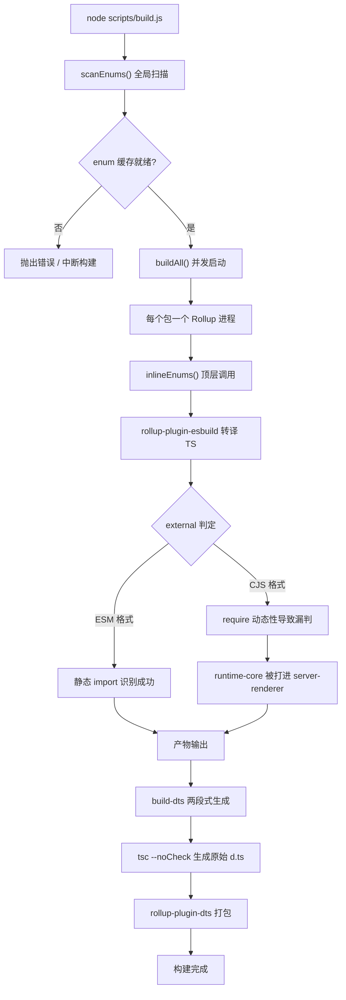
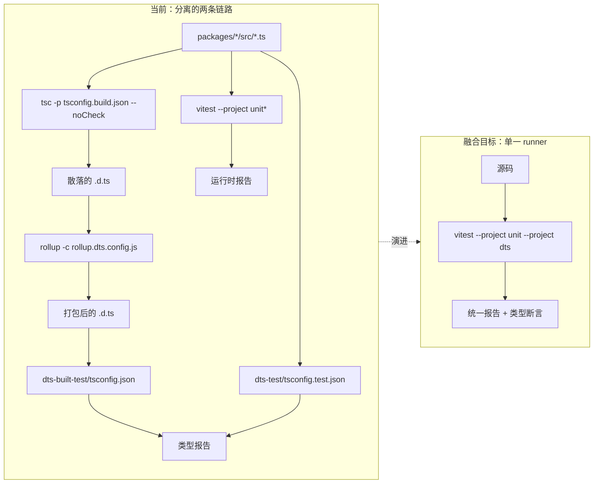
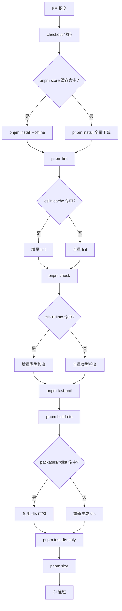

# Chapitre 14 : Évolution future : de la 3.x à la prochaine génération de systèmes d'ingénierie

Dans le chapitre précédent, nous avons examiné les « frontières de sécurité » du système d'ingénierie de Vue core — le contrat à double répertoire, la détermination de l'appartenance des scripts de build, le filtrage secondaire des scripts de publication. Ces mécanismes n'ont pas été conçus en une seule fois, mais ont été affinés de manière itérative entre 3.0 et 3.4. Ce chapitre adopte un angle différent : il ne s'agit plus de regarder « à quoi cela ressemble maintenant », mais « comment cela en est arrivé là », et d'en déduire où ira la prochaine génération de systèmes d'ingénierie. Les sources de ce chapitre sont changelogs/CHANGELOG-3.3.md, changelogs/CHANGELOG-3.4.md et le package.json à la racine du dépôt. Les journaux de modification ressemblent à un simple relevé de « quels bugs ont été corrigés », mais ils constituent le rapport de santé le plus authentique du système d'ingénierie : chaque commit avec le préfixe build:, chaque modification avec le préfixe types:, chaque régression de version de dépendance expose les points de tension de l'architecture actuelle. Notre tâche est de lire la direction de l'évolution à partir de ces points de tension. Considérer les journaux de modification comme une « fenêtre d'observation du système d'ingénierie » plutôt qu'une « liste de fonctionnalités » est la méthodologie centrale de ce chapitre. Les changements fonctionnels nous disent ce que Vue peut faire, tandis que les changements liés au build, aux types et à la CI nous disent « où le système d'ingénierie de Vue a mal ».

# I. Les points de tension de la chaîne d'outils de build : le potentiel de migration de Rollup vers Rolldown

## Modèle intuitif

Imaginez la chaîne d'outils de build comme une ligne d'assemblage : Rollup est le poste d'assemblage principal, esbuild se charge du découpage rapide (transpilation TS), terser se charge de l'empaquetage et de la compression finaux. À mesure que le produit (le runtime Vue) devient plus complexe et que les opérations sur le poste d'assemblage se multiplient, le poste d'assemblage principal devient lui-même un goulot d'étranglement. Le positionnement de Rolldown est celui d'un poste d'assemblage principal réécrit en Rust — il ne remplace pas esbuild, mais Rollup lui-même.

Sans cette pression d'évolution, la « catastrophe » à laquelle le système serait confronté n'est pas un crash, mais**une inflation linéaire du temps de build en fonction du nombre de packages**: chaque sous-package ajouté nécessite de lancer un processus Rollup supplémentaire, de rescanner le cache enum, et d'exécuter un cycle supplémentaire de génération dts.

## Structures de données et disposition des dépendances

Examinons d'abord un instantané statique de la chaîne d'outils actuelle.`package.json`Le`devDependencies`de

[FACT:package.json:103-106]

```
    "rollup": "^4.63.3",
    "rollup-plugin-dts": "^6.5.1",
    "rollup-plugin-esbuild": "^6.2.1",
    "rollup-plugin-polyfill-node": "^0.13.0",
```

Copier`^4.63.3`On peut en lire trois faits clés. Premièrement, la version majeure de Rollup est`rollup-plugin-esbuild`, en phase de maturité de Rollup 4.x. Deuxièmement,`rollup-plugin-dts`prend en charge la transpilation TS, ce qui signifie que Rollup lui-même ne parse pas le TS et ne traite que le JS produit par esbuild. Troisièmement,`.d.ts`est responsable de manière indépendante de l'empaquetage`dts-built-test`, ce qui constitue précisément la base matérielle de l'indépendance

discutée dans le chapitre précédent.

[FACT:package.json:8-9]

```
    "build": "node scripts/build.js",
    "build-dts": "tsc -p tsconfig.build.json --noCheck && rollup -c rollup.dts.config.js",
```

`build-dts`Copier`tsc --noCheck`est « en deux étapes » : d'abord`--noCheck`génère les fichiers de déclaration bruts (`rollup -c rollup.dts.config.js`ignore la vérification de types et se contente d'émettre), puis`.d.ts`empaquette les`rollup-plugin-dts`dispersés en un fichier unique. Cette conception dépend elle-même des capacités de Rollup —

## nécessite le graphe de modules de Rollup pour tracer les dépendances de types.`build:`Piloté par scénario : ce qu'un commit

a exposé`build:`Les entrées avec le préfixe

dans les journaux de modification sont des preuves directes des points de tension de la chaîne d'outils de build. Prenons-en trois.

[FACT:changelogs/CHANGELOG-3.4.md:84]

```
* **build:** use consistent minify options from previous terser config ([789675f](https://github.com/vuejs/core/commit/789675f65d2b72cf979ba6a29bd323f716154a4b))
```

Copier`devDependencies`La motivation de ce commit est « après la migration de terser vers esbuild minify, les options de compression sont incohérentes ». Cela révèle un état intermédiaire en cours de migration : Vue utilisait terser pour la compression, puis est passé à esbuild (`esbuild: ^0.28.2`dans

le confirme), mais les options de compression n'ont pas été entièrement alignées, entraînant des écarts de taille ou de comportement des artefacts. C'est précisément le coût typique du « remplacement de pièces du poste d'assemblage ».

[FACT:changelogs/CHANGELOG-3.4.md:6]

```
* **build:** revert entities to 4.5 to avoid runtime resolution errors ([f349af7](https://github.com/vuejs/core/commit/f349af7b65b9f8605d8b7bafcc06c25ab1f2daf0)), closes [#11603](https://github.com/vuejs/core/issues/11603)
```

`entities`Copier`compiler-dom`est une bibliothèque de décodage d'entités HTML, dépendance de**. La régression vers 4.5 est due à des problèmes de résolution à l'exécution dans la nouvelle version. Ce commit montre que :**。

la mise à niveau des dépendances de la chaîne d'outils de build n'est pas isolée ; le saut de version d'une dépendance indirecte peut se répercuter sur le comportement à l'exécution

[FACT:changelogs/CHANGELOG-3.4.md:155]

```
* **build:** fix accidental inclusion of runtime-core in server-renderer cjs build ([11cc12b](https://github.com/vuejs/core/commit/11cc12b915edfe0e4d3175e57464f73bc2c1cb04)), closes [#11137](https://github.com/vuejs/core/issues/11137)
```

Copier`server-renderer`C'est le type de bug de build le plus typique : en format CJS,`runtime-core`a accidentellement intégré`external`dans son propre artefact. La cause est généralement la défaillance de la détermination`import`de Rollup en format CJS — l'ESM peut identifier statiquement les dépendances externes grâce aux instructions`require`La dynamique est plus forte, ce qui rend les omissions de détection plus faciles. Ce commit pointe directement vers la fragilité de la logique`external`dans la configuration de Rollup.

## Représentation Mermaid du potentiel de migration

Le diagramme ci-dessous décrit le flux de contrôle du pipeline de build actuel et met en évidence les nœuds qui seront touchés par la migration vers Rolldown :



> **[Design Inference & Architectural Trade-offs]**
> La valeur de la migration vers Rolldown réside dans le fait qu'elle remplace le modèle de concurrence « un processus par paquet » par un modèle de « parallélisme au sein d'un seul processus »,`scanEnums()`l'analyse globale de`inlineEnums()`et le remplacement de`rollup-plugin-esbuild`、`rollup-plugin-dts`peuvent être coordonnés au sein du même runtime Rust, et le problème de « race condition lors de l'analyse concurrente » discuté au chapitre précédent disparaîtra à la racine. Mais la résistance à la migration se situe précisément ici —`external`ces écosystèmes de plugins nécessitent que Rolldown fournisse une couche de compatibilité, et la logique de décision de

## doit être réécrite.

**Réflexions de conception et pièges rencontrés**Pourquoi la migration ne se fera-t-elle pas en une seule étape ?`package.json`Regardez le champ`engines`de

[FACT:package.json:61-63]

```
  "engines": {
    "node": ">=20.0.0"
  },
```

Node 20 est la limite inférieure stricte. Rolldown, en tant que module natif Rust, nécessite les bindings N-API correspondants et une distribution de binaires précompilés. Une fois introduit,`pnpm install`le temps d'exécution de, la compatibilité binaire multiplateforme (Windows/macOS/Linux) et la stratégie de cache CI doivent tous être repensés. Il ne s'agit pas simplement de « changer une dépendance », mais d'un**recalibrage complet de toute la chaîne installation-build-cache**。

**Pièges en production**：`build-dts`Le`tsc --noCheck`de est une arme à double tranchant. Sauter la vérification de types accélère l'emit, mais cela signifie que`.d.ts`l'étape de génération ne détectera pas les erreurs de type — celles-ci ne pourront être rattrapées que par`pnpm check`（`tsc --incremental --noEmit`) et`test-dts`. Si après la migration vers Rolldown on souhaite fusionner ces deux étapes, il faut s'assurer que la vérification de types ne ralentit pas le build, sinon cela va à l'encontre de l'objectif initial de`--noCheck`.

---

# II. La tendance à la fusion des tests de types et des tests d'exécution

## Modèle intuitif

Imaginez les tests de types et les tests d'exécution comme deux points de contrôle qualité indépendants : l'un vérifie si « le manuel (`.d.ts`) est correctement rédigé », l'autre vérifie si « la machine (le runtime) tourne correctement ». Les deux points de contrôle ont chacun leur propre poste de travail, leurs propres outils, leurs propres rapports. La tendance à la fusion signifie :**peut-on faire en sorte qu'un même cas de test valide simultanément le manuel et la machine ?**

Sans fusion, le désastre auquel le système est confronté est**la dérive entre les types et le comportement à l'exécution**：`.d.ts`: le type dit que`ref()`renvoie`Ref<T>`, mais la forme de l'objet réellement renvoyé à l'exécution a changé ; le test de types passe, le test d'exécution passe aussi, mais leur combinaison est erronée.

## Structure de données : disposition d'orchestration des scripts de test

`package.json`Dans le`scripts`de, les entrées liées aux tests se répartissent clairement en deux groupes :

[FACT:package.json:19-24]

```
    "test": "vitest",
    "test-unit": "vitest --project unit*",
    "test-e2e": "node scripts/build.js vue -f global -d && vitest --project e2e --project e2e-browser",
    "test-dts": "run-s build-dts test-dts-only",
    "test-dts-only": "tsc -p packages-private/dts-built-test/tsconfig.json && tsc -p ./packages-private/dts-test/tsconfig.test.json",
    "test-coverage": "vitest run --project unit* --coverage",
```

La structure clé ici est le`test-dts`de`run-s build-dts test-dts-only`— il est**séquentiel**: d'abord construire`.d.ts`, puis exécuter les tests de types. Et à l'intérieur de`test-dts-only`, il y a à nouveau**deux processus`tsc`indépendants**: un qui exécute`dts-built-test`(vérifie les artefacts de build), un qui exécute`dts-test`(vérifie les types du code source).

Notez que`test-unit`utilise`vitest --project unit*`，`test-e2e`utilise`vitest --project e2e --project e2e-browser`. Cela montre que le mécanisme`--project`de Vitest a déjà réparti les tests en différents projets selon « unitaire/e2e/navigateur ».**La base physique de la fusion existe déjà**: le mécanisme de projet de Vitest permet d'exécuter différents types de tests dans le même runner.

## Piloté par scénario : le chemin complet d'un commit`types:`Dans le changelog, la densité des entrées préfixées par

est extrêmement élevée, ce qui reflète directement la complexité du système de types. Nous traçons un correctif de type typique.`types:`Retour en arrière du type ref dans la 3.4.37 :

Copier

[FACT:changelogs/CHANGELOG-3.4.md:23-24]

```
* Revert "fix(types/ref): allow getter and setter types to be unrelated ([#11442](https://github.com/vuejs/core/issues/11442))" ([b1abac0](https://github.com/vuejs/core/commit/b1abac06cdb198bd72f8e614b1f68b92e1c78339))
* Revert "fix(types/ref): correct type inference for nested refs ([#11536](https://github.com/vuejs/core/issues/11536))" ([3a56315](https://github.com/vuejs/core/commit/3a56315f94bc0e11cfbb288b65482ea8fc3a39b4))
```

Copier

[FACT:changelogs/CHANGELOG-3.4.md:55]

```
* **types/ref:** allow getter and setter types to be unrelated ([#11442](https://github.com/vuejs/core/issues/11442)) ([e0b2975](https://github.com/vuejs/core/commit/e0b2975ef65ae6a0be0aa0a0df43fb887c665251))
```

[FACT:changelogs/CHANGELOG-3.4.md:30]

```
* **types/ref:** correct type inference for nested refs ([#11536](https://github.com/vuejs/core/issues/11536)) ([536f623](https://github.com/vuejs/core/commit/536f62332c455ba82ef2979ba634b831f91928ba)), closes [#11532](https://github.com/vuejs/core/issues/11532) [#11537](https://github.com/vuejs/core/issues/11537)
```

les tests de types peuvent vérifier que « la signature de type correspond aux attentes », mais ils ne peuvent pas vérifier « si cette signature de type est agréable à utiliser dans du code réel »**. Dans les tests de types,**。`allow getter and setter types to be unrelated`peut parfaitement passer, mais à l'usage réel, cela rendra l'inférence de types de`ref`trop permissive, brisant la sécurité de types du code en aval.

## Représentation Mermaid de la fusion des tests de types

Le diagramme ci-dessous décrit la structure actuelle de séparation entre tests de types et tests d'exécution, ainsi que la forme cible après fusion :



> **[Design Inference & Architectural Trade-offs]**
> Le chemin technique de la fusion est très probablement : encapsuler les appels`dts-built-test`et`dts-test`de`tsc`en un projet personnalisé Vitest, et faire en sorte que les assertions de types soient intégrées sous forme de`expectTypeOf`dans les fichiers de test. Ainsi, un seul appel`vitest`permettrait d'exécuter simultanément les assertions d'exécution et les assertions de types, avec un rapport unifié. Mais la résistance réside dans le fait que :`tsc`la vérification de types de est « globale », tandis que les tests de Vitest sont « par fichier », et les deux stratégies incrémentales sont incompatibles.

## Réflexions de conception et pièges rencontrés

**Pourquoi`dts-built-test`doit-il être indépendant de`dts-test`？**? Cela a déjà été discuté au chapitre précédent, complétons ici du point de vue de l'évolution :`dts-built-test`vérifie**les artefacts de build**（`rollup-plugin-dts`le`.d.ts`），`dts-test`après bundling ; vérifie**les types du code source**. Si l'on fusionne les deux, on perd le point de contrôle clé « les artefacts de build sont-ils cohérents avec les types du code source ». Le commit de la 3.4.38 confirme précisément l'importance des types des artefacts de build :

[FACT:changelogs/CHANGELOG-3.4.md:9]

```
* **types:** add fallback stub for DOM types when DOM lib is absent ([#11598](https://github.com/vuejs/core/issues/11598)) ([4db0085](https://github.com/vuejs/core/commit/4db0085de316e1b773f474597915f9071d6ae6c6))
```

« Fournir un stub de fallback lorsque la lib DOM est absente » — c'est un correctif de compatibilité de types au niveau des artefacts de build, qui ne peut être découvert que dans le scénario`dts-built-test`de « consommation du`.d.ts`après bundling ».

**Pièges en production**: le cycle « fusion-retour en arrière » des tests de types montre que les modifications de signatures de types nécessitent une validation par**de vrais projets en aval**, et pas seulement par des assertions de types. Les tests de types de Vue s'exécutent dans`packages-private/dts-test`, on utilise des cas de test internes au dépôt, ce qui ne couvre pas tous les usages en aval. Si la tendance à la fusion se limite à « fusionner deux runners » sans résoudre « comment introduire un retour réel des usages en aval », il ne s'agit que d'une fusion formelle.

---

# III. Axes d'optimisation fine du cache CI

## Modèle intuitif

Imaginez le cache CI comme la « zone de préparation » d'un entrepôt : chaque build doit y puiser des matières premières (dépendances, artefacts de build, cache de types). Si la zone de préparation n'est qu'une grande caisse, il faut fouiller toute la caisse pour prendre le moindre élément, et même avec un taux de succès de cache élevé, cela ne peut pas être rapide. L'optimisation fine signifie :**diviser la grande caisse en petites cases classées par usage**。

Sans cache fin, le désastre auquel le système fait face est**l'amplification en cascade de l'invalidation du cache**: modifier une ligne de code source invalide tout le cache`node_modules`, la CI réinstalle toutes les dépendances, et le temps de build passe de 2 minutes à 10 minutes.

## Structure de données : classification des éléments cachables

À partir de`package.json`, on peut identifier plusieurs catégories de « matériaux » cachables :

Première catégorie, les produits d'installation des dépendances.`packageManager`Le champ

[FACT:package.json:4]

```
  "packageManager": "pnpm@12.4.2",
```

Le`node_modules`de pnpm est une structure de liens symboliques ; ce qui est mis en cache est le content-addressable store de pnpm, et non un`node_modules`plat. Cela signifie que la clé de cache doit être basée sur le hachage de`pnpm-lock.yaml`, et non sur`package.json`。

Deuxième catégorie, les artefacts de build.`clean`Le script

[FACT:package.json:10]

```
    "clean": "rimraf --glob packages/*/dist temp .eslintcache",
```

`packages/*/dist`、`temp`、`.eslintcache`— ces trois types d'artefacts peuvent être mis en cache indépendamment.`dist`est la sortie de build,`temp`est un fichier temporaire (comme`bench.json`），`.eslintcache`est le cache de lint.

Troisième catégorie, le cache de vérification de types.`check`Le script`--incremental`：

[FACT:package.json:15]

```
    "check": "tsc --incremental --noEmit",
```

`--incremental`génère le fichier`.tsbuildinfo`, qui est le cache incrémental de la vérification de types. Si ce fichier est mis en cache dans la CI,`tsc`la seconde exécution de

## sera bien plus rapide.

Scénario guidé : flux d'exécution CI d'une PR`packages/reactivity/src/ref.ts`Plaçons-nous dans un scénario typique : un développeur modifie

, soumet une PR. Quelles étapes la CI doit-elle exécuter, et lesquelles peuvent bénéficier du cache ?`scripts`À partir de`simple-git-hooks`, on peut déduire la séquence d'exécution de la CI (`pre-commit`le

[FACT:package.json:48-51]

```
  "simple-git-hooks": {
    "pre-commit": "pnpm lint-staged && pnpm check",
    "commit-msg": "node scripts/verify-commit.js"
  },
```

Le`pre-commit`local exécute`lint-staged`et`check`. En CI, on exécutera`lint`、`check`、`test-unit`、`test-dts`、`size`etc. La stratégie de cache diffère à chaque étape :

- `lint`: mettre en cache`.eslintcache`, clé basée sur le hachage des fichiers source.
- `check`: mettre en cache`.tsbuildinfo`, clé basée sur`tsconfig`et le hachage du code source.
- `test-unit`: Vitest a son propre cache, mais en général la CI ne met pas en cache les résultats de test, seulement les dépendances.
- `test-dts`: dépend des artefacts de`build-dts`, clé de cache basée sur le hachage de`packages/*/dist`.
- `size`: dépend des artefacts de build, clé de cache identique à ci-dessus.

## Représentation Mermaid de l'optimisation du cache CI



> **[Design Inference & Architectural Trade-offs]**
> La contradiction centrale du cache fin est**la granularité de la clé de cache**: une clé trop grossière (par exemple basée uniquement sur le commit hash) donne un faible taux de succès ; une clé trop fine (par exemple basée sur le hachage de chaque fichier) fait que le coût de calcul de la clé annule le gain du cache. La stratégie raisonnable pour un monorepo comme Vue est le « sharding par package » : chaque`packages/*`sous-package dispose d'un cache indépendant`dist`，`reactivity`; une modification de`compiler-core`n'invalide pas le cache`dist`de

## Réflexions de conception et pièges

**Pourquoi le script`size`est-il divisé en plusieurs sous-commandes ?**Regardez ces trois lignes :

[FACT:package.json:11-14]

```
    "size": "run-s \"size-*\" && node scripts/usage-size.js",
    "size-global": "node scripts/build.js vue runtime-dom -f global -p --size",
    "size-esm-runtime": "node scripts/build.js vue -f esm-bundler-runtime",
    "size-esm": "node scripts/build.js runtime-dom runtime-core reactivity shared -f esm-bundler",
```

`size`utilise`run-s "size-*"`pour exécuter en série toutes les sous-commandes préfixées par`size-`. Ce modèle d'« agrégation par préfixe » permet à chaque dimension de taille (global, esm-runtime, esm) d'être mise en cache et d'échouer indépendamment. Si l'on fusionnait en une seule grande commande, tout dépassement de seuil dans une dimension ferait échouer l'ensemble de`size`, sans pouvoir localiser la dimension problématique.

**Pièges en production**: le piège le plus courant du cache CI est**la pollution du cache**— mettre en cache de mauvais artefacts, ce qui fait que les builds suivants reposent sur des données corrompues.`clean`Le script

[FACT:package.json:10]

```
    "clean": "rimraf --glob packages/*/dist temp .eslintcache",
```

Notez qu'il nettoie`packages/*/dist`, et non`packages-private/*/dist`. Cela signifie que les artefacts de`packages-private`ne font pas partie du nettoyage habituel — si la CI met en cache les artefacts de`packages-private`et que`clean`ne les nettoie pas, on peut se retrouver avec « un ancien artefact de playground mis en cache ». Lors de la conception d'un cache fin, il faut traiter`packages-private`séparément.

---

# Réflexion de conception : le système d'ingénierie comme cycle de vie du produit

En reliant les fils des trois sections, on voit une ligne directrice claire :**Le système d'ingénierie de Vue passe de « fonctionnel » à « agréable à utiliser », de « l'orchestration manuelle » à « la configuration déclarative »**。

La migration de la chaîne d'outils de build (Rollup → Rolldown) est une évolution « pilotée par la performance » : lorsque le nombre de packages croît au-delà d'un certain seuil, le coût de la concurrence au niveau processus dépasse le gain, et il faut passer à un modèle de concurrence plus léger.

La fusion des tests de types est une évolution « pilotée par la cohérence » : lorsque la fréquence de modification des signatures de types dépasse celle du comportement à l'exécution, deux suites de tests séparées deviennent un fardeau, et il faut les faire partager les mêmes cas de test.

La finesse du cache CI est une évolution « pilotée par le coût » : lorsque les minutes de CI deviennent un goulot d'étranglement, le gaspillage d'un cache grossier devient inacceptable, et il faut sharder par usage.

> **[Design Inference & Architectural Trade-offs]**
> La contrainte commune à ces trois lignes d'évolution est**la rétrocompatibilité**. La stratégie de publication de Vue (visible dans la section`BREAKING CHANGES`du changelog) autorise des « type-only breaking changes » en version mineure, mais pas de breaking change à l'exécution. Cela signifie que l'évolution du système d'ingénierie doit garantir : quelle que soit la rotation interne de la chaîne d'outils, l'API publique et le comportement à l'exécution des artefacts ne doivent pas changer. C'est la frontière dure de toutes les décisions d'évolution.

---

# Résumé du chapitre

Ce chapitre, à partir du changelog et de`package.json`, a passé en revue les trois lignes d'évolution du système d'ingénierie de Vue core :

1. **Chaîne d'outils de build**: La combinaison actuelle de Rollup 4.x + esbuild + rollup-plugin-dts, dont les points de tension se manifestent dans`build:`les commits préfixés par (alignement de la configuration minify, rétrogradation de version des entities, omission de détection des externals CJS). Le potentiel de migration vers Rolldown vient du remplacement de la « concurrence multi-processus » par le « parallélisme mono-processus », la résistance vient de l'écosystème de plugins et de la distribution de binaires multiplateformes.

2. **Fusion des tests de types**：`test-dts`de`run-s build-dts test-dts-only`la structure sérielle, ainsi que`dts-built-test`et`dts-test`le double`tsc`processus, constituent les preuves physiques de la forme séparée actuelle. Le chemin technique de fusion passe par le mécanisme`--project`de Vitest, la résistance étant que`tsc`la vérification complète est incompatible avec la stratégie incrémentale de test par fichier de Vitest.

3. **Granularisation du cache CI**：`packageManager`verrouillage de pnpm,`clean`nettoyage de trois catégories d'artefacts,`check`utilisation de`--incremental`、`size`utilisation de l'agrégation par préfixe — ce sont autant de critères de classification des éléments cachables. La contradiction centrale réside dans la granularité des clés de cache, la stratégie raisonnable étant le « sharding par paquet ».

Le changement de perception le plus important est le suivant :**le système d'ingénierie lui-même est un produit, il a ses propres utilisateurs (contributeurs), ses propres indicateurs de performance (temps de build, minutes CI), ses propres contraintes de compatibilité (API des artefacts inchangée)**. Il nécessite une itération continue, et non une conception ponctuelle.

# Réflexions et auto-évaluation de ce chapitre

Q1: `package.json:9`de`build-dts`utilise`tsc -p tsconfig.build.json --noCheck`. Si l'on supprime`--noCheck`, quelles réactions en chaîne cela entraînera-t-il après la migration vers Rolldown ?

**Analyse de référence**：`--noCheck`Le rôle de`tsc`est de sauter la vérification de types et de ne faire que l'emit. Si on le supprime,`.d.ts`effectuera une vérification complète des types avant de générer`build-dts`. Dans l'architecture Rollup actuelle, cela ne fait que ralentir`build-dts`; mais après la migration vers Rolldown, le problème s'amplifiera : le principal argument de vente de Rolldown est la « construction parallèle mono-processus », si l'étape`tsc`introduit une vérification complète`tsc`, elle devient le goulot d'étranglement sériel de toute la chaîne — toutes les constructions de paquets doivent attendre la fin de cette vérification. Plus grave encore, la vérification de types de`--noCheck`est mono-thread et ne peut pas exploiter la capacité parallèle de Rolldown. La bonne approche est de conserver`pnpm check`（`package.json:15`, et de confier la vérification de types à des`test-dts`（`package.json:22`indépendants, découplant ainsi construction et vérification.

Q2 : Le changelog 3.4.37 a rétrogradé consécutivement deux corrections`types/ref`(`CHANGELOG-3.4.md:23-24`), alors que ces deux corrections venaient d'être fusionnées dans 3.4.35 (`CHANGELOG-3.4.md:30,55`). Si les tests de types et les tests d'exécution étaient déjà fusionnés, ce cycle « fusion-rétrogradation » pourrait-il être évité ? Pourquoi ?

**Analyse de référence**: Impossible à éviter complètement, mais le cycle peut être raccourci. Les tests de types fusionnés ne peuvent toujours vérifier que « la signature de type correspond à l'assertion », alors que le problème de corrections comme`allow getter and setter types to be unrelated`réside dans le fait que « la signature de type est trop permissive, brisant la sécurité de types du code en aval » — c'est un problème**d'usage en aval**, et non un problème**de la signature elle-même**. Là où la fusion peut raccourcir le cycle, c'est que : si les assertions de types et les assertions d'exécution sont écrites dans le même fichier de test, le développeur peut plus rapidement détecter l'incohérence « la signature de type a changé mais le comportement d'exécution n'a pas changé ». Mais pour vraiment éviter les rétrogradations, il faut introduire la vérification de types de vrais projets en aval (par exemple étendre`packages-private/dts-test`en un ensemble de tests « simulant l'usage en aval »), ce qui dépasse le cadre du simple « runner fusionné ».

Q3: `package.json:10`Le script`clean`de`packages/*/dist`nettoie`packages-private/*/dist`, mais ne nettoie pas

**. Si la CI adopte une stratégie de cache fine « sharding par paquet », quelle trappe de production cette asymétrie entraînera-t-elle ?**Analyse de référence`packages-private`: La trappe réside dans le « cache d'anciens artefacts de`packages-private`». Les`sfc-playground`、`template-explorer`contiennent des outils de débogage comme`packages-private/sfc-playground/dist`, et si leurs artefacts de construction (tels que`clean`) sont mis en cache par la CI, alors que`build-sfc-playground`（`package.json:39`ne les nettoie pas, il se produira : le code source est mis à jour, mais la CI réutilise d'anciens artefacts de playground, faussant les résultats de vérification de`dev-sfc-prepare`（`package.json:34`. Plus insidieux encore,`packages-private`vérifie si les artefacts de`packages-private`existent ; si d'anciens artefacts sont mis en cache, il sautera la reconstruction, laissant le développeur croire que l'environnement est neuf. Lors de la conception d'un cache fin, il faut soit définir une clé de cache distincte pour

, soit simplement ne pas cacher ses artefacts — car c'est un outil de débogage, dont le coût de reconstruction est faible et le gain de cache minime.
