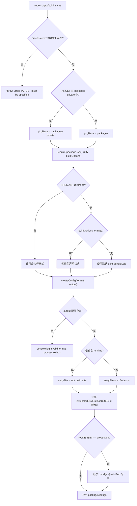

# 第 1 章：マクロ認知：core リポジトリのエンジニアリング設計哲学

リアクティブや仮想 DOM の実装を一行でも追跡し始める前に、まずこれらのコードが依存するエンジニアリングの母体を理解する必要がある。Vue core リポジトリを開くと、最初に目に入るのはフレームワークのコアロジックではなく、`package.json`と`pnpm-workspace.yaml`といったエンジニアリング設定ファイルである——これらはランタイム機能を一切含まないが、フレームワーク全体が正しくビルド・テスト・リリースできるかを決定する。本章が答えるのはまさにこの前置問題である：core リポジトリとは何か。それは`@vue/runtime-core`という npm パッケージではなく、`runtime-core`、`reactivity`、`compiler-sfc`など十余りの公開リリースパッケージ、さらに`sfc-playground`、`template-explorer`などのプライベート実験パッケージを担うエンジニアリングの母体である。この母体の組織方法を理解することが、以降の全章（ビルド、型、リリース、サイズ予算）の前提となる。本章は三つの主線に沿って展開する：workspace の二重ディレクトリ構造、ルートレベルの TypeScript と Rollup の統一制約、そして「ソースリポジトリ」と「リリース産物」の分離哲学である。

# 一、二重ディレクトリ構造：packages と packages-private の物理的隔離

## 直感モデル

core リポジトリを一棟の研究開発ビルに例えよう。`packages/`は正式な製品ラインであり、生産されたものは商標を貼って市場に売り出す；`packages-private/`は内部試験室であり、中のサンプルはデバッグとデモにのみ使用され、決して外部に出荷されない。両者は同じ水道・電気（依存関係、ビルドツール）を共有するが、入退室管理システム（リリースフロー）はそれらを区別して扱う。

この物理的隔離がなければ、内部デバッグ用の playground パッケージが誤って npm に公開されることは容易に起こりうる——これは仮定ではなく、monorepo の古典的事故である。

## データ構造とメモリレイアウト

workspace の境界は`pnpm-workspace.yaml`によって定義される。有効な宣言はわずか三行である：

[FACT:pnpm-workspace.yaml:1-3]

```yaml
packages:
  - 'packages/*'
  - 'packages-private/*'
```

この二つの glob が pnpm に伝えるのは：`packages/`と`packages-private/`配下の各サブディレクトリが独立したパッケージであるということ。pnpm はそれらのためにシンボリックリンクを確立し、`@vue/runtime-core`が`@vue/reactivity`を参照する際に registry からダウンロードするのではなく、直接ローカルソースディレクトリを指すようにする。

続く`catalog:`セクションは pnpm の**依存バージョンカタログ**メカニズムである：

[FACT:pnpm-workspace.yaml:5-13]

```yaml
catalog:
  '@babel/parser': ^7.29.8
  '@babel/types': ^7.29.8
  'entities': '^7.0.1'
  'estree-walker': ^2.0.2
  'magic-string': ^0.30.21
  'source-map-js': ^1.2.1
  'vite': ^8.3.0
  '@vitejs/plugin-vue': ^6.0.9
```

ルート`package.json`に対応して書かれているのは`"@babel/parser": "catalog:"` [FACT:package.json:65-65]。`catalog:`はプレースホルダであり、pnpm がインストール時に catalog セクションで宣言されたバージョンに置き換える。これによる利点は：`@babel/parser`のバージョンが`pnpm-workspace.yaml`の一箇所でのみ管理され、それを参照する全パッケージが自動的に整合し、「A パッケージは 7.28、B パッケージは 7.29」というバージョンドリフトを根絶する。

## シナリオ駆動 Walkthrough：一度の`pnpm install`の後に何が起こるか

リポジトリのルートディレクトリで`pnpm install`を実行すると仮定しよう。このシナリオに代入し、段階的に追跡する：

**第一步：preinstall ゲート。**pnpm はインストール前にルート`package.json`の`preinstall`スクリプトをトリガーする：

[FACT:package.json:45-45]

```json
"preinstall": "npx only-allow pnpm"
```

> **[Design Inference & Architectural Trade-offs]**
> `only-allow pnpm`は現在のパッケージマネージャが pnpm かどうかをチェックし、そうでなければ直接エラーで終了する。このスクリプトの存在は、npm や yarn で core リポジトリをインストールすると失敗することを意味する。なぜ pnpm に固定しなければならないのか？ core リポジトリは pnpm の workspace シンボリックリンクと catalog メカニズムに依存しており、npm の workspaces は`catalog:`構文をサポートせず、yarn の PnP モードはモジュール解決パスを変えてしまい、ビルドスクリプト中の`createRequire`の動作が不一致になるからである。

**第二步：workspace の解析。**pnpm は`pnpm-workspace.yaml`を読み取り、`packages/*`と`packages-private/*`をスキャンし、`package.json`を含む各ディレクトリにパッケージレコードを確立する。

**第三步：catalog 置換の適用。**ルート`package.json`中のすべての`catalog:`プレースホルダーは catalog セクションの実際のバージョンに置き換えられ、その後一括インストールされます。

**第四ステップ：postinstall フック。**インストール完了後にトリガーされます：

[FACT:package.json:46-46]

```json
"postinstall": "simple-git-hooks"
```

`simple-git-hooks`ルート`package.json`内の`simple-git-hooks`フィールドを読み取り、Git フックを`.git/hooks/`：

[FACT:package.json:48-51]

```json
"simple-git-hooks": {
  "pre-commit": "pnpm lint-staged && pnpm check",
  "commit-msg": "node scripts/verify-commit.js"
}
```

`pre-commit`フックは毎回のコミット前に lint-staged と型チェックを実行し、`commit-msg`フックはコミットメッセージのフォーマットを検証します（Vue は conventional commits を使用）。注意`preinstall`と`postinstall`の対称性：前者はゲートキーパー（pnpm のみ許可）、後者は防御配置（Git フックのインストール）。

## 設計上の考察と落とし穴

> **[Design Inference & Architectural Trade-offs]**
> **なぜ2つの glob を使い、1つの`packages*/`？**にしないのか。2つのディレクトリを明示的に列挙することで、「公開」と「プライベート」のセマンティクスが設定レベルで可視化されます。新しく参加した開発者が`pnpm-workspace.yaml`を読めば、リポジトリに2種類のパッケージがあることが一目でわかります。もし`packages*/`と書いた場合、このセマンティクスは隠蔽されてしまいます。

**`allowBuilds`とサプライチェーンセキュリティ。**この設定に注目してください：

[FACT:pnpm-workspace.yaml:15-21]

```yaml
allowBuilds:
  '@parcel/watcher': true
  '@swc/core': true
  'esbuild': true
  'puppeteer': true
  'simple-git-hooks': true
  'unrs-resolver': true
```

pnpm はデフォルトで依存パッケージのインストールスクリプト（postinstall）の実行を禁止しています。これはサプライチェーン攻撃の一般的な侵入経路であるためです。`allowBuilds`はホワイトリストです：リストされたパッケージのみがビルドスクリプトを実行できます。`@swc/core`、`esbuild`はプラットフォーム固有のネイティブバイナリをダウンロードする必要があり、`puppeteer`は Chromium をダウンロードする必要があり、`simple-git-hooks`は Git フックを書き込む必要があります——これらはすべて正当なビルド時の動作であるため、明示的に許可されています。

**`minimumReleaseAge: 1440`の深い意味。**この設定行は、新しく公開された依存バージョンが「24時間（1440分）経過」するまでインストールを許可しないことを要求しています：

[FACT:pnpm-workspace.yaml:33-33]

```yaml
minimumReleaseAge: 1440
```

> **[Design Inference & Architectural Trade-offs]**
> これは npm サプライチェーン攻撃に対するクールダウン期間メカニズムです。攻撃者がパッケージを乗っ取り悪意のあるバージョンを公開した後、通常は数時間以内に発見され撤下されます。24時間のクールダウン期間を設けることで、core リポジトリはこのウィンドウを回避できます。一方、`minimumReleaseAgeExclude`は特定のセキュリティパッチに対して例外を許可します：

[FACT:pnpm-workspace.yaml:36-38]

```yaml
minimumReleaseAgeExclude:
  # Renovate security update: vitest@4.1.11
  - vitest@4.1.11
```

コメントはこれが Renovate によってトリガーされたセキュリティ更新であり、即座に有効化する必要があるため、クールダウン期間が免除されることを明確に説明しています。

---

# 二、ルートレベルの tsconfig：すべてのサブパッケージの型境界を統一的に制約する

## 直感的モデル

各サブパッケージがそれぞれ tsconfig を管理すると、「A パッケージは`strict: false`、B パッケージは`strict: true`」という亀裂が生じます。ルートレベルの tsconfig は**憲法**です：すべてのサブパッケージが共通して遵守する型ルールを規定し、サブパッケージはその上に追加することのみ可能で、違反はできません。

## データ構造とメモリレイアウト

ルート`tsconfig.json`の`compilerOptions`はリポジトリ全体の型システムの基盤です。いくつかの重要なフィールドを抜粋します：

[FACT:tsconfig.json:5-29]

```json
"target": "es2016",
"module": "esnext",
"moduleResolution": "bundler",
"strict": true,
"noUnusedLocals": true,
"isolatedModules": true,
"isolatedDeclarations": true,
"composite": true,
"paths": {
  "@vue/compat": ["./packages/vue-compat/src"],
  "@vue/*": ["./packages/*/src"],
  "vue": ["./packages/vue/src"]
}
```

項目ごとに解説：

- `target: es2016`：出力構文を ES2016 にダウングレード。これは Rollup 設定における esbuild の`target`と呼応しています（`isServerRenderer || isCJSBuild ? 'es2019' : 'es2016'` [FACT:rollup.config.js:337-337]）。
- `moduleResolution: bundler`：バンドラー形式のモジュール解決を採用し、拡張子の省略を許可し、`exports`フィールドをサポート。
- `strict: true`：すべての厳格チェックを有効化。`strictNullChecks`、`noImplicitAny`などを含む。
- `noUnusedLocals: true`：未使用のローカル変数を直接エラーにします。このルールは Tree-shaking と組み合わせて実用的な意味があります——未使用の変数はしばしばデッドコードのシグナルです。
- `isolatedModules: true`：各ファイルが独立してトランスパイル可能であることを要求。これは esbuild/swc のような「ファイル単位のトランスパイル、クロスファイル型分析なし」ツールの前提条件です。
- `isolatedDeclarations: true`：すべてのエクスポートに明示的な型注釈を要求。このルールは`.d.ts`生成パイプラインに直接貢献します——明示的な注釈があってこそ、`tsc`が完全な型推論を行わずに宣言ファイルを高速生成できます。
- `composite: true`：プロジェクト参照（project references）に必要なインクリメンタルビルドメタデータを有効化。

`paths`フィールドは workspace の**型層ミラー**：`@vue/*`を`./packages/*/src`にマッピングし、TypeScript がコンパイル時に`node_modules`内のシンボリックリンクではなくソースコードを直接解決できるようにします。これは pnpm のランタイムシンボリックリンクと補完関係にあります——ランタイムは pnpm、コンパイル時は paths。

## シナリオ駆動ウォークスルー：一度の`pnpm check`の型チェック

`check`スクリプトは`tsc --incremental --noEmit` [FACT:package.json:15-15]です。このシナリオを代入すると：

**第一ステップ：include 範囲の読み取り。**tsconfig の`include`がどのファイルがチェックに参加するかを決定します：

[FACT:tsconfig.json:31-39]

```json
"include": [
  "packages/global.d.ts",
  "packages/*/src",
  "packages/*/__tests__",
  "packages/vue/jsx-runtime",
  "packages/runtime-dom/types/jsx.d.ts",
  "scripts/*",
  "rollup.*.js"
]
```

と`scripts/*`もチェック範囲内であることに注意。`rollup.*.js`これはビルドスクリプト自体も型制約を受けることを意味します——`rollup.config.js`先頭の`// @ts-check` [FACT:rollup.config.js:1-1]と JSDoc 型注釈の組み合わせにより、この純粋な JS ファイルも`tsc`でチェックできます。

**第二ステップ：exclude の適用。**

[FACT:tsconfig.json:40-40]

```json
"exclude": ["packages-private/sfc-playground/src/vue-dev-proxy*"]
```

> **[Design Inference & Architectural Trade-offs]**
> `sfc-playground`の`vue-dev-proxy`ファイルは除外されます。なぜか？ このようなファイルは通常ランタイムで動的に生成されるプロキシコードであり、その型形状は不安定で、チェックに含めるとノイズが発生します。

**第三ステップ：インクリメンタルチェック。** `--incremental`により`tsc`は前回のチェック結果を`.tsbuildinfo`にキャッシュし、変更されたファイルのみを再チェックします。`--noEmit`はチェックのみで出力なしを意味します——型チェックと成果物生成は2つの独立したパイプラインです。

## 設計上の考察と落とし穴

**`isolatedDeclarations`のコストとベネフィット。**このルールを有効にすると、すべてのエクスポートに明示的な戻り型注釈が必要になります。例えば`export function foo(): number`ではなく`export function foo() { return 1 }`のように。これは記述コストを増やしますが、その代わりに`.d.ts`生成速度の大幅な向上を得られます——`tsc`はクロスファイル推論なしで宣言ファイルを生成できます。これは`build-dts`スクリプト`tsc -p tsconfig.build.json --noCheck`の`--noCheck`フラグと呼応しています：型が明示的に注釈されているため、宣言ファイル生成時にチェックをスキップすることも可能です。

**`types`フィールドのグローバル注入。**

[FACT:tsconfig.json:21-21]

```json
"types": ["vitest/globals", "puppeteer", "node"]
```

これら3つの型パッケージがグローバルに注入されることで、テストファイルは`describe`、`it`、`expect`を import なしで直接使用でき、e2e テストは`puppeteer`の型を直接使用できます。これは利便性と汚染性のトレードオフです——グローバル型が増えるほど名前衝突のリスクが高まりますが、テストコードの記述体験は向上します。

---

# 三、Rollup 設定：buildOptions からマルチフォーマット成果物への統一ファクトリ

## 直感モデル

Rollup 設定は core リポジトリの**総組立工場**です。特定のパッケージが何をするかには関心がなく、「このパッケージがどのフォーマットを出力するか、各フォーマットのエントリファイルはどこか、どの依存を外部化するか」だけを関心を持ちます。各サブパッケージの`package.json`における`buildOptions`フィールドは荷物に貼られた出荷伝票であり、総組立工場は伝票に従って作業します。

## データ構造とメモリレイアウト

設定ファイルの入口で「パッケージ単位のビルド」モデルが確立されます：

[FACT:rollup.config.js:32-44]

```js
if (!process.env.TARGET) {
  throw new Error('TARGET package must be specified via --environment flag.')
}
...
const privatePackages = fs.readdirSync('packages-private')
const pkgBase = privatePackages.includes(process.env.TARGET)
  ? `packages-private`
  : `packages`
const packagesDir = path.resolve(__dirname, pkgBase)
const packageDir = path.resolve(packagesDir, process.env.TARGET)
...
const pkg = require(resolve(`package.json`))
const packageOptions = pkg.buildOptions || {}
const name = packageOptions.filename || path.basename(packageDir)
```

重要な設計：`TARGET`環境変数でどのパッケージをビルドするかを指定します。設定は`fs.readdirSync('packages-private')`によってそのパッケージが公開ディレクトリかプライベートディレクトリかに属するかを判断し、`pkgBase`を決定します。これは**実行時ディレクトリ探索**です——「どのパッケージがプライベートか」のリストを維持する必要はなく、ディレクトリ構造自体が真実です。

`buildOptions`はサブパッケージ`package.json`のカスタムフィールドであり、`packageOptions.filename`は成果物のファイル名プレフィックスを決定し、`packageOptions.formats`はデフォルトのビルドフォーマットを決定します。

フォーマットから成果物へのマッピングは`outputConfigs`で定義されます：

[FACT:rollup.config.js:58-88]

```js
const outputConfigs = {
  'esm-bundler': { file: resolve(`dist/${name}.esm-bundler.js`), format: 'es' },
  'esm-browser': { file: resolve(`dist/${name}.esm-browser.js`), format: 'es' },
  cjs:           { file: resolve(`dist/${name}.cjs.js`),         format: 'cjs' },
  global:        { file: resolve(`dist/${name}.global.js`),      format: 'iife' },
  'esm-bundler-runtime': { file: resolve(`dist/${name}.runtime.esm-bundler.js`), format: 'es' },
  'esm-browser-runtime': { file: resolve(`dist/${name}.runtime.esm-browser.js`), format: 'es' },
  'global-runtime':      { file: resolve(`dist/${name}.runtime.global.js`),      format: 'iife' },
}
```

7つのフォーマットが3種類の消費シナリオをカバーします：`esm-bundler`は Vite/webpack などのバンドラが消費するため、`esm-browser`はブラウザネイティブ ESM が消費するため、`global`は`<script>`タグが消費するため。`-runtime`サフィックスが付くものは「ランタイムのみ」ビルドで、メインの`vue`パッケージにのみ開放されます。

## シナリオ駆動ウォークスルー：一度の`pnpm build vue`の完全な意思決定フロー

実行`node scripts/build.js vue`のシナリオを代入します。`TARGET=vue`、`createConfig`内部の意思決定を追跡します：

**ステップ1：フォーマットリストを決定。**

[FACT:rollup.config.js:91-92]

```js
const defaultFormats = ['esm-bundler', 'cjs']
const inlineFormats = process.env.FORMATS && process.env.FORMATS.split(',')
const packageFormats = inlineFormats || packageOptions.formats || defaultFormats
const packageConfigs = process.env.PROD_ONLY
  ? []
  : packageFormats.map(format => createConfig(format, outputConfigs[format]))
```

優先度：コマンドライン`FORMATS`> サブパッケージ`buildOptions.formats`> デフォルト`['esm-bundler', 'cjs']`。`PROD_ONLY`環境変数が真の場合、非本番ビルドをスキップし、後で追加される`.prod.js`設定のみを保持します。

**ステップ2：ビルドフラグを計算。** `createConfig`内部でフォーマット文字列から一連のブールフラグを導出します：

[FACT:rollup.config.js:131-142]

```js
const isProductionBuild = process.env.__DEV__ === 'false' || /\.prod\.js$/.test(output.file)
const isBundlerESMBuild = /esm-bundler/.test(format)
const isBrowserESMBuild = /esm-browser/.test(format)
const isServerRenderer = name === 'server-renderer'
const isCJSBuild = format === 'cjs'
const isGlobalBuild = /global/.test(format)
const isCompatPackage = pkg.name === '@vue/compat'
const isCompatBuild = !!packageOptions.compat
const isBrowserBuild =
  (isGlobalBuild || isBrowserESMBuild || isBundlerESMBuild) &&
  !packageOptions.enableNonBrowserBranches
```

これらのフラグは後続のすべての意思決定の**単一の真実源**です：エントリファイルの選択、define 置換、external 判定、プラグインの組み立て、すべてがこれらに依存します。

**ステップ3：エントリファイルを選択。**

[FACT:rollup.config.js:159-168]

```js
let entryFile = /runtime$/.test(format) ? `src/runtime.ts` : `src/index.ts`

if (isCompatPackage && (isBrowserESMBuild || isBundlerESMBuild)) {
  entryFile = /runtime$/.test(format)
    ? `src/esm-runtime.ts`
    : `src/esm-index.ts`
}
```

デフォルトのエントリは`src/index.ts`、ランタイムのみのビルドは`src/runtime.ts`を使用。compat パッケージ（`@vue/compat`、つまり Vue 2 互換ビルド）は default と named の両方のエクスポートを提供する必要があり、これにより Rollup が非 ESM ターゲットでエラーを報告するため、ESM ビルドには別途`esm-index.ts` / `esm-runtime.ts`エントリを使用します。

**ステップ4：define 置換テーブルを生成。** `resolveDefine`ソースコード内の`__DEV__`、`__BROWSER__`などのコンパイル時定数をリテラルに置換します：

[FACT:rollup.config.js:170-201]

```js
const replacements = {
  __COMMIT__: `"${process.env.COMMIT}"`,
  __VERSION__: `"${masterVersion}"`,
  __TEST__: `false`,
  __BROWSER__: String(isBrowserBuild),
  __GLOBAL__: String(isGlobalBuild),
  __ESM_BUNDLER__: String(isBundlerESMBuild),
  __ESM_BROWSER__: String(isBrowserESMBuild),
  __CJS__: String(isCJSBuild),
  __SSR__: String(!isGlobalBuild),
  __COMPAT__: String(isCompatBuild),
  __FEATURE_SUSPENSE__: `true`,
  __FEATURE_OPTIONS_API__: isBundlerESMBuild ? `__VUE_OPTIONS_API__` : `true`,
  __FEATURE_PROD_DEVTOOLS__: isBundlerESMBuild ? `__VUE_PROD_DEVTOOLS__` : `false`,
  __FEATURE_PROD_HYDRATION_MISMATCH_DETAILS__: isBundlerESMBuild ? `__VUE_PROD_HYDRATION_MISMATCH_DETAILS__` : `false`,
}
```

ここに巧妙な階層化があります：**feature flags は esm-bundler ビルドではハードコードされず、`__VUE_OPTIONS_API__`のような識別子として保持され**、最終ユーザーのバンドラが置換します。これによりユーザーは`define: { __VUE_OPTIONS_API__: false }`で Options API サポートを無効化し、関連コードを Tree-shake できます。一方、global/esm-browser ビルドでは、これらの flag は`true`/`false`にハードコードされます。ブラウザが直接消費する成果物にはバンドラが介在しないためです。

**ステップ5：環境変数による上書きを許可。**

[FACT:rollup.config.js:208-216]

```js
// allow inline overrides like
//__RUNTIME_COMPILE__=true pnpm build runtime-core
Object.keys(replacements).forEach(key => {
  if (key in process.env) {
    const value = process.env[key]
    assert(typeof value === 'string')
    replacements[key] = value
  }
})
```

任意の define キーは同名の環境変数で上書きできます。コメントに示された例は`__RUNTIME_COMPILE__=true pnpm build runtime-core`——特定のコンパイル分岐をデバッグするためです。

**ステップ6：プラグインチェーンを組み立て。**

[FACT:rollup.config.js:324-342]

```js
plugins: [
  json({ namedExports: false }),
  alias({ entries }),
  enumPlugin,
  ...resolveReplace(),
  esbuild({
    tsconfig: path.resolve(__dirname, 'tsconfig.json'),
    sourceMap: output.sourcemap,
    minify: false,
    target: isServerRenderer || isCJSBuild ? 'es2019' : 'es2016',
    define: resolveDefine(),
  }),
  ...resolveNodePlugins(),
  ...plugins,
],
```

プラグインの順序には意味があります：`json`最初に JSON インポートを処理し、`alias`は`@vue/*`をソースパスにマッピングし、`enumPlugin`は列挙型のインライン化を行い、`replace`は文字列置換を行い、`esbuild`は TS トランスパイルを行います。`esbuild`の`tsconfig`がルート tsconfig を指すことに注意——**すべてのサブパッケージが同一の型設定を共有する**、これはまさに第2節で議論した「憲法」のビルド期における具現化です。

**ステップ7：本番ビルドの追加。**もし`NODE_ENV=production`：

[FACT:rollup.config.js:97-114]

```js
if (process.env.NODE_ENV === 'production') {
  packageFormats.forEach(format => {
    if (packageOptions.prod === false) {
      return
    }
    if (format === 'cjs') {
      packageConfigs.push(createProductionConfig(format))
    }
    if (/^(global|esm-browser)(-runtime)?/.test(format)) {
      packageConfigs.push(createMinifiedConfig(format))
    }
  })
}
```

CJS フォーマットには`.prod.js`バージョンを追加（`__DEV__=false`で置換）、global と esm-browser フォーマットには圧縮バージョンを追加（swc で minify）。`packageOptions.prod === false`のパッケージはこのメカニズムから退出できます。

意思決定フロー全体は以下の制御フロー図で要約できます：



## 設計上の考察と落とし穴

**`external`の三分岐戦略。** `resolveExternal`ビルドタイプに応じて異なる外部化リストを返します：

[FACT:rollup.config.js:257-283]

```js
function resolveExternal() {
  const treeShakenDeps = ['source-map-js', '@babel/parser', 'estree-walker', 'entities/decode']

  if (isGlobalBuild || isBrowserESMBuild || isCompatPackage) {
    if (!packageOptions.enableNonBrowserBranches) {
      return treeShakenDeps
    }
  } else {
    return [
      ...Object.keys(pkg.dependencies || {}),
      ...Object.keys(pkg.peerDependencies || {}),
      ...['path', 'url', 'stream'],
      ...treeShakenDeps,
    ]
  }
}
```

ブラウザビルド（global/esm-browser）はすべての依存をインライン化し、`treeShakenDeps`のみを external として列挙して警告を抑制します——これらの依存はブラウザ分岐では実際に参照されず、Tree-shaking で除去されます。Node/esm-bundler ビルドではすべての`dependencies`と`peerDependencies`を外部化し、消費側が依存バージョンを自分で管理できるようにします。

**`onwarn`循環依存のフィルタリング。**

[FACT:rollup.config.js:344-348]

```js
onwarn: (msg, warn) => {
  if (msg.code !== 'CIRCULAR_DEPENDENCY') {
    warn(msg)
  }
},
```

循環依存の警告は黙って無視されます。Vue の`runtime-core`と`reactivity`の間には正当な循環参照が存在し（リアクティブシステムがコンポーネントインスタンス型を参照する必要がある）、これらの循環は実行時に安全であるため、フィルタリングされます。

**`treeshake.moduleSideEffects: false`の積極的な仮定。**

[FACT:rollup.config.js:355-355]

```js
treeshake: {
  moduleSideEffects: false,
},
```

これは Rollup に伝えます：すべてのモジュールには副作用がなく、参照されていないインポートを安心して削除できると。これは**積極的な仮定**です——もしあるモジュールがトップレベルで副作用コード（グローバル変数の登録など）を実行する場合、誤って削除される可能性があります。Vue のソースコードはすべてのモジュールが純粋であることを規約で保証しているため、この最適化を有効にできます。

**swc-minify の`pure_getters`の罠。**

[FACT:rollup.config.js:373-388]

```js
async renderChunk(contents, _, { format }) {
  const { code } = await minifySwc(contents, {
    module: format === 'es',
    format: { comments: false },
    compress: { ecma: 2016, pure_getters: true },
    safari10: true,
    mangle: true,
  })
  return { code: banner + code, map: null }
}
```

`pure_getters: true`は圧縮器に「プロパティアクセスには副作用がない」と伝え、未使用の getter 呼び出しを安全に削除できます。これは Vue のリアクティブコードにとって危険です——`obj.foo`は getter をトリガーして依存を収集する可能性があります。しかしここでは global/esm-browser の本番ビルドにのみ使用され、かつ Vue ソースコードでは依存収集は明示的な関数呼び出し（`track()`）であり、暗黙的なgetterの副作用ではなく完了するため、安全である。`map: null`は圧縮後にsourcemapを生成しないことを示す——本番成果物にはデバッグマッピングは不要である。

---

# 設計思考：なぜソースリポジトリとリリース成果物は分離されなければならないのか

本章の核心命題に戻る。coreリポジトリのエンジニアリング設計には一貫した主線がある：**ソースリポジトリの責務は「生産」、リリース成果物の責務は「消費」であり、両者はビルドパイプラインを通じて分離される**。

具体的には三つの層面に現れる：

**第一に、ソースは直接公開されない。** `package.json`の`private: true` [FACT:package.json:2-2]はルートパッケージが永久に公開されないことを示す。各サブパッケージの`package.json`における`main`/`module`/`exports`フィールドは`dist/`配下の成果物を指し、`src/`ではない。ユーザーが`vue`をインストールする際に取得するのはビルド後の`.js`と`.d.ts`であり、ソースはリポジトリに残る。

**第二に、成果物のフォーマットは消費シーンによって決定される。**七種のフォーマットは恣意的な列挙ではなく、七種の実際の消費経路に対応する：Viteユーザーは`esm-bundler`を取得し、CDNユーザーは`global`を取得し、Node SSRユーザーは`cjs`を取得する。フォーマットの選択ロジックは`rollup.config.js`の一箇所に集中し、サブパッケージは`buildOptions.formats`でどれが必要かを宣言するだけでよい。

**第三に、型と実装の分離。** `build-dts`スクリプト`tsc -p tsconfig.build.json --noCheck && rollup -c rollup.dts.config.js` [FACT:package.json:9-9]は`.d.ts`生成が独立したパイプラインであることを示す。`isolatedDeclarations: true`により宣言ファイル生成は型チェックをスキップできる（`--noCheck`）。型は既に明示的に注釈されているためである。

> **[Design Inference & Architectural Trade-offs]**
> この分離の深層的な動機は：**ソースの組織方法は開発者に奉仕し、成果物の組織方法は消費者に奉仕し、両者の最適解は異なる**。ソースには明確なディレクトリ構造、完全な型情報、デバッグ可能なsourcemapが必要であり；成果物には最小の体積、正しいモジュールフォーマット、安定したAPI表面が必要である。両者を強制的に統一する（例えばTSソースを直接公開する）と、両端の体験を同時に損なう。

---

# 本章小结

本章は三つの次元からcoreリポジトリのマクロ的認知を確立した：

1. **二重ディレクトリ構造**：`packages/`と`packages-private/`の物理的分離、pnpm workspaceのシンボリックリンクとcatalogバージョンカタログの組み合わせにより、「公開パッケージ」と「プライベートパッケージ」の明確な境界を実現した。`preinstall`ゲート、`allowBuilds`ホワイトリスト、`minimumReleaseAge`クールダウン期間が共同でサプライチェーン安全防線を構成する。

2. **ルートレベルtsconfig**：すべてのサブパッケージの型憲法として、`paths`マッピングを通じてコンパイル期のworkspace解決を実現し、`isolatedDeclarations`と`composite`を通じて増分ビルドと高速な宣言ファイル生成を支える。

3. **Rollup統一ファクトリ**：`TARGET`環境変数を入口とし、`buildOptions`を通じてサブパッケージのメタ情報を読み取り、一組のブールフラグでエントリ選択、define置換、external判定、プラグイン装配を駆動し、最終的に七種フォーマットの成果物を産出する。

核心哲学は**ソースリポジトリとリリース成果物の分離**：リポジトリは生産を担い、成果物は消費を担い、ビルドパイプラインは両者間の唯一の橋梁である。

---

# 章末過渡

本章は「coreリポジトリとは何か」に答えた。しかしリポジトリの静的構造は舞台に過ぎず、真のドラマは一回のビルドリクエストの実行過程で起こる：`scripts/build.js`がどのようにコマンドライン引数を解析し、どのようにRollup APIを呼び出し、どのようにビルド失敗と並行性を処理するか。次章では一回のビルドリクエストの入力から成果物までのエンドツーエンドの旅を追跡し、本章で確立した静的認知を動的な実行ビューに変換する。

# 本章の思考と自測

Q1: もし`pnpm-workspace.yaml`の`minimumReleaseAge: 1440`を`0`に変更した場合、依存関係アップグレードのシナリオでどのようなリスクが生じるか？なぜ`minimumReleaseAgeExclude`の存在が必要なのか？

**参考解析**：

`minimumReleaseAge: 1440` [FACT:pnpm-workspace.yaml:33-33]は新たに公開された依存バージョンが24時間を満たさなければインストールを許可しないことを要求する。もし`0`に変更すると、公開されたばかりの任意のバージョンが即座に取り込まれる。

リスクシナリオ：攻撃者が何らかの推移的依存（例えば`@babel/parser`のあるpatchバージョン）を乗っ取り、悪意のあるpostinstallスクリプトを含むバージョンを公開する。24時間のクールダウン期間内に、コミュニティは通常問題を発見しそのバージョンを撤回する；もしクールダウン期間が0なら、coreリポジトリのCIは攻撃ウィンドウ内で自動アップグレードし悪意のあるスクリプトを実行する可能性がある。

`minimumReleaseAgeExclude` [FACT:pnpm-workspace.yaml:36-38]の存在はクールダウン期間メカニズムがセキュリティパッチの緊急性と衝突するためである。コメント中の`vitest@4.1.11`はRenovateが検出したセキュリティ更新である——このような更新は即座に有効化する必要があり、24時間待つことはかえって露出ウィンドウを延長する。したがって明示的な免除リストが必要であり、セキュリティ更新がクールダウン期間を迂回できるようにする。これは「デフォルトは保守的、例外は明示的」という安全設計原則を体現している。

Q2: `rollup.config.js`における`resolveDefine`の`__FEATURE_OPTIONS_API__`に対する処理は`isBundlerESMBuild ? '__VUE_OPTIONS_API__' : 'true'`である。もし誤ってすべてのフォーマットに対して`'true'`を返すように変更した場合、最終ユーザーにどのような影響を与えるか？

**参考解析**：

[FACT:rollup.config.js:192-194]

```js
__FEATURE_OPTIONS_API__: isBundlerESMBuild
  ? `__VUE_OPTIONS_API__`
  : `true`,
```

esm-bundlerビルドにおいて、`__FEATURE_OPTIONS_API__`は識別子`__VUE_OPTIONS_API__`として保持され、最終ユーザーのバンドラーに置換を委ねる。ユーザーは自身のビルド設定で`define: { __VUE_OPTIONS_API__: false }`を設定でき、それによりTree-shakingがすべてのOptions API関連コード（`data`、`methods`、`computed`などのオプションの処理ロジック）を除去し、成果物体積を著しく削減できる。

もしすべてのフォーマットに対して`'true'`を返すように変更すると、esm-bundler成果物においてOptions APIコードがハードコードされ保持され、ユーザーの`define`設定が無効となり、Tree-shakeできなくなる。Composition APIのみを使用するプロジェクトにとって、これは無駄に数KBの成果物体積を増加させる。

この設計の鍵となる洞察は：**esm-bundler成果物の最終形態はユーザーのバンドラーによって決定されるため、feature flagはユーザーのビルド期まで遅延して解析されなければならない**。一方、global/esm-browser成果物は直接ブラウザで実行され、バンドラーが介在しないため、ハードコードしなければならない。

Q3: `rollup.config.js`の`resolveExternal`では、ブラウザビルドは`treeShakenDeps`のみを external として返し、Node ビルドはすべての`dependencies`を返します。ある日、誰かが`runtime-core`に新しいランタイム依存`foo-lib`を追加したが、`resolveExternal`のロジックの更新を忘れたとします。ブラウザビルドでは何が起こるでしょうか？

**参考解析**：

[FACT:rollup.config.js:257-283]

ブラウザビルド（`isGlobalBuild || isBrowserESMBuild`）は`!packageOptions.enableNonBrowserBranches`時に`treeShakenDeps`（`source-map-js`、`@babel/parser`、`estree-walker`、`entities/decode`のみを返します）。これは`foo-lib`が external リストに含まれないことを意味し、

ここまでで、私たちは core リポジトリがエンジニアリングの母体として持つ全体的な設計哲学をマクロな視点から見てきました。二重ディレクトリの workspace 構造が公開パッケージとプライベート実験パッケージの境界を画定し、ルートレベルの TypeScript と Rollup 設定が統一的な制約を提供し、ソースリポジトリとリリース成果物の分離がマルチフォーマット出力を可能にしています。これらの認識が、以降の具体的なエンジニアリングチェーンへの深掘りの道を開きました。次の章では、視点を静的構造から動的フローへ移し、`node scripts/build.js vue`を起点として、完全なビルドリクエストがコマンドライン引数の解析、ターゲットパッケージの特定、Rollup 設定の生成から成果物のディスク書き込みまでのエンドツーエンドの旅を追跡し、build.js が parseArgs を通じて formats/devOnly/release などのフラグをどのように解析し、ターゲットパッケージの package.json を動的に require して buildOptions を読み取り、最終的に rollup.config.js を駆動して esm-bundler、cjs、global などのマルチフォーマット成果物を生成するかを見ていきます。
