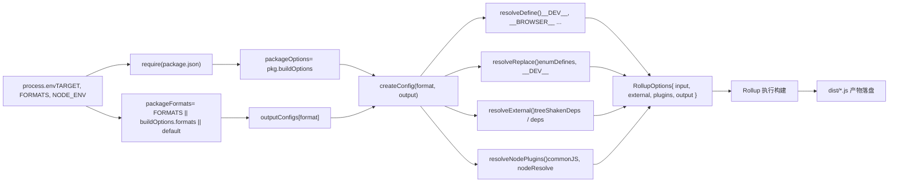

# 第 2 章：メインライフサイクル：1回のビルドリクエストのエンドツーエンドの旅

前章では、core リポジトリがエンジニアリングの母体として持つ位置づけ、および pnpm workspace とルートレベル設定がすべてのサブパッケージをどのように統一的に制約するかを明らかにしました。ここでは、ビルドシステムの核心に深く入り込み、1つのコマンドがどのようにビルドプロセス全体を駆動するかを追跡します。`node scripts/build.js vue`一見単純に見えますが、すべての成果物——esm-bundler、cjs、global——への唯一の入口です。これがユーザーの意図を実行可能なビルドタスクにどのように変換するかを理解することは、Vue のビルドメカニズムを習得するための鍵となる一歩です。

# Rollup 設定生成：環境変数からマルチフォーマット成果物へ

`build.js`が`exec`を通じて Rollup を起動した後、制御は`rollup.config.js`に移ります。このファイルはビルドシステムの「脳」です——環境変数を読み取り、Rollup 設定オブジェクトの配列を動的に生成します。

## 環境変数の検証とパッケージの特定

[FACT:rollup.config.js:27-29]

もし`TARGET`が設定されていなければ、直接エラーをスローします。これは防御的プログラミングです：Rollup 設定は直接呼び出される可能性があり（例えば`rollup -c`）、その場合`build.js`が環境変数を注入しないため、迅速に失敗する必要があります。

[FACT:rollup.config.js:32-44]

ここでは`build.js`のプライベートパッケージ判定ロジックが繰り返されています——なぜなら`rollup.config.js`は独立したプロセスであり、`build.js`のメモリ状態を共有できないからです。`resolve`関数は相対パスをパッケージディレクトリ下の絶対パスに解決し、`pkg`はターゲットパッケージの`package.json`の内容、`packageOptions`はその中の`buildOptions`フィールド、`name`は成果物ファイル名のプレフィックスです（優先的に`buildOptions.filename`を使用し、そうでなければディレクトリ名を使用）。

## フォーマットマッピングテーブル：`outputConfigs`

[FACT:rollup.config.js:58-88]

このテーブルは7種類のフォーマットから出力設定へのマッピングを定義しています。重要な観察点：

- `esm-bundler`、`esm-browser`、`esm-bundler-runtime`、`esm-browser-runtime`はすべて`format: 'es'`であり、違いはファイル名のみです。
- `cjs`は`format: 'cjs'`。
- `global`と`global-runtime`は`format: 'iife'`（即時実行関数式）であり、`<script>`タグで直接導入するのに適しています。
- `runtime`サフィックスのフォーマットはメインの`vue`パッケージに対してのみ意味があります——それらはコンパイラを含まず、サイズがより小さくなります。

## フォーマット選択：3層の優先度

[FACT:rollup.config.js:91-92]

フォーマット選択は3層の優先度に従います：コマンドライン`FORMATS`環境変数 > パッケージの`buildOptions.formats`> デフォルト`['esm-bundler', 'cjs']`。`PROD_ONLY`環境変数は基本設定をスキップするかどうかを制御します——プロダクションバージョンのみをビルドする場合、基本設定配列は空になり、その後はプロダクション設定のみがプッシュされます。

## プロダクション設定の追加ロジック

[FACT:rollup.config.js:97-114]

が`NODE_ENV === 'production'`のとき、各フォーマットに対して：

- もし`packageOptions.prod === false`なら、スキップ（そのパッケージはプロダクションバージョンを必要としない）。
- もし`cjs`なら、`createProductionConfig`を追加——生成`.prod.js`ファイル。
- もし`/^(global|esm-browser)(-runtime)?/`にマッチすれば、`createMinifiedConfig`を追加——圧縮版を生成。

> **[Design Inference & Architectural Trade-offs]**
> なぜ`cjs`は`createProductionConfig`を使い、`global`/`esm-browser`は`createMinifiedConfig`を使うのか？なぜなら CJS は Node 用であり、Node 環境では圧縮は不要（ユーザー自身が処理する）だが、dev/prod ブランチを区別する必要があるからです；一方、ブラウザで直接導入される成果物はサイズを減らすために圧縮必須です。この違いは2つのファクトリ関数の実装に現れています。

## `createConfig`：設定生成の核心

`createConfig`は最大の関数であり、フォーマットと出力設定を受け取り、完全な Rollup 設定オブジェクトを返します。

[FACT:rollup.config.js:125-142]

冒頭は一連のブールフラグの計算です：

- `isProductionBuild`：`__DEV__`環境変数またはファイル名に`.prod.js`が含まれるかで判定。
- `isBundlerESMBuild`、`isBrowserESMBuild`、`isCJSBuild`、`isGlobalBuild`：フォーマット名の正規表現マッチで判定。
- `isServerRenderer`：パッケージ名が`server-renderer`。
- `isCompatPackage`、`isCompatBuild`かどうか：Vue 2 互換ビルド関連。
- `isBrowserBuild`：グローバルビルドまたはブラウザ ESM ビルドで、非ブラウザブランチが有効になっていない。

これらのフラグは後続の`resolveDefine`、`resolveReplace`、`resolveExternal`で繰り返し使用され、設定差別化の核心的な根拠となります。

[FACT:rollup.config.js:144-157]

出力設定の基本設定：banner 著作権ヘッダー、`exports`モード（compat パッケージは`auto`を使用、それ以外は`named`を使用）、CJS ビルドで`esModule`相互運用を有効化、sourcemap は環境変数で制御、`externalLiveBindings: false`と`reexportProtoFromExternal: false`は Rollup 4 の互換性設定。グローバルビルドでは追加で`output.name`を設定、つまり`window`にマウントされる変数名。

## エントリファイルの選択

[FACT:rollup.config.js:159-168]

デフォルトのエントリは`src/index.ts`ですが、`runtime`サフィックスのフォーマットは`src/runtime.ts`。compat パッケージの ESM ビルドは default と named の両方をエクスポートする必要があるため、個別の`esm-index.ts` / `esm-runtime.ts`エントリを使用します。

## マクロ定義：`resolveDefine`

[FACT:rollup.config.js:170-218]

`resolveDefine`置換テーブルを返し、ソースコード内の`__COMMIT__`、`__VERSION__`、`__BROWSER__`などのマクロをリテラルに置換します。これらのマクロはソースコード内で条件付きコンパイルに使用されます——例えば`if (__DEV__) { ... }`は本番ビルドで`if (false) { ... }`に置換され、さらに Tree-shaking によって除去されます。

重要な設計：`__FEATURE_OPTIONS_API__`、`__FEATURE_PROD_DEVTOOLS__`などの機能フラグは`esm-bundler`ビルドでは`__VUE_OPTIONS_API__`のような識別子として保持され、エンドユーザーがバンドラー設定で上書きできるようにします。一方、他のビルドでは直接`true`または`false`。

[FACT:rollup.config.js:203-206]

にハードコードされます。非`esm-bundler`ビルドでは`__DEV__`をハードコードします。これらの dev/prod 分岐はビルド時に確定しているためです。

[FACT:rollup.config.js:210-216]

最後のステップでは環境変数が任意のマクロ定義を上書きできるようにし、`__RUNTIME_COMPILE__=true pnpm build runtime-core`のようなインライン上書きをサポートします。

## 置換プラグイン：`resolveReplace`

[FACT:rollup.config.js:222-255]

`resolveReplace`の外側で esbuild が処理できない置換を処理します：`resolveDefine`マージ

- （`enumDefines`からの列挙型インライン定義）。`inlineEnums`本番ブラウザビルドでは、エラー作成関数に
- アノテーションを付加し、Tree-shaking を支援します。`/*@__PURE__*/`ビルドでは、
- `esm-bundler`を`__DEV__`に置換し、バンドラーに判断を委ねます。`!!(process.env.NODE_ENV !== 'production')`ブラウザ ESM ビルドでは、
- を空オブジェクトに置換し、ブラウザエラーを回避します。`process.env`外部依存：

## これは前章の終わりの考察問題の核心です。ブラウザビルドは`resolveExternal`

[FACT:rollup.config.js:257-283]

のみを external として返します——これらの依存は import されていますが、ブラウザ分岐では実際には実行されず、ここに列挙されているのは Rollup の警告を抑制するためだけです。Node/ESM-bundler ビルドでは、すべての`treeShakenDeps`と`dependencies`、および`peerDependencies`などの Node 組み込みモジュールを externalize します。`path`、`url`、`stream`最終設定オブジェクト

## 返される設定オブジェクトには以下が含まれます：

[FACT:rollup.config.js:319-352]

：エントリファイルの絶対パス。

- `input`：外部依存リスト。
- `external`：プラグイン配列、順序は json → alias → enumPlugin → replace → esbuild → nodePlugins。
- `plugins`：出力設定。
- `output`：
- `onwarn`警告をフィルタリング（Vue ソースコードに循環依存が存在するが、実行時には無害）。`CIRCULAR_DEPENDENCY`：すべてのモジュールに副作用がないことを Rollup に伝え、積極的な Tree-shaking を実行。
- `treeshake.moduleSideEffects: false`以下の図は環境変数から最終設定へのデータフローを示しています：

コピー

# のプロセス管理

## `exec`は

`build.js`を通じて Rollup サブプロセスを起動します：`exec`は

[FACT:scripts/utils.js:64-114]

`exec`をラップし、Promise を返します。重要な設計：`spawn`のデフォルトは

- `stdio`——stdin は無視、stdout/stderr はパイプでキャプチャ。`['ignore', 'pipe', 'pipe']`——Windows ではコマンドを正しく解析するために shell が必要。
- `shell: process.platform === 'win32'`と
- 配列を通じて出力を収集し、`stderrChunks`イベントで結合します。`stdoutChunks`終了コードが 0 の場合は resolve、それ以外は reject し stderr の内容を付加します。`exit`〔設計推論とアーキテクチャのトレードオフ〕
- 注意：

> **[Design Inference & Architectural Trade-offs]**
> を呼び出す際に`build.js`を渡しており、これがデフォルトのパイプ設定を上書きし、Rollup の出力を直接ターミナルに透過させます。これはビルドツールの正しい動作です——ユーザーはビルドの進行状況をリアルタイムで確認する必要があります。`exec`サイズチェック：`{ stdio: 'inherit' }`サイズチェックには 2 つのスキップ条件があります：

## が真、またはフォーマットが指定されているが`checkAllSizes`

[FACT:scripts/build.js:206-215]

を含まない場合。サイズチェックはグローバルビルド成果物のみを対象としているためです——それはエンドユーザーが直接読み込むファイルであり、サイズが最も敏感です。`devOnly`は 2 つのファイルをチェックします：`global`と

[FACT:scripts/build.js:222-228]

`checkSize`（後者はフォーマットが未指定または`${target}.global.prod.js`が指定された場合のみチェック）。`${target}.runtime.global.prod.js`はファイルを読み取り、`global-runtime`と

[FACT:scripts/build.js:235-264]

`checkFileSize`で圧縮後サイズを計算し、`gzipSync`でフォーマットして出力します。`brotliCompressSync`が真の場合、結果を`prettyBytes`に書き込みます——これは CI におけるサイズ予算チェックのデータソースです。`writeSize`型宣言ビルド`temp/size/${fileName}.json`が真の場合、

## を呼び出し、

[FACT:scripts/build.js:94-108]

を通じてターゲットリストを渡します。これにより、実際にビルドされるパッケージのみの型宣言が生成されます。`buildTypes`設計上の考察と本番環境の落とし穴`pnpm run build-dts`なぜ`--environment TARGETS:...`を直接渡すのではなく

# を使うのか？

**Rollup の`--environment`は設定ファイル内で**を通じて読み取れる唯一の引数渡し方法です。直接`--environment`引数を渡すには`process.env`を解析する必要がありますが、`--config`は構造化されたキーと値のペアの解析を提供します。`process.argv`の正規表現の罠。`--environment`において

**`fuzzyMatchTarget`はユーザー入力です。ユーザーが** `target.match(partialTarget)`を入力した場合、正規表現ではリテラルなので問題ありませんが、`partialTarget`を入力すると任意の文字にマッチし、予期しないターゲットにマッチする可能性があります。これはあいまいマッチングの固有のリスクですが、Vue のパッケージ名には正規表現の特殊文字が含まれていないため、実際には発生しません。`runtime-core`，`-`並行ビルドのリソース競合。`runtime.core`，`.`は

**を並行上限として使用しますが、各 Rollup プロセス自体も worker を起動します。CI の低コア数のコンテナでは、メモリオーバーフローを引き起こす可能性があります。本番環境で OOM が発生した場合、** `runParallel`または並行数を減らすことで緩和できます。`cpus().length`のキャッシュライフサイクル。`--max-old-space-size`は

**`scanEnums`内で呼び出されますが、** `removeCache`自体がエラーをスローした場合、`finally`は代入されず、`scanEnums`内の呼び出しが失敗します。実際には`removeCache`が返す関数は`finally`の前に確定しているため、このリスクは存在しません——ただしこれは読む際に確認が必要なタイミングの詳細です。`scanEnums`の漏れリスク。`try`前章の考察問題ですでに指摘されています：

**`resolveExternal`に新しい依存を追加したが**の更新を忘れた場合、ブラウザビルドはその依存をバンドルに含めてしまい（external リストにないため）、サイズが膨張します。これは「ホワイトリスト external」戦略の固有のコストです。`runtime-core`本章のまとめ`resolveExternal`一度の

# の完全な旅：

がコマンドラインを解析し、`node scripts/build.js vue`が同期的に取得。

1. `parseArgs`が`commit`を呼び出して列挙型キャッシュを生成し、ターゲットを解析（

2. `run()`または`scanEnums`が`fuzzyMatchTarget`を通じて`allTargets`）。

3. `buildAll`を並行スケジュールし`runParallel`パッケージディレクトリを特定、`build`。

4. `build`を読み取り、プライベートパッケージをフィルタリング、`package.json`をクリーンアップ、`dist`引数を組み立て、呼び出し`--environment` 参数、调用 `exec`Rollup を起動する。

5. `rollup.config.js`環境変数を読み取り、`createConfig`を通じて設定配列を生成し、`resolveDefine`/`resolveReplace`/`resolveExternal`マクロ、置換、外部依存をそれぞれ処理する。

6. Rollup がビルドを実行し、成果物がディスクに書き込まれる`dist/`。

7. `checkAllSizes`gzip/brotli のサイズを計算し、オプションで書き込む`temp/size/`。

8. もし`--withTypes`なら、`build-dts`を呼び出して型宣言を生成する。

# 本章の考察とセルフチェック

Q1:`build.js`の`build`関数において、`if (!formats && fs.existsSync(...))`この条件が`dist`ディレクトリを削除するかどうかを決定する。もし`!formats`この条件を外した場合（つまりフォーマット指定に関わらず`dist`を削除する）、`pnpm build-all-cjs`のようなスクリプトで何が起こるか？

**参考解説**：

[FACT:scripts/build.js:172-175]

`pnpm build-all-cjs`は`node scripts/build.js vue runtime compiler reactivity shared -af cjs`に対応する（[FACT:package.json:40]参照）。これは`-f cjs`を指定するので、`formats`は`'cjs'`，`!formats`は偽となり、現在のロジックでは`dist`。

を削除しない。もし`!formats`を外すと、毎回のビルドで`dist`が削除される。しかし`build-all-cjs`は`cjs`フォーマットのみをビルドするため、削除後は`dist`には`cjs`の成果物だけが残り、以前ビルドした`esm-bundler`、`global`などのフォーマットはすべて失われる。さらに深刻なのは、`build-runtime-esm`、`build-browser-esm`などのスクリプトが順に実行され（[FACT:package.json:39]の`build-sfc-playground`スクリプト参照）、各スクリプトが前のスクリプトの成果物を削除するため、最終的に`dist`には最後のスクリプトのフォーマットしか残らない。これは SFC Playground のビルドを破壊する——複数フォーマットの成果物が同時に存在する必要があるため。

Q2: `runParallel`における`if (maxConcurrency <= source.length)`この条件の役割は何か？もし外した場合、単一パッケージ（`targets.length === 1`）のビルドで何が起こるか？

**参考解説**：

[FACT:scripts/build.js:131-151]

この条件は並行制限を有効にするかどうかを制御する。`maxConcurrency > source.length`のとき、制限は不要——すべてのタスクを同時に起動できる。もしこの条件を外すと、タスクが1つだけでも`executing`配列を作成し`await Promise.race(executing)`。

を実行する。単一タスクの場合、`executing`内の Promise は1つだけ`e`，`Promise.race`がその完了を待つ。これはエラーにはならないが、不要な Promise チェーンとマイクロタスクスケジューリングのオーバーヘッドを生む。さらに重要なのは、`executing.splice(executing.indexOf(e), 1)`は単一タスクのシナリオでも正しく動作するため、機能的には差異がなく、性能上のわずかな損失のみである。

真のリスクは：もし`maxConcurrency`が 0 の場合（理論上不可能、`cpus().length`は少なくとも 1 のため）、`executing.length >= 0`は永遠に真となり、`Promise.race([])`は永遠にハングする。しかし`cpus().length`がこの境界が発生しないことを保証している。

Q3: `resolveExternal`において、ブラウザビルドは`treeShakenDeps`を external として返すが、これらの依存はブラウザ分岐では実際には実行されない。もしそれらを external リストから外すと（つまり Rollup にバンドルさせようとすると）、何が起こるか？

**参考解説**：

[FACT:rollup.config.js:257-283]

`treeShakenDeps`は`source-map-js`、`@babel/parser`、`estree-walker`、`entities/decode`を含む。これらは`compiler-sfc`などのパッケージの依存であり、ブラウザビルドでは`__BROWSER__`マクロによって条件付きコンパイルで除外される。

もし external から外すと、Rollup はこれらの依存を解決してバンドルしようとする。`treeshake.moduleSideEffects: false`（[FACT:rollup.config.js:355-355]であり、かつこれらの依存のインポート文が`if (!__BROWSER__)`分岐内にあるため、esbuild の define が`__BROWSER__`を`true`に置換し、分岐がデッドコードとしてマークされる。Rollup の Tree-shaking がこれらのインポートを除去し、最終成果物にこれらの依存のコードは含まれない。

しかし問題は：Rollup は Tree-shaking の前にモジュールを解決する必要がある。もしこれらの依存がインストールされていない場合（例えば簡素な CI 環境で）、Rollup は「モジュールを解決できない」エラーを出す。それらを external に列挙することは防御策である——依存が存在しなくても、Rollup は解決を試みず、警告を出すだけである（そして`onwarn`は非循環依存の警告をフィルタリングする）。

ここまでで、コマンド解析から Rollup 呼び出しまでのビルドの旅を完全に辿り、並行スケジューリング、プライベートパッケージのフィルタリングなどの核心メカニズムを明らかにした。しかし、プロダクションビルドは物語の半分に過ぎない。次の章では、開発態のリンクに転じ、`scripts/dev.js`が SFC プリコンパイルとどのように協調し、ミリ秒級の開発フィードバックループを実現するかを見る。
