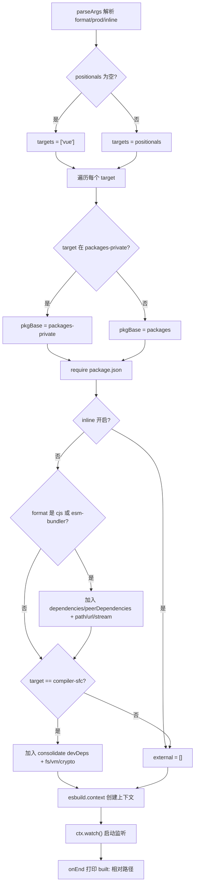
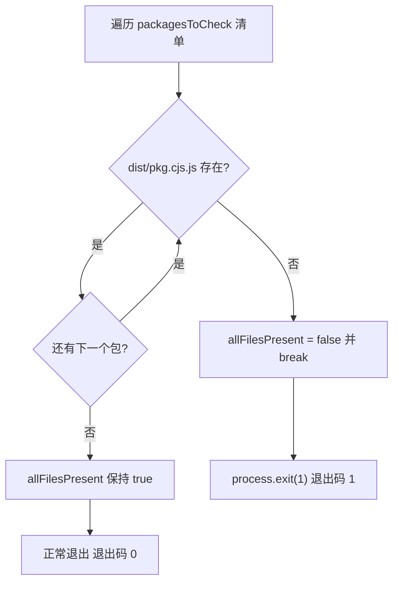
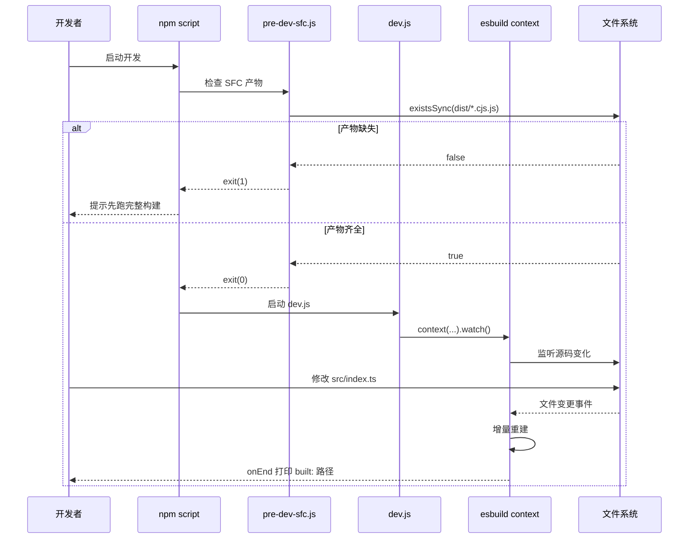

# 第 3 章：開発態リンク：dev スクリプトと SFC プリコンパイルの協調メカニズム

前の章では、プロダクションビルドがパラメータ解析からマルチフォーマット成果物のディスク書き込みまでの完全なリンクを追跡した。そのリンクが追求するのは成果物の完全性と規範性である。一方、開発態の核心的な要求はただ一つ：1行コードを変更したら、ブラウザで即座に効果が見えること。プロダクションビルドの「パラメータ解析 → 設定生成 → 全量バンドル → ディスク書き込み」というリンクは、数十秒かかることもざらで、この要求を全く満たせない。Vue core リポジトリはこのために独立した開発態リンクを維持している：`scripts/dev.js`は esbuild の watch モードでインクリメンタルビルドを行い、`scripts/pre-dev-sfc.js`はメインビルドの前に SFC コンパイラを事前コンパイルする。本章ではこの両者の協調メカニズムを分解する。

# 3.1 dev.js：esbuild で速度を得るインクリメンタルビルダー

## 直感モデル

プロダクションビルドは「印刷工場の正式な組版・印刷」のようなもの——品質優先で、遅くても構わない；開発ビルドは「下書き用紙への鉛筆スケッチ」のようなもの——美しさは求めず、書けば即座に現れることだけを求める。Vue がこのスケッチを描くのに Rollup ではなく esbuild を選んだ理由は、ファイル冒頭のコメントに書かれている：Rollup の成果物はより小さく、Tree-shaking も優れているが、esbuild の方がずっと速い。[FACT:scripts/dev.js:3-5]

もしこのスクリプトがなければ、開発者は変更のたびに完全なプロダクションビルドを実行しなければならず、フィードバックループはミリ秒級から分級に退化し、ホットリロード体験は跡形もなくなる。

## パラメータ解析とフォーマット導出

スクリプトのエントリは Node 組み込みの`parseArgs`で3つのオプションを解析する：`format`（デフォルト`global`）、`prod`（デフォルト`false`）、`inline`（デフォルト`false`）。[FACT:scripts/dev.js:18-40]位置引数は`targets`として収集され、空の場合はデフォルトで`['vue']`。[FACT:scripts/dev.js:42-53]

> **[Design Inference & Architectural Trade-offs]**
> ここに見落としがちな細かい点がある：`rawFormat`と`format`は2回の代入である。`parseArgs`の`default: 'global'`はすでに`rawFormat`に値があることを保証しているが、スクリプトは依然として`const format = rawFormat || 'global'`をフォールバックとして記述している。[FACT:scripts/dev.js:42]これは防御的な記述であり、`parseArgs`の動作変更や明示的に空文字列が渡された場合に下流の`format.startsWith`がエラーを投げるのを避けるためである。

`format`esbuildの出力フォーマットへのマッピングは3分岐である：`global`で始まる場合は`iife`にマッピングされ、`cjs`と等しい場合は`cjs`にマッピングされ、それ以外はすべて`esm`。[FACT:scripts/dev.js:42-53]成果物のファイル名サフィックスは`-runtime`サフィックスで個別に処理される：`global-runtime`は`runtime.global`に変換され、それ以外はそのまま維持される。[FACT:scripts/dev.js:42-53]

## ターゲットパッケージの特定と出力パス

スクリプトはまず`packages-private`ディレクトリ一覧を読み取り、ターゲットパッケージが公開パッケージかプライベートパッケージかを判断する。[FACT:scripts/dev.js:56]各targetについて、パッケージのベースパスを`packages`にするか`packages-private`にするかを決定し、次に`require`その`package.json`を取得して`version`と`buildOptions`。[FACT:scripts/dev.js:58-63]

出力ファイル名には特殊なケースがある：`vue-compat`ターゲットは`vue`にリネームされ、成果物が`vue-compat.global.js`。[FACT:scripts/dev.js:64-69]と呼ばれるのを避ける。最終パスは`packages/vue/dist/vue.global.js`，`prod`が真の場合に`prod.`セグメントを挿入する。

## external解析：依存関係を成果物にバンドルしない

`external`配列はどのモジュールをバンドルしないかを決定する。ロジックは2層に分かれる：

第1層では、`inline`が有効でなく、フォーマットが`cjs`または`esm-bundler`を含む場合、`dependencies`、`peerDependencies`のキーをすべてexternalに追加し、ハードコードで`path`、`url`、`stream`の3つのNode組み込みモジュールを指定する。[FACT:scripts/dev.js:76-88]コメントには、これら3つが`@vue/compiler-sfc`と`server-renderer`のために用意されていることが明記されている。

第2層では、`compiler-sfc`ターゲットに対して、追加で`@vue/consolidate`の`devDependencies`を解析し、それらおよび`fs`、`vm`、`crypto`などをまとめてexternalにする。[FACT:scripts/dev.js:90-112]コードにはさらに`react-dom/server`、`teacup/lib/express`、`arc-templates/dist/es5`、`then-pug`、`then-jade`などのテンプレートエンジンパスがハードコードされている——これらはconsolidateがサポートするテンプレートエンジンであり、オプション依存であるため、強制インストールはできない。

> **[Design Inference & Architectural Trade-offs]**
> このロジックは`rollup.config.js`と高度に重複しており、ソースコードのコメントもこの点を認めている（`TODO this logic is largely duplicated from rollup.config.js`）。共通関数として抽出しなかった理由は、devとprodのexternal戦略に微妙な差異があるためである（devはより積極的にexternal化してビルドを高速化する）。無理に統一するとかえって結合度が増す。

## プラグインとdefine注入

プラグイン配列のデフォルトは`log-rebuild`が1つだけで、`onEnd`フック内でビルド成果物の相対パスを出力する。[FACT:scripts/dev.js:115-124]これは開発者が「変更が反映された」ことを感知する唯一のフィードバック信号である。

> **[Design Inference & Architectural Trade-offs]**
> 2つ目のプラグインは条件付きである：フォーマットが`cjs`でなく、パッケージの`buildOptions.enableNonBrowserBranches`が真の場合、`polyfillNode()`。[FACT:scripts/dev.js:126-128]をマウントする。`compiler-sfc`のようなパッケージ（例：

`define`）はブラウザビルドでもNode分岐を通るため、ブラウザ環境で動作させるにはNode組み込みモジュールのpolyfillが必要である。[FACT:scripts/dev.js:141-159]ブロックは本章で情報密度が最も高い部分である。`__XXX__`ソースコード内のすべての

- `__COMMIT__`マクロをリテラルに置換する：`"dev"`，`__VERSION__`は
- `__DEV__`に固定され、`prod`はパッケージバージョンを取得し、`__TEST__`は`false`；
- `__BROWSER__`フラグで決定され、`format !== 'cjs' && !pkg.buildOptions?.enableNonBrowserBranches`。[FACT:scripts/dev.js:146-148]は常に
- `__SSR__`の導出が最も微妙である：`format !== 'global'`つまり、「cjsでなく、かつパッケージが非ブラウザ分岐をサポートしない」場合のみブラウザ環境としてマークされる；
- `__COMPAT__`は`vue-compat`、すなわちglobalビルドではSSR分岐が有効にならない；
- はtargetが`__FEATURE_SUSPENSE__`、`__FEATURE_OPTIONS_API__`、`__FEATURE_PROD_DEVTOOLS__`、`__FEATURE_PROD_HYDRATION_MISMATCH_DETAILS__`かどうかで決定される；

3つのfeature flag（`vitest.config.ts`）はdevモードですべてハードコードされる。`define`これらのマクロは[FACT:vitest.config.ts:6-21]の`__TEST__`ブロックと一対一で対応する。`true`、`__DEV__`テスト環境では`true`を

## に設定し、

を`esbuild.context(...).then(ctx => ctx.watch())`。[FACT:scripts/dev.js:130-161] `context`に設定する。devビルドとの差異こそが「テスト vs 開発」という2つの実行状態の区別点である。`watch()`watchモードの起動`onEnd`最後のステップは

# で初めてファイル監視を実際に開始する。以降esbuild内部が依存グラフを維持し、依存ファイルの変更があればインクリメンタルリビルドがトリガーされ、リビルド完了コールバック

## がログを出力する。

コピー`compiler-sfc`3.2 pre-dev-sfc.js：循環依存を打破するプリコンパイルセンチネル`compiler-core`直感的モデル`compiler-core`「鶏が先か卵が先か」のジレンマを想像してほしい：`compiler-sfc`のソースコードは`.vue`をimportしており、一方`pre-dev-sfc.js`は開発時に

## を必要として

ファイルを処理する。両方がesbuild watchでリアルタイムコンパイルされる場合、先にコンパイルする方がデッドロックする。`compiler-sfc`、`compiler-core`、`compiler-dom`、`compiler-ssr`、`shared`。[FACT:scripts/pre-dev-sfc.js:4-10]の役割は「先に卵を孵し、それから鶏を育てる」こと——メインビルド開始前に、これらのパッケージのCJS成果物がすでに存在することを保証する。`packages/${pkg}/dist/${pkg}.cjs.js`チェックリストとショートサーキットロジック[FACT:scripts/pre-dev-sfc.js:4-23]

スクリプトは固定リストを維持する：`allFilesPresent`各パッケージについて、`false`が存在するかチェックする。`break`1つでも欠けていれば、[FACT:scripts/pre-dev-sfc.js:20-21]を`allFilesPresent`に設定し、直ちに`process.exit(1)`して残りのパッケージをチェックしない。[FACT:scripts/pre-dev-sfc.js:25-27]

## 最後に

が偽の場合、`exit(1)`は非ゼロコードで終了する。`&&`終了コードのセマンティクス

# は上位の呼び出し元（通常はnpm scriptの

`scripts/dev.js`チェーンやCIスクリプト）へのシグナルである：成果物が不完全であり、先に完全なビルドを実行する必要がある。すべて存在すれば正常終了（終了コード0）し、メインビルドが続行される。`scripts/aliases.js`コピー[FACT:scripts/aliases.js:7-7]

## 3.3 aliases.jsとvitest.config.ts：開発態リンクのもう半分

`resolveEntryForPkg`は「成果物をどう素早く生成するか」を解決するが、開発時にはもう1つのパスがある：テストを実行することである。`packages/${p}/src/index.ts`。[FACT:scripts/aliases.js:7-7]はvitestとrollupに共有のパスエイリアスを提供する。`vue`、`vue/compiler-sfc`、`vue/server-renderer`、`@vue/compat`。[FACT:scripts/aliases.js:16-21]

エイリアス生成ロジック`packages`はパッケージ名を`vue`にマッピングする。ベースentriesには4つの特殊マッピングがハードコードされている：`nonSrcPackages`（`sfc-playground`、`template-explorer`、`dts-test`その後`@vue/${dir}`ディレクトリ下のすべてのサブディレクトリを走査し、[FACT:scripts/aliases.js:23-35]

> **[Design Inference & Architectural Trade-offs]**
> をスキップし）、既存のkeyをスキップし、かつディレクトリでなければならないもののみ`nonSrcPackages`除外リストは、これら3つのパッケージに`src/index.ts`エントリーポイントがなく、強制的にマッピングすると解析が失敗するためです。

## vitest の define とエイリアスの消費

`vitest.config.ts`直接 import`entries`として`resolve.alias`。[FACT:vitest.config.ts:3][FACT:vitest.config.ts:22-24]その`define`ブロックと dev.js のマクロ注入が対照を形成：テスト環境`__DEV__: true`、`__TEST__: true`、`__BROWSER__: false`、`__CJS__: true`。[FACT:vitest.config.ts:6-21]

テストは5つの project に分割されています：`unit`、`unit-gc`、`unit-jsdom`、`e2e`、`e2e-browser`。[FACT:vitest.config.ts:51-118]そのうち`unit-gc`を使用し`pool: 'forks'`かつ渡す`--expose-gc`、手動で GC をトリガーする必要がある SSR テストを専門に実行します。[FACT:vitest.config.ts:65-76] `e2e-browser`は playwright の chromium インスタンスを有効にし、Transition 関連のテストを実行します。[FACT:vitest.config.ts:99-117]

# 設計上の考察

**なぜ dev は esbuild を使い、prod は Rollup を使うのか？**これは技術選定の気まぐれではなく、2つのシナリオの制約が異なるためです。開発時は成果物のサイズに敏感ではなく、フィードバック遅延に極度に敏感です。本番時はその逆です。esbuild は Go で書かれ、並列化の度合いが高く、コールドスタートとインクリメンタルビルドが一桁速いですが、Tree-shaking とコード分割の能力は Rollup より劣ります。[FACT:scripts/dev.js:3-5]2つのツールをそれぞれのシナリオに使い分けるのは、エンジニアリング上の実用的なトレードオフです。

> **[Design Inference & Architectural Trade-offs]**
> **pre-dev-sfc はなぜチェックのみでコンパイルしないのか？**もしそれ自体がコンパイルをトリガーすると、循環依存を再び引き込んでしまいます——それは`compiler-sfc`をコンパイルする必要があり、コンパイルプロセス自体が`compiler-sfc`の成果物に依存する可能性があります。したがって、それは「アサーション」のみを行い、「成果物の欠如」という事実を上位層に公開し、上位層が完全なビルドを実行するかエラーで終了するかを決定します。これは「センチネルパターン」です：問題を解決せず、問題を報告するだけです。

**external リストの重複は技術的負債か？**dev.js と rollup.config.js の external ロジックは重複しており、ソースコードのコメントもそれを認めています。[FACT:scripts/dev.js:73]しかし両者の external 集合は完全には一致していません——dev は速度のために、より積極的に external 化します。無理に共通関数を抽出すると、パラメータ化された差異スイッチを導入する必要があり、かえって両方のロジックが読みにくくなります。これは「重複は誤った抽象化に優る」の典型的なトレードオフです。

# 本章のまとめ

本章では Vue core の開発時チェーンの3つのピースを分解しました：

1. **`scripts/dev.js`**：esbuild の`context().watch()`でインクリメンタルビルドを実現し、`parseArgs`でフォーマットとフラグを解析し、動的に`require`ターゲットパッケージ`package.json`で出力パスを特定し、`__DEV__`、`__BROWSER__`などのマクロを注入して条件付きコンパイルを制御し、`log-rebuild`プラグインで毎回の再ビルド後にフィードバックを出力します。

2. **`scripts/pre-dev-sfc.js`**：メインビルド前に5つのコアパッケージの CJS 成果物が存在するかをチェックし、欠如していれば終了コード1でショートサーキットし、循環依存によるビルドデッドロックを回避します。

3. **`scripts/aliases.js` + `vitest.config.ts`**：テストチェーンに共有パスエイリアスを提供し、特殊項目をハードコードしつつ汎用項目を動的スキャンし、マルチ project 設定でユニット、GC、jsdom、e2e、ブラウザ e2e の5つのテストシナリオをカバーします。

# 本章の考察とセルフチェック

Q1: もし`scripts/pre-dev-sfc.js`の`break`を削除した場合（つまり全パッケージをチェックしてから終了を決定する）、どのようなシナリオで開発者体験が悪化するか？なぜソースコードの作者は「最初の欠如を発見したらショートサーキット」を選んだのか？

**参考解析**：

[FACT:scripts/pre-dev-sfc.js:4-23]

`break`は`if (!fs.existsSync(...))`分岐内にあり、あるパッケージの成果物が欠如しているのを発見すると即座にループを抜けます。

もし`break`を削除すると、スクリプトは残りのパッケージのチェックを続け、最終的に`allFilesPresent`は依然として`false`となり、終了コードも依然として1で、**機能的には等価**です。しかし差異は以下にあります：

1. **パフォーマンス**：5つの`existsSync`呼び出し自体は高速ですが、リストが数十のパッケージに拡張されると、ショートサーキットは大量の無駄な stat システムコールを節約できます。

2. **セマンティクス**：ショートサーキットが表現するのは「1つでも欠如していれば、全体が不完全である」——これはブールアサーションであり、具体的にいくつ欠如しているかを知る必要はありません。チェックを続けても追加情報は生まれません。

3. **開発者体験**：実際に悪化するのは「エラーメッセージ」です。現在のスクリプトはどのパッケージが欠如しているかを出力せず、開発者は終了コード1だけを見ます。もし`break`を削除してログを追加すれば、かえって開発者に「compiler-core と shared が欠如している」と伝えられます——しかしこれには追加コードが必要です。作者は最も簡素な実装を選び、「どれが欠如しているか」の診断を上位ビルドスクリプトのエラーに委ねています。

したがって`break`の核心的な動機は「アサーションのセマンティクス + パフォーマンス」であり、体験の最適化ではありません。

Q2: `scripts/dev.js`における`__BROWSER__`の導出は`format !== 'cjs' && !pkg.buildOptions?.enableNonBrowserBranches`です。あるパッケージの`buildOptions.enableNonBrowserBranches`が`true`であり、開発者が`-f global`でビルドすると仮定すると、このとき`__BROWSER__`は`false`となります。これはどのような結果を引き起こすか？もし誤って`true`に変更するとどうなるか？

**参考解析**：

[FACT:scripts/dev.js:146-148]

かつ`format = 'global'`のとき：`enableNonBrowserBranches = true`は

- `format !== 'cjs'`は`true`
- `!pkg.buildOptions?.enableNonBrowserBranches`全体`false`
- これは、ソースコード内のすべての`__BROWSER__ = false`

分岐が esbuild の define によって`if (__BROWSER__)`に置換され、ブラウザ専用コードが Tree-shaking で除去され、非ブラウザ分岐（Node 専用ロジック）が保持されることを意味します。`if (false)`結果

**：global ビルド成果物は本来ブラウザで動作すべきですが、Node 専用分岐を含んでいます。もしこれらの分岐が**などの Node 組み込みモジュールを参照していると、ブラウザでの読み込み時に「モジュールが未定義」とエラーになります。これこそが`fs`、`path`が真であるパッケージ（`enableNonBrowserBranches`など）が通常 global ビルドに使用されない理由、あるいは`compiler-sfc`プラグインでのフォールバックが必要な理由です。`polyfillNode()`もし誤って[FACT:scripts/dev.js:126-128]

**に変更すると、ブラウザ分岐が保持され、Node 分岐が除去されます。`true`**：`__BROWSER__ = true`のように Node 環境で SFC コンパイルを実行する必要があるパッケージでは、コア機能（ファイル読み取り、Node API 呼び出し）が Tree-shaking で除去され、成果物が Node で実行時に「関数が未定義」とエラーになります。`compiler-sfc`において、動的スキャンで

Q3: `scripts/aliases.js`ディレクトリをスキャンする際に`packages`をスキップしました）。もし新しいパッケージが`nonSrcPackages`（`sfc-playground`、`template-explorer`、`dts-test`ディレクトリに追加されたが`packages`がなければ`src/index.ts`、かつ に追加されていない`nonSrcPackages`、何が起こるか？vitest の実行時、どの段階でエラーが発生するか？

**参考解析**：

[FACT:scripts/aliases.js:23-35]

動的スキャンロジックは次の通り：各ディレクトリについて、もし`dir !== 'vue'`、 に存在せず`nonSrcPackages`、key が存在せず、かつディレクトリであれば、`entries['@vue/${dir}'] = resolveEntryForPkg(dir)`。

`resolveEntryForPkg`が返すのは`packages/${p}/src/index.ts`のパスである。[FACT:scripts/aliases.js:7-7]注意すべき点として、それ**ファイルの存在をチェックしない**、単にパスを結合するだけである。

**結果**：エイリアスは登録されるが、存在しないファイルを指す。vitest が import を解決する際、あるテストファイルがこのパッケージを import すると、Vite の resolve プラグインがそのパスを読み込もうとし、「モジュールを解決できない」または「ファイルが存在しない」というエラーを報告する。

**エラー発生段階**： の実行時ではなく（それは文字列結合のみを行う）、vitest 起動後、初めてその import を解決する時である。どのテストもこのパッケージを import しなければ、エラーは発生しない——エイリアスはただ`aliases.js`オブジェクトの中に横たわっているだけである。`entries`回避方法

**：このような**を持たないパッケージを`src/index.ts`に追加するか、新しいパッケージに標準的なエントリポイントがあることを保証する。これが`nonSrcPackages`を手動で維持する必要がある理由でもある——それは「設定より規約」の例外リストである。`nonSrcPackages`三者協調の境界は非常に明確である：

は「成果物が準備できているか」を管理し、`pre-dev-sfc`は「成果物をいかに迅速に更新するか」を管理し、`dev.js`は「テストがいかにソースコードを解決するか」を管理する。開発時リンクは速度問題を解決したが、ビルド期にはさらに別の、より隠れた最適化がある——コードがブラウザで実行される前に完了する変換である。次の章ではコンパイル期の魔法に入り、enum のインライン化と Tree-shaking 検証メカニズムが、ビルド期にどのように TypeScript enum をリテラルに置き換え、オンデマンド import の約束が破られないことを保証するかを見る。`aliases`← 前の章：第 2 章
