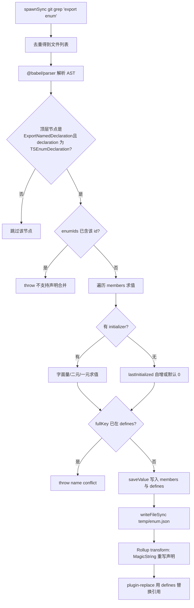
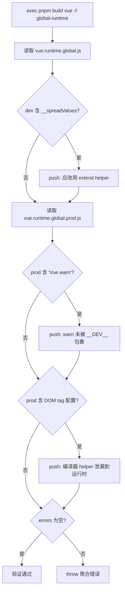

# 所属プロジェクト：vuejs/core

4.1 enum インライン化：実行時オブジェクトをリテラルに溶解する

# 直感モデル

## あなたがレシピを書いたと想像してほしい。そこには「塩少々」が繰り返し現れる。毎回料理するたびに付録を開いて「少々 = 3 グラム」を調べるのは、遅くて場所も取る。enum インライン化が行うのは、印刷前に全書の「塩少々」を直接「塩 3 グラム」に置き換え、その後付録のページを破り捨てることである。読者（実行時）にとって結果は全く同じだが、本は薄くなる。

もしそれがなければ、システムはどのような災難に直面するか？TypeScript の通常の

はコンパイル後に実在するオブジェクトリテラルを生成し、双方向マッピング（`enum`）を持つ。このオブジェクトは`Enum[Enum.A] === 'A'`副作用のあるモジュールレベル宣言**であり、Rollup はそれが未使用であることを証明できないため、保持せざるを得ない——たとえそのうちの一つのメンバーだけを import しても、enum オブジェクト全体と逆マッピングが成果物に詰め込まれる。**のコメントは率直に述べている：彼らはかつて[FACT:scripts/inline-enums.js:3-9]を使ったが、issue #1228 のために通常の enum に切り替え、そこでこのスクリプトを使って「const enum のゼロコストの利点を手動で取り戻した」。`const enum`データ構造とメモリレイアウト

## スクリプトの核心は三つの型定義であり、それらを理解すればデータフロー全体を理解できる。

、単一の enum メンバーの名前と評価後のリテラル。[FACT:scripts/inline-enums.js:33-36]

- `EnumMember`：`{ name, value }`は
- `EnumDeclaration`：`{ id, range: [start, end], members }`。`range`ソースコードのバイトオフセット**であり、**の宣言全体のファイル内での開始位置と終了位置を指す——これは後続の MagicString による正確な置換のアンカーである。`export enum X { ... }`はファイルパスでインデックスされ、そのファイル内のすべての enum 宣言の置換範囲を記録する；
- `EnumData`：`{ declarations, defines }`。`declarations`はフラットマッピングであり、キーは ``defines`${enum名}.${メンバー名}` `JSON.stringify` 後のリテラルである。` `` 形式的字符串，值是 `ここに重要な設計がある：

のキー`defines`はファイルパスを含まない**コメントが理由を説明している——**。[FACT:scripts/inline-enums.js:98-103]は`ErrorCodes`と`@vue/compiler-core`に同時に存在できるため、同名の enum がファイルを跨いで存在することを許可する；しかし同じ`@vue/runtime-core`は二つの同名 enum 内で重複を許さない。そうでなければ`ErrorCodes.__EXTEND_POINT__`がヒットし、直接`fullKey in defines`をスローする。これは「メンバー名によるグローバル一意」の制約であり、「enum 名によるグローバル一意」ではない。`name conflict`キャッシュは

に置かれる。なぜディスクに書き込む必要があるか？なぜなら`temp/enum.json`。[FACT:scripts/inline-enums.js:33-36]はビルドエントリで一度だけ呼ばれ、Rollup は各パッケージ、各フォーマットごとに`scanEnums()`独立したプロセス**を起動するからである。コメントが指摘する：データは並行する Rollup プロセス間で共有される必要があるため、ディスクにシリアライズし、各プロセスの**。[FACT:scripts/inline-enums.js:39-41]が読み戻さなければならない。`inlineEnums()`Step-by-Step：grep からリテラル置換まで

## 第一步：

**を含むすべてのファイルを grep する。`export enum`は**[FACT:scripts/inline-enums.js:51-61]を使い、出力は`spawnSync('git', ['grep', 'export enum'])`の形で、次に`path:line:content`で最初の部分（ファイルパス）を切り出し、`:`で重複を除去する。ここで使っているのは`Set` 去重。注意这里用的是 `git grep`ファイルシステムを走査するのではなく——Gitに追跡されているファイルだけを自然にスキャンし、自動的に除外する`node_modules`とビルド成果物。

**第二步：Babelが解析し、列挙情報を収集する。**[FACT:scripts/inline-enums.js:64-70]各ファイルに対して`@babel/parser`を`typescript`プラグイン、`sourceType: 'module'`でASTに解析し、その後`ast.program.body`のトップレベルノードのみを走査する。[FACT:scripts/inline-enums.js:74-79]`ExportNamedDeclaration`かつその`declaration.type === 'TSEnumDeclaration'`のノードのみを認識する——つまり、**エクスポートされていないenumは処理されない**。

各列挙宣言について、スクリプトはメンバーを1つずつ評価する。メンバー評価は3つのパスに分かれる：

1. **リテラル初期化**：`StringLiteral`または`NumericLiteral`直接`init.value`。[FACT:scripts/inline-enums.js:114-119]

2. **二項式**：例えば`1 << 2`。再帰的に`resolveValue`左右のオペランドを処理し、オペランドはリテラルでもよく、`MemberExpression`（つまり以前に定義された列挙メンバーへの参照）でもよい。[FACT:scripts/inline-enums.js:121-151]鍵となるのは`MemberExpression`分岐である：それは`content.slice(node.start, node.end)`を用いて**元のソーステキスト**から式文字列（例えば`ErrorCodes.FOO`）を切り出し、次に`defines`を調べる。見つからなければ`unhandled enum initialization expression`。[FACT:scripts/inline-enums.js:132-141]をスローする。これが`defines`がグローバルなフラットマッピングでなければならない理由を説明する——列挙をまたぐ参照では、参照される側が別のファイル由来かもしれないが、キーは`枚举名.成员名`。

3. **単項式**：例えば`-1`、`-1`文字列に組み立ててから`evaluate`で評価する。[FACT:scripts/inline-enums.js:152-163]

評価自体は`new Function('return ' + exp)()`。[FACT:scripts/inline-enums.js:39-41]を用いる。これは**制御されたeval**である：入力はソース内ですでに解析されたAST断片から来ており、任意のユーザー入力ではないため、安全境界は制御可能である。

**第三步：初期化子のないメンバーを処理する（自動インクリメントのセマンティクス）。**[FACT:scripts/inline-enums.js:171-183]メンバーに`initializer`がない場合：最初のメンバーはデフォルトで`0`；後続のメンバーは`lastInitialized`が数値なら`++`；文字列なら`wrong enum initialization sequence`をスローする——文字列列挙メンバーは暗黙の自動インクリメントを許可しないためである。これはまさにTypeScriptのenumのセマンティクスである。

**第四步：キャッシュを書き込み、クリーンアップ関数を返す。**[FACT:scripts/inline-enums.js:200-213] `scanEnums()`クロージャを返し、呼び出すと`rmSync`キャッシュファイルを削除する。`build.js`でそれを使用する。`try/finally`[FACT:scripts/build.js:81-112]これにより、ビルドの途中でエラーがスローされてもキャッシュがクリーンアップされ、次のビルドを汚染しないことが保証される。

**第五步：Rollup transform段階での置換。** `inlineEnums()`キャッシュを読み戻し、Rollupプラグインを構築する。[FACT:scripts/inline-enums.js:219-234]において、`transform(code, id)`が`id`にヒットした場合、`enumData.declarations`MagicStringを使って`[start, end]`この宣言部分をオブジェクトリテラルに置換する。[FACT:scripts/inline-enums.js:242-274]

置換後の形態は`export const X = { ... }`である。注意すべきは、それ**は単にenumを削除するのではなく**、オブジェクトリテラルに書き換え、さらに数値メンバーに対して追加で逆マッピングを生成する：`JSON.stringify(value.toString()) + ': ' + JSON.stringify(name)`。[FACT:scripts/inline-enums.js:257-270]コメントはTypeScript公式ドキュメントのreverse-mappingsルールを引用している：文字列列挙メンバーは逆マッピングを生成せず、数値メンバーは生成する。これにより、置換後の実行時動作が元のenumと完全に一致することが保証される。

そして実行時オーバーヘッドを真に排除するのは、`defines`が`@rollup/plugin-replace`。[FACT:rollup.config.js:222-223]に渡されることである。`X.Member`への**すべての参照**は置換プラグイン内で直接リテラルに置き換えられるため、書き換えられたオブジェクトリテラルが誰にも使われなければ、Tree-shakingで振り落とすことができる。

以下のフローチャートは、grepから置換までの完全な意思決定パスを描いている：

## 設計上の考察と落とし穴

**なぜファイル全体を再生成せずMagicStringを使うのか？**なぜなら`s.update(start, end, ...)`は列挙宣言のその部分だけを置換し、残りのソースバイトは完全に変更しないため、`s.generateMap()`正確なsourcemapも生成できる。[FACT:scripts/inline-enums.js:277-281]BabelでAST全体を再出力すると、元のフォーマットやコメントが失われ、sourcemapの品質も低下する。

**`range`なぜ`node.start/node.end`ではなく`declaration.start`？**[FACT:scripts/inline-enums.js:189-193]なのか`node.start`がアサートするのは`ExportNamedDeclaration`（つまり`export enum X {...}`ノード）であり、置換範囲は`export`全体をカバーし、`export const`キーワードも含む。置換テキストは

**で始まり、ちょうど接続する。`defines`落とし穴：**のグローバル一意性制約。`ErrorCodes`もし2つの異なるファイルにそれぞれ`__EXTEND_POINT__`があり、どちらも[FACT:scripts/inline-enums.js:101-103]を定義している場合、ビルドは直接失敗する。`defines`これはバグではなく、意図的な設計である——なぜなら

**はグローバル置換テーブルであり、ファイルの出所を区別できないためである。本番環境で新しい列挙メンバーを追加する際、名前が既存の列挙メンバーと衝突すると、ここで爆発する。`new Function`落とし穴：**の評価タイミング。`scanEnums`二項式の評価は`defines`段階で発生し、この時点で[FACT:scripts/inline-enums.js:136-140]内にまだ参照されたメンバーがない可能性がある（参照順序が逆の場合）。`unhandled enum initialization expression`は

# をスローする。これは、列挙メンバーの参照が「先に定義、後に参照」というソース順序に従わなければならないことを要求する。

## 4.2 Tree-shaking検証：成果物文字列で逆に約束を証明する

直感的モデル`verify-treeshaking.js`列挙のインライン化は「事前最適化」だが、最適化が本当に効いているか？ あるhelperが書き方の不備で誤って保持されると、サイズが静かに膨張し、開発者はまったく気づかない。**がその「事後品質検査員」である：それは成果物をビルドし、検死のように成果物内に**出現すべきでないものが出現していないか

## を検査する。それがなければ、Vueのオンデマンド導入の約束はあるリファクタリング後に音もなく破られ、ユーザーがパッケージが大きくなったと不満を言うまで発見されないかもしれない。

データ構造と検査項目`errors`このスクリプトに複雑なデータ構造はなく、核心は`includes`配列と3回の[FACT:scripts/verify-treeshaking.js:6-6]チェックである。`global-runtime`それはまず

フォーマットをビルドし、その後devとprodの成果物をそれぞれ読み取る。

1. **3つの検査項目は3種類の「Tree-shaking失敗」に対応する：`__spreadValues`**。[FACT:scripts/verify-treeshaking.js:13-19]dev成果物に`{ ...obj }`が含まれる`extend`これはesbuildが

2. **オブジェクトスプレッド構文のために生成するhelperである。これが出現する場合、実行時コードでオブジェクトスプレッドが使われており、Vueの規約では`Vue warn`**。[FACT:scripts/verify-treeshaking.js:26-31]helperに変更して余分なコードを避けるべきであることを示す。`warn()`prod成果物に`__DEV__`が含まれる

3. **これは**。[FACT:scripts/verify-treeshaking.js:33-42]呼び出しが`html,body,base`、`svg,animate,animateMotion`、`annotation,annotation-xml,maction`条件で包まれておらず、警告コードが本番バンドルに漏れていることを示す。`isHTMLTag()`などの helper 内部のデータは、本来コンパイラにのみ存在し、ランタイムによって除去されるべきものです。もしランタイム成果物に現れるなら、ランタイムパスがコンパイラ専用の helper を誤って使用していることを示します。

## Step-by-Step：検証フロー

[FACT:scripts/verify-treeshaking.js:5-5]まず`exec('pnpm', ['build', 'vue', '-f', 'global-runtime'])`のみをビルドし、`vue`パッケージの`global-runtime`フォーマット——これは最小化されたランタイム成果物であり、リークを露呈するのに最適です。ビルド完了後、2つのファイルを同期的に読み取り、1つずつ`includes`チェックし、ヒットしたら`errors`に説明付きのメッセージを push します。最後に`errors.length`が非ゼロであれば、集約エラーをスローします。[FACT:scripts/verify-treeshaking.js:44-48]

## 設計上の考察と落とし穴

> **[Design Inference & Architectural Trade-offs]**
> **なぜ文字列`includes`を使い、AST 分析を使わないのか？**これは「センチネルチェック」であり「精密分析」ではないからです。完全性を追求せず、歴史的に実際に発生した3種類のリグレッションに対して低コストのアラートを設定するだけです。文字列マッチングはゼロ依存、ゼロ解析オーバーヘッドで、圧縮後の成果物にも同様に有効です——AST 分析は minify 後にはむしろ難しくなります。

> **[Design Inference & Architectural Trade-offs]**
> **なぜ`global-runtime`？**のみを検証するのか。このフォーマットはすべての依存をインライン化し（`external`が空）、サイズに最も敏感で、誤って導入されやすい成果物です。これがクリーンであれば、他のフォーマットも通常クリーンです。同時にビルドが速く、CI に頻繁に組み込むのに適しています。

> **[Design Inference & Architectural Trade-offs]**
> **落とし穴：チェック項目は「ブラックリスト」であり、コードの進化に伴い無効化します。**もしある日`isHTMLTag`のデータ構造が変更され、`html,body,base`この文字列が出現しなくなれば、チェックは形骸化します。これはメンテナが関連する helper を変更する際に、ここのセンチネル文字列を同期して更新することを要求します。これはブラックリスト式検証の固有のコストです。

# 4.3 Rollup との協調：プラグイン順序と define 注入

列挙型のインライン化は孤立して動作するのではなく、Rollup のプラグインパイプラインに組み込まれています。パイプライン内での位置を理解して初めて、なぜ`defines`を`replace`に委ねるのか、`esbuild`。

[FACT:rollup.config.js:47-50]ではなく`inlineEnums()`設定モジュールのトップレベルで`[enumPlugin, enumDefines]`を呼び出し、**を分割代入するのかが理解できます。これは**各 Rollup プロセスの起動時`scanEnums`に実行され、

が書き込んだキャッシュを読み取ることに注意してください。`json` → `alias` → `enumPlugin` → `...resolveReplace()` → `esbuild`。[FACT:rollup.config.js:324-339] `enumPlugin`プラグイン配列の順序は：`replace`は`replace`より前に配置され、列挙型宣言の書き換えが先に発生し、その後`defines`が`esbuild`を使用して参照を置換します。そして

は最後に配置され、TS トランスパイルを担当します。`defines`なぜ`replace`が`esbuild`を経由せず`define`？[FACT:rollup.config.js:220-221]を経由するのか`ErrorCodes.__EXTEND_POINT__`のコメントが答えを与えます：esbuild の define は「やや厳格で、リテラル JSON または識別子のみを許可する」。一方、列挙型メンバー名のような`@rollup/plugin-replace`はドット付きのメンバー式であり、esbuild の define はこのようなキーを直接処理できません。したがって[FACT:rollup.config.js:250-251]を使用する必要があり、これは任意の文字列キーの置換をサポートします。`preventAssignment: true`かつ

`resolveReplace()`を設定し、代入文の左辺も置換されるのを避けます。`const replacements = { ...enumDefines }`内の[FACT:rollup.config.js:222-223]が最初のステップです。`/*@__PURE__*/`その後で初めて本番環境の`__DEV__`アノテーション、

# などの置換が重ねられます。この順序により、列挙型リテラルの置換が常に有効になります。

**設計上の考察**列挙型インライン化の本質は「ビルド期の複雑さでランタイムサイズを交換する」ことです。`scanEnums`これは TypeScript の型システムセマンティクス（列挙型評価、自動インクリメント、逆マッピング）をビルド期に完全に再現します——[FACT:scripts/inline-enums.js:110-183]内の評価ロジックはほぼ TS コンパイラの列挙型評価のサブセットです。`unhandled`これはメンテナンスコストをもたらします：TS が新しい列挙型構文（より複雑な定数式など）を追加した場合、ここも追随しなければならず、そうでなければ

> **[Design Inference & Architectural Trade-offs]**
> **〔設計推論とアーキテクチャトレードオフ〕**検証スクリプトとインラインスクリプトは「約束と履行」のペアです。

**インラインスクリプトは「列挙型がランタイムサイズを占めない」ことを約束し、検証スクリプトは「他のコードも密かにサイズを占めていない」ことをチェックします。両者が共同で Vue のサイズ予算を守ります。この「最適化 + 検証」のペア設計は、大規模フロントエンドライブラリのエンジニアリングにおける典型的なパターンです：あらゆる最適化にはリグレッションを防ぐ自動チェックが必要です。** `scanEnums`プロセス間キャッシュは並行ビルドの必需品です。`inlineEnums`単回実行、[FACT:scripts/inline-enums.js:39-41]複数回読み取りのパターンは、

# 「1回のスキャン、N プロセスの消費」問題を解決します。キャッシュがなければ、各 Rollup プロセスが再 grep + 解析を行い、大量の IO と CPU を浪費します。

# 本章のまとめ

本章の考察とセルフチェック`scanEnums`Q1: もし`saveValue`内の`if (fullKey in defines)`の

**衝突チェックを削除した場合、どのようなシナリオでビルド成果物にエラーが発生しますか？**：

`defines`参考解析`枚举名.成员名`はグローバルフラットマッピングであり、キーは[FACT:scripts/inline-enums.js:98-103]で、ファイルパスを含みません。`@vue/compiler-core`衝突チェックを削除した後、2つの異なるファイルがそれぞれ同名の列挙型を持ち、同名のメンバーを定義している場合（例えば`@vue/runtime-core`と`ErrorCodes.__EXTEND_POINT__`の両方に

がある）、後から書き込んだ者が先に書き込んだ者を上書きします。`defines['ErrorCodes.__EXTEND_POINT__']`結果：`plugin-replace`には1つの値しか残らず、**は置換時にファイルソースを区別できず、**すべての`ErrorCodes.__EXTEND_POINT__`ファイル内の[FACT:rollup.config.js:222-223]を同じ値に置換します。

その結果、一方のパッケージの列挙型メンバー値が静かに改ざんされ、ランタイム動作が誤りとなり、しかも極めて特定困難です——ソースコードは完全に正しく見えるからです。[FACT:scripts/inline-enums.js:98-100]これこそがコメントが強調する「同名列挙型のファイル間跨ぎは許可するが、同名メンバーは許可しない」理由です。

衝突チェックはグローバル置換テーブルが汚染されるのを防ぐ門番です。`rollup.config.js`Q2: もし`enumPlugin`内のプラグイン配列で`...resolveReplace()`と

**の順序を入れ替えた場合、何が起こりますか？**：

参考解析`enumPlugin`現在の順序は`replace`が前、[FACT:rollup.config.js:331-332]が後です。`transform`Rollup の

フックはプラグイン配列の順序で実行されます。`replace`入れ替えると、`export enum X { ... }`が先に実行され、この時点で列挙型宣言はまだ元の`replace`形態です。`defines`が`X.Member`を使用して`enumPlugin`参照を置換します——しかしこの時点で参照はまだ存在し、置換は有効です。問題は`s.update(start, end, ...)`がその後実行される時に発生します：それは[FACT:scripts/inline-enums.js:250-273]を使用して宣言セクションを書き換えます。`replace`しかし`code`はすでに`enumPlugin`を変更しており、`code` 是 `replace`の出力は、そのバイトオフセットがすでに`scanEnums`に記録された`range`（元のソースコードに基づく）**と対応しなくなっている**。

結果：MagicString は誤ったオフセットで切断し、生成物の構文が乱れる。これはプラグインパイプラインの暗黙の契約を明らかにする：**ソースコードのオフセットに基づく変換は最初に実行されなければならない**、その後の変換がその出力上で安全に続行できるように。

Q3: `verify-treeshaking.js`は3つの文字列センチネルのみをチェックする。もしあるリファクタリングで`isHTMLTag`の内部データを`'html,body,base'`から配列形式`['html','body','base']`に変更したら、検証スクリプトはどうなるか？これはどのような設計上の欠陥を露呈するか？

**参考解析**：

検証スクリプトは`prodBuild.includes('html,body,base')`でチェックする。[FACT:scripts/verify-treeshaking.js:33-37]データが配列に変更されると、圧縮生成物にカンマで連結された文字列が現れなくなり、`includes`は`false`を返し、チェックは**静かに通過する**——たとえ`isHTMLTag`が本当にランタイム生成物に漏れていたとしても。

これはブラックリスト方式の文字列検証の固有の欠陥を露呈する：**センチネル文字列はソースコードの実装と結合しており、実装が変われば検証は無効になる**。それは「未知の漏洩」を検出できず、「既知の、かつ文字列形態が変わっていない漏洩」しか検出できない。

> **[Design Inference & Architectural Trade-offs]**
> 改善方向：より安定した識別子（例えば関数名`isHTMLTag`）をチェックするように変更するか、ソースコードレベルで lint ルールを用いてランタイムでのコンパイラ helper の import を禁止し、生成物の文字列に依存しないようにできる。しかし現在のコスト制約の下では、文字列センチネルは「十分かつ安価」な妥協案である。

列挙型のインライン化は「ビルド時にランタイムオーバーヘッドをどう排除するか」を解決し、検証スクリプトは「最適化が破壊されていないことをどう確認するか」を解決した。しかしビルド生成物には JS 以外にも、同様にパイプライン加工が必要な生成物の種類がある——型宣言ファイルである。次の章では型生成物パイプラインに入り、Vue がソースコード`.d.ts`からリリース級の型パッケージをどう生成するか、そして`dts-test`が型契約テストで公開 API の型形状をどう守るかを見る。

本章ではコンパイル期の2つの重要なスクリプトを分解した。inline-enums.js は git grep で列挙型を特定し、Babel で AST を解析し、new Function でメンバーを評価し、MagicString で宣言を正確に書き換え、最終的に defines グローバル置換テーブルを通じて列挙型参照をリテラルに変え、列挙型オブジェクトを Tree-shaking で揺り落とせるようにする。verify-treeshaking.js はビルド後に文字列センチネルで生成物をチェックし、3種類の既知の Tree-shaking 漏洩が回帰しないことを保証する。両者は一方が「最適化」を担当し、もう一方が「最適化が破壊されていないことの検証」を担当し、共に Vue のサイズの約束を守っている。次に、コンパイル期から型生成物の生成チェーンへと移り、Vue がソースコードの型とリリース型の厳密な一致をどう保証するかを見る。
